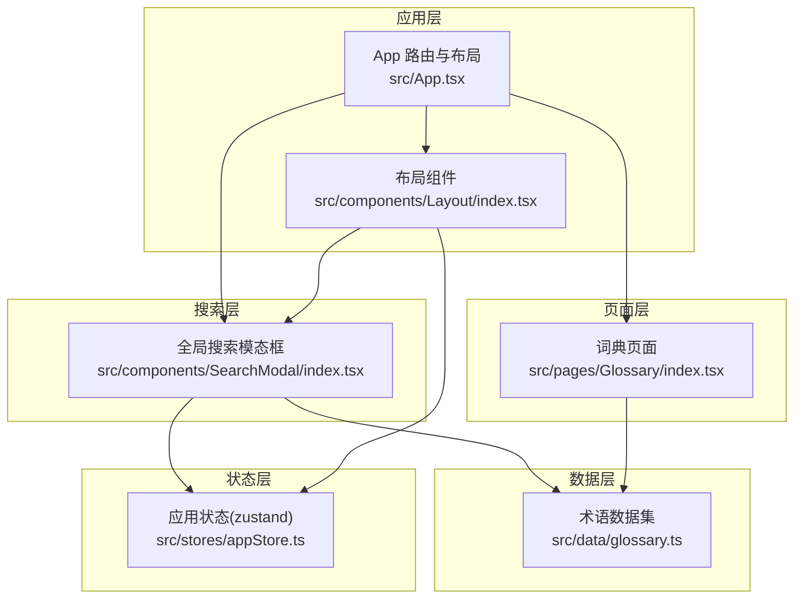
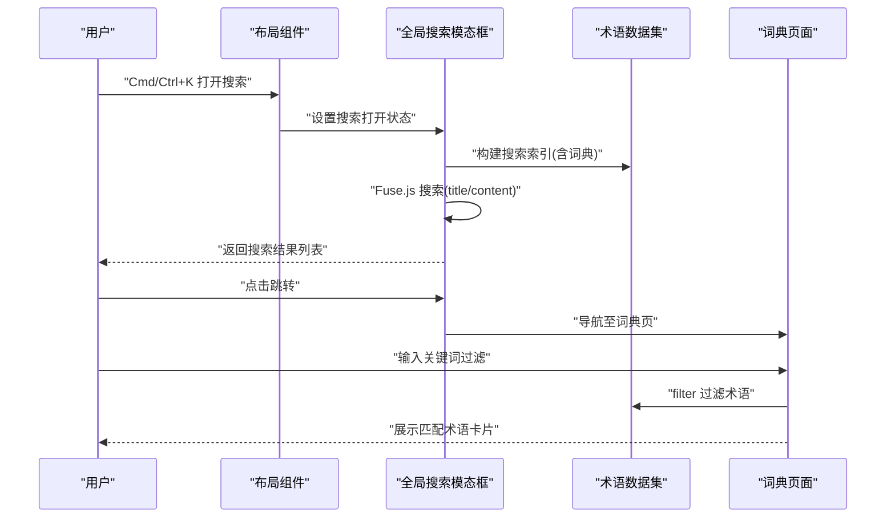
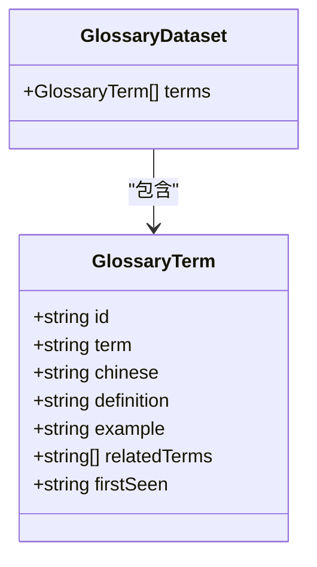
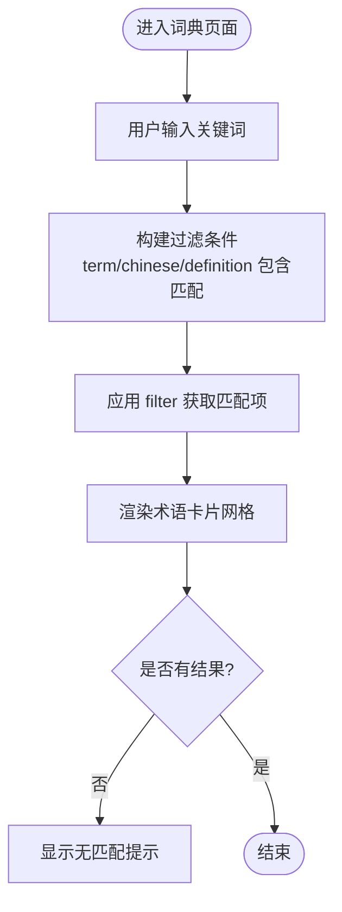
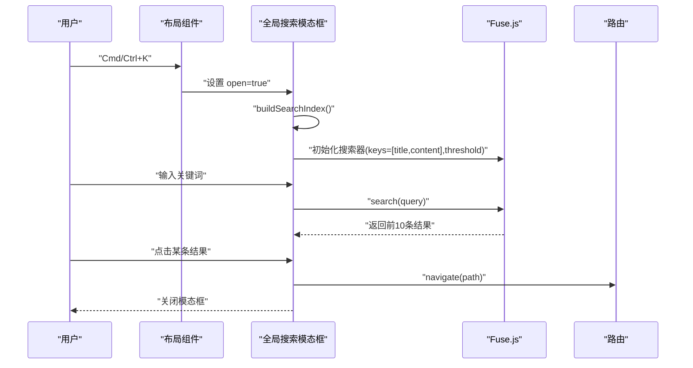
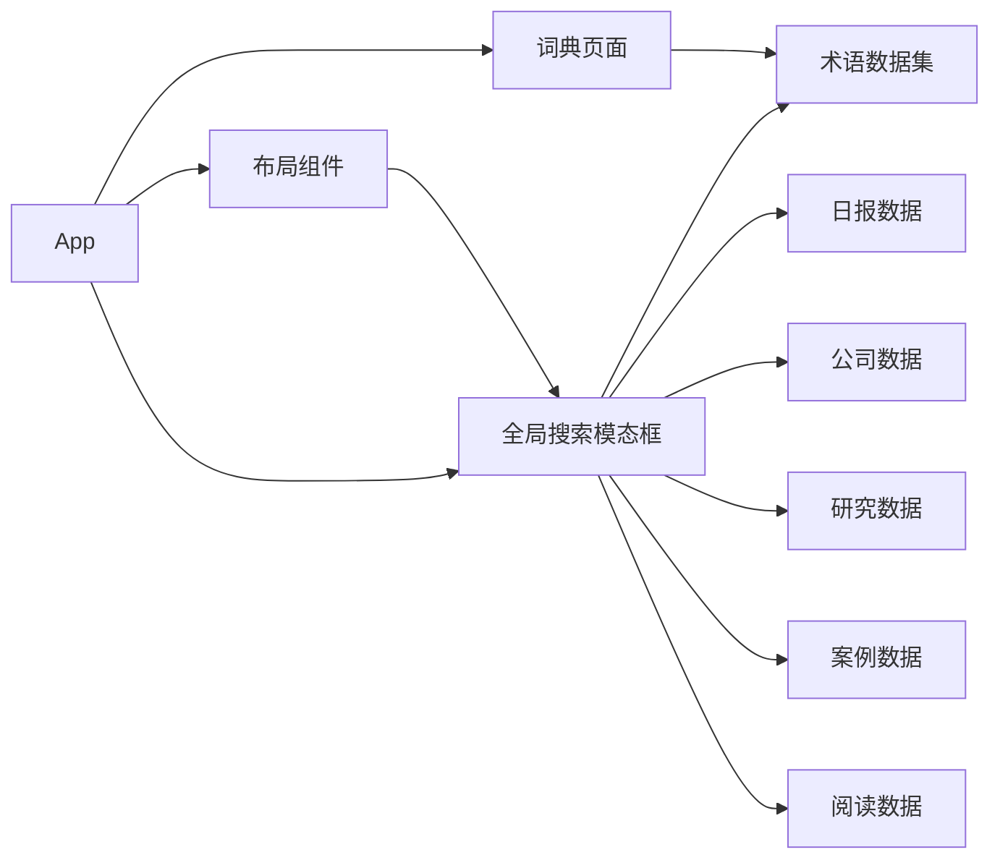

# HR词典模块

<cite>
**本文档引用的文件**
- [src/data/glossary.ts](file://src/data/glossary.ts)
- [src/pages/Glossary/index.tsx](file://src/pages/Glossary/index.tsx)
- [src/components/SearchModal/index.tsx](file://src/components/SearchModal/index.tsx)
- [src/components/TagFilter/index.tsx](file://src/components/TagFilter/index.tsx)
- [src/components/Layout/index.tsx](file://src/components/Layout/index.tsx)
- [src/App.tsx](file://src/App.tsx)
- [src/stores/appStore.ts](file://src/stores/appStore.ts)
</cite>

## 目录
1. [简介](#简介)
2. [项目结构](#项目结构)
3. [核心组件](#核心组件)
4. [架构总览](#架构总览)
5. [详细组件分析](#详细组件分析)
6. [依赖关系分析](#依赖关系分析)
7. [性能考虑](#性能考虑)
8. [故障排除指南](#故障排除指南)
9. [结论](#结论)
10. [附录](#附录)

## 简介
本文件为 HR 词典模块的详细技术文档，面向产品与工程团队，系统阐述该模块的数据模型、检索与展示机制、交互流程以及扩展建议。当前版本已实现 12 个 HR/组织新概念术语的中英对照与示例展示，并通过全局搜索与页面内搜索实现快速定位；同时预留了标签筛选、难度标识、字母索引等扩展点，便于后续迭代。

## 项目结构
HR 词典模块由以下层次构成：
- 数据层：术语数据集中存放于数据文件中，提供结构化术语集合。
- 页面层：词典页面负责渲染术语列表、处理查询过滤与展示细节。
- 搜索层：全局搜索模态框整合词典与其他内容，提供跨模块检索体验。
- 布局与路由：应用布局统一导航与快捷键触发，路由挂载词典页面。
- 状态层：应用状态管理用于控制搜索模态框开关与标签筛选状态。

**图表来源**
- [src/App.tsx:14-34](file://src/App.tsx#L14-L34)
- [src/components/Layout/index.tsx:11-20](file://src/components/Layout/index.tsx#L11-L20)
- [src/pages/Glossary/index.tsx:1-73](file://src/pages/Glossary/index.tsx#L1-L73)
- [src/components/SearchModal/index.tsx:47-156](file://src/components/SearchModal/index.tsx#L47-L156)
- [src/data/glossary.ts:1-17](file://src/data/glossary.ts#L1-L17)
- [src/stores/appStore.ts:1-92](file://src/stores/appStore.ts#L1-L92)

**章节来源**
- [src/App.tsx:14-34](file://src/App.tsx#L14-L34)
- [src/components/Layout/index.tsx:11-20](file://src/components/Layout/index.tsx#L11-L20)
- [src/pages/Glossary/index.tsx:1-73](file://src/pages/Glossary/index.tsx#L1-L73)
- [src/components/SearchModal/index.tsx:47-156](file://src/components/SearchModal/index.tsx#L47-L156)
- [src/data/glossary.ts:1-17](file://src/data/glossary.ts#L1-L17)
- [src/stores/appStore.ts:1-92](file://src/stores/appStore.ts#L1-L92)

## 核心组件
- 术语数据集：包含术语 ID、英文术语、中文释义、定义、使用示例、相关词条与首次出现日期等字段。
- 词典页面：提供页面内关键词搜索、术语卡片网格展示、示例与关联词条呈现。
- 全局搜索模态框：聚合词典与其他内容构建搜索索引，支持跨模块检索与高亮片段预览。
- 标签筛选组件：通用标签选择器，可用于后续扩展“难度”、“主题”等维度筛选。
- 应用状态：统一管理搜索模态框开关与标签筛选状态。

**章节来源**
- [src/data/glossary.ts:3-16](file://src/data/glossary.ts#L3-L16)
- [src/pages/Glossary/index.tsx:6-72](file://src/pages/Glossary/index.tsx#L6-L72)
- [src/components/SearchModal/index.tsx:47-156](file://src/components/SearchModal/index.tsx#L47-L156)
- [src/components/TagFilter/index.tsx:9-48](file://src/components/TagFilter/index.tsx#L9-L48)
- [src/stores/appStore.ts:25-81](file://src/stores/appStore.ts#L25-L81)

## 架构总览
词典模块遵循“数据驱动 + 组件化”的前端架构，页面组件通过状态与数据文件进行解耦，搜索组件通过独立索引提升跨模块检索效率。

**图表来源**
- [src/components/Layout/index.tsx:27-38](file://src/components/Layout/index.tsx#L27-L38)
- [src/components/SearchModal/index.tsx:47-73](file://src/components/SearchModal/index.tsx#L47-L73)
- [src/data/glossary.ts:3-16](file://src/data/glossary.ts#L3-L16)
- [src/pages/Glossary/index.tsx:6-11](file://src/pages/Glossary/index.tsx#L6-L11)

## 详细组件分析

### 术语数据模型
- 字段定义
  - id: 术语唯一标识
  - term: 英文术语
  - chinese: 中文释义
  - definition: 定义
  - example: 使用示例
  - relatedTerms: 相关词条数组
  - firstSeen: 首次出现日期
- 数据规模与复杂度
  - 当前包含 12 条术语，数据量小，内存占用低，filter 操作近似 O(n)。
- 关联关系
  - relatedTerms 用于建立术语间概念图谱，便于交叉阅读与知识网络构建。

**图表来源**
- [src/data/glossary.ts:3-16](file://src/data/glossary.ts#L3-L16)

**章节来源**
- [src/data/glossary.ts:3-16](file://src/data/glossary.ts#L3-L16)

### 词典页面（GlossaryPage）
- 功能要点
  - 页面内关键词搜索：支持英文术语、中文释义与定义的模糊匹配。
  - 术语卡片展示：包含中英对照标题、定义、示例与关联词条标签。
  - 动画与可访问性：使用动画库优化加载体验，输入框具备键盘焦点管理。
- 处理逻辑
  - 将输入查询转换为小写，分别在 term、chinese、definition 上进行包含判断。
  - 使用分帧动画逐项渲染，提升滚动流畅度。
- 展示细节
  - “示例”区域单独样式块突出使用场景。
  - 关联词条以标签形式展示，便于进一步探索。

**图表来源**
- [src/pages/Glossary/index.tsx:6-11](file://src/pages/Glossary/index.tsx#L6-L11)
- [src/pages/Glossary/index.tsx:35-72](file://src/pages/Glossary/index.tsx#L35-L72)

**章节来源**
- [src/pages/Glossary/index.tsx:6-72](file://src/pages/Glossary/index.tsx#L6-L72)

### 全局搜索模态框（SearchModal）
- 功能要点
  - 跨模块检索：将词典术语、日报信号、公司更新、研究论文、转型案例、阅读笔记统一构建索引。
  - 搜索算法：基于 Fuse.js 的模糊匹配，支持 title 与 content 键，阈值可调，返回前 10 条结果。
  - 结果高亮：展示匹配片段，增强定位感。
- 索引构建
  - 遍历各数据模块，组装为统一的 SearchItem 列表，其中词典条目以“英文 · 中文”组合标题。
- 交互流程
  - 通过布局组件绑定的快捷键打开模态框，自动聚焦输入框。
  - 点击结果触发路由跳转，关闭模态框。

**图表来源**
- [src/components/Layout/index.tsx:27-38](file://src/components/Layout/index.tsx#L27-L38)
- [src/components/SearchModal/index.tsx:22-45](file://src/components/SearchModal/index.tsx#L22-L45)
- [src/components/SearchModal/index.tsx:53-59](file://src/components/SearchModal/index.tsx#L53-L59)
- [src/components/SearchModal/index.tsx:69-73](file://src/components/SearchModal/index.tsx#L69-L73)

**章节来源**
- [src/components/SearchModal/index.tsx:22-45](file://src/components/SearchModal/index.tsx#L22-L45)
- [src/components/SearchModal/index.tsx:53-59](file://src/components/SearchModal/index.tsx#L53-L59)
- [src/components/SearchModal/index.tsx:69-73](file://src/components/SearchModal/index.tsx#L69-L73)

### 标签筛选组件（TagFilter）
- 功能要点
  - 接收 allTags 列表，渲染可切换的标签按钮。
  - 与应用状态联动，支持清除全部标签。
- 扩展建议
  - 可结合应用状态中的 activeTags 实现“难度”“主题”等维度的筛选联动。

**章节来源**
- [src/components/TagFilter/index.tsx:9-48](file://src/components/TagFilter/index.tsx#L9-L48)
- [src/stores/appStore.ts:29-81](file://src/stores/appStore.ts#L29-L81)

### 应用状态（appStore）
- 职责
  - 管理主题、用户角色、阅读历史、收藏、搜索模态框开关、标签筛选等状态。
- 与词典模块的关系
  - 词典页面通过数据文件直接消费术语集合，不依赖状态存储。
  - 全局搜索模态框与布局组件通过状态控制打开/关闭。

**章节来源**
- [src/stores/appStore.ts:5-33](file://src/stores/appStore.ts#L5-L33)
- [src/stores/appStore.ts:69-81](file://src/stores/appStore.ts#L69-L81)

## 依赖关系分析
- 组件耦合
  - 词典页面与术语数据文件为单向依赖，耦合度低，易于维护。
  - 全局搜索模态框依赖各数据模块构建索引，形成横向耦合，但通过统一接口隔离。
- 外部依赖
  - 动画：framer-motion
  - 搜索：fuse.js
  - 路由：react-router-dom
  - 状态：zustand(persist)
- 潜在循环依赖
  - 当前未发现循环依赖，数据文件仅被页面与搜索组件消费。

**图表来源**
- [src/pages/Glossary/index.tsx:4](file://src/pages/Glossary/index.tsx#L4)
- [src/components/SearchModal/index.tsx:6-11](file://src/components/SearchModal/index.tsx#L6-L11)
- [src/components/Layout/index.tsx:11-20](file://src/components/Layout/index.tsx#L11-L20)
- [src/App.tsx:14-34](file://src/App.tsx#L14-L34)

**章节来源**
- [src/pages/Glossary/index.tsx:4](file://src/pages/Glossary/index.tsx#L4)
- [src/components/SearchModal/index.tsx:6-11](file://src/components/SearchModal/index.tsx#L6-L11)
- [src/components/Layout/index.tsx:11-20](file://src/components/Layout/index.tsx#L11-L20)
- [src/App.tsx:14-34](file://src/App.tsx#L14-L34)

## 性能考虑
- 搜索性能
  - 词典页面内搜索：当前数据量小，filter 近似 O(n)，性能可接受；若术语数量增长，建议引入前端索引或服务端检索。
  - 全局搜索：Fuse.js 在构建索引时遍历多模块数据，建议按需懒加载或分批构建。
- 渲染性能
  - 词典页面使用分帧动画逐项渲染，有助于首屏与滚动体验；可考虑虚拟列表以应对大量术语。
- 存储与缓存
  - 应用状态持久化于本地存储，减少重复初始化成本；注意清理过期数据。

[本节为通用性能建议，无需特定文件引用]

## 故障排除指南
- 无法打开全局搜索
  - 检查布局组件是否正确绑定快捷键事件。
  - 确认状态 store 的 searchOpen 是否被正确设置。
- 搜索无结果
  - 确认 Fuse.js 初始化参数 keys 与阈值设置合理。
  - 检查 buildSearchIndex 是否包含词典数据。
- 词典页面无显示
  - 确认术语数据文件导出的数组非空。
  - 检查页面内搜索输入大小写与匹配逻辑。
- 样式异常
  - 检查主题状态与暗色模式类名是否正确应用。

**章节来源**
- [src/components/Layout/index.tsx:27-38](file://src/components/Layout/index.tsx#L27-L38)
- [src/stores/appStore.ts:69-71](file://src/stores/appStore.ts#L69-L71)
- [src/components/SearchModal/index.tsx:53-59](file://src/components/SearchModal/index.tsx#L53-L59)
- [src/components/SearchModal/index.tsx:41-43](file://src/components/SearchModal/index.tsx#L41-L43)
- [src/pages/Glossary/index.tsx:6-11](file://src/pages/Glossary/index.tsx#L6-L11)

## 结论
HR 词典模块以简洁的数据模型与清晰的组件职责实现了术语的中英对照展示与跨模块检索。当前版本满足基础需求，后续可在“难度标识、主题分类、字母索引、术语详情页、内容审核与贡献流程”等方面持续演进，以提升知识体系的组织性与可维护性。

[本节为总结性内容，无需特定文件引用]

## 附录

### 术语详情页面设计建议
- 多语言对照
  - 展示英文术语、中文释义与定义三列布局，保持视觉一致性。
- 使用示例
  - 分区块展示“HR 场景示例”“业务影响示例”，便于快速理解应用场景。
- 概念图谱
  - 基于 relatedTerms 建立双向链接，支持点击跳转与可视化图谱（如后续引入 D3 或 Mermaid）。
- 难度标识与主题分类
  - 引入难度等级（入门/进阶/专家）与主题标签，配合 TagFilter 实现筛选。
- 字母索引
  - 顶部添加 A-Z 索引栏，点击跳转至对应锚点，提升长列表可读性。

[本节为概念性设计建议，无需特定文件引用]

### 术语维护流程与内容审核机制
- 维护流程
  - 新增/修改术语：在数据文件中提交 PR，包含英文术语、中文释义、定义、示例与相关词条。
  - 版本记录：firstSeen 字段用于追踪术语上线时间，便于回顾与审计。
- 内容审核
  - 建议引入“反方信号/多源基线”机制：每条术语至少提供一个反面观点或多方来源佐证，降低单一视角偏见。
- 用户贡献
  - 提供表单收集用户建议，后台以评论/工单形式流转至编辑团队；贡献者可匿名或署名。
- 质量保障
  - 建立术语命名规范与示例模板，统一风格；定期复核过时术语。

[本节为流程与机制建议，无需特定文件引用]