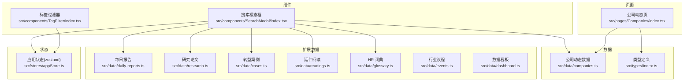
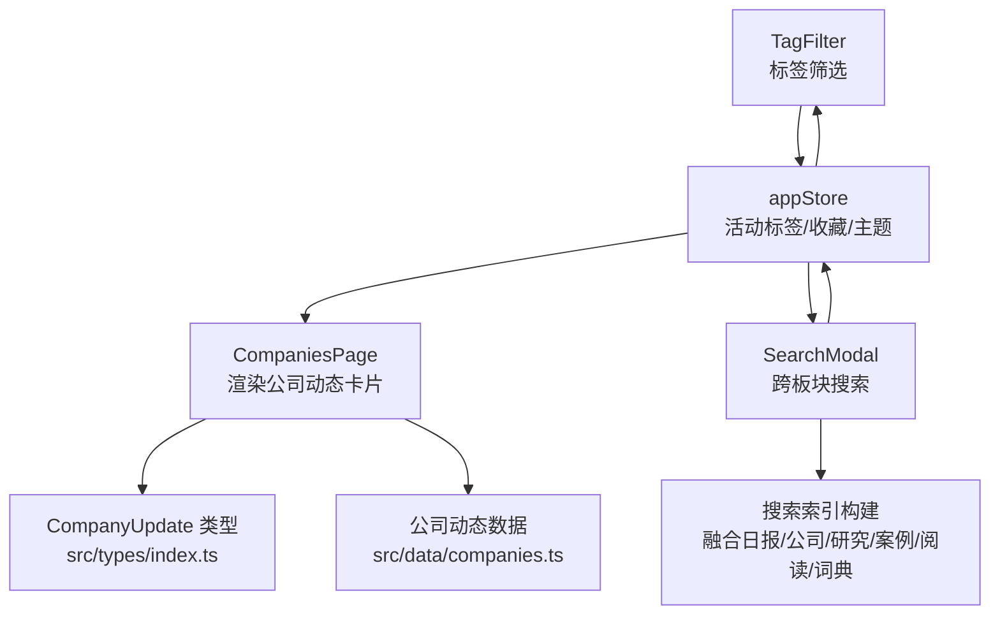
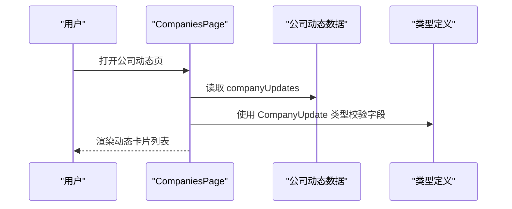
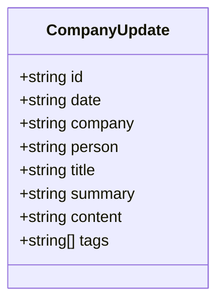
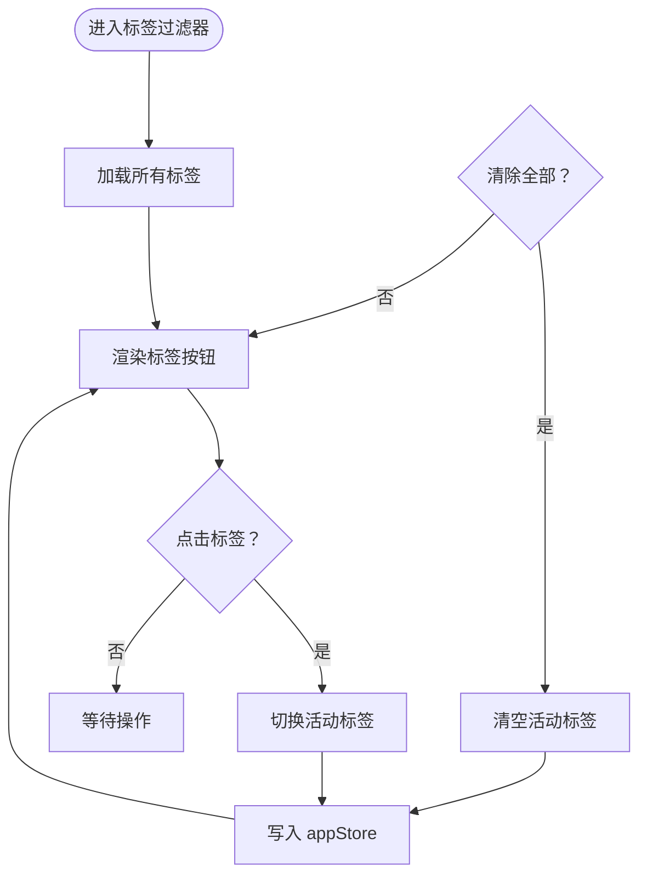
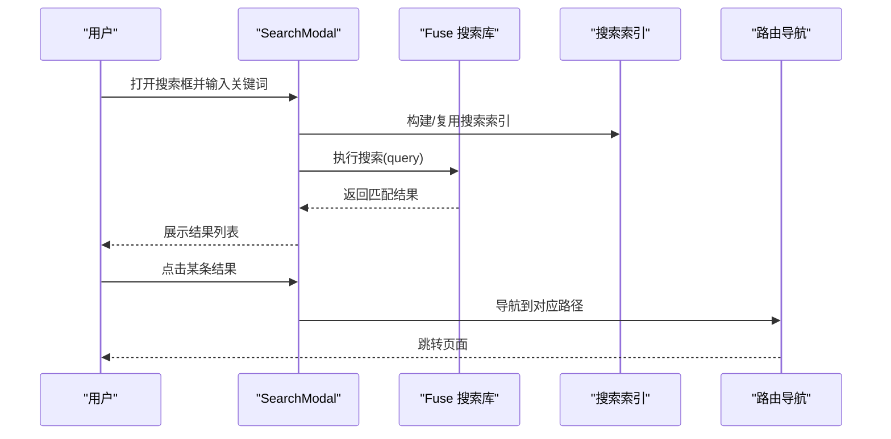
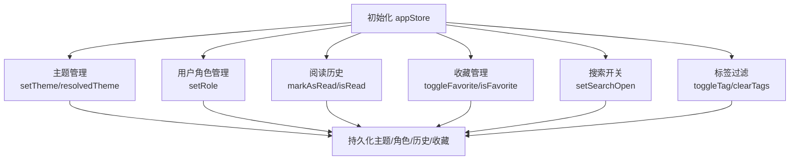
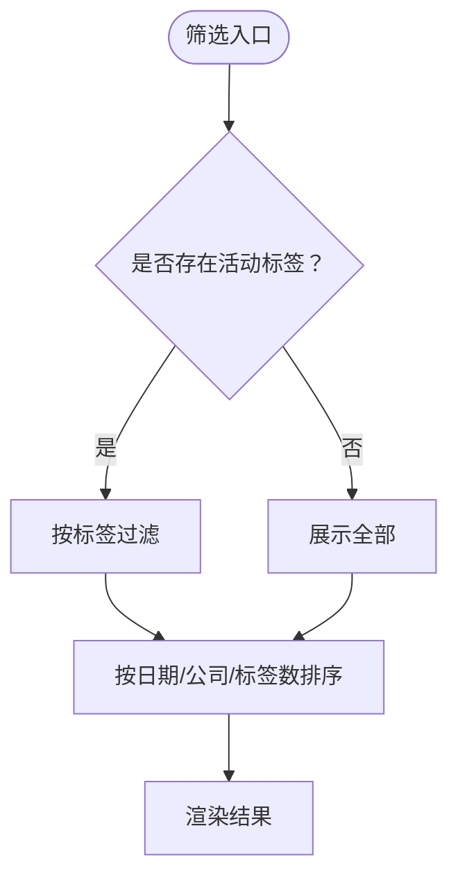
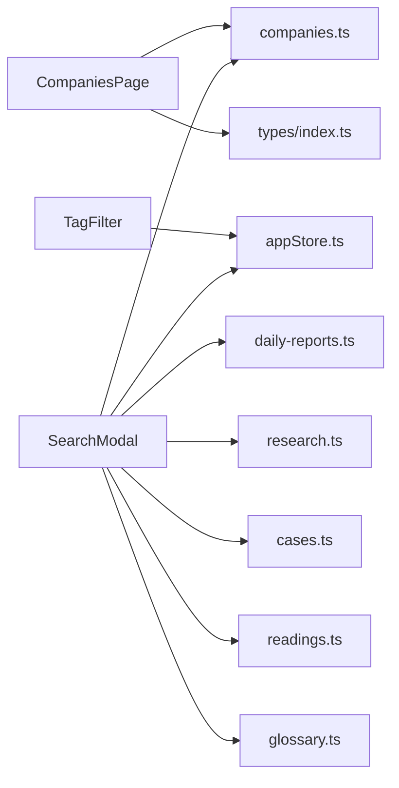

# 公司追踪模块

<cite>
**本文引用的文件**
- [src/pages/Companies/index.tsx](file://src/pages/Companies/index.tsx)
- [src/data/companies.ts](file://src/data/companies.ts)
- [src/types/index.ts](file://src/types/index.ts)
- [src/components/TagFilter/index.tsx](file://src/components/TagFilter/index.tsx)
- [src/stores/appStore.ts](file://src/stores/appStore.ts)
- [src/components/SearchModal/index.tsx](file://src/components/SearchModal/index.tsx)
- [src/data/daily-reports.ts](file://src/data/daily-reports.ts)
- [src/data/research.ts](file://src/data/research.ts)
- [src/data/cases.ts](file://src/data/cases.ts)
- [src/data/readings.ts](file://src/data/readings.ts)
- [src/data/glossary.ts](file://src/data/glossary.ts)
- [src/data/events.ts](file://src/data/events.ts)
- [src/data/dashboard.ts](file://src/data/dashboard.ts)
</cite>

## 目录
1. [简介](#简介)
2. [项目结构](#项目结构)
3. [核心组件](#核心组件)
4. [架构总览](#架构总览)
5. [详细组件分析](#详细组件分析)
6. [依赖关系分析](#依赖关系分析)
7. [性能考量](#性能考量)
8. [故障排查指南](#故障排查指南)
9. [结论](#结论)
10. [附录](#附录)

## 简介
本模块围绕“公司与关键人”动态监控展开，提供公司信息聚合、关键事件追踪与高管言论监测。系统以数据驱动的方式，将来自多源的公司动态（如产品发布、组织架构变化、高管发言等）进行结构化存储与可视化呈现，并辅以标签筛选、全局搜索、用户偏好与收藏等交互能力，帮助读者快速掌握重点公司与事件的演进脉络。

## 项目结构
- 页面层：公司动态列表页负责渲染公司更新卡片，展示标题、摘要、标签与元信息。
- 数据层：公司动态数据与类型定义集中于 data 与 types 目录，便于统一维护与扩展。
- 组件层：标签过滤器与搜索模态框提供筛选与检索能力；应用状态通过 Zustand store 管理主题、收藏、阅读历史与活动标签。
- 扩展数据：每日报告、研究论文、转型案例、延伸阅读、词典术语、行业议程与数据看板为公司追踪提供背景支撑与交叉印证。

图表来源
- [src/pages/Companies/index.tsx:1-69](file://src/pages/Companies/index.tsx#L1-L69)
- [src/data/companies.ts:1-53](file://src/data/companies.ts#L1-L53)
- [src/types/index.ts:65-75](file://src/types/index.ts#L65-L75)
- [src/components/TagFilter/index.tsx:1-49](file://src/components/TagFilter/index.tsx#L1-L49)
- [src/stores/appStore.ts:1-93](file://src/stores/appStore.ts#L1-L93)
- [src/components/SearchModal/index.tsx:1-156](file://src/components/SearchModal/index.tsx#L1-L156)
- [src/data/daily-reports.ts:1-455](file://src/data/daily-reports.ts#L1-L455)
- [src/data/research.ts:1-56](file://src/data/research.ts#L1-L56)
- [src/data/cases.ts:1-63](file://src/data/cases.ts#L1-L63)
- [src/data/readings.ts:1-133](file://src/data/readings.ts#L1-L133)
- [src/data/glossary.ts:1-17](file://src/data/glossary.ts#L1-L17)
- [src/data/events.ts:1-13](file://src/data/events.ts#L1-L13)
- [src/data/dashboard.ts:1-79](file://src/data/dashboard.ts#L1-L79)

章节来源
- [src/pages/Companies/index.tsx:1-69](file://src/pages/Companies/index.tsx#L1-L69)
- [src/data/companies.ts:1-53](file://src/data/companies.ts#L1-L53)
- [src/types/index.ts:65-75](file://src/types/index.ts#L65-L75)
- [src/components/TagFilter/index.tsx:1-49](file://src/components/TagFilter/index.tsx#L1-L49)
- [src/stores/appStore.ts:1-93](file://src/stores/appStore.ts#L1-L93)
- [src/components/SearchModal/index.tsx:1-156](file://src/components/SearchModal/index.tsx#L1-L156)
- [src/data/daily-reports.ts:1-455](file://src/data/daily-reports.ts#L1-L455)
- [src/data/research.ts:1-56](file://src/data/research.ts#L1-L56)
- [src/data/cases.ts:1-63](file://src/data/cases.ts#L1-L63)
- [src/data/readings.ts:1-133](file://src/data/readings.ts#L1-L133)
- [src/data/glossary.ts:1-17](file://src/data/glossary.ts#L1-L17)
- [src/data/events.ts:1-13](file://src/data/events.ts#L1-L13)
- [src/data/dashboard.ts:1-79](file://src/data/dashboard.ts#L1-L79)

## 核心组件
- 公司动态页：负责渲染公司更新列表，展示标题、公司/关键人、日期、摘要与标签，并根据公司名称映射颜色。
- 公司数据模型：定义公司更新的字段结构，包括标识、日期、公司、关键人物、标题、摘要、正文与标签。
- 标签过滤器：基于全局状态切换标签筛选，支持清除全部标签。
- 搜索模态框：构建跨板块的搜索索引（日报信号、公司动态、研究论文、转型案例、延伸阅读、词典术语），提供模糊匹配与结果导航。
- 应用状态：管理主题、用户角色、阅读历史、收藏、搜索开关与活动标签集合，持久化部分状态。

章节来源
- [src/pages/Companies/index.tsx:13-68](file://src/pages/Companies/index.tsx#L13-L68)
- [src/types/index.ts:65-75](file://src/types/index.ts#L65-L75)
- [src/components/TagFilter/index.tsx:9-48](file://src/components/TagFilter/index.tsx#L9-L48)
- [src/stores/appStore.ts:5-92](file://src/stores/appStore.ts#L5-L92)
- [src/components/SearchModal/index.tsx:22-72](file://src/components/SearchModal/index.tsx#L22-L72)

## 架构总览
公司追踪模块采用“页面-数据-组件-状态”的分层架构：
- 页面层：CompaniesPage 读取本地数据并渲染卡片。
- 数据层：types 定义数据模型，data 提供静态数据。
- 组件层：TagFilter 与 SearchModal 提供筛选与检索入口。
- 状态层：appStore 统一管理用户偏好与筛选状态。

图表来源
- [src/pages/Companies/index.tsx:13-68](file://src/pages/Companies/index.tsx#L13-L68)
- [src/types/index.ts:65-75](file://src/types/index.ts#L65-L75)
- [src/data/companies.ts:1-53](file://src/data/companies.ts#L1-L53)
- [src/components/TagFilter/index.tsx:9-48](file://src/components/TagFilter/index.tsx#L9-L48)
- [src/stores/appStore.ts:5-92](file://src/stores/appStore.ts#L5-L92)
- [src/components/SearchModal/index.tsx:22-72](file://src/components/SearchModal/index.tsx#L22-L72)

## 详细组件分析

### 公司动态页（CompaniesPage）
- 职责：展示公司更新列表，逐条渲染卡片，包含标题、公司/关键人、日期、摘要与标签。
- 设计要点：使用动画库实现入场动画；根据公司名称映射颜色；支持关键人图标与日期图标。
- 数据来源：companyUpdates 数组。
- 交互：无页面内交互，点击卡片不跳转（当前实现）。

图表来源
- [src/pages/Companies/index.tsx:13-68](file://src/pages/Companies/index.tsx#L13-L68)
- [src/data/companies.ts:3-52](file://src/data/companies.ts#L3-L52)
- [src/types/index.ts:65-75](file://src/types/index.ts#L65-L75)

章节来源
- [src/pages/Companies/index.tsx:13-68](file://src/pages/Companies/index.tsx#L13-L68)
- [src/data/companies.ts:1-53](file://src/data/companies.ts#L1-L53)
- [src/types/index.ts:65-75](file://src/types/index.ts#L65-L75)

### 公司数据模型（CompanyUpdate）
- 字段：id、date、company、person（可选）、title、summary、content、tags（数组）。
- 用途：统一公司动态的数据结构，便于渲染与筛选。
- 扩展：若需财务状况、组织架构变化、技术里程碑等字段，可在现有结构基础上新增字段或拆分子结构。

图表来源
- [src/types/index.ts:65-75](file://src/types/index.ts#L65-L75)

章节来源
- [src/types/index.ts:65-75](file://src/types/index.ts#L65-L75)

### 标签过滤器（TagFilter）
- 职责：展示所有可用标签，支持点击切换激活状态，支持一键清除。
- 状态：依赖 appStore 的 activeTags、toggleTag、clearTags。
- 交互：使用动画库增强按钮反馈。

图表来源
- [src/components/TagFilter/index.tsx:9-48](file://src/components/TagFilter/index.tsx#L9-L48)
- [src/stores/appStore.ts:30-80](file://src/stores/appStore.ts#L30-L80)

章节来源
- [src/components/TagFilter/index.tsx:9-48](file://src/components/TagFilter/index.tsx#L9-L48)
- [src/stores/appStore.ts:30-80](file://src/stores/appStore.ts#L30-L80)

### 搜索模态框（SearchModal）
- 职责：构建跨板块搜索索引，提供输入即搜、高亮匹配片段与结果导航。
- 索引构建：融合日报信号、公司动态、研究论文、转型案例、延伸阅读、词典术语。
- 算法：使用模糊搜索库进行全文检索，设置阈值与匹配返回数量。
- 导航：点击结果跳转至对应路径。

图表来源
- [src/components/SearchModal/index.tsx:22-72](file://src/components/SearchModal/index.tsx#L22-L72)
- [src/components/SearchModal/index.tsx:74-155](file://src/components/SearchModal/index.tsx#L74-L155)

章节来源
- [src/components/SearchModal/index.tsx:22-72](file://src/components/SearchModal/index.tsx#L22-L72)
- [src/components/SearchModal/index.tsx:74-155](file://src/components/SearchModal/index.tsx#L74-L155)

### 应用状态（appStore）
- 主题：light/dark/system，支持解析主题并持久化。
- 用户角色：chro/hrbp/learner/od。
- 阅读历史：标记已读、查询是否已读。
- 收藏：添加/移除收藏、查询是否收藏。
- 搜索：打开/关闭搜索模态框。
- 标签：活动标签集合、切换与清空。

图表来源
- [src/stores/appStore.ts:5-92](file://src/stores/appStore.ts#L5-L92)

章节来源
- [src/stores/appStore.ts:5-92](file://src/stores/appStore.ts#L5-L92)

### 公司筛选与排序机制
- 现状：当前页面未实现筛选与排序逻辑，仅渲染全部数据。
- 建议实现：
  - 筛选：基于 activeTags 过滤公司动态；支持多标签交集/并集策略。
  - 排序：按日期倒序、公司名、标签数量等维度排序。
  - 行业/规模/阶段：可在 CompanyUpdate 中扩展行业、规模、发展阶段字段后实现。

图表来源
- [src/components/TagFilter/index.tsx:9-48](file://src/components/TagFilter/index.tsx#L9-L48)
- [src/stores/appStore.ts:30-80](file://src/stores/appStore.ts#L30-L80)
- [src/pages/Companies/index.tsx:24-64](file://src/pages/Companies/index.tsx#L24-L64)

章节来源
- [src/components/TagFilter/index.tsx:9-48](file://src/components/TagFilter/index.tsx#L9-L48)
- [src/stores/appStore.ts:30-80](file://src/stores/appStore.ts#L30-L80)
- [src/pages/Companies/index.tsx:24-64](file://src/pages/Companies/index.tsx#L24-L64)

### 公司详情页面交互设计（建议）
- 历史记录：展示该公司的过往动态时间轴，支持按日期/重要性排序。
- 相关新闻：链接到研究论文、转型案例、延伸阅读中与该公司相关的条目。
- 竞品对比：列出同行业/同发展阶段的公司动态，进行横向对比分析。
- 交互元素：收藏、分享、导出、评论（可选）。

[本节为概念性设计，不直接分析具体文件，故无章节来源]

### 公司数据更新流程、验证规则与缓存策略（建议）
- 更新流程：定期从多源采集（如新闻、公告、研究、行业报告），经清洗与标准化后入库。
- 验证规则：必填字段校验、日期格式校验、标签去重、重复检测（基于标题/摘要相似度）。
- 缓存策略：前端可采用内存缓存（短期）、localStorage（长期）、IndexedDB（大数据量）；后端可采用 Redis 缓存热点数据与搜索索引。

[本节为通用实现建议，不直接分析具体文件，故无章节来源]

## 依赖关系分析
- CompaniesPage 依赖 companyUpdates 与类型定义。
- TagFilter 依赖 appStore 的标签状态。
- SearchModal 依赖 appStore 的搜索开关，构建跨板块索引并导航。
- 扩展数据（日报、研究、案例、阅读、词典、议程、看板）为公司追踪提供背景与交叉印证。

图表来源
- [src/pages/Companies/index.tsx:13-68](file://src/pages/Companies/index.tsx#L13-L68)
- [src/data/companies.ts:1-53](file://src/data/companies.ts#L1-L53)
- [src/types/index.ts:65-75](file://src/types/index.ts#L65-L75)
- [src/components/TagFilter/index.tsx:9-48](file://src/components/TagFilter/index.tsx#L9-L48)
- [src/stores/appStore.ts:5-92](file://src/stores/appStore.ts#L5-L92)
- [src/components/SearchModal/index.tsx:22-72](file://src/components/SearchModal/index.tsx#L22-L72)
- [src/data/daily-reports.ts:1-455](file://src/data/daily-reports.ts#L1-L455)
- [src/data/research.ts:1-56](file://src/data/research.ts#L1-L56)
- [src/data/cases.ts:1-63](file://src/data/cases.ts#L1-L63)
- [src/data/readings.ts:1-133](file://src/data/readings.ts#L1-L133)
- [src/data/glossary.ts:1-17](file://src/data/glossary.ts#L1-L17)

章节来源
- [src/pages/Companies/index.tsx:13-68](file://src/pages/Companies/index.tsx#L13-L68)
- [src/data/companies.ts:1-53](file://src/data/companies.ts#L1-L53)
- [src/types/index.ts:65-75](file://src/types/index.ts#L65-L75)
- [src/components/TagFilter/index.tsx:9-48](file://src/components/TagFilter/index.tsx#L9-L48)
- [src/stores/appStore.ts:5-92](file://src/stores/appStore.ts#L5-L92)
- [src/components/SearchModal/index.tsx:22-72](file://src/components/SearchModal/index.tsx#L22-L72)
- [src/data/daily-reports.ts:1-455](file://src/data/daily-reports.ts#L1-L455)
- [src/data/research.ts:1-56](file://src/data/research.ts#L1-L56)
- [src/data/cases.ts:1-63](file://src/data/cases.ts#L1-L63)
- [src/data/readings.ts:1-133](file://src/data/readings.ts#L1-L133)
- [src/data/glossary.ts:1-17](file://src/data/glossary.ts#L1-L17)

## 性能考量
- 渲染性能：列表项使用动画入场，建议在数据量较大时启用虚拟滚动。
- 搜索性能：索引构建与搜索阈值可调；建议对搜索结果数量限制与防抖处理。
- 状态持久化：仅持久化必要字段，避免存储过大对象。
- 数据体积：扩展字段时注意字段冗余与压缩策略。

[本节提供一般性指导，不直接分析具体文件，故无章节来源]

## 故障排查指南
- 标签筛选无效：检查 appStore 的 activeTags 是否正确更新，确认 TagFilter 的点击事件与状态联动。
- 搜索无结果：确认搜索索引构建函数是否包含所需板块数据，检查阈值与匹配字段。
- 页面空白：检查 CompanyUpdate 类型与数据字段一致性，确保必填字段完整。
- 主题切换异常：确认主题解析逻辑与 DOM 类名切换。

章节来源
- [src/stores/appStore.ts:30-80](file://src/stores/appStore.ts#L30-L80)
- [src/components/TagFilter/index.tsx:9-48](file://src/components/TagFilter/index.tsx#L9-L48)
- [src/components/SearchModal/index.tsx:22-72](file://src/components/SearchModal/index.tsx#L22-L72)
- [src/types/index.ts:65-75](file://src/types/index.ts#L65-L75)

## 结论
公司追踪模块以简洁的数据模型与直观的页面渲染为核心，结合标签过滤与全局搜索，形成从“信息聚合—筛选—检索—阅读”的闭环。建议后续在页面层引入筛选与排序、在数据层扩展公司维度字段（行业/规模/阶段/财务/组织/技术里程碑），并在状态层完善用户偏好与个性化推荐，以进一步提升追踪效率与决策价值。

## 附录
- 扩展数据用途概览：
  - 每日报告：提供宏观趋势与信号背景。
  - 研究论文：提供理论依据与 HR 启示。
  - 转型案例：提供实践参考与 HR 教训。
  - 延伸阅读：提供深度解读与编辑点评。
  - 词典术语：统一关键概念口径。
  - 行业议程：提供线下活动与关注点。
  - 数据看板：提供宏观指标与趋势。

章节来源
- [src/data/daily-reports.ts:1-455](file://src/data/daily-reports.ts#L1-L455)
- [src/data/research.ts:1-56](file://src/data/research.ts#L1-L56)
- [src/data/cases.ts:1-63](file://src/data/cases.ts#L1-L63)
- [src/data/readings.ts:1-133](file://src/data/readings.ts#L1-L133)
- [src/data/glossary.ts:1-17](file://src/data/glossary.ts#L1-L17)
- [src/data/events.ts:1-13](file://src/data/events.ts#L1-L13)
- [src/data/dashboard.ts:1-79](file://src/data/dashboard.ts#L1-L79)