# 功能模块

<cite>
**本文引用的文件**
- [src/pages/DailyReport/index.tsx](file://src/pages/DailyReport/index.tsx)
- [src/data/daily-reports.ts](file://src/data/daily-reports.ts)
- [src/components/SignalCard/index.tsx](file://src/components/SignalCard/index.tsx)
- [src/pages/Companies/index.tsx](file://src/pages/Companies/index.tsx)
- [src/data/companies.ts](file://src/data/companies.ts)
- [src/pages/Research/index.tsx](file://src/pages/Research/index.tsx)
- [src/data/research.ts](file://src/data/research.ts)
- [src/pages/Cases/index.tsx](file://src/pages/Cases/index.tsx)
- [src/data/cases.ts](file://src/data/cases.ts)
- [src/pages/Readings/index.tsx](file://src/pages/Readings/index.tsx)
- [src/data/readings.ts](file://src/data/readings.ts)
- [src/pages/Glossary/index.tsx](file://src/pages/Glossary/index.tsx)
- [src/data/glossary.ts](file://src/data/glossary.ts)
- [src/pages/Dashboard/index.tsx](file://src/pages/Dashboard/index.tsx)
- [src/data/dashboard.ts](file://src/data/dashboard.ts)
- [src/pages/Events/index.tsx](file://src/pages/Events/index.tsx)
- [src/data/events.ts](file://src/data/events.ts)
</cite>

## 目录
1. [引言](#引言)
2. [项目结构](#项目结构)
3. [核心组件](#核心组件)
4. [架构总览](#架构总览)
5. [详细组件分析](#详细组件分析)
6. [依赖关系分析](#依赖关系分析)
7. [性能考量](#性能考量)
8. [故障排查指南](#故障排查指南)
9. [结论](#结论)
10. [附录](#附录)

## 引言
本文件面向“未来组织·HR洞察日报”平台的8大核心功能模块，系统阐述其设计目标、核心功能与用户交互流程，并结合现有数据结构与页面实现，给出模块间的数据关联、用户路径设计与个性化推荐机制的落地建议。同时提供模块扩展指南与新功能开发流程，帮助产品与研发团队高效迭代。

## 项目结构
平台采用按页面与数据分层的组织方式：
- 页面层：各模块对应独立页面，负责渲染与交互（如每日日报、公司追踪、研究报告、转型案例、延伸阅读、HR词典、数据看板、行业议程）。
- 数据层：各模块对应独立数据文件，提供静态数据与类型定义，便于维护与扩展。
- 组件层：共享组件（如信号卡片、布局、标签过滤器等）用于统一风格与交互。

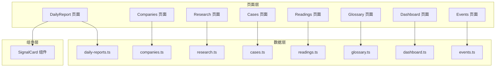

图表来源
- [src/pages/DailyReport/index.tsx:1-122](file://src/pages/DailyReport/index.tsx#L1-L122)
- [src/pages/Companies/index.tsx:1-69](file://src/pages/Companies/index.tsx#L1-L69)
- [src/pages/Research/index.tsx:1-92](file://src/pages/Research/index.tsx#L1-L92)
- [src/pages/Cases/index.tsx:1-96](file://src/pages/Cases/index.tsx#L1-L96)
- [src/pages/Readings/index.tsx:1-56](file://src/pages/Readings/index.tsx#L1-L56)
- [src/pages/Glossary/index.tsx:1-73](file://src/pages/Glossary/index.tsx#L1-L73)
- [src/pages/Dashboard/index.tsx:1-82](file://src/pages/Dashboard/index.tsx#L1-L82)
- [src/pages/Events/index.tsx:1-94](file://src/pages/Events/index.tsx#L1-L94)
- [src/data/daily-reports.ts:1-203](file://src/data/daily-reports.ts#L1-L203)
- [src/data/companies.ts:1-53](file://src/data/companies.ts#L1-L53)
- [src/data/research.ts:1-53](file://src/data/research.ts#L1-L53)
- [src/data/cases.ts:1-63](file://src/data/cases.ts#L1-L63)
- [src/data/readings.ts:1-33](file://src/data/readings.ts#L1-L33)
- [src/data/glossary.ts:1-17](file://src/data/glossary.ts#L1-L17)
- [src/data/dashboard.ts:1-79](file://src/data/dashboard.ts#L1-L79)
- [src/data/events.ts:1-13](file://src/data/events.ts#L1-L13)
- [src/components/SignalCard/index.tsx](file://src/components/SignalCard/index.tsx)

章节来源
- [src/pages/DailyReport/index.tsx:1-122](file://src/pages/DailyReport/index.tsx#L1-L122)
- [src/pages/Companies/index.tsx:1-69](file://src/pages/Companies/index.tsx#L1-L69)
- [src/pages/Research/index.tsx:1-92](file://src/pages/Research/index.tsx#L1-L92)
- [src/pages/Cases/index.tsx:1-96](file://src/pages/Cases/index.tsx#L1-L96)
- [src/pages/Readings/index.tsx:1-56](file://src/pages/Readings/index.tsx#L1-L56)
- [src/pages/Glossary/index.tsx:1-73](file://src/pages/Glossary/index.tsx#L1-L73)
- [src/pages/Dashboard/index.tsx:1-82](file://src/pages/Dashboard/index.tsx#L1-L82)
- [src/pages/Events/index.tsx:1-94](file://src/pages/Events/index.tsx#L1-L94)

## 核心组件
- 每日日报：提供多日期、多会话（上午基线/PM精读/自动版/可视化）的日报聚合，含信号与行动速查。
- 公司追踪：展示重点公司与关键人的动态，支持按日期排序与标签筛选。
- 研究报告：收录权威来源的研究摘要、核心发现与HR启示，支持展开查看。
- 转型案例：沉淀AI转型成功/失败/混合案例，提炼HR启示与可复用经验。
- 延伸阅读：呈现英文原文、中文翻译与编辑导读，突出关键摘录。
- HR词典：术语检索与释义，支持中英文关键词搜索与示例、关联术语。
- 数据看板：关键指标卡片与趋势图，提供更新时间与变化趋势。
- 行业议程：活动日历，标注日期、地点、相关性与倒计时。

章节来源
- [src/pages/DailyReport/index.tsx:21-122](file://src/pages/DailyReport/index.tsx#L21-L122)
- [src/pages/Companies/index.tsx:13-69](file://src/pages/Companies/index.tsx#L13-L69)
- [src/pages/Research/index.tsx:12-92](file://src/pages/Research/index.tsx#L12-L92)
- [src/pages/Cases/index.tsx:11-96](file://src/pages/Cases/index.tsx#L11-L96)
- [src/pages/Readings/index.tsx:5-56](file://src/pages/Readings/index.tsx#L5-L56)
- [src/pages/Glossary/index.tsx:6-73](file://src/pages/Glossary/index.tsx#L6-L73)
- [src/pages/Dashboard/index.tsx:6-82](file://src/pages/Dashboard/index.tsx#L6-L82)
- [src/pages/Events/index.tsx:18-94](file://src/pages/Events/index.tsx#L18-L94)

## 架构总览
模块间通过数据文件与页面组件解耦，形成“页面-数据-组件”的清晰分层。页面负责UI与交互，数据文件提供结构化数据，组件负责可复用UI元素。模块间无直接运行时依赖，通过URL路由与导航进行串联，形成完整的用户路径。

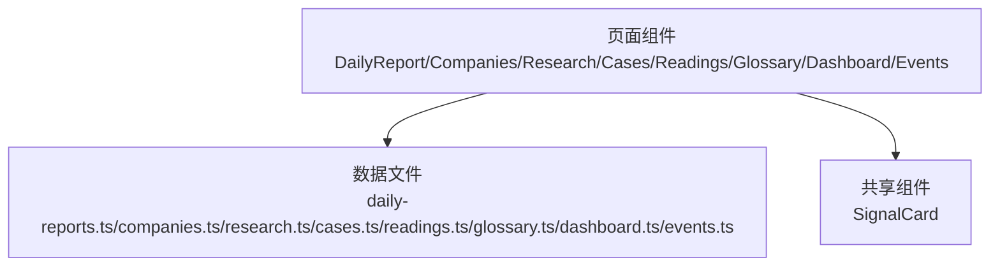

图表来源
- [src/pages/DailyReport/index.tsx:1-122](file://src/pages/DailyReport/index.tsx#L1-L122)
- [src/pages/Companies/index.tsx:1-69](file://src/pages/Companies/index.tsx#L1-L69)
- [src/pages/Research/index.tsx:1-92](file://src/pages/Research/index.tsx#L1-L92)
- [src/pages/Cases/index.tsx:1-96](file://src/pages/Cases/index.tsx#L1-L96)
- [src/pages/Readings/index.tsx:1-56](file://src/pages/Readings/index.tsx#L1-L56)
- [src/pages/Glossary/index.tsx:1-73](file://src/pages/Glossary/index.tsx#L1-L73)
- [src/pages/Dashboard/index.tsx:1-82](file://src/pages/Dashboard/index.tsx#L1-L82)
- [src/pages/Events/index.tsx:1-94](file://src/pages/Events/index.tsx#L1-L94)
- [src/data/daily-reports.ts:1-203](file://src/data/daily-reports.ts#L1-L203)
- [src/data/companies.ts:1-53](file://src/data/companies.ts#L1-L53)
- [src/data/research.ts:1-53](file://src/data/research.ts#L1-L53)
- [src/data/cases.ts:1-63](file://src/data/cases.ts#L1-L63)
- [src/data/readings.ts:1-33](file://src/data/readings.ts#L1-L33)
- [src/data/glossary.ts:1-17](file://src/data/glossary.ts#L1-L17)
- [src/data/dashboard.ts:1-79](file://src/data/dashboard.ts#L1-L79)
- [src/data/events.ts:1-13](file://src/data/events.ts#L1-L13)
- [src/components/SignalCard/index.tsx](file://src/components/SignalCard/index.tsx)

## 详细组件分析

### 模块一：每日日报（深度趋势分析）
- 设计目标：提供每日约3000字的深度报告，包含3条核心信号与HR行动速查，覆盖多来源、多维度的洞察。
- 核心功能：
  - 多日期选择与多会话展示（上午基线/PM精读/自动版/可视化）。
  - 信号卡片展示（含优先级、标签、来源类型、相关公司）。
  - 行动速查表格（优先级、行动、时间窗）。
  - 信源覆盖统计与达标状态。
- 用户交互流程：
  - 选择日期 → 查看当日报告 → 展开信号详情 → 查看行动速查 → 跳转相关来源或公司。
- 数据关联：
  - 页面依赖日报数据文件，信号与行动均来自同一数据对象。
  - 信号卡片组件复用，统一展示样式与交互。
- 个性化推荐机制建议：
  - 基于用户历史点击与标签偏好，推荐相关信号与行动项。
  - 支持“仅看高优先级”筛选，或按来源类型过滤。

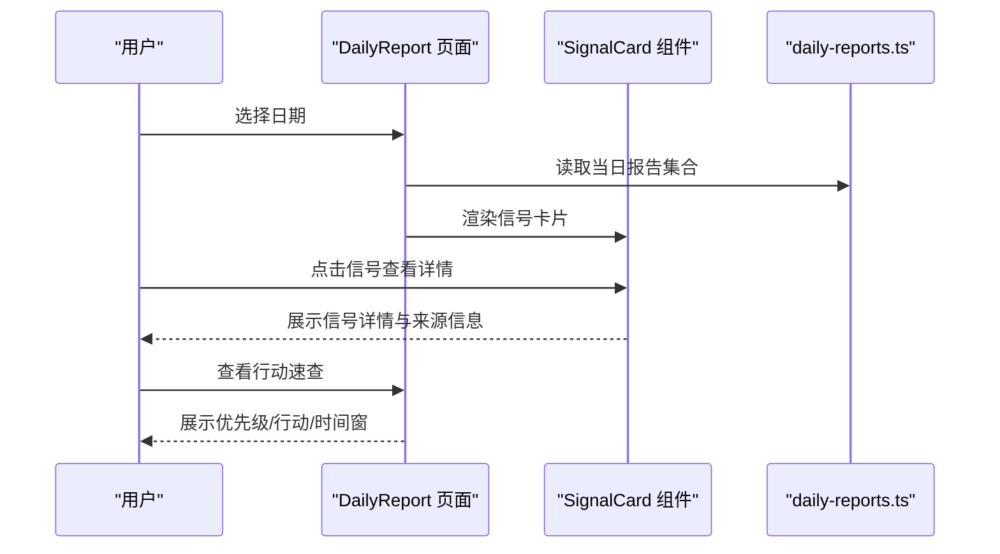

图表来源
- [src/pages/DailyReport/index.tsx:21-122](file://src/pages/DailyReport/index.tsx#L21-L122)
- [src/data/daily-reports.ts:1-203](file://src/data/daily-reports.ts#L1-L203)
- [src/components/SignalCard/index.tsx](file://src/components/SignalCard/index.tsx)

章节来源
- [src/pages/DailyReport/index.tsx:21-122](file://src/pages/DailyReport/index.tsx#L21-L122)
- [src/data/daily-reports.ts:1-203](file://src/data/daily-reports.ts#L1-L203)

### 模块二：公司追踪（动态监控）
- 设计目标：实时追踪OpenAI、Anthropic、字节、阿里、H&M等公司与关键人物的动态，提供简明摘要与标签分类。
- 核心功能：
  - 按时间顺序展示公司动态，支持公司徽标与颜色标识。
  - 展示标题、时间、人物、摘要与标签。
- 用户交互流程：
  - 浏览列表 → 点击动态 → 查看摘要与标签 → 跳转相关信号或报告。
- 数据关联：
  - 页面直接消费公司动态数据，无需跨模块联动。
- 个性化推荐机制建议：
  - 基于用户关注的公司或标签，高亮相关动态或提供订阅提醒。

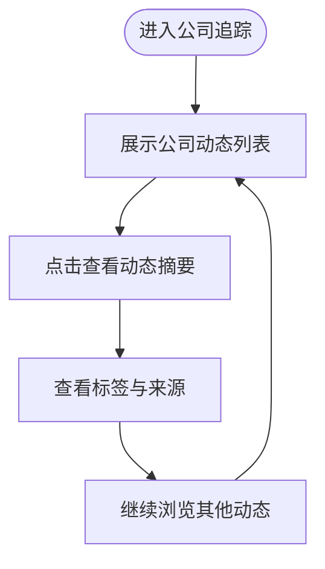

图表来源
- [src/pages/Companies/index.tsx:13-69](file://src/pages/Companies/index.tsx#L13-L69)
- [src/data/companies.ts:1-53](file://src/data/companies.ts#L1-L53)

章节来源
- [src/pages/Companies/index.tsx:13-69](file://src/pages/Companies/index.tsx#L13-L69)
- [src/data/companies.ts:1-53](file://src/data/companies.ts#L1-L53)

### 模块三：研究报告（权威解读）
- 设计目标：汇聚学术、咨询、HR媒体等权威来源的研究，提供摘要、核心发现与HR启示。
- 核心功能：
  - 展示论文标题、作者、机构、日期与摘要。
  - 支持展开查看“核心发现”与“HR启示”。
  - 标签分类与来源类型区分。
- 用户交互流程：
  - 浏览论文列表 → 点击展开 → 查看核心发现与HR启示 → 查看标签与来源。
- 数据关联：
  - 页面直接消费研究数据，信号与报告可相互引用。
- 个性化推荐机制建议：
  - 基于标签与来源偏好，推荐相关论文与摘要。

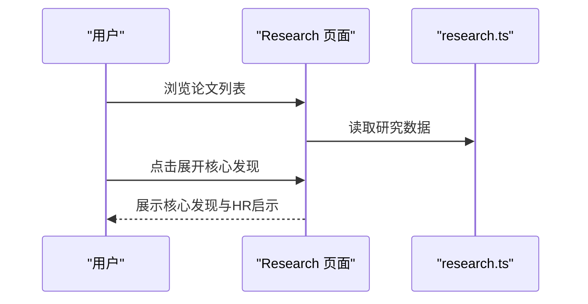

图表来源
- [src/pages/Research/index.tsx:12-92](file://src/pages/Research/index.tsx#L12-L92)
- [src/data/research.ts:1-53](file://src/data/research.ts#L1-L53)

章节来源
- [src/pages/Research/index.tsx:12-92](file://src/pages/Research/index.tsx#L12-L92)
- [src/data/research.ts:1-53](file://src/data/research.ts#L1-L53)

### 模块四：转型案例（成功经验分享）
- 设计目标：沉淀AI转型的“成功/失败/混合”案例，提炼可复用经验与HR启示。
- 核心功能：
  - 展示案例标题、公司、日期与摘要。
  - 分栏展示“做对了什么/做错了什么”，以及“HR启示”。
  - 标签与结果状态（成功/失败/混合）。
- 用户交互流程：
  - 浏览案例 → 查看结果状态 → 阅读“做对/做错”与HR启示 → 查看标签。
- 数据关联：
  - 页面直接消费案例数据，可与研究报告、每日日报中的信号形成交叉引用。
- 个性化推荐机制建议：
  - 基于HR启示与标签，推荐相似案例与信号。

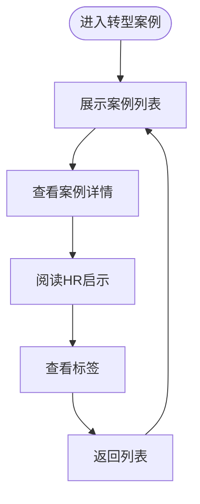

图表来源
- [src/pages/Cases/index.tsx:11-96](file://src/pages/Cases/index.tsx#L11-L96)
- [src/data/cases.ts:1-63](file://src/data/cases.ts#L1-L63)

章节来源
- [src/pages/Cases/index.tsx:11-96](file://src/pages/Cases/index.tsx#L11-L96)
- [src/data/cases.ts:1-63](file://src/data/cases.ts#L1-L63)

### 模块五：延伸阅读（原文呈现）
- 设计目标：提供关键英文原文、中文翻译与编辑导读，突出关键摘录。
- 核心功能：
  - 展示标题、原文标题、来源、日期与摘要。
  - 关键摘录与上下文，编辑导读。
  - 标签分类。
- 用户交互流程：
  - 浏览阅读列表 → 查看关键摘录与编辑导读 → 查看标签。
- 数据关联：
  - 页面直接消费阅读数据，可与研究报告、每日日报形成交叉引用。
- 个性化推荐机制建议：
  - 基于标签与摘录关键词，推荐相关阅读材料。

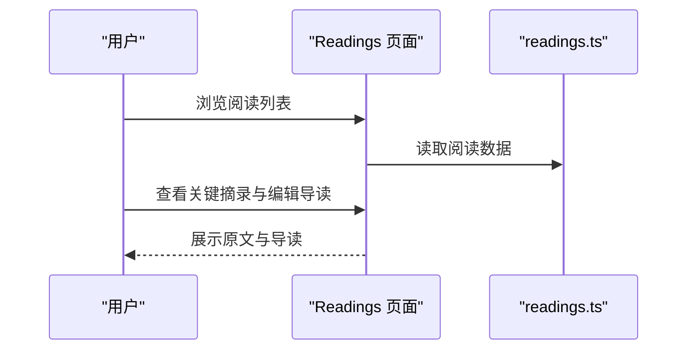

图表来源
- [src/pages/Readings/index.tsx:5-56](file://src/pages/Readings/index.tsx#L5-L56)
- [src/data/readings.ts:1-33](file://src/data/readings.ts#L1-L33)

章节来源
- [src/pages/Readings/index.tsx:5-56](file://src/pages/Readings/index.tsx#L5-L56)
- [src/data/readings.ts:1-33](file://src/data/readings.ts#L1-L33)

### 模块六：HR词典（专业术语解释）
- 设计目标：提供HR/组织新概念的中英对照与释义，支持中英文关键词搜索。
- 核心功能：
  - 搜索框支持中英文术语检索。
  - 展示术语、中文、定义、示例与关联术语。
- 用户交互流程：
  - 输入关键词 → 查看搜索结果 → 阅读定义与示例 → 查看关联术语。
- 数据关联：
  - 页面直接消费术语数据，可与信号、案例、报告中的术语形成交叉引用。
- 个性化推荐机制建议：
  - 基于用户浏览记录，推荐相关术语与关联词。

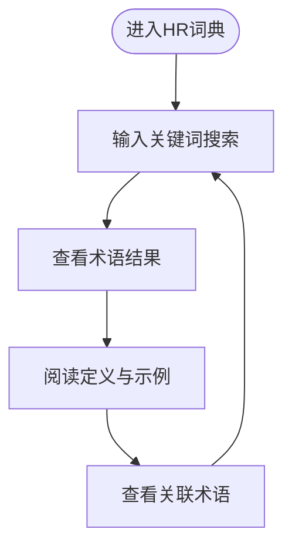

图表来源
- [src/pages/Glossary/index.tsx:6-73](file://src/pages/Glossary/index.tsx#L6-L73)
- [src/data/glossary.ts:1-17](file://src/data/glossary.ts#L1-L17)

章节来源
- [src/pages/Glossary/index.tsx:6-73](file://src/pages/Glossary/index.tsx#L6-L73)
- [src/data/glossary.ts:1-17](file://src/data/glossary.ts#L1-L17)

### 模块七：数据看板（关键指标展示）
- 设计目标：提供AI投资、裁员、工具采用率等关键指标的速查与趋势分析。
- 核心功能：
  - KPI卡片展示数值、单位与变化趋势。
  - 趋势折线图展示时间序列。
  - 明细表格与HR洞察。
- 用户交互流程：
  - 查看KPI卡片 → 查看趋势图 → 查看明细表格与HR洞察。
- 数据关联：
  - 页面直接消费仪表盘快照数据，可与每日日报中的信号形成联动。
- 个性化推荐机制建议：
  - 基于用户关注的指标，高亮相关趋势与洞察。

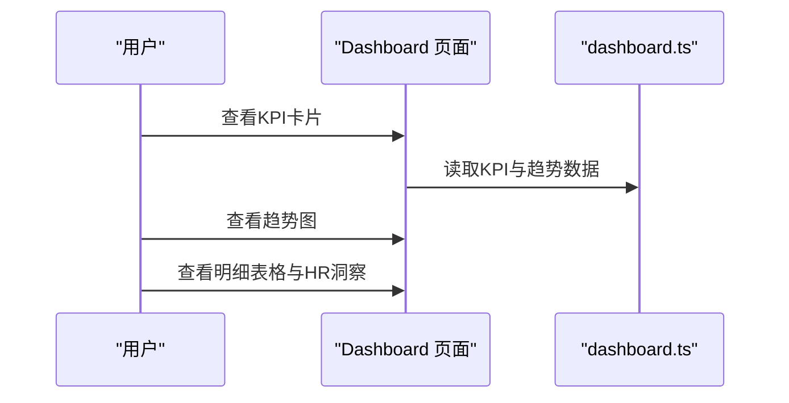

图表来源
- [src/pages/Dashboard/index.tsx:6-82](file://src/pages/Dashboard/index.tsx#L6-L82)
- [src/data/dashboard.ts:1-79](file://src/data/dashboard.ts#L1-L79)

章节来源
- [src/pages/Dashboard/index.tsx:6-82](file://src/pages/Dashboard/index.tsx#L6-L82)
- [src/data/dashboard.ts:1-79](file://src/data/dashboard.ts#L1-L79)

### 模块八：行业议程（活动日历）
- 设计目标：汇总HR Tech、SHRM、Bersin、WEF、国资委等会议日历，提供倒计时与相关性标注。
- 核心功能：
  - 按日期排序展示活动。
  - 标注日期、地点、相关性等级与倒计时。
- 用户交互流程：
  - 浏览活动列表 → 查看倒计时与相关性 → 查看活动详情。
- 数据关联：
  - 页面直接消费活动数据，可与每日日报中的信号形成联动。
- 个性化推荐机制建议：
  - 基于相关性与标签，推荐近期重要活动。

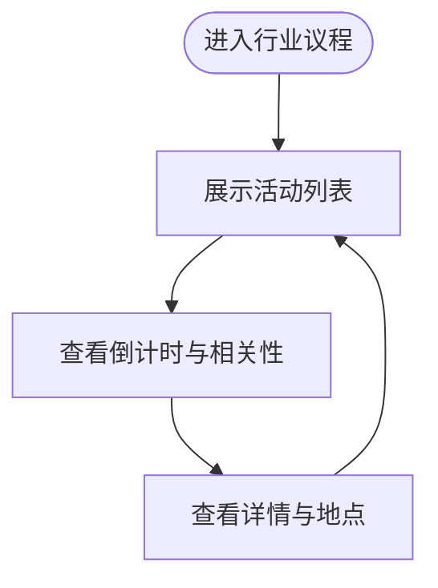

图表来源
- [src/pages/Events/index.tsx:18-94](file://src/pages/Events/index.tsx#L18-L94)
- [src/data/events.ts:1-13](file://src/data/events.ts#L1-L13)

章节来源
- [src/pages/Events/index.tsx:18-94](file://src/pages/Events/index.tsx#L18-L94)
- [src/data/events.ts:1-13](file://src/data/events.ts#L1-L13)

## 依赖关系分析
- 页面与数据文件：各页面通过导入对应数据文件进行渲染，形成单向依赖。
- 组件与页面：信号卡片组件被日报页面复用，形成跨页面依赖。
- 无循环依赖：模块间无直接运行时依赖，通过URL与导航串联。

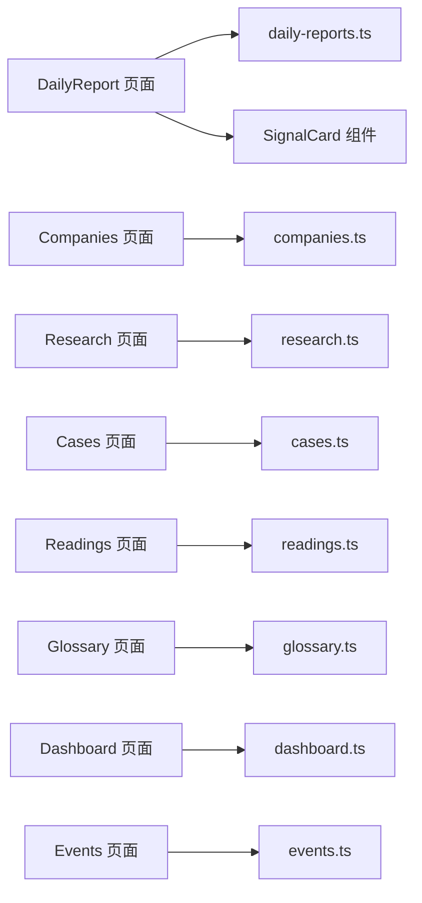

图表来源
- [src/pages/DailyReport/index.tsx:1-122](file://src/pages/DailyReport/index.tsx#L1-L122)
- [src/pages/Companies/index.tsx:1-69](file://src/pages/Companies/index.tsx#L1-L69)
- [src/pages/Research/index.tsx:1-92](file://src/pages/Research/index.tsx#L1-L92)
- [src/pages/Cases/index.tsx:1-96](file://src/pages/Cases/index.tsx#L1-L96)
- [src/pages/Readings/index.tsx:1-56](file://src/pages/Readings/index.tsx#L1-L56)
- [src/pages/Glossary/index.tsx:1-73](file://src/pages/Glossary/index.tsx#L1-L73)
- [src/pages/Dashboard/index.tsx:1-82](file://src/pages/Dashboard/index.tsx#L1-L82)
- [src/pages/Events/index.tsx:1-94](file://src/pages/Events/index.tsx#L1-L94)
- [src/data/daily-reports.ts:1-203](file://src/data/daily-reports.ts#L1-L203)
- [src/data/companies.ts:1-53](file://src/data/companies.ts#L1-L53)
- [src/data/research.ts:1-53](file://src/data/research.ts#L1-L53)
- [src/data/cases.ts:1-63](file://src/data/cases.ts#L1-L63)
- [src/data/readings.ts:1-33](file://src/data/readings.ts#L1-L33)
- [src/data/glossary.ts:1-17](file://src/data/glossary.ts#L1-L17)
- [src/data/dashboard.ts:1-79](file://src/data/dashboard.ts#L1-L79)
- [src/data/events.ts:1-13](file://src/data/events.ts#L1-L13)
- [src/components/SignalCard/index.tsx](file://src/components/SignalCard/index.tsx)

章节来源
- [src/pages/DailyReport/index.tsx:1-122](file://src/pages/DailyReport/index.tsx#L1-L122)
- [src/pages/Companies/index.tsx:1-69](file://src/pages/Companies/index.tsx#L1-L69)
- [src/pages/Research/index.tsx:1-92](file://src/pages/Research/index.tsx#L1-L92)
- [src/pages/Cases/index.tsx:1-96](file://src/pages/Cases/index.tsx#L1-L96)
- [src/pages/Readings/index.tsx:1-56](file://src/pages/Readings/index.tsx#L1-L56)
- [src/pages/Glossary/index.tsx:1-73](file://src/pages/Glossary/index.tsx#L1-L73)
- [src/pages/Dashboard/index.tsx:1-82](file://src/pages/Dashboard/index.tsx#L1-L82)
- [src/pages/Events/index.tsx:1-94](file://src/pages/Events/index.tsx#L1-L94)

## 性能考量
- 渲染性能：页面采用分页加载与动画过渡，保证首屏与滚动体验。
- 数据体积：各模块数据文件为静态JSON，建议按需懒加载或分包拆分，减少初始包体。
- 图表性能：数据看板使用响应式图表，建议在大数据量时启用虚拟化或采样。
- 搜索性能：词典搜索为前端过滤，建议引入索引或分词以提升大词典场景的查询效率。

## 故障排查指南
- 信号卡片显示异常：检查信号数据字段完整性与组件传参。
- 日报日期切换无效：确认日期去重与过滤逻辑正确。
- 研究报告展开按钮无响应：检查展开状态与动画容器高度控制。
- 案例结果状态图标不一致：核对结果配置映射与图标组件。
- 词典搜索无结果：确认搜索条件与大小写处理。
- 数据看板图表空白：检查数据格式与坐标轴配置。
- 活动倒计时错误：核对目标日期与当前日期计算逻辑。

章节来源
- [src/pages/DailyReport/index.tsx:21-122](file://src/pages/DailyReport/index.tsx#L21-L122)
- [src/pages/Research/index.tsx:12-92](file://src/pages/Research/index.tsx#L12-L92)
- [src/pages/Cases/index.tsx:11-96](file://src/pages/Cases/index.tsx#L11-L96)
- [src/pages/Glossary/index.tsx:6-73](file://src/pages/Glossary/index.tsx#L6-L73)
- [src/pages/Dashboard/index.tsx:6-82](file://src/pages/Dashboard/index.tsx#L6-L82)
- [src/pages/Events/index.tsx:18-94](file://src/pages/Events/index.tsx#L18-L94)

## 结论
本平台围绕“每日日报”构建了八大功能模块，形成从“信号洞察—动态追踪—权威解读—案例沉淀—原文呈现—术语解释—指标看板—活动日历”的闭环。模块间通过数据文件与组件解耦，具备良好的可维护性与扩展性。建议后续在个性化推荐、跨模块联动与性能优化方面持续迭代，以提升用户体验与运营效率。

## 附录
- 模块扩展指南
  - 新增模块：新增页面与数据文件，遵循现有命名与目录规范；在共享组件中复用SignalCard等组件。
  - 数据结构：参考现有types定义，保持字段一致性与可扩展性。
  - 个性化：引入用户偏好存储与标签系统，基于行为数据进行推荐。
  - 跨模块联动：通过URL参数或全局状态传递上下文，实现信号→案例/报告的快速跳转。
- 新功能开发流程
  - 需求评审 → 数据结构设计 → 页面与组件开发 → 单元测试与集成测试 → 文档与回归测试 → 上线与监控。