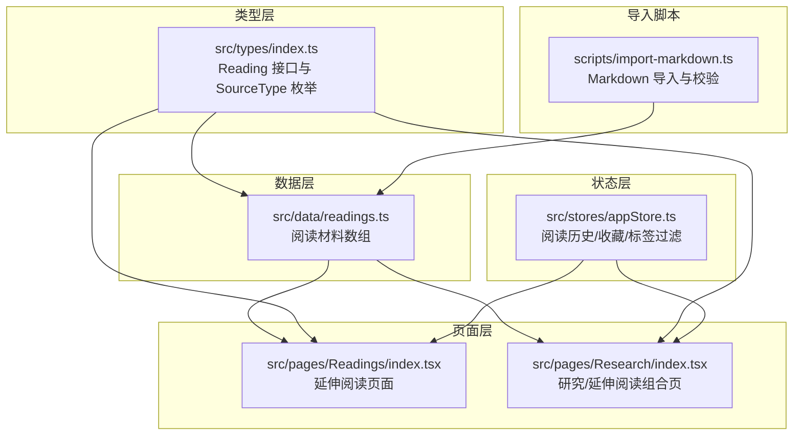
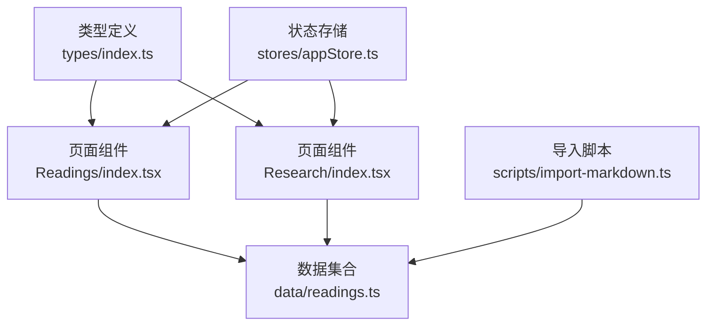
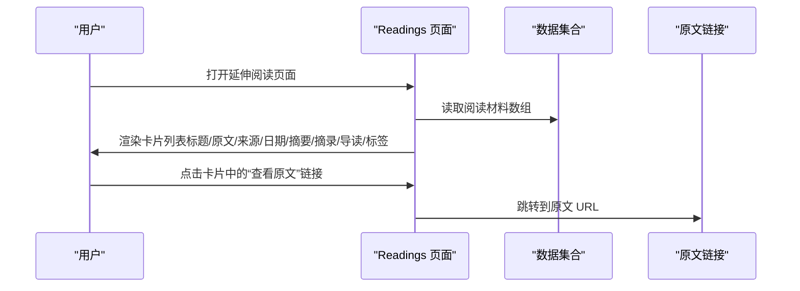
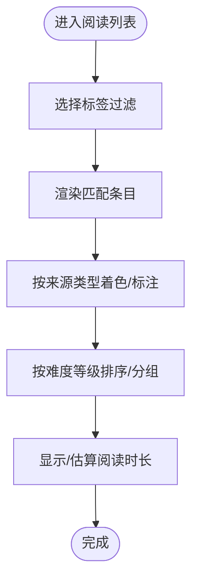
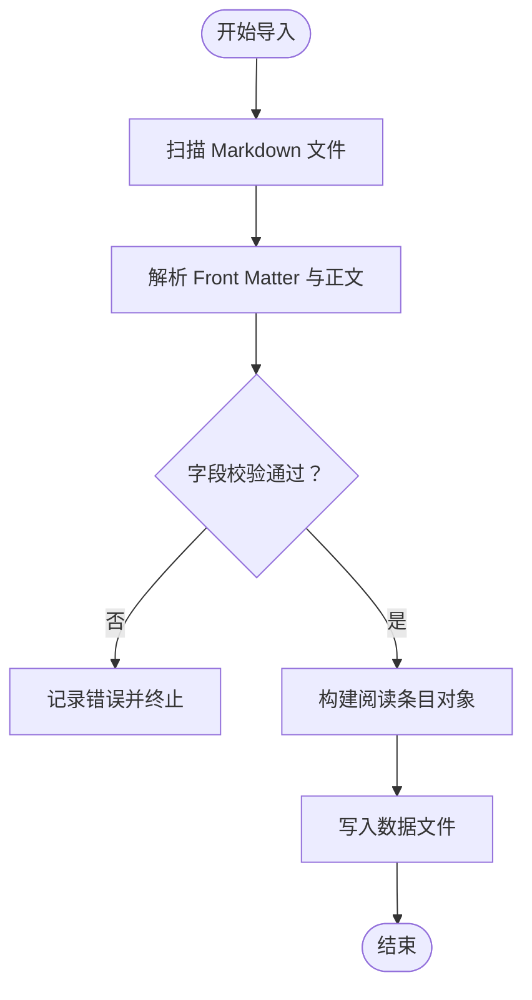
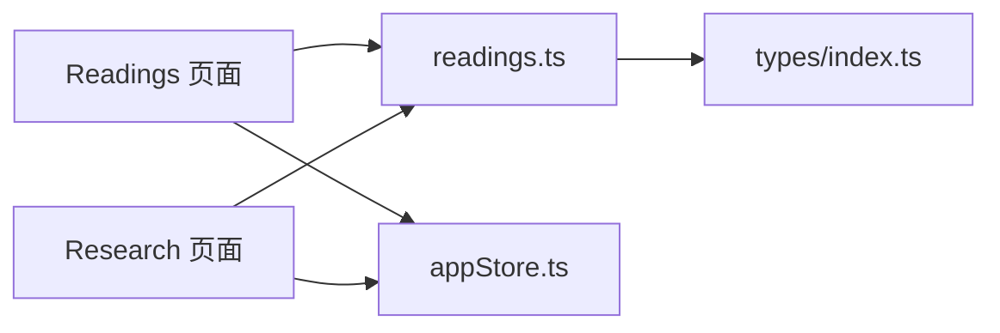

# 延伸阅读模块

<cite>
**本文引用的文件**
- [src/data/readings.ts](file://src/data/readings.ts)
- [src/pages/Readings/index.tsx](file://src/pages/Readings/index.tsx)
- [src/pages/Research/index.tsx](file://src/pages/Research/index.tsx)
- [src/types/index.ts](file://src/types/index.ts)
- [src/stores/appStore.ts](file://src/stores/appStore.ts)
- [scripts/import-markdown.ts](file://scripts/import-markdown.ts)
</cite>

## 目录
1. [简介](#简介)
2. [项目结构](#项目结构)
3. [核心组件](#核心组件)
4. [架构总览](#架构总览)
5. [详细组件分析](#详细组件分析)
6. [依赖关系分析](#依赖关系分析)
7. [性能考量](#性能考量)
8. [故障排查指南](#故障排查指南)
9. [结论](#结论)
10. [附录](#附录)

## 简介
本模块聚焦“延伸阅读”功能，提供英文原文与中文翻译的双语展示，辅以编辑导读、关键摘录与标签体系，支持按来源类型、主题标签等维度进行阅读与检索。当前实现以静态数据驱动，页面负责渲染与交互；后续可在现有结构基础上扩展为完整的阅读器，加入原文显示、翻译对照、笔记与书签管理、阅读进度跟踪以及自动化导入与质量评估。

## 项目结构
延伸阅读模块由以下部分组成：
- 数据层：统一的阅读材料数据集合，定义阅读条目的字段与来源类型
- 页面层：两个入口页面分别展示延伸阅读列表与研究/延伸阅读组合视图
- 类型层：定义阅读条目接口与来源类型枚举
- 状态层：用户偏好与阅读历史、收藏等状态管理
- 导入脚本：Markdown 批量导入与基础质量校验



**图表来源**
- [src/data/readings.ts:1-133](file://src/data/readings.ts#L1-L133)
- [src/pages/Readings/index.tsx:1-56](file://src/pages/Readings/index.tsx#L1-L56)
- [src/pages/Research/index.tsx:1-243](file://src/pages/Research/index.tsx#L1-L243)
- [src/types/index.ts:108-121](file://src/types/index.ts#L108-L121)
- [src/stores/appStore.ts:1-92](file://src/stores/appStore.ts#L1-L92)
- [scripts/import-markdown.ts:83-123](file://scripts/import-markdown.ts#L83-L123)

**章节来源**
- [src/data/readings.ts:1-133](file://src/data/readings.ts#L1-L133)
- [src/pages/Readings/index.tsx:1-56](file://src/pages/Readings/index.tsx#L1-L56)
- [src/pages/Research/index.tsx:1-243](file://src/pages/Research/index.tsx#L1-L243)
- [src/types/index.ts:108-121](file://src/types/index.ts#L108-L121)
- [src/stores/appStore.ts:1-92](file://src/stores/appStore.ts#L1-L92)
- [scripts/import-markdown.ts:83-123](file://scripts/import-markdown.ts#L83-L123)

## 核心组件
- 阅读条目数据结构（Reading）
  - 字段：标识、日期、标题、原文标题、来源、来源类型、摘要、关键摘录、编辑导读、标签、原文链接
  - 关键摘录为数组，每项含文本与上下文
- 页面渲染
  - 延伸阅读页面：逐条展示标题、原文标题、来源与日期、摘要、关键摘录、编辑导读、标签
  - 研究/延伸阅读组合页：在“延伸阅读”部分复用相同结构
- 类型与来源类型
  - Reading 接口与 SourceType 枚举统一约束数据形态
- 用户状态
  - 阅读历史、收藏、标签过滤等状态，便于扩展阅读进度与个性化

**章节来源**
- [src/types/index.ts:108-121](file://src/types/index.ts#L108-L121)
- [src/data/readings.ts:3-132](file://src/data/readings.ts#L3-L132)
- [src/pages/Readings/index.tsx:13-51](file://src/pages/Readings/index.tsx#L13-L51)
- [src/pages/Research/index.tsx:160-240](file://src/pages/Research/index.tsx#L160-L240)
- [src/stores/appStore.ts:53-67](file://src/stores/appStore.ts#L53-L67)

## 架构总览
延伸阅读模块采用“数据驱动 + 页面渲染”的轻量架构：
- 数据来源：静态数组（readings.ts），未来可替换为数据库或外部 API
- 渲染逻辑：React 组件映射数据结构，使用动画与卡片布局提升可读性
- 类型约束：TS 接口确保字段一致性与可维护性
- 状态管理：Zustand 管理用户偏好与阅读行为



**图表来源**
- [src/pages/Readings/index.tsx:1-56](file://src/pages/Readings/index.tsx#L1-L56)
- [src/pages/Research/index.tsx:1-243](file://src/pages/Research/index.tsx#L1-L243)
- [src/data/readings.ts:1-133](file://src/data/readings.ts#L1-L133)
- [src/types/index.ts:108-121](file://src/types/index.ts#L108-L121)
- [src/stores/appStore.ts:1-92](file://src/stores/appStore.ts#L1-L92)
- [scripts/import-markdown.ts:83-123](file://scripts/import-markdown.ts#L83-L123)

## 详细组件分析

### 数据结构与来源类型
- Reading 接口
  - 包含 id、date、title、originalTitle、source、sourceType、summary、keyExcerpts、editorNote、tags、url
  - keyExcerpts 为数组，每项含 text 与 context
- SourceType 枚举
  - 支持咨询、科技、学术、智库、风投、HR 媒体、中国本土等类型
  - 页面通过颜色与标签区分不同来源类型，便于识别权威度与视角

```mermaid
classDiagram
class Reading {
+string id
+string date
+string title
+string originalTitle
+string source
+SourceType sourceType
+string summary
+Excerpt[] keyExcerpts
+string editorNote
+string[] tags
+string url
}
class Excerpt {
+string text
+string context
}
class SourceType {
<<enum>>
"consulting"
"tech"
"academic"
"think_tank"
"vc"
"hr_media"
"china_local"
}
Reading --> Excerpt : "包含多个"
Reading --> SourceType : "使用"
```

**图表来源**
- [src/types/index.ts:108-121](file://src/types/index.ts#L108-L121)
- [src/types/index.ts:2-9](file://src/types/index.ts#L2-L9)

**章节来源**
- [src/types/index.ts:108-121](file://src/types/index.ts#L108-L121)
- [src/types/index.ts:2-9](file://src/types/index.ts#L2-L9)

### 页面渲染与双语展示
- 延伸阅读页面
  - 展示：标题、原文标题、来源与日期、摘要、关键摘录、编辑导读、标签
  - 交互：点击“延伸阅读”卡片可跳转至原文链接（若存在）
- 研究/延伸阅读组合页
  - 通过标签页切换“研究报告”与“延伸阅读”
  - 延伸阅读部分复用相同卡片结构，增强一致性



**图表来源**
- [src/pages/Readings/index.tsx:13-51](file://src/pages/Readings/index.tsx#L13-L51)
- [src/data/readings.ts:3-132](file://src/data/readings.ts#L3-L132)

**章节来源**
- [src/pages/Readings/index.tsx:13-51](file://src/pages/Readings/index.tsx#L13-L51)
- [src/pages/Research/index.tsx:160-240](file://src/pages/Research/index.tsx#L160-L240)
- [src/data/readings.ts:3-132](file://src/data/readings.ts#L3-L132)

### 阅读列表组织与筛选
- 标签过滤
  - 通过状态 store 的 activeTags 实现标签级筛选
  - 可在列表顶部或侧边集成标签云，提升筛选效率
- 来源类型与难度
  - 来源类型通过颜色与标签呈现，便于快速识别权威度
  - 难度等级可基于标签或来源类型映射，例如“学术/智库”视为较高难度，“HR 媒体”为日常参考
- 阅读时长估算
  - 当前未内置时长字段；可在数据层新增 estimatedMinutes 字段，并在页面以图标/徽标形式展示



[此图为概念性流程示意，不直接对应具体源码文件]

**章节来源**
- [src/stores/appStore.ts:73-80](file://src/stores/appStore.ts#L73-L80)
- [src/pages/Research/index.tsx:7-23](file://src/pages/Research/index.tsx#L7-L23)

### 阅读器界面设计（扩展建议）
- 原文显示
  - 引入富文本渲染器，支持段落、列表、强调与链接
  - 提供“仅原文/仅译文/对照”三种视图切换
- 翻译对照
  - 将 keyExcerpts 中的摘录与原文段落建立映射关系，实现点击跳转
  - 对照模式下，原文与译文并列滚动，保持视觉对齐
- 笔记与书签
  - 在卡片底部增加“添加笔记/书签”按钮，写入本地存储或后端
  - 笔记支持关键词标记与全文检索
- 进度跟踪
  - 记录阅读起止时间与完成状态，计算平均速度
  - 提供“继续阅读”快捷入口与完成统计

[本节为概念性设计，不直接对应具体源码文件]

### 导入流程与质量评估（技术方案）
- 导入流程
  - 脚本扫描 Markdown 目录，解析 Front Matter 与正文
  - 生成标准化的阅读条目对象，写入数据文件
- 质量评估
  - 校验必填字段（标题、日期、来源、摘要、原文链接）
  - 校验格式（Front Matter 键名、日期格式、URL 可达性）
  - 生成导入报告与错误清单，支持人工复核



**图表来源**
- [scripts/import-markdown.ts:83-123](file://scripts/import-markdown.ts#L83-L123)

**章节来源**
- [scripts/import-markdown.ts:83-123](file://scripts/import-markdown.ts#L83-L123)

## 依赖关系分析
- 组件耦合
  - 页面组件依赖数据集合与类型定义，耦合度低，便于替换数据源
  - 状态 store 与页面弱耦合，通过函数式接口暴露能力
- 外部依赖
  - 动画库用于列表入场效果
  - 图标库提供统一视觉语言
- 循环依赖
  - 未发现循环依赖迹象



**图表来源**
- [src/pages/Readings/index.tsx:1-56](file://src/pages/Readings/index.tsx#L1-L56)
- [src/pages/Research/index.tsx:1-243](file://src/pages/Research/index.tsx#L1-L243)
- [src/data/readings.ts:1-133](file://src/data/readings.ts#L1-L133)
- [src/types/index.ts:108-121](file://src/types/index.ts#L108-L121)
- [src/stores/appStore.ts:1-92](file://src/stores/appStore.ts#L1-L92)

**章节来源**
- [src/pages/Readings/index.tsx:1-56](file://src/pages/Readings/index.tsx#L1-L56)
- [src/pages/Research/index.tsx:1-243](file://src/pages/Research/index.tsx#L1-L243)
- [src/data/readings.ts:1-133](file://src/data/readings.ts#L1-L133)
- [src/types/index.ts:108-121](file://src/types/index.ts#L108-L121)
- [src/stores/appStore.ts:1-92](file://src/stores/appStore.ts#L1-L92)

## 性能考量
- 渲染优化
  - 列表项使用动画入场，延迟逐项递增，避免一次性渲染压力
  - 建议在长列表场景启用虚拟滚动
- 数据加载
  - 当前为静态数据，建议在生产环境接入缓存与懒加载
- 交互响应
  - 标签过滤与收藏切换应保持 O(1)/O(n) 的高效操作

[本节为通用性能建议，不直接对应具体源码文件]

## 故障排查指南
- 页面空白或渲染异常
  - 检查数据集合是否正确导出与命名
  - 确认类型接口与数据字段一致
- 链接无法打开
  - 校验 url 字段是否存在且有效
- 标签过滤无效
  - 确认状态 store 的 activeTags 更新逻辑与页面筛选条件一致

**章节来源**
- [src/pages/Readings/index.tsx:13-51](file://src/pages/Readings/index.tsx#L13-L51)
- [src/pages/Research/index.tsx:160-240](file://src/pages/Research/index.tsx#L160-L240)
- [src/stores/appStore.ts:73-80](file://src/stores/appStore.ts#L73-L80)

## 结论
延伸阅读模块以简洁的数据结构与清晰的页面渲染实现了双语展示与主题组织。当前版本侧重内容呈现与基础交互，后续可围绕阅读器功能（原文/译文对照、笔记与书签、进度跟踪）、自动化导入与质量评估、以及阅读列表的难度与时长维度进行扩展，形成完整的知识阅读与学习闭环。

## 附录
- 数据字段速览
  - id、date、title、originalTitle、source、sourceType、summary、keyExcerpts、editorNote、tags、url
- 页面入口
  - 延伸阅读页面：/pages/Readings
  - 研究/延伸阅读组合页：/pages/Research