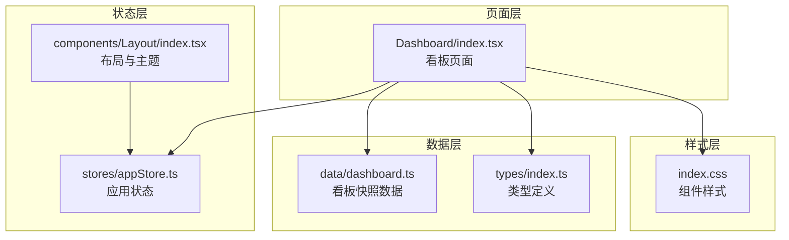
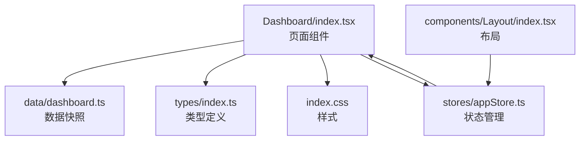
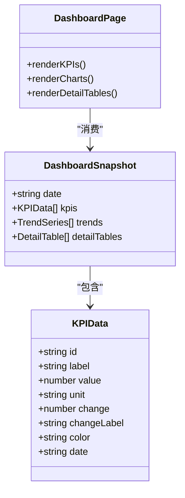
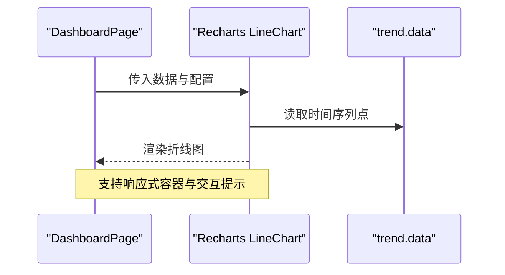
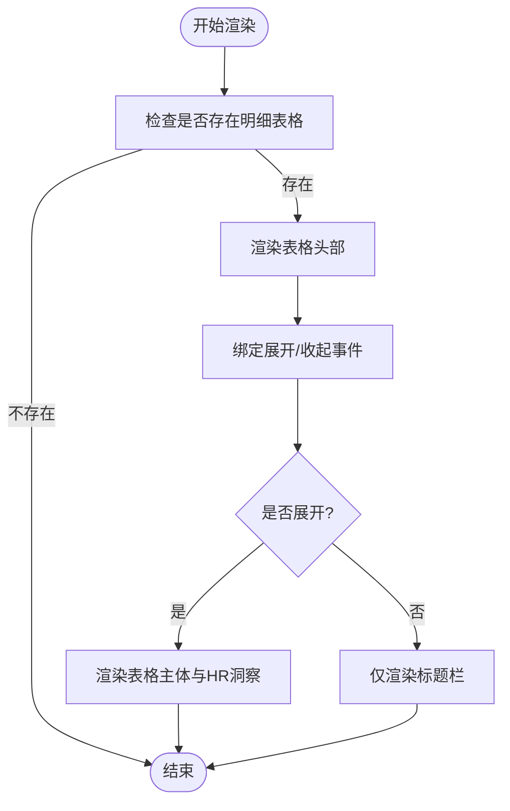
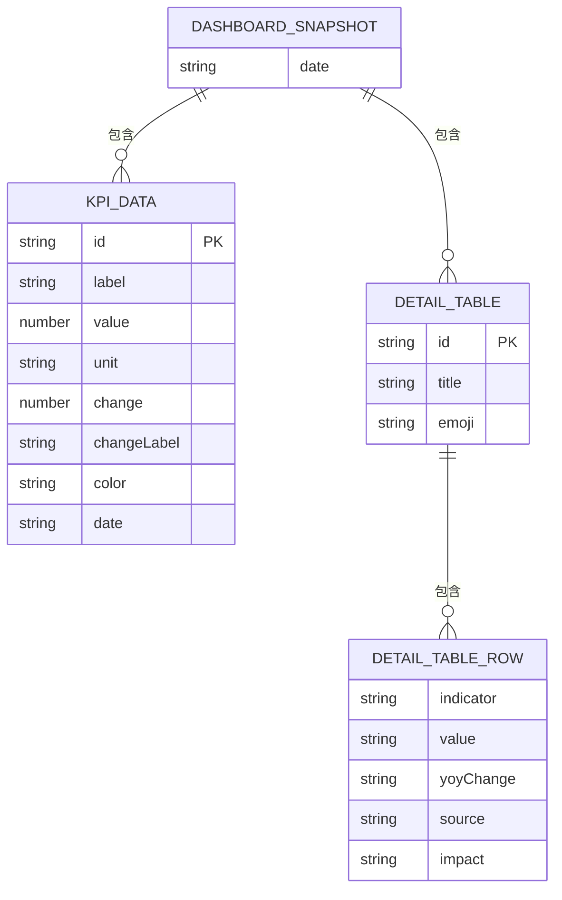
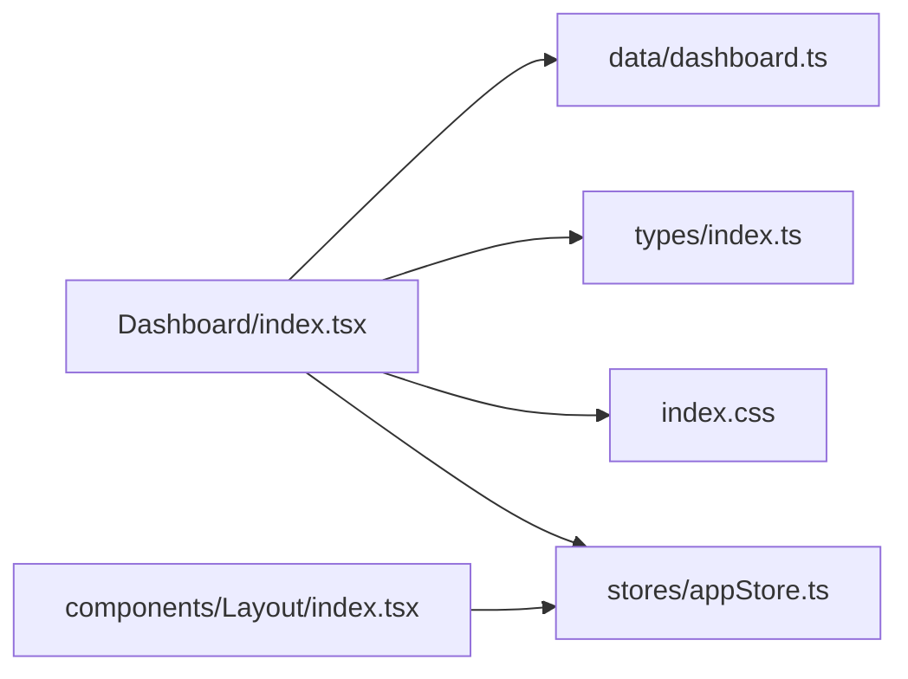

# 数据看板模块

<cite>
**本文档引用的文件**
- [src/pages/Dashboard/index.tsx](file://src/pages/Dashboard/index.tsx)
- [src/data/dashboard.ts](file://src/data/dashboard.ts)
- [src/types/index.ts](file://src/types/index.ts)
- [src/stores/appStore.ts](file://src/stores/appStore.ts)
- [src/index.css](file://src/index.css)
- [src/components/Layout/index.tsx](file://src/components/Layout/index.tsx)
- [package.json](file://package.json)
</cite>

## 目录
1. [简介](#简介)
2. [项目结构](#项目结构)
3. [核心组件](#核心组件)
4. [架构概览](#架构概览)
5. [详细组件分析](#详细组件分析)
6. [依赖关系分析](#依赖关系分析)
7. [性能考虑](#性能考虑)
8. [故障排除指南](#故障排除指南)
9. [结论](#结论)
10. [附录](#附录)

## 简介
本文件为数据看板模块的详细技术文档，重点阐述关键指标面板（KPIPanel）与行动网格（ActionGrid）的设计实现，涵盖数据可视化原理、指标计算逻辑、实时更新机制、数据模型定义、交互设计、定制化选项以及扩展方法。当前仓库中已实现的关键指标面板与趋势图表展示，以及明细表格的数据结构与渲染逻辑；行动网格组件尚未在当前代码库中发现对应实现文件，将在后续扩展时提供指导。

## 项目结构
数据看板模块位于页面级组件中，通过类型定义与数据快照驱动界面渲染，并结合全局状态管理与主题系统实现用户交互体验。

**图示来源**
- [src/pages/Dashboard/index.tsx](file://src/pages/Dashboard/index.tsx)
- [src/data/dashboard.ts](file://src/data/dashboard.ts)
- [src/types/index.ts](file://src/types/index.ts)
- [src/stores/appStore.ts](file://src/stores/appStore.ts)
- [src/index.css](file://src/index.css)
- [src/components/Layout/index.tsx](file://src/components/Layout/index.tsx)

**章节来源**
- [src/pages/Dashboard/index.tsx](file://src/pages/Dashboard/index.tsx)
- [src/data/dashboard.ts](file://src/data/dashboard.ts)
- [src/types/index.ts](file://src/types/index.ts)
- [src/stores/appStore.ts](file://src/stores/appStore.ts)
- [src/index.css](file://src/index.css)
- [src/components/Layout/index.tsx](file://src/components/Layout/index.tsx)

## 核心组件
- 关键指标面板（KPIPanel）
  - 渲染逻辑：基于看板快照中的 KPI 列表，使用动画库进行入场动画，按列栅格布局展示。
  - 可视化元素：指标标签、数值、单位、变化趋势图标与百分比标注。
  - 主题适配：通过颜色类名映射不同指标色值，配合暗黑模式自动切换。
- 趋势图表（LineChart）
  - 使用 Recharts 组件渲染折线图，支持响应式容器、坐标轴、图例与提示框。
  - 数据格式：每个趋势包含标签与时间序列点数组，每点包含日期与数值。
- 明细表格（DetailTable）
  - 支持折叠展开，点击标题栏切换显示状态。
  - 表头列由 columns 定义，行数据由 rows 提供，支持同比变化的视觉化标记。
  - HR 洞察区域提供业务解读与行动建议。

**章节来源**
- [src/pages/Dashboard/index.tsx](file://src/pages/Dashboard/index.tsx)
- [src/data/dashboard.ts](file://src/data/dashboard.ts)
- [src/types/index.ts](file://src/types/index.ts)

## 架构概览
数据看板采用“页面组件 + 数据快照 + 类型定义 + 样式 + 状态管理”的分层架构。页面组件负责渲染与交互，数据快照提供静态或动态数据源，类型定义确保数据结构一致性，样式层统一视觉风格，状态管理负责主题与用户偏好持久化。

**图示来源**
- [src/pages/Dashboard/index.tsx](file://src/pages/Dashboard/index.tsx)
- [src/data/dashboard.ts](file://src/data/dashboard.ts)
- [src/types/index.ts](file://src/types/index.ts)
- [src/stores/appStore.ts](file://src/stores/appStore.ts)
- [src/components/Layout/index.tsx](file://src/components/Layout/index.tsx)

## 详细组件分析

### 关键指标面板（KPIPanel）设计实现
- 数据模型
  - KPI 指标字段：标识符、标签、数值、单位、变化值、变化标签、颜色类名、日期。
  - 变化值用于决定趋势图标与正负样式，变化标签用于描述对比口径（如同比、环比）。
- 可视化原理
  - 使用动画库对卡片进行入场动画，延迟逐个渲染增强观感。
  - 单元格内采用等宽数字类名保证数值对齐与可读性。
  - 颜色类名映射到预设主题色，支持明暗模式切换。
- 实时更新机制
  - 当前实现为静态数据快照，若需实时更新，可在页面组件中引入数据订阅或定时刷新逻辑，并通过状态管理触发重渲染。
- 交互设计
  - 指标钻取：可通过点击卡片进入详情页或弹窗，当前仓库未实现该交互，可在路由或模态框中扩展。
  - 时间范围切换：当前未提供时间范围切换控件，可在页面顶部添加时间选择器并与数据快照联动。
  - 数据导出：当前未提供导出功能，可在工具栏增加导出按钮并调用 CSV 或 Excel 导出库。

**图示来源**
- [src/types/index.ts](file://src/types/index.ts)
- [src/pages/Dashboard/index.tsx](file://src/pages/Dashboard/index.tsx)

**章节来源**
- [src/types/index.ts](file://src/types/index.ts)
- [src/pages/Dashboard/index.tsx](file://src/pages/Dashboard/index.tsx)

### 趋势图表（LineChart）实现
- 数据结构
  - 每个趋势包含标签与时间序列点数组，点对象包含日期与数值。
- 可视化特性
  - 响应式容器自适应宽度与高度。
  - 坐标轴、网格、图例与提示框统一配置。
  - 折线样式与交互点大小可定制。
- 扩展建议
  - 支持多系列对比：在趋势数组中增加多个 series 并配置不同颜色。
  - 动态数据：通过外部数据源或轮询更新 trend.data，触发图表重绘。

**图示来源**
- [src/pages/Dashboard/index.tsx](file://src/pages/Dashboard/index.tsx)

**章节来源**
- [src/pages/Dashboard/index.tsx](file://src/pages/Dashboard/index.tsx)

### 明细表格（DetailTable）实现
- 数据模型
  - 表格包含标题、表情符号、列定义、行数据与 HR 洞察。
  - 行数据支持指标名称、数值、同比变化、数据来源与影响说明。
- 交互设计
  - 折叠展开：点击标题栏切换显示状态，使用动画过渡。
  - 视觉反馈：同比变化根据正负采用不同背景色与文本色。
- 扩展建议
  - 指标钻取：为每行提供链接或按钮跳转至更细粒度数据。
  - 导出功能：增加导出按钮，将表格数据转换为 CSV/Excel。
  - 过滤与排序：在列头添加过滤与排序控件。

**图示来源**
- [src/pages/Dashboard/index.tsx](file://src/pages/Dashboard/index.tsx)

**章节来源**
- [src/pages/Dashboard/index.tsx](file://src/pages/Dashboard/index.tsx)

### 仪表板数据模型
- KPI 指标定义
  - 字段：id、label、value、unit、change、changeLabel、color、date。
  - 用途：驱动 KPI 卡片渲染与趋势比较。
- 数据源连接
  - 当前为本地快照数据，便于演示与开发。
  - 扩展方案：接入后端 API 或实时数据流，通过页面组件的生命周期加载数据。
- 计算公式
  - 变化值与变化标签用于展示同比/环比趋势，具体计算逻辑应在数据源侧完成。
- 阈值设置
  - 可在前端为 KPI 卡片增加阈值高亮或告警样式，结合颜色与图标提示。

**图示来源**
- [src/types/index.ts](file://src/types/index.ts)
- [src/data/dashboard.ts](file://src/data/dashboard.ts)

**章节来源**
- [src/types/index.ts](file://src/types/index.ts)
- [src/data/dashboard.ts](file://src/data/dashboard.ts)

### 交互设计与定制化选项
- 指标钻取
  - 当前未实现，建议在 KPI 卡片与明细表格行上添加点击事件，跳转至详情页或打开模态框。
- 时间范围切换
  - 当前未实现，建议在页面顶部添加时间选择器，与数据快照中的日期字段联动。
- 数据导出
  - 当前未实现，建议在工具栏增加导出按钮，调用 CSV/Excel 导出库。
- 指标选择与布局调整
  - 可通过状态管理保存用户偏好的指标集合与布局配置，结合 Tailwind 类名动态切换。
- 主题配置
  - 通过状态管理与根节点类名切换实现明暗主题，支持系统跟随。

**章节来源**
- [src/stores/appStore.ts](file://src/stores/appStore.ts)
- [src/components/Layout/index.tsx](file://src/components/Layout/index.tsx)
- [src/index.css](file://src/index.css)

### 数据源集成方案
- 本地快照迁移
  - 将现有快照数据迁移到后端接口，页面组件在挂载时发起请求并更新状态。
- 实时数据流
  - 引入 WebSocket 或 Server-Sent Events，接收增量更新并局部刷新图表与 KPI。
- 缓存与版本控制
  - 对快照数据进行缓存与版本校验，避免重复加载与不一致问题。

**章节来源**
- [src/pages/Dashboard/index.tsx](file://src/pages/Dashboard/index.tsx)

### 性能优化策略
- 图表渲染
  - 使用响应式容器与合理的高度设置，避免频繁重排。
  - 对大数据量趋势图启用采样或分页加载。
- 组件渲染
  - 对 KPI 卡片与明细表格使用懒加载与虚拟化列表（如需要）。
  - 合理使用动画库的入场动画，避免大量元素同时渲染造成卡顿。
- 状态管理
  - 将主题与用户偏好持久化到本地存储，减少每次初始化的计算开销。
- 样式优化
  - 使用原子化样式框架，减少样式体积与重绘次数。

**章节来源**
- [src/pages/Dashboard/index.tsx](file://src/pages/Dashboard/index.tsx)
- [src/stores/appStore.ts](file://src/stores/appStore.ts)
- [src/index.css](file://src/index.css)

### 扩展新指标的方法指南
- 新增指标字段
  - 在类型定义中扩展 KPI 指标字段，确保与现有渲染逻辑兼容。
- 更新数据快照
  - 在快照中新增 KPI 对象，设置颜色类名与变化标签。
- 页面渲染
  - 确保页面组件能够正确遍历并渲染新增指标。
- 样式与主题
  - 为新指标颜色类名提供对应样式，保证明暗模式下可读性。
- 交互与导出
  - 为新指标补充钻取、导出等交互能力。

**章节来源**
- [src/types/index.ts](file://src/types/index.ts)
- [src/data/dashboard.ts](file://src/data/dashboard.ts)
- [src/pages/Dashboard/index.tsx](file://src/pages/Dashboard/index.tsx)

## 依赖关系分析
- 页面组件依赖
  - DashboardPage 依赖数据快照与类型定义，使用动画库与图表库进行渲染。
- 样式依赖
  - 组件样式通过 Tailwind 类名与自定义样式类实现，支持明暗主题切换。
- 状态依赖
  - 应用状态通过 Zustand 管理主题与用户偏好，布局组件监听状态变更并更新 DOM。

**图示来源**
- [src/pages/Dashboard/index.tsx](file://src/pages/Dashboard/index.tsx)
- [src/data/dashboard.ts](file://src/data/dashboard.ts)
- [src/types/index.ts](file://src/types/index.ts)
- [src/stores/appStore.ts](file://src/stores/appStore.ts)
- [src/components/Layout/index.tsx](file://src/components/Layout/index.tsx)

**章节来源**
- [src/pages/Dashboard/index.tsx](file://src/pages/Dashboard/index.tsx)
- [src/stores/appStore.ts](file://src/stores/appStore.ts)
- [src/components/Layout/index.tsx](file://src/components/Layout/index.tsx)

## 性能考虑
- 图表渲染性能
  - 控制趋势点数量，必要时进行降采样。
  - 使用响应式容器避免强制重绘。
- 组件渲染性能
  - 合理拆分组件，避免不必要的重渲染。
  - 使用 memo 化与浅比较优化 props 变更。
- 状态与存储
  - 仅持久化必要的用户偏好，减少存储压力。
  - 避免在渲染路径中执行昂贵计算。

## 故障排除指南
- 图表不显示或尺寸异常
  - 检查响应式容器的高度设置与父容器尺寸。
  - 确认数据点格式与数据键名一致。
- 明暗主题切换无效
  - 检查根节点类名切换逻辑与 CSS 变量映射。
  - 确认状态管理中主题状态的持久化与恢复。
- 动画卡顿
  - 减少同时入场的元素数量，适当延长动画延迟。
  - 避免在动画过程中进行复杂计算。

**章节来源**
- [src/pages/Dashboard/index.tsx](file://src/pages/Dashboard/index.tsx)
- [src/stores/appStore.ts](file://src/stores/appStore.ts)
- [src/components/Layout/index.tsx](file://src/components/Layout/index.tsx)

## 结论
当前数据看板模块已完成关键指标面板与趋势图表的基础实现，具备良好的可扩展性。通过引入实时数据源、完善交互功能与主题系统，可进一步提升用户体验与业务价值。后续建议优先实现行动网格组件、指标钻取与时间范围切换，并建立完善的指标扩展流程与性能监控体系。

## 附录
- 外部依赖
  - Recharts：用于趋势图表渲染。
  - Framer Motion：用于组件入场动画。
  - Zustand：用于状态管理与持久化。
- 开发建议
  - 为所有交互行为提供无障碍访问支持。
  - 建立组件测试与可视化回归测试流程。
  - 对关键路径进行性能基准测试与优化。

**章节来源**
- [package.json](file://package.json)