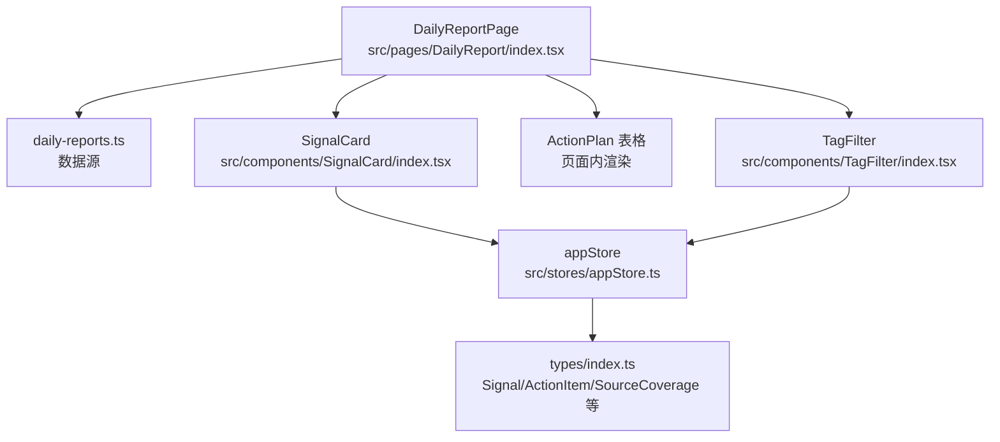
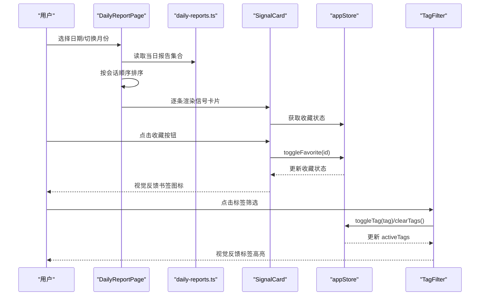
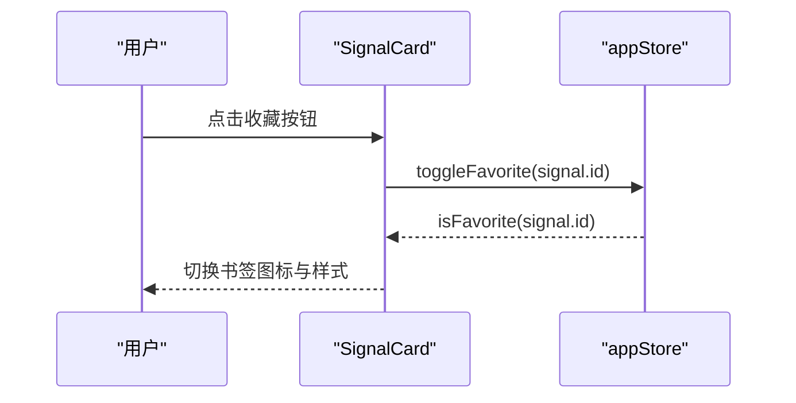
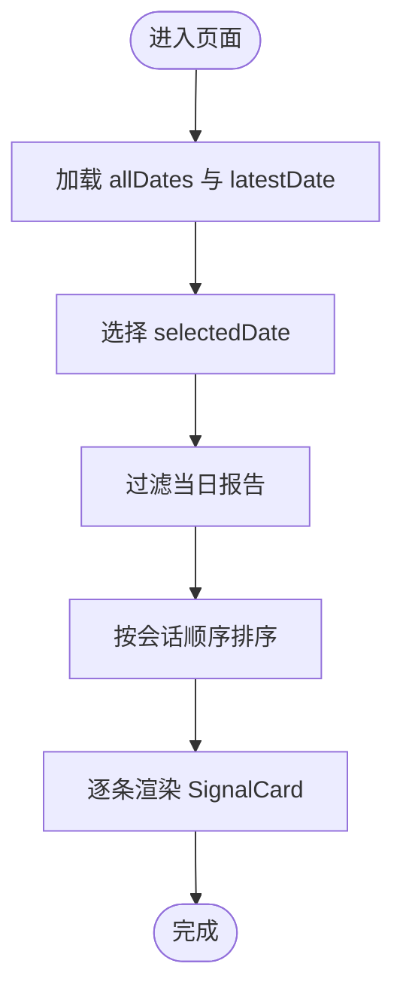
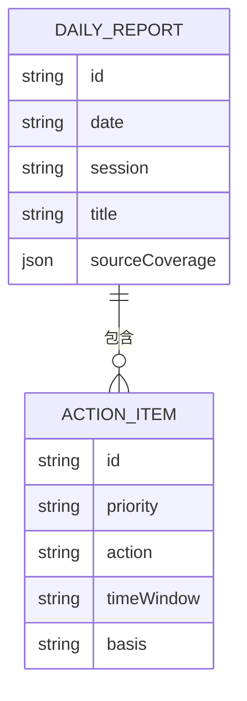
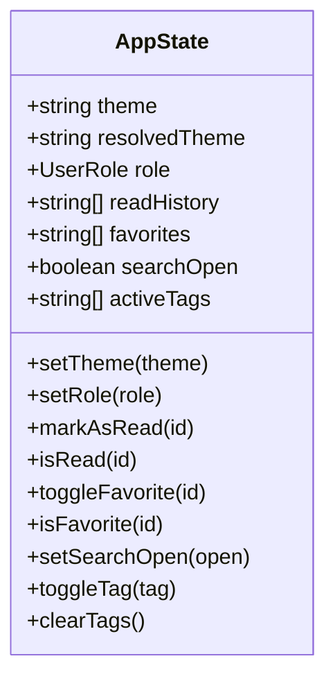
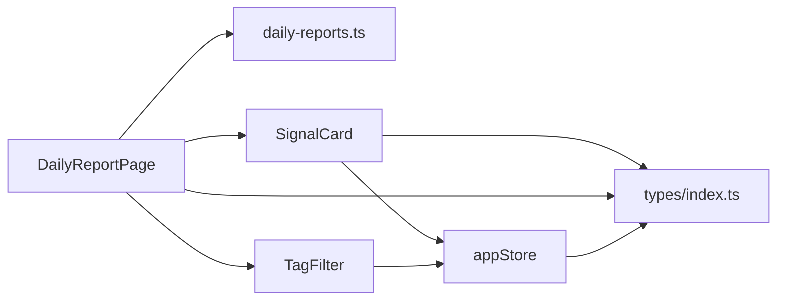
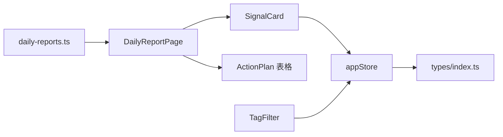

# 每日日报模块

<cite>
**本文引用的文件**
- [daily-reports.ts](file://src/data/daily-reports.ts)
- [index.tsx](file://src/pages/DailyReport/index.tsx)
- [index.tsx](file://src/components/SignalCard/index.tsx)
- [appStore.ts](file://src/stores/appStore.ts)
- [index.ts](file://src/types/index.ts)
- [index.tsx](file://src/components/TagFilter/index.tsx)
</cite>

## 目录
1. [简介](#简介)
2. [项目结构](#项目结构)
3. [核心组件](#核心组件)
4. [架构总览](#架构总览)
5. [详细组件分析](#详细组件分析)
6. [依赖关系分析](#依赖关系分析)
7. [性能考虑](#性能考虑)
8. [故障排查指南](#故障排查指南)
9. [结论](#结论)
10. [附录](#附录)

## 简介
本模块围绕“每日日报”功能，提供多源情报的每日聚合、信号识别与优先级评估、行动速查表的呈现与交互。系统以数据驱动为核心，通过 SignalCard 组件统一展示信号信息，ActionPlan 表格清晰呈现优先级与时间窗口，并结合应用状态存储实现收藏、标签筛选等用户行为持久化。本文档将从数据结构、处理流程、组件实现、状态管理到性能优化进行全面阐述，并给出信号添加、编辑、删除的操作指南与最佳实践。

## 项目结构
- 数据层：每日日报数据集中于 src/data/daily-reports.ts，包含多个日期的报告条目，每个条目包含信号列表与行动速查表。
- 页面层：DailyReportPage 负责日期选择、会话排序、报告分组与渲染。
- 组件层：SignalCard 负责单条信号的展示与交互；TagFilter 提供标签筛选能力。
- 状态层：Zustand 应用状态存储 appStore.ts 提供主题、角色、阅读历史、收藏、搜索开关与标签过滤等状态管理。
- 类型层：src/types/index.ts 定义了信号、行动项、来源覆盖、会话类型等核心数据结构。

图表来源
- [index.tsx:1-249](file://src/pages/DailyReport/index.tsx#L1-L249)
- [daily-reports.ts:1-455](file://src/data/daily-reports.ts#L1-L455)
- [index.tsx:1-111](file://src/components/SignalCard/index.tsx#L1-L111)
- [appStore.ts:1-93](file://src/stores/appStore.ts#L1-L93)
- [index.ts:1-212](file://src/types/index.ts#L1-L212)
- [index.tsx:1-49](file://src/components/TagFilter/index.tsx#L1-L49)

章节来源
- [index.tsx:1-249](file://src/pages/DailyReport/index.tsx#L1-L249)
- [daily-reports.ts:1-455](file://src/data/daily-reports.ts#L1-L455)
- [index.tsx:1-111](file://src/components/SignalCard/index.tsx#L1-L111)
- [appStore.ts:1-93](file://src/stores/appStore.ts#L1-L93)
- [index.ts:1-212](file://src/types/index.ts#L1-L212)
- [index.tsx:1-49](file://src/components/TagFilter/index.tsx#L1-L49)

## 核心组件
- SignalCard：负责单条信号的展示，包括标题、摘要、优先级徽章、来源标注、标签、详情展开、收藏按钮以及关联公司链接。
- DailyReportPage：负责日期选择器、报告分组（按会话排序）、信号卡片渲染、行动速查表渲染。
- appStore：提供收藏、标签筛选、主题、角色等全局状态，支持持久化。
- TagFilter：基于 appStore 的标签状态进行筛选，支持清除全部。
- 类型系统：Signal、ActionItem、SourceCoverage、Session 等类型定义保证数据一致性。

章节来源
- [index.tsx:26-111](file://src/components/SignalCard/index.tsx#L26-L111)
- [index.tsx:42-249](file://src/pages/DailyReport/index.tsx#L42-L249)
- [appStore.ts:35-92](file://src/stores/appStore.ts#L35-L92)
- [index.tsx:9-49](file://src/components/TagFilter/index.tsx#L9-L49)
- [index.ts:17-63](file://src/types/index.ts#L17-L63)

## 架构总览
系统采用“数据驱动 + 组件化 + 状态持久化”的架构：
- 数据来源：daily-reports.ts 提供结构化的日报数据。
- 页面控制：DailyReportPage 过滤并排序当日报告，逐个渲染 SignalCard。
- 交互与状态：SignalCard 通过 appStore 切换收藏；TagFilter 通过 appStore 切换标签筛选。
- 展示与布局：SignalCard 负责信号卡片的 UI；ActionPlan 表格在页面内渲染，使用与 SignalCard 相同的颜色系统。

图表来源
- [index.tsx:42-249](file://src/pages/DailyReport/index.tsx#L42-L249)
- [daily-reports.ts:1-455](file://src/data/daily-reports.ts#L1-L455)
- [index.tsx:26-111](file://src/components/SignalCard/index.tsx#L26-L111)
- [appStore.ts:35-92](file://src/stores/appStore.ts#L35-L92)
- [index.tsx:9-49](file://src/components/TagFilter/index.tsx#L9-L49)

## 详细组件分析

### SignalCard 组件
SignalCard 是信号展示的核心组件，承担以下职责：
- 展示信号标题、摘要、优先级徽章、来源名称。
- 支持展开/收起详情区域，详情内容来自 detail 字段。
- 渲染标签云，标签来源于 tags 数组。
- 关联公司展示，当 relatedCompanies 非空时显示外部链接图标与公司名列表。
- 收藏功能：通过 appStore.toggleFavorite 切换收藏状态，收藏状态由 appStore.isFavorite 提供。
- 动画与延迟：首次进入时使用 Framer Motion 动画，卡片按索引延迟入场，增强可读性。

优先级与样式映射：
- 优先级到边框颜色：high → border-signal-high；medium → border-signal-medium；low → border-signal-low。
- 优先级到徽章颜色：high → 红系；medium → 橙系；low → 绿系。
- 优先级标签文本：高/中/低。

交互流程（收藏）：

图表来源
- [index.tsx:26-111](file://src/components/SignalCard/index.tsx#L26-L111)
- [appStore.ts:60-67](file://src/stores/appStore.ts#L60-L67)

章节来源
- [index.tsx:12-111](file://src/components/SignalCard/index.tsx#L12-L111)
- [appStore.ts:20-24](file://src/stores/appStore.ts#L20-L24)

### DailyReportPage 页面
DailyReportPage 负责：
- 日期选择与日历：根据 allDates 构建日历网格，点击有报告的日期进行切换。
- 报告分组与排序：按日期过滤报告，再按会话顺序排序（pm → auto → visual → am）。
- 信号渲染：遍历 report.signals，传递给 SignalCard 渲染。
- 行动速查表：若 report.actionPlan 非空，则渲染表格，列包括优先级、行动、时间窗。
- 优先级颜色系统：与 SignalCard 一致，使用 priorityBadgeColors 与 priorityLabels。

渲染流程（信号卡片）：

图表来源
- [index.tsx:42-249](file://src/pages/DailyReport/index.tsx#L42-L249)

章节来源
- [index.tsx:42-249](file://src/pages/DailyReport/index.tsx#L42-L249)

### ActionPlan 表格
ActionPlan 表格的数据结构与渲染逻辑：
- 数据结构：ActionItem 包含 id、priority、action、timeWindow、basis。
- 渲染：表格头部包含“优先级”、“行动”、“时间窗”，行内优先级使用与 SignalCard 相同的颜色系统。
- 时间窗显示：timeWindow 字段直接展示，如“本周”、“本月”、“本季”、“半年”等。
- 依据来源：basis 字段用于标注信号来源或依据，便于追溯。

图表来源
- [index.ts:33-40](file://src/types/index.ts#L33-L40)
- [index.ts:53-63](file://src/types/index.ts#L53-L63)

章节来源
- [index.ts:33-40](file://src/types/index.ts#L33-L40)
- [index.ts:53-63](file://src/types/index.ts#L53-L63)
- [index.tsx:208-238](file://src/pages/DailyReport/index.tsx#L208-L238)

### appStore 状态管理
appStore 提供以下关键状态与方法：
- 主题：theme/resolvedTheme，支持 light/dark/system。
- 用户角色：role/setRole。
- 阅读历史：readHistory/markAsRead/isRead。
- 收藏：favorites/toggleFavorite/isFavorite。
- 搜索：searchOpen/setSearchOpen。
- 标签筛选：activeTags/toggleTag/clearTags。
- 持久化：使用 persist 中间件，仅持久化主题、角色、阅读历史、收藏。

图表来源
- [appStore.ts:5-33](file://src/stores/appStore.ts#L5-L33)

章节来源
- [appStore.ts:35-92](file://src/stores/appStore.ts#L35-L92)

### TagFilter 组件
TagFilter 基于 appStore 的 activeTags 状态进行筛选：
- 渲染所有可用标签，根据是否激活切换样式。
- 支持清除全部标签，调用 clearTags。
- 与 SignalCard 的 tags 渲染配合，形成“标签筛选 → 信号过滤”的闭环。

章节来源
- [index.tsx:9-49](file://src/components/TagFilter/index.tsx#L9-L49)

## 依赖关系分析
- DailyReportPage 依赖 daily-reports.ts 提供的数据，依赖 SignalCard 渲染信号，依赖 TagFilter 进行标签筛选。
- SignalCard 依赖 appStore 的收藏状态，依赖 types 中的 Signal 类型。
- appStore 依赖 Zustand 与持久化中间件，提供全局状态。
- TagFilter 依赖 appStore 的标签状态。
- 类型系统为所有组件提供强类型约束，确保数据一致性。

图表来源
- [index.tsx:1-249](file://src/pages/DailyReport/index.tsx#L1-L249)
- [daily-reports.ts:1-455](file://src/data/daily-reports.ts#L1-L455)
- [index.tsx:1-111](file://src/components/SignalCard/index.tsx#L1-L111)
- [index.tsx:1-49](file://src/components/TagFilter/index.tsx#L1-L49)
- [appStore.ts:1-93](file://src/stores/appStore.ts#L1-L93)
- [index.ts:1-212](file://src/types/index.ts#L1-L212)

章节来源
- [index.tsx:1-249](file://src/pages/DailyReport/index.tsx#L1-L249)
- [daily-reports.ts:1-455](file://src/data/daily-reports.ts#L1-L455)
- [index.tsx:1-111](file://src/components/SignalCard/index.tsx#L1-L111)
- [index.tsx:1-49](file://src/components/TagFilter/index.tsx#L1-L49)
- [appStore.ts:1-93](file://src/stores/appStore.ts#L1-L93)
- [index.ts:1-212](file://src/types/index.ts#L1-L212)

## 性能考虑
- 计算缓存：使用 useMemo 缓存 allDates、dateSet、dayReports，避免重复计算。
- 渲染优化：SignalCard 与报告容器使用 Framer Motion 动画，卡片按索引延迟入场，提升可读性与流畅度。
- 列表渲染：ActionPlan 表格使用稳定 key（id），减少不必要的重排。
- 状态持久化：appStore 使用 persist，减少刷新后的状态丢失，提升用户体验。
- 数据结构：SignalCard 与 ActionPlan 表格共享优先级颜色系统，降低样式维护成本。

章节来源
- [index.tsx:42-64](file://src/pages/DailyReport/index.tsx#L42-L64)
- [index.tsx:26-36](file://src/components/SignalCard/index.tsx#L26-L36)
- [appStore.ts:82-91](file://src/stores/appStore.ts#L82-L91)

## 故障排查指南
- 信号未显示详情：检查 Signal.detail 是否为空，只有存在 detail 时才会渲染展开按钮与详情区域。
- 收藏状态不同步：确认 appStore.toggleFavorite 与 isFavorite 的调用是否正确，以及是否启用了持久化。
- 标签筛选无效：确认 TagFilter 的 activeTags 是否与 SignalCard 的 tags 匹配，以及 toggleTag/clearTags 的调用。
- 日历不可点击：检查 daily-reports.ts 中是否存在对应日期的报告，否则日期不会出现在日历上。
- 优先级颜色不一致：确认 Signal.priority 与 ActionItem.priority 的值是否为 high/medium/low，以及颜色映射是否正确。

章节来源
- [index.tsx:80-99](file://src/components/SignalCard/index.tsx#L80-L99)
- [appStore.ts:60-67](file://src/stores/appStore.ts#L60-L67)
- [index.tsx:28-45](file://src/components/TagFilter/index.tsx#L28-L45)
- [daily-reports.ts:1-455](file://src/data/daily-reports.ts#L1-L455)
- [index.tsx:172-238](file://src/pages/DailyReport/index.tsx#L172-L238)

## 结论
每日日报模块通过清晰的数据结构、组件化渲染与状态管理，实现了信号识别、优先级评估与行动速查的高效展示。SignalCard 与 ActionPlan 表格共享优先级颜色系统，确保视觉一致性；appStore 提供收藏与标签筛选等交互能力，并通过持久化提升用户体验。整体架构简洁、可扩展性强，适合后续引入更多信号来源与评估算法。

## 附录

### 数据流从 daily-reports.ts 到页面组件的完整路径
- 数据加载：DailyReportPage 从 daily-reports.ts 导入数据集。
- 日期过滤：根据 selectedDate 过滤当日报告。
- 会话排序：按 pm/auto/visual/am 的顺序排序。
- 信号渲染：将 report.signals 传入 SignalCard 渲染。
- 行动速查：将 report.actionPlan 渲染为表格。
- 状态联动：SignalCard 通过 appStore 控制收藏状态；TagFilter 通过 appStore 控制标签筛选。

图表来源
- [daily-reports.ts:1-455](file://src/data/daily-reports.ts#L1-L455)
- [index.tsx:1-249](file://src/pages/DailyReport/index.tsx#L1-L249)
- [index.tsx:1-111](file://src/components/SignalCard/index.tsx#L1-L111)
- [index.tsx:1-49](file://src/components/TagFilter/index.tsx#L1-L49)
- [appStore.ts:1-93](file://src/stores/appStore.ts#L1-L93)
- [index.ts:1-212](file://src/types/index.ts#L1-L212)

### 信号添加、编辑、删除操作指南与最佳实践
- 添加信号
  - 在 daily-reports.ts 中新增 Signal 对象，设置 id、emoji、title、summary、detail、priority、tags、relatedCompanies、sourceType、sourceName。
  - 确保 priority 为 high/medium/low，tags 为字符串数组，relatedCompanies 为公司名数组。
  - 将新信号加入对应日期的 report.signals。
  - 如需在页面中展示详情，建议提供 detail 文本。
  - 若需要来源标注，确保 sourceName 与 sourceType 与类型系统一致。
- 编辑信号
  - 修改 daily-reports.ts 中对应 Signal 的字段，保持类型一致。
  - 若修改 priority，注意与 ActionPlan 的优先级颜色系统保持一致。
  - 若修改 tags 或 relatedCompanies，确保渲染逻辑正常。
- 删除信号
  - 从对应 report.signals 中移除目标 Signal 的 id。
  - 确认页面不再渲染该信号。
- 最佳实践
  - 优先级评估：遵循 high/medium/low 的业务规则，避免滥用 high。
  - 标签规范：使用简短、明确的标签，便于筛选与检索。
  - 来源标注：确保 sourceName 与 sourceType 与类型系统一致，便于后续扩展。
  - 详情内容：detail 应提供补充信息与背景，帮助用户快速理解信号影响。
  - 性能：避免一次性插入过多信号，必要时分批加载或懒渲染。

章节来源
- [daily-reports.ts:1-455](file://src/data/daily-reports.ts#L1-L455)
- [index.ts:17-31](file://src/types/index.ts#L17-L31)
- [index.tsx:202-206](file://src/pages/DailyReport/index.tsx#L202-L206)