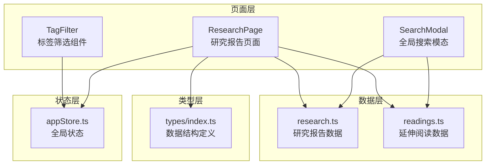
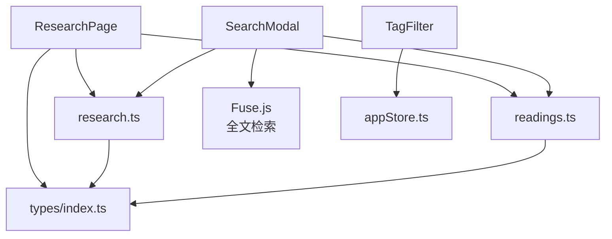
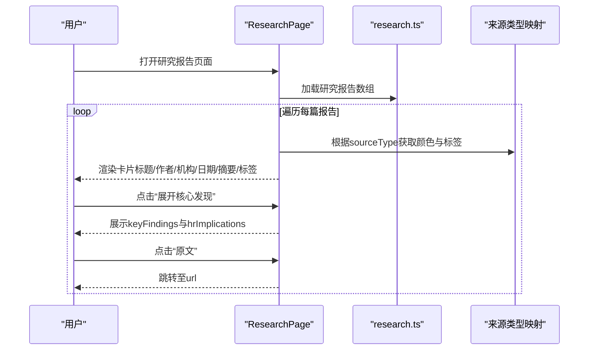
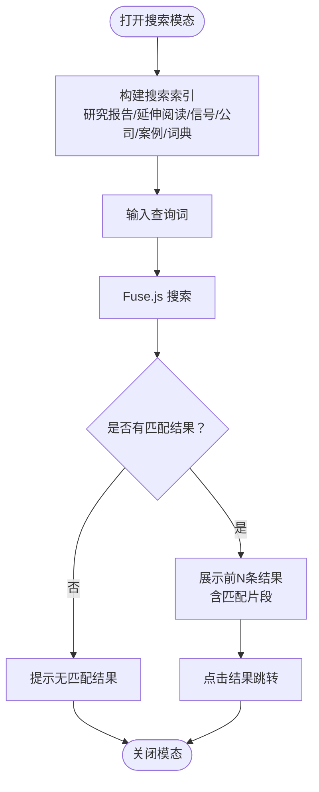
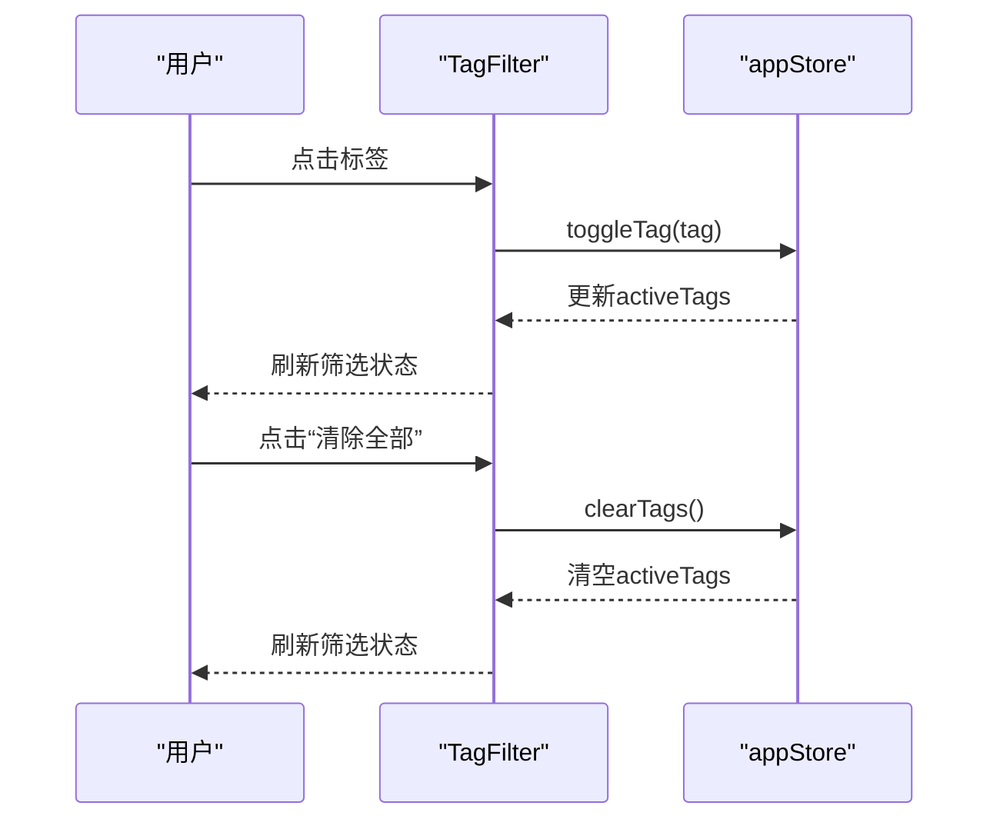
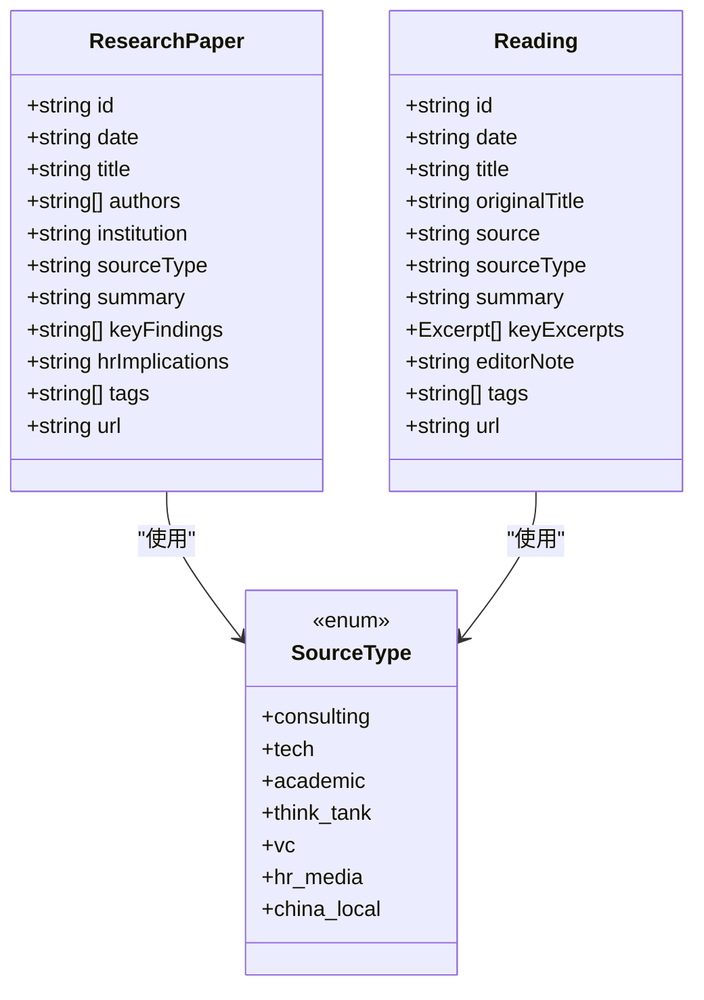
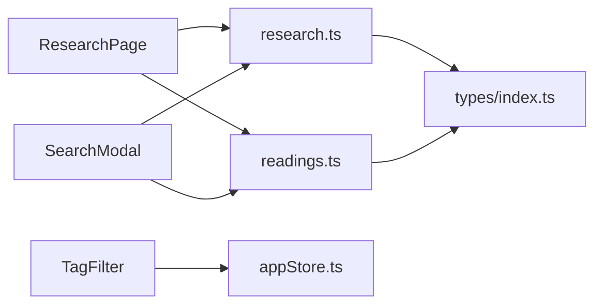

# 研究报告模块

<cite>
**本文档引用的文件**
- [src/pages/Research/index.tsx](file://src/pages/Research/index.tsx)
- [src/data/research.ts](file://src/data/research.ts)
- [src/types/index.ts](file://src/types/index.ts)
- [src/components/SearchModal/index.tsx](file://src/components/SearchModal/index.tsx)
- [src/components/TagFilter/index.tsx](file://src/components/TagFilter/index.tsx)
- [src/stores/appStore.ts](file://src/stores/appStore.ts)
- [src/data/readings.ts](file://src/data/readings.ts)
</cite>

## 目录
1. [简介](#简介)
2. [项目结构](#项目结构)
3. [核心组件](#核心组件)
4. [架构概览](#架构概览)
5. [详细组件分析](#详细组件分析)
6. [依赖关系分析](#依赖关系分析)
7. [性能考量](#性能考量)
8. [故障排除指南](#故障排除指南)
9. [结论](#结论)

## 简介
本模块聚焦于权威研究机构报告的整合与呈现，涵盖报告分类体系、发布日期管理、摘要与关键发现的展示机制；定义了研究报告与延伸阅读的数据结构；实现了全文检索、标签过滤等筛选功能，并提供报告详情页的布局思路（原文链接、HR启示、相关阅读等）。当前实现以静态数据驱动为主，便于快速迭代与内容管理。

## 项目结构
研究报告模块由以下层次组成：
- 页面层：负责整体布局、卡片渲染与交互（展开/收起、跳转原文）
- 数据层：提供研究报告与延伸阅读的静态数据集合
- 类型层：统一定义研究报告、延伸阅读等数据结构
- 搜索与筛选：通过全局搜索模态与标签过滤组件实现跨内容的检索与筛选
- 状态层：使用轻量状态存储管理主题、用户角色、收藏、搜索开关与标签筛选状态

**图表来源**
- [src/pages/Research/index.tsx:1-244](file://src/pages/Research/index.tsx#L1-L244)
- [src/data/research.ts:1-56](file://src/data/research.ts#L1-L56)
- [src/data/readings.ts:1-133](file://src/data/readings.ts#L1-L133)
- [src/types/index.ts:77-121](file://src/types/index.ts#L77-L121)
- [src/components/SearchModal/index.tsx:1-156](file://src/components/SearchModal/index.tsx#L1-L156)
- [src/components/TagFilter/index.tsx:1-49](file://src/components/TagFilter/index.tsx#L1-L49)
- [src/stores/appStore.ts:1-93](file://src/stores/appStore.ts#L1-L93)

**章节来源**
- [src/pages/Research/index.tsx:1-244](file://src/pages/Research/index.tsx#L1-L244)
- [src/data/research.ts:1-56](file://src/data/research.ts#L1-L56)
- [src/data/readings.ts:1-133](file://src/data/readings.ts#L1-L133)
- [src/types/index.ts:77-121](file://src/types/index.ts#L77-L121)
- [src/components/SearchModal/index.tsx:1-156](file://src/components/SearchModal/index.tsx#L1-L156)
- [src/components/TagFilter/index.tsx:1-49](file://src/components/TagFilter/index.tsx#L1-L49)
- [src/stores/appStore.ts:1-93](file://src/stores/appStore.ts#L1-L93)

## 核心组件
- 研究报告页面：负责渲染研究报告列表、展开/收起关键发现与HR启示、跳转原文链接、展示标签与来源类型徽章
- 延伸阅读页面：负责渲染延伸阅读列表、展示关键摘录与编辑导读、跳转原文链接、展示标签
- 全局搜索：基于全文检索索引，支持跨模块（研究报告、延伸阅读、信号、公司、案例、词典）的即时搜索
- 标签筛选：提供多选标签过滤，支持清除全部标签
- 数据结构：统一定义研究报告与延伸阅读字段，确保前后端一致的数据契约

**章节来源**
- [src/pages/Research/index.tsx:25-243](file://src/pages/Research/index.tsx#L25-L243)
- [src/components/SearchModal/index.tsx:47-155](file://src/components/SearchModal/index.tsx#L47-L155)
- [src/components/TagFilter/index.tsx:9-48](file://src/components/TagFilter/index.tsx#L9-L48)
- [src/types/index.ts:77-121](file://src/types/index.ts#L77-L121)

## 架构概览
研究报告模块采用“页面 + 数据 + 类型 + 搜索 + 筛选”的分层架构，页面层通过数据层提供的静态数据进行渲染；搜索与筛选通过全局状态与第三方库实现；类型层保证数据一致性与可维护性。

**图表来源**
- [src/pages/Research/index.tsx:1-244](file://src/pages/Research/index.tsx#L1-L244)
- [src/data/research.ts:1-56](file://src/data/research.ts#L1-L56)
- [src/data/readings.ts:1-133](file://src/data/readings.ts#L1-L133)
- [src/types/index.ts:77-121](file://src/types/index.ts#L77-L121)
- [src/components/SearchModal/index.tsx:53-57](file://src/components/SearchModal/index.tsx#L53-L57)
- [src/components/TagFilter/index.tsx:10-10](file://src/components/TagFilter/index.tsx#L10-L10)
- [src/stores/appStore.ts:74-80](file://src/stores/appStore.ts#L74-L80)

## 详细组件分析

### 研究报告页面（ResearchPage）
- 功能要点
  - 分区切换：研究报告与延伸阅读双分区，分别渲染不同数据集合
  - 卡片信息：标题、作者、机构、发布日期、来源类型徽章、摘要、标签
  - 展开/收起：点击“核心发现”按钮展开/收起关键发现与HR启示
  - 原文链接：支持外部原文跳转
  - 来源类型映射：根据来源类型动态设置颜色与标签文案
- 交互流程

**图表来源**
- [src/pages/Research/index.tsx:75-157](file://src/pages/Research/index.tsx#L75-L157)
- [src/pages/Research/index.tsx:117-143](file://src/pages/Research/index.tsx#L117-L143)
- [src/pages/Research/index.tsx:92-102](file://src/pages/Research/index.tsx#L92-L102)
- [src/data/research.ts:3-56](file://src/data/research.ts#L3-L56)

**章节来源**
- [src/pages/Research/index.tsx:25-243](file://src/pages/Research/index.tsx#L25-L243)
- [src/data/research.ts:3-56](file://src/data/research.ts#L3-L56)

### 延伸阅读页面（Readings）
- 功能要点
  - 卡片信息：标题、原文标题、来源、发布日期、摘要、关键摘录、编辑导读、标签
  - 关键摘录：以引用样式展示精选摘录及上下文
  - 编辑导读：提供编辑视角的解读与建议
- 设计说明
  - 与研究报告页面保持一致的卡片风格与交互模式，便于用户在两类内容间切换

**章节来源**
- [src/pages/Research/index.tsx:159-240](file://src/pages/Research/index.tsx#L159-L240)
- [src/data/readings.ts:3-133](file://src/data/readings.ts#L3-L133)

### 全局搜索（SearchModal）
- 功能要点
  - 搜索索引构建：从研究报告、延伸阅读、信号、公司、案例、词典构建统一索引
  - 全文检索：基于标题与内容进行模糊匹配，返回前N条结果
  - 结果高亮：显示匹配片段，便于快速定位
  - 路径跳转：点击结果后路由到对应页面
- 算法与配置
  - 使用第三方库进行倒排索引与相似度计算
  - 配置阈值与匹配字段，平衡召回与精度

**图表来源**
- [src/components/SearchModal/index.tsx:22-45](file://src/components/SearchModal/index.tsx#L22-L45)
- [src/components/SearchModal/index.tsx:53-59](file://src/components/SearchModal/index.tsx#L53-L59)
- [src/components/SearchModal/index.tsx:117-138](file://src/components/SearchModal/index.tsx#L117-L138)

**章节来源**
- [src/components/SearchModal/index.tsx:1-156](file://src/components/SearchModal/index.tsx#L1-L156)
- [src/data/research.ts:3-56](file://src/data/research.ts#L3-L56)
- [src/data/readings.ts:3-133](file://src/data/readings.ts#L3-L133)

### 标签筛选（TagFilter）
- 功能要点
  - 展示所有可用标签，支持多选
  - 与全局状态联动，实现跨页面筛选
  - 提供一键清空功能
- 交互流程

**图表来源**
- [src/components/TagFilter/index.tsx:9-48](file://src/components/TagFilter/index.tsx#L9-L48)
- [src/stores/appStore.ts:74-80](file://src/stores/appStore.ts#L74-L80)

**章节来源**
- [src/components/TagFilter/index.tsx:1-49](file://src/components/TagFilter/index.tsx#L1-L49)
- [src/stores/appStore.ts:1-93](file://src/stores/appStore.ts#L1-L93)

### 数据结构（Types）
- 研究报告（ResearchPaper）
  - 字段：id、date、title、authors、institution、sourceType、summary、keyFindings、hrImplications、tags、url
  - 用途：承载研究报告的元数据与内容，支撑页面渲染与搜索索引
- 延伸阅读（Reading）
  - 字段：id、date、title、originalTitle、source、sourceType、summary、keyExcerpts、editorNote、tags、url
  - 用途：承载延伸阅读的元数据与内容，支撑页面渲染与搜索索引
- 来源类型（SourceType）
  - 定义：consulting、tech、academic、think_tank、vc、hr_media、china_local
  - 用途：统一来源分类，便于筛选与着色

**图表来源**
- [src/types/index.ts:77-121](file://src/types/index.ts#L77-L121)

**章节来源**
- [src/types/index.ts:77-121](file://src/types/index.ts#L77-L121)

## 依赖关系分析
- 页面对数据的依赖：ResearchPage直接依赖静态数据集合，实现零后端耦合
- 搜索对索引的依赖：SearchModal依赖研究与阅读数据构建索引，实现跨内容检索
- 筛选对状态的依赖：TagFilter依赖全局状态存储，实现跨页面筛选
- 类型对数据的约束：types/index.ts统一规范字段，降低维护成本

**图表来源**
- [src/pages/Research/index.tsx:1-244](file://src/pages/Research/index.tsx#L1-L244)
- [src/data/research.ts:1-56](file://src/data/research.ts#L1-L56)
- [src/data/readings.ts:1-133](file://src/data/readings.ts#L1-L133)
- [src/components/SearchModal/index.tsx:1-156](file://src/components/SearchModal/index.tsx#L1-L156)
- [src/components/TagFilter/index.tsx:1-49](file://src/components/TagFilter/index.tsx#L1-L49)
- [src/stores/appStore.ts:1-93](file://src/stores/appStore.ts#L1-L93)
- [src/types/index.ts:77-121](file://src/types/index.ts#L77-L121)

**章节来源**
- [src/pages/Research/index.tsx:1-244](file://src/pages/Research/index.tsx#L1-L244)
- [src/components/SearchModal/index.tsx:1-156](file://src/components/SearchModal/index.tsx#L1-L156)
- [src/components/TagFilter/index.tsx:1-49](file://src/components/TagFilter/index.tsx#L1-L49)
- [src/stores/appStore.ts:1-93](file://src/stores/appStore.ts#L1-L93)
- [src/types/index.ts:77-121](file://src/types/index.ts#L77-L121)

## 性能考量
- 静态数据渲染：页面直接渲染静态数据，避免网络请求开销，加载速度快
- 搜索性能：使用倒排索引与阈值控制，限制返回结果数量，兼顾速度与体验
- 状态持久化：全局状态持久化到本地存储，减少重复初始化成本
- 建议优化
  - 搜索索引预构建与缓存，避免每次打开模态重建索引
  - 标签筛选采用防抖或批量更新策略，减少重渲染次数
  - 对长文本摘要与摘录进行懒加载或虚拟滚动（如数据量增大）

## 故障排除指南
- 搜索无结果
  - 检查搜索索引是否包含目标内容（研究报告/延伸阅读/信号/公司/案例/词典）
  - 调整查询关键词或放宽匹配阈值
- 标签筛选无效
  - 确认全局状态中的activeTags是否正确更新
  - 检查页面是否订阅了状态变更
- 卡片渲染异常
  - 核对数据字段是否符合类型定义
  - 检查来源类型映射是否存在缺失

**章节来源**
- [src/components/SearchModal/index.tsx:53-59](file://src/components/SearchModal/index.tsx#L53-L59)
- [src/stores/appStore.ts:74-80](file://src/stores/appStore.ts#L74-L80)
- [src/types/index.ts:77-121](file://src/types/index.ts#L77-L121)

## 结论
研究报告模块通过清晰的分层设计与统一的数据契约，实现了权威报告的高效整合与便捷检索。页面层提供直观的卡片式展示与交互，搜索与筛选组件提升了内容发现效率。未来可在搜索索引缓存、标签筛选性能与长文本渲染等方面持续优化，进一步提升用户体验与可扩展性。