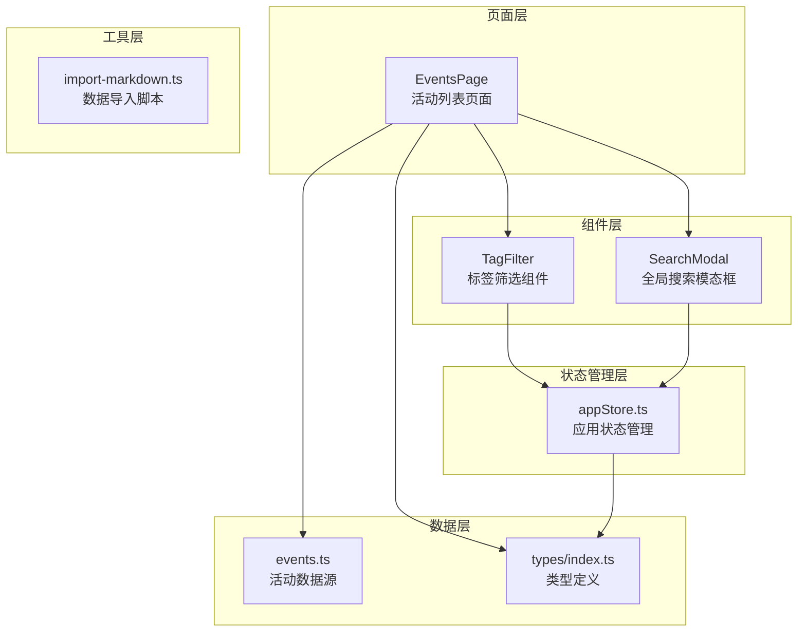
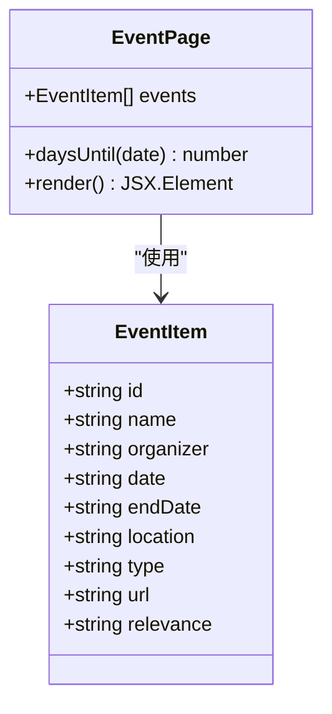
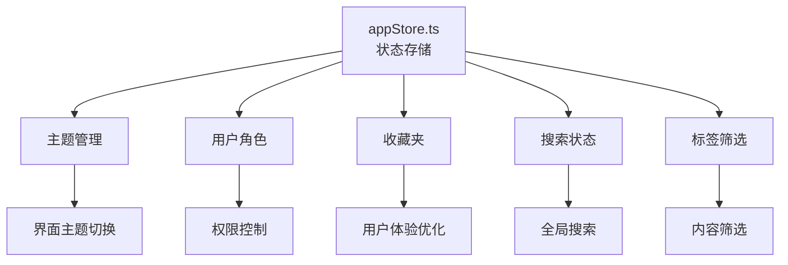
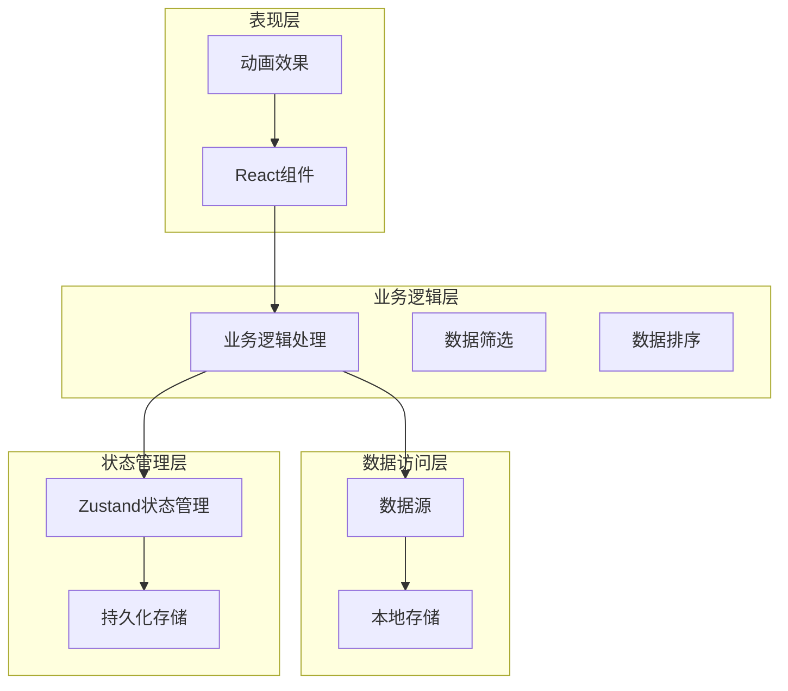
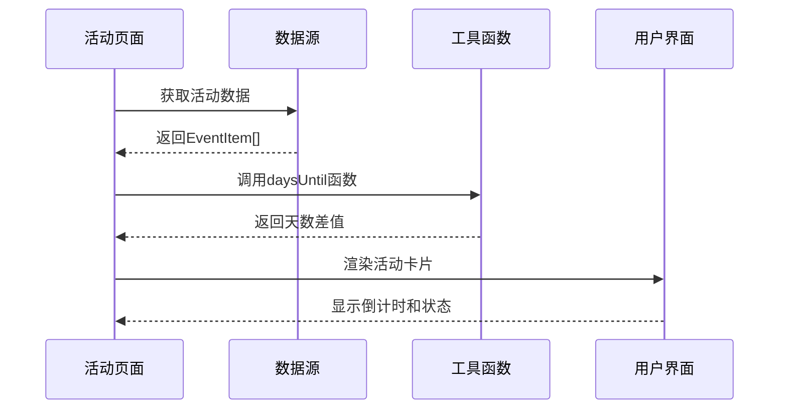
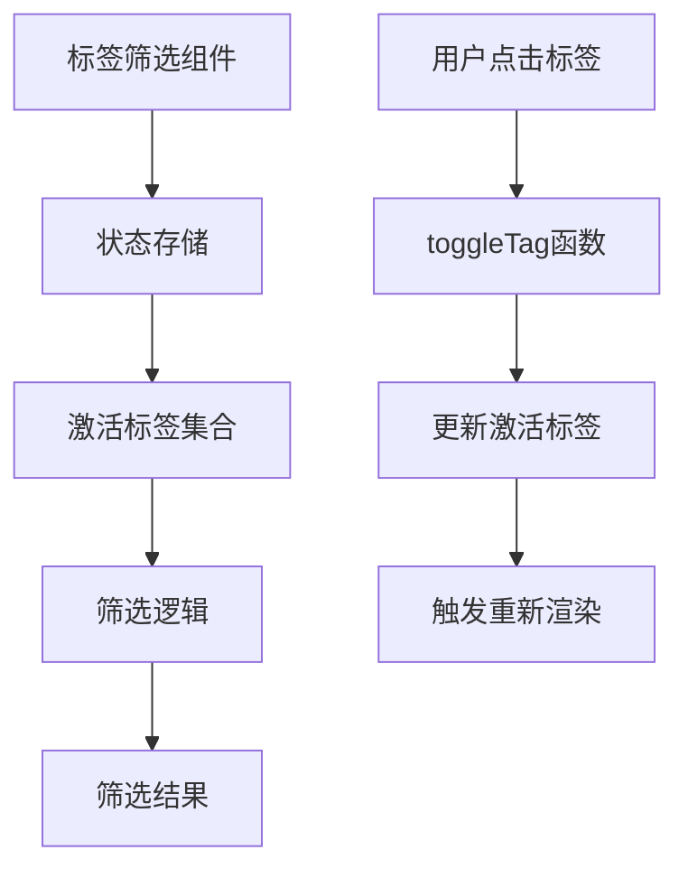
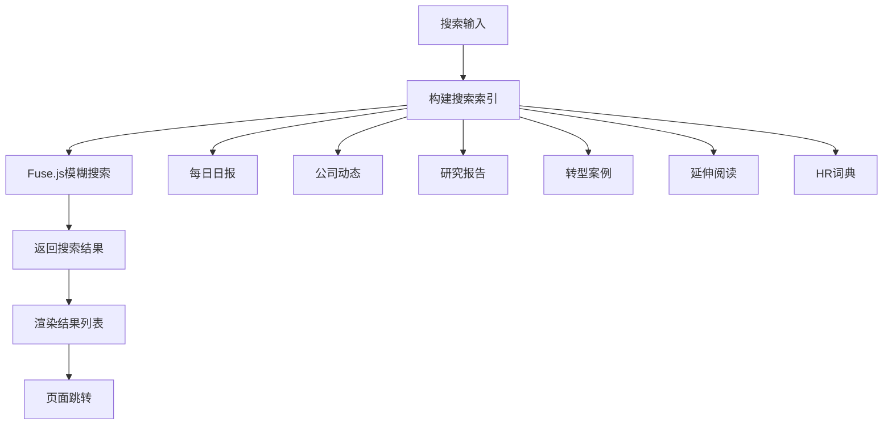
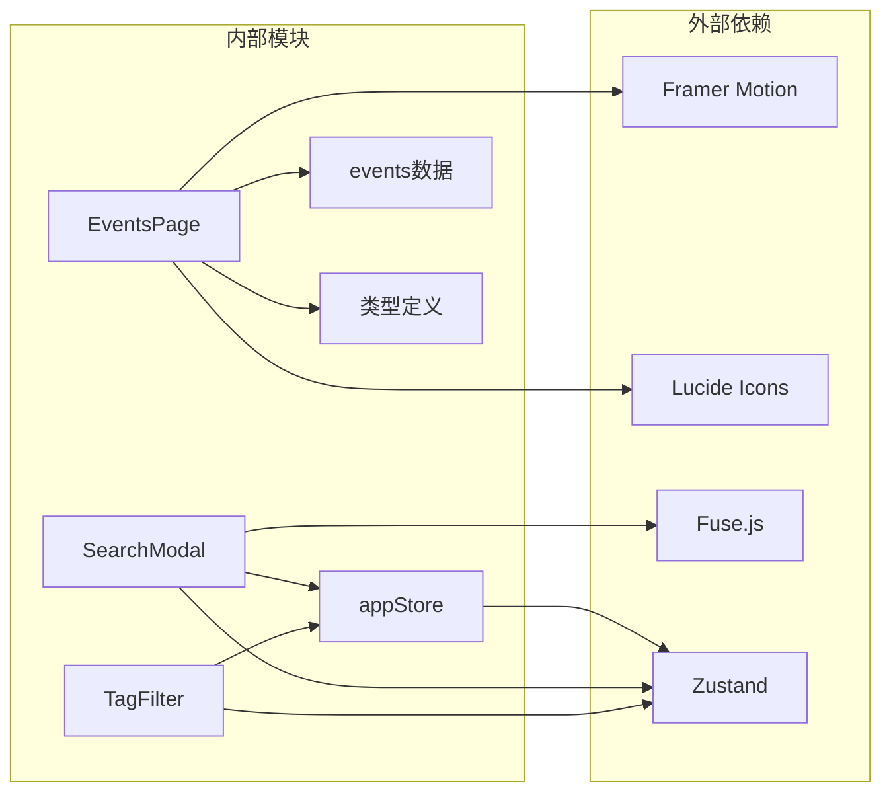
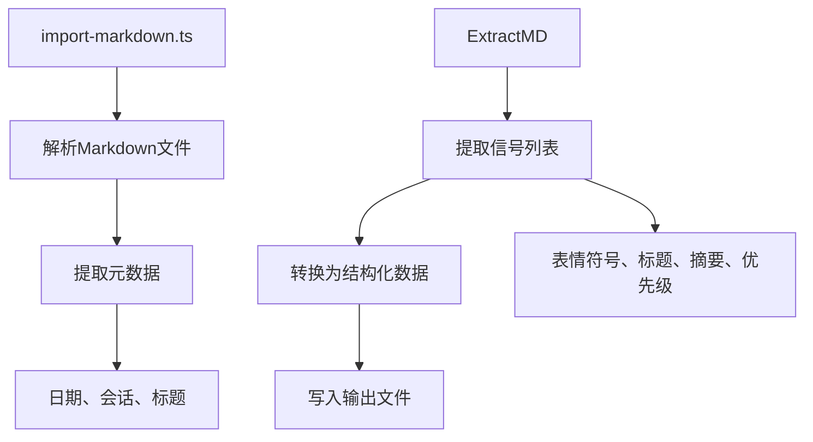

# 行业议程模块

<cite>
**本文档引用的文件**
- [src/pages/Events/index.tsx](file://src/pages/Events/index.tsx)
- [src/data/events.ts](file://src/data/events.ts)
- [src/types/index.ts](file://src/types/index.ts)
- [src/components/TagFilter/index.tsx](file://src/components/TagFilter/index.tsx)
- [src/components/SearchModal/index.tsx](file://src/components/SearchModal/index.tsx)
- [src/stores/appStore.ts](file://src/stores/appStore.ts)
- [scripts/import-markdown.ts](file://scripts/import-markdown.ts)
</cite>

## 目录
1. [简介](#简介)
2. [项目结构](#项目结构)
3. [核心组件](#核心组件)
4. [架构概览](#架构概览)
5. [详细组件分析](#详细组件分析)
6. [依赖关系分析](#依赖关系分析)
7. [性能考虑](#性能考虑)
8. [故障排除指南](#故障排除指南)
9. [结论](#结论)
10. [附录](#附录)

## 简介
行业议程模块是未来洞察平台的核心功能之一，负责展示和管理行业会议与活动日历。该模块提供了完整的活动信息展示、时间安排、地点标注、相关性分级等功能，并支持按日期排序、按类型过滤等筛选能力。模块采用React + TypeScript构建，使用Zustand进行状态管理，配合Framer Motion实现流畅的动画效果。

## 项目结构
行业议程模块主要由以下层次组成：

**图表来源**
- [src/pages/Events/index.tsx:1-94](file://src/pages/Events/index.tsx#L1-L94)
- [src/data/events.ts:1-13](file://src/data/events.ts#L1-L13)
- [src/types/index.ts:176-187](file://src/types/index.ts#L176-L187)

**章节来源**
- [src/pages/Events/index.tsx:18-93](file://src/pages/Events/index.tsx#L18-L93)
- [src/data/events.ts:3-12](file://src/data/events.ts#L3-L12)
- [src/types/index.ts:176-187](file://src/types/index.ts#L176-L187)

## 核心组件
行业议程模块的核心组件包括活动列表页面、数据模型、筛选组件和状态管理。

### 活动数据模型
活动数据模型定义了完整的活动信息结构，支持多种活动类型和相关属性：

**图表来源**
- [src/types/index.ts:176-187](file://src/types/index.ts#L176-L187)
- [src/pages/Events/index.tsx:12-16](file://src/pages/Events/index.tsx#L12-L16)

### 状态管理架构
应用使用Zustand进行状态管理，支持主题切换、用户角色、收藏夹、搜索状态和标签筛选等功能：

**图表来源**
- [src/stores/appStore.ts:35-92](file://src/stores/appStore.ts#L35-L92)

**章节来源**
- [src/types/index.ts:176-187](file://src/types/index.ts#L176-L187)
- [src/stores/appStore.ts:5-33](file://src/stores/appStore.ts#L5-L33)

## 架构概览
行业议程模块采用分层架构设计，确保了良好的可维护性和扩展性：

**图表来源**
- [src/pages/Events/index.tsx:18-93](file://src/pages/Events/index.tsx#L18-L93)
- [src/stores/appStore.ts:35-92](file://src/stores/appStore.ts#L35-L92)

## 详细组件分析

### 活动列表页面组件
活动列表页面是整个模块的核心组件，负责展示所有活动信息并提供交互功能。

#### 组件功能特性
- **时间排序显示**：按照活动日期进行升序排列
- **倒计时计算**：智能显示距离活动开始的天数
- **状态标识**：区分已结束、即将开始、正在进行的活动
- **响应式设计**：适配不同屏幕尺寸的设备

#### 数据处理流程

**图表来源**
- [src/pages/Events/index.tsx:18-93](file://src/pages/Events/index.tsx#L18-L93)
- [src/data/events.ts:3-12](file://src/data/events.ts#L3-L12)

#### 界面布局设计
活动卡片采用卡片式设计，包含以下关键元素：
- **日期徽章**：显示活动月份和日期
- **活动信息**：名称、主办方、地点
- **相关性标签**：高/中/低相关性标识
- **倒计时显示**：智能显示剩余天数或特殊状态

**章节来源**
- [src/pages/Events/index.tsx:18-93](file://src/pages/Events/index.tsx#L18-L93)

### 标签筛选组件
标签筛选组件提供了灵活的内容筛选功能，支持多标签组合筛选。

#### 组件交互流程

**图表来源**
- [src/components/TagFilter/index.tsx:9-48](file://src/components/TagFilter/index.tsx#L9-L48)
- [src/stores/appStore.ts:74-80](file://src/stores/appStore.ts#L74-L80)

**章节来源**
- [src/components/TagFilter/index.tsx:9-48](file://src/components/TagFilter/index.tsx#L9-L48)
- [src/stores/appStore.ts:29-33](file://src/stores/appStore.ts#L29-L33)

### 全局搜索组件
全局搜索组件提供了跨模块的统一搜索功能，支持快速定位相关内容。

#### 搜索算法实现

**图表来源**
- [src/components/SearchModal/index.tsx:22-45](file://src/components/SearchModal/index.tsx#L22-L45)
- [src/components/SearchModal/index.tsx:53-57](file://src/components/SearchModal/index.tsx#L53-L57)

**章节来源**
- [src/components/SearchModal/index.tsx:47-155](file://src/components/SearchModal/index.tsx#L47-L155)

## 依赖关系分析
模块的依赖关系清晰明确，遵循单一职责原则：

**图表来源**
- [src/pages/Events/index.tsx:1-3](file://src/pages/Events/index.tsx#L1-L3)
- [src/components/TagFilter/index.tsx:1-3](file://src/components/TagFilter/index.tsx#L1-L3)
- [src/components/SearchModal/index.tsx:1-5](file://src/components/SearchModal/index.tsx#L1-L5)

**章节来源**
- [src/pages/Events/index.tsx:1-3](file://src/pages/Events/index.tsx#L1-L3)
- [src/components/TagFilter/index.tsx:1-3](file://src/components/TagFilter/index.tsx#L1-L3)
- [src/components/SearchModal/index.tsx:1-5](file://src/components/SearchModal/index.tsx#L1-L5)

## 性能考虑
模块在设计时充分考虑了性能优化：

### 渲染优化
- **动画性能**：使用Framer Motion的硬件加速动画
- **条件渲染**：根据活动状态动态调整渲染内容
- **延迟加载**：使用过渡动画提升用户体验

### 数据处理优化
- **内存管理**：避免不必要的数组复制和对象创建
- **计算缓存**：合理使用函数式编程减少重复计算
- **事件处理**：优化事件监听器的绑定和解绑

### 状态管理优化
- **局部状态**：仅在必要时更新组件状态
- **状态分离**：将不同类型的用户偏好分离管理
- **持久化策略**：选择性持久化重要状态

## 故障排除指南
常见问题及解决方案：

### 活动显示异常
**问题**：活动日期显示错误或排序混乱
**解决方案**：
1. 检查日期格式是否符合YYYY-MM-DD标准
2. 验证事件数据源中的日期字段
3. 确认排序算法的正确性

### 筛选功能失效
**问题**：标签筛选无法正常工作
**解决方案**：
1. 检查标签数据源是否正确传递
2. 验证toggleTag函数的状态更新逻辑
3. 确认组件的重新渲染触发机制

### 搜索功能异常
**问题**：全局搜索无结果或响应缓慢
**解决方案**：
1. 检查搜索索引构建过程
2. 验证Fuse.js配置参数
3. 优化搜索结果的截取逻辑

**章节来源**
- [src/pages/Events/index.tsx:12-16](file://src/pages/Events/index.tsx#L12-L16)
- [src/components/TagFilter/index.tsx:34-42](file://src/components/TagFilter/index.tsx#L34-L42)
- [src/components/SearchModal/index.tsx:53-57](file://src/components/SearchModal/index.tsx#L53-L57)

## 结论
行业议程模块通过精心设计的架构和组件实现了完整的活动管理功能。模块具有以下优势：

1. **清晰的架构**：分层设计确保了良好的可维护性
2. **丰富的功能**：支持活动展示、筛选、搜索等多种功能
3. **优秀的性能**：优化的渲染和状态管理机制
4. **良好的扩展性**：模块化的组件设计便于功能扩展

该模块为用户提供了一个直观、高效的行业活动管理界面，能够满足HR专业人士对行业动态跟踪的需求。

## 附录

### 数据导入流程
系统提供了Markdown到JSON的数据导入功能，支持批量数据处理：

**图表来源**
- [scripts/import-markdown.ts:18-63](file://scripts/import-markdown.ts#L18-L63)
- [scripts/import-markdown.ts:79-130](file://scripts/import-markdown.ts#L79-L130)

### 活动数据模型详解
活动数据模型支持完整的活动信息描述，包括基础信息、时间安排、地点信息和相关性评级。

**章节来源**
- [scripts/import-markdown.ts:132-158](file://scripts/import-markdown.ts#L132-L158)