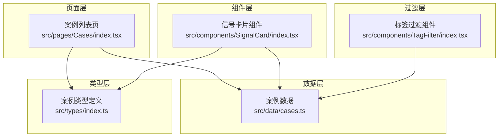
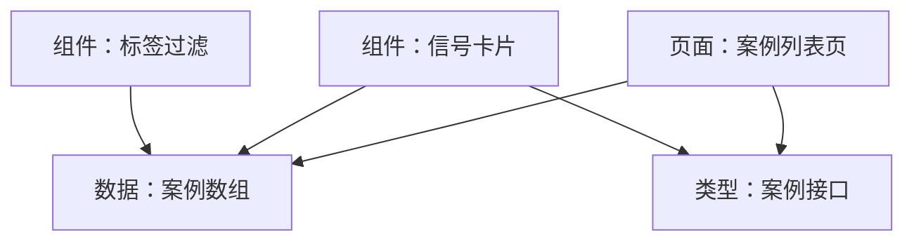
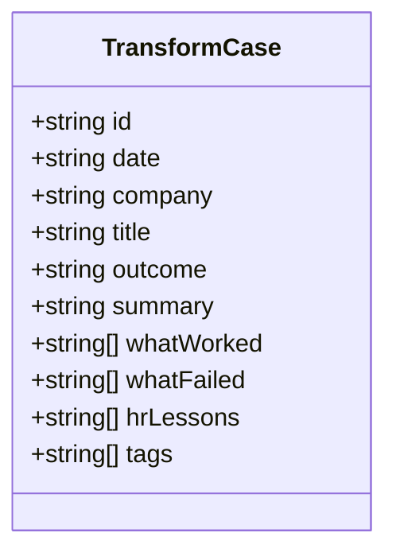
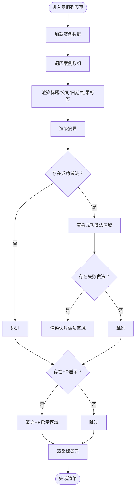
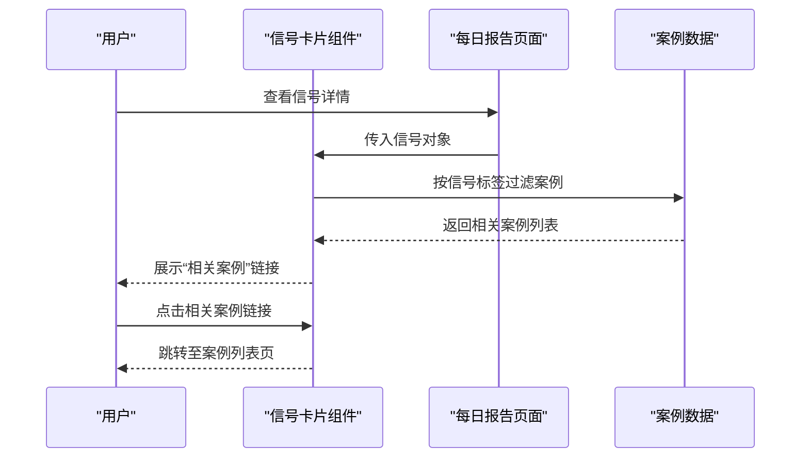
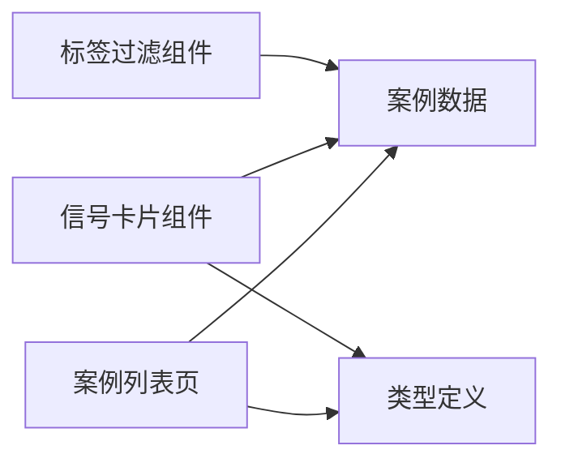

# 转型案例模块

<cite>
**本文引用的文件**
- [src/pages/Cases/index.tsx](file://src/pages/Cases/index.tsx)
- [src/data/cases.ts](file://src/data/cases.ts)
- [src/types/index.ts](file://src/types/index.ts)
- [src/components/SignalCard/index.tsx](file://src/components/SignalCard/index.tsx)
- [src/pages/DailyReport/index.tsx](file://src/pages/DailyReport/index.tsx)
- [src/components/TagFilter/index.tsx](file://src/components/TagFilter/index.tsx)
</cite>

## 目录
1. [简介](#简介)
2. [项目结构](#项目结构)
3. [核心组件](#核心组件)
4. [架构总览](#架构总览)
5. [详细组件分析](#详细组件分析)
6. [依赖关系分析](#依赖关系分析)
7. [性能考量](#性能考量)
8. [故障排查指南](#故障排查指南)
9. [结论](#结论)
10. [附录](#附录)

## 简介
本模块围绕“AI 转型案例”构建，提供案例收集、分类、评级、展示与关联推荐能力。当前实现聚焦于案例列表页的卡片式展示与基础交互，支持按标签筛选与跨内容板块的“相关案例”链接。后续可在现有基础上扩展详情页、时间轴、图表分析、专家点评、贡献流程与审核机制等。

## 项目结构
- 页面层：案例列表页负责渲染案例卡片与基础交互。
- 数据层：案例数据以静态数组形式提供，定义了完整的案例数据模型。
- 类型层：统一声明案例的数据结构与枚举值，确保类型安全。
- 组件层：信号卡片组件提供“相关案例”链接能力，便于跨板块联动。
- 过滤层：标签过滤组件提供标签维度的筛选入口。

**图示来源**
- [src/pages/Cases/index.tsx:1-96](file://src/pages/Cases/index.tsx#L1-L96)
- [src/data/cases.ts:1-63](file://src/data/cases.ts#L1-L63)
- [src/types/index.ts:92-106](file://src/types/index.ts#L92-L106)
- [src/components/SignalCard/index.tsx:1-173](file://src/components/SignalCard/index.tsx#L1-L173)
- [src/components/TagFilter/index.tsx](file://src/components/TagFilter/index.tsx)

**章节来源**
- [src/pages/Cases/index.tsx:1-96](file://src/pages/Cases/index.tsx#L1-L96)
- [src/data/cases.ts:1-63](file://src/data/cases.ts#L1-L63)
- [src/types/index.ts:92-106](file://src/types/index.ts#L92-L106)
- [src/components/SignalCard/index.tsx:1-173](file://src/components/SignalCard/index.tsx#L1-L173)
- [src/components/TagFilter/index.tsx](file://src/components/TagFilter/index.tsx)

## 核心组件
- 案例数据模型：定义案例标识、日期、公司、标题、结果类别、摘要、成功做法、失败做法、HR启示、标签等字段。
- 案例列表页：渲染案例卡片，展示标题、公司、日期、结果标签、摘要、成功/失败要点、HR启示与标签云。
- 信号卡片组件：提供“相关案例”链接，支持从信号到案例的反向关联。
- 标签过滤组件：提供标签维度的筛选入口，便于按主题快速定位案例。

**章节来源**
- [src/types/index.ts:92-106](file://src/types/index.ts#L92-L106)
- [src/pages/Cases/index.tsx:1-96](file://src/pages/Cases/index.tsx#L1-L96)
- [src/components/SignalCard/index.tsx:1-173](file://src/components/SignalCard/index.tsx#L1-L173)
- [src/components/TagFilter/index.tsx](file://src/components/TagFilter/index.tsx)

## 架构总览
案例模块采用“页面 + 数据 + 类型 + 组件”的分层架构，页面负责展示与交互，数据提供真实案例，类型保证结构一致性，组件提供可复用的展示与关联能力。

**图示来源**
- [src/pages/Cases/index.tsx:1-96](file://src/pages/Cases/index.tsx#L1-L96)
- [src/data/cases.ts:1-63](file://src/data/cases.ts#L1-L63)
- [src/types/index.ts:92-106](file://src/types/index.ts#L92-L106)
- [src/components/SignalCard/index.tsx:1-173](file://src/components/SignalCard/index.tsx#L1-L173)
- [src/components/TagFilter/index.tsx](file://src/components/TagFilter/index.tsx)

## 详细组件分析

### 案例数据模型
- 字段说明
  - id：案例唯一标识
  - date：案例日期
  - company：公司名称
  - title：案例标题
  - outcome：结果类别（success/failure/mixed）
  - summary：案例摘要
  - whatWorked：做对了什么（数组）
  - whatFailed：做错了什么（数组）
  - hrLessons：HR启示（数组）
  - tags：标签（数组）

**图示来源**
- [src/types/index.ts:92-106](file://src/types/index.ts#L92-L106)

**章节来源**
- [src/types/index.ts:92-106](file://src/types/index.ts#L92-L106)

### 案例列表页（CasesPage）
- 展示逻辑
  - 渲染每个案例的标题、公司、日期、结果标签（含图标与颜色）、摘要。
  - 条件渲染“做对了什么”和“做错了什么”两个区域。
  - 渲染HR启示区域。
  - 渲染标签云。
  - 动画入场效果逐条加载。
- 结果标签配置
  - 成功/失败/混合分别映射不同图标、颜色与文案。

**图示来源**
- [src/pages/Cases/index.tsx:1-96](file://src/pages/Cases/index.tsx#L1-L96)

**章节来源**
- [src/pages/Cases/index.tsx:1-96](file://src/pages/Cases/index.tsx#L1-L96)

### 信号卡片组件（SignalCard）与“相关案例”
- 关联逻辑
  - 依据信号的标签集合，匹配案例中的标签集合，返回相关案例列表。
  - 在信号卡片底部展示“相关案例”链接，点击跳转至案例列表页。
- 适用场景
  - 日报/信号浏览时，快速跳转到同主题的转型案例，形成“信号—案例”闭环。

**图示来源**
- [src/components/SignalCard/index.tsx:1-173](file://src/components/SignalCard/index.tsx#L1-L173)
- [src/pages/DailyReport/index.tsx:19-29](file://src/pages/DailyReport/index.tsx#L19-L29)
- [src/data/cases.ts:1-63](file://src/data/cases.ts#L1-L63)

**章节来源**
- [src/components/SignalCard/index.tsx:1-173](file://src/components/SignalCard/index.tsx#L1-L173)
- [src/pages/DailyReport/index.tsx:19-29](file://src/pages/DailyReport/index.tsx#L19-L29)
- [src/data/cases.ts:1-63](file://src/data/cases.ts#L1-L63)

### 标签过滤组件（TagFilter）
- 能力概述
  - 接收全量标签集合，提供交互式标签筛选入口。
  - 可与案例列表结合，实现按标签快速过滤案例。
- 与案例的关系
  - 通过标签维度缩小案例范围，提升检索效率。

**章节来源**
- [src/components/TagFilter/index.tsx](file://src/components/TagFilter/index.tsx)

## 依赖关系分析
- 页面依赖
  - 案例列表页依赖案例数据与类型定义，用于渲染与校验。
- 组件依赖
  - 信号卡片组件依赖案例数据与类型定义，用于标签匹配与链接生成。
- 过滤依赖
  - 标签过滤组件依赖案例数据以提取标签集合，并与页面交互实现筛选。

**图示来源**
- [src/pages/Cases/index.tsx:1-96](file://src/pages/Cases/index.tsx#L1-L96)
- [src/data/cases.ts:1-63](file://src/data/cases.ts#L1-L63)
- [src/types/index.ts:92-106](file://src/types/index.ts#L92-L106)
- [src/components/SignalCard/index.tsx:1-173](file://src/components/SignalCard/index.tsx#L1-L173)
- [src/components/TagFilter/index.tsx](file://src/components/TagFilter/index.tsx)

**章节来源**
- [src/pages/Cases/index.tsx:1-96](file://src/pages/Cases/index.tsx#L1-L96)
- [src/data/cases.ts:1-63](file://src/data/cases.ts#L1-L63)
- [src/types/index.ts:92-106](file://src/types/index.ts#L92-L106)
- [src/components/SignalCard/index.tsx:1-173](file://src/components/SignalCard/index.tsx#L1-L173)
- [src/components/TagFilter/index.tsx](file://src/components/TagFilter/index.tsx)

## 性能考量
- 列表渲染
  - 使用动画入场逐条渲染，视觉体验良好；在大量案例时需注意延迟计算与重绘开销。
- 标签匹配
  - “相关案例”匹配基于标签集合，建议在数据量增大时引入索引或缓存策略。
- 图片与资源
  - 当前案例卡片不涉及图片，若未来扩展头图/图标，需考虑懒加载与尺寸优化。

## 故障排查指南
- 案例字段缺失
  - 若出现渲染空白，请检查案例数据是否包含必需字段（如标题、摘要、标签）。
- 结果标签显示异常
  - 检查结果枚举值是否为预设值之一，避免拼写错误导致样式与文案不匹配。
- 相关案例未显示
  - 确认信号标签与案例标签存在交集，且标签大小写一致。
- 标签过滤无效
  - 确认标签过滤组件接收的标签集合完整，且与案例数据中的标签一致。

**章节来源**
- [src/types/index.ts:92-106](file://src/types/index.ts#L92-L106)
- [src/pages/Cases/index.tsx:1-96](file://src/pages/Cases/index.tsx#L1-L96)
- [src/components/SignalCard/index.tsx:1-173](file://src/components/SignalCard/index.tsx#L1-L173)
- [src/pages/DailyReport/index.tsx:19-29](file://src/pages/DailyReport/index.tsx#L19-L29)

## 结论
当前转型案例模块已完成基础数据模型与列表展示，具备标签筛选与跨板块关联能力。建议后续扩展详情页、时间轴与图表分析、专家点评、贡献流程与审核机制，以形成完整的案例知识库闭环。

## 附录

### 案例数据模型字段定义
- id：字符串，案例唯一标识
- date：字符串，案例日期
- company：字符串，公司名称
- title：字符串，案例标题
- outcome：枚举，结果类别（success/failure/mixed）
- summary：字符串，案例摘要
- whatWorked：字符串数组，做对了什么
- whatFailed：字符串数组，做错了什么
- hrLessons：字符串数组，HR启示
- tags：字符串数组，标签

**章节来源**
- [src/types/index.ts:92-106](file://src/types/index.ts#L92-L106)

### 案例收集与展示组件清单
- 案例列表页：渲染卡片、结果标签、摘要、要点与启示、标签云。
- 信号卡片组件：提供“相关案例”链接，实现信号到案例的跳转。
- 标签过滤组件：提供标签筛选入口，辅助快速定位案例。

**章节来源**
- [src/pages/Cases/index.tsx:1-96](file://src/pages/Cases/index.tsx#L1-L96)
- [src/components/SignalCard/index.tsx:1-173](file://src/components/SignalCard/index.tsx#L1-L173)
- [src/components/TagFilter/index.tsx](file://src/components/TagFilter/index.tsx)