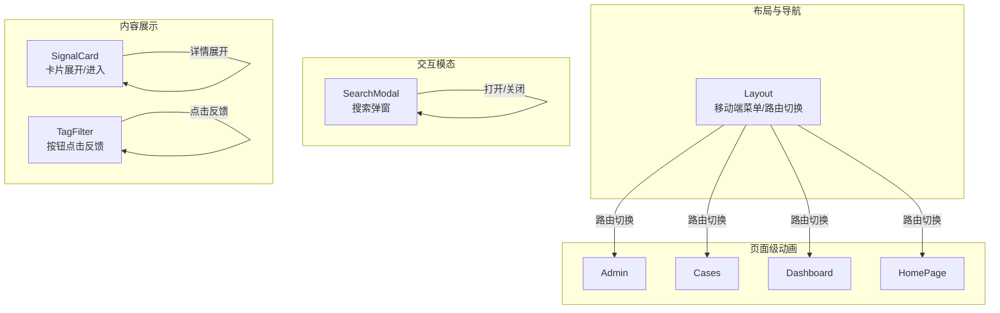
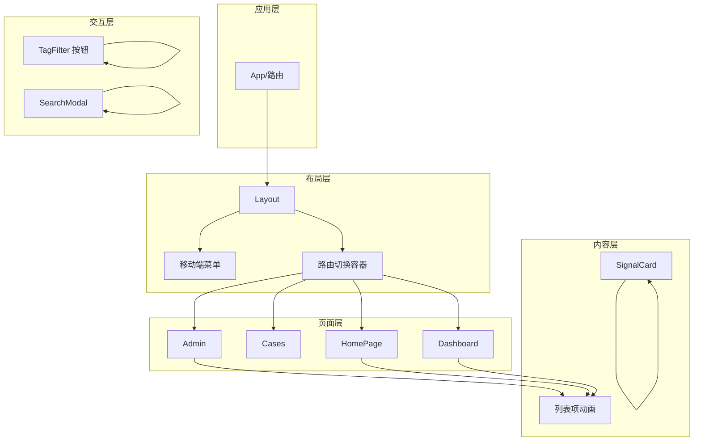
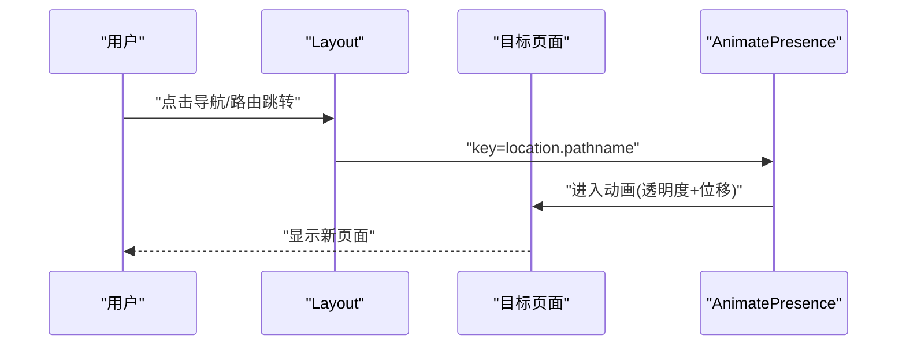
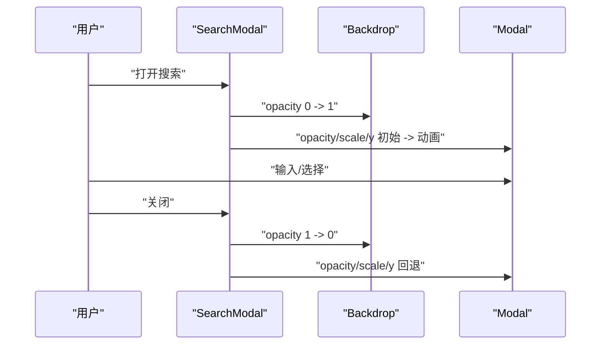
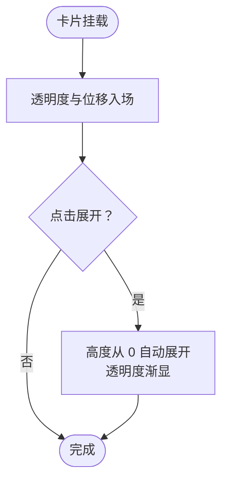
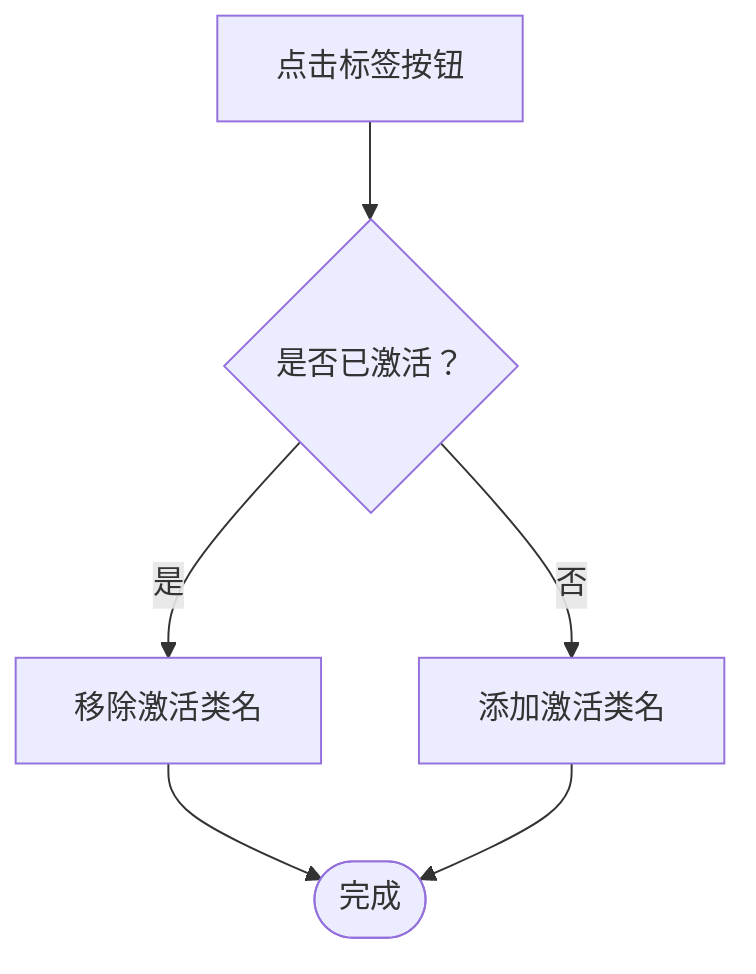
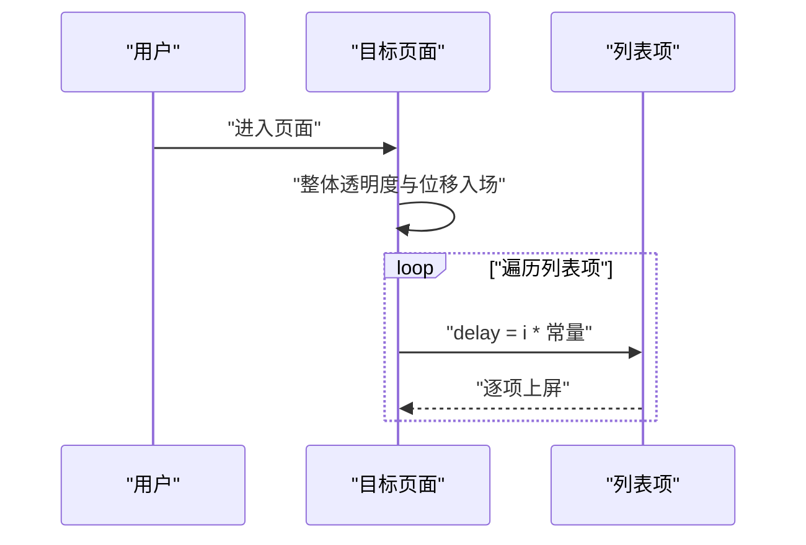
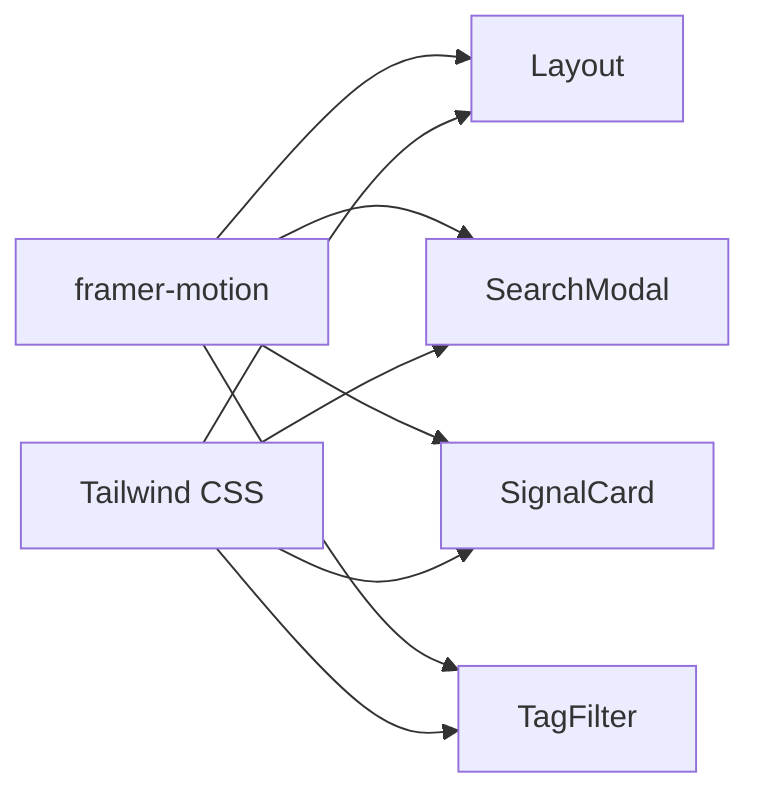

# 动画与交互

<cite>
**本文引用的文件**
- [package.json](file://package.json)
- [tailwind.config.js](file://tailwind.config.js)
- [src/components/Layout/index.tsx](file://src/components/Layout/index.tsx)
- [src/components/SearchModal/index.tsx](file://src/components/SearchModal/index.tsx)
- [src/components/SignalCard/index.tsx](file://src/components/SignalCard/index.tsx)
- [src/components/TagFilter/index.tsx](file://src/components/TagFilter/index.tsx)
- [src/pages/Admin/index.tsx](file://src/pages/Admin/index.tsx)
- [src/pages/Cases/index.tsx](file://src/pages/Cases/index.tsx)
- [src/pages/Companies/index.tsx](file://src/pages/Companies/index.tsx)
- [src/pages/DailyReport/index.tsx](file://src/pages/DailyReport/index.tsx)
- [src/pages/Dashboard/index.tsx](file://src/pages/Dashboard/index.tsx)
- [src/pages/Events/index.tsx](file://src/pages/Events/index.tsx)
- [src/pages/Glossary/index.tsx](file://src/pages/Glossary/index.tsx)
- [src/pages/HomePage/index.tsx](file://src/pages/HomePage/index.tsx)
- [src/pages/Readings/index.tsx](file://src/pages/Readings/index.tsx)
- [src/pages/Research/index.tsx](file://src/pages/Research/index.tsx)
</cite>

## 目录
1. [简介](#简介)
2. [项目结构](#项目结构)
3. [核心组件](#核心组件)
4. [架构总览](#架构总览)
5. [详细组件分析](#详细组件分析)
6. [依赖关系分析](#依赖关系分析)
7. [性能考量](#性能考量)
8. [故障排查指南](#故障排查指南)
9. [结论](#结论)
10. [附录](#附录)

## 简介
本文件面向UI开发者，系统梳理并深化该代码库中基于 Framer Motion 的动画与交互实现，涵盖组件动画设计原则、进入/退出动画、悬停交互效果、加载状态动画、性能优化策略（含硬件加速）、动画链式调用、交互反馈机制、状态变化动画、动画组件封装方法、参数配置与自定义技巧，以及调试与性能监控、跨浏览器兼容性建议。文档以实际源码为依据，配合可视化图示帮助快速定位实现位置与最佳实践。

## 项目结构
该项目采用按页面与功能模块分层的组织方式，动画主要集中在以下区域：
- 布局与路由切换：Layout 组件负责移动端菜单展开/收起、主内容区路由切换动画
- 搜索模态框：SearchModal 提供打开/关闭的进入/退出动画与键盘快捷键触发
- 内容卡片：SignalCard 展示信号卡片的进入动画与详情展开动画
- 标签筛选：TagFilter 使用 tap 缩放等交互反馈
- 各页面：Admin、Cases、Dashboard、HomePage 等页面内大量使用基础入场动画与列表项延迟动画

**章节来源**
- [src/components/Layout/index.tsx:1-175](file://src/components/Layout/index.tsx#L1-L175)
- [src/components/SearchModal/index.tsx:1-156](file://src/components/SearchModal/index.tsx#L1-L156)
- [src/components/SignalCard/index.tsx:1-111](file://src/components/SignalCard/index.tsx#L1-L111)
- [src/components/TagFilter/index.tsx:1-49](file://src/components/TagFilter/index.tsx#L1-L49)
- [src/pages/Admin/index.tsx:1-143](file://src/pages/Admin/index.tsx#L1-L143)
- [src/pages/Cases/index.tsx:1-19](file://src/pages/Cases/index.tsx#L1-L19)
- [src/pages/Dashboard/index.tsx:1-140](file://src/pages/Dashboard/index.tsx#L1-L140)
- [src/pages/HomePage/index.tsx:1-150](file://src/pages/HomePage/index.tsx#L1-L150)

## 核心组件
- 布局与路由切换：通过 AnimatePresence 包裹主内容区域，结合 key 与路由路径，实现页面级进入/退出动画；移动端菜单使用高度与透明度的过渡实现展开/收起。
- 搜索模态框：Backdrop 与 Modal 分别设置进入/退出透明度动画；输入框聚焦在打开时自动执行，提升可用性。
- 信号卡片：卡片初次渲染使用位移与透明度入场；详情区域使用高度从 0 到 auto 的过渡实现“展开”。
- 标签筛选：按钮使用 whileTap 实现点击缩放反馈，配合激活态样式切换。
- 页面级动画：Admin、Cases、Dashboard、HomePage 等页面广泛使用初始透明度与位移的入场动画，部分列表项使用延迟实现“阶梯式”上屏。

**章节来源**
- [src/components/Layout/index.tsx:118-164](file://src/components/Layout/index.tsx#L118-L164)
- [src/components/SearchModal/index.tsx:74-154](file://src/components/SearchModal/index.tsx#L74-L154)
- [src/components/SignalCard/index.tsx:31-99](file://src/components/SignalCard/index.tsx#L31-L99)
- [src/components/TagFilter/index.tsx:31-42](file://src/components/TagFilter/index.tsx#L31-L42)
- [src/pages/Admin/index.tsx:50-137](file://src/pages/Admin/index.tsx#L50-L137)
- [src/pages/Cases/index.tsx:28](file://src/pages/Cases/index.tsx#L28)
- [src/pages/Dashboard/index.tsx:34-123](file://src/pages/Dashboard/index.tsx#L34-L123)
- [src/pages/HomePage/index.tsx:33-132](file://src/pages/HomePage/index.tsx#L33-L132)

## 架构总览
下图展示了动画系统在应用中的分布与协作关系：布局层负责全局路由切换与移动端菜单动画；交互层负责模态框与按钮反馈；内容层负责卡片与列表项动画；页面层负责整体内容的入场与状态切换。

**图表来源**
- [src/components/Layout/index.tsx:118-164](file://src/components/Layout/index.tsx#L118-L164)
- [src/components/SearchModal/index.tsx:74-154](file://src/components/SearchModal/index.tsx#L74-L154)
- [src/components/SignalCard/index.tsx:31-99](file://src/components/SignalCard/index.tsx#L31-L99)
- [src/components/TagFilter/index.tsx:31-42](file://src/components/TagFilter/index.tsx#L31-L42)
- [src/pages/Admin/index.tsx:50-137](file://src/pages/Admin/index.tsx#L50-L137)
- [src/pages/Cases/index.tsx:28](file://src/pages/Cases/index.tsx#L28)
- [src/pages/Dashboard/index.tsx:34-123](file://src/pages/Dashboard/index.tsx#L34-L123)
- [src/pages/HomePage/index.tsx:33-132](file://src/pages/HomePage/index.tsx#L33-L132)

## 详细组件分析

### 布局与路由切换（Layout）
- 设计原则
  - 使用 AnimatePresence 包裹主内容区域，确保路由切换时的进入/退出动画连贯
  - 通过 key 绑定 location.pathname，使不同路由产生独立动画上下文
  - 移动端菜单使用高度与透明度过渡，避免复杂布局抖动
- 进入/退出动画
  - 主内容区：透明度与位移组合，持续时间短，强调即时感
  - 移动端菜单：高度从 0 自动展开，透明度同时出现
- 性能与硬件加速
  - 优先使用 opacity、y、scale 等可由 GPU 加速的属性
  - 避免频繁触发布局计算（如 width/height），减少重排
- 交互反馈
  - 菜单开关按钮使用图标切换，配合状态变更
- 参数配置
  - transition.duration、initial/animate/exit 对象
  - AnimatePresence 的 mode="wait" 保证同一时刻仅有一个动画进行

**图表来源**
- [src/components/Layout/index.tsx:154-164](file://src/components/Layout/index.tsx#L154-L164)

**章节来源**
- [src/components/Layout/index.tsx:118-164](file://src/components/Layout/index.tsx#L118-L164)

### 搜索模态框（SearchModal）
- 设计原则
  - 打开/关闭使用透明度与缩放/位移组合，增强空间感
  - Backdrop 与 Modal 分离，便于控制层级与交互
  - 打开时自动聚焦输入框，提升键盘可达性
- 进入/退出动画
  - Backdrop：透明度从 0 到 1
  - Modal：透明度与缩放从 0.95/0 到 1/1，同时位移上移
- 交互反馈
  - 点击遮罩或关闭按钮均可关闭
  - 结果列表为空时提示文案
- 参数配置
  - initial/animate/exit 对象
  - AnimatePresence 包裹根节点

**图表来源**
- [src/components/SearchModal/index.tsx:74-154](file://src/components/SearchModal/index.tsx#L74-L154)

**章节来源**
- [src/components/SearchModal/index.tsx:1-156](file://src/components/SearchModal/index.tsx#L1-L156)

### 信号卡片（SignalCard）
- 设计原则
  - 卡片初次渲染使用透明度与位移，配合延迟实现“阶梯式”上屏
  - 详情区域使用高度从 0 到 auto 的过渡，避免布局突变
- 进入/退出动画
  - 卡片：opacity 与 y 从 0 到 1
  - 详情：height 与 opacity 从 0 到 auto/1
- 交互反馈
  - 展开/收起按钮使用图标切换，配合文本提示
- 参数配置
  - transition.delay 基于索引的渐进延迟
  - height/opacity 的数值到数值过渡

**图表来源**
- [src/components/SignalCard/index.tsx:31-99](file://src/components/SignalCard/index.tsx#L31-L99)

**章节来源**
- [src/components/SignalCard/index.tsx:1-111](file://src/components/SignalCard/index.tsx#L1-L111)

### 标签筛选（TagFilter）
- 设计原则
  - 按钮点击使用 whileTap 缩放，提供即时反馈
  - 激活态与非激活态使用不同配色与背景
- 交互反馈
  - 点击切换激活状态，支持一键清空
- 参数配置
  - whileTap.scale
  - className 动态切换

**图表来源**
- [src/components/TagFilter/index.tsx:31-42](file://src/components/TagFilter/index.tsx#L31-L42)

**章节来源**
- [src/components/TagFilter/index.tsx:1-49](file://src/components/TagFilter/index.tsx#L1-L49)

### 页面级动画（Admin、Cases、Dashboard、HomePage）
- 设计原则
  - 页面整体使用透明度与位移入场，强调内容稳定出现
  - 列表项使用递增延迟，形成“阶梯式”上屏
- 进入/退出动画
  - Admin：多个区块使用初始透明度到可见的过渡
  - Cases：卡片使用透明度与位移
  - Dashboard：多处使用透明度与位移
  - HomePage：分段内容使用透明度与位移
- 参数配置
  - initial/animate 对象
  - 列表项 transition.delay 基于索引

**图表来源**
- [src/pages/Admin/index.tsx:50-137](file://src/pages/Admin/index.tsx#L50-L137)
- [src/pages/Cases/index.tsx:28](file://src/pages/Cases/index.tsx#L28)
- [src/pages/Dashboard/index.tsx:34-123](file://src/pages/Dashboard/index.tsx#L34-L123)
- [src/pages/HomePage/index.tsx:33-132](file://src/pages/HomePage/index.tsx#L33-L132)

**章节来源**
- [src/pages/Admin/index.tsx:1-143](file://src/pages/Admin/index.tsx#L1-L143)
- [src/pages/Cases/index.tsx:1-19](file://src/pages/Cases/index.tsx#L1-L19)
- [src/pages/Dashboard/index.tsx:1-140](file://src/pages/Dashboard/index.tsx#L1-L140)
- [src/pages/HomePage/index.tsx:1-150](file://src/pages/HomePage/index.tsx#L1-L150)

## 依赖关系分析
- 动画库依赖
  - 项目使用 Framer Motion 作为核心动画库，版本在依赖清单中声明
- 样式与动画扩展
  - Tailwind CSS 提供基础动画类与主题色，补充页面级简单动画
- 组件间耦合
  - Layout 与各页面通过路由解耦，动画通过 key 与 AnimatePresence 解耦
  - SearchModal 与应用状态（store）解耦，通过开关状态驱动动画

**图表来源**
- [package.json:1-200](file://package.json#L1-L200)
- [tailwind.config.js:1-59](file://tailwind.config.js#L1-L59)
- [src/components/Layout/index.tsx:1-10](file://src/components/Layout/index.tsx#L1-L10)
- [src/components/SearchModal/index.tsx:1-5](file://src/components/SearchModal/index.tsx#L1-L5)
- [src/components/SignalCard/index.tsx:1-5](file://src/components/SignalCard/index.tsx#L1-L5)
- [src/components/TagFilter/index.tsx:1-3](file://src/components/TagFilter/index.tsx#L1-L3)

**章节来源**
- [package.json:1-200](file://package.json#L1-L200)
- [tailwind.config.js:1-59](file://tailwind.config.js#L1-L59)

## 性能考量
- 硬件加速与合成层
  - 优先使用 opacity、x/y、scale、rotate 等可由 GPU 加速的属性
  - 避免频繁触发布局计算（width/height/left/top 等）
- 动画链式调用与节流
  - 使用 AnimatePresence 的 mode="wait" 保证同一时刻仅有一个动画进行
  - 列表项延迟使用常量步进，避免过度并发导致掉帧
- 过渡时间与缓动
  - 进入/退出过渡时间保持在 150–300ms 之间，兼顾感知与流畅
  - 使用 ease-out/ease-in-out 等常见缓动，避免过于复杂的贝塞尔曲线
- 资源与内存
  - 模态框与展开区域使用条件渲染与高度过渡，避免不必要的 DOM 结构常驻
  - 大列表项使用虚拟滚动或分页，降低一次性渲染压力

[本节为通用指导，无需特定文件引用]

## 故障排查指南
- 动画不生效
  - 检查是否正确引入 motion 与 AnimatePresence
  - 确认 initial/animate/exit 对象是否存在且值合法
- 路由切换闪烁
  - 确保 key 与 location.pathname 绑定唯一
  - 使用 AnimatePresence 包裹并设置 mode="wait"
- 移动端菜单展开异常
  - 检查高度从 0 到 auto 的过渡是否被其他样式覆盖
  - 确认 overflow-hidden 的容器设置
- 模态框无法关闭
  - 检查 backdrop 点击回调与关闭逻辑
  - 确认 AnimatePresence 的包裹范围
- 列表项延迟错乱
  - 检查索引与延迟常量的一致性
  - 避免动态排序导致索引与延迟不一致

**章节来源**
- [src/components/Layout/index.tsx:118-164](file://src/components/Layout/index.tsx#L118-L164)
- [src/components/SearchModal/index.tsx:74-154](file://src/components/SearchModal/index.tsx#L74-L154)
- [src/components/SignalCard/index.tsx:31-99](file://src/components/SignalCard/index.tsx#L31-L99)
- [src/components/TagFilter/index.tsx:31-42](file://src/components/TagFilter/index.tsx#L31-L42)

## 结论
该代码库在布局、模态框、卡片与页面级内容中系统地运用了 Framer Motion 的进入/退出动画与交互反馈，配合 Tailwind 的基础动画类，形成了统一而高效的动画体系。通过硬件加速属性、延迟链式调用与 AnimatePresence 的合理使用，实现了流畅且可维护的用户体验。建议在后续迭代中进一步完善动画参数的集中配置与性能监控，以提升一致性与可观测性。

[本节为总结，无需特定文件引用]

## 附录
- 动画参数配置清单（示例）
  - 进入：initial={{ opacity: 0, y: 8 }} animate={{ opacity: 1, y: 0 }} transition={{ duration: 0.2 }}
  - 退出：exit={{ opacity: 0, y: -8 }}
  - 列表延迟：transition={{ delay: index * 常量 }}
  - 按钮反馈：whileTap={{ scale: 0.95 }}
  - 高度展开：initial={{ height: 0, opacity: 0 }} animate={{ height: "auto", opacity: 1 }}
- 调试与监控建议
  - 使用浏览器开发工具的“Rendering”面板启用“Paint flashing”与“Layer borders”
  - 在 React DevTools 中观察组件重渲染次数
  - 使用 Performance 面板录制交互过程，检查 FPS 与长帧
- 跨浏览器兼容性
  - 确保目标浏览器支持 Web Animations API 与 CSS Transform/Opacity
  - 对旧版浏览器可考虑降级方案或 polyfill

[本节为通用指导，无需特定文件引用]