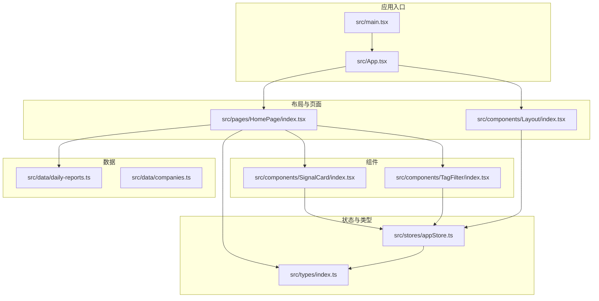
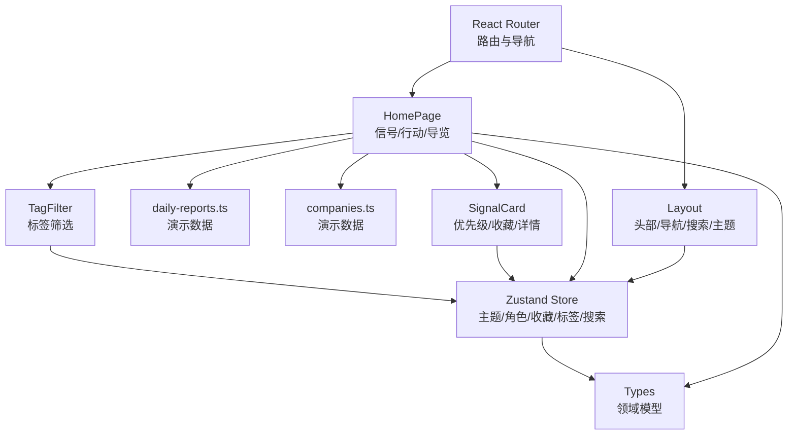
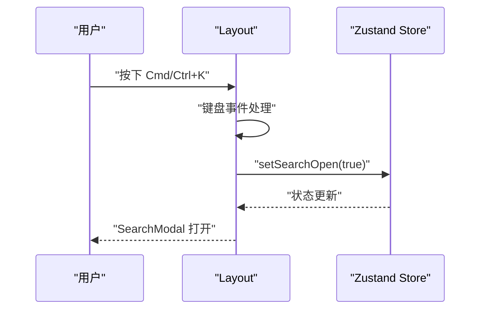
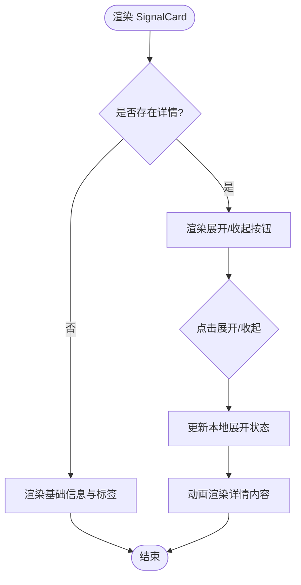
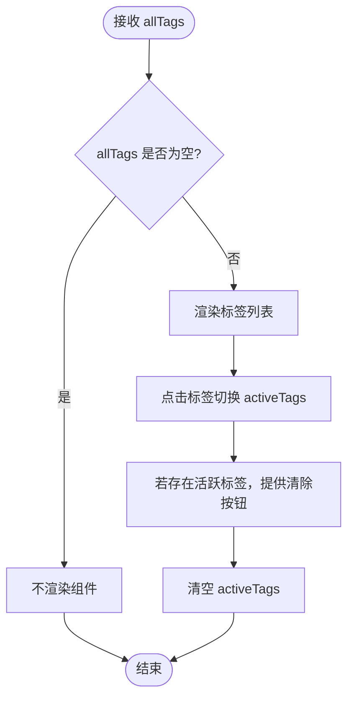
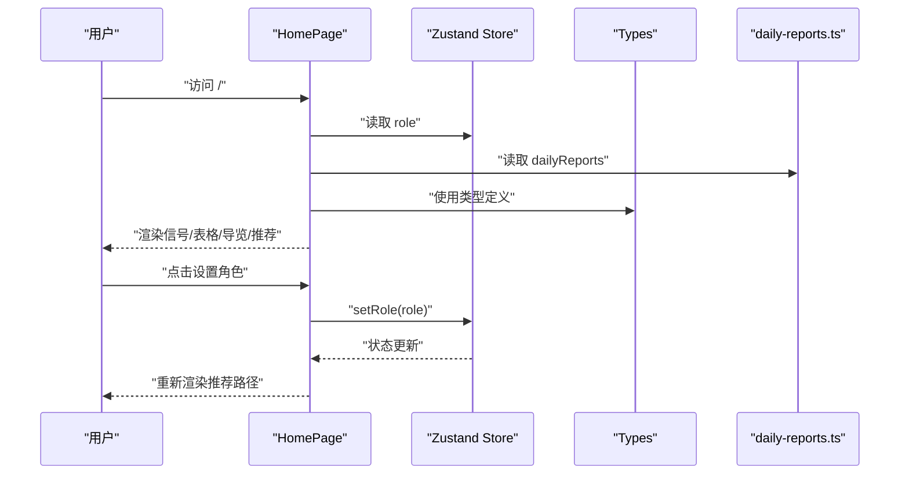
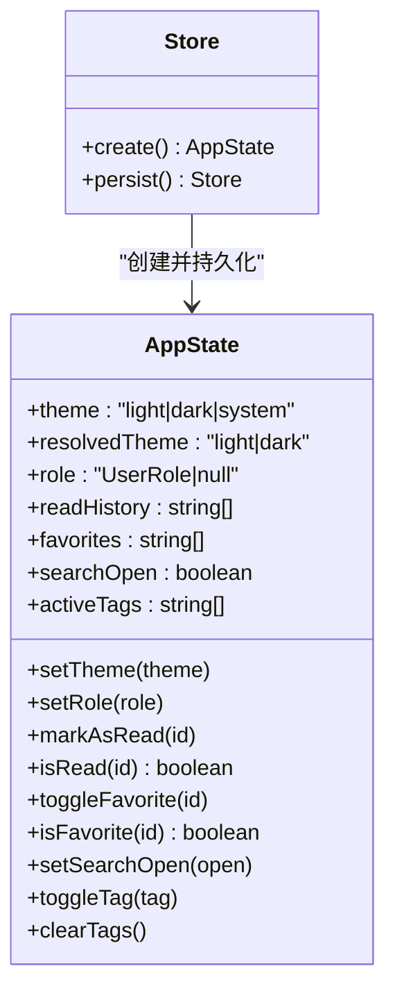
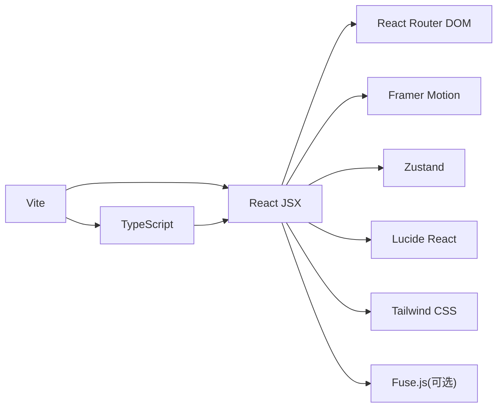

# 代码规范

<cite>
**本文引用的文件**
- [package.json](file://package.json)
- [tsconfig.json](file://tsconfig.json)
- [vite.config.ts](file://vite.config.ts)
- [tailwind.config.js](file://tailwind.config.js)
- [src/main.tsx](file://src/main.tsx)
- [src/App.tsx](file://src/App.tsx)
- [src/components/Layout/index.tsx](file://src/components/Layout/index.tsx)
- [src/components/SignalCard/index.tsx](file://src/components/SignalCard/index.tsx)
- [src/components/TagFilter/index.tsx](file://src/components/TagFilter/index.tsx)
- [src/pages/HomePage/index.tsx](file://src/pages/HomePage/index.tsx)
- [src/stores/appStore.ts](file://src/stores/appStore.ts)
- [src/types/index.ts](file://src/types/index.ts)
- [src/data/daily-reports.ts](file://src/data/daily-reports.ts)
- [src/data/companies.ts](file://src/data/companies.ts)
</cite>

## 目录
1. [引言](#引言)
2. [项目结构](#项目结构)
3. [核心组件](#核心组件)
4. [架构总览](#架构总览)
5. [详细组件分析](#详细组件分析)
6. [依赖分析](#依赖分析)
7. [性能考虑](#性能考虑)
8. [故障排查指南](#故障排查指南)
9. [结论](#结论)
10. [附录](#附录)

## 引言
本规范旨在统一团队在 TypeScript + React 生态中的编码风格与工程实践，覆盖文件命名、目录结构、变量与函数命名、接口设计、组件组织、注释与错误处理、性能优化、代码审查清单以及自动化质量工具配置。规范以仓库现有代码为蓝本，提炼出可复用的最佳实践，并提供可视化图示帮助理解。

## 项目结构
项目采用“按功能域分层”的目录组织方式：
- src/components：可复用 UI 组件（如 Layout、SignalCard、TagFilter）
- src/pages：页面级路由组件（如 HomePage、DailyReport、Dashboard 等）
- src/stores：状态管理（Zustand）
- src/types：全局类型定义
- src/data：静态数据与演示数据
- src/utils：工具函数（当前未发现）
- src/services：服务层（当前未发现）
- 根级配置：package.json、tsconfig.json、vite.config.ts、tailwind.config.js

**图表来源**
- [src/main.tsx](file://src/main.tsx)
- [src/App.tsx](file://src/App.tsx)
- [src/components/Layout/index.tsx](file://src/components/Layout/index.tsx)
- [src/pages/HomePage/index.tsx](file://src/pages/HomePage/index.tsx)
- [src/components/SignalCard/index.tsx](file://src/components/SignalCard/index.tsx)
- [src/components/TagFilter/index.tsx](file://src/components/TagFilter/index.tsx)
- [src/stores/appStore.ts](file://src/stores/appStore.ts)
- [src/types/index.ts](file://src/types/index.ts)
- [src/data/daily-reports.ts](file://src/data/daily-reports.ts)
- [src/data/companies.ts](file://src/data/companies.ts)

**章节来源**
- [package.json](file://package.json)
- [tsconfig.json](file://tsconfig.json)
- [vite.config.ts](file://vite.config.ts)
- [tailwind.config.js](file://tailwind.config.js)

## 核心组件
- 应用入口与路由：应用根节点负责注入样式与 StrictMode，路由集中声明于 App 组件。
- 布局组件：提供响应式导航、主题切换、移动端菜单、搜索触发与内容动画过渡。
- 页面组件：HomePage 展示信号卡片、行动速查、板块导览与角色推荐路径。
- 组件：SignalCard 提供优先级展示、收藏、详情展开；TagFilter 提供标签筛选与清空。
- 状态：appStore 使用 Zustand 管理主题、用户角色、阅读历史、收藏、搜索开关与标签过滤。
- 类型：types/index.ts 定义了信号、行动项、来源覆盖、日报、公司、研究、案例、阅读、词典、看板、议程、板块、用户偏好、搜索结果等完整领域模型。
- 数据：daily-reports.ts 与 companies.ts 提供演示数据，支撑页面渲染与交互。

**章节来源**
- [src/main.tsx](file://src/main.tsx)
- [src/App.tsx](file://src/App.tsx)
- [src/components/Layout/index.tsx](file://src/components/Layout/index.tsx)
- [src/pages/HomePage/index.tsx](file://src/pages/HomePage/index.tsx)
- [src/components/SignalCard/index.tsx](file://src/components/SignalCard/index.tsx)
- [src/components/TagFilter/index.tsx](file://src/components/TagFilter/index.tsx)
- [src/stores/appStore.ts](file://src/stores/appStore.ts)
- [src/types/index.ts](file://src/types/index.ts)
- [src/data/daily-reports.ts](file://src/data/daily-reports.ts)
- [src/data/companies.ts](file://src/data/companies.ts)

## 架构总览
应用采用前端单页应用架构，结合 React Router 进行路由管理，Zustand 管理跨组件状态，Tailwind CSS 提供原子化样式，Vite 提供构建与开发服务器。组件间通过 props 与状态共享传递数据，类型系统贯穿 UI、数据与状态层。

**图表来源**
- [src/App.tsx](file://src/App.tsx)
- [src/components/Layout/index.tsx](file://src/components/Layout/index.tsx)
- [src/pages/HomePage/index.tsx](file://src/pages/HomePage/index.tsx)
- [src/components/SignalCard/index.tsx](file://src/components/SignalCard/index.tsx)
- [src/components/TagFilter/index.tsx](file://src/components/TagFilter/index.tsx)
- [src/stores/appStore.ts](file://src/stores/appStore.ts)
- [src/types/index.ts](file://src/types/index.ts)
- [src/data/daily-reports.ts](file://src/data/daily-reports.ts)
- [src/data/companies.ts](file://src/data/companies.ts)

## 详细组件分析

### 布局组件（Layout）
职责：提供顶部导航栏、移动端菜单、主题切换、搜索触发、内容动画过渡与页脚。
关键点：
- 键盘快捷键监听（Cmd/Ctrl+K）打开搜索。
- 主题初始化与切换，根据系统偏好或手动选择切换 dark 类名。
- 使用 Framer Motion 实现菜单展开与页面内容切换的动画。
- 导航项根据当前路径高亮，支持移动端折叠菜单。

**图表来源**
- [src/components/Layout/index.tsx](file://src/components/Layout/index.tsx)
- [src/stores/appStore.ts](file://src/stores/appStore.ts)

**章节来源**
- [src/components/Layout/index.tsx](file://src/components/Layout/index.tsx)
- [src/stores/appStore.ts](file://src/stores/appStore.ts)

### 信号卡片组件（SignalCard）
职责：展示信号标题、摘要、优先级徽标、来源、标签、收藏按钮与可展开详情。
关键点：
- 优先级映射边框与徽标颜色。
- 收藏状态来自全局 store，点击切换。
- 详情内容按需展开，使用动画过渡。
- 关联公司展示外部链接图标。

**图表来源**
- [src/components/SignalCard/index.tsx](file://src/components/SignalCard/index.tsx)
- [src/stores/appStore.ts](file://src/stores/appStore.ts)

**章节来源**
- [src/components/SignalCard/index.tsx](file://src/components/SignalCard/index.tsx)
- [src/stores/appStore.ts](file://src/stores/appStore.ts)

### 标签筛选组件（TagFilter）
职责：展示可选标签集合，支持点击切换激活状态与一键清空。
关键点：
- 当无可用标签时隐藏组件。
- 活跃标签与非活跃标签样式区分。
- 使用动画反馈点击交互。

**图表来源**
- [src/components/TagFilter/index.tsx](file://src/components/TagFilter/index.tsx)
- [src/stores/appStore.ts](file://src/stores/appStore.ts)

**章节来源**
- [src/components/TagFilter/index.tsx](file://src/components/TagFilter/index.tsx)
- [src/stores/appStore.ts](file://src/stores/appStore.ts)

### 页面组件（HomePage）
职责：首页聚合展示，包含英雄区、今日信号、行动速查、板块导览、推荐路径与多源承诺。
关键点：
- 使用 framer-motion 进行入场动画。
- 通过 store 设置用户角色，驱动不同推荐路径。
- 信号卡片列表按索引延迟渲染，增强感知流畅度。
- 使用 Tailwind 自定义动画与 keyframes。

**图表来源**
- [src/pages/HomePage/index.tsx](file://src/pages/HomePage/index.tsx)
- [src/stores/appStore.ts](file://src/stores/appStore.ts)
- [src/types/index.ts](file://src/types/index.ts)
- [src/data/daily-reports.ts](file://src/data/daily-reports.ts)

**章节来源**
- [src/pages/HomePage/index.tsx](file://src/pages/HomePage/index.tsx)
- [src/stores/appStore.ts](file://src/stores/appStore.ts)
- [src/types/index.ts](file://src/types/index.ts)
- [src/data/daily-reports.ts](file://src/data/daily-reports.ts)

### 状态管理（appStore）
职责：集中管理主题、用户角色、阅读历史、收藏、搜索开关与标签过滤。
关键点：
- 使用 persist 中间件持久化部分状态。
- 主题解析与 DOM 类名同步。
- 纯函数式更新，避免副作用扩散。

**图表来源**
- [src/stores/appStore.ts](file://src/stores/appStore.ts)

**章节来源**
- [src/stores/appStore.ts](file://src/stores/appStore.ts)

### 类型系统（types/index.ts）
职责：定义领域模型，保证 UI、数据与状态之间的类型一致性。
关键点：
- 源类型枚举与来源信息接口。
- 信号、行动项、来源覆盖、日报、公司、研究、案例、阅读、词典、看板、议程、板块、用户偏好、搜索结果等完整模型。
- 使用联合类型表达离散取值，提高类型安全。

```mermaid
erDiagram
SIGNAL {
string id
string emoji
string title
string summary
string detail
enum priority
string[] tags
string[] relatedCompanies
enum sourceType
string sourceName
}
ACTION_ITEM {
string id
enum priority
string action
string timeWindow
string basis
}
SOURCE_COVERAGE {
number total
enum[] types
number baseline
boolean passed
}
DAILY_REPORT {
string id
string date
enum session
string title
SIGNAL[] signals
ACTION_ITEM[] actionPlan
SOURCE_COVERAGE sourceCoverage
string content
string fetchWindow
}
COMPANY_UPDATE {
string id
string date
string company
string person
string title
string summary
string content
string[] tags
}
RESEARCH_PAPER {
string id
string date
string title
string[] authors
string institution
enum sourceType
string summary
string[] keyFindings
string hrImplications
string[] tags
string url
}
TRANSFORM_CASE {
string id
string date
string company
string title
enum outcome
string summary
string[] whatWorked
string[] whatFailed
string[] hrLessons
string[] tags
}
READING {
string id
string date
string title
string originalTitle
string source
enum sourceType
string summary
json keyExcerpts
string editorNote
string[] tags
string url
}
GLOSSARY_TERM {
string id
string term
string chinese
string definition
string example
string[] relatedTerms
string firstSeen
}
KPIS_DATA {
string id
string label
number value
string unit
number change
string changeLabel
string color
string date
}
DETAIL_TABLE_ROW {
string indicator
string value
string yoyChange
string source
string impact
}
DETAIL_TABLE {
string id
string title
string emoji
string[] columns
DETAIL_TABLE_ROW[] rows
string hrInsight
}
DASHBOARD_SNAPSHOT {
string date
KPIS_DATA[] kpis
json trends
DETAIL_TABLE[] detailTables
}
EVENT_ITEM {
string id
string name
string organizer
string date
string endDate
string location
string type
string url
enum relevance
}
SECTION {
string id
string emoji
string title
string description
string path
number count
}
USER_PREFERENCES {
enum role
string[] readHistory
string[] favorites
enum theme
}
SEARCH_RESULT {
string id
string title
string section
string excerpt
string path
number score
}
```

**图表来源**
- [src/types/index.ts](file://src/types/index.ts)

**章节来源**
- [src/types/index.ts](file://src/types/index.ts)

## 依赖分析
- 构建与运行时：Vite 提供开发服务器与打包，TypeScript 编译器参与构建阶段。
- 样式：Tailwind CSS 提供原子化样式与暗色模式支持。
- 路由：React Router DOM 管理页面路由与导航。
- 动画：Framer Motion 提供高性能动画。
- 状态：Zustand 管理全局状态，支持持久化。
- 图标：Lucide React 提供图标组件。
- 搜索：Fuse.js 用于前端全文检索（当前未在仓库中直接使用，但可作为后续扩展）。

**图表来源**
- [package.json](file://package.json)
- [vite.config.ts](file://vite.config.ts)
- [tailwind.config.js](file://tailwind.config.js)

**章节来源**
- [package.json](file://package.json)
- [vite.config.ts](file://vite.config.ts)
- [tailwind.config.js](file://tailwind.config.js)

## 性能考虑
- 渲染优化
  - 列表项使用索引延迟渲染，减少首屏阻塞。
  - 使用动画过渡时控制动画时长与缓动，避免过度消耗。
- 状态管理
  - 将仅需持久化的字段放入持久化切片，减少存储体积。
  - 避免在 store 中存放大型不可变对象，必要时拆分为多个 store 或使用选择器。
- 资源加载
  - Tailwind 基于 content 模式按需生成样式，避免引入未使用的样式。
  - 图标组件按需引入，避免整包引入。
- 路由与懒加载
  - 页面组件按需加载，减少初始包体。
- 开发与构建
  - 构建开启 sourcemap 便于调试，生产环境可按需关闭。
  - TypeScript 严格模式启用，减少潜在运行时错误。

[本节为通用指导，无需特定文件引用]

## 故障排查指南
- 主题切换无效
  - 检查主题解析逻辑与 DOM 类名同步。
  - 确认系统主题偏好与手动主题的优先级关系。
- 搜索快捷键不生效
  - 确认键盘事件绑定与解除时机正确。
  - 检查搜索开关状态是否被其他逻辑覆盖。
- 动画卡顿
  - 控制动画数量与时长，避免在同一帧内大量触发。
  - 使用 transform 与 opacity 等 GPU 加速属性。
- 样式冲突
  - 使用 Tailwind 原子类组合，避免自定义 CSS 覆盖。
  - 检查暗色模式类名是否正确添加/移除。
- 类型错误
  - 严格遵循 types/index.ts 中的接口定义，避免类型断言滥用。
  - 使用 TypeScript 编译器检查，启用严格模式。

**章节来源**
- [src/components/Layout/index.tsx](file://src/components/Layout/index.tsx)
- [src/stores/appStore.ts](file://src/stores/appStore.ts)
- [tailwind.config.js](file://tailwind.config.js)
- [src/types/index.ts](file://src/types/index.ts)

## 结论
本规范以现有代码为基础，总结了目录结构、组件组织、类型设计、状态管理与样式体系等方面的最佳实践。建议在后续迭代中逐步引入 ESLint、Prettier、TypeScript 编译检查与提交前校验，形成完善的自动化质量保障体系。

## 附录

### TypeScript 编码规范
- 命名
  - 类型与接口使用帕斯卡命名（如 Signal、ActionItem）。
  - 枚举使用帕斯卡命名（如 Priority、SourceType）。
  - 常量使用大写下划线（如 FETCH_WINDOW）。
- 接口设计
  - 优先使用只读属性与联合类型表达离散取值。
  - 可选字段明确标注，避免可选与必填混用。
- 函数定义
  - 优先使用箭头函数与解构参数，保持纯函数特性。
  - 返回值明确标注，避免 any。
- 注释
  - 对外暴露的接口与组件添加简要说明。
  - 复杂逻辑处添加注释说明业务背景与边界条件。

**章节来源**
- [src/types/index.ts](file://src/types/index.ts)
- [src/components/SignalCard/index.tsx](file://src/components/SignalCard/index.tsx)
- [src/components/TagFilter/index.tsx](file://src/components/TagFilter/index.tsx)

### React 组件开发规范
- 组件组织
  - 单一职责，尽量无状态或最小状态。
  - 使用受控组件与状态提升，避免深层嵌套。
- Props 与状态
  - Props 以只读方式消费，状态变更通过回调或 store。
  - 使用 TypeScript 接口约束 props。
- 动画与交互
  - 使用 Framer Motion 管理过渡，避免在 render 中执行昂贵计算。
- 样式
  - 使用 Tailwind 原子类，避免内联样式。
  - 暗色模式通过类名切换，避免硬编码颜色。

**章节来源**
- [src/components/Layout/index.tsx](file://src/components/Layout/index.tsx)
- [src/pages/HomePage/index.tsx](file://src/pages/HomePage/index.tsx)
- [src/components/SignalCard/index.tsx](file://src/components/SignalCard/index.tsx)
- [src/components/TagFilter/index.tsx](file://src/components/TagFilter/index.tsx)
- [tailwind.config.js](file://tailwind.config.js)

### 文件命名约定与目录结构规范
- 目录
  - components：UI 组件，按功能域分目录，每个组件独立目录并包含 index.tsx。
  - pages：页面级路由组件，按页面名称命名。
  - stores：状态管理模块，单一职责。
  - types：全局类型定义，集中维护。
  - data：静态数据与演示数据，按领域命名。
  - utils：工具函数（当前未发现）。
  - services：服务层（当前未发现）。
- 文件
  - 组件文件：index.tsx。
  - 类型文件：index.ts。
  - 配置文件：按框架约定（如 tsconfig.json、vite.config.ts、tailwind.config.js）。

**章节来源**
- [src/components/Layout/index.tsx](file://src/components/Layout/index.tsx)
- [src/pages/HomePage/index.tsx](file://src/pages/HomePage/index.tsx)
- [src/stores/appStore.ts](file://src/stores/appStore.ts)
- [src/types/index.ts](file://src/types/index.ts)
- [src/data/daily-reports.ts](file://src/data/daily-reports.ts)
- [src/data/companies.ts](file://src/data/companies.ts)

### 注释规范
- 文件顶部：简述模块用途与关键职责。
- 接口与类型：对关键字段进行简要说明。
- 复杂函数：说明输入、输出、边界条件与异常情况。
- 组件：说明 props、状态与生命周期注意事项。

**章节来源**
- [src/types/index.ts](file://src/types/index.ts)
- [src/components/SignalCard/index.tsx](file://src/components/SignalCard/index.tsx)
- [src/components/TagFilter/index.tsx](file://src/components/TagFilter/index.tsx)

### 错误处理模式
- 状态层：store 中的状态更新失败时，保持幂等与可恢复。
- UI 层：对不可用数据进行降级渲染（如占位符、空状态）。
- 路由层：对未知路由进行兜底跳转或 404 页面。

**章节来源**
- [src/stores/appStore.ts](file://src/stores/appStore.ts)
- [src/App.tsx](file://src/App.tsx)

### 性能优化准则
- 渲染：使用 memo 与浅比较，避免不必要的重渲染。
- 动画：控制帧率与过渡时长，优先使用 transform 与 opacity。
- 状态：拆分 store，避免大对象频繁更新。
- 样式：按需生成，避免全局污染。

**章节来源**
- [src/pages/HomePage/index.tsx](file://src/pages/HomePage/index.tsx)
- [src/components/SignalCard/index.tsx](file://src/components/SignalCard/index.tsx)
- [src/components/TagFilter/index.tsx](file://src/components/TagFilter/index.tsx)
- [tailwind.config.js](file://tailwind.config.js)

### 代码审查检查清单
- 类型安全：接口定义完整，无 any，返回值明确。
- 组件职责：单一职责，状态最小化。
- 样式一致性：使用 Tailwind 原子类，暗色模式兼容。
- 动画合理性：过渡自然，无卡顿。
- 可维护性：注释清晰，命名规范，目录结构合理。
- 性能：避免重复渲染与昂贵计算。

**章节来源**
- [src/types/index.ts](file://src/types/index.ts)
- [src/components/Layout/index.tsx](file://src/components/Layout/index.tsx)
- [src/pages/HomePage/index.tsx](file://src/pages/HomePage/index.tsx)
- [src/stores/appStore.ts](file://src/stores/appStore.ts)

### 自动化代码质量工具配置
- ESLint：启用 React Hooks 规则、import 顺序与 no-any。
- Prettier：统一缩进、引号与尾逗号。
- TypeScript 编译：严格模式、noUnusedLocals/noUnusedParameters 关闭以兼容现状，后续可逐步收紧。
- 提交前检查：husky + lint-staged，确保提交代码符合规范。

**章节来源**
- [tsconfig.json](file://tsconfig.json)
- [package.json](file://package.json)