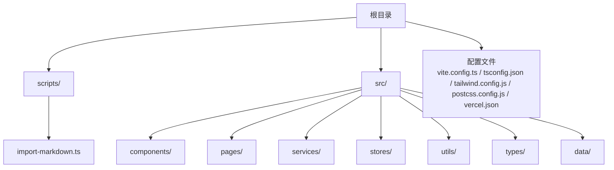
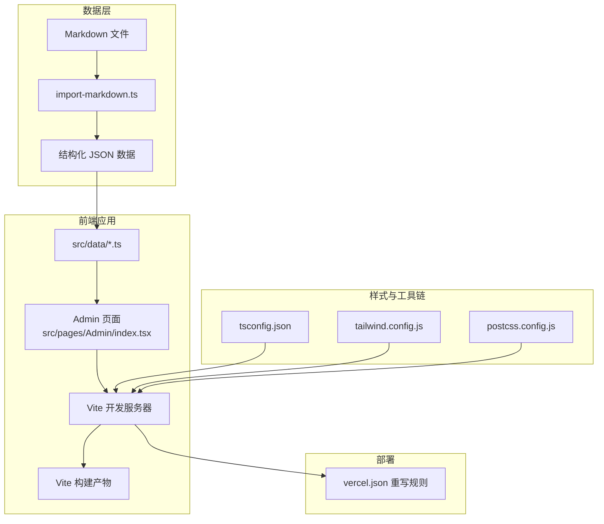
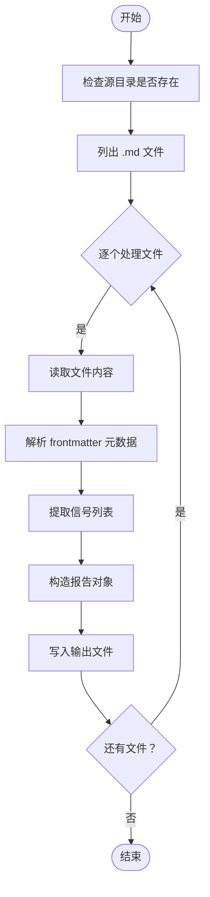
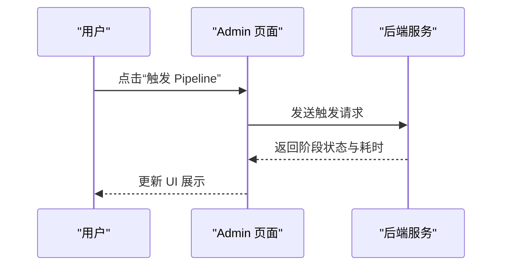
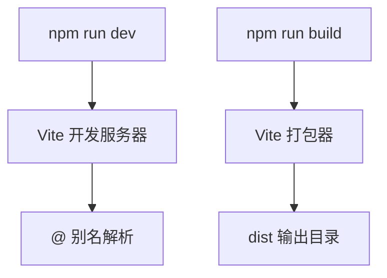
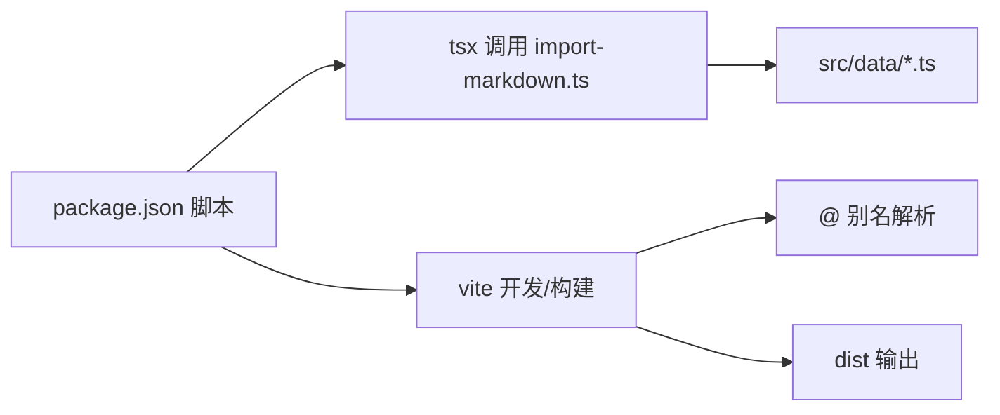

# 工作流程

<cite>
**本文引用的文件**
- [package.json](file://package.json)
- [scripts/import-markdown.ts](file://scripts/import-markdown.ts)
- [.gitignore](file://.gitignore)
- [vite.config.ts](file://vite.config.ts)
- [tsconfig.json](file://tsconfig.json)
- [tailwind.config.js](file://tailwind.config.js)
- [postcss.config.js](file://postcss.config.js)
- [src/pages/Admin/index.tsx](file://src/pages/Admin/index.tsx)
- [vercel.json](file://vercel.json)
</cite>

## 目录
1. [引言](#引言)
2. [项目结构](#项目结构)
3. [核心组件](#核心组件)
4. [架构总览](#架构总览)
5. [详细组件分析](#详细组件分析)
6. [依赖分析](#依赖分析)
7. [性能考虑](#性能考虑)
8. [故障排查指南](#故障排查指南)
9. [结论](#结论)
10. [附录](#附录)

## 引言
本文件面向团队协作与工程化落地，围绕标准化开发工作流程进行系统化梳理，覆盖以下主题：
- Git 分支管理策略：采用 Feature Branch 工作流，明确分支命名、提交信息规范、Pull Request（PR）模板与合并策略
- 代码审查流程：定义评审范围、通过标准与回退机制
- 版本发布管理：语义化版本控制、变更日志维护与发布节奏
- 数据导入脚本使用：Markdown 到 JSON 的批量转换与质量审计
- 批量任务执行：本地脚本与构建命令的统一入口
- 自动化流程配置：Vite 构建、TailwindCSS 样式管线与静态资源路由
- 团队协作最佳实践：冲突解决策略、文档更新流程与知识沉淀

## 项目结构
该前端项目基于 Vite + React + TypeScript 技术栈，采用模块化组织方式，核心目录与职责如下：
- scripts：存放数据导入与运维脚本
- src：源码目录，按功能域分层（components、pages、services、stores、utils、types）
- 配置文件：vite.config.ts、tsconfig.json、tailwind.config.js、postcss.config.js、vercel.json

图表来源
- [vite.config.ts:1-21](file://vite.config.ts#L1-L21)
- [tsconfig.json:1-25](file://tsconfig.json#L1-L25)
- [tailwind.config.js:1-60](file://tailwind.config.js#L1-L60)
- [postcss.config.js:1-7](file://postcss.config.js#L1-L7)
- [vercel.json:1-6](file://vercel.json#L1-L6)

章节来源
- [vite.config.ts:1-21](file://vite.config.ts#L1-L21)
- [tsconfig.json:1-25](file://tsconfig.json#L1-L25)
- [tailwind.config.js:1-60](file://tailwind.config.js#L1-L60)
- [postcss.config.js:1-7](file://postcss.config.js#L1-L7)
- [vercel.json:1-6](file://vercel.json#L1-L6)

## 核心组件
- 构建与开发服务器：Vite 提供快速热更新与打包能力，配置别名与端口、输出目录与 SourceMap
- 类型系统：TypeScript 严格模式与路径映射，确保类型安全与模块解析一致性
- 样式体系：TailwindCSS 与 PostCSS 组合，支持暗色模式与动画扩展
- 静态资源路由：Vercel 重写规则，保障 SPA 单页应用路由一致
- 数据导入脚本：Markdown 前言元数据解析、信号提取、会话与日期识别，批量生成结构化数据文件

章节来源
- [vite.config.ts:1-21](file://vite.config.ts#L1-L21)
- [tsconfig.json:1-25](file://tsconfig.json#L1-L25)
- [tailwind.config.js:1-60](file://tailwind.config.js#L1-L60)
- [postcss.config.js:1-7](file://postcss.config.js#L1-L7)
- [vercel.json:1-6](file://vercel.json#L1-L6)
- [scripts/import-markdown.ts:1-159](file://scripts/import-markdown.ts#L1-L159)

## 架构总览
下图展示从“数据导入”到“前端页面”的端到端流程，以及与构建与部署的关系。

图表来源
- [scripts/import-markdown.ts:1-159](file://scripts/import-markdown.ts#L1-L159)
- [src/pages/Admin/index.tsx:1-87](file://src/pages/Admin/index.tsx#L1-L87)
- [vite.config.ts:1-21](file://vite.config.ts#L1-L21)
- [tsconfig.json:1-25](file://tsconfig.json#L1-L25)
- [tailwind.config.js:1-60](file://tailwind.config.js#L1-L60)
- [postcss.config.js:1-7](file://postcss.config.js#L1-L7)
- [vercel.json:1-6](file://vercel.json#L1-L6)

## 详细组件分析

### 数据导入脚本（Markdown → JSON）
- 功能概述：解析 Markdown 前言元数据，抽取信号列表，识别日期与会话，生成结构化数据文件
- 关键流程：
  - 读取目录与文件，过滤 .md
  - 解析 frontmatter 元数据与正文
  - 从正文提取信号条目，标注优先级
  - 生成唯一 ID，填充默认字段
  - 写入导出文件（TypeScript 模块）

图表来源
- [scripts/import-markdown.ts:79-130](file://scripts/import-markdown.ts#L79-L130)

章节来源
- [scripts/import-markdown.ts:1-159](file://scripts/import-markdown.ts#L1-L159)

### 管理后台（Admin Page）与 Pipeline 状态
- 页面职责：提供内容管理、质量审计与 Pipeline 控制入口
- 状态展示：以阶段化流水线形式展示各环节耗时与状态
- 交互提示：触发按钮用于手动触发 Pipeline

图表来源
- [src/pages/Admin/index.tsx:1-87](file://src/pages/Admin/index.tsx#L1-L87)

章节来源
- [src/pages/Admin/index.tsx:1-87](file://src/pages/Admin/index.tsx#L1-L87)

### 构建与开发服务器（Vite）
- 别名与路径：@ 指向 src，便于统一模块引用
- 服务器：端口与自动打开浏览器
- 构建：输出目录与 SourceMap 开关

图表来源
- [vite.config.ts:1-21](file://vite.config.ts#L1-L21)

章节来源
- [vite.config.ts:1-21](file://vite.config.ts#L1-L21)

### 类型系统与路径映射（TypeScript）
- 严格模式与模块检测
- 路径映射 @/* → src/*
- 与 Vite 配置保持一致，避免运行时解析差异

章节来源
- [tsconfig.json:1-25](file://tsconfig.json#L1-L25)
- [vite.config.ts:7-11](file://vite.config.ts#L7-L11)

### 样式体系（TailwindCSS + PostCSS）
- 内容扫描范围：HTML 与 src 下各类语言文件
- 暗色模式：class 驱动
- 主题扩展：字体、颜色、动画
- 插件链：Tailwind → Autoprefixer

章节来源
- [tailwind.config.js:1-60](file://tailwind.config.js#L1-L60)
- [postcss.config.js:1-7](file://postcss.config.js#L1-L7)

### 静态资源路由（Vercel）
- 重写规则：将所有路径指向 index.html，适配 SPA 路由

章节来源
- [vercel.json:1-6](file://vercel.json#L1-L6)

## 依赖分析
- 运行时依赖：React 生态、图表与状态管理等
- 开发依赖：Vite、React 插件、TypeScript、TailwindCSS、PostCSS、tsx
- 脚本命令：dev、build、preview、import-data（调用 tsx 执行导入脚本）

图表来源
- [package.json:6-11](file://package.json#L6-L11)
- [scripts/import-markdown.ts:10](file://scripts/import-markdown.ts#L10)
- [vite.config.ts:6-20](file://vite.config.ts#L6-L20)

章节来源
- [package.json:1-36](file://package.json#L1-L36)
- [scripts/import-markdown.ts:10](file://scripts/import-markdown.ts#L10)
- [vite.config.ts:6-20](file://vite.config.ts#L6-L20)

## 性能考虑
- 构建优化：启用 SourceMap 便于调试；生产环境可按需关闭
- 样式体积：Tailwind 按内容扫描，建议在 CI 中开启 Purge 以减少体积
- 资源路由：SPA 重写规则避免 404，提升首屏体验
- 数据导入：批量处理时注意内存占用与错误聚合，避免单文件异常阻塞整体流程

## 故障排查指南
- 构建失败
  - 检查 TypeScript 路径映射是否与 Vite 别名一致
  - 确认模块解析策略与 bundler 设置
- 开发服务器无法访问
  - 核对端口占用与防火墙设置
- 样式不生效
  - 确认 Tailwind 内容扫描路径包含目标文件
  - 检查 PostCSS 插件顺序与版本兼容性
- 数据导入异常
  - 检查源目录存在性与文件权限
  - 查看错误汇总，定位具体文件与解析问题
- 部署路由问题
  - 确认 vercel.json 重写规则已生效

章节来源
- [tsconfig.json:18-22](file://tsconfig.json#L18-L22)
- [vite.config.ts:12-19](file://vite.config.ts#L12-L19)
- [tailwind.config.js:3](file://tailwind.config.js#L3)
- [postcss.config.js:1-7](file://postcss.config.js#L1-L7)
- [scripts/import-markdown.ts:83-86](file://scripts/import-markdown.ts#L83-L86)
- [vercel.json:2-4](file://vercel.json#L2-L4)

## 结论
本项目已具备清晰的前端工程化基础：统一的构建与别名配置、严格的类型约束、完善的样式体系与 SPA 路由支持。结合数据导入脚本与管理后台，形成从“数据准备—结构化—前端渲染—部署上线”的闭环。建议在此基础上进一步完善 Git 工作流与自动化流程，以实现更高效的团队协作与持续交付。

## 附录

### Git 分支管理策略（Feature Branch 工作流）
- 分支命名规范
  - feature/功能点描述
  - hotfix/修复问题编号
  - chore/日常维护任务
- 提交信息规范
  - 类型(scope): 摘要
  - 详细说明（可选）
  - 关联 Issue（可选）
  - 示例：feat(admin): 新增 Pipeline 触发按钮
- Pull Request 模板
  - 标题：遵循提交信息规范
  - 摘要：背景、改动点、影响面
  - 截图/链接：界面或数据导入效果
  - 测试要点：本地验证清单
  - 关联问题：Issue 编号
- 合并策略
  - 快进合并（fast-forward）或 Squash 合并（保留一条整洁历史）
  - 保护分支：master/main 禁止直接推送，必须经 PR 审查
  - 代码审查：至少一名 reviewer 通过，无修改请求方可合并

### 代码审查流程
- 范围与标准
  - 功能正确性、边界条件、性能影响
  - 类型安全、命名一致性、注释完整性
  - 样式与可访问性、跨浏览器兼容性
- 通过标准
  - 无阻塞性问题；中低风险问题需在 PR 中解决
- 回退机制
  - 审查未通过的 PR 需重新审查；紧急 hotfix 可走快速通道但需事后补审

### 版本发布管理
- 语义化版本
  - 主版本：破坏性变更
  - 次版本：新增功能且向后兼容
  - 修订版本：修复与小改进
- 变更日志
  - 记录每个版本的新增、修复与破坏性变更
  - 对应提交信息摘要与关联 PR/Issue
- 发布节奏
  - 每周固定窗口发布次版本；紧急修复即时 hotfix

### 数据导入脚本使用指南
- 使用方式
  - npm run import-data [源目录] [输出目录]
  - 默认源目录：../org-future-insights
  - 默认输出目录：./src/data
- 注意事项
  - 确保源目录存在且包含 daily-reports 子目录
  - 导入结果为 TypeScript 模块，需符合类型定义
  - 导入后建议进行质量审计与字段补全

章节来源
- [scripts/import-markdown.ts:5-7](file://scripts/import-markdown.ts#L5-L7)
- [scripts/import-markdown.ts:132-135](file://scripts/import-markdown.ts#L132-L135)

### 批量任务执行
- 本地脚本
  - npx tsx scripts/import-markdown.ts
- 构建与预览
  - npm run dev、npm run build、npm run preview

章节来源
- [package.json:6-11](file://package.json#L6-L11)

### 自动化流程配置
- 构建与别名
  - Vite 配置别名与端口、输出目录
- 类型系统
  - TypeScript 严格模式与路径映射
- 样式管线
  - Tailwind 内容扫描与插件链
- 部署路由
  - Vercel 重写规则适配 SPA

章节来源
- [vite.config.ts:1-21](file://vite.config.ts#L1-L21)
- [tsconfig.json:1-25](file://tsconfig.json#L1-L25)
- [tailwind.config.js:1-60](file://tailwind.config.js#L1-L60)
- [postcss.config.js:1-7](file://postcss.config.js#L1-L7)
- [vercel.json:1-6](file://vercel.json#L1-L6)

### 团队协作最佳实践
- 冲突解决策略
  - 频繁同步主干分支；小步快跑降低冲突概率
  - 冲突优先通过 rebase 解决，保持线性历史
- 文档更新流程
  - 变更随 PR 一并更新 README 或设计文档
  - 重要决策记录在 Confluence 或 Wiki
- 知识沉淀
  - 建立“常见问题与解决方案”知识库
  - 定期回顾工作流并迭代优化