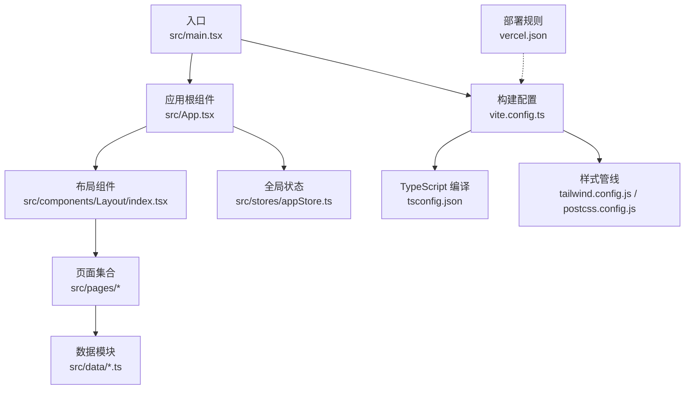
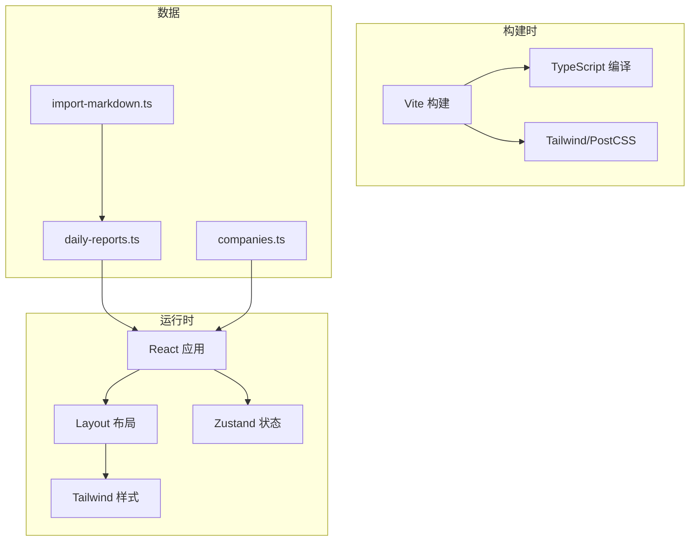
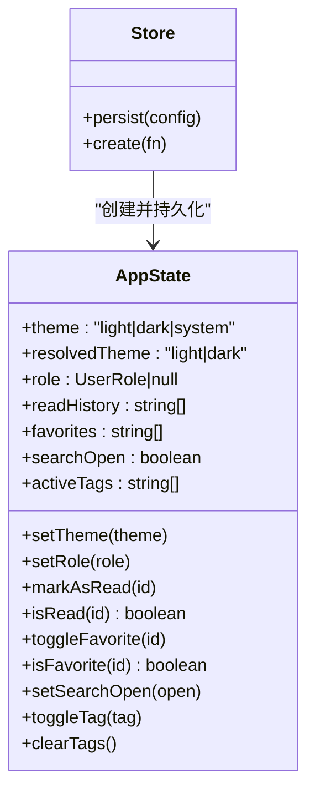
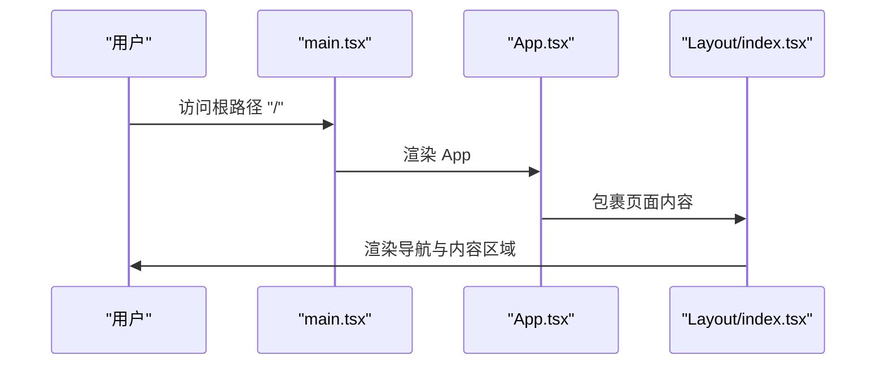
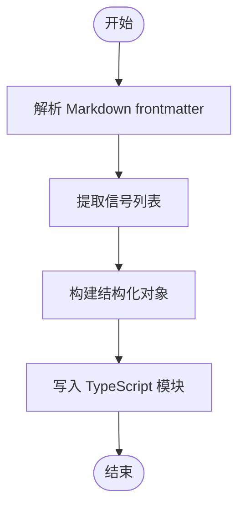
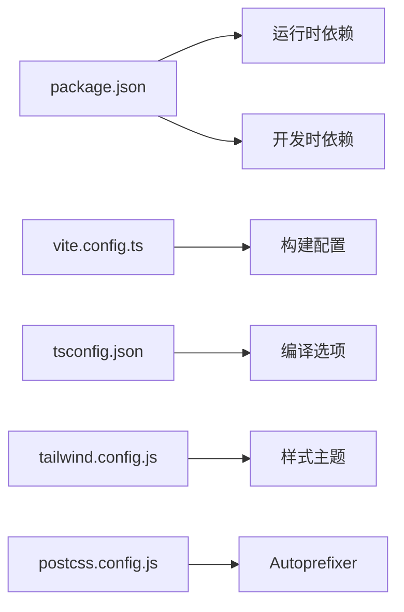

# 开发指南

<cite>
**本文引用的文件**
- [package.json](file://package.json)
- [tsconfig.json](file://tsconfig.json)
- [vite.config.ts](file://vite.config.ts)
- [tailwind.config.js](file://tailwind.config.js)
- [postcss.config.js](file://postcss.config.js)
- [vercel.json](file://vercel.json)
- [src/main.tsx](file://src/main.tsx)
- [src/App.tsx](file://src/App.tsx)
- [src/stores/appStore.ts](file://src/stores/appStore.ts)
- [src/components/Layout/index.tsx](file://src/components/Layout/index.tsx)
- [src/types/index.ts](file://src/types/index.ts)
- [src/data/daily-reports.ts](file://src/data/daily-reports.ts)
- [src/data/companies.ts](file://src/data/companies.ts)
- [scripts/import-markdown.ts](file://scripts/import-markdown.ts)
</cite>

## 目录
1. [引言](#引言)
2. [项目结构](#项目结构)
3. [核心组件](#核心组件)
4. [架构总览](#架构总览)
5. [详细组件分析](#详细组件分析)
6. [依赖分析](#依赖分析)
7. [性能考虑](#性能考虑)
8. [故障排查指南](#故障排查指南)
9. [结论](#结论)
10. [附录](#附录)

## 引言
本开发指南面向“组织·HR洞察日报”项目，旨在提供一套可落地的开发规范与最佳实践，涵盖 TypeScript 配置、代码风格、Git 工作流、分支管理、开发环境与调试、性能分析、构建优化与懒加载、测试与代码审查、依赖管理与安全更新、版本发布与运维等内容。文档以仓库现有配置与代码为依据，结合前端工程化与 React 生态的最佳实践，帮助团队统一标准、提升协作效率与交付质量。

## 项目结构
项目采用 Vite + React + TypeScript 技术栈，使用 TailwindCSS 进行样式管理，路由基于 React Router，状态管理采用 Zustand 并持久化存储。数据通过本地静态文件与脚本导入工具进行初始化。

图表来源
- [src/main.tsx:1-11](file://src/main.tsx#L1-L11)
- [src/App.tsx:1-36](file://src/App.tsx#L1-L36)
- [src/components/Layout/index.tsx:1-175](file://src/components/Layout/index.tsx#L1-L175)
- [src/stores/appStore.ts:1-93](file://src/stores/appStore.ts#L1-L93)
- [vite.config.ts:1-21](file://vite.config.ts#L1-L21)
- [tsconfig.json:1-25](file://tsconfig.json#L1-L25)
- [tailwind.config.js:1-60](file://tailwind.config.js#L1-L60)
- [postcss.config.js:1-7](file://postcss.config.js#L1-L7)
- [vercel.json:1-6](file://vercel.json#L1-L6)

章节来源
- [src/main.tsx:1-11](file://src/main.tsx#L1-L11)
- [src/App.tsx:1-36](file://src/App.tsx#L1-L36)
- [vite.config.ts:1-21](file://vite.config.ts#L1-L21)
- [tsconfig.json:1-25](file://tsconfig.json#L1-L25)
- [tailwind.config.js:1-60](file://tailwind.config.js#L1-L60)
- [postcss.config.js:1-7](file://postcss.config.js#L1-L7)
- [vercel.json:1-6](file://vercel.json#L1-L6)

## 核心组件
- 应用入口与渲染
  - 入口文件负责挂载 React 根节点与应用样式。
  - 关键路径参考：[src/main.tsx:1-11](file://src/main.tsx#L1-L11)
- 应用根组件与路由
  - 根组件集中定义路由与布局包装，便于统一导航与主题控制。
  - 关键路径参考：[src/App.tsx:1-36](file://src/App.tsx#L1-L36)
- 布局与交互
  - 布局组件提供顶部导航、移动端菜单、主题切换、快捷键搜索等交互。
  - 关键路径参考：[src/components/Layout/index.tsx:1-175](file://src/components/Layout/index.tsx#L1-L175)
- 全局状态管理
  - 使用 Zustand 管理主题、用户角色、阅读历史、收藏、搜索开关与标签筛选。
  - 关键路径参考：[src/stores/appStore.ts:1-93](file://src/stores/appStore.ts#L1-L93)
- 类型系统
  - 统一定义数据模型与枚举，确保跨模块一致的数据契约。
  - 关键路径参考：[src/types/index.ts:1-212](file://src/types/index.ts#L1-L212)
- 数据模块
  - 日报、公司动态等数据以静态数组形式提供，便于快速迭代与演示。
  - 关键路径参考：[src/data/daily-reports.ts:1-203](file://src/data/daily-reports.ts#L1-L203)，[src/data/companies.ts:1-53](file://src/data/companies.ts#L1-L53)
- 构建与样式
  - Vite 提供开发服务器与打包；TailwindCSS 与 PostCSS 负责样式生成。
  - 关键路径参考：[vite.config.ts:1-21](file://vite.config.ts#L1-L21)，[tailwind.config.js:1-60](file://tailwind.config.js#L1-L60)，[postcss.config.js:1-7](file://postcss.config.js#L1-L7)
- 部署
  - Vercel 单页应用重写规则保证路由刷新不返回 404。
  - 关键路径参考：[vercel.json:1-6](file://vercel.json#L1-L6)

章节来源
- [src/main.tsx:1-11](file://src/main.tsx#L1-L11)
- [src/App.tsx:1-36](file://src/App.tsx#L1-L36)
- [src/components/Layout/index.tsx:1-175](file://src/components/Layout/index.tsx#L1-L175)
- [src/stores/appStore.ts:1-93](file://src/stores/appStore.ts#L1-L93)
- [src/types/index.ts:1-212](file://src/types/index.ts#L1-L212)
- [src/data/daily-reports.ts:1-203](file://src/data/daily-reports.ts#L1-L203)
- [src/data/companies.ts:1-53](file://src/data/companies.ts#L1-L53)
- [vite.config.ts:1-21](file://vite.config.ts#L1-L21)
- [tailwind.config.js:1-60](file://tailwind.config.js#L1-L60)
- [postcss.config.js:1-7](file://postcss.config.js#L1-L7)
- [vercel.json:1-6](file://vercel.json#L1-L6)

## 架构总览
系统采用前端单页应用架构，路由驱动页面切换，Zustand 管理轻量全局状态，TailwindCSS 提供原子化样式，Vite 提供开发与构建支持。Markdown 导入脚本用于将历史内容迁移为结构化数据。

图表来源
- [src/App.tsx:1-36](file://src/App.tsx#L1-L36)
- [src/components/Layout/index.tsx:1-175](file://src/components/Layout/index.tsx#L1-L175)
- [src/stores/appStore.ts:1-93](file://src/stores/appStore.ts#L1-L93)
- [tailwind.config.js:1-60](file://tailwind.config.js#L1-L60)
- [vite.config.ts:1-21](file://vite.config.ts#L1-L21)
- [tsconfig.json:1-25](file://tsconfig.json#L1-L25)
- [src/data/daily-reports.ts:1-203](file://src/data/daily-reports.ts#L1-L203)
- [src/data/companies.ts:1-53](file://src/data/companies.ts#L1-L53)
- [scripts/import-markdown.ts:1-159](file://scripts/import-markdown.ts#L1-L159)

## 详细组件分析

### 状态管理（Zustand）
- 功能要点
  - 主题：支持 light/dark/system 三种模式，自动同步 DOM class。
  - 用户角色：记录用户偏好角色，便于权限或个性化展示。
  - 阅读历史与收藏：提供去重与查询方法，支持持久化。
  - 搜索与标签：控制搜索模态开关与活动标签过滤。
- 性能与扩展
  - 使用持久化中间件仅保存必要字段，减少存储体积。
  - 建议：对频繁变更的状态拆分 store，降低重渲染范围。

图表来源
- [src/stores/appStore.ts:1-93](file://src/stores/appStore.ts#L1-L93)

章节来源
- [src/stores/appStore.ts:1-93](file://src/stores/appStore.ts#L1-L93)

### 路由与布局（React Router + Layout）
- 功能要点
  - 根路由集中声明所有页面路径，统一包裹 Layout。
  - Layout 提供导航、移动端菜单、主题切换、搜索快捷键与动画过渡。
- 可扩展性
  - 建议为每个页面增加独立的懒加载与错误边界，提升首屏性能与稳定性。

图表来源
- [src/main.tsx:1-11](file://src/main.tsx#L1-L11)
- [src/App.tsx:1-36](file://src/App.tsx#L1-L36)
- [src/components/Layout/index.tsx:1-175](file://src/components/Layout/index.tsx#L1-L175)

章节来源
- [src/App.tsx:1-36](file://src/App.tsx#L1-L36)
- [src/components/Layout/index.tsx:1-175](file://src/components/Layout/index.tsx#L1-L175)

### 数据模型与导入（TypeSystem + Markdown 导入）
- 数据模型
  - 统一定义信号、行动项、研究、案例、阅读、词典、看板、议程、板块、用户偏好等类型。
  - 关键路径参考：[src/types/index.ts:1-212](file://src/types/index.ts#L1-L212)
- 数据导入
  - 脚本解析 Markdown frontmatter 与信号列表，生成结构化 JSON 并写入 TypeScript 文件。
  - 关键路径参考：[scripts/import-markdown.ts:1-159](file://scripts/import-markdown.ts#L1-L159)
- 初始数据
  - 示例数据用于演示与开发验证。
  - 关键路径参考：[src/data/daily-reports.ts:1-203](file://src/data/daily-reports.ts#L1-L203)，[src/data/companies.ts:1-53](file://src/data/companies.ts#L1-L53)

图表来源
- [scripts/import-markdown.ts:18-130](file://scripts/import-markdown.ts#L18-L130)

章节来源
- [src/types/index.ts:1-212](file://src/types/index.ts#L1-L212)
- [scripts/import-markdown.ts:1-159](file://scripts/import-markdown.ts#L1-L159)
- [src/data/daily-reports.ts:1-203](file://src/data/daily-reports.ts#L1-L203)
- [src/data/companies.ts:1-53](file://src/data/companies.ts#L1-L53)

## 依赖分析
- 运行时依赖
  - React 生态、路由、图表、动画、状态管理等。
  - 关键路径参考：[package.json:12-22](file://package.json#L12-L22)
- 开发时依赖
  - Vite、React 插件、TypeScript、TailwindCSS、Autoprefixer、TSX 等。
  - 关键路径参考：[package.json:23-34](file://package.json#L23-L34)
- 构建与别名
  - Vite 配置启用 React 插件、路径别名、开发服务器端口与 SourceMap。
  - 关键路径参考：[vite.config.ts:1-21](file://vite.config.ts#L1-L21)
- TypeScript 编译选项
  - ESNext 模块、严格模式、路径映射、JSX 转换等。
  - 关键路径参考：[tsconfig.json:1-25](file://tsconfig.json#L1-L25)
- 样式管线
  - Tailwind 内容扫描、深色模式、主题色板、动画与 keyframes。
  - 关键路径参考：[tailwind.config.js:1-60](file://tailwind.config.js#L1-L60)，[postcss.config.js:1-7](file://postcss.config.js#L1-L7)

图表来源
- [package.json:1-36](file://package.json#L1-L36)
- [vite.config.ts:1-21](file://vite.config.ts#L1-L21)
- [tsconfig.json:1-25](file://tsconfig.json#L1-L25)
- [tailwind.config.js:1-60](file://tailwind.config.js#L1-L60)
- [postcss.config.js:1-7](file://postcss.config.js#L1-L7)

章节来源
- [package.json:1-36](file://package.json#L1-L36)
- [vite.config.ts:1-21](file://vite.config.ts#L1-L21)
- [tsconfig.json:1-25](file://tsconfig.json#L1-L25)
- [tailwind.config.js:1-60](file://tailwind.config.js#L1-L60)
- [postcss.config.js:1-7](file://postcss.config.js#L1-L7)

## 性能考虑
- 构建优化
  - 启用 SourceMap 便于生产调试；合理设置输出目录与产物体积监控。
  - 参考：[vite.config.ts:16-20](file://vite.config.ts#L16-L20)
- 代码分割与懒加载
  - 建议对大型页面与图表组件使用动态导入与 Suspense 边界，减少首屏 JS 体积。
  - 参考：[src/App.tsx:1-36](file://src/App.tsx#L1-L36)
- 样式体积
  - Tailwind 按需扫描内容，避免引入未使用类；深色模式与动画按需开启。
  - 参考：[tailwind.config.js:3](file://tailwind.config.js#L3)
- 状态与渲染
  - 将高频更新状态拆分至细粒度 store，避免不必要的重渲染。
  - 参考：[src/stores/appStore.ts:1-93](file://src/stores/appStore.ts#L1-L93)
- 图表与截图
  - 对重型图表与截图操作（如 html2canvas）采用异步与节流策略，避免阻塞主线程。
  - 参考：[package.json:15](file://package.json#L15)

## 故障排查指南
- 构建失败
  - 检查 TypeScript 编译选项与模块解析策略；确认路径别名与包版本兼容。
  - 参考：[tsconfig.json:1-25](file://tsconfig.json#L1-L25)，[vite.config.ts:7-11](file://vite.config.ts#L7-L11)
- 样式异常
  - 确认 Tailwind 内容扫描路径与 PostCSS 插件顺序；检查深色模式 class 是否正确注入。
  - 参考：[tailwind.config.js:3](file://tailwind.config.js#L3)，[postcss.config.js:1-7](file://postcss.config.js#L1-L7)
- 路由 404
  - 确认 Vercel 重写规则指向 index.html，确保 SPA 路由正常回退。
  - 参考：[vercel.json:2-4](file://vercel.json#L2-L4)
- 状态不同步
  - 检查 Zustand 持久化配置与字段选择；确认 store 初始化与副作用执行顺序。
  - 参考：[src/stores/appStore.ts:82-91](file://src/stores/appStore.ts#L82-L91)

章节来源
- [tsconfig.json:1-25](file://tsconfig.json#L1-L25)
- [vite.config.ts:7-11](file://vite.config.ts#L7-L11)
- [tailwind.config.js:3](file://tailwind.config.js#L3)
- [postcss.config.js:1-7](file://postcss.config.js#L1-L7)
- [vercel.json:2-4](file://vercel.json#L2-L4)
- [src/stores/appStore.ts:82-91](file://src/stores/appStore.ts#L82-L91)

## 结论
本指南基于现有仓库配置与代码，给出了从开发环境、构建配置、状态管理、路由布局到数据模型与导入脚本的完整实践建议。建议团队在后续迭代中逐步引入懒加载、完善的测试策略与代码审查流程，持续优化性能与可维护性。

## 附录

### TypeScript 配置规范
- 目标与模块
  - 目标版本与模块解析策略保持与生态兼容。
  - 参考：[tsconfig.json:3-8](file://tsconfig.json#L3-L8)
- 路径别名
  - 使用 baseUrl 与 paths 简化导入路径，提升可读性。
  - 参考：[tsconfig.json:18-21](file://tsconfig.json#L18-L21)，[vite.config.ts:7-11](file://vite.config.ts#L7-L11)
- 严格模式
  - 启用严格模式与未使用检查，减少潜在问题。
  - 参考：[tsconfig.json:14-17](file://tsconfig.json#L14-L17)

章节来源
- [tsconfig.json:3-8](file://tsconfig.json#L3-L8)
- [tsconfig.json:18-21](file://tsconfig.json#L18-L21)
- [vite.config.ts:7-11](file://vite.config.ts#L7-L11)
- [tsconfig.json:14-17](file://tsconfig.json#L14-L17)

### 代码风格规范
- 命名约定
  - 组件与页面使用帕斯卡命名；常量与类型使用大写/驼峰组合；文件夹与导出保持一致。
- 导入顺序
  - 外部依赖 → 内部模块 → 路径别名；同组内字母序。
- 类型优先
  - 优先使用 TypeScript 类型约束，避免 any；为公共接口提供明确契约。
- 注释与文档
  - 公共函数与复杂逻辑添加简要注释；README 中补充关键流程图与配置说明。

### Git 工作流程与分支管理
- 分支策略
  - main：稳定发布分支；release/x.y：热修复与小版本发布；feature/*：功能开发；hotfix/*：紧急修复。
- 提交信息
  - 类型: 简述；正文: 背景、变更点、影响面；引用 Issue 或相关 PR。
- 合并与审查
  - PR 必须通过 CI 与代码审查；合并前清理无用分支与提交历史。

### 开发环境与调试
- 本地开发
  - 使用 Vite 开发服务器，端口 3000；打开浏览器自动访问。
  - 参考：[vite.config.ts:12-15](file://vite.config.ts#L12-L15)
- 调试技巧
  - React DevTools 检查组件树与状态；Zustand DevTools 观察 store 变化；浏览器性能面板分析重绘与长任务。
- 性能分析
  - 使用浏览器性能面板与 Lighthouse；关注首屏 JS 体积与交互延迟。

### 构建配置优化与懒加载
- 构建优化
  - 启用 SourceMap；产物体积监控；第三方库 externals 或预打包策略。
  - 参考：[vite.config.ts:16-20](file://vite.config.ts#L16-L20)
- 懒加载
  - 页面与图表组件使用动态导入；配合 Suspense 与骨架屏提升体验。
  - 参考：[src/App.tsx:1-36](file://src/App.tsx#L1-L36)

### 测试与代码审查
- 单元测试
  - 为纯函数与工具方法编写测试；使用最小化依赖与快照对比。
- 集成测试
  - 使用 Vitest + React Testing Library；模拟路由与 store；覆盖关键交互。
- 代码审查清单
  - 可读性、健壮性、安全性、性能、可维护性与文档完整性。

### 依赖管理与安全更新
- 版本策略
  - 语义化版本；对关键依赖设定允许范围；定期升级次要/补丁版本。
- 安全更新
  - 使用 npm audit 或类似工具扫描漏洞；优先修复高危风险；更新后回归测试。
- 依赖瘦身
  - 移除未使用依赖；合并重复依赖；按需引入子模块。

### 版本发布与运维
- 发布流程
  - 更新版本号 → 本地构建与测试 → 推送标签 → 自动化部署 → 回滚预案。
- 部署
  - Vercel 单页应用重写规则保证路由可用。
  - 参考：[vercel.json:2-4](file://vercel.json#L2-L4)
- 监控与回滚
  - 前端埋点与错误上报；SourceMap 与日志保留策略；灰度发布与快速回滚。