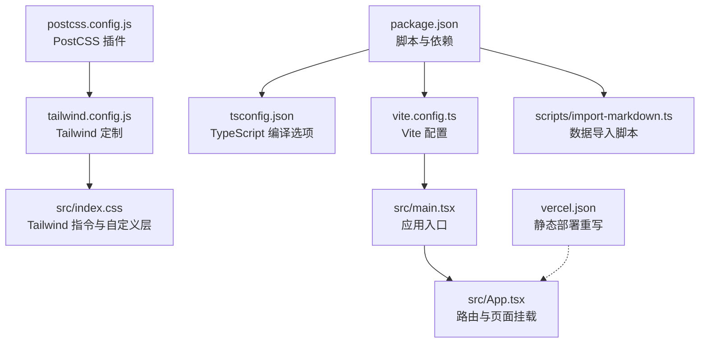
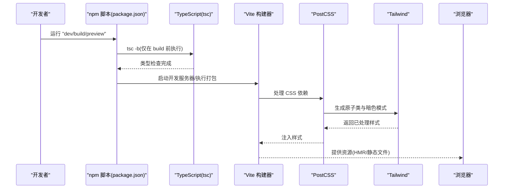
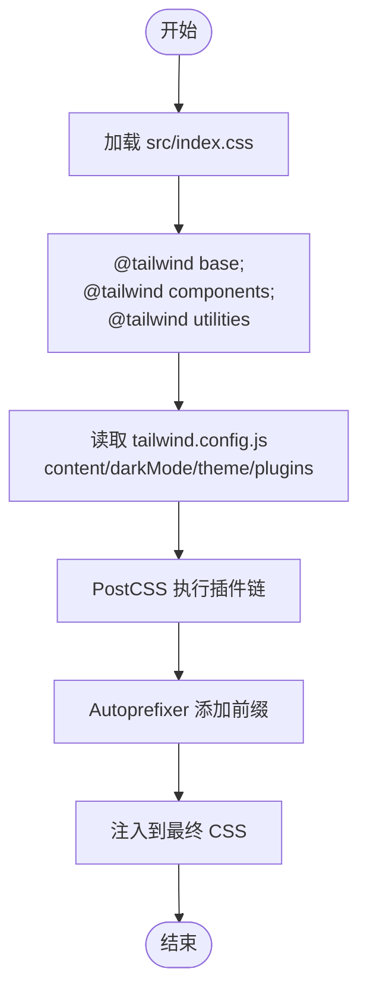
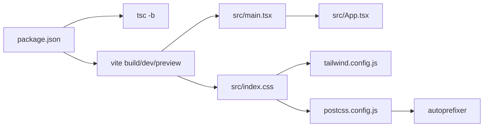

# 构建配置

<cite>
**本文引用的文件**
- [vite.config.ts](file://vite.config.ts)
- [package.json](file://package.json)
- [tsconfig.json](file://tsconfig.json)
- [tsconfig.scripts.json](file://tsconfig.scripts.json)
- [postcss.config.js](file://postcss.config.js)
- [tailwind.config.js](file://tailwind.config.js)
- [src/index.css](file://src/index.css)
- [src/main.tsx](file://src/main.tsx)
- [src/App.tsx](file://src/App.tsx)
- [scripts/import-markdown.ts](file://scripts/import-markdown.ts)
- [vercel.json](file://vercel.json)
</cite>

## 目录
1. [简介](#简介)
2. [项目结构](#项目结构)
3. [核心组件](#核心组件)
4. [架构总览](#架构总览)
5. [详细组件分析](#详细组件分析)
6. [依赖关系分析](#依赖关系分析)
7. [性能考量](#性能考量)
8. [故障排查指南](#故障排查指南)
9. [结论](#结论)
10. [附录](#附录)

## 简介
本文件系统性梳理本项目的构建配置与优化策略，覆盖 Vite 配置参数、TypeScript 编译选项、PostCSS 处理流程与 Tailwind CSS 定制；解释开发与生产环境差异、代码分割与懒加载现状、构建性能优化技巧、缓存与资源压缩策略，并提供构建产物分析、打包体积优化建议与 CDN 集成思路。文档面向不同技术背景读者，既提供高层概览也给出可操作的落地建议。

## 项目结构
项目采用 Vite + React + TypeScript 技术栈，样式通过 PostCSS + Tailwind CSS 管理，构建脚本由 npm scripts 统一调度。关键配置文件分布如下：
- 构建与运行：vite.config.ts、package.json
- 类型系统：tsconfig.json、tsconfig.scripts.json
- 样式管线：postcss.config.js、tailwind.config.js、src/index.css
- 应用入口：src/main.tsx、src/App.tsx
- 工具脚本：scripts/import-markdown.ts
- 部署重写：vercel.json

图表来源
- [package.json:1-36](file://package.json#L1-L36)
- [vite.config.ts:1-21](file://vite.config.ts#L1-L21)
- [tsconfig.json:1-25](file://tsconfig.json#L1-L25)
- [postcss.config.js:1-7](file://postcss.config.js#L1-L7)
- [tailwind.config.js:1-60](file://tailwind.config.js#L1-L60)
- [src/index.css:1-101](file://src/index.css#L1-L101)
- [src/main.tsx:1-11](file://src/main.tsx#L1-L11)
- [src/App.tsx:1-35](file://src/App.tsx#L1-L35)
- [scripts/import-markdown.ts:1-159](file://scripts/import-markdown.ts#L1-L159)
- [vercel.json:1-6](file://vercel.json#L1-L6)

章节来源
- [package.json:1-36](file://package.json#L1-L36)
- [vite.config.ts:1-21](file://vite.config.ts#L1-L21)
- [tsconfig.json:1-25](file://tsconfig.json#L1-L25)
- [postcss.config.js:1-7](file://postcss.config.js#L1-L7)
- [tailwind.config.js:1-60](file://tailwind.config.js#L1-L60)
- [src/index.css:1-101](file://src/index.css#L1-L101)
- [src/main.tsx:1-11](file://src/main.tsx#L1-L11)
- [src/App.tsx:1-35](file://src/App.tsx#L1-L35)
- [scripts/import-markdown.ts:1-159](file://scripts/import-markdown.ts#L1-L159)
- [vercel.json:1-6](file://vercel.json#L1-L6)

## 核心组件
- Vite 构建器：负责开发服务器、模块热替换、打包与预优化。
- React 插件：启用 JSX 转换、HMR、React 18 特性支持。
- TypeScript：类型检查与模块解析，配合 Vite 的 bundler 模式。
- PostCSS/Tailwind：自动化前缀与原子类生成，按需裁剪样式。
- npm scripts：统一 dev/build/preview 命令，串联 tsc 与 vite。

章节来源
- [vite.config.ts:1-21](file://vite.config.ts#L1-L21)
- [package.json:6-11](file://package.json#L6-L11)
- [tsconfig.json:1-25](file://tsconfig.json#L1-L25)
- [postcss.config.js:1-7](file://postcss.config.js#L1-L7)
- [tailwind.config.js:1-60](file://tailwind.config.js#L1-L60)

## 架构总览
下图展示从开发到生产的端到端构建与运行链路，包括类型检查前置、样式管线、路由与页面挂载、以及部署重写规则。

图表来源
- [package.json:6-11](file://package.json#L6-L11)
- [tsconfig.json:1-25](file://tsconfig.json#L1-L25)
- [vite.config.ts:1-21](file://vite.config.ts#L1-L21)
- [postcss.config.js:1-7](file://postcss.config.js#L1-L7)
- [tailwind.config.js:1-60](file://tailwind.config.js#L1-L60)

## 详细组件分析

### Vite 配置与开发/生产差异
- 别名与路径解析：通过别名简化导入路径，提升可维护性。
- 开发服务器：默认端口与自动打开浏览器，便于本地联调。
- 构建输出：指定 dist 目录与开启 Source Map，利于调试与回溯。
- 插件生态：内置 React 插件，适配 JSX 与 HMR。
- 当前状态：未显式配置 rollupOptions、动态导入或预构建依赖，属于最小可用配置。

建议优化方向（基于现有配置）：
- 生产构建：开启压缩与资源内联策略，结合 CDN 使用。
- 代码分割：利用动态 import 实现路由级懒加载，减少首屏包体。
- 预构建：对稳定第三方库进行预构建以加速冷启动。
- 缓存策略：通过构建产物指纹与 HTTP 缓存头实现长效缓存。

章节来源
- [vite.config.ts:5-20](file://vite.config.ts#L5-L20)

### TypeScript 编译选项与脚本类型
- 目标与模块：ES2020 + ESNext，配合 bundler 模式与严格类型检查。
- 路径映射：与 Vite 别名一致，避免相对路径地狱。
- 脚本类型：独立 tsconfig.scripts.json 用于工具脚本，确保 Node 环境类型安全。
- 关键点：noEmit 由 Vite 承担，避免重复编译。

章节来源
- [tsconfig.json:1-25](file://tsconfig.json#L1-L25)
- [tsconfig.scripts.json:1-12](file://tsconfig.scripts.json#L1-L12)

### PostCSS 处理流程与 Tailwind 定制
- 插件链：Tailwind CSS → Autoprefixer，实现原子类生成与浏览器兼容前缀。
- 样式入口：src/index.css 引入三段指令与自定义 layer，覆盖基础、组件与工具类。
- 主题扩展：自定义字体族、颜色体系、动画与关键帧，满足品牌与交互需求。
- 暗色模式：基于 class 策略，配合 CSS 变量实现明暗主题切换。

图表来源
- [src/index.css:1-101](file://src/index.css#L1-L101)
- [tailwind.config.js:1-60](file://tailwind.config.js#L1-L60)
- [postcss.config.js:1-7](file://postcss.config.js#L1-L7)

章节来源
- [postcss.config.js:1-7](file://postcss.config.js#L1-L7)
- [tailwind.config.js:1-60](file://tailwind.config.js#L1-L60)
- [src/index.css:1-101](file://src/index.css#L1-L101)

### 应用入口与路由挂载
- 入口文件：创建根节点并渲染 App。
- 路由结构：BrowserRouter + Routes + Route 组合，嵌套 Layout 并挂载各页面。
- 动画过渡：Layout 中使用动画库实现页面切换过渡效果。

章节来源
- [src/main.tsx:1-11](file://src/main.tsx#L1-L11)
- [src/App.tsx:1-35](file://src/App.tsx#L1-L35)

### 数据导入脚本与构建后处理
- 目标：将 Markdown 数据转换为结构化 JSON 并生成类型安全的导出文件。
- 流程：解析 frontmatter、提取信号列表、推断日期与会话、写入输出文件。
- 使用：通过 npm 脚本调用 tsx 执行，适合在构建前准备静态数据。

章节来源
- [scripts/import-markdown.ts:1-159](file://scripts/import-markdown.ts#L1-L159)
- [package.json:10](file://package.json#L10)

### 部署与单页应用重写
- 重写规则：将所有路径指向 index.html，保证前端路由正常工作。
- 适用平台：适用于 SPA 部署场景（如静态托管、边缘计算平台）。

章节来源
- [vercel.json:1-6](file://vercel.json#L1-L6)

## 依赖关系分析
- 构建链路：npm scripts → tsc → vite，先做类型检查再打包。
- 样式链路：src/index.css → Tailwind → PostCSS → Autoprefixer → 最终 CSS。
- 运行链路：vite.config.ts → src/main.tsx → src/App.tsx → 页面组件。

图表来源
- [package.json:6-11](file://package.json#L6-L11)
- [vite.config.ts:1-21](file://vite.config.ts#L1-L21)
- [src/main.tsx:1-11](file://src/main.tsx#L1-L11)
- [src/App.tsx:1-35](file://src/App.tsx#L1-L35)
- [src/index.css:1-101](file://src/index.css#L1-L101)
- [tailwind.config.js:1-60](file://tailwind.config.js#L1-L60)
- [postcss.config.js:1-7](file://postcss.config.js#L1-L7)

章节来源
- [package.json:6-11](file://package.json#L6-L11)
- [vite.config.ts:1-21](file://vite.config.ts#L1-L21)
- [src/main.tsx:1-11](file://src/main.tsx#L1-L11)
- [src/App.tsx:1-35](file://src/App.tsx#L1-L35)
- [src/index.css:1-101](file://src/index.css#L1-L101)
- [tailwind.config.js:1-60](file://tailwind.config.js#L1-L60)
- [postcss.config.js:1-7](file://postcss.config.js#L1-L7)

## 性能考量
当前配置与现状
- 已启用 Source Map，便于生产调试与回溯。
- 未配置压缩、分包、预构建与长效缓存策略。
- 路由与页面组件尚未使用动态 import 实现懒加载。
- Tailwind 已按 content 范围扫描，避免无用类被移除。

优化建议（基于现有配置）
- 代码分割与懒加载
  - 将页面组件改为动态 import，实现按需加载与路由级分包。
  - 对大型第三方库（如图表库）单独拆包，结合 CDN 或外部化策略。
- 资源压缩与内联
  - 在生产构建中开启压缩与资源内联，减小传输体积。
  - 对首屏关键资源进行内联，缩短白屏时间。
- 缓存策略
  - 产物添加内容指纹，结合 HTTP 缓存头实现长效缓存。
  - 对不常变更的静态资源（如图标、字体）设置更长缓存。
- 样式优化
  - 保持 content 范围精准，避免扫描过多文件导致构建缓慢。
  - 合理拆分业务样式与通用样式，减少重复打包。
- 构建产物分析
  - 使用可视化分析工具（如构建分析报告）定位大体积模块与重复依赖。
  - 结合 Tree Shaking 与模块联邦（可选）进一步瘦身。
- CDN 集成
  - 将稳定第三方库指向 CDN，降低主包体积与首屏加载时间。
  - 对静态资源与媒体文件使用专用 CDN，提升分发效率。

[本节为通用性能指导，不直接分析具体文件，故无“章节来源”]

## 故障排查指南
- 构建失败（类型错误）
  - 确认 tsc 与 Vite 的编译目标一致，避免类型不匹配。
  - 检查 tsconfig.json 的 include 与 baseUrl 设置。
- 样式未生效
  - 确认 src/index.css 已在入口文件引入。
  - 检查 tailwind.config.js 的 content 范围是否包含对应文件。
- 开发服务器无法访问
  - 检查 vite.config.ts 的 server.port 是否被占用。
  - 确认防火墙或代理未拦截端口。
- 单页应用路由 404
  - 确认部署平台的重写规则已正确配置，将所有路径指向 index.html。
- 数据导入脚本异常
  - 检查输入目录与输出目录权限，确认 Markdown 文件格式符合预期。

章节来源
- [tsconfig.json:1-25](file://tsconfig.json#L1-L25)
- [tailwind.config.js:1-60](file://tailwind.config.js#L1-L60)
- [vite.config.ts:12-15](file://vite.config.ts#L12-L15)
- [vercel.json:1-6](file://vercel.json#L1-L6)
- [scripts/import-markdown.ts:132-159](file://scripts/import-markdown.ts#L132-L159)

## 结论
本项目采用简洁高效的构建配置：TypeScript 类型前置、Vite 快速开发、PostCSS/Tailwind 原子样式管线。当前处于“最小可用”阶段，具备良好的扩展空间。建议在生产构建中引入压缩、分包、懒加载与 CDN 等策略，结合产物分析持续优化打包体积与加载性能，同时完善缓存与部署重写规则，确保交付质量与用户体验。

[本节为总结性内容，不直接分析具体文件，故无“章节来源”]

## 附录
- 常用命令
  - 开发：npm run dev
  - 构建：npm run build（先 tsc -b，再 vite build）
  - 预览：npm run preview
  - 导入数据：npm run import-data
- 关键配置清单
  - Vite：别名、开发服务器、构建输出与 Source Map
  - TypeScript：目标版本、模块解析、严格模式、路径映射
  - PostCSS：Tailwind 与 Autoprefixer 插件
  - Tailwind：content 范围、暗色模式、主题扩展
  - 部署：单页应用重写规则

[本节为参考信息，不直接分析具体文件，故无“章节来源”]