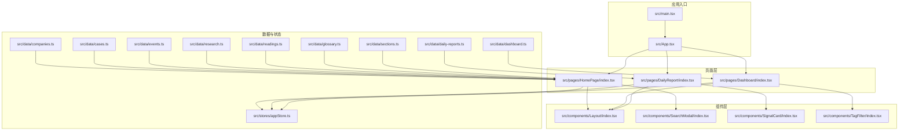
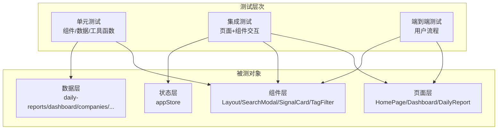
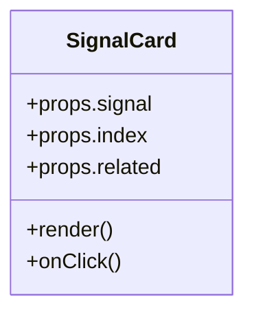
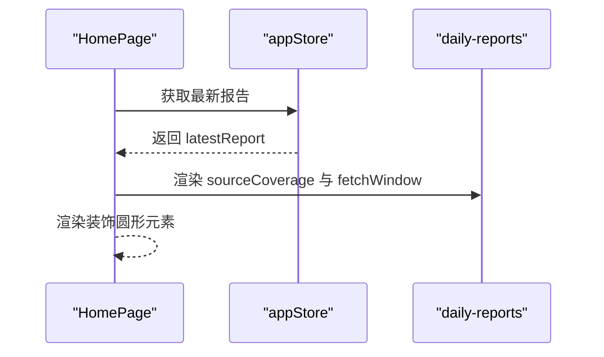
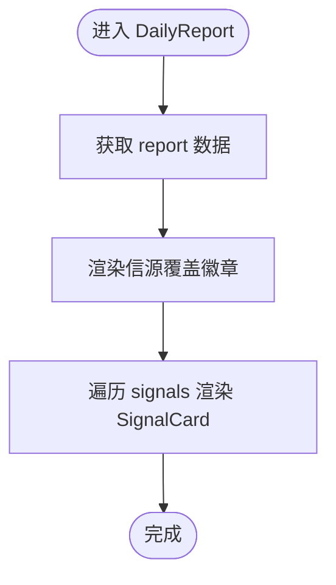
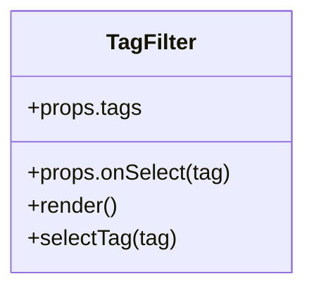
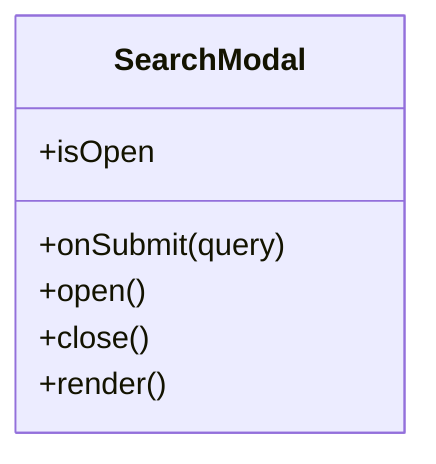
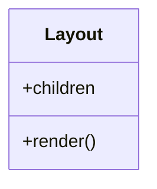
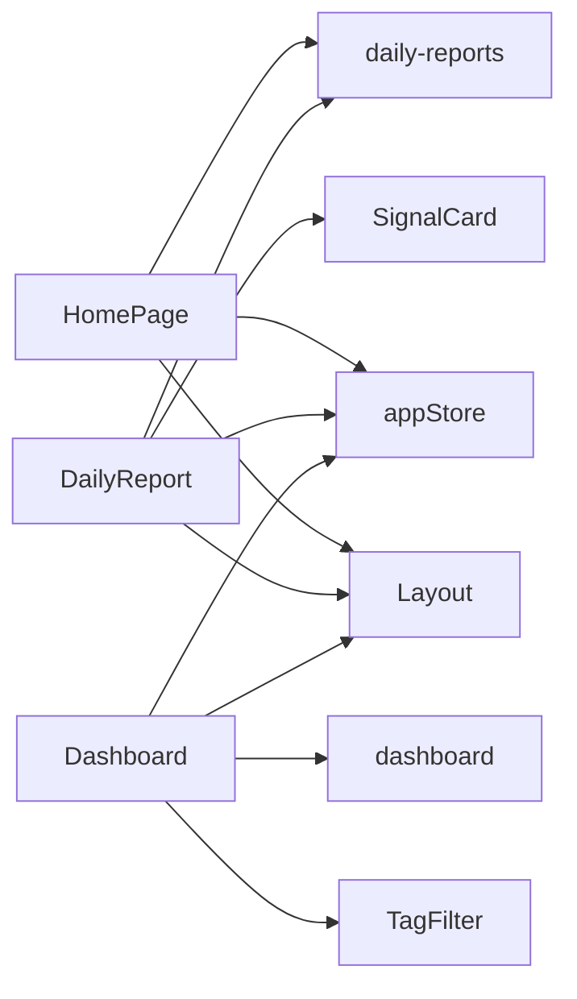

# 测试策略

<cite>
**本文档引用的文件**
- [package.json](file://package.json)
- [tsconfig.json](file://tsconfig.json)
- [tsconfig.scripts.json](file://tsconfig.scripts.json)
- [vite.config.ts](file://vite.config.ts)
- [src/App.tsx](file://src/App.tsx)
- [src/main.tsx](file://src/main.tsx)
- [src/components/Layout/index.tsx](file://src/components/Layout/index.tsx)
- [src/components/SearchModal/index.tsx](file://src/components/SearchModal/index.tsx)
- [src/components/SignalCard/index.tsx](file://src/components/SignalCard/index.tsx)
- [src/components/TagFilter/index.tsx](file://src/components/TagFilter/index.tsx)
- [src/pages/Dashboard/index.tsx](file://src/pages/Dashboard/index.tsx)
- [src/pages/HomePage/index.tsx](file://src/pages/HomePage/index.tsx)
- [src/pages/DailyReport/index.tsx](file://src/pages/DailyReport/index.tsx)
- [src/stores/appStore.ts](file://src/stores/appStore.ts)
- [src/data/daily-reports.ts](file://src/data/daily-reports.ts)
- [src/data/dashboard.ts](file://src/data/dashboard.ts)
- [src/data/companies.ts](file://src/data/companies.ts)
- [src/data/cases.ts](file://src/data/cases.ts)
- [src/data/events.ts](file://src/data/events.ts)
- [src/data/research.ts](file://src/data/research.ts)
- [src/data/readings.ts](file://src/data/readings.ts)
- [src/data/glossary.ts](file://src/data/glossary.ts)
- [src/data/sections.ts](file://src/data/sections.ts)
</cite>

## 目录
1. [引言](#引言)
2. [项目结构](#项目结构)
3. [核心组件](#核心组件)
4. [架构总览](#架构总览)
5. [详细组件分析](#详细组件分析)
6. [依赖关系分析](#依赖关系分析)
7. [性能考虑](#性能考虑)
8. [故障排除指南](#故障排除指南)
9. [结论](#结论)
10. [附录](#附录)

## 引言
本测试策略旨在为该 React + TypeScript 前端项目建立一套完整的测试体系，涵盖单元测试、集成测试与端到端测试。结合项目现有技术栈（Vite、React、TailwindCSS、TypeScript），明确 Jest 配置要点、React Testing Library 使用规范、测试文件组织方式、组件测试最佳实践、异步操作测试方法、Mock 策略、测试覆盖率要求、持续集成中的测试执行以及测试数据管理方案，并给出测试驱动开发流程与测试代码维护规范。

## 项目结构
该项目采用基于功能模块的目录组织方式，前端入口位于 src 目录，页面按功能分层放置在 pages 子目录，通用 UI 组件位于 components 子目录，数据模型与业务数据位于 data 子目录，全局状态管理位于 stores 子目录。构建工具采用 Vite，类型检查与路径别名通过 tsconfig.json 配置。

图表来源
- [src/main.tsx:1-20](file://src/main.tsx#L1-L20)
- [src/App.tsx:1-50](file://src/App.tsx#L1-L50)
- [src/pages/HomePage/index.tsx:1-120](file://src/pages/HomePage/index.tsx#L1-L120)
- [src/pages/Dashboard/index.tsx:1-120](file://src/pages/Dashboard/index.tsx#L1-L120)
- [src/pages/DailyReport/index.tsx:1-250](file://src/pages/DailyReport/index.tsx#L1-L250)
- [src/components/Layout/index.tsx:1-100](file://src/components/Layout/index.tsx#L1-L100)
- [src/components/SearchModal/index.tsx:1-100](file://src/components/SearchModal/index.tsx#L1-L100)
- [src/components/SignalCard/index.tsx:1-100](file://src/components/SignalCard/index.tsx#L1-L100)
- [src/components/TagFilter/index.tsx:1-100](file://src/components/TagFilter/index.tsx#L1-L100)
- [src/stores/appStore.ts:1-100](file://src/stores/appStore.ts#L1-L100)
- [src/data/daily-reports.ts:1-100](file://src/data/daily-reports.ts#L1-L100)
- [src/data/dashboard.ts:1-100](file://src/data/dashboard.ts#L1-L100)
- [src/data/companies.ts:1-100](file://src/data/companies.ts#L1-L100)
- [src/data/cases.ts:1-100](file://src/data/cases.ts#L1-L100)
- [src/data/events.ts:1-100](file://src/data/events.ts#L1-L100)
- [src/data/research.ts:1-100](file://src/data/research.ts#L1-L100)
- [src/data/readings.ts:1-100](file://src/data/readings.ts#L1-L100)
- [src/data/glossary.ts:1-100](file://src/data/glossary.ts#L1-L100)
- [src/data/sections.ts:1-100](file://src/data/sections.ts#L1-L100)

章节来源
- [src/main.tsx:1-20](file://src/main.tsx#L1-L20)
- [src/App.tsx:1-50](file://src/App.tsx#L1-L50)
- [tsconfig.json:1-24](file://tsconfig.json#L1-L24)
- [vite.config.ts:1-20](file://vite.config.ts#L1-L20)

## 核心组件
- 页面组件：HomePage、Dashboard、DailyReport 负责展示与交互，依赖布局组件与数据层。
- 业务组件：Layout 提供统一布局；SearchModal 提供搜索弹窗；SignalCard 展示信号项；TagFilter 提供标签筛选。
- 数据层：daily-reports、dashboard、companies、cases、events、research、readings、glossary、sections 等数据模块。
- 状态层：appStore 提供全局状态管理。

章节来源
- [src/pages/HomePage/index.tsx:1-120](file://src/pages/HomePage/index.tsx#L1-L120)
- [src/pages/Dashboard/index.tsx:1-120](file://src/pages/Dashboard/index.tsx#L1-L120)
- [src/pages/DailyReport/index.tsx:1-250](file://src/pages/DailyReport/index.tsx#L1-L250)
- [src/components/Layout/index.tsx:1-100](file://src/components/Layout/index.tsx#L1-L100)
- [src/components/SearchModal/index.tsx:1-100](file://src/components/SearchModal/index.tsx#L1-L100)
- [src/components/SignalCard/index.tsx:1-100](file://src/components/SignalCard/index.tsx#L1-L100)
- [src/components/TagFilter/index.tsx:1-100](file://src/components/TagFilter/index.tsx#L1-L100)
- [src/stores/appStore.ts:1-100](file://src/stores/appStore.ts#L1-L100)
- [src/data/daily-reports.ts:1-100](file://src/data/daily-reports.ts#L1-L100)
- [src/data/dashboard.ts:1-100](file://src/data/dashboard.ts#L1-L100)
- [src/data/companies.ts:1-100](file://src/data/companies.ts#L1-L100)
- [src/data/cases.ts:1-100](file://src/data/cases.ts#L1-L100)
- [src/data/events.ts:1-100](file://src/data/events.ts#L1-L100)
- [src/data/research.ts:1-100](file://src/data/research.ts#L1-L100)
- [src/data/readings.ts:1-100](file://src/data/readings.ts#L1-L100)
- [src/data/glossary.ts:1-100](file://src/data/glossary.ts#L1-L100)
- [src/data/sections.ts:1-100](file://src/data/sections.ts#L1-L100)

## 架构总览
下图展示了测试策略在系统中的位置与职责边界：单元测试聚焦组件与数据模块；集成测试关注页面与组件交互；端到端测试覆盖用户关键流程。

图表来源
- [src/components/Layout/index.tsx:1-100](file://src/components/Layout/index.tsx#L1-L100)
- [src/components/SearchModal/index.tsx:1-100](file://src/components/SearchModal/index.tsx#L1-L100)
- [src/components/SignalCard/index.tsx:1-100](file://src/components/SignalCard/index.tsx#L1-L100)
- [src/components/TagFilter/index.tsx:1-100](file://src/components/TagFilter/index.tsx#L1-L100)
- [src/pages/HomePage/index.tsx:1-120](file://src/pages/HomePage/index.tsx#L1-L120)
- [src/pages/Dashboard/index.tsx:1-120](file://src/pages/Dashboard/index.tsx#L1-L120)
- [src/pages/DailyReport/index.tsx:1-250](file://src/pages/DailyReport/index.tsx#L1-L250)
- [src/stores/appStore.ts:1-100](file://src/stores/appStore.ts#L1-L100)
- [src/data/daily-reports.ts:1-100](file://src/data/daily-reports.ts#L1-L100)

## 详细组件分析

### 组件 A 分析：SignalCard
SignalCard 用于渲染单条信号，接收信号对象与索引，支持相关信号查找。适合进行以下测试：
- Props 正确渲染与样式类名判断
- 点击事件触发与回调参数
- 相关信号查找逻辑的 Mock 行为验证

图表来源
- [src/components/SignalCard/index.tsx:1-100](file://src/components/SignalCard/index.tsx#L1-L100)

章节来源
- [src/components/SignalCard/index.tsx:1-100](file://src/components/SignalCard/index.tsx#L1-L100)
- [src/pages/DailyReport/index.tsx:200-220](file://src/pages/DailyReport/index.tsx#L200-L220)

### 组件 B 分析：HomePage
HomePage 展示最新报告的信源覆盖情况与时间窗口等信息，包含装饰性元素。测试重点：
- 信源覆盖徽章的文本与图标状态
- fetchWindow 的显示
- 动画与布局元素的存在性

图表来源
- [src/pages/HomePage/index.tsx:60-80](file://src/pages/HomePage/index.tsx#L60-L80)
- [src/stores/appStore.ts:1-100](file://src/stores/appStore.ts#L1-L100)
- [src/data/daily-reports.ts:1-100](file://src/data/daily-reports.ts#L1-L100)

章节来源
- [src/pages/HomePage/index.tsx:1-120](file://src/pages/HomePage/index.tsx#L1-L120)
- [src/stores/appStore.ts:1-100](file://src/stores/appStore.ts#L1-L100)
- [src/data/daily-reports.ts:1-100](file://src/data/daily-reports.ts#L1-L100)

### 组件 C 分析：DailyReport
DailyReport 展示每日报告，包含信源覆盖与信号列表。测试重点：
- 信源覆盖徽章的状态与文本
- 信号列表渲染与 SignalCard 的正确调用
- 相关信号查找函数的行为验证

图表来源
- [src/pages/DailyReport/index.tsx:200-220](file://src/pages/DailyReport/index.tsx#L200-L220)
- [src/components/SignalCard/index.tsx:1-100](file://src/components/SignalCard/index.tsx#L1-L100)

章节来源
- [src/pages/DailyReport/index.tsx:1-250](file://src/pages/DailyReport/index.tsx#L1-L250)
- [src/components/SignalCard/index.tsx:1-100](file://src/components/SignalCard/index.tsx#L1-L100)

### 组件 D 分析：TagFilter
TagFilter 提供标签筛选能力，适合进行交互行为与筛选结果验证的测试。

图表来源
- [src/components/TagFilter/index.tsx:1-100](file://src/components/TagFilter/index.tsx#L1-L100)

章节来源
- [src/components/TagFilter/index.tsx:1-100](file://src/components/TagFilter/index.tsx#L1-L100)

### 组件 E 分析：SearchModal
SearchModal 提供搜索弹窗，适合进行打开/关闭、输入与提交行为的测试。

图表来源
- [src/components/SearchModal/index.tsx:1-100](file://src/components/SearchModal/index.tsx#L1-L100)

章节来源
- [src/components/SearchModal/index.tsx:1-100](file://src/components/SearchModal/index.tsx#L1-L100)

### 组件 F 分析：Layout
Layout 提供统一布局，适合进行路由切换与布局一致性的测试。

图表来源
- [src/components/Layout/index.tsx:1-100](file://src/components/Layout/index.tsx#L1-L100)

章节来源
- [src/components/Layout/index.tsx:1-100](file://src/components/Layout/index.tsx#L1-L100)

## 依赖关系分析
- 页面组件依赖布局组件与数据模块。
- DailyReport 依赖 SignalCard 与 appStore。
- HomePage 依赖 appStore 与 daily-reports 数据。
- TagFilter 与 SearchModal 作为独立可复用组件，便于单元测试。

图表来源
- [src/pages/HomePage/index.tsx:1-120](file://src/pages/HomePage/index.tsx#L1-L120)
- [src/pages/DailyReport/index.tsx:1-250](file://src/pages/DailyReport/index.tsx#L1-L250)
- [src/pages/Dashboard/index.tsx:1-120](file://src/pages/Dashboard/index.tsx#L1-L120)
- [src/components/Layout/index.tsx:1-100](file://src/components/Layout/index.tsx#L1-L100)
- [src/components/SignalCard/index.tsx:1-100](file://src/components/SignalCard/index.tsx#L1-L100)
- [src/components/TagFilter/index.tsx:1-100](file://src/components/TagFilter/index.tsx#L1-L100)
- [src/stores/appStore.ts:1-100](file://src/stores/appStore.ts#L1-L100)
- [src/data/daily-reports.ts:1-100](file://src/data/daily-reports.ts#L1-L100)
- [src/data/dashboard.ts:1-100](file://src/data/dashboard.ts#L1-L100)

章节来源
- [src/pages/HomePage/index.tsx:1-120](file://src/pages/HomePage/index.tsx#L1-L120)
- [src/pages/DailyReport/index.tsx:1-250](file://src/pages/DailyReport/index.tsx#L1-L250)
- [src/pages/Dashboard/index.tsx:1-120](file://src/pages/Dashboard/index.tsx#L1-L120)
- [src/components/Layout/index.tsx:1-100](file://src/components/Layout/index.tsx#L1-L100)
- [src/components/SignalCard/index.tsx:1-100](file://src/components/SignalCard/index.tsx#L1-L100)
- [src/components/TagFilter/index.tsx:1-100](file://src/components/TagFilter/index.tsx#L1-L100)
- [src/stores/appStore.ts:1-100](file://src/stores/appStore.ts#L1-L100)
- [src/data/daily-reports.ts:1-100](file://src/data/daily-reports.ts#L1-L100)
- [src/data/dashboard.ts:1-100](file://src/data/dashboard.ts#L1-L100)

## 性能考虑
- 单元测试应避免真实网络请求与重型 DOM 操作，优先使用轻量级 Mock。
- 集成测试中尽量减少不必要的全局状态变更，确保测试隔离性。
- 端到端测试仅覆盖关键用户路径，避免冗长等待与不稳定因素。

## 故障排除指南
- 测试运行失败：检查 jest 配置与 tsconfig 路径映射是否匹配。
- 组件渲染异常：确认 RTL 的 screen.getByRole/getByText 选择器与实际 DOM 结构一致。
- 异步测试超时：合理使用 waitFor 或 mockResolvedValueOnce，避免过长等待。
- 覆盖率不足：针对分支与边界条件补充测试用例，特别是条件渲染与错误处理。

## 结论
通过分层测试策略与清晰的测试文件组织，可以在不牺牲开发效率的前提下，显著提升代码质量与交付稳定性。建议从单元测试开始，逐步扩展到集成与端到端测试，并在 CI 中强制执行覆盖率阈值与测试通过要求。

## 附录

### 测试策略实施计划
- 单元测试
  - 目标：组件与纯函数、数据模块、工具函数
  - 覆盖率：语句≥80%，分支≥70%，函数与行≥80%
  - 工具：Jest + React Testing Library
  - Mock：使用 jest.mock 与自定义工厂函数
- 集成测试
  - 目标：页面与组件交互、状态更新、路由切换
  - 覆盖率：语句≥70%，分支≥60%
  - 工具：Jest + RTL + MemoryRouter
  - Mock：对服务层与外部依赖进行最小化 Mock
- 端到端测试
  - 目标：关键用户流程（如首页概览、日报查看）
  - 覆盖率：流程完整性验证
  - 工具：Playwright 或 Cypress（按团队偏好）
  - Mock：必要时使用拦截或本地服务

### Jest 配置与 React Testing Library 使用
- 配置要点
  - 扩展名为 .test.ts/.test.tsx
  - 路径别名：通过 tsconfig.json 的 baseUrl 与 paths 保持与应用一致
  - 解析器：jest-environment-jsdom（浏览器环境）
  - 转换：保留 ts/tsx，必要时配置 ts-jest
  - 忽略：node_modules、coverage、dist
- React Testing Library 最佳实践
  - 使用 screen.getByRole、getByLabelText、getByTestId 等语义化查询
  - 避免直接查询实现细节（如 class 名）
  - 对于异步操作，使用 waitFor 包裹断言
  - 事件模拟使用 fireEvent 或 userEvent

章节来源
- [tsconfig.json:1-24](file://tsconfig.json#L1-L24)
- [vite.config.ts:1-20](file://vite.config.ts#L1-L20)

### 测试文件组织结构
- src/__tests__/unit/：单元测试
- src/__tests__/integration/：集成测试
- src/__tests__/e2e/：端到端测试
- src/__mocks__/：全局 Mock（如图片、字体、第三方库）
- src/__fixtures__/：测试数据快照与固定数据

### 组件测试最佳实践
- 以 props 为中心的测试：验证不同 props 下的渲染与行为
- 事件驱动测试：模拟点击、输入、滚动等用户行为
- 条件渲染测试：覆盖 true/false 分支
- 错误边界测试：模拟错误场景并验证降级 UI
- 可访问性测试：确保键盘导航与屏幕阅读器友好

### 异步操作测试
- 使用 jest.useFakeTimers 与 advanceTimersByTime 控制时间
- 使用 waitFor、screen.findBy* 查询动态内容
- 对 Promise 进行 mockResolvedValueOnce/mockRejectedValueOnce
- 对 useEffect、useEffect 依赖数组进行针对性测试

### Mock 策略
- 图片与静态资源：jest.mock('*.svg')、jest.mock('*.png')
- 外部服务：jest.spyOn 或 jest.fn 替换 fetch/fetch-like 函数
- 第三方库：在 __mocks__ 中提供简化实现
- 全局状态：使用 MemoryRouter、Provider 包裹组件

### 测试覆盖率要求
- 单元测试：语句≥80%，分支≥70%，函数与行≥80%
- 集成测试：语句≥70%，分支≥60%
- 端到端测试：流程完整性验证（无硬性覆盖率指标）

### 持续集成中的测试执行
- 在 CI 中执行：npm test 或 yarn test
- 并行执行：利用 Jest 的 --maxWorkers 与 --testPathIgnorePatterns
- 缓存：启用 Jest 缓存与 TypeScript 编译缓存
- 报告：生成覆盖率报告并在 CI 中进行阈值检查

### 测试数据管理
- 固定数据：src/__fixtures__/ 下存放 JSON 快照
- 动态数据：使用工厂函数生成随机但可预测的数据
- 环境隔离：区分开发、测试、生产数据源
- Mock 数据：对第三方接口返回值进行稳定化 Mock

### 测试驱动开发流程
- 编写失败的测试用例（红灯）
- 实现最小功能使测试通过（绿灯）
- 重构代码与测试（重构）
- 重复上述循环直至需求完成

### 测试代码维护规范
- 命名规范：describe 以组件/模块命名，it 描述具体行为
- 断言简洁：每个测试只验证一个行为
- 清理工作：afterEach 中清理 DOM、定时器、事件监听
- 文档注释：为复杂测试添加简要说明