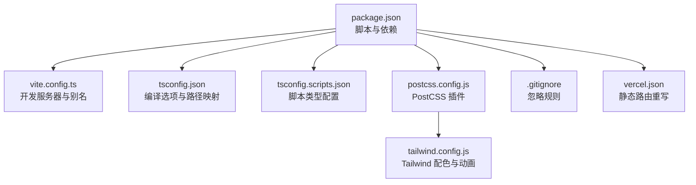
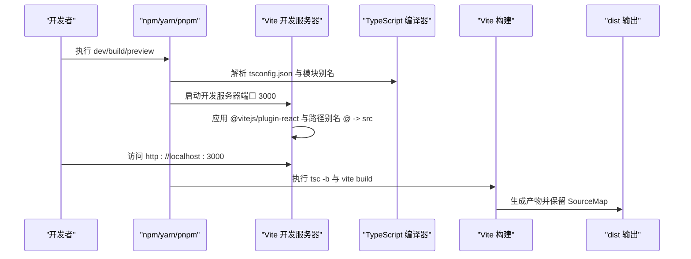
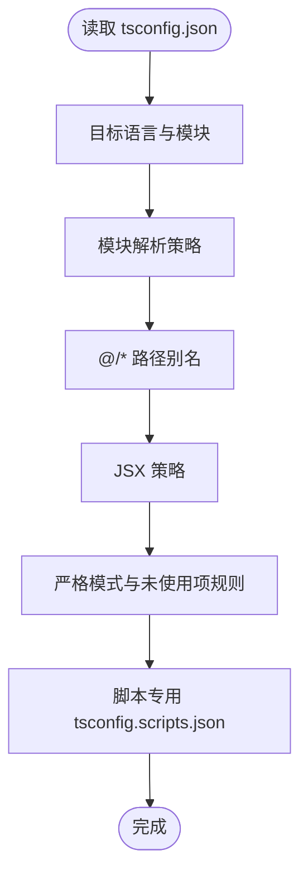
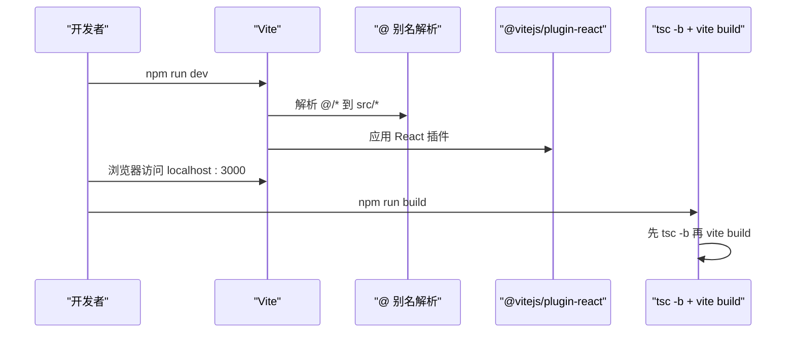
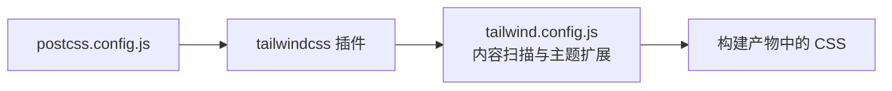
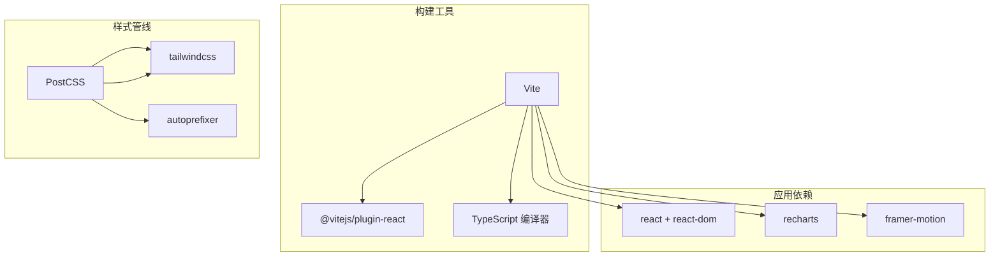

# 环境配置

<cite>
**本文引用的文件**
- [package.json](file://package.json)
- [vite.config.ts](file://vite.config.ts)
- [tsconfig.json](file://tsconfig.json)
- [tsconfig.scripts.json](file://tsconfig.scripts.json)
- [postcss.config.js](file://postcss.config.js)
- [tailwind.config.js](file://tailwind.config.js)
- [.gitignore](file://.gitignore)
- [vercel.json](file://vercel.json)
</cite>

## 目录
1. [简介](#简介)
2. [项目结构](#项目结构)
3. [核心组件](#核心组件)
4. [架构总览](#架构总览)
5. [详细组件分析](#详细组件分析)
6. [依赖关系分析](#依赖关系分析)
7. [性能考虑](#性能考虑)
8. [故障排除指南](#故障排除指南)
9. [结论](#结论)
10. [附录](#附录)

## 简介
本指南面向首次参与本项目的开发者，提供从零开始的开发环境配置方案，覆盖 Node.js 版本要求、包管理器选择、IDE 推荐配置；详解依赖安装流程、TypeScript 编译配置、Vite 开发服务器设置；同时给出 Git 配置、代码格式化与 ESLint 规则建议、跨平台搭建步骤、常见问题排查与解决方案，并解释工具链选择的理由与优化建议。

## 项目结构
该项目为基于 React + TypeScript + Vite 的前端应用，使用 Tailwind CSS 进行样式处理，PostCSS 自动补全与构建管线集成。核心配置集中在以下文件：
- 包管理与脚本：package.json
- 构建与开发服务器：vite.config.ts
- 类型系统与模块解析：tsconfig.json、tsconfig.scripts.json
- 样式管线：postcss.config.js、tailwind.config.js
- 版本控制忽略规则：.gitignore
- 静态资源部署重写（Vercel）：vercel.json

**图示来源**
- [package.json:1-36](file://package.json#L1-L36)
- [vite.config.ts:1-21](file://vite.config.ts#L1-L21)
- [tsconfig.json:1-25](file://tsconfig.json#L1-L25)
- [tsconfig.scripts.json:1-12](file://tsconfig.scripts.json#L1-L12)
- [postcss.config.js:1-7](file://postcss.config.js#L1-L7)
- [tailwind.config.js:1-60](file://tailwind.config.js#L1-L60)
- [.gitignore:1-7](file://.gitignore#L1-L7)
- [vercel.json:1-6](file://vercel.json#L1-L6)

**章节来源**
- [package.json:1-36](file://package.json#L1-L36)
- [vite.config.ts:1-21](file://vite.config.ts#L1-L21)
- [tsconfig.json:1-25](file://tsconfig.json#L1-L25)
- [tsconfig.scripts.json:1-12](file://tsconfig.scripts.json#L1-L12)
- [postcss.config.js:1-7](file://postcss.config.js#L1-L7)
- [tailwind.config.js:1-60](file://tailwind.config.js#L1-L60)
- [.gitignore:1-7](file://.gitignore#L1-L7)
- [vercel.json:1-6](file://vercel.json#L1-L6)

## 核心组件
- 脚本与依赖
  - 开发：vite
  - 构建：先执行 tsc -b 再 vite build
  - 预览：vite preview
  - 数据导入：tsx scripts/import-markdown.ts
- TypeScript
  - 目标语言：ES2020
  - 模块解析：bundler
  - 路径别名：@/* -> src/*
  - JSX：react-jsx
- Vite
  - 插件：@vitejs/plugin-react
  - 别名：@ -> src
  - 本地端口：3000，自动打开浏览器
  - 构建输出：dist，启用 SourceMap
- PostCSS/Tailwind
  - 插件：tailwindcss、autoprefixer
  - 内容扫描：index.html 与 src 下各类文件
  - 主题扩展：字体、颜色、动画、keyframes
- Git 忽略
  - node_modules、dist、.DS_Store、*.local、.env、.env.local

**章节来源**
- [package.json:6-11](file://package.json#L6-L11)
- [package.json:23-34](file://package.json#L23-L34)
- [tsconfig.json:2-22](file://tsconfig.json#L2-L22)
- [vite.config.ts:5-20](file://vite.config.ts#L5-L20)
- [postcss.config.js:1-6](file://postcss.config.js#L1-L6)
- [tailwind.config.js:3-59](file://tailwind.config.js#L3-L59)
- [.gitignore:1-7](file://.gitignore#L1-L7)

## 架构总览
下图展示了从启动到构建的关键流程，以及各配置文件在其中的作用：

**图示来源**
- [package.json:6-11](file://package.json#L6-L11)
- [vite.config.ts:5-20](file://vite.config.ts#L5-L20)
- [tsconfig.json:2-22](file://tsconfig.json#L2-L22)

## 详细组件分析

### Node.js 与包管理器
- Node.js 版本要求
  - TypeScript 与 Vite 建议使用较新的 LTS 或稳定版本；结合当前依赖范围，建议使用 Node.js 18+ 或 20+。
- 包管理器选择
  - 推荐使用 pnpm（高性能、强隔离、节省磁盘空间），或 npm/yarn 亦可。确保使用与团队一致的包管理器以避免 lock 文件差异。
- 安装流程
  - 清理缓存后安装依赖，确保全局二进制可被 Vite/TypeScript 正确调用。
  - 如需运行数据导入脚本，请确认 tsx 可用且脚本类型由 tsconfig.scripts.json 提供支持。

**章节来源**
- [package.json:23-34](file://package.json#L23-L34)
- [tsconfig.scripts.json:1-12](file://tsconfig.scripts.json#L1-L12)

### IDE 推荐配置
- VS Code
  - 插件：ES7+ React/Redux/React Toolkit、Tailwind CSS IntelliSense、Prettier、ESLint
  - 设置要点：
    - editor.formatOnSave: true
    - editor.codeActionsOnSave: { "source.fixAll.eslint": true }
    - eslint.validate: ["javascript", "javascriptreact", "typescript", "typescriptreact"]
    - typescript.preferences.importModuleSpecifier: "relative"
    - tailwindCSS.includeLanguages: { "typescript": "tailwindcss", "typescriptreact": "tailwindcss" }
- WebStorm/IntelliJ IDEA
  - 启用 TypeScript、ESLint、Prettier 集成；配置路径别名为 src；启用 React/JSX 支持。

[本节为通用实践建议，不直接分析具体文件，故无“章节来源”]

### TypeScript 编译配置
- 关键点
  - 目标与模块：ES2020 + ESNext 模块，bundler 解析，避免打包器外解析
  - 路径别名：@/* 映射至 src，便于统一导入
  - JSX：react-jsx，配合 React 组件开发
  - 严格模式：开启严格检查，关闭部分过度严格的规则以平衡工程效率
  - 脚本类型：scripts 使用独立 tsconfig.scripts.json，启用 node 类型与 ESModule 互操作
- 复杂度与性能
  - bundler 解析与 noEmit 有助于快速开发；生产构建通过 tsc -b 与 vite 并行提升效率

**图示来源**
- [tsconfig.json:2-22](file://tsconfig.json#L2-L22)
- [tsconfig.scripts.json:1-12](file://tsconfig.scripts.json#L1-L12)

**章节来源**
- [tsconfig.json:2-22](file://tsconfig.json#L2-L22)
- [tsconfig.scripts.json:1-12](file://tsconfig.scripts.json#L1-L12)

### Vite 开发服务器设置
- 插件与别名
  - @vitejs/plugin-react：加速 React HMR 与 JSX 转换
  - 路径别名：@ -> src，简化导入
- 服务器与构建
  - 默认端口 3000，自动打开浏览器
  - 构建输出 dist，启用 SourceMap 便于调试
- 与脚本的关系
  - 构建前先执行 tsc -b，确保类型检查与增量编译

**图示来源**
- [vite.config.ts:5-20](file://vite.config.ts#L5-L20)
- [package.json:7-8](file://package.json#L7-L8)

**章节来源**
- [vite.config.ts:5-20](file://vite.config.ts#L5-L20)
- [package.json:7-8](file://package.json#L7-L8)

### 样式与构建管线（PostCSS + Tailwind）
- PostCSS
  - 集成 tailwindcss 与 autoprefixer，自动补全与优化 CSS
- Tailwind
  - 内容扫描范围覆盖根 HTML 与 src 下多类文件
  - 主题扩展：中文字体族、品牌色板、信号色（高/中/低）、表面色、动画与关键帧
- 与 Vite 协作
  - 在开发与构建阶段均生效，保证样式一致性

**图示来源**
- [postcss.config.js:1-6](file://postcss.config.js#L1-L6)
- [tailwind.config.js:3-59](file://tailwind.config.js#L3-L59)

**章节来源**
- [postcss.config.js:1-6](file://postcss.config.js#L1-L6)
- [tailwind.config.js:3-59](file://tailwind.config.js#L3-L59)

### Git 配置与忽略规则
- 忽略规则
  - node_modules、dist、macOS 系统文件与本地环境变量文件
  - 本地开发环境变量以 *.local 与 .env.* 形式存在，避免提交
- 建议
  - 在团队内统一 .gitignore，避免误提交敏感信息
  - 使用分支策略与 PR 审查，确保变更可追溯

**章节来源**
- [.gitignore:1-7](file://.gitignore#L1-L7)

### 代码格式化与 ESLint 规则（建议）
- Prettier
  - 作为格式化守门人，与编辑器保存时格式化联动
- ESLint
  - 与 TypeScript 结合，启用 React 与 React Hooks 规则
  - 与编辑器保存动作集成，自动修复可修复问题
- 与现有配置的协同
  - 项目已采用严格 TypeScript 规则，建议在本地保持一致的 ESLint 规则集，避免 CI 与本地差异

[本节为通用实践建议，不直接分析具体文件，故无“章节来源”]

### 跨平台环境搭建步骤
- macOS
  - 安装 nvm 并切换到推荐 Node.js 版本
  - 使用 pnpm 安装依赖
  - 运行 npm run dev 启动开发服务器
- Windows
  - 使用 nvm-windows 或直接下载 Node.js
  - 安装依赖后，如遇权限问题，使用管理员终端或调整执行策略
  - 启动开发服务器与构建流程同上
- Linux
  - 使用包管理器或 nvm 安装 Node.js
  - 安装依赖后，注意符号链接与权限问题
  - 启动开发服务器与构建流程同上

[本节为通用实践建议，不直接分析具体文件，故无“章节来源”]

## 依赖关系分析
- 工具链耦合
  - Vite 依赖 React 插件与 TypeScript 编译器
  - Tailwind 依赖 PostCSS 插件链
  - 脚本类型由独立 tsconfig.scripts.json 提供
- 外部依赖
  - React 生态与可视化库（如 Recharts、Framer Motion）
  - 构建与样式工具（Vite、PostCSS、Tailwind）

**图示来源**
- [package.json:23-34](file://package.json#L23-L34)
- [vite.config.ts:5-6](file://vite.config.ts#L5-L6)
- [postcss.config.js:1-6](file://postcss.config.js#L1-L6)

**章节来源**
- [package.json:12-34](file://package.json#L12-L34)
- [vite.config.ts:5-6](file://vite.config.ts#L5-L6)
- [postcss.config.js:1-6](file://postcss.config.js#L1-L6)

## 性能考虑
- 开发体验
  - Vite 的热更新与 React 插件显著降低冷启动与 HMR 时间
  - SourceMap 启用便于定位问题，但会增加构建体积
- 构建优化
  - 使用 tsc -b 进行增量编译，减少重复类型检查
  - Tailwind 内容扫描范围应尽量精确，避免不必要的类名扫描
- 依赖瘦身
  - 定期审查依赖树，移除未使用包，避免 bundle 体积膨胀

[本节提供一般性指导，不直接分析具体文件，故无“章节来源”]

## 故障排除指南
- 无法启动开发服务器
  - 检查端口占用（默认 3000），必要时修改 vite.config.ts 中的 server.port
  - 确认依赖安装完整，尝试清理 node_modules 与重新安装
- 构建失败或产物异常
  - 先执行 tsc -b 确认类型检查通过
  - 检查 tsconfig.json 与 tsconfig.scripts.json 的路径别名与模块解析是否一致
- 样式未生效
  - 确认 Tailwind 内容扫描范围包含对应文件
  - 检查 PostCSS 插件顺序与版本兼容性
- 路径别名无效
  - 确认 tsconfig.json 与 vite.config.ts 中 @/* 别名一致
- 预览与部署差异
  - 本地 preview 与生产部署可能存在路由问题，参考 vercel.json 的重写规则进行适配

**章节来源**
- [vite.config.ts:12-19](file://vite.config.ts#L12-L19)
- [tsconfig.json:18-21](file://tsconfig.json#L18-L21)
- [tailwind.config.js:3](file://tailwind.config.js#L3)
- [vercel.json:2-4](file://vercel.json#L2-L4)

## 结论
本指南提供了从 Node.js 版本、包管理器、IDE 配置到依赖安装、TypeScript 与 Vite 设置、样式管线与 Git 忽略的完整开发环境配置路径。遵循本文建议可获得稳定、高效的开发体验；遇到问题时，可依据故障排除章节快速定位与解决。

## 附录
- 项目脚本速览
  - dev：启动 Vite 开发服务器
  - build：先 tsc -b 再 vite build
  - preview：预览构建产物
  - import-data：运行数据导入脚本
- 部署参考
  - vercel.json 提供单页应用路由重写，确保客户端路由正常工作

**章节来源**
- [package.json:6-11](file://package.json#L6-L11)
- [vercel.json:1-6](file://vercel.json#L1-L6)