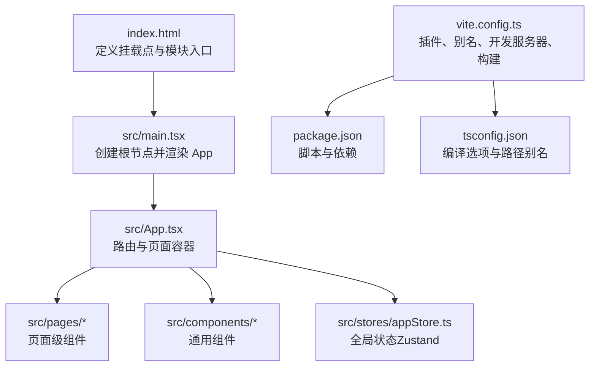
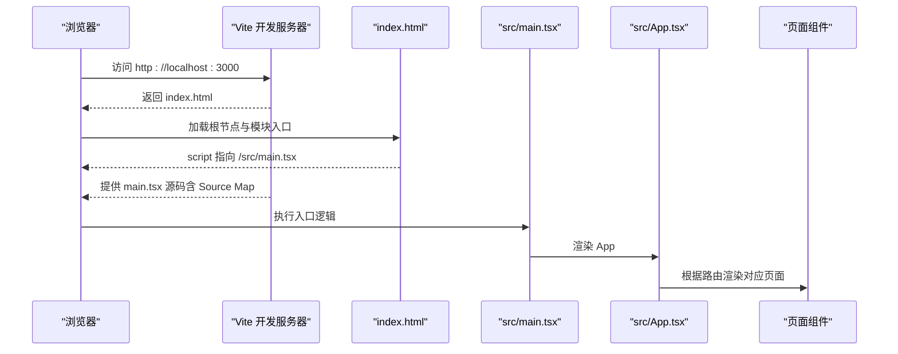
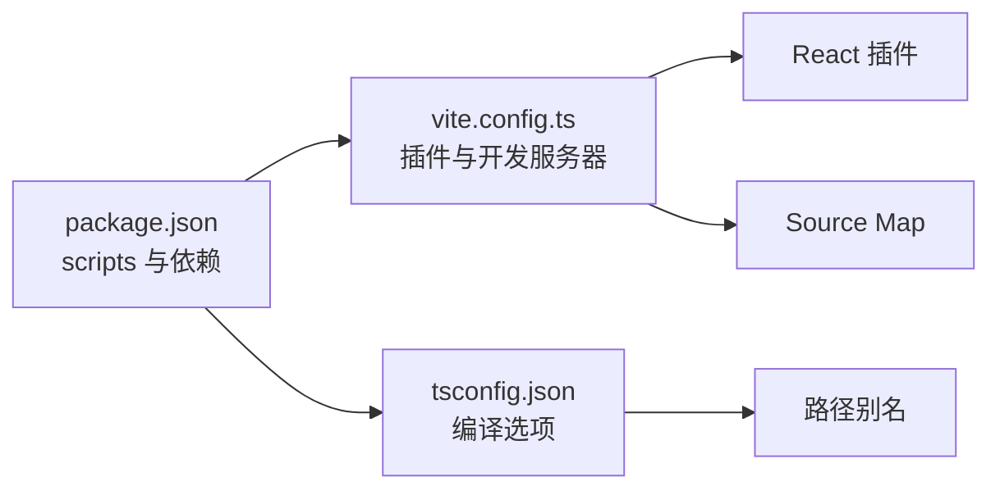

# 调试工具

<cite>
**本文引用的文件**
- [vite.config.ts](file://vite.config.ts)
- [package.json](file://package.json)
- [tsconfig.json](file://tsconfig.json)
- [src/main.tsx](file://src/main.tsx)
- [index.html](file://index.html)
- [src/App.tsx](file://src/App.tsx)
- [src/stores/appStore.ts](file://src/stores/appStore.ts)
- [src/pages/HomePage/index.tsx](file://src/pages/HomePage/index.tsx)
- [src/pages/DailyReport/index.tsx](file://src/pages/DailyReport/index.tsx)
- [src/pages/Admin/index.tsx](file://src/pages/Admin/index.tsx)
- [scripts/import-markdown.ts](file://scripts/import-markdown.ts)
</cite>

## 目录
1. [简介](#简介)
2. [项目结构](#项目结构)
3. [核心组件](#核心组件)
4. [架构总览](#架构总览)
5. [详细组件分析](#详细组件分析)
6. [依赖分析](#依赖分析)
7. [性能考虑](#性能考虑)
8. [故障排除指南](#故障排除指南)
9. [结论](#结论)
10. [附录](#附录)

## 简介
本文件系统性梳理该项目在开发与调试中的常用工具与技术，涵盖以下方面：
- 浏览器开发者工具使用：DOM/样式检查、元素选择、事件监听、网络面板、性能分析、存储查看等。
- React DevTools 安装与配置：在 Vite 环境下的推荐实践与注意事项。
- 网络请求监控：如何在浏览器中定位与分析请求、响应、缓存与跨域问题。
- 性能分析工具：利用浏览器性能面板进行渲染、布局与脚本执行分析。
- Vite 开发服务器调试特性：端口、自动打开、热重载、源码映射与构建优化。
- TypeScript 调试配置：编译选项、路径别名、严格模式与断点设置技巧。
- 状态检查方法：通过 Zustand DevTools 或浏览器控制台检查应用状态。
- 常见问题调试流程与故障排除：启动失败、热更新异常、路由不生效、样式不生效等问题的排查步骤。

## 项目结构
该工程采用 Vite + React + TypeScript 技术栈，使用 TailwindCSS 进行样式管理，并通过路径别名简化导入。开发脚本与构建配置集中在根目录的配置文件中，入口 HTML 与 React 根节点位于公共模板与主入口文件中。

图表来源
- [index.html:13-16](file://index.html#L13-L16)
- [src/main.tsx:6-10](file://src/main.tsx#L6-L10)
- [src/App.tsx:14-34](file://src/App.tsx#L14-L34)
- [vite.config.ts:5-20](file://vite.config.ts#L5-L20)
- [package.json:6-11](file://package.json#L6-L11)
- [tsconfig.json:18-22](file://tsconfig.json#L18-L22)

章节来源
- [index.html:13-16](file://index.html#L13-L16)
- [src/main.tsx:6-10](file://src/main.tsx#L6-L10)
- [src/App.tsx:14-34](file://src/App.tsx#L14-L34)
- [vite.config.ts:5-20](file://vite.config.ts#L5-L20)
- [package.json:6-11](file://package.json#L6-L11)
- [tsconfig.json:18-22](file://tsconfig.json#L18-L22)

## 核心组件
- 开发服务器与构建配置：Vite 配置启用 React 插件、路径别名、开发服务器端口与自动打开、构建时生成 Source Map，便于调试。
- TypeScript 编译配置：启用严格模式、路径别名、ESNext 模块解析与 JSX 支持，确保类型安全与良好的开发体验。
- 应用入口与渲染：HTML 中声明根节点，React 在 main.tsx 中以 Strict Mode 包裹渲染 App。
- 路由与页面：App 组件集中定义路由规则，页面组件按功能模块拆分。
- 全局状态：使用 Zustand 管理主题、用户角色、阅读历史、收藏、搜索与标签过滤等状态，并持久化部分状态。

章节来源
- [vite.config.ts:5-20](file://vite.config.ts#L5-L20)
- [tsconfig.json:2-22](file://tsconfig.json#L2-L22)
- [src/main.tsx:6-10](file://src/main.tsx#L6-L10)
- [src/App.tsx:14-34](file://src/App.tsx#L14-L34)
- [src/stores/appStore.ts:35-92](file://src/stores/appStore.ts#L35-L92)

## 架构总览
下图展示从浏览器加载到组件渲染的关键路径，以及开发服务器与构建产物的关系。

图表来源
- [index.html:13-16](file://index.html#L13-L16)
- [src/main.tsx:6-10](file://src/main.tsx#L6-L10)
- [src/App.tsx:14-34](file://src/App.tsx#L14-L34)
- [vite.config.ts:12-15](file://vite.config.ts#L12-L15)

## 详细组件分析

### Vite 开发服务器与调试特性
- 端口与自动打开：开发服务器默认监听本地端口，启动后自动打开浏览器，提升开发效率。
- 热重载机制：基于 ES 模块的 HMR，修改源码后浏览器无需整页刷新即可更新模块，提高迭代速度。
- 源码映射：构建阶段开启 Source Map，使浏览器断点与堆栈信息指向原始 TS/TSX 文件，便于定位问题。
- 路径别名：通过 Vite 别名与 TypeScript 路径映射统一导入路径，减少相对路径复杂度。

章节来源
- [vite.config.ts:12-19](file://vite.config.ts#L12-L19)
- [tsconfig.json:18-22](file://tsconfig.json#L18-L22)

### TypeScript 调试配置与断点设置
- 严格模式与类型检查：启用严格模式可提前发现潜在类型问题；关闭未使用变量/参数的严格校验有助于过渡期开发。
- 路径别名：在 tsconfig 中配置 baseUrl 与 paths，结合 Vite 别名，确保编辑器与运行时一致解析。
- 断点设置技巧：在 TS/TSX 源码中设置断点，配合 Source Map 可直接命中原始位置；在构建产物中设置断点需依赖 Source Map 映射。

章节来源
- [tsconfig.json:2-22](file://tsconfig.json#L2-L22)

### React 应用调试与状态检查
- React DevTools：用于检查组件树、Props、State 与 Hooks 状态；在开发环境下建议安装官方扩展。
- Zustand 状态调试：可通过浏览器控制台访问全局 Store Hook 并打印状态；或使用 Zustand DevTools 扩展观察状态变化轨迹。
- 页面与组件：首页、日报与管理后台页面均通过路由加载，便于在不同页面间切换验证交互与数据流。

章节来源
- [src/App.tsx:14-34](file://src/App.tsx#L14-L34)
- [src/stores/appStore.ts:35-92](file://src/stores/appStore.ts#L35-L92)
- [src/pages/HomePage/index.tsx:62-104](file://src/pages/HomePage/index.tsx#L62-L104)
- [src/pages/DailyReport/index.tsx:204-220](file://src/pages/DailyReport/index.tsx#L204-L220)
- [src/pages/Admin/index.tsx:49-128](file://src/pages/Admin/index.tsx#L49-L128)

### 网络请求监控与性能分析
- 浏览器网络面板：观察请求/响应头、状态码、耗时、缓存策略与跨域情况；结合“保持登录态”“预连接”等资源提示优化首屏。
- 性能面板：记录长任务、布局抖动、绘制与合成开销；结合 React Profiler 分析组件渲染性能瓶颈。
- 构建与缓存：合理配置静态资源缓存与版本号策略，避免缓存导致的更新不生效。

章节来源
- [index.html:9-11](file://index.html#L9-L11)

### 错误边界与异常处理
- React 严格模式：在开发阶段启用严格模式有助于提前暴露副作用与不安全生命周期的使用。
- 错误边界：可在应用中引入错误边界组件捕获子树异常，避免整页崩溃；同时结合浏览器控制台与 Source Map 快速定位错误来源。

章节来源
- [src/main.tsx:7](file://src/main.tsx#L7)

## 依赖分析
- 开发依赖：Vite、React 插件、TypeScript、TailwindCSS 等；生产依赖：React 生态与可视化库。
- 脚本命令：dev、build、preview、数据导入脚本；构建时先执行 TypeScript 编译再打包，确保类型安全。

图表来源
- [package.json:6-11](file://package.json#L6-L11)
- [vite.config.ts:5-20](file://vite.config.ts#L5-L20)
- [tsconfig.json:18-22](file://tsconfig.json#L18-L22)

章节来源
- [package.json:6-11](file://package.json#L6-L11)
- [package.json:12-34](file://package.json#L12-L34)
- [vite.config.ts:5-20](file://vite.config.ts#L5-L20)
- [tsconfig.json:18-22](file://tsconfig.json#L18-L22)

## 性能考虑
- 源码映射：开启 Source Map 便于调试，但会增加包体与解析时间；生产环境可按需关闭。
- 模块解析：使用路径别名与 ESNext 模块解析，减少模块解析成本。
- 组件渲染：避免不必要的重渲染，合理拆分组件与使用稳定引用；在性能面板中关注长任务与布局抖动。
- 资源加载：利用预连接与字体加载策略，减少阻塞；合理设置缓存与版本号。

章节来源
- [vite.config.ts:18](file://vite.config.ts#L18)
- [tsconfig.json:8-12](file://tsconfig.json#L8-L12)
- [index.html:9-11](file://index.html#L9-L11)

## 故障排除指南
- 启动失败
  - 症状：无法访问开发服务器或报端口占用。
  - 排查：确认端口是否被占用；检查开发服务器配置与网络权限。
  - 参考
    - [vite.config.ts:12-15](file://vite.config.ts#L12-L15)
- 热重载不生效
  - 症状：修改代码后页面未更新。
  - 排查：确认浏览器未禁用 HMR；检查模块导出与命名；确保路径别名与模块解析正确。
  - 参考
    - [vite.config.ts:5-6](file://vite.config.ts#L5-L6)
    - [tsconfig.json:18-22](file://tsconfig.json#L18-L22)
- 路由不生效或页面空白
  - 症状：刷新后 404 或空白页。
  - 排查：确认路由配置与页面组件导入；检查 HTML 中模块入口是否正确；确认开发服务器已返回正确页面。
  - 参考
    - [src/App.tsx:14-34](file://src/App.tsx#L14-L34)
    - [index.html:13-16](file://index.html#L13-L16)
- 样式不生效
  - 症状：组件样式缺失或覆盖异常。
  - 排查：确认 Tailwind 预处理与类名拼写；检查 CSS 作用域与优先级；在浏览器样式面板中定位冲突来源。
  - 参考
    - [index.html:13](file://index.html#L13)
- 断点无法命中
  - 症状：设置断点后不触发。
  - 排查：确认 Source Map 是否生成；检查编译输出与运行时源码一致性；在浏览器 Sources 面板核对断点位置。
  - 参考
    - [vite.config.ts:18](file://vite.config.ts#L18)
    - [tsconfig.json:2-22](file://tsconfig.json#L2-L22)
- 状态异常
  - 症状：全局状态不更新或回滚。
  - 排查：检查 Store 的 action 与 selector；确认持久化中间件配置；使用控制台或 DevTools 观察状态变化。
  - 参考
    - [src/stores/appStore.ts:35-92](file://src/stores/appStore.ts#L35-L92)
- 数据导入脚本报错
  - 症状：Markdown 导入失败或格式异常。
  - 排查：检查输入目录与输出目录路径；确认 Frontmatter 格式与字段完整性；查看脚本输出的统计信息。
  - 参考
    - [scripts/import-markdown.ts:1-41](file://scripts/import-markdown.ts#L1-L41)

## 结论
本项目在开发调试方面具备完善的基础设施：Vite 提供高效的开发服务器与热重载能力，TypeScript 保障类型安全，Zustand 简化状态管理，路径别名与严格模式提升开发效率与可维护性。结合浏览器开发者工具与 React DevTools，可快速定位与解决常见问题，持续优化性能与用户体验。

## 附录
- 常用调试清单
  - 启动：确认 dev 脚本与端口可用
  - 路由：检查 App 路由与页面组件导入
  - 样式：核对 Tailwind 预处理与类名
  - 状态：使用控制台或 DevTools 检查 Store
  - 网络：观察请求与缓存策略
  - 性能：使用性能面板识别长任务与布局抖动