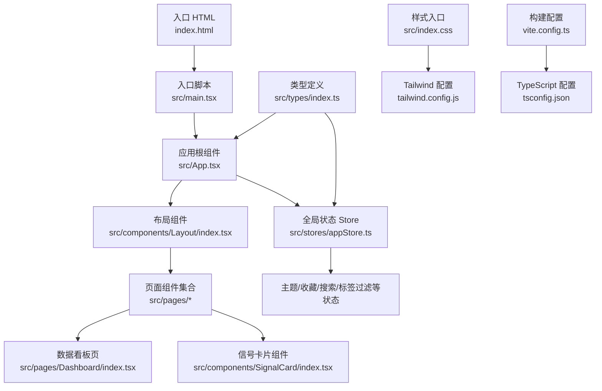
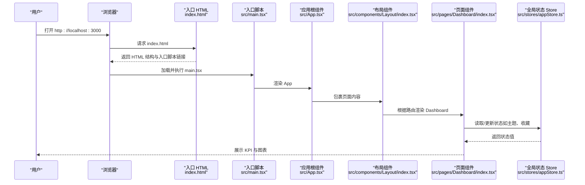
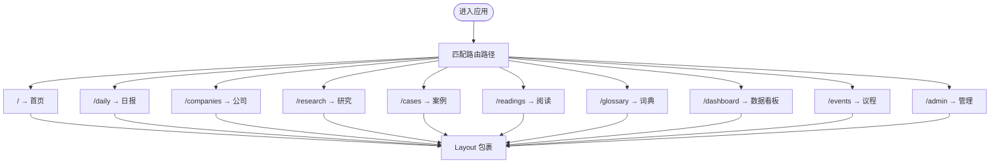
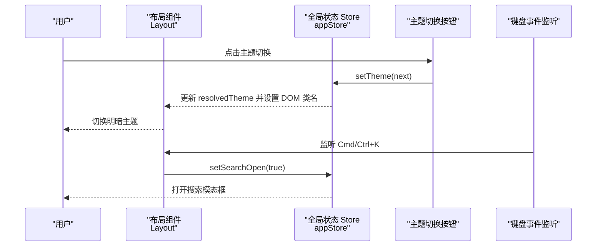
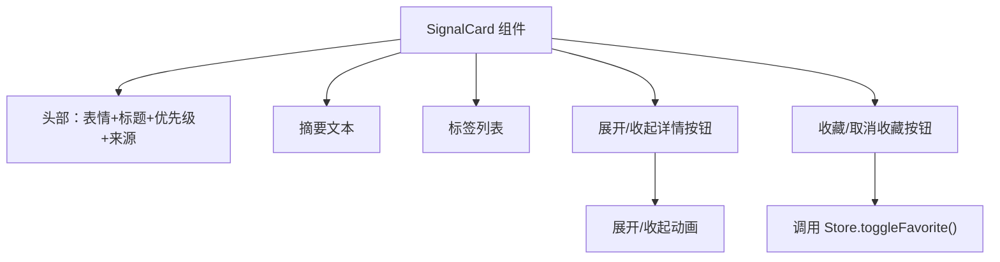
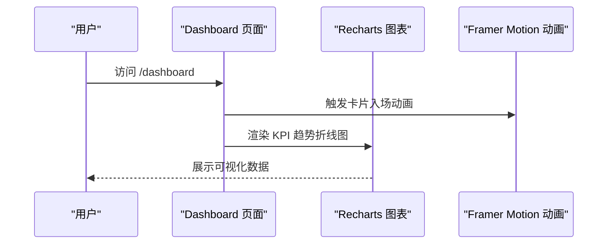

# 快速开始

<cite>
**本文引用的文件**
- [package.json](file://package.json)
- [vite.config.ts](file://vite.config.ts)
- [tsconfig.json](file://tsconfig.json)
- [index.html](file://index.html)
- [src/main.tsx](file://src/main.tsx)
- [src/App.tsx](file://src/App.tsx)
- [src/components/Layout/index.tsx](file://src/components/Layout/index.tsx)
- [src/components/SignalCard/index.tsx](file://src/components/SignalCard/index.tsx)
- [src/pages/Dashboard/index.tsx](file://src/pages/Dashboard/index.tsx)
- [src/stores/appStore.ts](file://src/stores/appStore.ts)
- [src/types/index.ts](file://src/types/index.ts)
- [src/index.css](file://src/index.css)
- [tailwind.config.js](file://tailwind.config.js)
- [postcss.config.js](file://postcss.config.js)
- [scripts/import-markdown.ts](file://scripts/import-markdown.ts)
</cite>

## 目录
1. [简介](#简介)
2. [项目结构](#项目结构)
3. [核心组件](#核心组件)
4. [架构总览](#架构总览)
5. [详细组件分析](#详细组件分析)
6. [依赖分析](#依赖分析)
7. [性能考虑](#性能考虑)
8. [故障排查指南](#故障排查指南)
9. [结论](#结论)
10. [附录](#附录)

## 简介
本指南面向首次接触“未来组织·HR洞察日报”项目的开发者，帮助你在约 30 分钟内完成环境准备、依赖安装与本地开发服务器启动，并快速体验核心功能。项目基于 React 18、Vite 5、TypeScript 5、TailwindCSS 以及 Recharts/Framer Motion 等技术栈构建，提供日报、研究、案例、阅读、词典、数据看板与议程等模块。

## 项目结构
项目采用以“特性/页面”为主的目录组织方式，核心入口与路由在 src 下，页面组件位于 src/pages，通用 UI 组件位于 src/components，数据模型与类型定义位于 src/types，全局状态通过 Zustand 管理，样式通过 TailwindCSS 定义。

图表来源
- [index.html:1-18](file://index.html#L1-L18)
- [src/main.tsx:1-11](file://src/main.tsx#L1-L11)
- [src/App.tsx:1-36](file://src/App.tsx#L1-L36)
- [src/components/Layout/index.tsx:1-175](file://src/components/Layout/index.tsx#L1-L175)
- [src/pages/Dashboard/index.tsx:1-82](file://src/pages/Dashboard/index.tsx#L1-L82)
- [src/components/SignalCard/index.tsx:1-111](file://src/components/SignalCard/index.tsx#L1-L111)
- [src/stores/appStore.ts:1-93](file://src/stores/appStore.ts#L1-L93)
- [src/types/index.ts:1-194](file://src/types/index.ts#L1-L194)
- [src/index.css:1-101](file://src/index.css#L1-L101)
- [tailwind.config.js:1-60](file://tailwind.config.js#L1-L60)
- [vite.config.ts:1-21](file://vite.config.ts#L1-L21)
- [tsconfig.json:1-25](file://tsconfig.json#L1-L25)

章节来源
- [package.json:1-36](file://package.json#L1-L36)
- [vite.config.ts:1-21](file://vite.config.ts#L1-L21)
- [tsconfig.json:1-25](file://tsconfig.json#L1-L25)
- [index.html:1-18](file://index.html#L1-L18)
- [src/main.tsx:1-11](file://src/main.tsx#L1-L11)
- [src/App.tsx:1-36](file://src/App.tsx#L1-L36)

## 核心组件
- 应用根组件：负责路由与顶层布局包裹，统一挂载搜索模态框与全局状态。
- 布局组件：提供顶部导航、移动端菜单、主题切换、全局搜索快捷键监听与内容区域动画过渡。
- 信号卡片组件：展示信号标题、摘要、优先级、标签、收藏与详情展开逻辑。
- 数据看板页：展示 KPI 卡片与趋势折线图，使用 Recharts 进行可视化。
- 全局状态 Store：集中管理主题、用户角色、阅读历史、收藏、搜索开关与标签筛选。

章节来源
- [src/App.tsx:1-36](file://src/App.tsx#L1-L36)
- [src/components/Layout/index.tsx:1-175](file://src/components/Layout/index.tsx#L1-L175)
- [src/components/SignalCard/index.tsx:1-111](file://src/components/SignalCard/index.tsx#L1-L111)
- [src/pages/Dashboard/index.tsx:1-82](file://src/pages/Dashboard/index.tsx#L1-L82)
- [src/stores/appStore.ts:1-93](file://src/stores/appStore.ts#L1-L93)

## 架构总览
下图展示了从浏览器加载到页面渲染的关键路径，以及路由与状态管理的交互关系。

图表来源
- [index.html:1-18](file://index.html#L1-L18)
- [src/main.tsx:1-11](file://src/main.tsx#L1-L11)
- [src/App.tsx:1-36](file://src/App.tsx#L1-L36)
- [src/components/Layout/index.tsx:1-175](file://src/components/Layout/index.tsx#L1-L175)
- [src/pages/Dashboard/index.tsx:1-82](file://src/pages/Dashboard/index.tsx#L1-L82)
- [src/stores/appStore.ts:1-93](file://src/stores/appStore.ts#L1-L93)

## 详细组件分析

### 组件 A：应用根组件与路由
- 职责：声明路由表，统一包裹 Layout，挂载 SearchModal。
- 关键点：BrowserRouter 提供路由上下文；Layout 作为公共容器；各页面按路径映射。

图表来源
- [src/App.tsx:15-35](file://src/App.tsx#L15-L35)

章节来源
- [src/App.tsx:1-36](file://src/App.tsx#L1-L36)

### 组件 B：布局组件与交互
- 职责：顶部导航栏、移动端菜单、主题切换、全局搜索快捷键（Cmd/Ctrl+K）。
- 关键点：键盘事件监听初始化主题；根据当前路径高亮导航项；移动端菜单折叠动画。

图表来源
- [src/components/Layout/index.tsx:28-51](file://src/components/Layout/index.tsx#L28-L51)
- [src/stores/appStore.ts:35-47](file://src/stores/appStore.ts#L35-L47)

章节来源
- [src/components/Layout/index.tsx:1-175](file://src/components/Layout/index.tsx#L1-L175)
- [src/stores/appStore.ts:1-93](file://src/stores/appStore.ts#L1-L93)

### 组件 C：信号卡片组件
- 职责：展示信号标题、摘要、优先级、标签、收藏与详情展开。
- 关键点：优先级对应不同边框色；收藏状态来自全局 Store；详情支持展开/收起动画。

图表来源
- [src/components/SignalCard/index.tsx:26-111](file://src/components/SignalCard/index.tsx#L26-L111)
- [src/stores/appStore.ts:60-67](file://src/stores/appStore.ts#L60-L67)

章节来源
- [src/components/SignalCard/index.tsx:1-111](file://src/components/SignalCard/index.tsx#L1-L111)
- [src/stores/appStore.ts:1-93](file://src/stores/appStore.ts#L1-L93)

### 组件 D：数据看板页
- 职责：展示 KPI 卡片与趋势折线图。
- 关键点：使用 Recharts 渲染折线图；Framer Motion 实现卡片入场动画；数据来源于 dashboardSnapshot。

图表来源
- [src/pages/Dashboard/index.tsx:6-82](file://src/pages/Dashboard/index.tsx#L6-L82)

章节来源
- [src/pages/Dashboard/index.tsx:1-82](file://src/pages/Dashboard/index.tsx#L1-L82)

## 依赖分析
- 运行时依赖：React、React Router、Zustand、Recharts、Framer Motion、Lucide React、HTML2Canvas、Fuse.js。
- 开发依赖：Vite、TypeScript、TailwindCSS、PostCSS、Autoprefixer、@vitejs/plugin-react、tsx。
- 构建与脚本：dev/build/preview/import-data。

```mermaid
graph LR
P["package.json"] --> D1["运行时依赖"]
P --> D2["开发依赖"]
V["vite.config.ts"] --> B["构建与开发服务器"]
T["tsconfig.json"] --> TS["TypeScript 编译选项"]
TW["tailwind.config.js"] --> CSS["样式生成"]
PC["postcss.config.js"] --> TW
S["scripts/import-markdown.ts"] --> IM["数据导入脚本"]
```

图表来源
- [package.json:1-36](file://package.json#L1-L36)
- [vite.config.ts:1-21](file://vite.config.ts#L1-L21)
- [tsconfig.json:1-25](file://tsconfig.json#L1-L25)
- [tailwind.config.js:1-60](file://tailwind.config.js#L1-L60)
- [postcss.config.js:1-7](file://postcss.config.js#L1-L7)
- [scripts/import-markdown.ts:1-159](file://scripts/import-markdown.ts#L1-L159)

章节来源
- [package.json:1-36](file://package.json#L1-L36)
- [vite.config.ts:1-21](file://vite.config.ts#L1-L21)
- [tsconfig.json:1-25](file://tsconfig.json#L1-L25)
- [tailwind.config.js:1-60](file://tailwind.config.js#L1-L60)
- [postcss.config.js:1-7](file://postcss.config.js#L1-L7)
- [scripts/import-markdown.ts:1-159](file://scripts/import-markdown.ts#L1-L159)

## 性能考虑
- 构建产物输出目录为 dist，启用 Source Map 便于调试。
- 使用 Tailwind 的按需扫描范围，避免无用样式打包。
- 页面组件使用轻量动画，建议在低端设备上适当减少动画复杂度。
- 图表组件仅在看板页使用，避免在高频路由切换中重复渲染。

章节来源
- [vite.config.ts:16-20](file://vite.config.ts#L16-L20)
- [tailwind.config.js:3](file://tailwind.config.js#L3)

## 故障排查指南
- 无法启动开发服务器
  - 检查 Node.js 版本是否满足项目需求（建议使用长期支持版本）。
  - 确认端口 3000 未被占用。
  - 清理缓存后重装依赖。
- 页面空白或样式异常
  - 确认 Tailwind CSS 已正确引入与扫描。
  - 检查自定义 CSS 是否存在语法错误。
- 路由跳转无效
  - 确认 BrowserRouter 已包裹根组件。
  - 检查路由路径与页面组件映射是否一致。
- 主题切换不生效
  - 检查 Store 中 setTheme 的实现与 DOM 类名切换逻辑。
- 搜索快捷键无效
  - 确认键盘事件监听已绑定且未被阻止默认行为。
- 数据看板图表不显示
  - 确认 dashboardSnapshot 数据结构与图表字段一致。
- 导入 Markdown 数据失败
  - 检查源目录是否存在，文件命名与格式是否符合预期。

章节来源
- [vite.config.ts:12-15](file://vite.config.ts#L12-L15)
- [src/index.css:1-101](file://src/index.css#L1-L101)
- [src/App.tsx:15-35](file://src/App.tsx#L15-L35)
- [src/stores/appStore.ts:35-47](file://src/stores/appStore.ts#L35-L47)
- [src/components/Layout/index.tsx:28-38](file://src/components/Layout/index.tsx#L28-L38)
- [src/pages/Dashboard/index.tsx:6-82](file://src/pages/Dashboard/index.tsx#L6-L82)
- [scripts/import-markdown.ts:79-130](file://scripts/import-markdown.ts#L79-L130)

## 结论
通过本指南，你可以在 30 分钟内完成环境准备、依赖安装与本地开发服务器启动，并快速体验项目的核心功能。建议在熟悉基础结构后，逐步探索数据导入脚本、全局状态管理与页面组件的扩展实践。

## 附录

### 环境要求与安装步骤
- 环境要求
  - Node.js：建议使用长期支持版本（LTS），确保与项目脚本兼容。
  - 包管理器：推荐使用 npm 或 pnpm（与 package.json 脚本兼容）。
- 依赖安装
  - 在项目根目录执行安装命令以下载所有依赖。
- 本地开发
  - 启动开发服务器，默认访问地址为 http://localhost:3000。
- 构建与预览
  - 构建生产包；本地预览构建产物。
- 数据导入
  - 使用内置脚本将旧版 Markdown 数据转换为结构化 JSON 并写入 src/data。

章节来源
- [package.json:6-10](file://package.json#L6-L10)
- [vite.config.ts:12-15](file://vite.config.ts#L12-L15)
- [scripts/import-markdown.ts:132-159](file://scripts/import-markdown.ts#L132-L159)

### 基本使用说明
- 项目结构导航
  - 入口：index.html 与 src/main.tsx。
  - 应用根：src/App.tsx。
  - 布局：src/components/Layout/index.tsx。
  - 页面：src/pages/*。
  - 组件：src/components/*。
  - 状态：src/stores/appStore.ts。
  - 类型：src/types/index.ts。
  - 样式：src/index.css 与 tailwind.config.js。
- 核心功能体验流程
  - 访问首页与各板块（日报、研究、案例、阅读、词典、数据看板、议程、管理）。
  - 使用顶部导航或移动端菜单切换页面。
  - 在任意信号卡片中收藏与展开详情。
  - 在数据看板页查看 KPI 与趋势图。
  - 使用 Cmd/Ctrl+K 打开全局搜索。

章节来源
- [index.html:1-18](file://index.html#L1-L18)
- [src/main.tsx:1-11](file://src/main.tsx#L1-L11)
- [src/App.tsx:1-36](file://src/App.tsx#L1-L36)
- [src/components/Layout/index.tsx:1-175](file://src/components/Layout/index.tsx#L1-L175)
- [src/components/SignalCard/index.tsx:1-111](file://src/components/SignalCard/index.tsx#L1-L111)
- [src/pages/Dashboard/index.tsx:1-82](file://src/pages/Dashboard/index.tsx#L1-L82)
- [src/stores/appStore.ts:1-93](file://src/stores/appStore.ts#L1-L93)
- [src/types/index.ts:1-194](file://src/types/index.ts#L1-L194)
- [src/index.css:1-101](file://src/index.css#L1-L101)