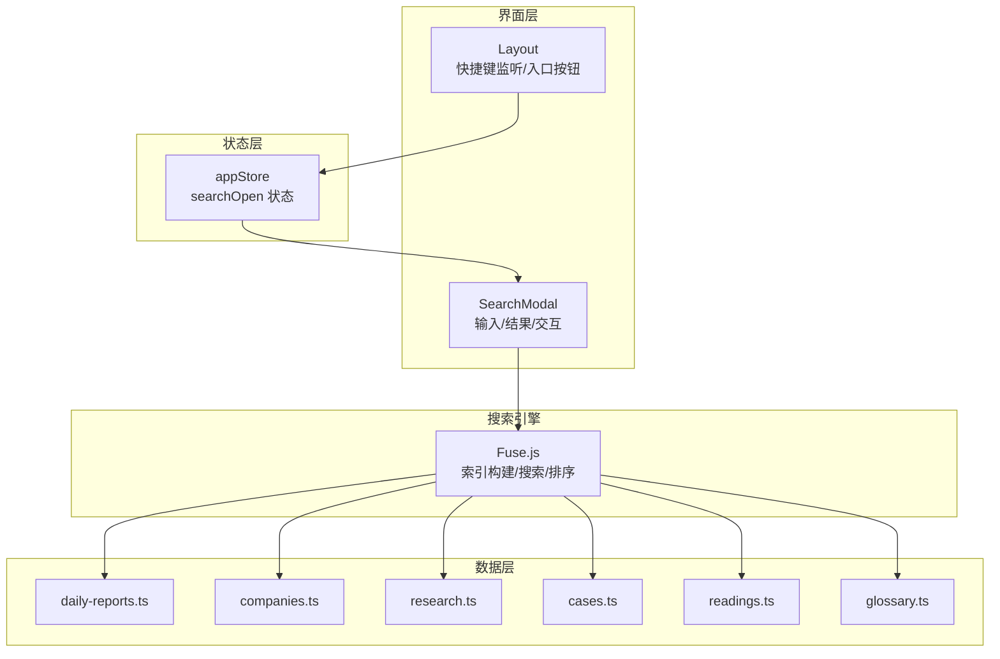
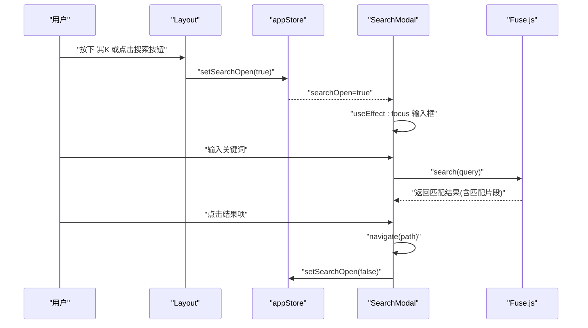
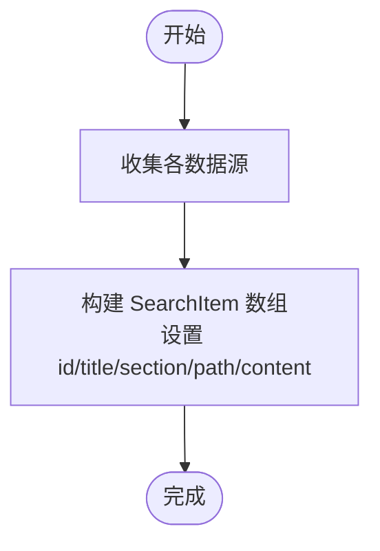
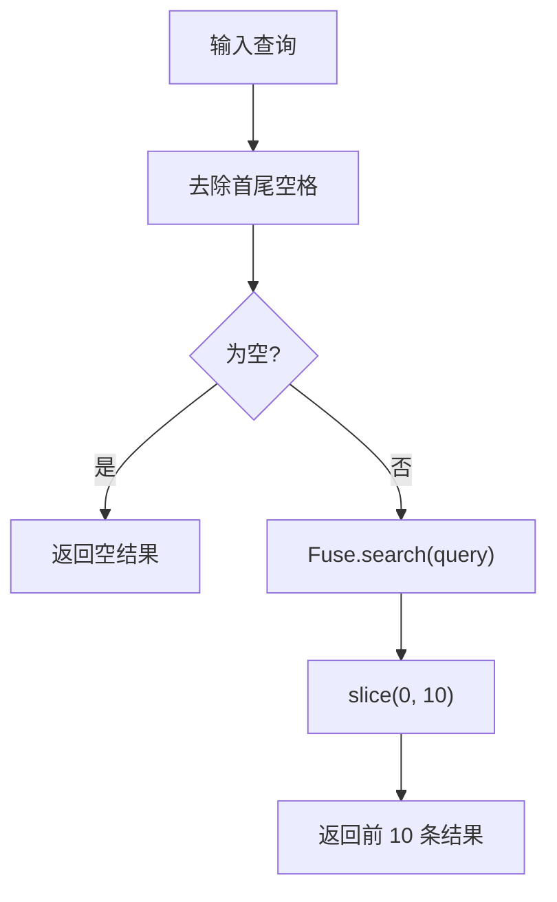
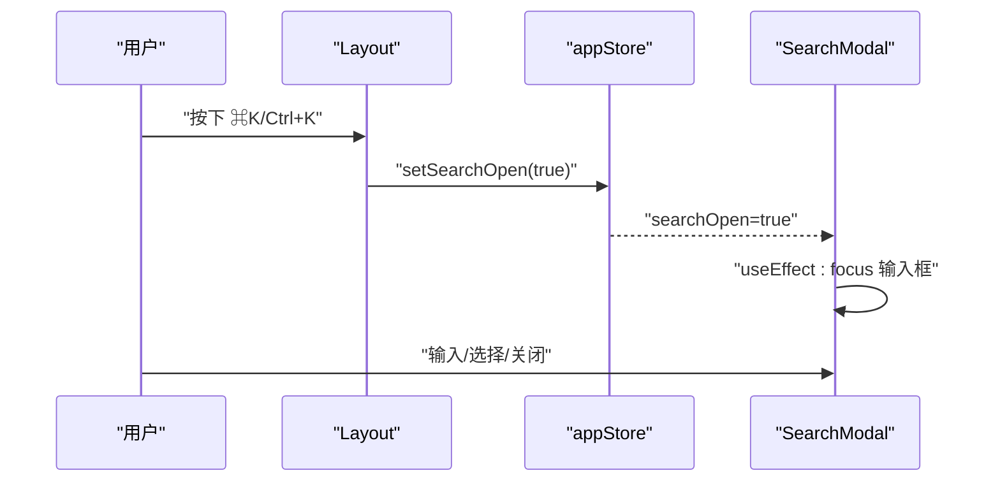
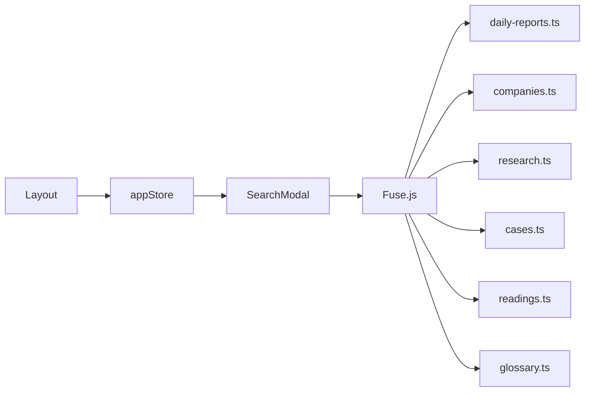

# 搜索系统

<cite>
**本文引用的文件**
- [src/components/SearchModal/index.tsx](file://src/components/SearchModal/index.tsx)
- [src/components/Layout/index.tsx](file://src/components/Layout/index.tsx)
- [src/stores/appStore.ts](file://src/stores/appStore.ts)
- [src/data/daily-reports.ts](file://src/data/daily-reports.ts)
- [src/data/companies.ts](file://src/data/companies.ts)
- [src/data/research.ts](file://src/data/research.ts)
- [src/data/cases.ts](file://src/data/cases.ts)
- [src/data/readings.ts](file://src/data/readings.ts)
- [src/data/glossary.ts](file://src/data/glossary.ts)
</cite>

## 目录
1. [简介](#简介)
2. [项目结构](#项目结构)
3. [核心组件](#核心组件)
4. [架构总览](#架构总览)
5. [详细组件分析](#详细组件分析)
6. [依赖关系分析](#依赖关系分析)
7. [性能考量](#性能考量)
8. [故障排查指南](#故障排查指南)
9. [结论](#结论)
10. [附录](#附录)

## 简介
本文件面向开发者与产品人员，系统化阐述本项目的搜索系统实现，重点围绕基于 Fuse.js 的全文搜索展开，涵盖搜索索引构建、搜索算法与排序机制、搜索范围配置、关键词匹配策略、模糊搜索处理、搜索模态框交互设计、快捷键支持（Cmd/Ctrl+K）、搜索历史管理现状与扩展建议、性能优化与缓存策略、搜索建议功能、搜索 API 使用方式、自定义搜索参数以及结果高亮展示等主题。文档力求在保证技术准确性的同时，兼顾非技术读者的理解成本。

## 项目结构
搜索系统由“布局触发 + 模态框 + 状态存储 + 数据源 + 搜索引擎”五部分组成：
- 布局层负责全局快捷键监听与入口按钮，统一打开/关闭搜索模态框状态
- 模态框承载输入、结果列表与交互行为
- 状态存储集中管理搜索状态（是否打开）
- 数据源来自各模块的数据文件，统一构建搜索索引
- 搜索引擎使用 Fuse.js，提供模糊匹配、权重排序与匹配片段返回

图表来源
- [src/components/Layout/index.tsx](file://src/components/Layout/index.tsx)
- [src/components/SearchModal/index.tsx](file://src/components/SearchModal/index.tsx)
- [src/stores/appStore.ts](file://src/stores/appStore.ts)
- [src/data/daily-reports.ts](file://src/data/daily-reports.ts)
- [src/data/companies.ts](file://src/data/companies.ts)
- [src/data/research.ts](file://src/data/research.ts)
- [src/data/cases.ts](file://src/data/cases.ts)
- [src/data/readings.ts](file://src/data/readings.ts)
- [src/data/glossary.ts](file://src/data/glossary.ts)

章节来源
- [src/components/Layout/index.tsx](file://src/components/Layout/index.tsx)
- [src/components/SearchModal/index.tsx](file://src/components/SearchModal/index.tsx)
- [src/stores/appStore.ts](file://src/stores/appStore.ts)

## 核心组件
- 搜索模态框（SearchModal）
  - 负责渲染搜索输入、结果列表、交互动作（打开/关闭/跳转）
  - 内置 Fuse.js 实例，构建索引并执行搜索
  - 结果截断与基础高亮片段展示
- 布局（Layout）
  - 提供 Cmd+K/Ctrl+K 快捷键打开搜索
  - 提供入口按钮，显示“⌘K”提示
- 状态存储（appStore）
  - 维护 searchOpen 状态，供全局共享
- 数据源
  - daily-reports、companies、research、cases、readings、glossary
  - 用于构建 Fuse.js 索引，字段包括标题、摘要、正文、定义等

章节来源
- [src/components/SearchModal/index.tsx](file://src/components/SearchModal/index.tsx)
- [src/components/Layout/index.tsx](file://src/components/Layout/index.tsx)
- [src/stores/appStore.ts](file://src/stores/appStore.ts)
- [src/data/daily-reports.ts](file://src/data/daily-reports.ts)
- [src/data/companies.ts](file://src/data/companies.ts)
- [src/data/research.ts](file://src/data/research.ts)
- [src/data/cases.ts](file://src/data/cases.ts)
- [src/data/readings.ts](file://src/data/readings.ts)
- [src/data/glossary.ts](file://src/data/glossary.ts)

## 架构总览
搜索系统采用“事件驱动 + 状态驱动”的轻量架构：
- 用户通过快捷键或入口按钮触发搜索状态变更
- 模态框根据状态渲染，并在打开时聚焦输入框
- 搜索结果由 Fuse.js 基于构建好的索引实时返回
- 点击结果项触发路由跳转并关闭模态框

图表来源
- [src/components/Layout/index.tsx](file://src/components/Layout/index.tsx)
- [src/stores/appStore.ts](file://src/stores/appStore.ts)
- [src/components/SearchModal/index.tsx](file://src/components/SearchModal/index.tsx)

## 详细组件分析

### 搜索索引构建
- 索引来源
  - 日报信号：标题、摘要、详情
  - 公司更新：标题、摘要
  - 研究论文：标题、摘要、HR影响
  - 转型案例：标题、摘要
  - 延伸阅读：标题、摘要、编辑笔记
  - HR 词典：术语、中文名、定义
- 索引字段
  - 标题（title）与内容（content）共同参与匹配
- 索引构建函数
  - 将上述数据扁平化为统一结构，形成 Fuse.js 可消费的数组

图表来源
- [src/components/SearchModal/index.tsx](file://src/components/SearchModal/index.tsx)
- [src/data/daily-reports.ts](file://src/data/daily-reports.ts)
- [src/data/companies.ts](file://src/data/companies.ts)
- [src/data/research.ts](file://src/data/research.ts)
- [src/data/cases.ts](file://src/data/cases.ts)
- [src/data/readings.ts](file://src/data/readings.ts)
- [src/data/glossary.ts](file://src/data/glossary.ts)

章节来源
- [src/components/SearchModal/index.tsx](file://src/components/SearchModal/index.tsx)
- [src/data/daily-reports.ts](file://src/data/daily-reports.ts)
- [src/data/companies.ts](file://src/data/companies.ts)
- [src/data/research.ts](file://src/data/research.ts)
- [src/data/cases.ts](file://src/data/cases.ts)
- [src/data/readings.ts](file://src/data/readings.ts)
- [src/data/glossary.ts](file://src/data/glossary.ts)

### 搜索算法与排序机制
- 匹配策略
  - keys: ["title", "content"] 表示标题与内容均参与匹配
  - threshold: 0.4 控制模糊匹配的宽松程度
  - includeMatches: true 返回匹配片段，便于前端展示高亮片段
- 结果截断
  - 默认只取前 10 条结果，避免结果过多造成滚动负担
- 排序依据
  - Fuse.js 默认按相关性分数排序，分数越高越靠前

图表来源
- [src/components/SearchModal/index.tsx](file://src/components/SearchModal/index.tsx)

章节来源
- [src/components/SearchModal/index.tsx](file://src/components/SearchModal/index.tsx)

### 搜索范围配置与关键词匹配策略
- 搜索范围
  - 当前实现覆盖：日报信号、公司与关键人、报告与研究、转型案例、延伸阅读、HR 词典
  - 可通过扩展数据源或修改索引构建函数来扩大范围
- 匹配策略
  - 标题优先：title 字段参与匹配，有助于标题命中优先展示
  - 内容补充：content 字段参与匹配，提升摘要/定义等文本的召回
  - 模糊匹配：threshold=0.4 支持拼写错误与近似匹配
- 结果高亮
  - 通过 includeMatches 获取匹配片段，前端截断展示，体现关键词所在上下文

章节来源
- [src/components/SearchModal/index.tsx](file://src/components/SearchModal/index.tsx)
- [src/data/daily-reports.ts](file://src/data/daily-reports.ts)
- [src/data/companies.ts](file://src/data/companies.ts)
- [src/data/research.ts](file://src/data/research.ts)
- [src/data/cases.ts](file://src/data/cases.ts)
- [src/data/readings.ts](file://src/data/readings.ts)
- [src/data/glossary.ts](file://src/data/glossary.ts)

### 模态框交互设计与快捷键支持
- 交互设计
  - 背景遮罩与动画入场，提升打开体验
  - 输入框自动聚焦，便于连续输入
  - 结果列表滚动容器，支持长列表浏览
  - 无结果时提示“没有匹配结果”，空查询时提示“输入关键词开始搜索”
- 快捷键支持
  - Cmd+K（macOS）或 Ctrl+K（Windows/Linux）快速打开搜索
  - 布局层统一注册键盘事件，调用状态存储切换搜索状态

图表来源
- [src/components/Layout/index.tsx](file://src/components/Layout/index.tsx)
- [src/stores/appStore.ts](file://src/stores/appStore.ts)
- [src/components/SearchModal/index.tsx](file://src/components/SearchModal/index.tsx)

章节来源
- [src/components/Layout/index.tsx](file://src/components/Layout/index.tsx)
- [src/components/SearchModal/index.tsx](file://src/components/SearchModal/index.tsx)
- [src/stores/appStore.ts](file://src/stores/appStore.ts)

### 搜索历史管理
- 现状
  - 代码中未实现搜索历史记录功能
- 建议扩展
  - 在 appStore 中新增搜索历史数组，每次搜索结束将 query 入栈
  - 提供清空历史、去重、限制长度等策略
  - 在模态框顶部展示最近搜索，支持点击回填

章节来源
- [src/stores/appStore.ts](file://src/stores/appStore.ts)
- [src/components/SearchModal/index.tsx](file://src/components/SearchModal/index.tsx)

### 搜索建议功能
- 现状
  - 未实现搜索建议（如热门词、自动补全）
- 建议扩展
  - 基于高频词统计或热门搜索词构建建议词库
  - 在输入过程中展示建议列表，支持键盘导航与回车确认
  - 可结合 Fuse.js 的模糊匹配进行动态过滤

章节来源
- [src/components/SearchModal/index.tsx](file://src/components/SearchModal/index.tsx)

### 搜索 API 使用方法与自定义参数
- 使用方式
  - 在组件内实例化 Fuse.js，传入索引数组与配置对象
  - 调用 search(query) 获取结果，必要时进行 slice 截断
- 自定义参数
  - keys：指定参与匹配的字段
  - threshold：调整模糊匹配的严格度
  - includeMatches：开启匹配片段返回
  - 可进一步引入分组权重、位置偏好、排除字段等高级选项

章节来源
- [src/components/SearchModal/index.tsx](file://src/components/SearchModal/index.tsx)

### 搜索结果高亮显示
- 实现方式
  - 通过 includeMatches 获取匹配片段
  - 前端对匹配片段进行截断展示，突出关键词所在上下文
- 展示要点
  - 结果项包含标题、来源分区标签与高亮片段
  - 片段长度限制，避免过长影响可读性

章节来源
- [src/components/SearchModal/index.tsx](file://src/components/SearchModal/index.tsx)

## 依赖关系分析
- 组件耦合
  - SearchModal 依赖 appStore 的搜索状态与路由导航
  - Layout 依赖 appStore 切换搜索状态，并监听全局快捷键
  - 数据源独立于搜索逻辑，通过索引构建函数注入 Fuse.js
- 外部依赖
  - Fuse.js：全文搜索与模糊匹配
  - Zustand：状态持久化与跨组件共享
  - Framer Motion：模态框动画
  - react-router：页面跳转

图表来源
- [src/components/Layout/index.tsx](file://src/components/Layout/index.tsx)
- [src/stores/appStore.ts](file://src/stores/appStore.ts)
- [src/components/SearchModal/index.tsx](file://src/components/SearchModal/index.tsx)
- [src/data/daily-reports.ts](file://src/data/daily-reports.ts)
- [src/data/companies.ts](file://src/data/companies.ts)
- [src/data/research.ts](file://src/data/research.ts)
- [src/data/cases.ts](file://src/data/cases.ts)
- [src/data/readings.ts](file://src/data/readings.ts)
- [src/data/glossary.ts](file://src/data/glossary.ts)

章节来源
- [src/components/Layout/index.tsx](file://src/components/Layout/index.tsx)
- [src/stores/appStore.ts](file://src/stores/appStore.ts)
- [src/components/SearchModal/index.tsx](file://src/components/SearchModal/index.tsx)

## 性能考量
- 索引构建时机
  - 当前在组件内构建索引，每次打开模态框都会重建
  - 建议将索引构建移出组件外，或在应用初始化时一次性构建并缓存
- 搜索开销
  - 对于中大型数据集，建议预构建索引并在内存中维护
  - 可考虑按需懒加载数据源，减少初始构建时间
- 结果截断
  - 已默认截取前 10 条，有助于控制渲染压力
- 动画与滚动
  - 模态框动画与滚动容器已合理使用，注意在移动端保持流畅
- 缓存策略建议
  - 将 Fuse 实例与索引持久化到内存，避免重复构建
  - 可引入本地存储（如 IndexedDB）缓存热点查询结果，降低重复搜索成本

[本节为通用性能指导，不直接分析特定文件]

## 故障排查指南
- 无法打开搜索
  - 检查快捷键组合是否正确（Cmd+K / Ctrl+K）
  - 确认 appStore 的 searchOpen 状态是否被正确切换
- 输入无结果
  - 检查索引构建是否包含目标数据
  - 调整 threshold 参数以放宽匹配
  - 确认 keys 是否包含目标字段
- 结果顺序不合理
  - 调整 keys 权重或引入自定义评分规则
- 性能问题
  - 将索引构建移到应用启动阶段
  - 对数据进行分页或分块加载
- 高亮片段缺失
  - 确认 includeMatches 已启用
  - 检查结果 matches 结构是否存在

章节来源
- [src/components/Layout/index.tsx](file://src/components/Layout/index.tsx)
- [src/stores/appStore.ts](file://src/stores/appStore.ts)
- [src/components/SearchModal/index.tsx](file://src/components/SearchModal/index.tsx)

## 结论
本搜索系统以 Fuse.js 为核心，实现了覆盖多数据源的全文检索，具备模糊匹配、结果排序与片段高亮等基本能力。通过快捷键与模态框交互提升了可用性。为进一步增强体验与性能，建议在应用启动阶段完成索引构建与缓存、扩展搜索历史与建议功能、引入更精细的权重与评分策略，并在移动端优化滚动与渲染表现。

[本节为总结性内容，不直接分析特定文件]

## 附录

### 开发者扩展与定制指南
- 扩展搜索范围
  - 在索引构建函数中加入新的数据源条目
  - 确保统一的 SearchItem 结构（id/title/section/path/content）
- 自定义匹配字段
  - 调整 keys 数组以改变匹配权重
  - 如需区分字段重要性，可引入 Fuse.js 的权重配置
- 自定义阈值与排序
  - 根据业务需求调整 threshold
  - 若需自定义排序，可在返回结果后追加二次排序逻辑
- 结果高亮与展示
  - 保持 includeMatches 开启以获得匹配片段
  - 在 UI 层对片段长度与样式进行统一规范
- 性能优化
  - 预构建索引并缓存
  - 对大数据源进行分片或增量更新
  - 在移动端禁用不必要的动画或降低动画强度
- 搜索历史与建议
  - 在 appStore 中新增历史数组与操作接口
  - 基于词频统计或热门搜索构建建议词库

章节来源
- [src/components/SearchModal/index.tsx](file://src/components/SearchModal/index.tsx)
- [src/stores/appStore.ts](file://src/stores/appStore.ts)