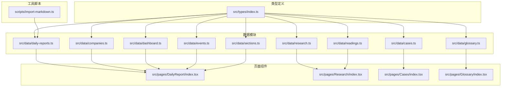
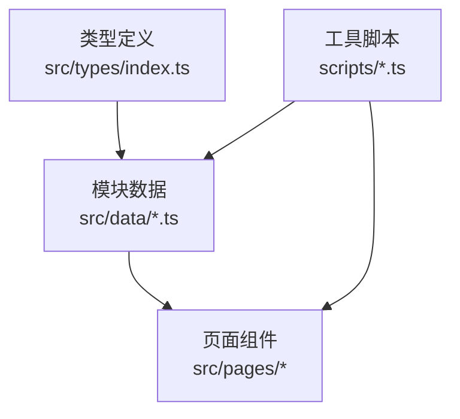
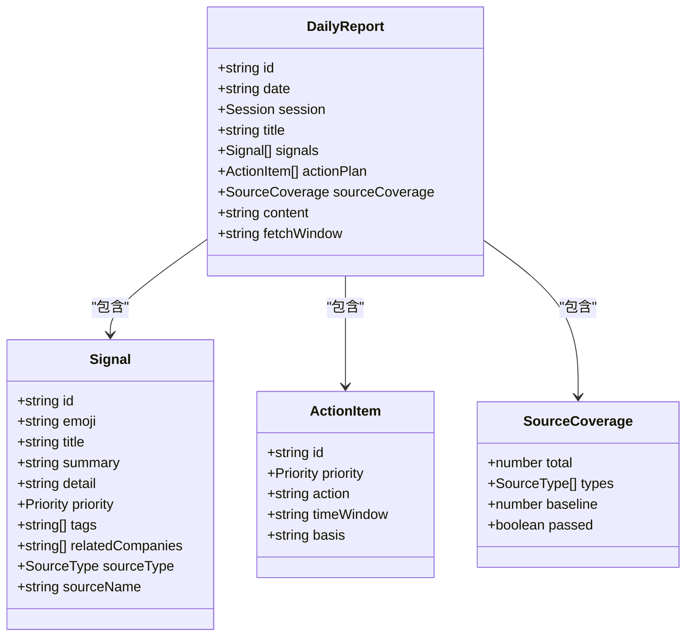
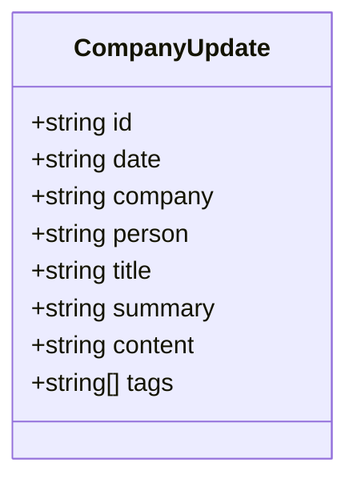
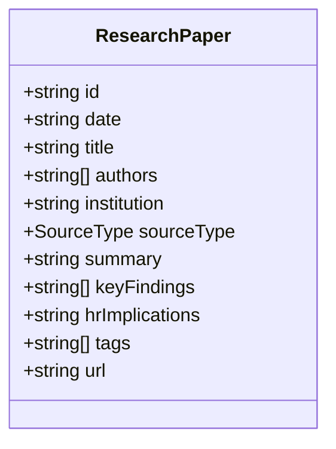
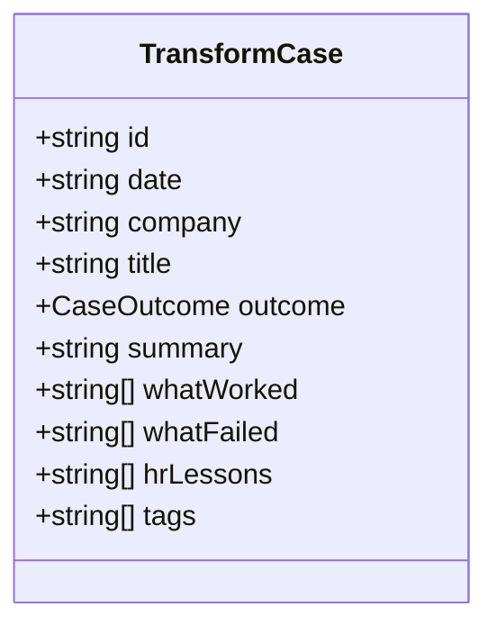
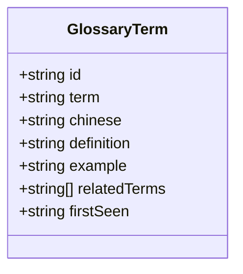
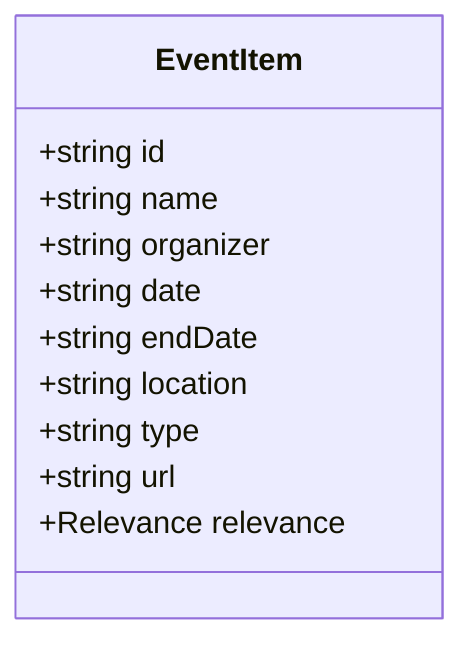
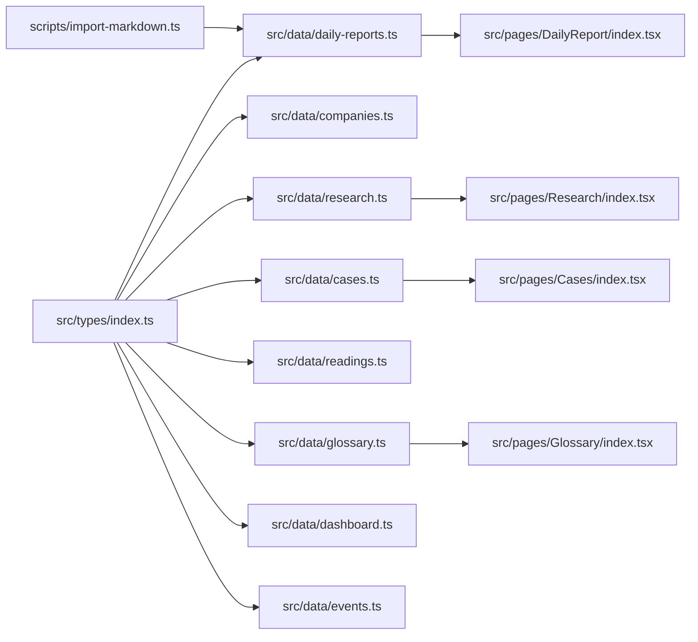
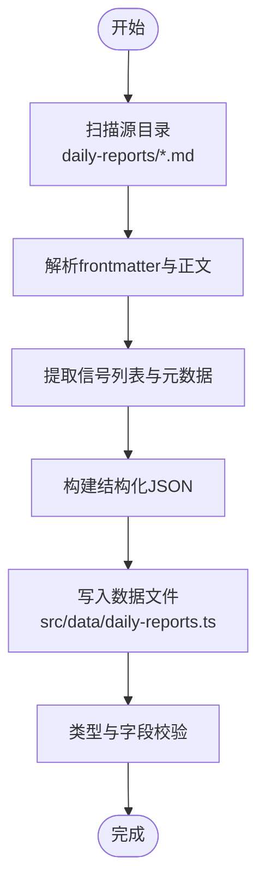

# 内容模块管理

<cite>
**本文引用的文件**
- [daily-reports.ts](file://src/data/daily-reports.ts)
- [companies.ts](file://src/data/companies.ts)
- [research.ts](file://src/data/research.ts)
- [cases.ts](file://src/data/cases.ts)
- [readings.ts](file://src/data/readings.ts)
- [glossary.ts](file://src/data/glossary.ts)
- [dashboard.ts](file://src/data/dashboard.ts)
- [events.ts](file://src/data/events.ts)
- [sections.ts](file://src/data/sections.ts)
- [index.ts](file://src/types/index.ts)
- [import-markdown.ts](file://scripts/import-markdown.ts)
- [DailyReport/index.tsx](file://src/pages/DailyReport/index.tsx)
- [Research/index.tsx](file://src/pages/Research/index.tsx)
- [Cases/index.tsx](file://src/pages/Cases/index.tsx)
- [Glossary/index.tsx](file://src/pages/Glossary/index.tsx)
</cite>

## 目录
1. [简介](#简介)
2. [项目结构](#项目结构)
3. [核心组件](#核心组件)
4. [架构总览](#架构总览)
5. [详细组件分析](#详细组件分析)
6. [依赖分析](#依赖分析)
7. [性能考量](#性能考量)
8. [故障排查指南](#故障排查指南)
9. [结论](#结论)
10. [附录](#附录)

## 简介
本文件系统化梳理“未来洞察”内容模块管理方案，覆盖每日日报、公司追踪、研究报告、转型案例、延伸阅读、HR词典、数据看板、行业议程等模块的数据结构、内容组织、来源与更新、分类与展示逻辑，并给出数据导入模板、批量处理流程、内容审核机制、新增内容类型步骤与数据迁移策略。

## 项目结构
- 数据层：各模块以独立TS文件存放静态数据，统一导出数组或对象，供页面组件消费。
- 类型层：集中定义数据结构与字段约束，确保模块间一致性。
- 页面层：各模块对应独立页面组件，负责筛选、排序、分页与展示。
- 工具层：提供Markdown导入脚本，将历史Markdown内容批量转换为结构化JSON。



**图表来源**
- [index.ts:1-212](file://src/types/index.ts#L1-L212)
- [daily-reports.ts:1-455](file://src/data/daily-reports.ts#L1-L455)
- [research.ts:1-56](file://src/data/research.ts#L1-L56)
- [cases.ts:1-63](file://src/data/cases.ts#L1-L63)
- [readings.ts:1-133](file://src/data/readings.ts#L1-L133)
- [glossary.ts:1-17](file://src/data/glossary.ts#L1-L17)
- [dashboard.ts:1-79](file://src/data/dashboard.ts#L1-L79)
- [events.ts:1-13](file://src/data/events.ts#L1-L13)
- [sections.ts:1-12](file://src/data/sections.ts#L1-L12)
- [DailyReport/index.tsx:1-249](file://src/pages/DailyReport/index.tsx#L1-L249)
- [Research/index.tsx:1-244](file://src/pages/Research/index.tsx#L1-L244)
- [Cases/index.tsx:1-96](file://src/pages/Cases/index.tsx#L1-L96)
- [Glossary/index.tsx:1-73](file://src/pages/Glossary/index.tsx#L1-L73)
- [import-markdown.ts:1-159](file://scripts/import-markdown.ts#L1-L159)

**章节来源**
- [index.ts:1-212](file://src/types/index.ts#L1-L212)
- [sections.ts:1-12](file://src/data/sections.ts#L1-L12)

## 核心组件
- 数据类型与来源类型：统一定义数据结构、来源类型枚举、优先级、会话类型等，保证模块间一致性与可扩展性。
- 模块数据：各模块以数组或对象形式存储，包含元数据、内容正文、标签、来源信息等。
- 页面组件：负责渲染、筛选、排序与交互，如日报页面的日历选择、信号卡片、行动速查；研究页面的研究论文与延伸阅读切换；案例页面的成功/失败/混合结果展示；词典页面的术语检索与示例展示。

**章节来源**
- [index.ts:1-212](file://src/types/index.ts#L1-L212)
- [daily-reports.ts:1-455](file://src/data/daily-reports.ts#L1-L455)
- [research.ts:1-56](file://src/data/research.ts#L1-L56)
- [cases.ts:1-63](file://src/data/cases.ts#L1-L63)
- [readings.ts:1-133](file://src/data/readings.ts#L1-L133)
- [glossary.ts:1-17](file://src/data/glossary.ts#L1-L17)
- [dashboard.ts:1-79](file://src/data/dashboard.ts#L1-L79)
- [events.ts:1-13](file://src/data/events.ts#L1-L13)
- [DailyReport/index.tsx:1-249](file://src/pages/DailyReport/index.tsx#L1-L249)
- [Research/index.tsx:1-244](file://src/pages/Research/index.tsx#L1-L244)
- [Cases/index.tsx:1-96](file://src/pages/Cases/index.tsx#L1-L96)
- [Glossary/index.tsx:1-73](file://src/pages/Glossary/index.tsx#L1-L73)

## 架构总览
系统采用“类型定义 + 静态数据 + 页面组件”的轻量架构。类型定义集中于src/types，各模块数据位于src/data，页面组件位于src/pages，工具脚本位于scripts。页面组件通过import引入数据，按需渲染。



**图表来源**
- [index.ts:1-212](file://src/types/index.ts#L1-L212)
- [daily-reports.ts:1-455](file://src/data/daily-reports.ts#L1-L455)
- [research.ts:1-56](file://src/data/research.ts#L1-L56)
- [cases.ts:1-63](file://src/data/cases.ts#L1-L63)
- [readings.ts:1-133](file://src/data/readings.ts#L1-L133)
- [glossary.ts:1-17](file://src/data/glossary.ts#L1-L17)
- [dashboard.ts:1-79](file://src/data/dashboard.ts#L1-L79)
- [events.ts:1-13](file://src/data/events.ts#L1-L13)
- [DailyReport/index.tsx:1-249](file://src/pages/DailyReport/index.tsx#L1-L249)
- [Research/index.tsx:1-244](file://src/pages/Research/index.tsx#L1-L244)
- [Cases/index.tsx:1-96](file://src/pages/Cases/index.tsx#L1-L96)
- [Glossary/index.tsx:1-73](file://src/pages/Glossary/index.tsx#L1-L73)
- [import-markdown.ts:1-159](file://scripts/import-markdown.ts#L1-L159)

## 详细组件分析

### 每日日报模块
- 数据结构
  - 会话类型：上午基线、PM精读、自动版、可视化。
  - 信号：包含id、emoji、标题、摘要、详情、优先级、标签、关联公司、来源类型与名称。
  - 行动速查：包含id、优先级、行动描述、时间窗、依据。
  - 来源覆盖：包含总数、覆盖类型集合、基线阈值与是否达标。
  - 其他：日期、id、标题、抓取窗口等。
- 内容组织
  - 按日期聚合，同日多会话版本（PM/自动/可视化/上午）。
  - 信号按来源类型与优先级组织，便于快速筛选。
- 展示逻辑
  - 日历选择器按日期过滤报告，按会话顺序排序。
  - 信号卡片展示标题、摘要、优先级徽章与来源信息。
  - 行动速查表格展示优先级、行动与时间窗。
- 更新频率
  - 日常更新，PM版通常在下午，自动/可视化版在上午。
- 数据来源
  - 多源基线：要求覆盖至少3类来源，5类为达标基线。
  - 反方信号：对强主张配对反方实证，避免单一视角偏见。
- 导入与迁移
  - 使用导入脚本将Markdown内容批量转换为结构化JSON，补充信号详情与标签。
- 审核机制
  - 建议：信号来源标注、优先级评审、反方信号校验、来源覆盖达标检查。



**图表来源**
- [index.ts:50-63](file://src/types/index.ts#L50-L63)
- [index.ts:20-31](file://src/types/index.ts#L20-L31)
- [index.ts:34-40](file://src/types/index.ts#L34-L40)
- [index.ts:43-48](file://src/types/index.ts#L43-L48)

**章节来源**
- [daily-reports.ts:1-455](file://src/data/daily-reports.ts#L1-L455)
- [index.ts:50-63](file://src/types/index.ts#L50-L63)
- [DailyReport/index.tsx:1-249](file://src/pages/DailyReport/index.tsx#L1-L249)
- [import-markdown.ts:79-130](file://scripts/import-markdown.ts#L79-L130)

### 公司追踪模块
- 数据结构
  - 公司更新：包含id、日期、公司、人物、标题、摘要、正文、标签。
- 内容组织
  - 按日期倒序排列，便于追踪最新动态。
- 展示逻辑
  - 标题、摘要与标签展示，支持按标签筛选。
- 更新频率
  - 按事件发生频率更新。
- 数据来源
  - 来自公司公告、高层言论、行业新闻等。



**图表来源**
- [index.ts:66-75](file://src/types/index.ts#L66-L75)

**章节来源**
- [companies.ts:1-53](file://src/data/companies.ts#L1-L53)
- [index.ts:66-75](file://src/types/index.ts#L66-L75)

### 研究报告模块
- 数据结构
  - 研究论文：包含id、日期、标题、作者、机构、来源类型、摘要、关键发现、HR启示、标签、URL。
- 内容组织
  - 按日期倒序排列，支持展开查看关键发现与HR启示。
- 展示逻辑
  - 研究论文与延伸阅读双Tab切换，来源类型颜色区分。
- 更新频率
  - 按研究发布频率更新。
- 数据来源
  - 学术、咨询、HR媒体、科技、智库、风投等多源。



**图表来源**
- [index.ts:78-90](file://src/types/index.ts#L78-L90)

**章节来源**
- [research.ts:1-56](file://src/data/research.ts#L1-L56)
- [Research/index.tsx:1-244](file://src/pages/Research/index.tsx#L1-L244)
- [index.ts:78-90](file://src/types/index.ts#L78-L90)

### 转型案例模块
- 数据结构
  - 转型案例：包含id、日期、公司、标题、结果（成功/失败/混合）、摘要、做了什么、做了什么、HR启示、标签。
- 内容组织
  - 结果以图标与颜色标识，左右分栏展示“做了什么/做了什么”。
- 展示逻辑
  - 成功/失败/混合结果以不同颜色与图标区分。
- 更新频率
  - 按案例收集频率更新。
- 数据来源
  - 来自真实企业实践与公开披露。



**图表来源**
- [index.ts:95-106](file://src/types/index.ts#L95-L106)

**章节来源**
- [cases.ts:1-63](file://src/data/cases.ts#L1-L63)
- [Cases/index.tsx:1-96](file://src/pages/Cases/index.tsx#L1-L96)
- [index.ts:95-106](file://src/types/index.ts#L95-L106)

### 延伸阅读模块
- 数据结构
  - 延伸阅读：包含id、日期、标题、原文标题、来源、来源类型、摘要、关键摘录、编辑导读、标签、URL。
- 内容组织
  - 关键摘录与编辑导读突出重点。
- 展示逻辑
  - 与研究报告双Tab切换，来源类型颜色区分。
- 更新频率
  - 按媒体发布频率更新。
- 数据来源
  - HR媒体、学术、咨询、科技、智库、风投等。

```mermaid
classDiagram
class Reading {
+string id
+string date
+string title
+string originalTitle
+string source
+SourceType sourceType
+string summary
+{text : string;context : string}[] keyExcerpts
+string editorNote
+string[] tags
+string url
}
```

**图表来源**
- [index.ts:109-121](file://src/types/index.ts#L109-L121)

**章节来源**
- [readings.ts:1-133](file://src/data/readings.ts#L1-L133)
- [Research/index.tsx:1-244](file://src/pages/Research/index.tsx#L1-L244)
- [index.ts:109-121](file://src/types/index.ts#L109-L121)

### HR词典模块
- 数据结构
  - 术语：包含id、术语、中文、定义、示例、关联术语、首次出现日期。
- 内容组织
  - 中英对照，示例与关联术语增强理解。
- 展示逻辑
  - 支持中英文检索，网格布局展示。
- 更新频率
  - 按术语新增频率更新。
- 数据来源
  - 内部术语沉淀与外部概念引入。



**图表来源**
- [index.ts:124-132](file://src/types/index.ts#L124-L132)

**章节来源**
- [glossary.ts:1-17](file://src/data/glossary.ts#L1-L17)
- [Glossary/index.tsx:1-73](file://src/pages/Glossary/index.tsx#L1-L73)
- [index.ts:124-132](file://src/types/index.ts#L124-L132)

### 数据看板模块
- 数据结构
  - KPI：包含id、标签、数值、单位、变化、变化标签、颜色、日期。
  - 趋势：包含标签与时间序列数据。
  - 明细表：包含id、标题、表情、列头、行数据与HR洞察。
- 内容组织
  - KPI、趋势与明细表三部分构成综合看板。
- 展示逻辑
  - KPI卡片展示关键指标与变化；趋势图表展示时间序列；明细表支持HR洞察。
- 更新频率
  - 按季度/月度更新。
- 数据来源
  - 多源统计与研究机构数据。

```mermaid
classDiagram
class DashboardSnapshot {
+string date
+KPIData[] kpis
+{label : string; data : {date : string; value : number}[]}[] trends
+DetailTable[] detailTables
}
class KPIData {
+string id
+string label
+number value
+string unit
+number change
+string changeLabel
+string color
+string date
}
class DetailTable {
+string id
+string title
+string emoji
+string[] columns
+DetailTableRow[] rows
+string hrInsight
}
class DetailTableRow {
+string indicator
+string value
+string yoyChange
+string source
+string impact
}
DashboardSnapshot --> KPIData : "包含"
DashboardSnapshot --> DetailTable : "包含"
DetailTable --> DetailTableRow : "包含"
```

**图表来源**
- [index.ts:135-168](file://src/types/index.ts#L135-L168)
- [index.ts:146-152](file://src/types/index.ts#L146-L152)
- [index.ts:163-168](file://src/types/index.ts#L163-L168)

**章节来源**
- [dashboard.ts:1-79](file://src/data/dashboard.ts#L1-L79)
- [index.ts:135-168](file://src/types/index.ts#L135-L168)

### 行业议程模块
- 数据结构
  - 事件：包含id、名称、主办方、开始/结束日期、地点、类型、URL、相关性。
- 内容组织
  - 按日期排序，高/中/低相关性标注。
- 展示逻辑
  - 事件列表展示，支持按类型与相关性筛选。
- 更新频率
  - 按日程发布频率更新。
- 数据来源
  - 行业会议、论坛、政府活动等。



**图表来源**
- [index.ts:171-181](file://src/types/index.ts#L171-L181)

**章节来源**
- [events.ts:1-13](file://src/data/events.ts#L1-L13)
- [index.ts:171-181](file://src/types/index.ts#L171-L181)

## 依赖分析
- 类型依赖：各模块数据严格遵循src/types中的接口定义，确保字段一致与可扩展。
- 页面依赖：页面组件通过import引入对应数据模块，形成单向依赖。
- 工具依赖：导入脚本依赖类型定义与Markdown格式约定，输出符合模块数据结构。



**图表来源**
- [index.ts:1-212](file://src/types/index.ts#L1-L212)
- [daily-reports.ts:1-455](file://src/data/daily-reports.ts#L1-L455)
- [research.ts:1-56](file://src/data/research.ts#L1-L56)
- [cases.ts:1-63](file://src/data/cases.ts#L1-L63)
- [readings.ts:1-133](file://src/data/readings.ts#L1-L133)
- [glossary.ts:1-17](file://src/data/glossary.ts#L1-L17)
- [dashboard.ts:1-79](file://src/data/dashboard.ts#L1-L79)
- [events.ts:1-13](file://src/data/events.ts#L1-L13)
- [DailyReport/index.tsx:1-249](file://src/pages/DailyReport/index.tsx#L1-L249)
- [Research/index.tsx:1-244](file://src/pages/Research/index.tsx#L1-L244)
- [Cases/index.tsx:1-96](file://src/pages/Cases/index.tsx#L1-L96)
- [Glossary/index.tsx:1-73](file://src/pages/Glossary/index.tsx#L1-L73)
- [import-markdown.ts:1-159](file://scripts/import-markdown.ts#L1-L159)

**章节来源**
- [index.ts:1-212](file://src/types/index.ts#L1-L212)
- [import-markdown.ts:1-159](file://scripts/import-markdown.ts#L1-L159)

## 性能考量
- 渲染性能：页面组件使用memo与动画库，按需渲染与延迟加载，减少重绘。
- 数据体积：静态数据集中于本地，建议按需拆分或懒加载，避免首屏过大。
- 查询性能：词典与研究模块支持前端检索，建议限制结果数量或添加分页。
- 导入性能：批量导入脚本一次性写入，建议在CI中执行并缓存构建产物。

## 故障排查指南
- 数据缺失
  - 症状：页面空白或部分模块无数据。
  - 排查：检查对应数据文件是否存在、导出格式是否正确、类型定义是否匹配。
- 类型不匹配
  - 症状：TypeScript编译错误或运行时报错。
  - 排查：核对src/types中的接口定义与数据文件字段是否一致。
- 导入失败
  - 症状：导入脚本报错或生成文件为空。
  - 排查：确认源目录存在、Markdown文件格式正确、frontmatter键值合法。
- 展示异常
  - 症状：信号卡片、行动速查、标签颜色异常。
  - 排查：检查页面组件中颜色映射与优先级/来源类型映射逻辑。

**章节来源**
- [import-markdown.ts:1-159](file://scripts/import-markdown.ts#L1-L159)
- [DailyReport/index.tsx:1-249](file://src/pages/DailyReport/index.tsx#L1-L249)
- [Research/index.tsx:1-244](file://src/pages/Research/index.tsx#L1-L244)
- [Cases/index.tsx:1-96](file://src/pages/Cases/index.tsx#L1-L96)
- [Glossary/index.tsx:1-73](file://src/pages/Glossary/index.tsx#L1-L73)

## 结论
本系统通过统一类型定义与模块化数据结构，实现了内容模块的标准化管理与高效展示。建议在保持现有结构的基础上，完善内容审核流程、扩展标签体系与来源类型、优化导入与校验工具，并逐步引入增量更新与版本控制机制，以支撑更大规模的内容生态。

## 附录

### 数据导入模板与批量处理流程
- 模板字段
  - frontmatter：日期、标题、会话类型（pm/auto/visual/am）。
  - 正文：信号列表（编号+表情+标题+摘要），自动版可省略详情。
- 批量处理
  - 使用导入脚本扫描指定目录，解析frontmatter与正文，生成结构化JSON并写入对应数据文件。
  - 导入完成后，建议在页面中核对信号详情、标签与来源覆盖情况。



**图表来源**
- [import-markdown.ts:1-159](file://scripts/import-markdown.ts#L1-L159)

**章节来源**
- [import-markdown.ts:1-159](file://scripts/import-markdown.ts#L1-L159)

### 内容审核机制
- 来源覆盖：每份报告必须覆盖≥3类来源，5类为达标基线。
- 反方信号：对强主张配对反方实证，避免单一视角偏见。
- 优先级评审：根据影响范围与时效性确定高/中/低优先级。
- 标签规范：统一标签命名与分类，便于检索与聚合。
- 版本与追溯：记录首次出现日期与修改历史，便于溯源。

**章节来源**
- [daily-reports.ts:1-455](file://src/data/daily-reports.ts#L1-L455)
- [glossary.ts:1-17](file://src/data/glossary.ts#L1-L17)

### 新增内容类型的步骤指南
- 定义类型：在类型文件中新增接口与枚举，确保字段完备。
- 数据文件：创建对应数据文件，按现有格式填充字段。
- 页面组件：在相应页面组件中引入数据并实现渲染逻辑。
- 导入脚本：如需批量导入，扩展脚本以适配新格式。
- 审核与发布：执行审核流程并通过CI验证。

**章节来源**
- [index.ts:1-212](file://src/types/index.ts#L1-L212)
- [import-markdown.ts:1-159](file://scripts/import-markdown.ts#L1-L159)

### 数据迁移策略
- 渐进迁移：先在分支中引入新类型与数据文件，逐步替换旧数据。
- 兼容过渡：保留旧字段并在新字段可用时回填，避免中断。
- 自动化校验：在CI中加入类型与字段校验，防止回归。
- 回滚预案：保留旧版本备份，必要时快速回滚。

**章节来源**
- [index.ts:1-212](file://src/types/index.ts#L1-L212)
- [import-markdown.ts:1-159](file://scripts/import-markdown.ts#L1-L159)