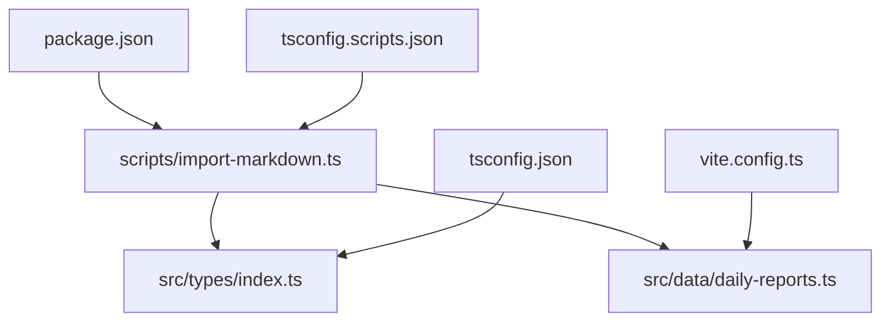
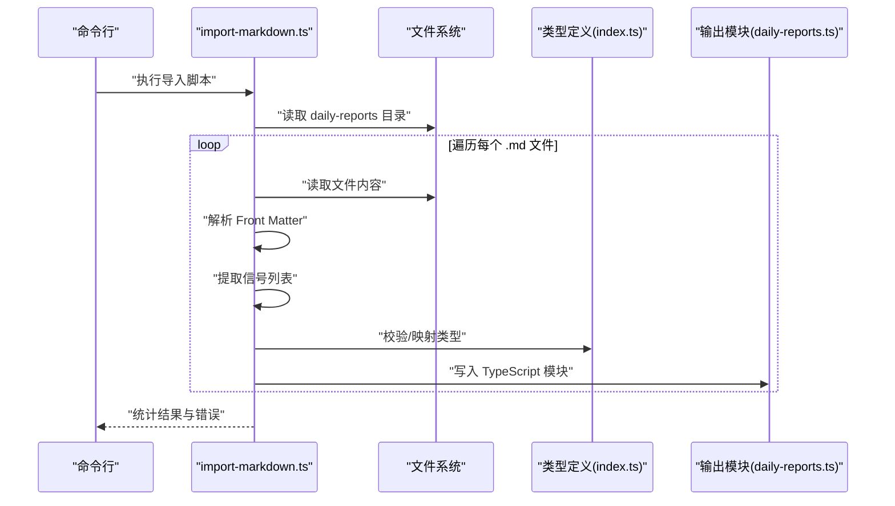
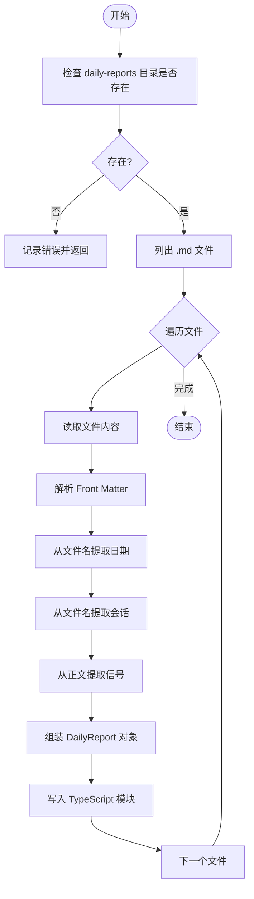
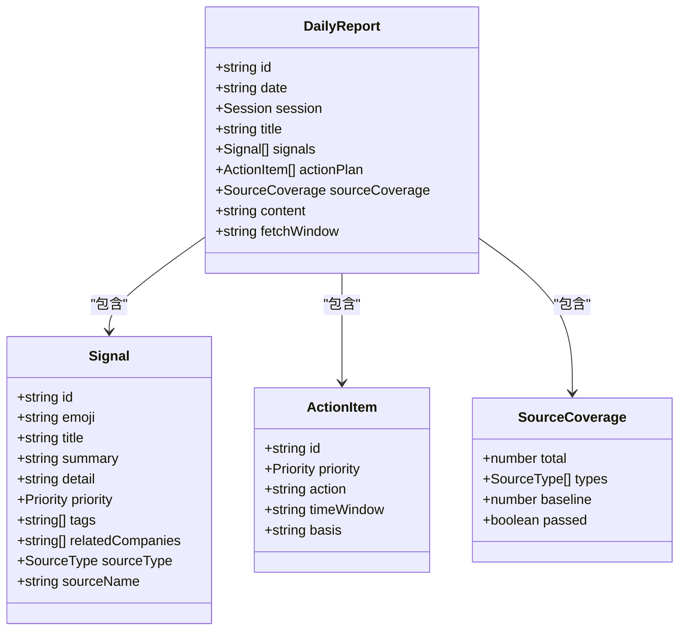
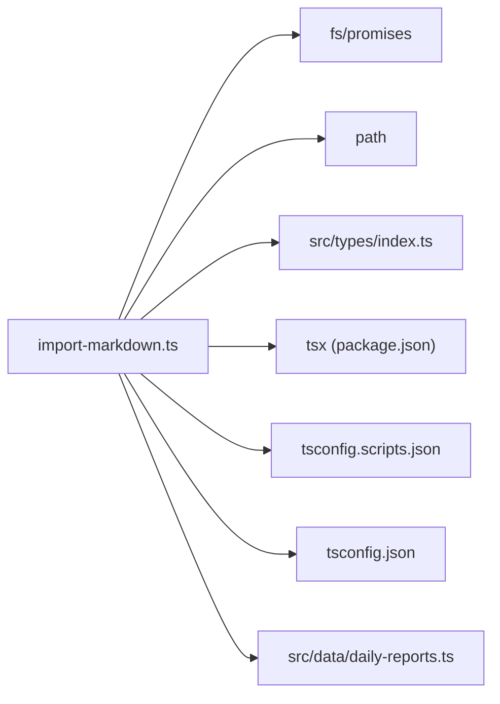

# 数据导入系统

<cite>
**本文引用的文件**
- [import-markdown.ts](file://scripts/import-markdown.ts)
- [package.json](file://package.json)
- [tsconfig.scripts.json](file://tsconfig.scripts.json)
- [tsconfig.json](file://tsconfig.json)
- [vite.config.ts](file://vite.config.ts)
- [index.ts](file://src/types/index.ts)
- [daily-reports.ts](file://src/data/daily-reports.ts)
- [cases.ts](file://src/data/cases.ts)
- [companies.ts](file://src/data/companies.ts)
- [research.ts](file://src/data/research.ts)
- [readings.ts](file://src/data/readings.ts)
- [events.ts](file://src/data/events.ts)
- [glossary.ts](file://src/data/glossary.ts)
- [dashboard.ts](file://src/data/dashboard.ts)
</cite>

## 目录
1. [简介](#简介)
2. [项目结构](#项目结构)
3. [核心组件](#核心组件)
4. [架构总览](#架构总览)
5. [详细组件分析](#详细组件分析)
6. [依赖关系分析](#依赖关系分析)
7. [性能考量](#性能考量)
8. [故障排查指南](#故障排查指南)
9. [结论](#结论)
10. [附录](#附录)

## 简介
本文件系统性阐述“从Markdown到JSON”的数据导入系统，重点围绕 import-markdown.ts 脚本展开，覆盖以下主题：
- 脚本工作原理与使用方式
- Markdown 文件格式规范、元数据结构与内容标记规则
- 批量导入流程、错误处理与数据验证策略
- 最佳实践、性能优化建议与故障排查
- Git 版本控制中的数据管理策略

该系统旨在将历史 Markdown 文档（特别是“每日日报”）解析为结构化的 TypeScript 模块，供前端应用直接消费。

## 项目结构
与数据导入直接相关的目录与文件如下：
- scripts/import-markdown.ts：主导入脚本
- src/types/index.ts：统一的数据类型定义（Signal、DailyReport 等）
- src/data/*.ts：现有数据模块（用于对照与集成）
- package.json：提供脚本入口与运行环境
- tsconfig.*.json：脚本与应用的编译配置
- vite.config.ts：开发服务器与构建配置

图表来源
- [import-markdown.ts:1-159](file://scripts/import-markdown.ts#L1-L159)
- [index.ts:1-212](file://src/types/index.ts#L1-L212)
- [daily-reports.ts:205-366](file://src/data/daily-reports.ts#L205-L366)
- [package.json:1-36](file://package.json#L1-L36)
- [tsconfig.scripts.json:1-12](file://tsconfig.scripts.json#L1-L12)
- [tsconfig.json:1-25](file://tsconfig.json#L1-L25)
- [vite.config.ts:1-21](file://vite.config.ts#L1-L21)

章节来源
- [import-markdown.ts:1-159](file://scripts/import-markdown.ts#L1-L159)
- [package.json:1-36](file://package.json#L1-L36)
- [tsconfig.scripts.json:1-12](file://tsconfig.scripts.json#L1-L12)
- [tsconfig.json:1-25](file://tsconfig.json#L1-L25)
- [vite.config.ts:1-21](file://vite.config.ts#L1-L21)

## 核心组件
- 导入脚本：负责扫描 Markdown 目录、解析 Front Matter、提取信号、生成结构化数据并写入 TypeScript 模块。
- 类型系统：统一定义 Signal、DailyReport、ActionItem、SourceCoverage 等核心数据结构。
- 现有数据模块：作为导入产物的参考与集成目标，便于对比与验证。

章节来源
- [import-markdown.ts:12-16](file://scripts/import-markdown.ts#L12-L16)
- [index.ts:17-63](file://src/types/index.ts#L17-L63)

## 架构总览
导入流程从命令行启动，读取源目录下的 Markdown 文件，解析元数据与正文，抽取信号列表，最终生成 TypeScript 模块并写入目标目录。类型系统贯穿始终，保证数据结构一致性。

图表来源
- [import-markdown.ts:79-130](file://scripts/import-markdown.ts#L79-L130)
- [index.ts:50-63](file://src/types/index.ts#L50-L63)
- [daily-reports.ts:205-366](file://src/data/daily-reports.ts#L205-L366)

## 详细组件分析

### 导入脚本（import-markdown.ts）
- 功能职责
  - 扫描指定源目录下的 Markdown 文件（默认 ../org-future-insights/daily-reports）
  - 解析 Front Matter（键值对形式）
  - 从文件名提取日期与会话（am/pm/auto/visual）
  - 从正文提取信号列表（含表情、标题、摘要与优先级）
  - 生成结构化对象数组，并写入 TypeScript 模块（默认 ./src/data）

- 关键函数与逻辑
  - Front Matter 解析：匹配三短横线包裹的元数据块，拆分为键值对。
  - 信号提取：基于编号列表与特定表情符号的模式匹配，收集后续段落作为摘要。
  - 文件名解析：日期正则与关键词判断（-pm/-auto/-visual）。
  - 结果写入：将数组序列化为 TypeScript 模块导出语句并写入文件。

- 使用方式
  - 通过 npm 脚本或直接运行 tsx 执行，支持传入源目录与输出目录参数。
  - 默认源目录指向 ../org-future-insights，输出目录为 ./src/data。

- 错误处理
  - 目录不存在时记录错误。
  - 单个文件解析失败时记录错误并继续处理其他文件。
  - 统计导入总数、成功数与错误数。

- 数据验证策略
  - 基于类型定义进行字段完整性约束（如 id、date、session、signals 等）。
  - 信号优先级根据表情符号映射（高/中/低）。
  - 会话类型限定为 am/pm/auto/visual。

图表来源
- [import-markdown.ts:79-130](file://scripts/import-markdown.ts#L79-L130)

章节来源
- [import-markdown.ts:1-159](file://scripts/import-markdown.ts#L1-L159)
- [package.json:10](file://package.json#L10)

### Markdown 文件格式规范
- Front Matter
  - 使用三短横线包裹的键值对块，键与值之间以冒号分隔，支持字符串引号去除。
  - 常用键包括 title、date 等，用于生成报告标题与日期。
- 正文信号标记
  - 使用带编号的列表，标题前缀表情符号用于识别信号类型。
  - 摘要由标题行之后的若干段落组成，最多收集有限数量的段落。
- 文件命名约定
  - 日期：文件名中包含 YYYY-MM-DD。
  - 会话：包含 -pm/-auto/-visual 等关键词以区分 am/pm/auto/visual。

章节来源
- [import-markdown.ts:18-31](file://scripts/import-markdown.ts#L18-L31)
- [import-markdown.ts:33-63](file://scripts/import-markdown.ts#L33-L63)
- [import-markdown.ts:65-77](file://scripts/import-markdown.ts#L65-L77)

### 数据模型与类型系统
- Signal（信号）
  - 字段：id、emoji、title、summary、detail、priority、tags、relatedCompanies、sourceType、sourceName
  - 优先级：high/medium/low
- ActionItem（行动项）
  - 字段：id、priority、action、timeWindow、basis
- SourceCoverage（来源覆盖）
  - 字段：total、types、baseline、passed
- DailyReport（每日日报）
  - 字段：id、date、session、title、signals、actionPlan、sourceCoverage、content、fetchWindow（可选）
  - 会话类型：am/pm/auto/visual

图表来源
- [index.ts:17-63](file://src/types/index.ts#L17-L63)

章节来源
- [index.ts:1-212](file://src/types/index.ts#L1-L212)

### 批量导入流程与产物
- 输入：源目录下的 .md 文件集合
- 处理：逐文件解析、提取、组装
- 输出：src/data/daily-reports.ts（TypeScript 模块，导出数组）
- 产物结构：与 DailyReport 类型一致，包含 signals、actionPlan、sourceCoverage 等字段

章节来源
- [import-markdown.ts:79-130](file://scripts/import-markdown.ts#L79-L130)
- [daily-reports.ts:205-366](file://src/data/daily-reports.ts#L205-L366)

## 依赖关系分析
- 脚本依赖
  - Node 内置 fs/promises、path 模块进行文件读写与路径拼接
  - tsx 作为运行时执行器（package.json 中提供脚本）
  - TypeScript 编译配置（tsconfig.scripts.json 与 tsconfig.json）
- 类型依赖
  - src/types/index.ts 提供 Signal、DailyReport 等类型定义
- 运行时依赖
  - Vite 开发服务器与构建配置（vite.config.ts）与导入流程解耦

图表来源
- [import-markdown.ts:8-10](file://scripts/import-markdown.ts#L8-L10)
- [package.json:10](file://package.json#L10)
- [tsconfig.scripts.json:1-12](file://tsconfig.scripts.json#L1-L12)
- [tsconfig.json:1-25](file://tsconfig.json#L1-L25)

章节来源
- [import-markdown.ts:1-159](file://scripts/import-markdown.ts#L1-L159)
- [package.json:1-36](file://package.json#L1-L36)
- [tsconfig.scripts.json:1-12](file://tsconfig.scripts.json#L1-L12)
- [tsconfig.json:1-25](file://tsconfig.json#L1-L25)

## 性能考量
- I/O 优化
  - 顺序读取与串行处理，适合中小规模批量导入；若数据量较大，可考虑并发限制与进度反馈。
- 正则与字符串处理
  - Front Matter 与信号提取使用正则匹配，建议保持模式简洁，避免回溯开销。
- 类型序列化
  - 写入前进行 JSON 序列化与格式化，注意大数组的内存占用与序列化时间。
- 构建与运行
  - 使用 tsx 直接运行脚本，避免额外打包开销；生产构建与导入流程分离。

## 故障排查指南
- 目录不存在
  - 现象：导入立即记录错误并返回
  - 处理：确认源目录路径正确，或在脚本执行前创建目录
- 文件解析失败
  - 现象：单个文件错误被记录，不影响其他文件
  - 处理：检查该文件的 Front Matter 格式、信号标记是否符合规范
- 类型不匹配
  - 现象：TypeScript 编译时报错
  - 处理：核对生成模块的字段与 src/types/index.ts 定义是否一致
- 输出目录权限
  - 现象：无法写入输出文件
  - 处理：确保输出目录存在且具备写权限
- 前端引用路径
  - 现象：导入后页面无法引用数据
  - 处理：确认 Vite 别名与路径映射配置（@ 指向 src），并重启开发服务器

章节来源
- [import-markdown.ts:83-86](file://scripts/import-markdown.ts#L83-L86)
- [import-markdown.ts:120-122](file://scripts/import-markdown.ts#L120-L122)
- [vite.config.ts:7-11](file://vite.config.ts#L7-L11)

## 结论
该数据导入系统以 import-markdown.ts 为核心，通过严格的 Markdown 格式规范与类型驱动的结构化输出，实现了从历史文档到前端可用数据的高效转换。结合类型系统与现有数据模块，可快速验证与集成导入结果。建议在团队内明确 Markdown 编写规范与导入流程，配合 Git 管理策略，确保数据质量与可追溯性。

## 附录

### 使用示例与最佳实践
- 使用 npm 脚本一键导入
  - 在项目根目录执行：npm run import-data
- 自定义源目录与输出目录
  - 通过命令行参数传入：npx tsx scripts/import-markdown.ts [source-dir] [output-dir]
- 编写规范
  - Front Matter 使用三短横线包裹，键值对分行书写
  - 信号列表使用编号列表，标题前添加表情符号
  - 文件名包含日期与会话标识
- 集成与验证
  - 导入完成后，检查 src/data/daily-reports.ts 是否可被应用正常引用
  - 对照 src/data/daily-reports.ts 的结构与类型定义，补齐 detail/tags/relatedCompanies 等字段

章节来源
- [package.json:10](file://package.json#L10)
- [import-markdown.ts:5-6](file://scripts/import-markdown.ts#L5-L6)
- [import-markdown.ts:18-31](file://scripts/import-markdown.ts#L18-L31)
- [import-markdown.ts:33-63](file://scripts/import-markdown.ts#L33-L63)
- [import-markdown.ts:65-77](file://scripts/import-markdown.ts#L65-L77)

### Git 版本控制中的数据管理策略
- 分离数据与代码
  - 将导入脚本与类型定义保留在代码仓库，导入生成的数据模块可选择纳入版本控制或忽略，视团队策略而定
- 提交粒度
  - 导入脚本变更与数据变更分开提交，便于回滚与审计
- 冲突解决
  - 当多人维护同一数据源时，建议集中在一个分支进行导入，再合并到主干
- 自动化
  - 可在 CI 中加入导入与类型检查步骤，确保每次变更均通过类型校验

[本节为通用实践建议，无需文件引用]