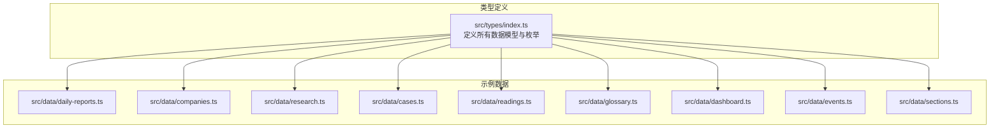
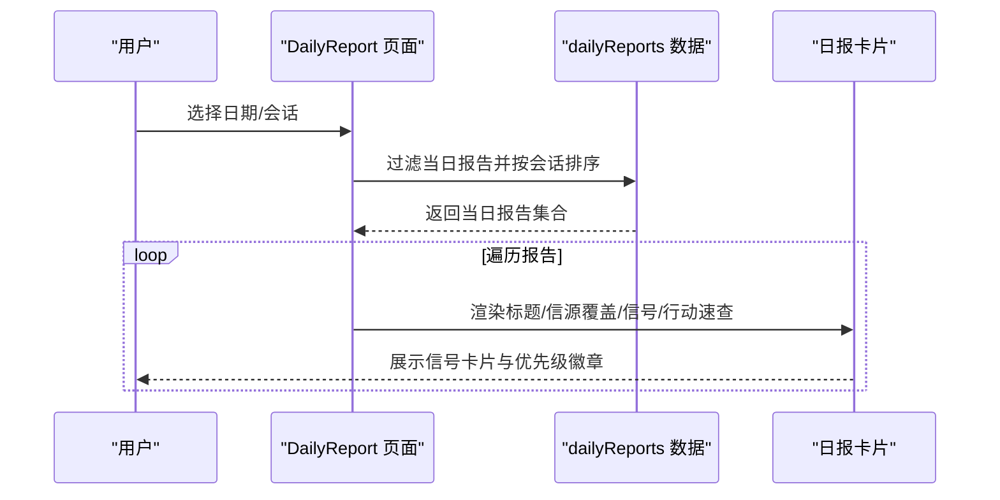
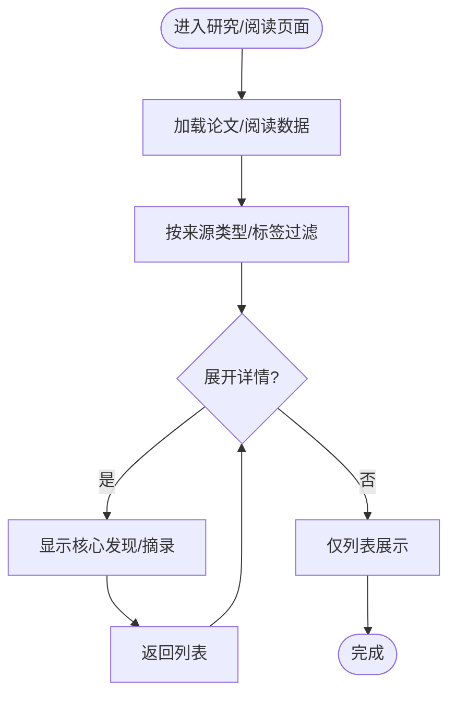
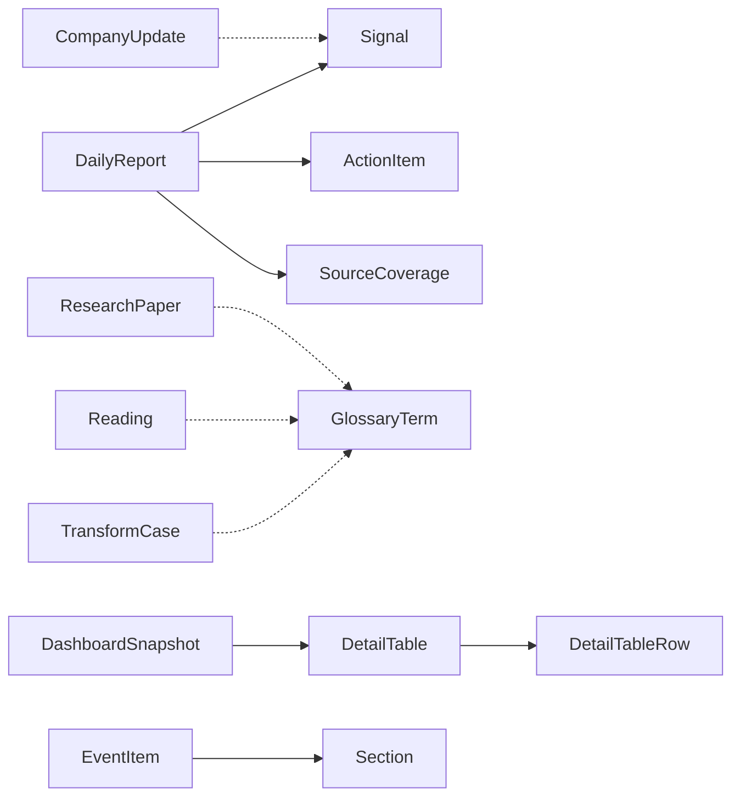

# 数据模型定义

<cite>
**本文引用的文件**
- [src/types/index.ts](file://src/types/index.ts)
- [src/data/daily-reports.ts](file://src/data/daily-reports.ts)
- [src/data/companies.ts](file://src/data/companies.ts)
- [src/data/research.ts](file://src/data/research.ts)
- [src/data/cases.ts](file://src/data/cases.ts)
- [src/data/readings.ts](file://src/data/readings.ts)
- [src/data/glossary.ts](file://src/data/glossary.ts)
- [src/data/dashboard.ts](file://src/data/dashboard.ts)
- [src/data/events.ts](file://src/data/events.ts)
- [src/data/sections.ts](file://src/data/sections.ts)
- [src/pages/DailyReport/index.tsx](file://src/pages/DailyReport/index.tsx)
- [src/pages/Research/index.tsx](file://src/pages/Research/index.tsx)
- [src/pages/Cases/index.tsx](file://src/pages/Cases/index.tsx)
</cite>

## 目录
1. [引言](#引言)
2. [项目结构](#项目结构)
3. [核心数据模型](#核心数据模型)
4. [架构总览](#架构总览)
5. [详细组件分析](#详细组件分析)
6. [依赖分析](#依赖分析)
7. [性能考量](#性能考量)
8. [故障排查指南](#故障排查指南)
9. [结论](#结论)
10. [附录](#附录)

## 引言
本文件系统化梳理“未来组织·HR洞察日报”完整数据类型体系，覆盖 Signal、DailyReport、CompanyUpdate、ResearchPaper、CaseStudy（TransformCase）、Reading、GlossaryTerm、DashboardData（DashboardSnapshot/KPI/DetailTable）、Event、Section 等核心模型。文档从字段定义、数据类型、约束条件、业务规则出发，解释模型间的关系映射、继承结构与组合模式，并给出数据验证规则、默认值设置与字段说明，辅以实际数据示例与最佳实践。

## 项目结构
数据模型主要分布在两类位置：
- 类型定义：src/types/index.ts，集中声明所有接口与枚举类型
- 示例数据：src/data/*.ts，提供各模型的真实样例，便于理解字段含义与取值范围



图表来源
- [src/types/index.ts:1-212](file://src/types/index.ts#L1-L212)
- [src/data/daily-reports.ts:1-455](file://src/data/daily-reports.ts#L1-L455)
- [src/data/companies.ts:1-53](file://src/data/companies.ts#L1-L53)
- [src/data/research.ts:1-53](file://src/data/research.ts#L1-L53)
- [src/data/cases.ts:1-63](file://src/data/cases.ts#L1-L63)
- [src/data/readings.ts:1-33](file://src/data/readings.ts#L1-L33)
- [src/data/glossary.ts:1-17](file://src/data/glossary.ts#L1-L17)
- [src/data/dashboard.ts:1-79](file://src/data/dashboard.ts#L1-L79)
- [src/data/events.ts:1-13](file://src/data/events.ts#L1-L13)
- [src/data/sections.ts:1-13](file://src/data/sections.ts#L1-L13)

章节来源
- [src/types/index.ts:1-212](file://src/types/index.ts#L1-L212)
- [src/data/daily-reports.ts:1-455](file://src/data/daily-reports.ts#L1-L455)
- [src/data/companies.ts:1-53](file://src/data/companies.ts#L1-L53)
- [src/data/research.ts:1-53](file://src/data/research.ts#L1-L53)
- [src/data/cases.ts:1-63](file://src/data/cases.ts#L1-L63)
- [src/data/readings.ts:1-33](file://src/data/readings.ts#L1-L33)
- [src/data/glossary.ts:1-17](file://src/data/glossary.ts#L1-L17)
- [src/data/dashboard.ts:1-79](file://src/data/dashboard.ts#L1-L79)
- [src/data/events.ts:1-13](file://src/data/events.ts#L1-L13)
- [src/data/sections.ts:1-13](file://src/data/sections.ts#L1-L13)

## 核心数据模型
以下按模型维度逐一说明字段、类型、约束与业务规则，并标注来自类型定义或示例数据的证据。

- Signal（信号）
  - 字段与类型
    - id: string（唯一标识）
    - emoji: string（可选表情图标）
    - title: string（标题）
    - summary: string（摘要）
    - detail: string（详情）
    - priority: 枚举 'high' | 'medium' | 'low'
    - tags: string[]（标签数组）
    - relatedCompanies: string[]（关联公司名列表）
    - sourceType: 枚举 SourceType（来源类型）
    - sourceName: string（来源名称）
  - 约束与规则
    - priority 用于驱动优先级展示与排序
    - relatedCompanies 为空数组时可视为无特定关联
    - sourceType 与 sourceName 用于信源溯源与覆盖统计
  - 示例证据
    - 类型定义：[src/types/index.ts:20-31](file://src/types/index.ts#L20-L31)
    - 示例数据：[src/data/daily-reports.ts:12-15](file://src/data/daily-reports.ts#L12-L15)

- DailyReport（每日日报）
  - 字段与类型
    - id: string（唯一标识，形如 YYYY-MM-DD-{session}）
    - date: string（YYYY-MM-DD）
    - session: 枚举 'am' | 'pm' | 'auto' | 'visual'
    - title: string（标题）
    - signals: Signal[]（核心信号集合）
    - actionPlan: ActionItem[]（行动速查清单）
    - sourceCoverage: SourceCoverage（来源覆盖统计）
    - content: string（正文内容，示例中常为空）
    - fetchWindow?: string（抓取时间段，可选）
  - 约束与规则
    - signals 与 actionPlan 为空数组时可视为“纯可视化/自动版”
    - session 决定页面展示顺序与分组
    - sourceCoverage.passed 用于判定是否达标
  - 示例证据
    - 类型定义：[src/types/index.ts:53-63](file://src/types/index.ts#L53-L63)
    - 示例数据：[src/data/daily-reports.ts:5-21](file://src/data/daily-reports.ts#L5-L21)

- CompanyUpdate（公司动态）
  - 字段与类型
    - id: string（唯一标识）
    - date: string（YYYY-MM-DD）
    - company: string（公司名）
    - person?: string（关键人物，可选）
    - title: string（标题）
    - summary: string（摘要）
    - content: string（正文，示例中常为空）
    - tags: string[]（标签数组）
  - 约束与规则
    - person 可省略，不影响展示
    - 通常与 DailyReport 的 relatedCompanies 对齐
  - 示例证据
    - 类型定义：[src/types/index.ts:66-75](file://src/types/index.ts#L66-L75)
    - 示例数据：[src/data/companies.ts:4-13](file://src/data/companies.ts#L4-L13)

- ResearchPaper（研究论文）
  - 字段与类型
    - id: string（唯一标识）
    - date: string（YYYY-MM-DD）
    - title: string（标题）
    - authors: string[]（作者列表）
    - institution: string（所属机构）
    - sourceType: SourceType（来源类型）
    - summary: string（摘要）
    - keyFindings: string[]（核心发现列表）
    - hrImplications: string（HR启示）
    - tags: string[]（标签数组）
    - url?: string（链接，可选）
  - 约束与规则
    - keyFindings 与 hrImplications 用于提炼与落地建议
    - sourceType 用于区分学术/咨询/媒体等来源
  - 示例证据
    - 类型定义：[src/types/index.ts:78-90](file://src/types/index.ts#L78-L90)
    - 示例数据：[src/data/research.ts:4-19](file://src/data/research.ts#L4-L19)

- TransformCase（转型案例）
  - 字段与类型
    - id: string（唯一标识）
    - date: string（YYYY-MM-DD）
    - company: string（公司名）
    - title: string（标题）
    - outcome: 枚举 'success' | 'failure' | 'mixed'
    - summary: string（摘要）
    - whatWorked: string[]（做对了什么）
    - whatFailed: string[]（做错了什么）
    - hrLessons: string[]（HR启示）
    - tags: string[]（标签数组）
  - 约束与规则
    - outcome 用于快速分类与可视化
    - hrLessons 为 HR 团队提炼的关键经验
  - 示例证据
    - 类型定义：[src/types/index.ts:95-106](file://src/types/index.ts#L95-L106)
    - 示例数据：[src/data/cases.ts:4-22](file://src/data/cases.ts#L4-L22)

- Reading（延伸阅读）
  - 字段与类型
    - id: string（唯一标识）
    - date: string（YYYY-MM-DD）
    - title: string（标题）
    - originalTitle?: string（原文标题，可选）
    - source: string（来源）
    - sourceType: SourceType（来源类型）
    - summary: string（摘要）
    - keyExcerpts: { text: string; context: string }[]（精选摘录）
    - editorNote: string（编辑点评）
    - tags: string[]（标签数组）
    - url?: string（链接，可选）
  - 约束与规则
    - keyExcerpts 用于呈现要点与上下文
    - editorNote 体现编辑视角与价值
  - 示例证据
    - 类型定义：[src/types/index.ts:109-121](file://src/types/index.ts#L109-L121)
    - 示例数据：[src/data/readings.ts:4-18](file://src/data/readings.ts#L4-L18)

- GlossaryTerm（HR词典术语）
  - 字段与类型
    - id: string（唯一标识）
    - term: string（英文术语）
    - chinese: string（中文释义）
    - definition: string（定义）
    - example: string（示例）
    - relatedTerms: string[]（相关术语）
    - firstSeen: string（首次出现日期）
  - 约束与规则
    - relatedTerms 用于构建术语网络
    - firstSeen 用于追踪术语演进
  - 示例证据
    - 类型定义：[src/types/index.ts:124-132](file://src/types/index.ts#L124-L132)
    - 示例数据：[src/data/glossary.ts:4-16](file://src/data/glossary.ts#L4-L16)

- DashboardSnapshot（数据看板快照）
  - 字段与类型
    - date: string（YYYY-MM-DD）
    - kpis: KPIData[]
    - trends: { label: string; data: { date: string; value: number }[] }[]
    - detailTables: DetailTable[]
  - KPIData
    - id: string
    - label: string
    - value: number
    - unit: string
    - change?: number
    - changeLabel?: string
    - color: string
    - date: string
  - DetailTable
    - id: string
    - title: string
    - emoji: string
    - columns: string[]
    - rows: DetailTableRow[]
    - hrInsight?: string
  - DetailTableRow
    - indicator: string
    - value: string
    - yoyChange?: string
    - source?: string
    - impact?: string
  - 约束与规则
    - trends.data 为时间序列数组
    - detailTables.rows 为表格行集合
    - hrInsight 为可选的HR洞察总结
  - 示例证据
    - 类型定义：[src/types/index.ts:135-168](file://src/types/index.ts#L135-L168)
    - 示例数据：[src/data/dashboard.ts:3-78](file://src/data/dashboard.ts#L3-L78)

- EventItem（行业议程）
  - 字段与类型
    - id: string
    - name: string
    - organizer: string
    - date: string（YYYY-MM-DD）
    - endDate?: string（可选结束日）
    - location: string
    - type: string
    - url?: string（可选链接）
    - relevance: 枚举 'high' | 'medium' | 'low'
  - 约束与规则
    - relevance 用于筛选与排序
  - 示例证据
    - 类型定义：[src/types/index.ts:171-181](file://src/types/index.ts#L171-L181)
    - 示例数据：[src/data/events.ts:4-12](file://src/data/events.ts#L4-L12)

- Section（板块导航）
  - 字段与类型
    - id: string
    - emoji: string
    - title: string
    - description: string
    - path: string
    - count: number
  - 约束与规则
    - count 用于展示条目数量
  - 示例证据
    - 类型定义：[src/types/index.ts:184-191](file://src/types/index.ts#L184-L191)
    - 示例数据：[src/data/sections.ts:4-12](file://src/data/sections.ts#L4-L12)

- ActionItem（行动项）
  - 字段与类型
    - id: string
    - priority: 枚举 'high' | 'medium' | 'low'
    - action: string（行动描述）
    - timeWindow: string（时间窗）
    - basis: string（依据）
  - 约束与规则
    - 与 DailyReport.actionPlan 组合形成“行动速查”
  - 示例证据
    - 类型定义：[src/types/index.ts:34-40](file://src/types/index.ts#L34-L40)
    - 示例数据：[src/data/daily-reports.ts:16-19](file://src/data/daily-reports.ts#L16-L19)

- SourceCoverage（来源覆盖）
  - 字段与类型
    - total: number（总数）
    - types: SourceType[]（覆盖类型列表）
    - baseline: number（基线阈值）
    - passed: boolean（是否达标）
  - 约束与规则
    - passed 由 total 与 baseline 决定
  - 示例证据
    - 类型定义：[src/types/index.ts:43-48](file://src/types/index.ts#L43-L48)
    - 示例数据：[src/data/daily-reports.ts:11-11](file://src/data/daily-reports.ts#L11-L11)

- SourceType 与 Priority（枚举）
  - SourceType: 'consulting' | 'tech' | 'academic' | 'think_tank' | 'vc' | 'hr_media' | 'china_local'
  - Priority: 'high' | 'medium' | 'low'
  - 示例证据
    - 类型定义：[src/types/index.ts:2-9](file://src/types/index.ts#L2-L9)
    - 类型定义：[src/types/index.ts:18](file://src/types/index.ts#L18)

## 架构总览
数据模型围绕“日报”主线展开，DailyReport 聚合 Signal 与 ActionItem，CompanyUpdate 与 ResearchPaper/Reading/TransformCase/GlossaryTerm 作为背景与案例支撑，DashboardSnapshot 提供宏观指标，Event 与 Section 提供导航与议程。

```mermaid
classDiagram
class DailyReport {
+id : string
+date : string
+session : Session
+title : string
+signals : Signal[]
+actionPlan : ActionItem[]
+sourceCoverage : SourceCoverage
+content : string
+fetchWindow? : string
}
class Signal {
+id : string
+emoji : string
+title : string
+summary : string
+detail : string
+priority : Priority
+tags : string[]
+relatedCompanies : string[]
+sourceType : SourceType
+sourceName : string
}
class ActionItem {
+id : string
+priority : Priority
+action : string
+timeWindow : string
+basis : string
}
class SourceCoverage {
+total : number
+types : SourceType[]
+baseline : number
+passed : boolean
}
class CompanyUpdate {
+id : string
+date : string
+company : string
+person? : string
+title : string
+summary : string
+content : string
+tags : string[]
}
class ResearchPaper {
+id : string
+date : string
+title : string
+authors : string[]
+institution : string
+sourceType : SourceType
+summary : string
+keyFindings : string[]
+hrImplications : string
+tags : string[]
+url? : string
}
class TransformCase {
+id : string
+date : string
+company : string
+title : string
+outcome : CaseOutcome
+summary : string
+whatWorked : string[]
+whatFailed : string[]
+hrLessons : string[]
+tags : string[]
}
class Reading {
+id : string
+date : string
+title : string
+originalTitle? : string
+source : string
+sourceType : SourceType
+summary : string
+keyExcerpts : { text : string; context : string }[]
+editorNote : string
+tags : string[]
+url? : string
}
class GlossaryTerm {
+id : string
+term : string
+chinese : string
+definition : string
+example : string
+relatedTerms : string[]
+firstSeen : string
}
class DashboardSnapshot {
+date : string
+kpis : KPIData[]
+trends : { label : string; data : { date : string; value : number }[] }[]
+detailTables : DetailTable[]
}
class DetailTable {
+id : string
+title : string
+emoji : string
+columns : string[]
+rows : DetailTableRow[]
+hrInsight? : string
}
class DetailTableRow {
+indicator : string
+value : string
+yoyChange? : string
+source? : string
+impact? : string
}
class EventItem {
+id : string
+name : string
+organizer : string
+date : string
+endDate? : string
+location : string
+type : string
+url? : string
+relevance : "high"|"medium"|"low"
}
class Section {
+id : string
+emoji : string
+title : string
+description : string
+path : string
+count : number
}
DailyReport --> Signal : "包含"
DailyReport --> ActionItem : "包含"
DailyReport --> SourceCoverage : "包含"
ResearchPaper --> GlossaryTerm : "引用术语"
TransformCase --> GlossaryTerm : "引用术语"
Reading --> GlossaryTerm : "引用术语"
CompanyUpdate --> Signal : "可关联"
DashboardSnapshot --> DetailTable : "包含"
DetailTable --> DetailTableRow : "包含"
```

图表来源
- [src/types/index.ts:20-191](file://src/types/index.ts#L20-L191)
- [src/data/dashboard.ts:3-78](file://src/data/dashboard.ts#L3-L78)

## 详细组件分析

### 日报与信号（DailyReport 与 Signal）
- 关系映射
  - DailyReport 由多个 Signal 组成，每个 Signal 有 priority、tags、relatedCompanies、sourceType/sourceName
  - DailyReport.actionPlan 由 ActionItem 组成，ActionItem 与 Signal 的 basis 关联
- 组合模式
  - DailyReport 作为容器对象，聚合 Signal 与 ActionItem，配合 SourceCoverage 进行信源质量控制
- 业务规则
  - session 决定展示顺序与分组（PM/自动/可视化/上午基线）
  - sourceCoverage.passed 用于质量达标提示
- 示例证据
  - 页面渲染：[src/pages/DailyReport/index.tsx:173-239](file://src/pages/DailyReport/index.tsx#L173-L239)
  - 数据样例：[src/data/daily-reports.ts:5-21](file://src/data/daily-reports.ts#L5-L21)



图表来源
- [src/pages/DailyReport/index.tsx:58-64](file://src/pages/DailyReport/index.tsx#L58-L64)
- [src/data/daily-reports.ts:1-455](file://src/data/daily-reports.ts#L1-L455)

章节来源
- [src/types/index.ts:20-63](file://src/types/index.ts#L20-L63)
- [src/data/daily-reports.ts:1-455](file://src/data/daily-reports.ts#L1-L455)
- [src/pages/DailyReport/index.tsx:1-249](file://src/pages/DailyReport/index.tsx#L1-L249)

### 研究论文与延伸阅读（ResearchPaper 与 Reading）
- 关系映射
  - ResearchPaper 与 Reading 均包含 sourceType、tags、summary、keyExcerpts/hrImplications 等字段
  - Reading 的 keyExcerpts 为文本+上下文结构，便于呈现要点
- 组合模式
  - 二者均作为背景材料，支撑 DailyReport 的信号解读与 HR 启示
- 业务规则
  - sourceType 用于区分来源权威性与视角
  - hrImplications 与 editorNote 用于提炼 HR 实践建议
- 示例证据
  - 页面渲染：[src/pages/Research/index.tsx:25-87](file://src/pages/Research/index.tsx#L25-L87)
  - 数据样例：[src/data/research.ts:4-52](file://src/data/research.ts#L4-L52)
  - 数据样例：[src/data/readings.ts:4-32](file://src/data/readings.ts#L4-L32)



图表来源
- [src/pages/Research/index.tsx:12-91](file://src/pages/Research/index.tsx#L12-L91)
- [src/data/research.ts:1-53](file://src/data/research.ts#L1-L53)
- [src/data/readings.ts:1-33](file://src/data/readings.ts#L1-L33)

章节来源
- [src/types/index.ts:78-121](file://src/types/index.ts#L78-L121)
- [src/pages/Research/index.tsx:1-92](file://src/pages/Research/index.tsx#L1-L92)
- [src/data/research.ts:1-53](file://src/data/research.ts#L1-L53)
- [src/data/readings.ts:1-33](file://src/data/readings.ts#L1-L33)

### 转型案例（TransformCase）
- 关系映射
  - TransformCase 的 outcome 与 hrLessons 为 HR 团队提供可复用经验
  - whatWorked/whatFailed 与 hrLessons 形成“做对/做错 + HR启示”的闭环
- 组合模式
  - 案例库作为 DailyReport 的实践佐证与对比
- 业务规则
  - outcome 用于快速分类与可视化
  - hrLessons 为 HR 团队行动指南
- 示例证据
  - 页面渲染：[src/pages/Cases/index.tsx:22-91](file://src/pages/Cases/index.tsx#L22-L91)
  - 数据样例：[src/data/cases.ts:4-62](file://src/data/cases.ts#L4-L62)

章节来源
- [src/types/index.ts:95-106](file://src/types/index.ts#L95-L106)
- [src/pages/Cases/index.tsx:1-96](file://src/pages/Cases/index.tsx#L1-L96)
- [src/data/cases.ts:1-63](file://src/data/cases.ts#L1-L63)

### 数据看板（DashboardSnapshot）
- 关系映射
  - DashboardSnapshot.kpis 为关键指标集合，trends 为时间序列，detailTables 为明细表格
  - DetailTable.rows 为 DetailTableRow 集合，包含指标、同比变化、来源与影响
- 组合模式
  - 以 KPI、趋势、明细表三元组呈现宏观 HR 数字
- 业务规则
  - hrInsight 为可选的HR洞察总结，指导行动
- 示例证据
  - 数据样例：[src/data/dashboard.ts:3-78](file://src/data/dashboard.ts#L3-L78)

章节来源
- [src/types/index.ts:135-168](file://src/types/index.ts#L135-L168)
- [src/data/dashboard.ts:1-79](file://src/data/dashboard.ts#L1-L79)

### 公司动态与词典（CompanyUpdate 与 GlossaryTerm）
- 关系映射
  - CompanyUpdate 与 DailyReport 的 relatedCompanies 可对齐
  - GlossaryTerm 为术语体系，贯穿研究/阅读/案例/日报
- 组合模式
  - 词典作为统一语言，提升跨模块一致性
- 业务规则
  - relatedTerms 构建术语网络，firstSeen 追踪演进
- 示例证据
  - 数据样例：[src/data/companies.ts:4-52](file://src/data/companies.ts#L4-L52)
  - 数据样例：[src/data/glossary.ts:4-16](file://src/data/glossary.ts#L4-L16)

章节来源
- [src/types/index.ts:66-132](file://src/types/index.ts#L66-L132)
- [src/data/companies.ts:1-53](file://src/data/companies.ts#L1-L53)
- [src/data/glossary.ts:1-17](file://src/data/glossary.ts#L1-L17)

### 行业议程与板块导航（Event 与 Section）
- 关系映射
  - Event.relevance 用于筛选与排序
  - Section.count 用于展示条目数量
- 组合模式
  - 作为导航入口，串联各模块
- 业务规则
  - relevance 与 count 用于用户体验优化
- 示例证据
  - 数据样例：[src/data/events.ts:4-12](file://src/data/events.ts#L4-L12)
  - 数据样例：[src/data/sections.ts:4-12](file://src/data/sections.ts#L4-L12)

章节来源
- [src/types/index.ts:171-191](file://src/types/index.ts#L171-L191)
- [src/data/events.ts:1-13](file://src/data/events.ts#L1-L13)
- [src/data/sections.ts:1-13](file://src/data/sections.ts#L1-L13)

## 依赖分析
- 模型耦合
  - DailyReport 与 Signal/ActionItem/SourceCoverage 强耦合，构成“日报”核心
  - ResearchPaper/Reading/TransformCase/GlossaryTerm 与 DailyReport 为弱耦合背景材料
  - DashboardSnapshot 与 DetailTable/DetailTableRow 为强耦合
- 外部依赖
  - 页面组件通过 props 使用数据模型，未见数据库/ORM 映射
- 循环依赖
  - 无循环导入迹象



图表来源
- [src/types/index.ts:20-191](file://src/types/index.ts#L20-L191)
- [src/data/dashboard.ts:3-78](file://src/data/dashboard.ts#L3-L78)

章节来源
- [src/types/index.ts:1-212](file://src/types/index.ts#L1-L212)
- [src/data/dashboard.ts:1-79](file://src/data/dashboard.ts#L1-L79)

## 性能考量
- 数据体量
  - 示例数据集中，单页组件渲染数百条记录时，建议使用虚拟滚动与分页
- 渲染优化
  - 使用 React.memo 与 useMemo 缓存计算结果，减少不必要的重渲染
- 查询与过滤
  - 日期/会话/来源类型的过滤应在客户端完成，避免重复计算
- 建议
  - 对高频访问的 DailyReport/Research/Cases 页面启用缓存与懒加载

## 故障排查指南
- 常见问题
  - 日期格式错误：确保 date 字段为 YYYY-MM-DD
  - 会话枚举不匹配：session 仅允许 'am' | 'pm' | 'auto' | 'visual'
  - 优先级枚举不匹配：priority 仅允许 'high' | 'medium' | 'low'
  - 来源类型不匹配：sourceType 仅允许指定枚举值
- 诊断步骤
  - 校验字段类型与枚举值
  - 检查 relatedCompanies 与 CompanyUpdate 的一致性
  - 验证 SourceCoverage.baseline 与 total 的关系
- 示例证据
  - 类型定义：[src/types/index.ts:2-9](file://src/types/index.ts#L2-L9)
  - 类型定义：[src/types/index.ts:18](file://src/types/index.ts#L18)
  - 类型定义：[src/types/index.ts:51](file://src/types/index.ts#L51)
  - 类型定义：[src/types/index.ts:43-48](file://src/types/index.ts#L43-L48)

章节来源
- [src/types/index.ts:1-212](file://src/types/index.ts#L1-L212)

## 结论
本数据模型体系以 DailyReport 为核心，围绕 Signal/ActionItem/SourceCoverage 构建日报内容，辅以 CompanyUpdate、ResearchPaper、Reading、TransformCase、GlossaryTerm 提供背景与案例，DashboardSnapshot 提供宏观指标，Event 与 Section 提供导航与议程。模型间通过弱耦合背景材料与强耦合容器对象形成清晰边界，便于维护与扩展。

## 附录
- 最佳实践
  - 严格遵循枚举与日期格式，确保前端渲染稳定
  - 使用 tags 与 relatedTerms 提升检索与关联能力
  - 在 DailyReport 中保持 signals 与 actionPlan 的一致性
  - 为每个 Signal 提供 sourceType/sourceName，便于信源溯源
  - 在 ResearchPaper/Reading 中提炼 hrImplications/editorNote，指导 HR 实践
  - 在 TransformCase 中明确 outcome/hrLessons，形成可复用经验库
  - 在 DashboardSnapshot 中提供 hrInsight，驱动数据驱动决策