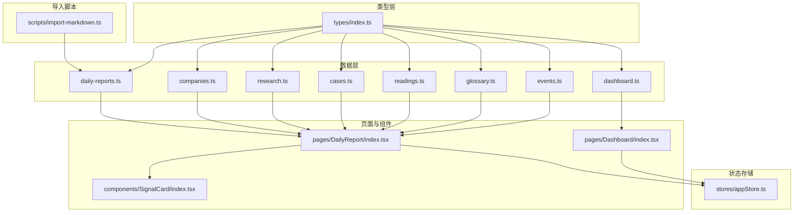
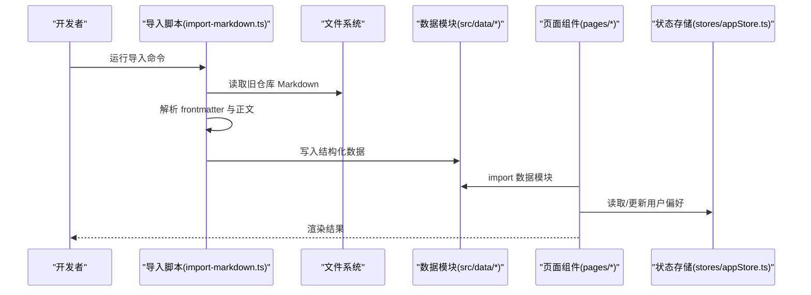
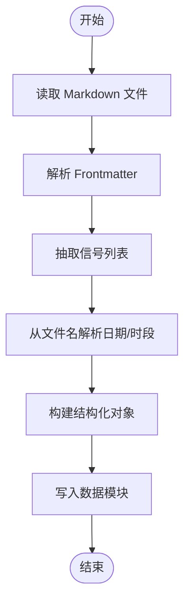
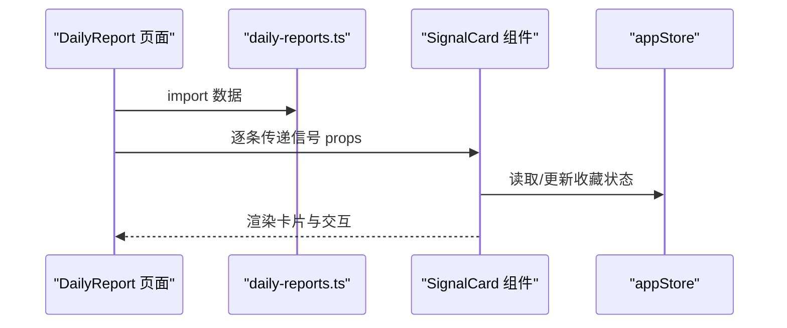
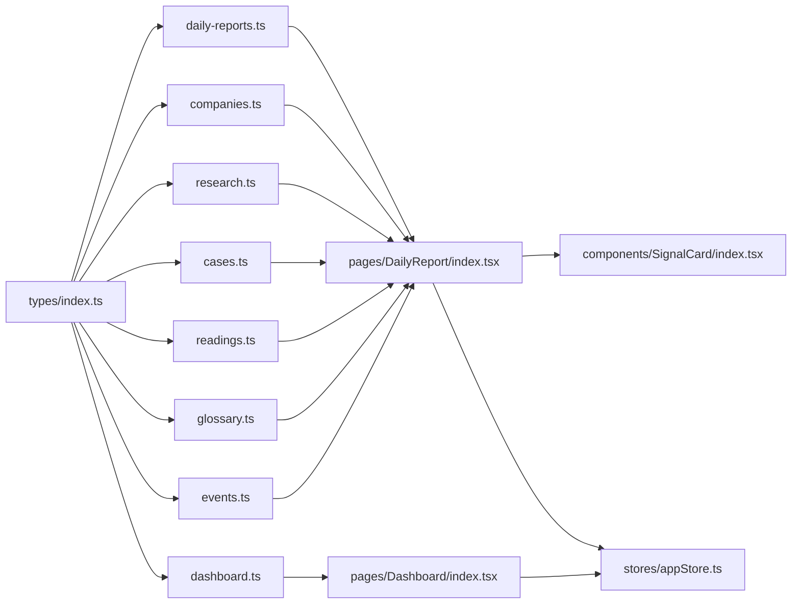

# 数据管理

<cite>
**本文引用的文件**
- [daily-reports.ts](file://src/data/daily-reports.ts)
- [companies.ts](file://src/data/companies.ts)
- [research.ts](file://src/data/research.ts)
- [cases.ts](file://src/data/cases.ts)
- [readings.ts](file://src/data/readings.ts)
- [glossary.ts](file://src/data/glossary.ts)
- [dashboard.ts](file://src/data/dashboard.ts)
- [events.ts](file://src/data/events.ts)
- [index.ts](file://src/types/index.ts)
- [import-markdown.ts](file://scripts/import-markdown.ts)
- [appStore.ts](file://src/stores/appStore.ts)
- [Dashboard/index.tsx](file://src/pages/Dashboard/index.tsx)
- [DailyReport/index.tsx](file://src/pages/DailyReport/index.tsx)
- [SignalCard/index.tsx](file://src/components/SignalCard/index.tsx)
- [package.json](file://package.json)
</cite>

## 目录
1. [简介](#简介)
2. [项目结构](#项目结构)
3. [核心组件](#核心组件)
4. [架构总览](#架构总览)
5. [详细组件分析](#详细组件分析)
6. [依赖分析](#依赖分析)
7. [性能考量](#性能考量)
8. [故障排查指南](#故障排查指南)
9. [结论](#结论)
10. [附录](#附录)

## 简介
本文件系统性阐述“未来组织·HR洞察日报”的数据管理方案，涵盖数据架构、内容模型、数据导入流程、验证机制、渲染与缓存策略，并提供扩展指南。该系统以结构化 TypeScript 模块为核心，通过前端直载数据与本地状态持久化，实现高效的内容浏览与个性化体验。

## 项目结构
- 数据层：位于 src/data 下的各领域数据模块，统一导出为数组或单例对象，供页面组件直接消费。
- 类型层：src/types 定义所有数据模型与字段约束，保证导入与渲染一致性。
- 导入脚本：scripts/import-markdown.ts 将历史 Markdown 内容批量转换为结构化 JSON 并写回数据模块。
- 页面与组件：pages 与 components 通过直接 import 数据模块进行渲染，部分状态通过 zustand 持久化存储。
- 构建与脚本：package.json 中提供数据导入命令，便于从旧仓库迁移。

图表来源
- [daily-reports.ts:1-203](file://src/data/daily-reports.ts#L1-L203)
- [companies.ts:1-53](file://src/data/companies.ts#L1-L53)
- [research.ts:1-53](file://src/data/research.ts#L1-L53)
- [cases.ts:1-63](file://src/data/cases.ts#L1-L63)
- [readings.ts:1-33](file://src/data/readings.ts#L1-L33)
- [glossary.ts:1-17](file://src/data/glossary.ts#L1-L17)
- [dashboard.ts:1-30](file://src/data/dashboard.ts#L1-L30)
- [events.ts:1-13](file://src/data/events.ts#L1-L13)
- [index.ts:1-212](file://src/types/index.ts#L1-L212)
- [import-markdown.ts:1-159](file://scripts/import-markdown.ts#L1-L159)
- [Dashboard/index.tsx:1-82](file://src/pages/Dashboard/index.tsx#L1-L82)
- [DailyReport/index.tsx:1-122](file://src/pages/DailyReport/index.tsx#L1-L122)
- [SignalCard/index.tsx:1-111](file://src/components/SignalCard/index.tsx#L1-L111)
- [appStore.ts:1-93](file://src/stores/appStore.ts#L1-L93)

章节来源
- [package.json:1-36](file://package.json#L1-L36)

## 核心组件
- 数据模型与字段规范：通过 src/types/index.ts 定义来源类型、信号、行动项、日报、公司追踪、研究报告、转型案例、延伸阅读、HR词典、数据看板、行业议程、板块导航、用户偏好、搜索结果等模型，确保字段语义一致。
- 结构化数据模块：src/data 下各模块导出强类型数组或对象，作为页面渲染的唯一数据源。
- 导入与转换：scripts/import-markdown.ts 将 Markdown frontmatter 与正文解析为结构化 JSON，写回数据模块，用于从旧仓库迁移。
- 渲染与交互：页面组件直接 import 数据模块，SignalCard 展示信号卡片，Dashboard 展示 KPI 与趋势图；用户偏好通过 Zustand 持久化存储。

章节来源
- [index.ts:1-212](file://src/types/index.ts#L1-L212)
- [daily-reports.ts:1-203](file://src/data/daily-reports.ts#L1-L203)
- [import-markdown.ts:1-159](file://scripts/import-markdown.ts#L1-L159)
- [Dashboard/index.tsx:1-82](file://src/pages/Dashboard/index.tsx#L1-L82)
- [DailyReport/index.tsx:1-122](file://src/pages/DailyReport/index.tsx#L1-L122)
- [SignalCard/index.tsx:1-111](file://src/components/SignalCard/index.tsx#L1-L111)
- [appStore.ts:1-93](file://src/stores/appStore.ts#L1-L93)

## 架构总览
系统采用“静态数据 + 前端渲染 + 本地状态”的轻量架构：
- 数据来源：结构化 TS 模块（src/data/*）
- 类型约束：统一在 src/types/index.ts
- 导入流程：脚本解析 Markdown，生成结构化数据并写回 src/data
- 渲染流程：页面组件直接 import 数据模块，组件负责展示与交互
- 个性化：Zustand 持久化主题、角色、收藏、阅读历史、标签过滤等

图表来源
- [import-markdown.ts:1-159](file://scripts/import-markdown.ts#L1-L159)
- [daily-reports.ts:1-203](file://src/data/daily-reports.ts#L1-L203)
- [Dashboard/index.tsx:1-82](file://src/pages/Dashboard/index.tsx#L1-L82)
- [DailyReport/index.tsx:1-122](file://src/pages/DailyReport/index.tsx#L1-L122)
- [appStore.ts:1-93](file://src/stores/appStore.ts#L1-L93)

## 详细组件分析

### 数据模型与字段说明
- 来源类型（SourceType）：咨询/科技/学术/智库/风投/HR媒体/中国本土
- 信号（Signal）：包含 id、表情、标题、摘要、详情、优先级、标签、关联公司、来源类型与名称
- 行动项（ActionItem）：包含 id、优先级、行动描述、时间窗、依据
- 来源覆盖（SourceCoverage）：包含总数、覆盖类型集合、基线阈值与是否达标
- 每日报告（DailyReport）：包含 id、日期、时段、标题、信号数组、行动项数组、来源覆盖、内容正文与抓取窗口
- 公司追踪（CompanyUpdate）：包含 id、日期、公司、人物、标题、摘要、内容、标签
- 研究报告（ResearchPaper）：包含 id、日期、标题、作者、机构、来源类型、摘要、关键发现、HR启示、标签、链接
- 转型案例（TransformCase）：包含 id、日期、公司、标题、结果、摘要、做了什么、哪里失败、HR启示、标签
- 延伸阅读（Reading）：包含 id、日期、标题、原文标题、来源、来源类型、摘要、关键摘录、编辑笔记、标签、链接
- HR词典（GlossaryTerm）：包含 id、术语、中文、定义、示例、相关术语、首次出现日期
- 数据看板（DashboardSnapshot）：包含日期、KPI 数组、趋势数组、明细表（可选）
- 行业议程（EventItem）：包含 id、名称、主办方、开始/结束日期、地点、类型、链接、相关性
- 板块导航（Section）：包含 id、表情、标题、描述、路径、数量
- 用户偏好（UserPreferences）：包含角色、阅读历史、收藏、主题
- 搜索结果（SearchResult）：包含 id、标题、板块、摘要、路径、分数

章节来源
- [index.ts:1-212](file://src/types/index.ts#L1-L212)

### 数据导入流程（Markdown 到 JSON）
- Frontmatter 解析：提取元信息（如日期、标题、来源等）
- 信号抽取：基于 Markdown 列表格式提取信号标题、摘要与优先级
- 文件名解析：从文件名推断日期与时段（am/pm/auto/visual）
- 输出生成：将解析结果写入对应数据模块，形成结构化数组

图表来源
- [import-markdown.ts:1-159](file://scripts/import-markdown.ts#L1-L159)

章节来源
- [import-markdown.ts:1-159](file://scripts/import-markdown.ts#L1-L159)

### 数据验证机制
- 类型约束：所有数据模块严格遵循 src/types/index.ts 的接口定义，TS 编译期校验字段与类型
- 结构一致性：导入脚本输出与数据模块导出保持一致的字段集合，避免遗漏或冗余
- 运行期校验：页面组件在渲染前可进行空值检查与默认值填充，保证 UI 稳定

章节来源
- [index.ts:1-212](file://src/types/index.ts#L1-L212)
- [daily-reports.ts:1-203](file://src/data/daily-reports.ts#L1-L203)
- [import-markdown.ts:1-159](file://scripts/import-markdown.ts#L1-L159)

### 数据驱动渲染与交互
- 日报页面：按日期分组展示多时段报告，信号卡片支持展开/收起与收藏
- 看板页面：展示 KPI 卡片与趋势折线图，支持响应式布局
- 信号卡片：根据优先级设置边框与徽标样式，支持收藏状态切换
- 用户偏好：主题、角色、收藏、阅读历史、标签过滤均持久化存储

图表来源
- [DailyReport/index.tsx:1-122](file://src/pages/DailyReport/index.tsx#L1-L122)
- [SignalCard/index.tsx:1-111](file://src/components/SignalCard/index.tsx#L1-L111)
- [daily-reports.ts:1-203](file://src/data/daily-reports.ts#L1-L203)
- [appStore.ts:1-93](file://src/stores/appStore.ts#L1-L93)

章节来源
- [DailyReport/index.tsx:1-122](file://src/pages/DailyReport/index.tsx#L1-L122)
- [SignalCard/index.tsx:1-111](file://src/components/SignalCard/index.tsx#L1-L111)
- [appStore.ts:1-93](file://src/stores/appStore.ts#L1-L93)

### 缓存策略与性能优化
- 数据缓存：数据模块为静态导入，浏览器加载后常驻内存，减少重复 IO
- 组件渲染：使用动画库与响应式图表，合理控制重绘范围
- 状态持久化：Zustand 持久化用户偏好，避免每次刷新重建状态
- 性能建议：
  - 控制信号与行动项数量，避免一次性渲染过多节点
  - 对长文本详情采用懒展开，减少首屏计算
  - 图表数据按需渲染，避免不必要的全量更新

章节来源
- [Dashboard/index.tsx:1-82](file://src/pages/Dashboard/index.tsx#L1-L82)
- [appStore.ts:1-93](file://src/stores/appStore.ts#L1-L93)

### 新增内容类型的扩展指南
- 定义类型：在 src/types/index.ts 中新增接口与枚举，明确字段与取值范围
- 创建数据模块：在 src/data 下新增 *.ts 文件，导出强类型数组或对象
- 导入脚本适配：如需从 Markdown 迁移，扩展 scripts/import-markdown.ts 的解析规则
- 页面集成：在相应页面组件中 import 新模块，按现有模式渲染
- 类型安全：确保所有字段符合类型定义，避免运行期错误

章节来源
- [index.ts:1-212](file://src/types/index.ts#L1-L212)
- [import-markdown.ts:1-159](file://scripts/import-markdown.ts#L1-L159)

## 依赖分析
- 类型依赖：所有数据模块均依赖 src/types/index.ts 的接口定义
- 页面依赖：页面组件直接 import 数据模块，形成单向数据流
- 状态依赖：组件通过 Zustand 访问全局状态，实现跨组件共享
- 导入脚本：独立于运行时，仅在迁移时使用

图表来源
- [index.ts:1-212](file://src/types/index.ts#L1-L212)
- [daily-reports.ts:1-203](file://src/data/daily-reports.ts#L1-L203)
- [companies.ts:1-53](file://src/data/companies.ts#L1-L53)
- [research.ts:1-53](file://src/data/research.ts#L1-L53)
- [cases.ts:1-63](file://src/data/cases.ts#L1-L63)
- [readings.ts:1-33](file://src/data/readings.ts#L1-L33)
- [glossary.ts:1-17](file://src/data/glossary.ts#L1-L17)
- [dashboard.ts:1-30](file://src/data/dashboard.ts#L1-L30)
- [events.ts:1-13](file://src/data/events.ts#L1-L13)
- [DailyReport/index.tsx:1-122](file://src/pages/DailyReport/index.tsx#L1-L122)
- [Dashboard/index.tsx:1-82](file://src/pages/Dashboard/index.tsx#L1-L82)
- [SignalCard/index.tsx:1-111](file://src/components/SignalCard/index.tsx#L1-L111)
- [appStore.ts:1-93](file://src/stores/appStore.ts#L1-L93)

章节来源
- [index.ts:1-212](file://src/types/index.ts#L1-L212)
- [package.json:1-36](file://package.json#L1-L36)

## 性能考量
- 首屏渲染：将数据模块拆分为按需加载的片段，减少初始包体积
- 虚拟滚动：对长列表（如信号、案例、阅读）采用虚拟化策略
- 图表优化：限制数据点数量，使用采样与懒加载
- 缓存复用：利用浏览器缓存与组件记忆化，避免重复计算

## 故障排查指南
- 导入失败：检查 Markdown frontmatter 格式与文件命名是否符合解析规则
- 类型错误：确认数据模块字段与 src/types/index.ts 定义一致
- 渲染异常：检查信号详情为空时的默认展示逻辑，避免空字符串渲染
- 状态异常：核对 Zustand 持久化键名与序列化字段，确保本地存储可用

章节来源
- [import-markdown.ts:1-159](file://scripts/import-markdown.ts#L1-L159)
- [index.ts:1-212](file://src/types/index.ts#L1-L212)
- [appStore.ts:1-93](file://src/stores/appStore.ts#L1-L93)

## 结论
该系统以清晰的数据模型与严格的类型约束为基础，结合简洁的导入脚本与前端直载数据的渲染方式，实现了稳定、可扩展且易于维护的内容管理方案。通过合理的缓存与状态持久化策略，兼顾了性能与用户体验。新增内容类型与数据扩展均可按既定流程快速落地。

## 附录
- 命令参考
  - 导入数据：npm run import-data
- 关键文件清单
  - 类型定义：src/types/index.ts
  - 数据模块：src/data/*.ts
  - 导入脚本：scripts/import-markdown.ts
  - 页面组件：src/pages/*
  - 信号卡片：src/components/SignalCard/index.tsx
  - 状态存储：src/stores/appStore.ts

章节来源
- [package.json:1-36](file://package.json#L1-L36)
- [import-markdown.ts:1-159](file://scripts/import-markdown.ts#L1-L159)