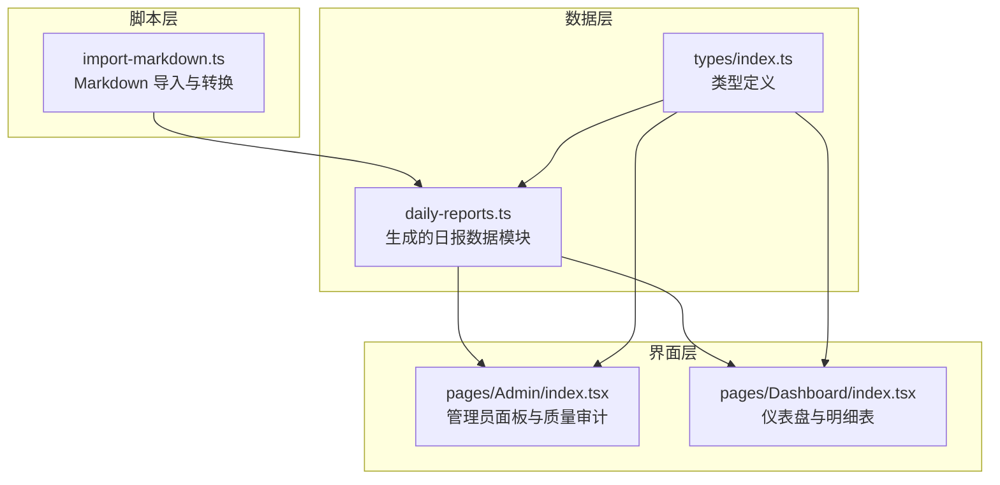
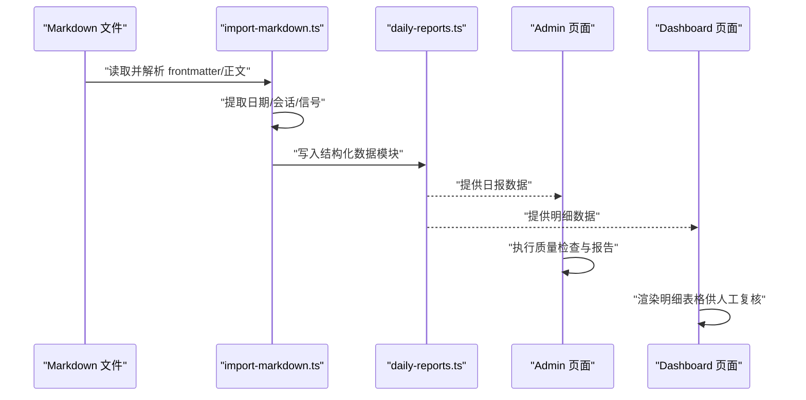
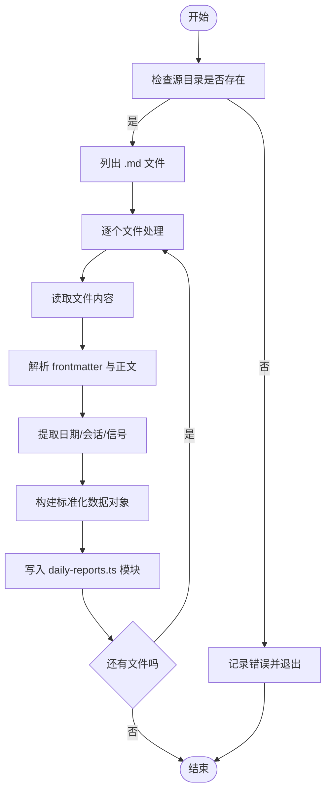
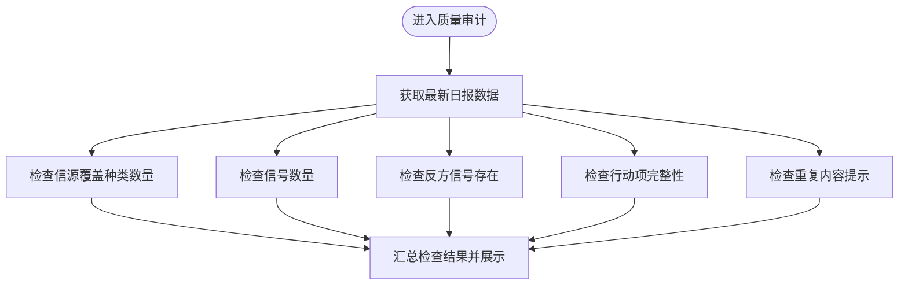
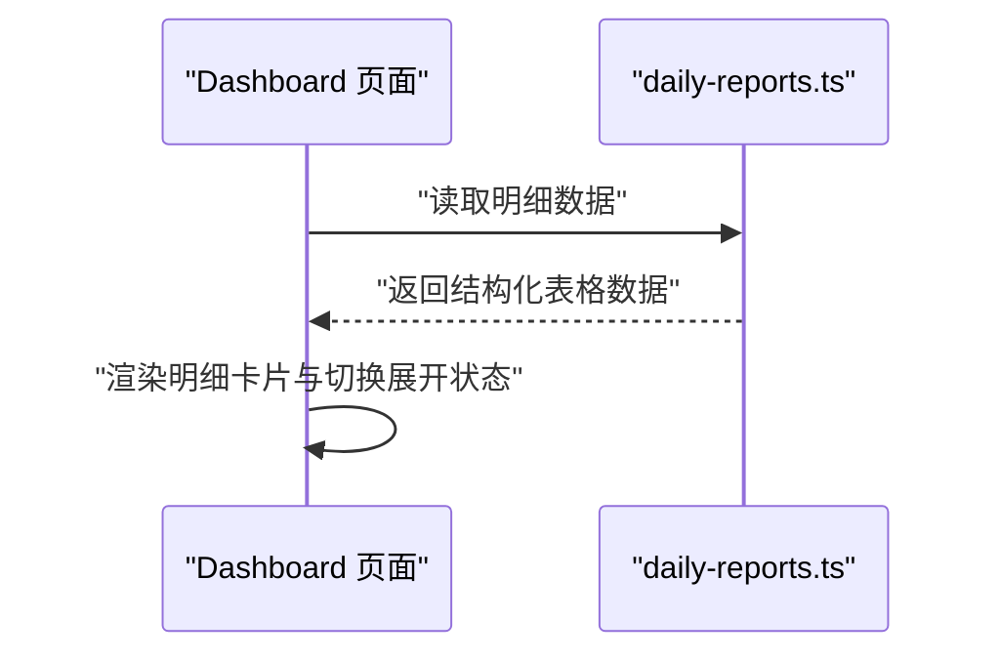
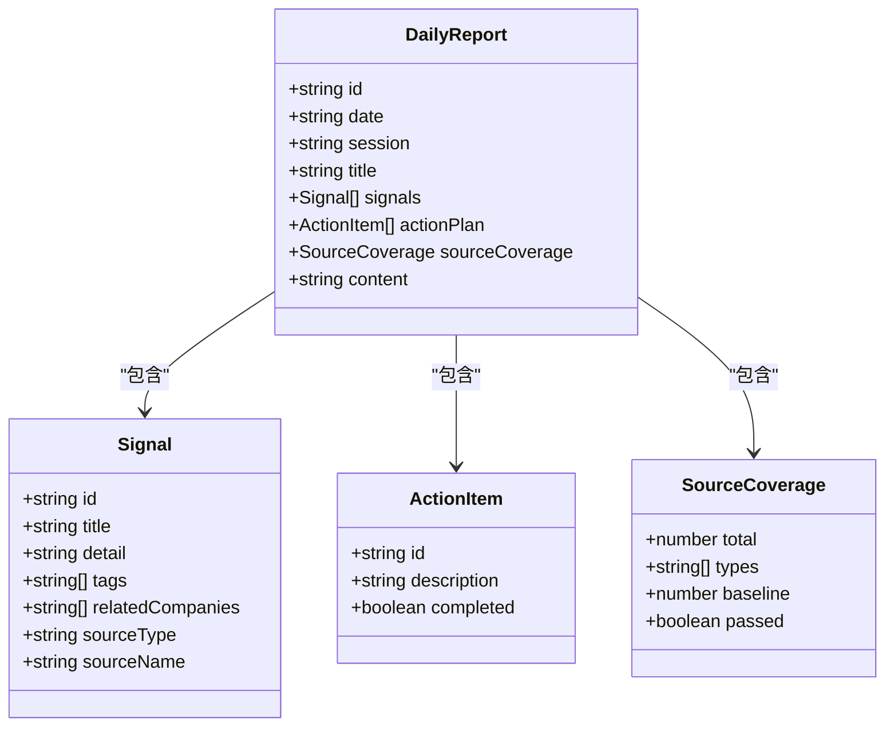
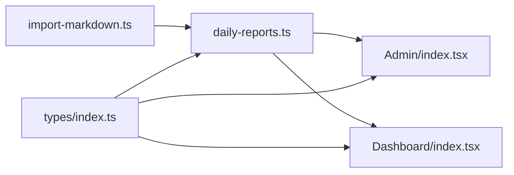

# 数据验证与质量控制

<cite>
**本文档引用的文件**
- [src/pages/Admin/index.tsx](file://src/pages/Admin/index.tsx)
- [scripts/import-markdown.ts](file://scripts/import-markdown.ts)
- [src/data/daily-reports.ts](file://src/data/daily-reports.ts)
- [src/types/index.ts](file://src/types/index.ts)
- [src/pages/Dashboard/index.tsx](file://src/pages/Dashboard/index.tsx)
</cite>

## 目录
1. [引言](#引言)
2. [项目结构](#项目结构)
3. [核心组件](#核心组件)
4. [架构总览](#架构总览)
5. [详细组件分析](#详细组件分析)
6. [依赖关系分析](#依赖关系分析)
7. [性能考虑](#性能考虑)
8. [故障排除指南](#故障排除指南)
9. [结论](#结论)
10. [附录](#附录)

## 引言
本文件系统化梳理项目中的数据验证与质量控制实践，聚焦于数据完整性检查、格式验证、一致性保证、异常处理与修复策略、重复数据检测与冲突解决、备份与版本管理、以及数据安全与访问控制。通过对现有代码的深入分析，总结出可操作的质量保障流程，并给出优化建议与最佳实践。

## 项目结构
项目采用前端单页应用架构，数据通过脚本导入生成静态模块，页面组件负责展示与交互。Admin 页面提供质量审计功能；Dashboard 展示明细数据；导入脚本负责从 Markdown 转换为结构化数据并写入数据模块。

图表来源
- [scripts/import-markdown.ts:83-158](file://scripts/import-markdown.ts#L83-L158)
- [src/data/daily-reports.ts](file://src/data/daily-reports.ts)
- [src/types/index.ts](file://src/types/index.ts)
- [src/pages/Admin/index.tsx:24-142](file://src/pages/Admin/index.tsx#L24-L142)
- [src/pages/Dashboard/index.tsx:91-141](file://src/pages/Dashboard/index.tsx#L91-L141)

章节来源
- [scripts/import-markdown.ts:83-158](file://scripts/import-markdown.ts#L83-L158)
- [src/pages/Admin/index.tsx:24-142](file://src/pages/Admin/index.tsx#L24-L142)
- [src/pages/Dashboard/index.tsx:91-141](file://src/pages/Dashboard/index.tsx#L91-L141)

## 核心组件
- 数据导入与转换：从 Markdown 解析元信息与正文，提取信号，构造标准化结构，写入 TypeScript 模块。
- 质量审计：在 Admin 页面中展示质量检查项（如信源覆盖、信号数量、反方信号、行动项、重复检测等）。
- 明细展示：Dashboard 展示各类明细表格，便于人工复核与交叉比对。
- 类型约束：通过 TypeScript 定义确保数据结构一致性和字段完整性。

章节来源
- [scripts/import-markdown.ts:83-158](file://scripts/import-markdown.ts#L83-L158)
- [src/pages/Admin/index.tsx:111-142](file://src/pages/Admin/index.tsx#L111-L142)
- [src/pages/Dashboard/index.tsx:91-141](file://src/pages/Dashboard/index.tsx#L91-L141)
- [src/types/index.ts](file://src/types/index.ts)

## 架构总览
下图展示了从数据导入到质量审计与展示的整体流程，体现各模块之间的依赖关系与职责边界。

图表来源
- [scripts/import-markdown.ts:83-158](file://scripts/import-markdown.ts#L83-L158)
- [src/pages/Admin/index.tsx:111-142](file://src/pages/Admin/index.tsx#L111-L142)
- [src/pages/Dashboard/index.tsx:91-141](file://src/pages/Dashboard/index.tsx#L91-L141)
- [src/data/daily-reports.ts](file://src/data/daily-reports.ts)

## 详细组件分析

### 组件一：数据导入与格式验证
职责与流程
- 输入：Markdown 文件集合，包含 frontmatter 元信息与正文。
- 处理：解析元信息、提取日期/会话、解析正文中的信号列表。
- 输出：生成 TypeScript 模块，导出标准化的日报数据结构。

关键验证点
- 必填字段：id、date、session、signals 等字段的存在性与基本格式校验。
- 结构一致性：signals 数组元素需满足统一结构；为每个信号补全默认值（如 detail、tags、relatedCompanies、sourceType、sourceName）。
- 文件过滤：仅处理 .md 后缀文件，避免无效输入。
- 错误收集：解析失败时记录错误并继续处理其他文件，保证批量导入的鲁棒性。

图表来源
- [scripts/import-markdown.ts:83-158](file://scripts/import-markdown.ts#L83-L158)

章节来源
- [scripts/import-markdown.ts:83-158](file://scripts/import-markdown.ts#L83-L158)

### 组件二：质量审计与一致性检查
职责与流程
- 在 Admin 页面的“质量审计”标签中，对最新日报执行多项检查：
  - 信源覆盖种类数量阈值检查
  - 信号数量阈值检查
  - 反方信号存在性检查
  - 行动项完整性检查
  - 重复内容检测提示
- 基于检查结果展示通过/不通过状态与具体数值或说明。

图表来源
- [src/pages/Admin/index.tsx:111-142](file://src/pages/Admin/index.tsx#L111-L142)

章节来源
- [src/pages/Admin/index.tsx:111-142](file://src/pages/Admin/index.tsx#L111-L142)

### 组件三：明细展示与人工复核
职责与流程
- Dashboard 渲染多个明细表格卡片，支持展开/折叠。
- 通过可视化方式呈现数据，辅助发现异常与不一致问题。
- 与 Admin 的质量审计形成互补：机器规则与人工复核结合。

图表来源
- [src/pages/Dashboard/index.tsx:91-141](file://src/pages/Dashboard/index.tsx#L91-L141)
- [src/data/daily-reports.ts](file://src/data/daily-reports.ts)

章节来源
- [src/pages/Dashboard/index.tsx:91-141](file://src/pages/Dashboard/index.tsx#L91-L141)
- [src/data/daily-reports.ts](file://src/data/daily-reports.ts)

### 组件四：类型约束与一致性保证
职责与流程
- 通过 TypeScript 类型定义约束数据结构，确保字段存在性与类型正确性。
- 在导入脚本与页面组件中均依赖类型定义，实现端到端的一致性。

图表来源
- [src/types/index.ts](file://src/types/index.ts)

章节来源
- [src/types/index.ts](file://src/types/index.ts)

## 依赖关系分析
- 导入脚本依赖 TypeScript 模块输出约定，生成的数据模块被页面组件直接引用。
- Admin 与 Dashboard 均依赖数据模块提供的结构化数据。
- 类型定义贯穿导入、存储与展示环节，形成强约束的一致性保障。

图表来源
- [scripts/import-markdown.ts:83-158](file://scripts/import-markdown.ts#L83-L158)
- [src/data/daily-reports.ts](file://src/data/daily-reports.ts)
- [src/pages/Admin/index.tsx:24-142](file://src/pages/Admin/index.tsx#L24-L142)
- [src/pages/Dashboard/index.tsx:91-141](file://src/pages/Dashboard/index.tsx#L91-L141)
- [src/types/index.ts](file://src/types/index.ts)

章节来源
- [scripts/import-markdown.ts:83-158](file://scripts/import-markdown.ts#L83-L158)
- [src/pages/Admin/index.tsx:24-142](file://src/pages/Admin/index.tsx#L24-L142)
- [src/pages/Dashboard/index.tsx:91-141](file://src/pages/Dashboard/index.tsx#L91-L141)
- [src/types/index.ts](file://src/types/index.ts)

## 性能考虑
- 批量导入：逐文件解析与写入，建议在 CI 中分批执行并缓存中间结果，减少重复计算。
- 数据规模：随着日报数量增长，Admin 的质量检查应避免全量重算，优先增量更新最近数据。
- 展示优化：Dashboard 的明细卡片支持延迟动画与按需展开，有助于降低首屏渲染压力。
- I/O 优化：导入脚本一次性写入单一模块，减少频繁文件操作带来的开销。

## 故障排除指南
常见问题与处理
- 导入失败：检查源目录路径、文件权限与 .md 文件格式；查看错误日志定位具体文件与原因。
- 字段缺失：确认 frontmatter 是否包含必需字段；检查信号解析正则是否匹配正文格式。
- 结构不一致：核对类型定义与实际数据结构差异；必要时在导入阶段进行字段补齐与默认值填充。
- 质量检查不通过：根据 Admin 报告逐项修正，如补充反方信号、完善行动项、清理重复内容等。
- 展示异常：检查数据模块是否正确导出；确认页面组件对空值与异常数据的兜底处理。

章节来源
- [scripts/import-markdown.ts:83-158](file://scripts/import-markdown.ts#L83-L158)
- [src/pages/Admin/index.tsx:111-142](file://src/pages/Admin/index.tsx#L111-L142)

## 结论
本项目通过“导入脚本 + 类型约束 + 质量审计 + 明细展示”的组合实现了基础但有效的数据验证与质量控制闭环。建议后续在以下方面持续改进：引入更严格的格式与业务规则校验、建立自动化测试用例、完善重复检测算法与冲突解决策略、制定数据备份与版本管理方案，并强化访问控制与安全策略。

## 附录

### 数据类型与验证规则清单
- 日报（DailyReport）
  - 必填字段：id、date、session、title、signals、content
  - 一致性：signals 为数组且每项符合 Signal 结构；actionPlan 为数组；sourceCoverage 符合 SourceCoverage 结构
- 信号（Signal）
  - 必填字段：id、title
  - 默认值：detail、tags、relatedCompanies、sourceType、sourceName
- 行动项（ActionItem）
  - 必填字段：id、description
- 信源覆盖（SourceCoverage）
  - 必填字段：total、types、baseline、passed

章节来源
- [src/types/index.ts](file://src/types/index.ts)
- [scripts/import-markdown.ts:83-158](file://scripts/import-markdown.ts#L83-L158)

### 数据质量监控指标
- 信源覆盖种类数量 ≥ 阈值
- 信号数量 ≥ 阈值
- 存在反方信号
- 行动项完整率
- 重复内容检测覆盖率

章节来源
- [src/pages/Admin/index.tsx:111-142](file://src/pages/Admin/index.tsx#L111-L142)

### 异常数据处理与修复策略
- 导入阶段：对单个文件解析失败进行记录并跳过，不影响整体导入进度。
- 质量审计阶段：针对不通过项提供具体数值与说明，指导人工修复。
- 修复建议：补齐缺失字段、规范化信号格式、补充反方信号与行动项、去重与合并重复内容。

章节来源
- [scripts/import-markdown.ts:83-158](file://scripts/import-markdown.ts#L83-L158)
- [src/pages/Admin/index.tsx:111-142](file://src/pages/Admin/index.tsx#L111-L142)

### 数据清洗流程与重复检测
- 清洗流程：字段补齐 → 格式规范化 → 结构一致性检查 → 重复检测 → 输出模块
- 重复检测：Admin 报告中提供“无重复内容”提示，建议在导入阶段增加基于标题/正文的相似度阈值与去重算法

章节来源
- [scripts/import-markdown.ts:83-158](file://scripts/import-markdown.ts#L83-L158)
- [src/pages/Admin/index.tsx:111-142](file://src/pages/Admin/index.tsx#L111-L142)

### 备份策略、版本管理与回滚
- 备份策略：定期导出数据模块与原始 Markdown 源文件，保留多版本快照
- 版本管理：以 Git 管理数据模块变更，配合分支与标签标记重要版本
- 回滚机制：当质量审计不通过或发现严重错误时，回退到上一个稳定版本的数据模块

章节来源
- [scripts/import-markdown.ts:83-158](file://scripts/import-markdown.ts#L83-L158)

### 数据安全与访问控制
- 访问控制：限制 Admin 页面访问权限，仅授权用户可查看与编辑
- 数据最小化：仅在必要范围内暴露数据字段，避免敏感信息泄露
- 审计日志：记录关键操作（导入、修改、回滚）以便追溯

章节来源
- [src/pages/Admin/index.tsx:24-142](file://src/pages/Admin/index.tsx#L24-L142)