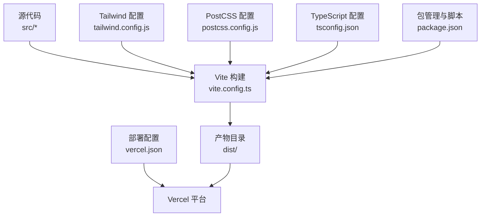
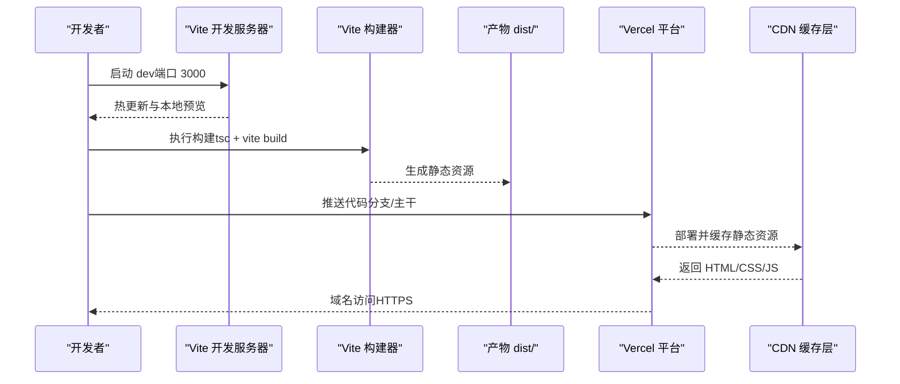
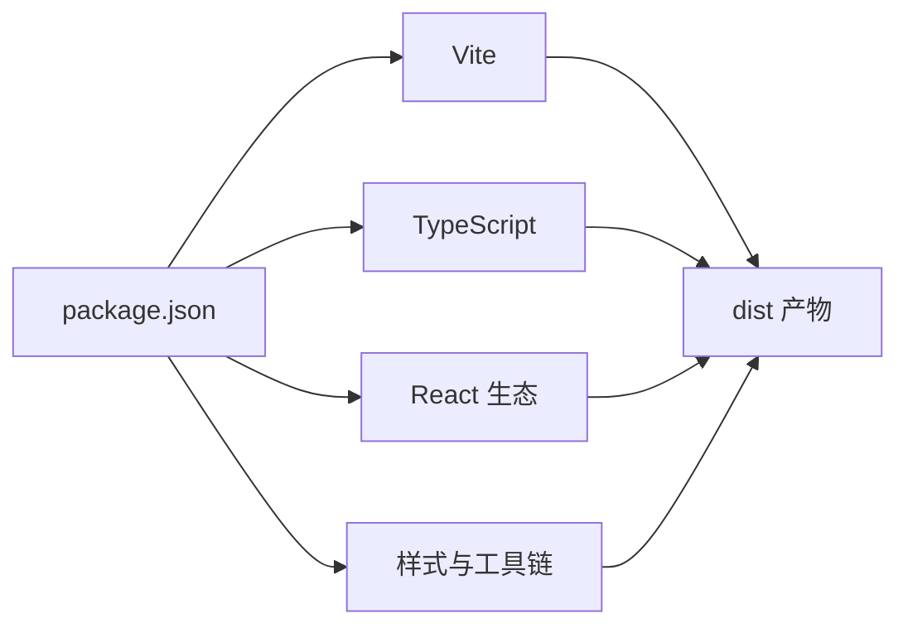
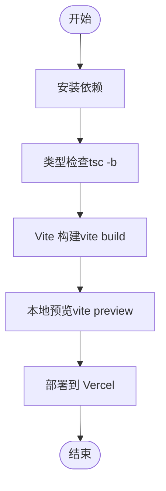
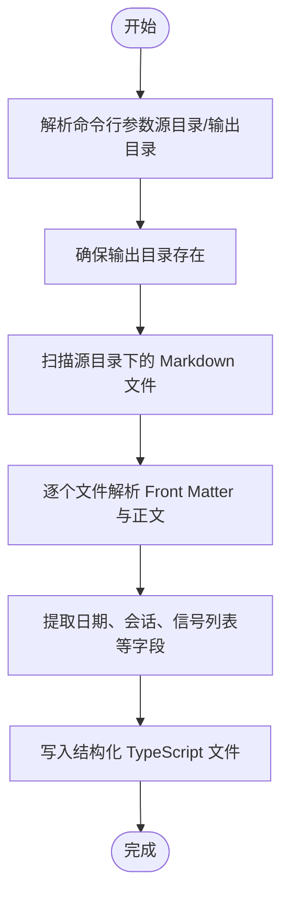

# 构建与部署

<cite>
**本文引用的文件**
- [vite.config.ts](file://vite.config.ts)
- [package.json](file://package.json)
- [vercel.json](file://vercel.json)
- [tailwind.config.js](file://tailwind.config.js)
- [postcss.config.js](file://postcss.config.js)
- [tsconfig.json](file://tsconfig.json)
- [tsconfig.scripts.json](file://tsconfig.scripts.json)
- [scripts/import-markdown.ts](file://scripts/import-markdown.ts)
</cite>

## 目录
1. [简介](#简介)
2. [项目结构](#项目结构)
3. [核心组件](#核心组件)
4. [架构总览](#架构总览)
5. [详细组件分析](#详细组件分析)
6. [依赖分析](#依赖分析)
7. [性能考虑](#性能考虑)
8. [故障排查指南](#故障排查指南)
9. [结论](#结论)
10. [附录](#附录)

## 简介
本文件面向运维与开发团队，系统性梳理“未来组织·HR洞察日报”项目的构建与部署方案。内容覆盖 Vite 构建配置、生产环境优化、代码压缩与打包策略、静态资源处理、CDN 与缓存策略、Vercel 部署配置、环境变量管理、域名与 HTTPS、CI/CD 流水线建议、自动化测试集成、部署回滚策略，以及性能监控、错误追踪与日志管理等运维实践。

## 项目结构
该项目采用 React + TypeScript + Vite 的前端工程，使用 TailwindCSS 进行样式管理，并通过 PostCSS 自动前缀与按需构建。项目根目录包含构建配置、部署配置、类型配置与数据导入脚本等关键文件。

图表来源
- [vite.config.ts:1-21](file://vite.config.ts#L1-L21)
- [tailwind.config.js:1-60](file://tailwind.config.js#L1-L60)
- [postcss.config.js:1-7](file://postcss.config.js#L1-L7)
- [tsconfig.json:1-25](file://tsconfig.json#L1-L25)
- [package.json:1-36](file://package.json#L1-L36)
- [vercel.json:1-6](file://vercel.json#L1-L6)

章节来源
- [vite.config.ts:1-21](file://vite.config.ts#L1-L21)
- [package.json:1-36](file://package.json#L1-L36)
- [vercel.json:1-6](file://vercel.json#L1-L6)
- [tailwind.config.js:1-60](file://tailwind.config.js#L1-L60)
- [postcss.config.js:1-7](file://postcss.config.js#L1-L7)
- [tsconfig.json:1-25](file://tsconfig.json#L1-L25)
- [tsconfig.scripts.json:1-12](file://tsconfig.scripts.json#L1-L12)

## 核心组件
- 构建工具链：Vite（React 插件、路径别名、开发服务器、构建输出）
- 样式体系：TailwindCSS（内容扫描、主题与动画扩展）、PostCSS（自动前缀）
- 类型系统：TypeScript（严格模式、路径映射）
- 部署平台：Vercel（单页应用路由回退）
- 辅助脚本：Markdown 导入工具（批量生成结构化数据）

章节来源
- [vite.config.ts:1-21](file://vite.config.ts#L1-L21)
- [tailwind.config.js:1-60](file://tailwind.config.js#L1-L60)
- [postcss.config.js:1-7](file://postcss.config.js#L1-L7)
- [tsconfig.json:1-25](file://tsconfig.json#L1-L25)
- [package.json:1-36](file://package.json#L1-L36)
- [scripts/import-markdown.ts:1-159](file://scripts/import-markdown.ts#L1-L159)

## 架构总览
下图展示从本地构建到线上部署的关键流程，包括开发服务器、构建产物、静态资源分发与路由回退。

图表来源
- [vite.config.ts:12-20](file://vite.config.ts#L12-L20)
- [package.json:6-11](file://package.json#L6-L11)
- [vercel.json:1-6](file://vercel.json#L1-L6)

## 详细组件分析

### Vite 构建配置
- 插件与别名：启用 React 插件与路径别名，提升开发体验与模块引用便捷性。
- 开发服务器：默认端口 3000，自动打开浏览器。
- 构建输出：输出目录为 dist；保留 Source Map 便于生产调试。
- 优化建议：生产环境可关闭 Source Map 或改为隐藏 Source Map；开启压缩与资源内联阈值；配置 Rollup 插件进行二次优化。

章节来源
- [vite.config.ts:1-21](file://vite.config.ts#L1-L21)

### 生产环境优化与打包策略
- 构建命令：先执行 tsc 项目构建，再执行 vite build，确保类型检查与打包一致。
- 资源压缩：Vite 默认启用 JS/CSS 压缩；可在构建配置中细化压缩参数（如最小化策略、模块化选项）。
- 产物结构：dist 目录包含 HTML、CSS、JS 与静态资源；建议配合 CDN 使用版本化文件名与长缓存策略。
- Source Map：当前启用，便于定位问题；生产可切换为更安全的 Source Map 方案。

章节来源
- [package.json:6-11](file://package.json#L6-L11)
- [vite.config.ts:16-20](file://vite.config.ts#L16-L20)

### 静态资源处理与缓存策略
- 资源类型：HTML、CSS、JS、字体、图片等由 Vite 统一处理。
- 缓存策略建议：
  - HTML：短缓存或不缓存（SPA 路由回退依赖）
  - CSS/JS：启用长期缓存（基于内容哈希命名），变更时自动失效
  - 字体/图片：启用长期缓存，必要时添加版本号
- CDN：结合 Vercel CDN 实现全球加速与边缘缓存。

章节来源
- [vite.config.ts:16-20](file://vite.config.ts#L16-L20)
- [vercel.json:1-6](file://vercel.json#L1-L6)

### CDN 配置与路由回退
- Vercel 配置：通过重写规则将所有路径回退到 index.html，适配 SPA 单页应用路由。
- 建议：在 CDN 层面设置合适的缓存头与压缩策略；对 HTML 设置较短缓存，对静态资源设置长缓存。

章节来源
- [vercel.json:1-6](file://vercel.json#L1-L6)

### 环境变量管理
- 命名规范：以 VITE_ 前缀声明的变量会在客户端打包时注入；避免暴露敏感信息。
- 典型用途：API 地址、功能开关、第三方 SDK Key 等。
- 安全建议：仅放置非敏感配置；敏感变量置于服务端或平台托管的密钥管理。

章节来源
- [package.json:6-11](file://package.json#L6-L11)

### 域名绑定与 HTTPS
- 域名绑定：在 Vercel 控制台绑定自定义域名。
- HTTPS：Vercel 自动生成并管理证书，建议强制 HTTPS 访问。
- 备注：本仓库未包含具体域名配置文件，实际部署时请在 Vercel 控制台完成域名与证书配置。

章节来源
- [vercel.json:1-6](file://vercel.json#L1-L6)

### CI/CD 流水线设置（建议）
以下为通用实践建议，便于与现有仓库集成：
- 触发条件：推送主分支、发布标签、PR 合并
- 步骤建议：
  - 安装依赖与类型检查
  - 运行测试（单元/集成/端到端）
  - 构建与预览验证
  - 部署到 Vercel Staging（可选）
  - 部署到 Vercel Production（主分支）
  - 回滚策略：支持基于版本号的快速回滚或一键回滚至上一个稳定版本
- 工具选择：GitHub Actions、GitLab CI、Vercel 自身的部署钩子等

[本节为概念性指导，不直接分析具体文件]

### 自动化测试集成（建议）
- 单元测试：Vitest/Jest（按需引入）
- 端到端测试：Cypress/Puppeteer（按需引入）
- 集成：在 CI 中执行测试并通过后才允许部署

[本节为概念性指导，不直接分析具体文件]

### 部署回滚策略（建议）
- 版本化：每次部署生成唯一版本标识（如 Git SHA）
- 快速回滚：通过平台控制台或 CLI 回滚至最近一次成功版本
- 灰度发布：逐步扩大流量比例，降低风险

[本节为概念性指导，不直接分析具体文件]

### 性能监控、错误追踪与日志管理
- 性能监控：Vercel 分析报告、Web Vitals、自定义指标埋点
- 错误追踪：Sentry、LogRocket（按需接入）
- 日志管理：浏览器控制台日志、服务端日志聚合（如平台日志面板）

[本节为概念性指导，不直接分析具体文件]

## 依赖分析
- 构建与运行时依赖：React、React Router、Zustand、Recharts、Framer Motion、Lucide React、HTML2Canvas、Fuse.js
- 开发依赖：Vite、@vitejs/plugin-react、TypeScript、TailwindCSS、PostCSS、Autoprefixer、TSX
- 依赖关系：构建脚本依赖 Vite 与 TypeScript；样式管线依赖 TailwindCSS 与 PostCSS；运行时依赖 React 生态组件库

图表来源
- [package.json:1-36](file://package.json#L1-L36)

章节来源
- [package.json:1-36](file://package.json#L1-L36)

## 性能考虑
- 构建阶段：启用压缩、拆分代码、延迟加载非关键资源
- 运行阶段：合理使用缓存、CDN 加速、预连接关键域名、减少主线程阻塞
- 样式与字体：按需加载、字体优化（可变字体、裁剪字形）、CSS-in-JS 注意样式抖动
- 图片与媒体：响应式图片、WebP/AVIF、懒加载与占位符

[本节提供通用建议，不直接分析具体文件]

## 故障排查指南
- 构建失败
  - 症状：类型检查或打包报错
  - 排查：确认 TypeScript 配置与依赖版本兼容；查看构建日志中的具体文件与行号
- 开发服务器无法启动
  - 症状：端口占用或热更新异常
  - 排查：更换端口、清理缓存、重启开发服务器
- 部署后页面空白或路由错误
  - 症状：刷新 404 或空白页
  - 排查：确认 SPA 路由回退规则已生效；检查静态资源是否正确上传
- 样式异常
  - 症状：Tailwind 类无效或样式未生效
  - 排查：确认内容扫描路径与构建命令；检查 PostCSS 插件顺序

章节来源
- [vite.config.ts:12-20](file://vite.config.ts#L12-L20)
- [vercel.json:1-6](file://vercel.json#L1-L6)
- [tailwind.config.js:1-60](file://tailwind.config.js#L1-L60)
- [postcss.config.js:1-7](file://postcss.config.js#L1-L7)

## 结论
本项目以 Vite 为核心构建工具，结合 TailwindCSS 与 PostCSS 实现现代化前端工程化能力；通过 Vercel 的单页应用路由回退实现稳定部署。建议在生产环境中进一步完善 Source Map 策略、CDN 缓存与压缩配置，并建立完善的 CI/CD、监控与回滚机制，以保障交付质量与运维效率。

## 附录

### 构建与预览流程

图表来源
- [package.json:6-11](file://package.json#L6-L11)
- [vite.config.ts:16-20](file://vite.config.ts#L16-L20)

### 数据导入脚本（Markdown → JSON）
该脚本用于将历史 Markdown 数据转换为结构化 JSON，供前端使用。

图表来源
- [scripts/import-markdown.ts:1-159](file://scripts/import-markdown.ts#L1-L159)

章节来源
- [scripts/import-markdown.ts:1-159](file://scripts/import-markdown.ts#L1-L159)