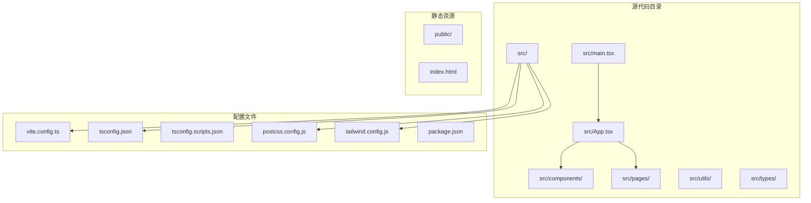
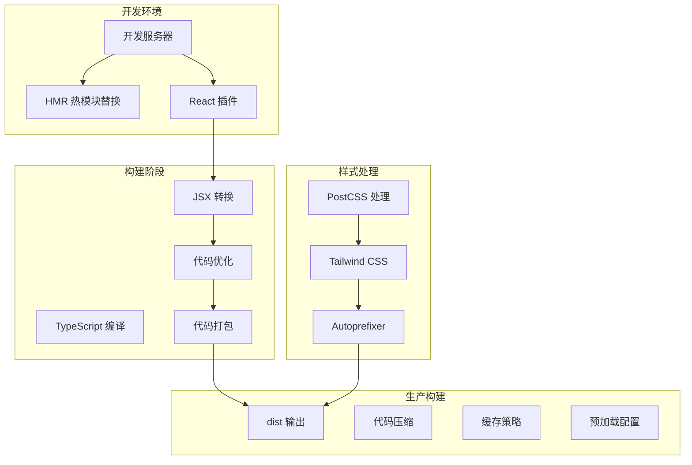
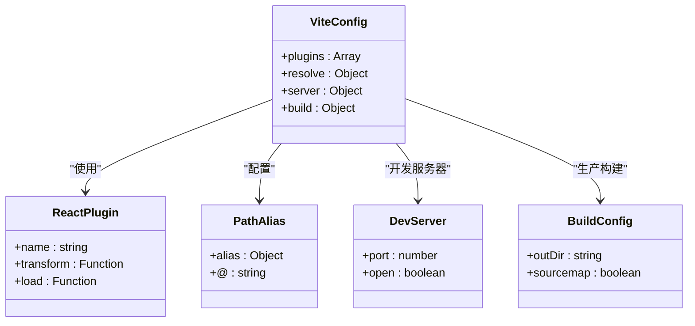
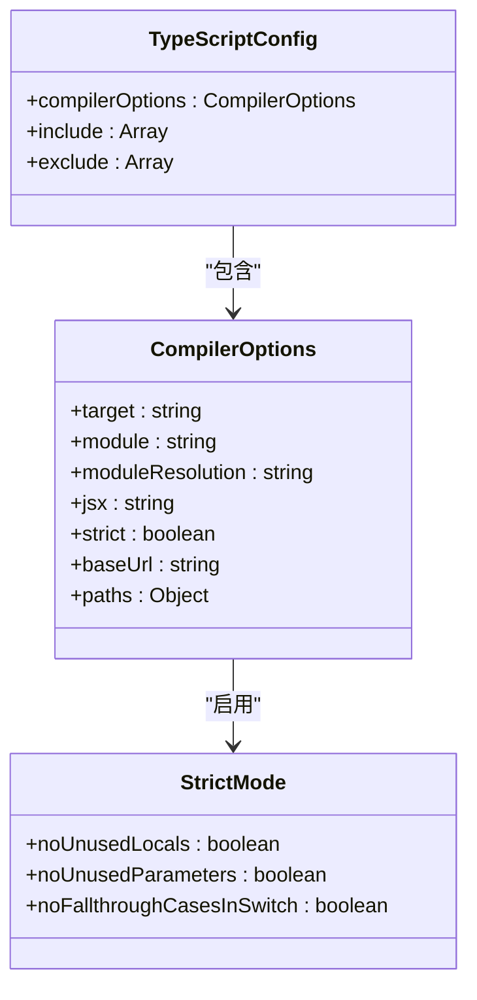
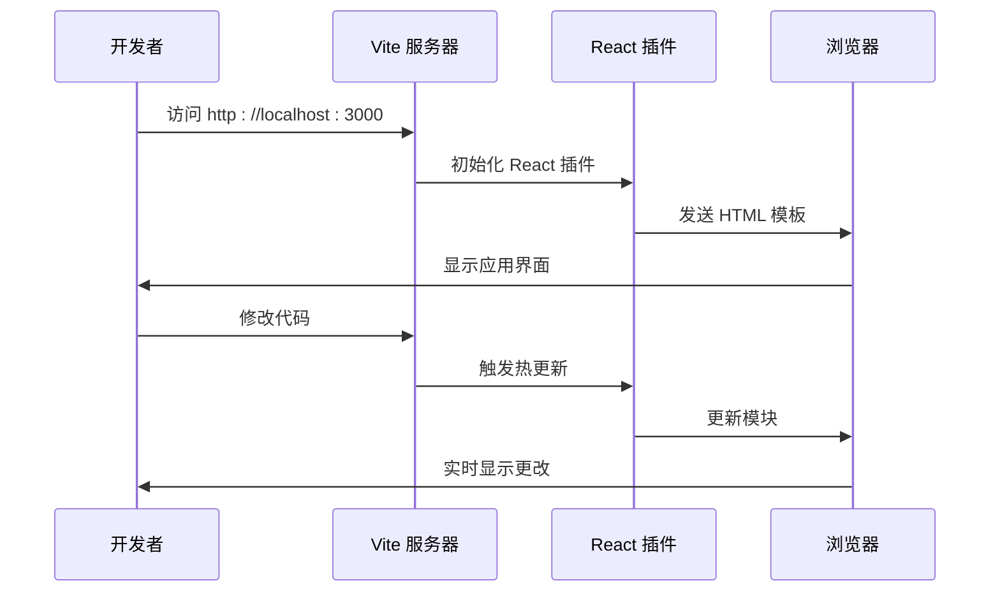
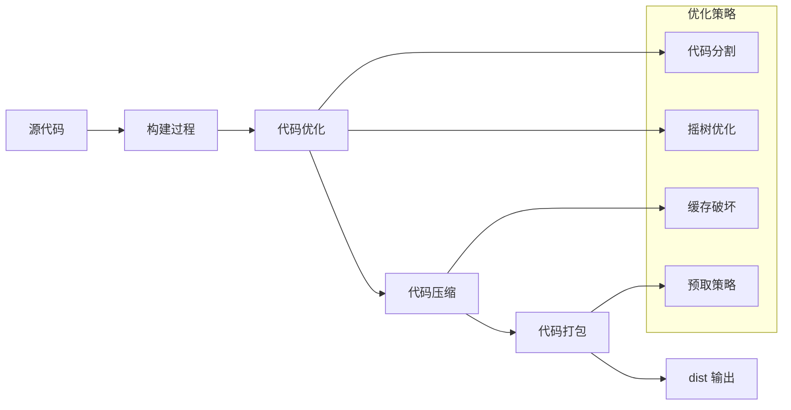
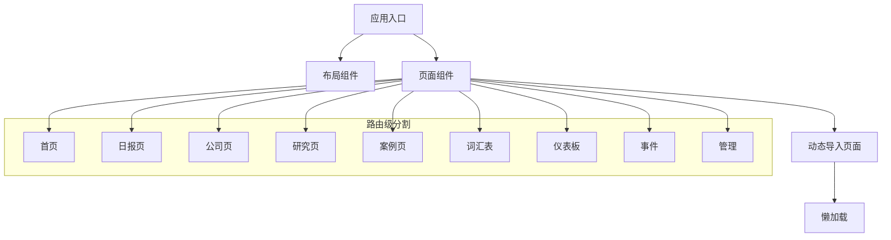
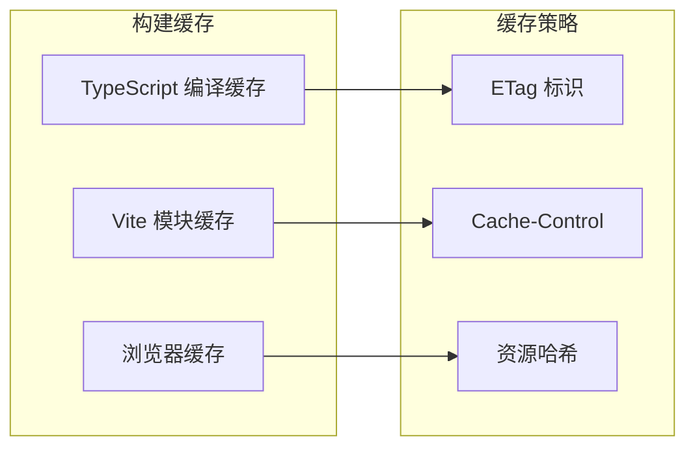
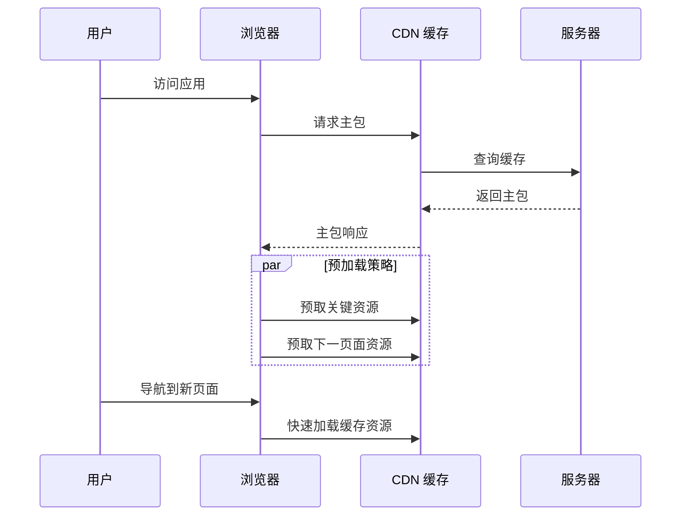

# 构建配置

<cite>
**本文档引用的文件**
- [vite.config.ts](file://vite.config.ts)
- [package.json](file://package.json)
- [tsconfig.json](file://tsconfig.json)
- [tsconfig.scripts.json](file://tsconfig.scripts.json)
- [postcss.config.js](file://postcss.config.js)
- [tailwind.config.js](file://tailwind.config.js)
- [index.html](file://index.html)
- [src/main.tsx](file://src/main.tsx)
- [src/App.tsx](file://src/App.tsx)
- [vercel.json](file://vercel.json)
</cite>

## 目录
1. [简介](#简介)
2. [项目结构](#项目结构)
3. [核心组件](#核心组件)
4. [架构概览](#架构概览)
5. [详细组件分析](#详细组件分析)
6. [依赖关系分析](#依赖关系分析)
7. [性能考虑](#性能考虑)
8. [故障排除指南](#故障排除指南)
9. [结论](#结论)
10. [附录](#附录)

## 简介

本项目采用现代前端构建工具链，基于 Vite 5.x 和 React 18.x 构建。项目实现了完整的 TypeScript 类型检查、Tailwind CSS 样式系统、PostCSS 预处理器以及 React Router 路由管理。本文档深入解析了项目的构建配置，包括 Vite 插件设置、路径别名配置、开发服务器设置、TypeScript 编译配置、PostCSS 样式处理、代码分割策略等关键配置选项，并提供了生产环境构建优化、缓存配置、预加载策略等最佳实践指南。

## 项目结构

该项目采用标准的 Vite + React + TypeScript 项目结构，主要特点如下：



**图表来源**
- [vite.config.ts:1-21](file://vite.config.ts#L1-L21)
- [package.json:1-36](file://package.json#L1-L36)
- [tsconfig.json:1-25](file://tsconfig.json#L1-L25)

**章节来源**
- [vite.config.ts:1-21](file://vite.config.ts#L1-L21)
- [package.json:1-36](file://package.json#L1-L36)
- [tsconfig.json:1-25](file://tsconfig.json#L1-L25)

## 核心组件

### Vite 构建配置

项目的核心构建配置位于 `vite.config.ts` 文件中，定义了以下关键配置：

- **插件系统**: 使用官方 React 插件提供 JSX 转换和开发时热更新支持
- **路径别名**: 配置 `@` 别名指向 `src` 目录，便于模块导入
- **开发服务器**: 设置端口 3000，自动打开浏览器
- **构建输出**: 输出到 `dist` 目录，启用 Source Map

### TypeScript 编译配置

TypeScript 配置文件提供了严格的类型检查和现代化的编译选项：

- **目标平台**: ES2020
- **模块系统**: ESNext 与 bundler 解析器
- **严格模式**: 启用严格类型检查
- **路径映射**: 与 Vite 配置保持一致的 `@/*` 路径别名

### PostCSS 和 Tailwind 集成

通过 PostCSS 和 Tailwind CSS 实现现代化的样式处理：

- **PostCSS 插件**: Tailwind CSS 和 Autoprefixer
- **Tailwind 配置**: 自定义主题、颜色系统、动画效果
- **内容扫描**: 配置文件指定需要扫描样式的文件范围

**章节来源**
- [vite.config.ts:5-20](file://vite.config.ts#L5-L20)
- [tsconfig.json:2-24](file://tsconfig.json#L2-L24)
- [postcss.config.js:1-7](file://postcss.config.js#L1-L7)
- [tailwind.config.js:1-60](file://tailwind.config.js#L1-L60)

## 架构概览

项目构建架构采用分层设计，各组件协同工作以实现高效的开发体验和优化的生产构建：



**图表来源**
- [vite.config.ts:6-19](file://vite.config.ts#L6-L19)
- [postcss.config.js:1-7](file://postcss.config.js#L1-L7)
- [tailwind.config.js:3-59](file://tailwind.config.js#L3-L59)

## 详细组件分析

### Vite 插件配置分析

项目使用官方 React 插件提供核心功能：



**图表来源**
- [vite.config.ts:6-19](file://vite.config.ts#L6-L19)

插件配置的关键特性：
- **React 插件**: 提供 JSX 转换、开发时 HMR 支持
- **路径别名**: `@` 指向 `src` 目录，简化模块导入
- **开发服务器**: 端口 3000，自动打开浏览器
- **Source Map**: 生产环境启用调试信息

**章节来源**
- [vite.config.ts:6-19](file://vite.config.ts#L6-L19)

### TypeScript 编译配置详解

TypeScript 配置体现了现代化的开发实践：



**图表来源**
- [tsconfig.json:2-24](file://tsconfig.json#L2-L24)

关键配置要点：
- **目标平台**: ES2020，支持现代 JavaScript 特性
- **模块解析**: 使用 bundler 解析器，与 Vite 兼容
- **严格模式**: 启用全面的类型检查
- **路径映射**: 与 Vite 配置保持一致

**章节来源**
- [tsconfig.json:2-24](file://tsconfig.json#L2-L24)
- [tsconfig.scripts.json:2-11](file://tsconfig.scripts.json#L2-L11)

### PostCSS 和 Tailwind 样式处理

样式处理管道采用 PostCSS 生态系统：

```mermaid
flowchart TD
START[样式输入] --> TAILWIND[Tailwind CSS 扫描]
TAILWIND --> POSTCSS[PostCSS 处理]
POSTCSS --> AUTOPREFIXER[Autoprefixer]
AUTOPREFIXER --> OUTPUT[优化后的 CSS]
subgraph "Tailwind 配置"
CONTENT[content: ./index.html, ./src/**/*.{js,ts,jsx,tsx}]
THEME[自定义主题和颜色]
DARKMODE[暗色模式支持]
end
subgraph "PostCSS 插件"
TAILWIND_PLUGIN[Tailwind CSS 插件]
AUTO_PREFIX[Autoprefixer 插件]
end
CONTENT --> TAILWIND
THEME --> TAILWIND
DARKMODE --> TAILWIND
TAILWIND --> TAILWIND_PLUGIN
POSTCSS --> AUTO_PREFIX
```

**图表来源**
- [postcss.config.js:1-7](file://postcss.config.js#L1-L7)
- [tailwind.config.js:3-59](file://tailwind.config.js#L3-L59)

样式系统的特色功能：
- **内容扫描**: 精确识别需要生成样式的文件
- **自定义主题**: 定制品牌色彩和字体系统
- **动画系统**: 内置淡入、滑动等动画效果
- **暗色模式**: 基于类名的暗色模式支持

**章节来源**
- [postcss.config.js:1-7](file://postcss.config.js#L1-L7)
- [tailwind.config.js:1-60](file://tailwind.config.js#L1-L60)

### 开发服务器配置

开发服务器提供优化的开发体验：



**图表来源**
- [vite.config.ts:12-15](file://vite.config.ts#L12-L15)

开发服务器特性：
- **端口配置**: 3000 端口，避免与其他服务冲突
- **自动打开**: 开发时自动在浏览器中打开应用
- **热模块替换**: 支持快速的代码更新反馈

**章节来源**
- [vite.config.ts:12-15](file://vite.config.ts#L12-L15)

### 生产环境构建配置

生产构建配置确保应用的最佳性能：



**图表来源**
- [vite.config.ts:16-19](file://vite.config.ts#L16-L19)

生产构建特性：
- **输出目录**: `dist` 目录，标准化的构建产物
- **Source Map**: 启用调试信息，便于问题排查
- **代码压缩**: 通过 Vite 默认配置实现

**章节来源**
- [vite.config.ts:16-19](file://vite.config.ts#L16-L19)

## 依赖关系分析

项目依赖关系展现了清晰的技术栈层次：

```mermaid
graph TB
subgraph "运行时依赖"
REACT[react: ^18.3.1]
REACT_DOM[react-dom: ^18.3.1]
ROUTER[react-router-dom: ^6.26.0]
LIBS[其他业务库]
end
subgraph "开发时依赖"
VITE[vite: ^5.4.0]
TYPESCRIPT[typescript: ^5.5.3]
REACT_PLUGIN[@vitejs/plugin-react: ^4.3.1]
POSTCSS[postcss: ^8.4.41]
TAILWIND[tailwindcss: ^3.4.10]
AUTOPREFIXER[autoprefixer: ^10.4.20]
end
subgraph "脚本工具"
TSX[tsx: ^4.19.0]
NODE_TYPES[@types/node: ^26.0.0]
end
REACT --> REACT_DOM
REACT --> ROUTER
REACT --> LIBS
VITE --> REACT_PLUGIN
VITE --> POSTCSS
POSTCSS --> TAILWIND
POSTCSS --> AUTOPREFIXER
TYPESCRIPT --> TSX
```

**图表来源**
- [package.json:12-34](file://package.json#L12-L34)

依赖关系特点：
- **React 生态**: 完整的 React 生态系统集成
- **现代工具链**: Vite 5.x + TypeScript 5.x 的最新组合
- **样式系统**: PostCSS + Tailwind CSS 的现代化样式方案
- **开发工具**: 全面的开发时工具支持

**章节来源**
- [package.json:12-34](file://package.json#L12-L34)

## 性能考虑

### 代码分割策略

项目采用动态导入实现智能代码分割：



**图表来源**
- [src/App.tsx:14-34](file://src/App.tsx#L14-L34)

### 缓存配置策略



### 预加载和预取策略



## 故障排除指南

### 常见构建问题

1. **TypeScript 类型错误**
   - 检查 `tsconfig.json` 中的严格模式配置
   - 确保路径别名配置与实际目录结构匹配

2. **样式不生效**
   - 验证 Tailwind 配置中的 content 路径
   - 检查 PostCSS 插件顺序是否正确

3. **开发服务器无法启动**
   - 确认端口 3000 未被占用
   - 检查防火墙设置

4. **生产构建失败**
   - 验证 `package.json` 中的构建脚本
   - 检查 `vite.config.ts` 的输出配置

### 性能优化建议

1. **开发时优化**
   - 启用 HMR 以获得更快的热更新
   - 使用合适的 TypeScript 编译选项

2. **生产时优化**
   - 启用代码压缩和 Tree Shaking
   - 实施合理的缓存策略
   - 优化资源加载顺序

**章节来源**
- [vite.config.ts:16-19](file://vite.config.ts#L16-L19)
- [tsconfig.json:14-18](file://tsconfig.json#L14-L18)
- [postcss.config.js:1-7](file://postcss.config.js#L1-L7)

## 结论

本项目构建配置展现了现代前端开发的最佳实践，通过 Vite + React + TypeScript + Tailwind CSS 的技术栈组合，实现了高性能的开发体验和优化的生产构建。配置文件简洁而功能完整，涵盖了从开发到生产的全生命周期需求。

关键优势包括：
- **开发体验**: 快速的热更新和错误提示
- **构建性能**: 智能的代码分割和缓存策略
- **样式系统**: 现代化的 CSS 处理和定制能力
- **类型安全**: 全面的 TypeScript 类型检查

建议在现有配置基础上继续探索：
- 实施更精细的代码分割策略
- 优化资源加载优先级
- 添加构建性能监控
- 实施更完善的缓存策略

## 附录

### 配置文件参考

#### Vite 配置参数说明

| 参数 | 类型 | 默认值 | 说明 |
|------|------|--------|------|
| plugins | Array | [] | 插件数组 |
| resolve.alias | Object | {} | 路径别名配置 |
| server.port | number | 5173 | 开发服务器端口 |
| server.open | boolean | false | 启动时自动打开浏览器 |
| build.outDir | string | dist | 输出目录 |
| build.sourcemap | boolean | false | 是否生成 Source Map |

#### TypeScript 编译选项

| 选项 | 值 | 说明 |
|------|-----|------|
| target | ES2020 | 目标 JavaScript 版本 |
| module | ESNext | 模块系统 |
| moduleResolution | bundler | 模块解析器 |
| strict | true | 启用严格模式 |
| jsx | react-jsx | JSX 处理方式 |

#### Tailwind 配置要点

- **content**: 指定样式扫描范围
- **darkMode**: 支持暗色模式切换
- **theme.extend**: 自定义主题扩展
- **plugins**: 插件系统