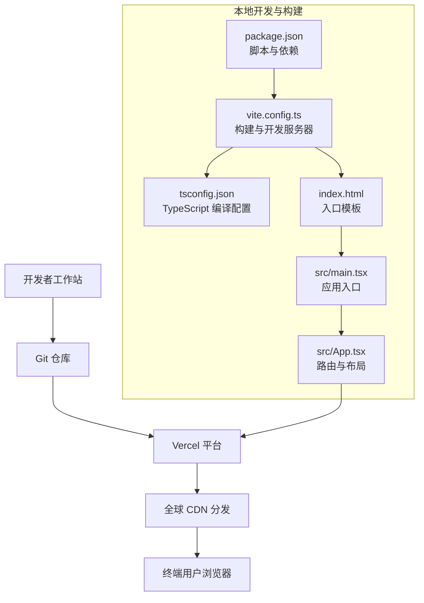
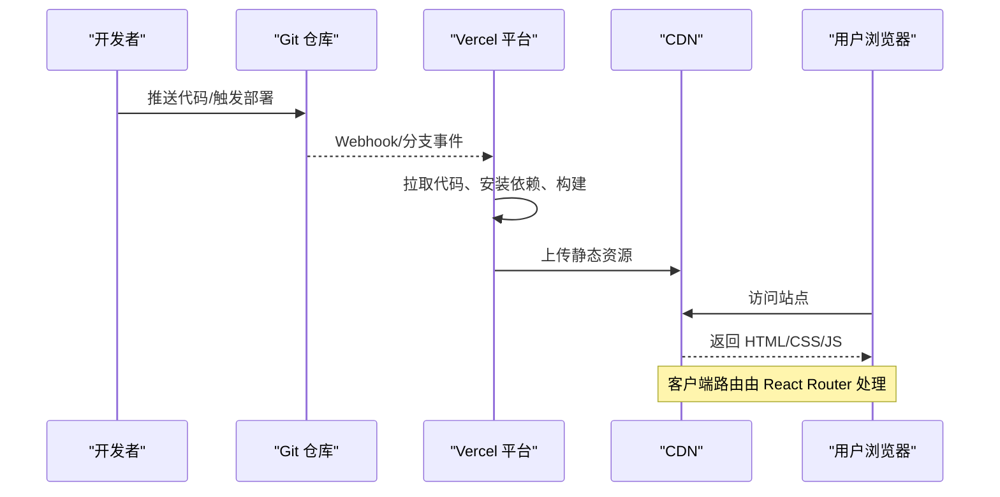
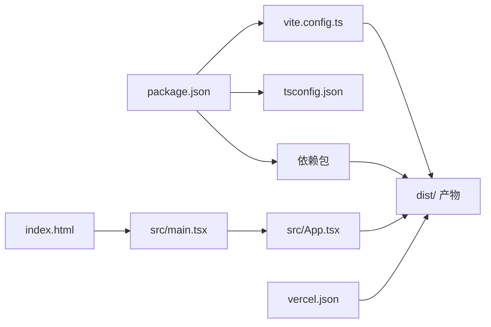

# 部署策略

<cite>
**本文引用的文件**
- [vercel.json](file://vercel.json)
- [package.json](file://package.json)
- [vite.config.ts](file://vite.config.ts)
- [tailwind.config.js](file://tailwind.config.js)
- [postcss.config.js](file://postcss.config.js)
- [tsconfig.json](file://tsconfig.json)
- [index.html](file://index.html)
- [src/main.tsx](file://src/main.tsx)
- [src/App.tsx](file://src/App.tsx)
</cite>

## 目录
1. [简介](#简介)
2. [项目结构](#项目结构)
3. [核心组件](#核心组件)
4. [架构总览](#架构总览)
5. [详细组件分析](#详细组件分析)
6. [依赖关系分析](#依赖关系分析)
7. [性能考虑](#性能考虑)
8. [故障排查指南](#故障排查指南)
9. [结论](#结论)
10. [附录](#附录)

## 简介
本部署策略文档面向“未来组织·HR洞察日报”项目，提供从开发到上线的完整部署与运维实践说明。重点覆盖以下方面：
- Vercel 静态站点部署配置与路由重写规则
- 环境变量管理与安全实践
- 域名绑定与 HTTPS 设置
- Git 工作流与自动化部署建议
- CI/CD 流水线与自动化测试集成思路
- 部署回滚机制与版本控制策略
- CDN 与缓存策略
- 监控告警、错误追踪与性能优化
- 运维团队可直接执行的操作指南

## 项目结构
该项目为基于 Vite + React 的前端单页应用（SPA），采用 React Router 实现客户端路由；通过 Vercel 平台进行静态站点托管。构建产物输出至 dist 目录，使用 TailwindCSS 作为样式框架，并在本地开发时启用源码映射以便调试。

图表来源
- [package.json:1-36](file://package.json#L1-L36)
- [vite.config.ts:1-21](file://vite.config.ts#L1-L21)
- [tsconfig.json:1-25](file://tsconfig.json#L1-L25)
- [index.html:1-18](file://index.html#L1-L18)
- [src/main.tsx:1-11](file://src/main.tsx#L1-L11)
- [src/App.tsx:1-35](file://src/App.tsx#L1-L35)

章节来源
- [package.json:1-36](file://package.json#L1-L36)
- [vite.config.ts:1-21](file://vite.config.ts#L1-L21)
- [tsconfig.json:1-25](file://tsconfig.json#L1-L25)
- [index.html:1-18](file://index.html#L1-L18)
- [src/main.tsx:1-11](file://src/main.tsx#L1-L11)
- [src/App.tsx:1-35](file://src/App.tsx#L1-L35)

## 核心组件
- 构建与打包：Vite 负责开发服务器与生产构建，输出目录为 dist；TypeScript 编译器参与预构建流程；TailwindCSS 与 PostCSS 提供样式处理。
- 应用入口与路由：index.html 作为 SPA 入口，src/main.tsx 渲染根节点，src/App.tsx 定义多页面路由与布局包装。
- 静态托管与路由：vercel.json 使用重写规则将所有路径指向 index.html，以支持 React Router 客户端路由。

章节来源
- [vite.config.ts:1-21](file://vite.config.ts#L1-L21)
- [tsconfig.json:1-25](file://tsconfig.json#L1-L25)
- [index.html:1-18](file://index.html#L1-L18)
- [src/main.tsx:1-11](file://src/main.tsx#L1-L11)
- [src/App.tsx:1-35](file://src/App.tsx#L1-L35)
- [vercel.json:1-6](file://vercel.json#L1-L6)

## 架构总览
下图展示了从代码提交到用户访问的关键路径，以及 Vercel 在其中的角色。

图表来源
- [vercel.json:1-6](file://vercel.json#L1-L6)
- [package.json:6-11](file://package.json#L6-L11)
- [vite.config.ts:16-20](file://vite.config.ts#L16-L20)

## 详细组件分析

### Vercel 部署配置
- 路由重写：通过重写规则将所有请求转发至 index.html，确保客户端路由正常工作。
- 构建命令：使用 package.json 中的 build 脚本完成 TypeScript 预构建与 Vite 生产构建。
- 输出目录：遵循 vite.config.ts 中的 outDir 配置。
- 开发服务器：本地开发使用 Vite 默认端口与自动打开浏览器功能。

章节来源
- [vercel.json:1-6](file://vercel.json#L1-L6)
- [package.json:6-11](file://package.json#L6-L11)
- [vite.config.ts:16-20](file://vite.config.ts#L16-L20)

### 环境变量管理
- 作用域：仅在构建期生效的环境变量将被内联到最终产物中；运行时敏感信息应通过平台提供的密钥管理或后端服务注入。
- 建议：将 API 地址、分析埋点 ID 等配置放入受控的环境变量；避免在前端硬编码敏感值。
- 变量命名：统一前缀（如 NEXT_PUBLIC_ 用于客户端可见变量）以减少误用风险。

章节来源
- [package.json:6-11](file://package.json#L6-L11)
- [vite.config.ts:16-20](file://vite.config.ts#L16-L20)

### 域名绑定与 HTTPS
- 绑定域名：在 Vercel 控制台添加自定义域名并配置 DNS 记录。
- HTTPS：Vercel 自动签发与续期证书；可启用强制 HTTPS 或自定义证书（如需）。
- 缓存与压缩：利用 Vercel 的全球 CDN 与 HTTP/2、Brotli/Gzip 压缩提升加载速度。

章节来源
- [vercel.json:1-6](file://vercel.json#L1-L6)

### Git 工作流与自动化部署
- 主干保护：master/main 分支启用保护规则，禁止直接推送，必须通过 Pull Request 合并。
- 分支策略：feature/* 开发分支，release/* 预发布分支，hotfix/* 紧急修复分支。
- 自动化：在 Vercel 中关联 Git 仓库，选择目标分支自动部署；可配置预览部署与生产分支独立部署。
- 提交规范：建议采用约定式提交，便于生成变更日志与语义化版本。

章节来源
- [package.json:6-11](file://package.json#L6-L11)
- [vercel.json:1-6](file://vercel.json#L1-L6)

### CI/CD 流水线与测试集成
- 构建阶段：拉取代码 → 安装依赖 → TypeScript 类型检查 → Vite 构建 → 生成产物。
- 测试阶段：在构建后增加单元测试与端到端测试步骤（如 jest/cypress/vitest）。
- 发布阶段：将 dist 目录部署至 Vercel；记录构建号与哈希，支持快速回滚。
- 回滚策略：通过平台回滚到上一个稳定版本；或切换到上一个已标记的 Git 标签。

章节来源
- [package.json:6-11](file://package.json#L6-L11)
- [vite.config.ts:16-20](file://vite.config.ts#L16-L20)

### 静态站点部署与缓存策略
- 静态资源：HTML、CSS、JS、图片等全部由 Vercel CDN 分发。
- 缓存策略：利用浏览器缓存与 CDN 缓存；对内容不变的静态资源设置长缓存；对 index.html 设置较短缓存或不缓存以保证路由更新。
- 版本化：通过文件指纹（如 [name].[contenthash].js）实现强缓存与增量更新。

章节来源
- [vercel.json:1-6](file://vercel.json#L1-L6)
- [vite.config.ts:16-20](file://vite.config.ts#L16-L20)

### 监控告警、错误追踪与性能优化
- 错误追踪：接入前端错误上报（如 Sentry），在应用入口捕获未处理异常并上报。
- 性能监控：关注 TTFB、FCP、LCP、INP 等指标；结合 Vercel 分析工具与浏览器性能面板。
- 优化手段：代码分割、懒加载、图片优化、字体优化、禁用不必要的动画与特效。
- 告警：对 5xx 错误率、响应时间、缓存命中率设置阈值告警。

章节来源
- [src/main.tsx:1-11](file://src/main.tsx#L1-L11)
- [src/App.tsx:1-35](file://src/App.tsx#L1-L35)

## 依赖关系分析
项目主要依赖链路如下：package.json 声明依赖与脚本；vite.config.ts 配置构建与开发服务器；tsconfig.json 控制编译行为；index.html 提供入口模板；src/main.tsx 与 src/App.tsx 组成应用逻辑；vercel.json 决定路由重写与部署行为。

图表来源
- [package.json:1-36](file://package.json#L1-L36)
- [vite.config.ts:1-21](file://vite.config.ts#L1-L21)
- [tsconfig.json:1-25](file://tsconfig.json#L1-L25)
- [index.html:1-18](file://index.html#L1-L18)
- [src/main.tsx:1-11](file://src/main.tsx#L1-L11)
- [src/App.tsx:1-35](file://src/App.tsx#L1-L35)
- [vercel.json:1-6](file://vercel.json#L1-L6)

章节来源
- [package.json:1-36](file://package.json#L1-L36)
- [vite.config.ts:1-21](file://vite.config.ts#L1-L21)
- [tsconfig.json:1-25](file://tsconfig.json#L1-L25)
- [index.html:1-18](file://index.html#L1-L18)
- [src/main.tsx:1-11](file://src/main.tsx#L1-L11)
- [src/App.tsx:1-35](file://src/App.tsx#L1-L35)
- [vercel.json:1-6](file://vercel.json#L1-L6)

## 性能考虑
- 构建优化：开启源码映射便于定位问题；在生产构建中按需生成 Source Map。
- 资源优化：使用 TailwindCSS 的 purge 功能移除未使用样式；对图片与字体进行压缩与格式优化。
- 运行时优化：合理拆分代码块，按需加载页面组件；减少首屏渲染阻塞；避免在首屏执行重型计算。
- 缓存策略：对静态资源设置长缓存；对 HTML 设置短缓存；利用 ETag/Last-Modified 实现条件请求。

章节来源
- [vite.config.ts:16-20](file://vite.config.ts#L16-L20)
- [tailwind.config.js:1-60](file://tailwind.config.js#L1-L60)
- [postcss.config.js:1-7](file://postcss.config.js#L1-L7)

## 故障排查指南
- 路由 404：确认 vercel.json 的重写规则是否正确；检查构建产物是否包含 index.html。
- 构建失败：查看构建日志中的依赖安装与类型检查错误；核对 package.json 脚本与 vite.config.ts 配置。
- 样式异常：检查 Tailwind 配置的 content 路径与 PostCSS 插件顺序；确认字体资源可访问。
- 性能退化：使用浏览器性能面板分析瓶颈；对比缓存命中率与资源体积；审查第三方依赖大小。
- 回滚操作：在 Vercel 控制台选择历史部署进行回滚；或切换到稳定的 Git 标签重新部署。

章节来源
- [vercel.json:1-6](file://vercel.json#L1-L6)
- [package.json:6-11](file://package.json#L6-L11)
- [vite.config.ts:16-20](file://vite.config.ts#L16-L20)
- [tailwind.config.js:1-60](file://tailwind.config.js#L1-L60)
- [postcss.config.js:1-7](file://postcss.config.js#L1-L7)

## 结论
本部署策略围绕 Vercel 静态站点托管展开，结合 React Router 客户端路由与 Vite 构建体系，形成一套可扩展、可观测、可回滚的前端交付方案。通过严格的 Git 工作流、CI/CD 流水线与缓存策略，可在保障质量的同时提升交付效率与用户体验。

## 附录
- 运维操作清单
  - 新增自定义域名：在 Vercel 控制台添加域名并配置 DNS。
  - 设置环境变量：在项目设置中添加密钥与公开变量。
  - 触发部署：推送代码至关联分支或手动在控制台触发。
  - 查看日志：在 Vercel 控制台查看构建与访问日志。
  - 回滚版本：选择历史部署进行回滚或切换到稳定标签。
- 最佳实践
  - 将敏感信息置于环境变量或后端服务。
  - 对静态资源启用长期缓存与指纹命名。
  - 使用预览部署验证 PR 变更后再合并至主分支。
  - 定期审查第三方依赖的安全与体积。