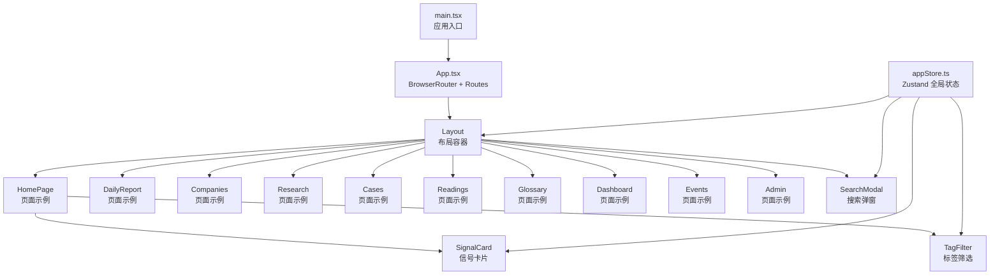
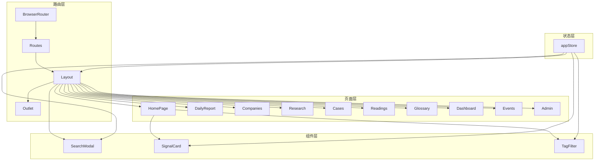
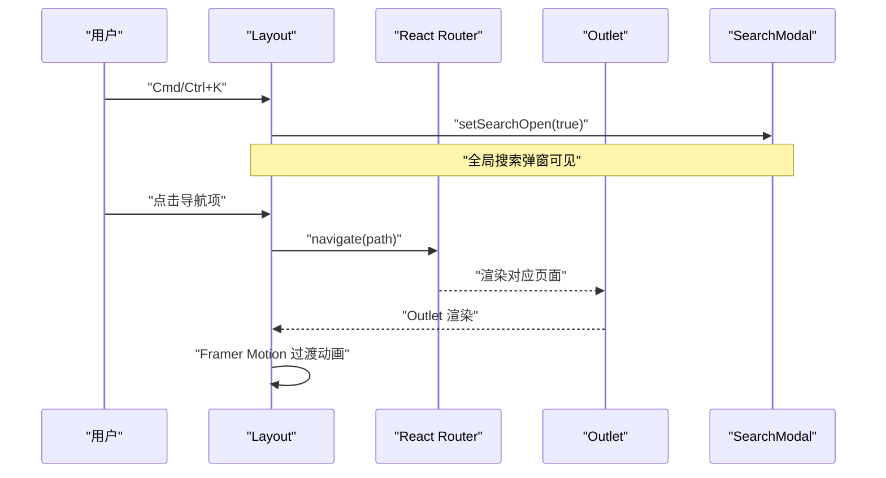
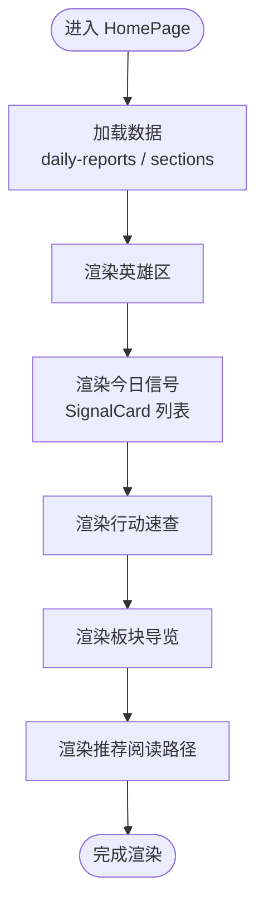
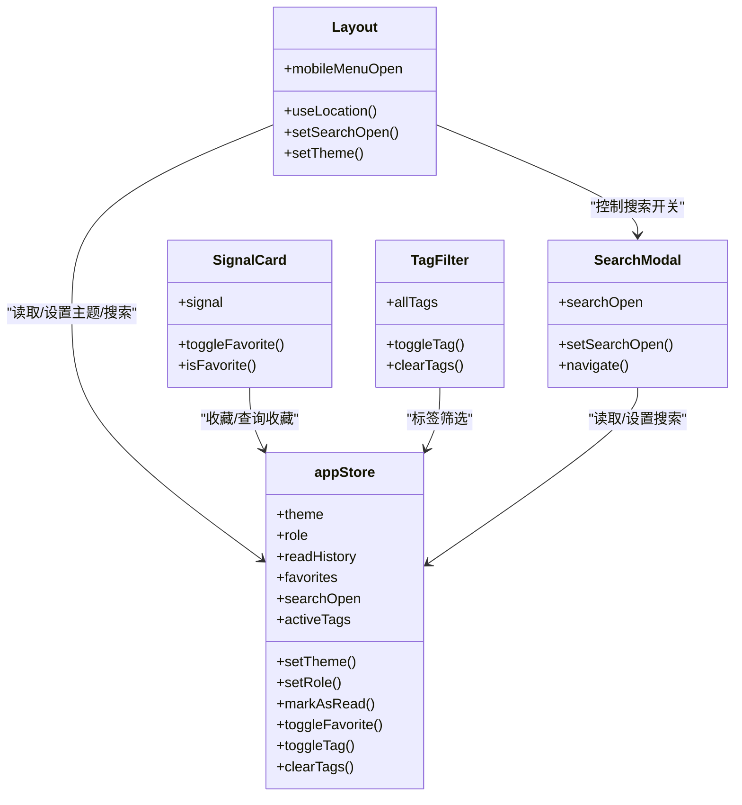
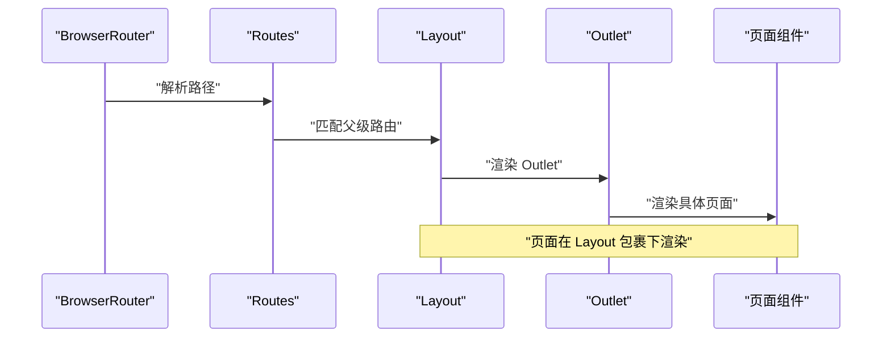
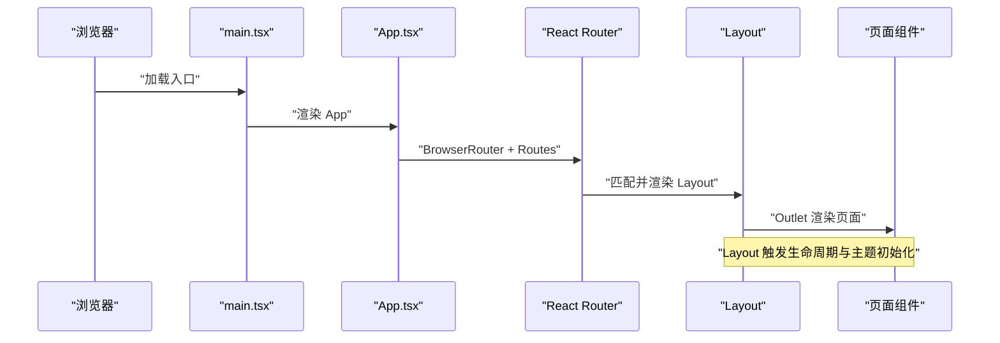
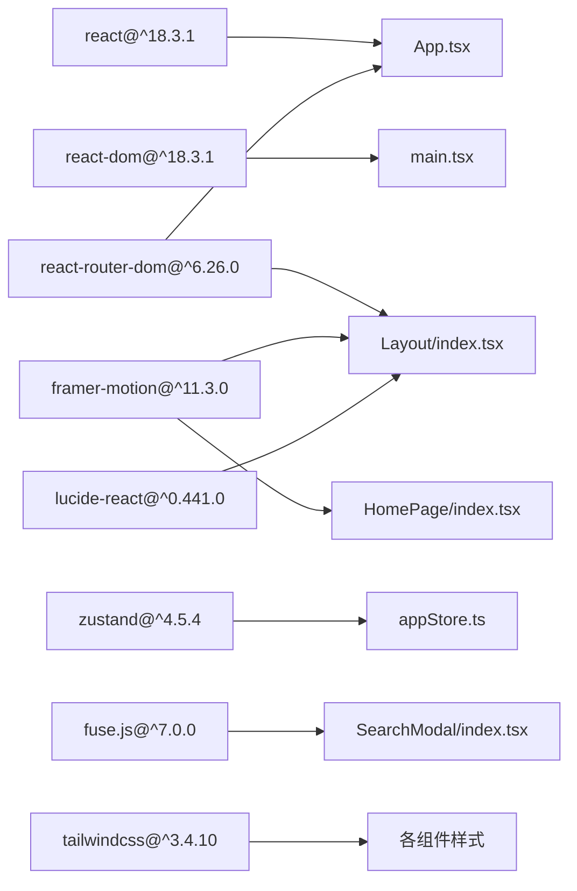

# 前端架构设计

<cite>
**本文引用的文件**
- [src/App.tsx](file://src/App.tsx)
- [src/main.tsx](file://src/main.tsx)
- [src/components/Layout/index.tsx](file://src/components/Layout/index.tsx)
- [src/components/SearchModal/index.tsx](file://src/components/SearchModal/index.tsx)
- [src/components/SignalCard/index.tsx](file://src/components/SignalCard/index.tsx)
- [src/components/TagFilter/index.tsx](file://src/components/TagFilter/index.tsx)
- [src/pages/HomePage/index.tsx](file://src/pages/HomePage/index.tsx)
- [src/stores/appStore.ts](file://src/stores/appStore.ts)
- [src/types/index.ts](file://src/types/index.ts)
- [src/data/daily-reports.ts](file://src/data/daily-reports.ts)
- [src/data/sections.ts](file://src/data/sections.ts)
- [package.json](file://package.json)
- [vite.config.ts](file://vite.config.ts)
</cite>

## 目录
1. [引言](#引言)
2. [项目结构](#项目结构)
3. [核心组件](#核心组件)
4. [架构总览](#架构总览)
5. [组件详解](#组件详解)
6. [依赖关系分析](#依赖关系分析)
7. [性能考量](#性能考量)
8. [故障排查指南](#故障排查指南)
9. [结论](#结论)
10. [附录](#附录)

## 引言
本文件面向前端开发者，系统性阐述基于 React 18.3.1 的组件化架构设计，涵盖组件分层、父子关系、通信机制、布局与页面组织、组件复用策略、客户端路由（React Router DOM）配置与使用、应用启动流程与入口点、以及生命周期管理。目标是帮助读者快速理解并高效实践该架构。

## 项目结构
项目采用“按功能域分层 + 组件复用”的组织方式：
- 应用入口与路由：main.tsx 负责挂载根节点，App.tsx 配置 BrowserRouter 与 Routes，统一承载页面路由与全局布局容器。
- 布局层：Layout 提供顶部导航、移动端菜单、主题切换、搜索快捷键、页面内容区域与页脚。
- 页面层：各业务页面（如 HomePage、DailyReport、Companies、Research、Cases、Readings、Glossary、Dashboard、Events、Admin）按模块划分，共享布局。
- 组件层：可复用的 UI 组件（SignalCard、TagFilter、SearchModal）与布局容器（Layout）组合形成页面。
- 数据与类型：types 定义跨模块的数据契约；data 提供静态数据（如 daily-reports、sections）。
- 状态管理：Zustand appStore 提供主题、用户角色、阅读历史、收藏、搜索状态、标签筛选等全局状态。
- 构建与别名：Vite 配置 @ 别名指向 src，便于统一导入路径；package.json 指定 React 18.3.1 与 react-router-dom 版本。

图表来源
- [src/main.tsx:1-11](file://src/main.tsx#L1-L11)
- [src/App.tsx:15-35](file://src/App.tsx#L15-L35)
- [src/components/Layout/index.tsx:23-175](file://src/components/Layout/index.tsx#L23-L175)
- [src/stores/appStore.ts:35-92](file://src/stores/appStore.ts#L35-L92)

章节来源
- [src/main.tsx:1-11](file://src/main.tsx#L1-L11)
- [src/App.tsx:15-35](file://src/App.tsx#L15-L35)
- [vite.config.ts:1-21](file://vite.config.ts#L1-L21)
- [package.json:12-34](file://package.json#L12-L34)

## 核心组件
- 布局容器 Layout：负责导航、移动端菜单、主题切换、键盘快捷键打开搜索、页面内容动画过渡与页脚。
- 搜索弹窗 SearchModal：全局搜索入口，支持 Fuse.js 模糊检索、结果高亮、路由跳转。
- 信号卡片 SignalCard：展示信号标题、摘要、优先级、来源、标签、收藏、展开详情、关联公司。
- 标签筛选 TagFilter：集中式标签过滤 UI，支持清空与切换激活状态。
- 页面组件 HomePage：首页聚合展示，包含今日信号、行动速查、板块导览、推荐阅读路径等。
- 全局状态 appStore：主题、用户角色、阅读历史、收藏、搜索开关、活动标签集合等。

章节来源
- [src/components/Layout/index.tsx:23-175](file://src/components/Layout/index.tsx#L23-L175)
- [src/components/SearchModal/index.tsx:47-156](file://src/components/SearchModal/index.tsx#L47-L156)
- [src/components/SignalCard/index.tsx:26-111](file://src/components/SignalCard/index.tsx#L26-L111)
- [src/components/TagFilter/index.tsx:9-49](file://src/components/TagFilter/index.tsx#L9-L49)
- [src/pages/HomePage/index.tsx:25-213](file://src/pages/HomePage/index.tsx#L25-L213)
- [src/stores/appStore.ts:35-92](file://src/stores/appStore.ts#L35-L92)

## 架构总览
应用采用“路由驱动 + 布局包裹 + 组件复用 + 全局状态”的架构模式：
- 路由系统：BrowserRouter 包裹 Routes，Layout 作为嵌套路由的父级容器，子路由渲染 Outlet。
- 布局系统：Layout 统一处理导航、移动端菜单、主题、搜索快捷键与页面动画过渡。
- 组件系统：可复用组件（SignalCard、TagFilter、SearchModal）在页面中组合使用，降低重复开发。
- 状态系统：Zustand appStore 提供轻量全局状态，持久化存储关键偏好与行为数据。

图表来源
- [src/App.tsx:15-35](file://src/App.tsx#L15-L35)
- [src/components/Layout/index.tsx:23-175](file://src/components/Layout/index.tsx#L23-L175)
- [src/stores/appStore.ts:35-92](file://src/stores/appStore.ts#L35-L92)

## 组件详解

### 布局组件 Layout 设计模式
- 导航与激活态：根据当前路径计算导航项激活态，支持桌面与移动端两套导航。
- 主题切换：支持 light/dark/system 三态循环切换，并同步到 HTML 根元素类名。
- 搜索快捷键：监听 Cmd/Ctrl+K 打开全局搜索弹窗。
- 页面动画：使用 Framer Motion 对 Outlet 内容进行淡入/滑动过渡。
- 移动端菜单：使用 AnimatePresence 控制展开/收起动画。
- 页脚：统一版权信息与标语。

图表来源
- [src/components/Layout/index.tsx:29-46](file://src/components/Layout/index.tsx#L29-L46)
- [src/components/Layout/index.tsx:154-164](file://src/components/Layout/index.tsx#L154-L164)
- [src/components/SearchModal/index.tsx:47-156](file://src/components/SearchModal/index.tsx#L47-L156)

章节来源
- [src/components/Layout/index.tsx:23-175](file://src/components/Layout/index.tsx#L23-L175)

### 页面组件组织方式
- HomePage：作为首页聚合页，组合 SignalCard、TagFilter、Section 导航等组件，展示今日信号、行动速查、板块导览与推荐阅读路径。
- 其他页面：DailyReport、Companies、Research、Cases、Readings、Glossary、Dashboard、Events、Admin 以类似方式组织，均在 Layout 下通过路由渲染。

图表来源
- [src/pages/HomePage/index.tsx:25-213](file://src/pages/HomePage/index.tsx#L25-L213)
- [src/data/daily-reports.ts:1-455](file://src/data/daily-reports.ts#L1-L455)
- [src/data/sections.ts:1-13](file://src/data/sections.ts#L1-L13)

章节来源
- [src/pages/HomePage/index.tsx:25-213](file://src/pages/HomePage/index.tsx#L25-L213)

### 组件通信机制
- 父子通信：Layout 通过 Outlet 传递页面上下文；页面向子组件传递 props（如 SignalCard 的 signal）。
- 全局状态：appStore 通过 hooks 在任意层级访问与修改状态，实现跨组件共享（主题、搜索、标签、收藏、阅读历史）。
- 路由通信：useNavigate 用于页面内跳转；useLocation 用于导航激活态与动画 key。

图表来源
- [src/components/Layout/index.tsx:23-175](file://src/components/Layout/index.tsx#L23-L175)
- [src/components/SearchModal/index.tsx:47-156](file://src/components/SearchModal/index.tsx#L47-L156)
- [src/components/SignalCard/index.tsx:26-111](file://src/components/SignalCard/index.tsx#L26-L111)
- [src/components/TagFilter/index.tsx:9-49](file://src/components/TagFilter/index.tsx#L9-L49)
- [src/stores/appStore.ts:35-92](file://src/stores/appStore.ts#L35-L92)

章节来源
- [src/stores/appStore.ts:35-92](file://src/stores/appStore.ts#L35-L92)

### 客户端路由系统（React Router DOM）
- 路由配置：BrowserRouter 包裹 Routes；Layout 作为根路由元素，子路由渲染 Outlet。
- 路由项：包含首页与各业务页面路径映射。
- 嵌套路由：Layout 作为父级容器，子路由在 Outlet 中渲染。
- 路由守卫：当前未实现显式守卫，可通过在 Layout 或页面中读取 appStore 中的角色状态进行条件渲染或跳转。
- 懒加载：当前页面组件为同步导入；如需懒加载，可结合 React.lazy 与 Suspense 在路由层实现。

图表来源
- [src/App.tsx:15-35](file://src/App.tsx#L15-L35)
- [src/components/Layout/index.tsx:162-162](file://src/components/Layout/index.tsx#L162-L162)

章节来源
- [src/App.tsx:15-35](file://src/App.tsx#L15-L35)

### 应用启动流程与入口点
- main.tsx：创建根节点，StrictMode 包裹，渲染 App。
- App.tsx：BrowserRouter 包裹 Routes，定义路由与布局容器。
- 组件生命周期：Layout 在每次路径变更时触发 useEffect 初始化主题与键盘事件；页面组件在首次渲染时加载数据并渲染 UI。

图表来源
- [src/main.tsx:6-10](file://src/main.tsx#L6-L10)
- [src/App.tsx:15-35](file://src/App.tsx#L15-L35)
- [src/components/Layout/index.tsx:29-46](file://src/components/Layout/index.tsx#L29-L46)

章节来源
- [src/main.tsx:1-11](file://src/main.tsx#L1-L11)
- [src/App.tsx:15-35](file://src/App.tsx#L15-L35)

### 组件复用策略
- 可复用组件：SignalCard、TagFilter、SearchModal 在多个页面中复用，减少重复开发。
- 布局复用：所有页面均在 Layout 下渲染，统一导航、主题、搜索与动画。
- 状态复用：appStore 提供全局状态，避免跨页面重复请求与状态同步问题。

章节来源
- [src/components/SignalCard/index.tsx:26-111](file://src/components/SignalCard/index.tsx#L26-L111)
- [src/components/TagFilter/index.tsx:9-49](file://src/components/TagFilter/index.tsx#L9-L49)
- [src/components/SearchModal/index.tsx:47-156](file://src/components/SearchModal/index.tsx#L47-L156)
- [src/components/Layout/index.tsx:23-175](file://src/components/Layout/index.tsx#L23-L175)

## 依赖关系分析
- React 18.3.1：提供组件与 Hooks 生命周期。
- react-router-dom：提供 BrowserRouter、Routes、Route、Outlet、useNavigate、useLocation 等。
- framer-motion：提供页面与组件动画。
- lucide-react：提供图标。
- zustand：提供轻量全局状态管理与持久化。
- fuse.js：提供全文搜索索引与模糊匹配。
- tailwindcss：提供样式工具类。

图表来源
- [package.json:12-34](file://package.json#L12-L34)

章节来源
- [package.json:12-34](file://package.json#L12-L34)

## 性能考量
- 路由动画：Layout 对 Outlet 内容使用过渡动画，注意避免在动画期间执行重型计算。
- 搜索性能：SearchModal 使用 Fuse.js 建立索引，建议在数据量增大时考虑分片索引与防抖输入。
- 组件渲染：SignalCard 使用延迟渲染与展开详情，建议在长列表中启用虚拟滚动。
- 状态持久化：appStore 使用持久化中间件，注意只持久化必要字段，避免存储大对象。
- 构建优化：Vite 已开启 sourcemap，生产构建可关闭以减小体积。

## 故障排查指南
- 路由不生效：检查 BrowserRouter 是否包裹 Routes，Layout 是否正确渲染 Outlet。
- 主题切换无效：确认 appStore.setTheme 是否调用，HTML 根元素类名是否更新。
- 搜索弹窗无法打开：确认 Cmd/Ctrl+K 快捷键事件绑定与 setSearchOpen 调用。
- 标签筛选无响应：确认 activeTags、toggleTag、clearTags 的状态更新逻辑。
- 图标缺失：确认 lucide-react 版本与图标名称一致。
- 动画异常：确认 framer-motion 版本与组件使用方式一致。

章节来源
- [src/components/Layout/index.tsx:29-46](file://src/components/Layout/index.tsx#L29-L46)
- [src/components/SearchModal/index.tsx:47-156](file://src/components/SearchModal/index.tsx#L47-L156)
- [src/stores/appStore.ts:35-92](file://src/stores/appStore.ts#L35-L92)

## 结论
该架构以 React 18.3.1 为基础，通过 React Router DOM 实现清晰的路由与布局分层，配合可复用组件与 Zustand 全局状态，实现了高内聚、低耦合的前端架构。Layout 作为统一容器，HomePage 等页面作为功能域边界，SearchModal、SignalCard、TagFilter 等组件在多页面复用，既保证了开发效率，也提升了用户体验。后续可在路由守卫、懒加载、虚拟滚动与搜索索引优化等方面进一步增强。

## 附录
- 数据类型：types/index.ts 定义了 Signal、DailyReport、Section、UserRole 等核心类型，确保跨模块一致性。
- 静态数据：data/daily-reports.ts 与 data/sections.ts 提供首页与导航所需的基础数据。
- 构建配置：vite.config.ts 设置 @ 别名、端口与输出目录，便于开发与部署。

章节来源
- [src/types/index.ts:1-212](file://src/types/index.ts#L1-L212)
- [src/data/daily-reports.ts:1-455](file://src/data/daily-reports.ts#L1-L455)
- [src/data/sections.ts:1-13](file://src/data/sections.ts#L1-L13)
- [vite.config.ts:1-21](file://vite.config.ts#L1-L21)