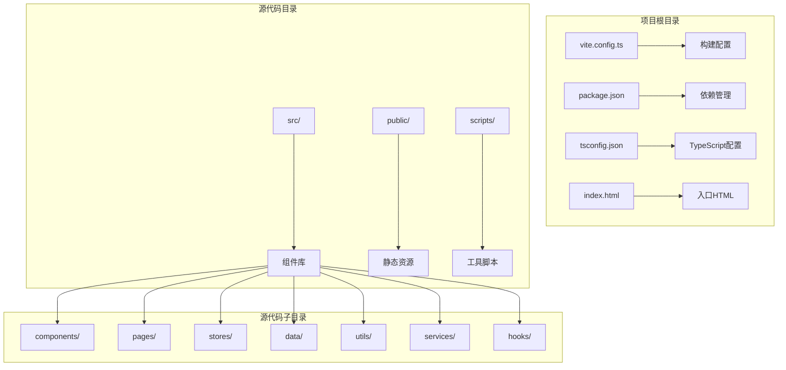
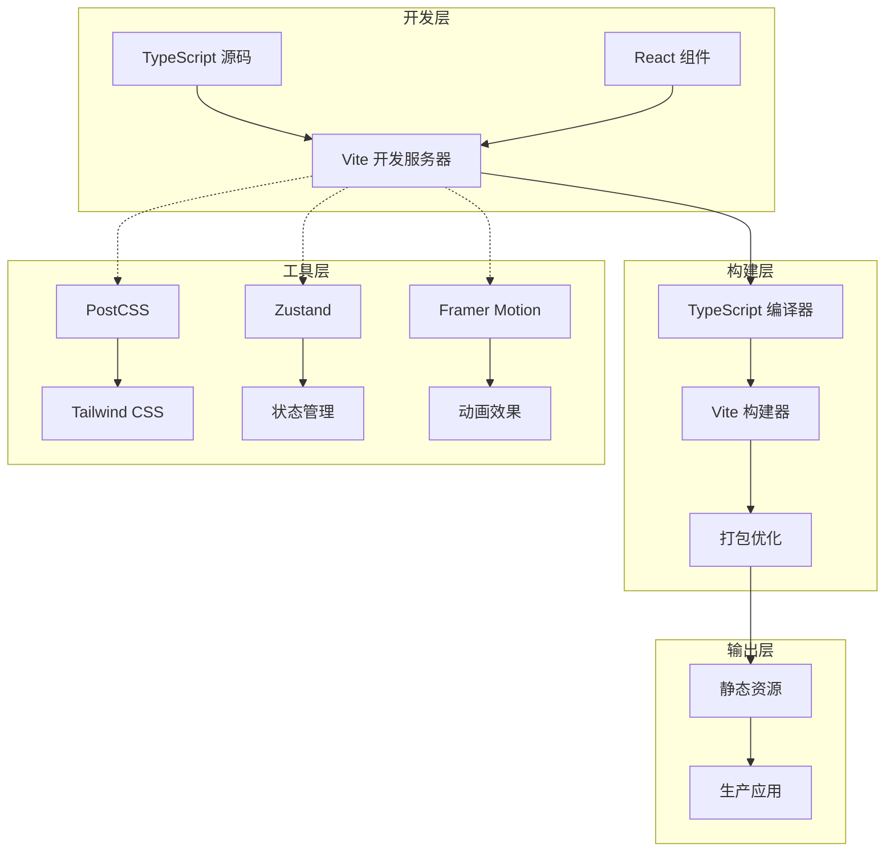
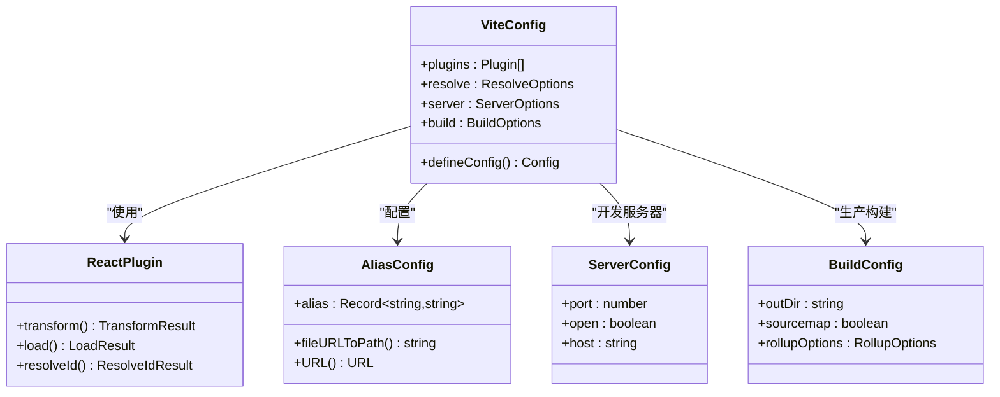
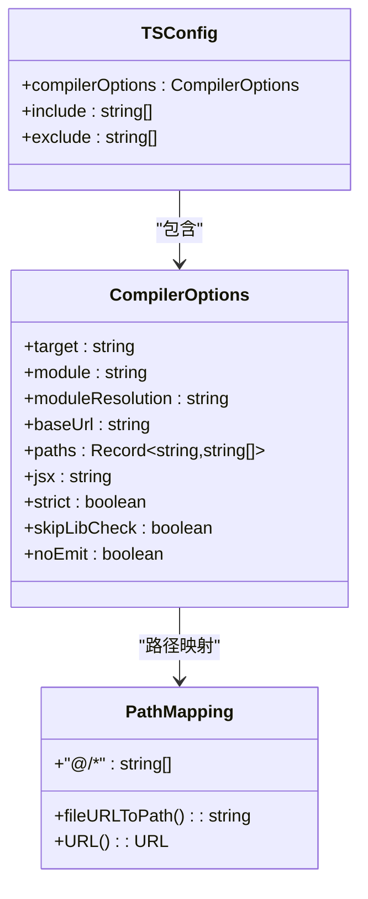
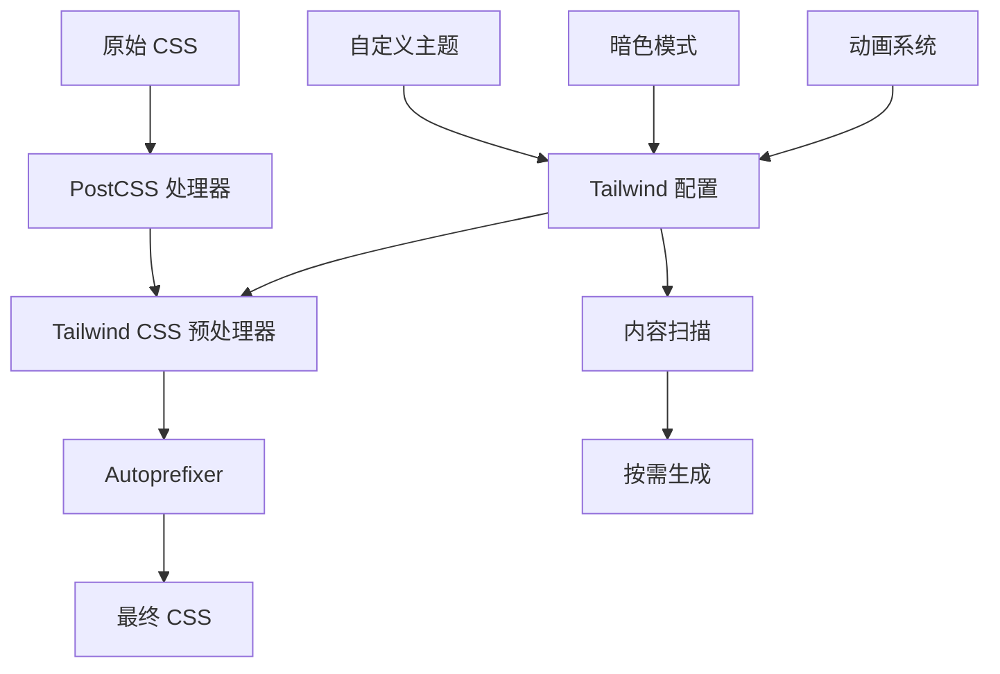
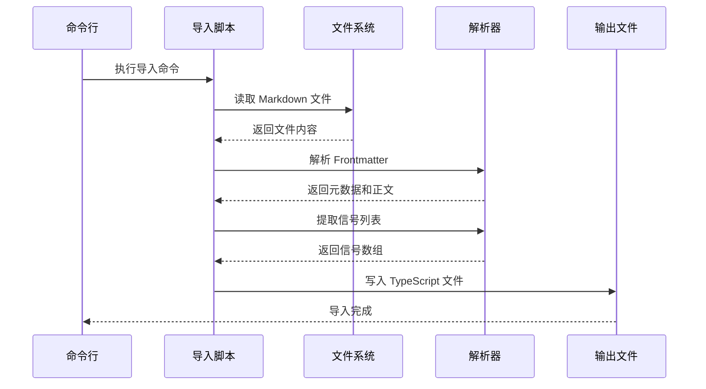

# 构建系统架构

<cite>
**本文档引用的文件**
- [vite.config.ts](file://vite.config.ts)
- [package.json](file://package.json)
- [tsconfig.json](file://tsconfig.json)
- [postcss.config.js](file://postcss.config.js)
- [tailwind.config.js](file://tailwind.config.js)
- [src/main.tsx](file://src/main.tsx)
- [src/App.tsx](file://src/App.tsx)
- [index.html](file://index.html)
- [scripts/import-markdown.ts](file://scripts/import-markdown.ts)
- [src/components/Layout/index.tsx](file://src/components/Layout/index.tsx)
- [src/pages/HomePage/index.tsx](file://src/pages/HomePage/index.tsx)
- [src/stores/appStore.ts](file://src/stores/appStore.ts)
</cite>

## 目录
1. [简介](#简介)
2. [项目结构](#项目结构)
3. [核心组件](#核心组件)
4. [架构概览](#架构概览)
5. [详细组件分析](#详细组件分析)
6. [依赖关系分析](#依赖关系分析)
7. [性能考量](#性能考量)
8. [故障排查指南](#故障排查指南)
9. [结论](#结论)
10. [附录](#附录)

## 简介

这是一个基于 Vite 的现代前端构建系统，专为 React 应用程序设计。该系统采用 TypeScript 编译器与 Vite 开发服务器相结合的方式，提供了快速的开发体验和高效的生产构建。项目集成了 Tailwind CSS 实现现代化的样式管理，并使用 Zustand 进行状态管理。

## 项目结构

该项目采用典型的 React + TypeScript 项目结构，主要包含以下关键目录和文件：



**图表来源**
- [vite.config.ts:1-21](file://vite.config.ts#L1-L21)
- [package.json:1-36](file://package.json#L1-L36)
- [tsconfig.json:1-25](file://tsconfig.json#L1-L25)

**章节来源**
- [vite.config.ts:1-21](file://vite.config.ts#L1-L21)
- [package.json:1-36](file://package.json#L1-L36)
- [tsconfig.json:1-25](file://tsconfig.json#L1-L25)

## 核心组件

### Vite 构建配置

Vite 配置文件定义了开发服务器、构建优化和模块解析策略：

- **插件系统**: 使用 @vitejs/plugin-react 提供 React JSX 转换和开发时 HMR 支持
- **路径别名**: 设置 `@` 别名指向 `src` 目录，简化导入路径
- **开发服务器**: 配置端口 3000 和自动打开浏览器
- **构建输出**: 输出到 `dist` 目录，启用 Source Map

### TypeScript 编译配置

TypeScript 配置采用了现代化的编译选项：

- **目标平台**: ES2020，支持现代 JavaScript 特性
- **模块系统**: ESNext，与 Vite 的原生 ESM 支持相匹配
- **路径映射**: 通过 `baseUrl` 和 `paths` 实现 `@/*` 到 `src/*` 的映射
- **严格模式**: 启用严格类型检查，提高代码质量

### CSS 处理链

项目集成了 PostCSS 和 Tailwind CSS：

- **PostCSS 插件**: Tailwind CSS 和 Autoprefixer 自动处理
- **Tailwind 配置**: 支持暗色模式，自定义颜色系统和动画效果
- **字体系统**: 集成 Noto Sans SC 中文字体

**章节来源**
- [vite.config.ts:5-20](file://vite.config.ts#L5-L20)
- [tsconfig.json:2-24](file://tsconfig.json#L2-L24)
- [postcss.config.js:1-7](file://postcss.config.js#L1-L7)
- [tailwind.config.js:1-60](file://tailwind.config.js#L1-L60)

## 架构概览

该构建系统采用分层架构设计，各层职责明确：



**图表来源**
- [vite.config.ts:6](file://vite.config.ts#L6)
- [package.json:23-34](file://package.json#L23-L34)
- [postcss.config.js:1-7](file://postcss.config.js#L1-L7)

## 详细组件分析

### Vite 配置组件分析

Vite 配置文件实现了现代化的构建系统基础设施：



**图表来源**
- [vite.config.ts:5-20](file://vite.config.ts#L5-L20)

#### 配置特性分析

**插件配置优势**:
- React 插件提供 JSX 转换和开发时热更新
- 与 Vite 的原生 ESM 支持无缝集成
- 减少构建时间，提升开发效率

**别名设置策略**:
- `@` 别名简化了相对路径导入
- 提高代码可读性和维护性
- 支持 IDE 智能提示和重构

**开发服务器配置**:
- 端口 3000 符合开发约定
- 自动打开浏览器减少手动操作
- 支持 HTTPS 和代理配置

**构建优化选项**:
- Source Map 启用便于调试
- 输出目录标准化
- 与 TypeScript 编译器协同工作

**章节来源**
- [vite.config.ts:5-20](file://vite.config.ts#L5-L20)

### TypeScript 编译配置分析

TypeScript 配置体现了现代前端开发的最佳实践：



**图表来源**
- [tsconfig.json:2-24](file://tsconfig.json#L2-L24)

#### 编译选项设计考虑

**模块解析策略**:
- `bundler` 模块解析器与 Vite 原生支持兼容
- `allowImportingTsExtensions` 支持直接导入 TS 文件
- `moduleDetection: force` 强制模块检测

**类型安全保证**:
- 严格模式启用全面类型检查
- `skipLibCheck` 提升编译速度
- `isolatedModules` 支持增量编译

**路径映射实现**:
- `baseUrl` 设置为项目根目录
- `paths` 配置实现 `@/*` 到 `src/*` 的映射
- 支持 VS Code 和其他编辑器智能提示

**章节来源**
- [tsconfig.json:2-24](file://tsconfig.json#L2-L24)

### CSS 处理系统分析

CSS 处理系统采用 PostCSS 生态链：



**图表来源**
- [postcss.config.js:1-7](file://postcss.config.js#L1-L7)
- [tailwind.config.js:1-60](file://tailwind.config.js#L1-L60)

#### Tailwind 配置特性

**内容扫描策略**:
- 扫描 HTML 和所有 TypeScript/JavaScript 文件
- 支持动态类名生成
- 实现 CSS 按需加载

**主题定制**:
- 自定义颜色系统，支持暗色模式
- 字体家族配置，支持中文字体
- 动画和关键帧定义

**暗色模式支持**:
- `class` 模式切换
- 系统偏好检测
- 平滑的主题过渡

**章节来源**
- [postcss.config.js:1-7](file://postcss.config.js#L1-L7)
- [tailwind.config.js:1-60](file://tailwind.config.js#L1-L60)

### 工具脚本分析

项目包含一个专门的 Markdown 导入工具：



**图表来源**
- [scripts/import-markdown.ts:132-158](file://scripts/import-markdown.ts#L132-L158)

#### 脚本功能特性

**Markdown 解析能力**:
- 支持 YAML Frontmatter 格式
- 提取日期和会话信息
- 解析信号列表和优先级

**数据转换流程**:
- 结构化 JSON 数据生成
- TypeScript 接口兼容
- 自动文件命名和组织

**错误处理机制**:
- 文件存在性检查
- 解析异常捕获
- 详细错误日志记录

**章节来源**
- [scripts/import-markdown.ts:1-159](file://scripts/import-markdown.ts#L1-L159)

## 依赖关系分析

项目依赖关系展现了清晰的技术栈分层：

```mermaid
graph TB
subgraph "运行时依赖"
A[react] --> B[react-dom]
C[react-router-dom] --> D[zustand]
E[framer-motion] --> F[lucide-react]
G[recharts] --> H[fuse.js]
I[html2canvas] --> J[类型库]
end
subgraph "开发依赖"
K[@vitejs/plugin-react] --> L[vite]
M[typescript] --> N[@types/*]
O[tailwindcss] --> P[autoprefixer]
Q[postcss] --> R[tsx]
end
subgraph "项目配置"
S[package.json] --> T[脚本定义]
U[vite.config.ts] --> V[构建配置]
W[tsconfig.json] --> X[编译选项]
Y[postcss.config.js] --> Z[样式处理]
end
T --> K
V --> L
X --> M
Z --> O
```

**图表来源**
- [package.json:12-34](file://package.json#L12-L34)
- [vite.config.ts:2](file://vite.config.ts#L2)

### 依赖版本策略

**React 生态系统**:
- React 18.3.1 提供最新特性支持
- React Router DOM 实现客户端路由
- Zustand 提供轻量级状态管理

**开发工具链**:
- Vite 5.4.0 支持现代 Web 开发
- TypeScript 5.5.3 提供类型安全保障
- Tailwind CSS 3.4.1 实现原子化样式

**样式和动画**:
- Framer Motion 提供流畅动画
- Lucide React 提供图标系统
- Recharts 实现数据可视化

**章节来源**
- [package.json:12-34](file://package.json#L12-L34)

## 性能考量

### 构建性能优化策略

**Vite 优势利用**:
- 原生 ESM 支持减少打包时间
- 按需编译提升开发响应速度
- 浏览器原生模块缓存机制

**TypeScript 编译优化**:
- `skipLibCheck` 跳过库文件检查
- `isolatedModules` 支持增量编译
- `noEmit` 避免重复编译

**构建产物优化**:
- Source Map 启用便于调试
- 模块解析器选择 `bundler`
- 路径映射减少模块查找时间

### 开发体验优化

**热模块替换(HMR)**:
- React 插件提供即时更新
- 组件状态保持机制
- 快速反馈循环

**开发服务器特性**:
- 端口 3000 标准化
- 自动打开浏览器
- 支持本地网络访问

**代码组织优化**:
- 路径别名简化导入
- 模块化组件设计
- 清晰的目录结构

## 故障排查指南

### 常见问题诊断

**TypeScript 编译错误**:
- 检查 `tsconfig.json` 配置一致性
- 验证路径映射是否正确
- 确认模块解析器设置

**Vite 构建问题**:
- 检查插件依赖完整性
- 验证开发服务器端口可用性
- 确认构建输出目录权限

**CSS 样式问题**:
- 检查 Tailwind 配置内容扫描范围
- 验证 PostCSS 插件安装
- 确认字体资源可访问性

### 调试技巧

**开发环境调试**:
- 使用浏览器开发者工具
- 检查网络面板中的模块加载
- 监控控制台错误信息

**构建过程监控**:
- 观察构建进度输出
- 检查 Source Map 生成
- 分析包大小统计

**性能分析**:
- 使用 Chrome DevTools Performance 面板
- 分析模块加载时间
- 识别瓶颈组件

**章节来源**
- [vite.config.ts:12-19](file://vite.config.ts#L12-L19)
- [tsconfig.json:7-12](file://tsconfig.json#L7-L12)

## 结论

该构建系统架构展现了现代前端开发的最佳实践。通过 Vite 的原生 ESM 支持、TypeScript 的类型安全保障、以及 Tailwind CSS 的原子化样式设计，系统在开发效率和运行性能之间取得了良好平衡。

关键优势包括：
- 快速的冷启动时间和热更新响应
- 现代化的模块解析和路径映射
- 完整的类型安全和严格的编译选项
- 灵活的 CSS 处理和主题定制能力
- 清晰的工具链和可扩展的架构设计

建议持续关注 Vite 和相关生态的发展，适时更新依赖版本以获得最新的性能改进和功能增强。

## 附录

### 开发工作流

**开发环境启动**:
1. 运行 `npm run dev` 启动开发服务器
2. 访问 `http://localhost:3000` 查看应用
3. 修改代码后自动热更新

**生产构建**:
1. 运行 `npm run build` 执行 TypeScript 编译和 Vite 构建
2. 检查 `dist` 目录中的构建产物
3. 使用 `npm run preview` 预览生产构建

**数据导入**:
1. 运行 `npm run import-data` 执行 Markdown 导入
2. 指定源目录和输出目录参数
3. 查看控制台输出的导入结果

**章节来源**
- [package.json:6-10](file://package.json#L6-L10)
- [scripts/import-markdown.ts:132-158](file://scripts/import-markdown.ts#L132-L158)