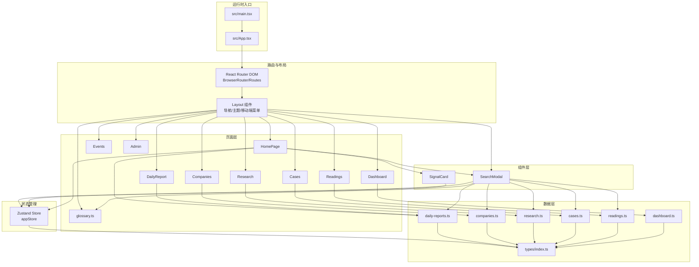
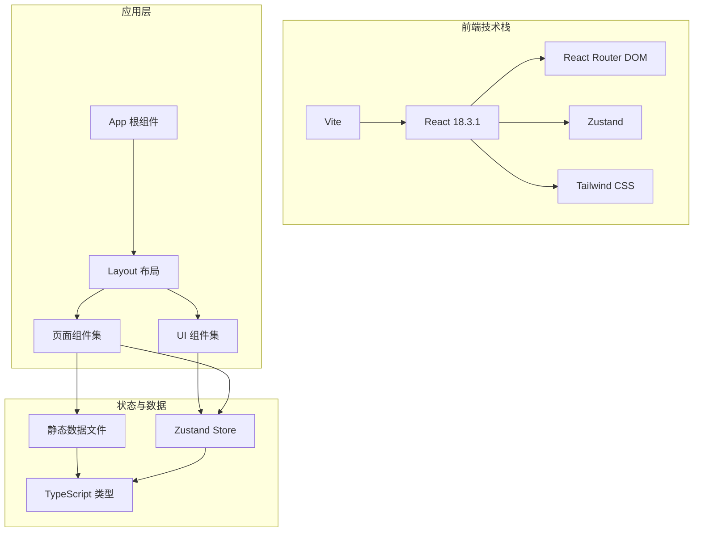
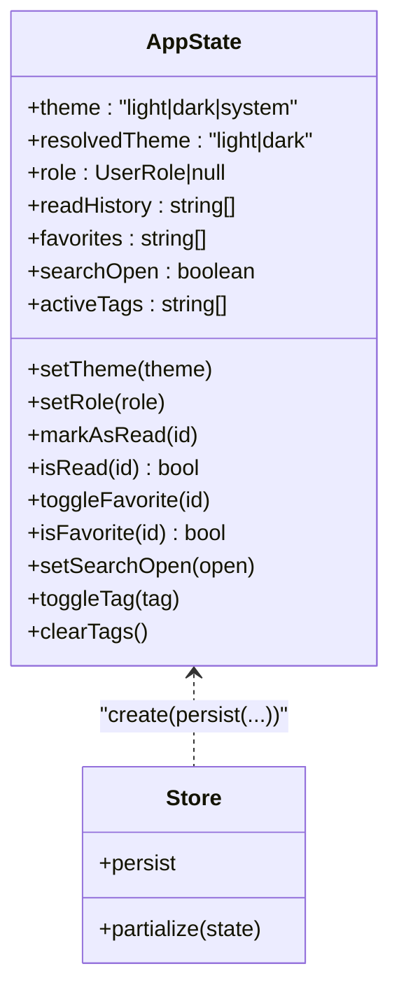
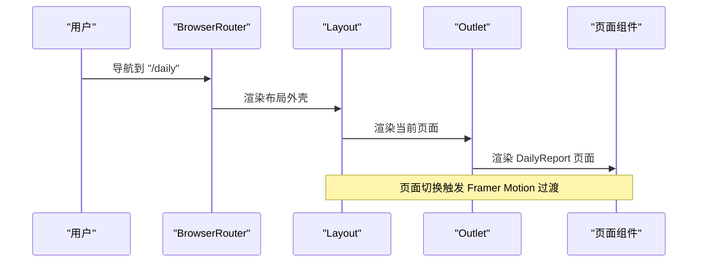
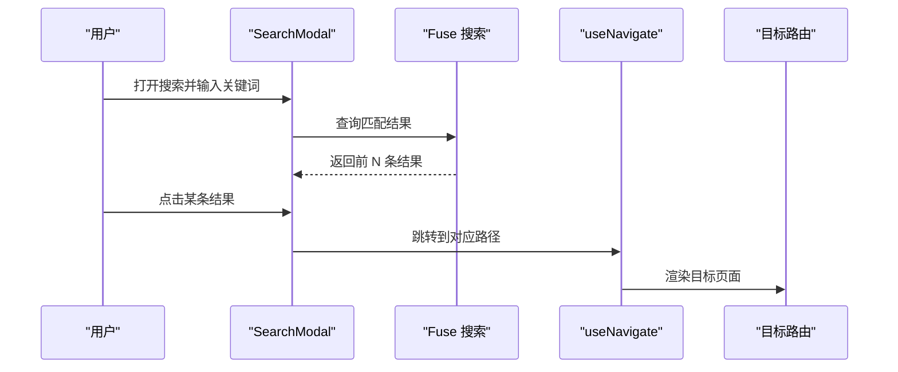
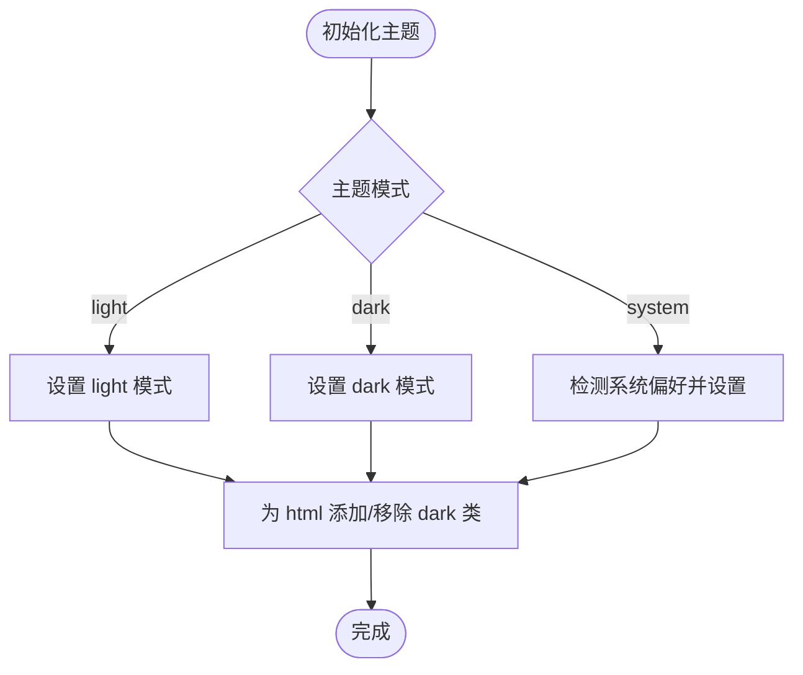
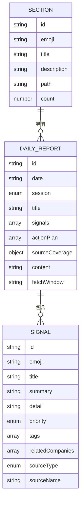
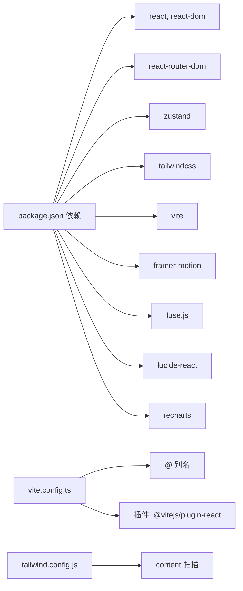

# 架构设计

<cite>
**本文引用的文件**
- [package.json](file://package.json)
- [vite.config.ts](file://vite.config.ts)
- [tailwind.config.js](file://tailwind.config.js)
- [src/main.tsx](file://src/main.tsx)
- [src/App.tsx](file://src/App.tsx)
- [src/stores/appStore.ts](file://src/stores/appStore.ts)
- [src/components/Layout/index.tsx](file://src/components/Layout/index.tsx)
- [src/components/SearchModal/index.tsx](file://src/components/SearchModal/index.tsx)
- [src/components/SignalCard/index.tsx](file://src/components/SignalCard/index.tsx)
- [src/pages/HomePage/index.tsx](file://src/pages/HomePage/index.tsx)
- [src/data/daily-reports.ts](file://src/data/daily-reports.ts)
- [src/data/companies.ts](file://src/data/companies.ts)
- [src/data/research.ts](file://src/data/research.ts)
- [src/data/cases.ts](file://src/data/cases.ts)
- [src/data/readings.ts](file://src/data/readings.ts)
- [src/data/dashboard.ts](file://src/data/dashboard.ts)
- [src/types/index.ts](file://src/types/index.ts)
</cite>

## 目录
1. [引言](#引言)
2. [项目结构](#项目结构)
3. [核心组件](#核心组件)
4. [架构总览](#架构总览)
5. [详细组件分析](#详细组件分析)
6. [依赖关系分析](#依赖关系分析)
7. [性能考量](#性能考量)
8. [故障排查指南](#故障排查指南)
9. [结论](#结论)
10. [附录](#附录)

## 引言
本项目是一个面向 HR 专业读者的“未来组织·HR 洞察”信息平台，围绕 React 18.3.1 构建，采用组件化设计、Zustand 状态管理、React Router DOM 路由系统，并通过 Tailwind CSS 实现一致的视觉语言与暗色主题支持。数据驱动架构以 TypeScript 结构化数据为核心，从静态数据文件到动态内容渲染形成闭环。Vite 提供快速开发体验与高效构建能力。

## 项目结构
项目采用按功能域分层的目录组织方式：
- 根级配置：Vite、Tailwind、TypeScript、包管理
- 源码根目录 src 下按职责划分：
  - components：可复用 UI 组件（布局、卡片、模态框、标签过滤器等）
  - pages：页面级组件（首页、日报、公司、研究、案例、阅读、词典、仪表盘、事件、管理页）
  - data：结构化数据文件（日报、公司、研究、案例、阅读、词典、仪表盘快照）
  - stores：全局状态（Zustand）
  - types：统一的数据类型定义
  - hooks、services、utils：预留扩展点
  - 入口：main.tsx、App.tsx、index.css

图表来源
- [src/main.tsx:1-11](file://src/main.tsx#L1-L11)
- [src/App.tsx:1-36](file://src/App.tsx#L1-L36)
- [src/components/Layout/index.tsx:1-175](file://src/components/Layout/index.tsx#L1-L175)
- [src/components/SearchModal/index.tsx:1-156](file://src/components/SearchModal/index.tsx#L1-L156)
- [src/components/SignalCard/index.tsx:1-111](file://src/components/SignalCard/index.tsx#L1-L111)
- [src/pages/HomePage/index.tsx:1-213](file://src/pages/HomePage/index.tsx#L1-L213)
- [src/stores/appStore.ts:1-93](file://src/stores/appStore.ts#L1-L93)
- [src/data/daily-reports.ts:1-203](file://src/data/daily-reports.ts#L1-L203)
- [src/data/companies.ts:1-53](file://src/data/companies.ts#L1-L53)
- [src/data/research.ts:1-53](file://src/data/research.ts#L1-L53)
- [src/data/cases.ts:1-63](file://src/data/cases.ts#L1-L63)
- [src/data/readings.ts:1-33](file://src/data/readings.ts#L1-L33)
- [src/data/dashboard.ts:1-30](file://src/data/dashboard.ts#L1-L30)
- [src/types/index.ts:1-194](file://src/types/index.ts#L1-L194)

章节来源
- [package.json:1-36](file://package.json#L1-L36)
- [vite.config.ts:1-21](file://vite.config.ts#L1-L21)
- [tailwind.config.js:1-60](file://tailwind.config.js#L1-L60)
- [src/main.tsx:1-11](file://src/main.tsx#L1-L11)
- [src/App.tsx:1-36](file://src/App.tsx#L1-L36)

## 核心组件
- 路由与入口
  - 入口文件负责挂载 React 根节点并引入全局样式。
  - 应用根组件包裹 BrowserRouter，集中声明所有路由与嵌套路由，外层统一套用 Layout，确保导航、主题切换、搜索模态框贯穿全站。
- 布局组件
  - 提供桌面/移动端导航、主题循环切换、键盘快捷键打开搜索、页面切换动画与页脚。
  - 通过 useLocation 与 Outlet 实现页面级内容渲染与过渡动画。
- 搜索模态框
  - 聚合多数据源（日报信号、公司更新、研究论文、转型案例、延伸阅读、词典术语）构建 Fuse 搜索索引，支持模糊匹配与高亮片段展示。
  - 通过 Zustand 控制搜索开关，点击结果跳转对应路径。
- 信号卡片
  - 展示信号标题、摘要、优先级徽标、标签、相关公司与可折叠详情。
  - 支持收藏/取消收藏，状态来自全局 store。
- 页面组件
  - 首页：展示最新日报、行动清单、板块导览、角色推荐路径与多源覆盖承诺。
  - 其他页面（日报、公司、研究、案例、阅读、词典、仪表盘、事件、管理）作为占位或示例，遵循相同数据驱动与组件化风格。

章节来源
- [src/main.tsx:1-11](file://src/main.tsx#L1-L11)
- [src/App.tsx:1-36](file://src/App.tsx#L1-L36)
- [src/components/Layout/index.tsx:1-175](file://src/components/Layout/index.tsx#L1-L175)
- [src/components/SearchModal/index.tsx:1-156](file://src/components/SearchModal/index.tsx#L1-L156)
- [src/components/SignalCard/index.tsx:1-111](file://src/components/SignalCard/index.tsx#L1-L111)
- [src/pages/HomePage/index.tsx:1-213](file://src/pages/HomePage/index.tsx#L1-L213)

## 架构总览
系统采用“路由驱动 + 组件化 + 数据驱动”的前端架构：
- 路由层：React Router DOM 负责页面级导航与参数传递。
- 组件层：布局、页面、卡片、模态框等 UI 组件按职责拆分，复用性强。
- 状态层：Zustand 管理主题、用户角色、阅读历史、收藏、搜索状态与标签筛选。
- 数据层：TypeScript 类型约束 + 静态数据文件，首页与各页面直接消费数据。
- 样式层：Tailwind CSS 提供原子化样式与暗色主题支持。
- 构建层：Vite 提供开发服务器、模块热替换与生产构建。

图表来源
- [src/App.tsx:1-36](file://src/App.tsx#L1-L36)
- [src/components/Layout/index.tsx:1-175](file://src/components/Layout/index.tsx#L1-L175)
- [src/stores/appStore.ts:1-93](file://src/stores/appStore.ts#L1-L93)
- [src/types/index.ts:1-194](file://src/types/index.ts#L1-L194)
- [src/data/daily-reports.ts:1-203](file://src/data/daily-reports.ts#L1-L203)
- [package.json:12-22](file://package.json#L12-L22)
- [vite.config.ts:1-21](file://vite.config.ts#L1-L21)
- [tailwind.config.js:1-60](file://tailwind.config.js#L1-L60)

## 详细组件分析

### 状态管理（Zustand）设计
- 设计要点
  - 单一 Store：集中管理主题、用户角色、阅读历史、收藏、搜索状态、标签筛选。
  - 主题解析：支持 light/dark/system 三种模式，system 模式根据系统偏好自动切换，并通过 DOM 类名控制暗色主题。
  - 持久化：仅持久化主题、角色、阅读历史与收藏，减少存储体积并保护隐私。
  - 简洁 API：围绕 set/get 的函数式更新，便于组合与测试。
- 性能与可维护性
  - 通过 partialize 精准选择持久化字段，避免冗余。
  - 无中间件依赖，体积小、学习成本低。
- 错误处理
  - Store 内部不涉及网络错误处理，保持纯 UI 状态管理职责。

图表来源
- [src/stores/appStore.ts:1-93](file://src/stores/appStore.ts#L1-L93)
- [src/types/index.ts:175-183](file://src/types/index.ts#L175-L183)

章节来源
- [src/stores/appStore.ts:1-93](file://src/stores/appStore.ts#L1-L93)

### 路由系统（React Router DOM）设计
- 设计要点
  - 根路由包裹 BrowserRouter，集中注册所有页面路由。
  - 通过 Layout 作为公共外壳，Outlet 渲染当前页面内容，实现统一导航与动画。
  - 支持 Cmd/Ctrl+K 快捷键打开搜索，提升可用性。
- 技术权衡
  - 嵌套路由清晰表达页面层级，利于 SEO 与浏览器前进后退。
  - 动画通过 Framer Motion 实现页面切换过渡，兼顾性能与体验。

图表来源
- [src/App.tsx:15-35](file://src/App.tsx#L15-L35)
- [src/components/Layout/index.tsx:23-175](file://src/components/Layout/index.tsx#L23-L175)

章节来源
- [src/App.tsx:1-36](file://src/App.tsx#L1-L36)
- [src/components/Layout/index.tsx:1-175](file://src/components/Layout/index.tsx#L1-L175)

### 搜索与数据驱动渲染
- 搜索流程
  - 搜索模态框聚合多数据源，构建 Fuse 索引，输入查询后返回前 N 条结果，支持高亮片段。
  - 通过 useNavigate 跳转到对应路径，关闭模态框。
- 数据驱动渲染
  - 首页直接消费 daily-reports、sections 等数据，渲染“今日精华”“行动清单”“板块导览”等区域。
  - 信号卡片组件接收 Signal 类型数据，渲染优先级、标签、详情与关联公司。
- 可扩展性
  - 新增数据源只需在索引构建处追加，并在类型系统中完善类型定义。

图表来源
- [src/components/SearchModal/index.tsx:47-156](file://src/components/SearchModal/index.tsx#L47-L156)
- [src/pages/HomePage/index.tsx:25-213](file://src/pages/HomePage/index.tsx#L25-L213)
- [src/components/SignalCard/index.tsx:26-111](file://src/components/SignalCard/index.tsx#L26-L111)

章节来源
- [src/components/SearchModal/index.tsx:1-156](file://src/components/SearchModal/index.tsx#L1-L156)
- [src/pages/HomePage/index.tsx:1-213](file://src/pages/HomePage/index.tsx#L1-L213)
- [src/components/SignalCard/index.tsx:1-111](file://src/components/SignalCard/index.tsx#L1-L111)

### 样式系统（Tailwind CSS）与主题
- 设计要点
  - 原子化样式提升一致性与可维护性。
  - 自定义主题色板（primary、signal、surface）与动画（fade-in、slide-up、count-up）。
  - 暗色模式通过 class 切换实现，与 Zustand 主题联动。
- 可扩展性
  - 新增颜色/动画可在配置中集中扩展，组件内仅使用语义化类名。

图表来源
- [src/stores/appStore.ts:35-51](file://src/stores/appStore.ts#L35-L51)
- [tailwind.config.js:10-36](file://tailwind.config.js#L10-L36)

章节来源
- [tailwind.config.js:1-60](file://tailwind.config.js#L1-L60)
- [src/stores/appStore.ts:1-93](file://src/stores/appStore.ts#L1-L93)

### 数据模型与类型系统
- 设计要点
  - 通过 TypeScript 定义数据模型（Signal、DailyReport、CompanyUpdate、ResearchPaper、TransformCase、Reading、GlossaryTerm、KPIData、DashboardSnapshot、EventItem、Section、UserRole、UserPreferences、SearchResult）。
  - 页面与组件严格消费类型化的数据，降低运行时错误。
- 可扩展性
  - 新增字段或实体只需在 types 中补充，数据层与 UI 层同步演进。

图表来源
- [src/types/index.ts:50-63](file://src/types/index.ts#L50-L63)
- [src/types/index.ts:20-31](file://src/types/index.ts#L20-L31)
- [src/types/index.ts:165-173](file://src/types/index.ts#L165-L173)
- [src/data/daily-reports.ts:3-92](file://src/data/daily-reports.ts#L3-L92)

章节来源
- [src/types/index.ts:1-194](file://src/types/index.ts#L1-L194)
- [src/data/daily-reports.ts:1-203](file://src/data/daily-reports.ts#L1-L203)

## 依赖关系分析
- 外部依赖
  - React 18.3.1、React Router DOM、Zustand、Tailwind CSS、Vite、Framer Motion、Fuse.js、Lucide React、Recharts 等。
- 内部依赖
  - 组件依赖 Store 与类型系统；页面依赖数据文件；搜索模态框聚合多数据源。
- 构建与工具
  - Vite 提供开发服务器与构建，别名 @ 指向 src，便于模块导入。
  - PostCSS/Autoprefixer/Tailwind 配置启用 content 扫描，确保产物体积最小化。

图表来源
- [package.json:12-34](file://package.json#L12-L34)
- [vite.config.ts:1-21](file://vite.config.ts#L1-L21)
- [tailwind.config.js:1-60](file://tailwind.config.js#L1-L60)

章节来源
- [package.json:1-36](file://package.json#L1-L36)
- [vite.config.ts:1-21](file://vite.config.ts#L1-L21)
- [tailwind.config.js:1-60](file://tailwind.config.js#L1-L60)

## 性能考量
- 开发体验
  - Vite 提供极快的冷启动与热更新，开发效率高。
  - React 插件按需编译，TSX 与 JSX 解析优化良好。
- 构建优化
  - 产物默认生成 SourceMap，便于调试与性能分析。
  - Tailwind content 白名单仅扫描 src 与 index.html，避免无关文件扫描。
- 运行时优化
  - Zustand 无中间件开销，状态更新局部化，避免不必要的重渲染。
  - 页面切换使用 Framer Motion 动画，过渡时长短、性能稳定。
  - 搜索使用 Fuse.js，阈值与字段配置平衡准确率与性能。
- 可扩展性
  - 组件按需加载与懒加载策略可进一步引入（按需路由与组件懒加载）。
  - 图表与富文本内容可延迟加载，减少首屏负担。

## 故障排查指南
- 主题切换无效
  - 检查 Store 中 setTheme 是否正确设置 resolvedTheme，并确认 html 上 dark 类是否添加。
- 搜索无结果
  - 确认搜索索引构建函数已包含目标数据源；检查 Fuse 配置的 keys 与阈值。
- 页面切换动画异常
  - 检查 Outlet 与 key={location.pathname} 是否正确；确认 Framer Motion 版本兼容。
- 构建后样式缺失
  - 检查 Tailwind content 路径是否包含新增组件文件；确认 PostCSS 插件顺序。
- 开发服务器无法访问
  - 检查 vite.config.ts 中 server.port 与 open 配置；确认端口占用情况。

章节来源
- [src/stores/appStore.ts:35-51](file://src/stores/appStore.ts#L35-L51)
- [src/components/SearchModal/index.tsx:53-57](file://src/components/SearchModal/index.tsx#L53-L57)
- [src/components/Layout/index.tsx:154-164](file://src/components/Layout/index.tsx#L154-L164)
- [tailwind.config.js:3](file://tailwind.config.js#L3)
- [vite.config.ts:12-15](file://vite.config.ts#L12-L15)

## 结论
该前端架构以 React 18.3.1 为基础，结合 React Router DOM、Zustand、Tailwind CSS 与 Vite，实现了清晰的组件化、可维护的状态管理与一致的视觉语言。数据驱动设计使页面与组件高度解耦，易于扩展与演进。通过合理的性能与可扩展性设计，系统能够支撑未来在内容体量与功能复杂度上的增长。

## 附录
- 技术栈选型理由
  - React 18.3.1：成熟生态、并发特性、社区支持。
  - React Router DOM：路由清晰、嵌套布局友好。
  - Zustand：轻量、易用、无需 Provider 包装。
  - Tailwind CSS：原子化样式、暗色主题、快速迭代。
  - Vite：极速开发、现代打包、生态完善。
- 可扩展性建议
  - 引入路由懒加载与组件懒加载，优化首屏。
  - 将静态数据迁移至 API 或本地 JSON 导入脚本，增强数据管理。
  - 增加权限与鉴权中间件，配合 Admin 页面。
  - 为图表与富文本内容增加骨架屏与渐进增强策略。