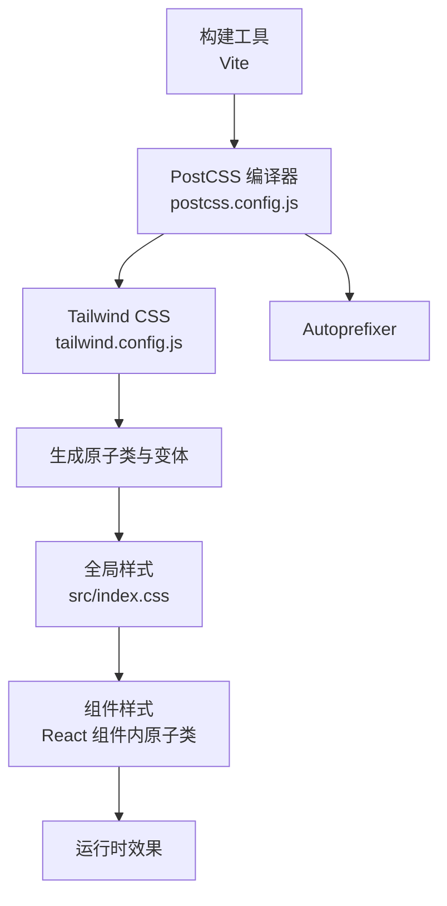
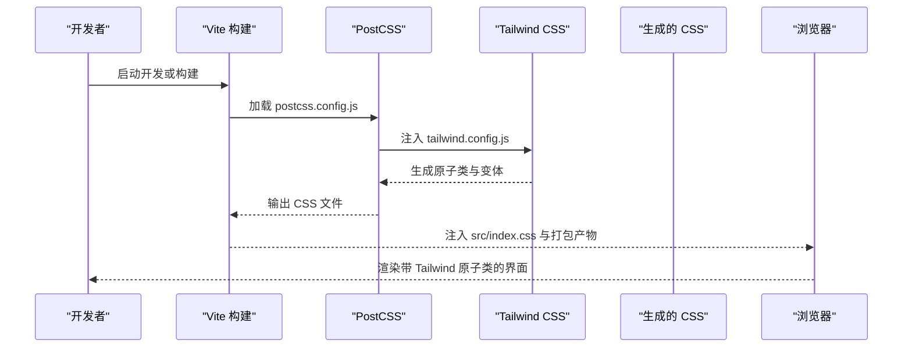
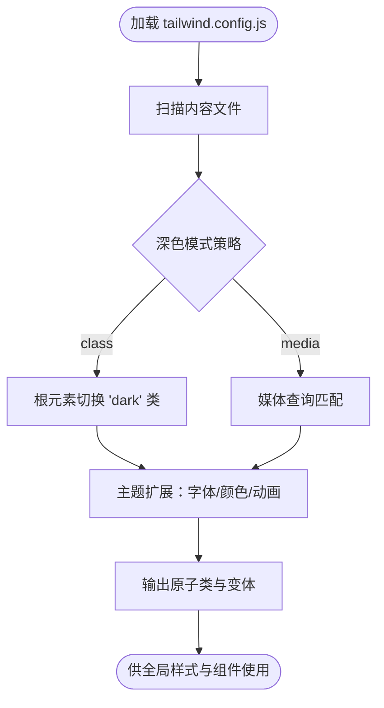
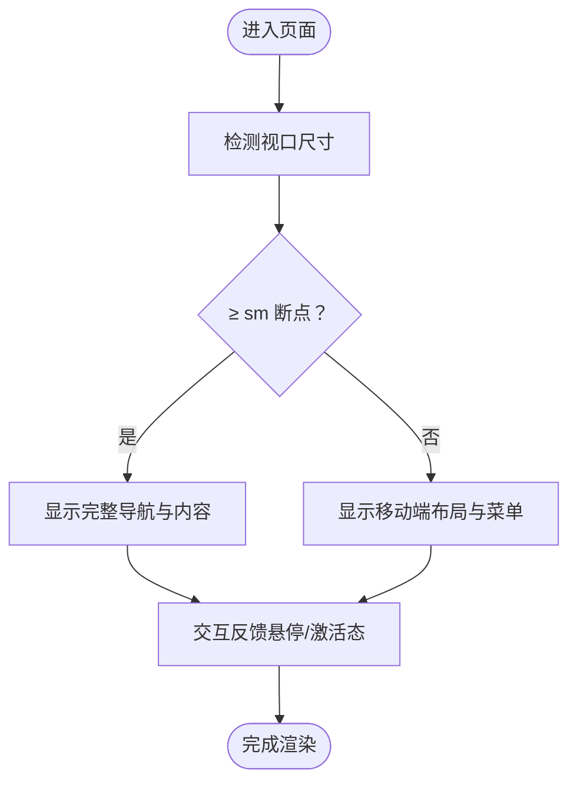
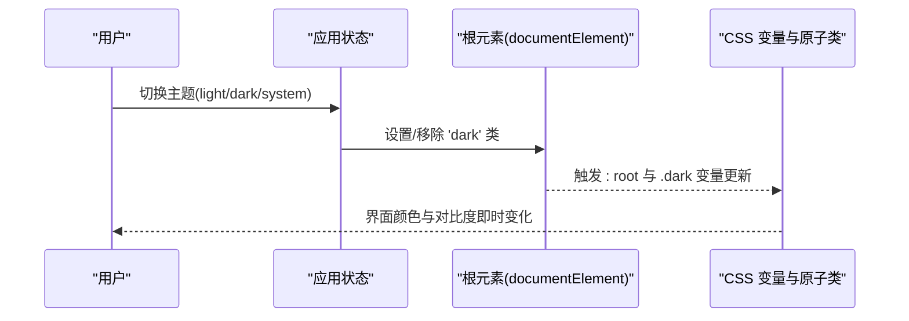
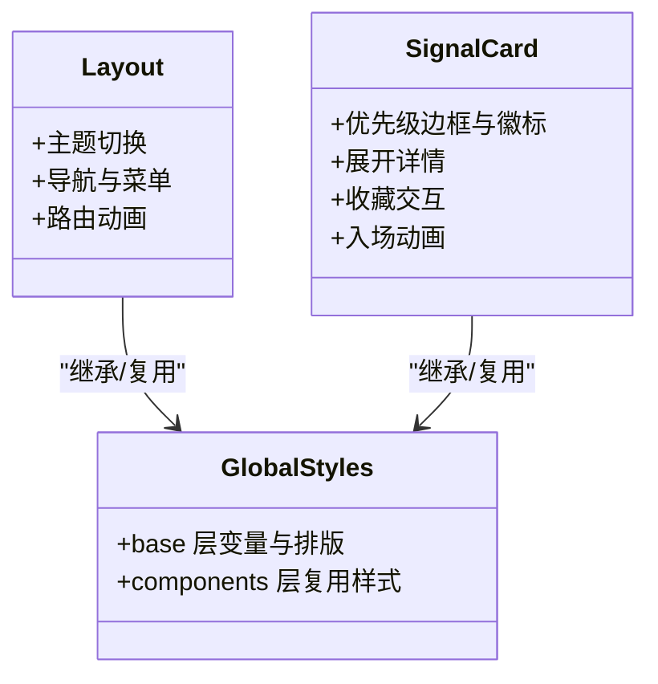
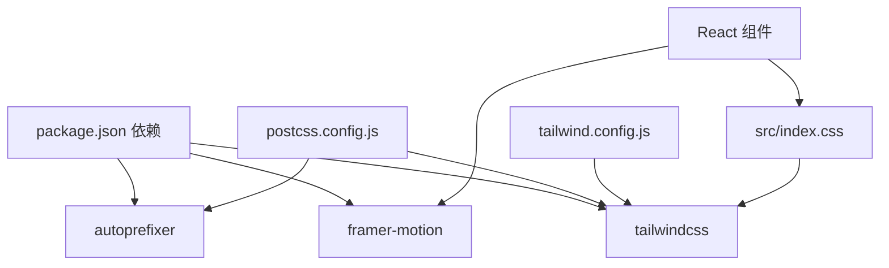

# 样式系统架构

<cite>
**本文引用的文件**
- [tailwind.config.js](file://tailwind.config.js)
- [postcss.config.js](file://postcss.config.js)
- [package.json](file://package.json)
- [src/index.css](file://src/index.css)
- [src/components/Layout/index.tsx](file://src/components/Layout/index.tsx)
- [src/components/SignalCard/index.tsx](file://src/components/SignalCard/index.tsx)
</cite>

## 目录
1. [引言](#引言)
2. [项目结构](#项目结构)
3. [核心组件](#核心组件)
4. [架构总览](#架构总览)
5. [详细组件分析](#详细组件分析)
6. [依赖关系分析](#依赖关系分析)
7. [性能考量](#性能考量)
8. [故障排查指南](#故障排查指南)
9. [结论](#结论)
10. [附录](#附录)

## 引言
本文件面向设计师与开发者，系统性梳理本项目的样式系统架构，重点阐释 Tailwind CSS 实用优先的设计理念与落地方式，涵盖原子化 CSS 的优势、响应式设计支持、暗色主题集成；深入解析 tailwind.config.js 的主题定制、动画扩展与插件占位；总结全局样式组织策略（全局层、组件层）、组件样式隔离与继承机制；并提供响应式实现要点（移动端适配、屏幕尺寸处理、交互反馈样式）与性能优化建议。

## 项目结构
样式系统由以下关键要素构成：
- 构建链路：PostCSS 负责编译，Tailwind CSS 提供原子类与预设，Autoprefixer 增强兼容性。
- 配置层：tailwind.config.js 定义内容扫描范围、深色模式策略、主题扩展（字体族、颜色、动画、关键帧）。
- 全局样式层：src/index.css 使用 @layer 组织 base、components 层，统一基础变量、组件通用样式与自定义滚动条。
- 组件层：各业务组件通过原子类组合实现一致风格与交互反馈，配合 Framer Motion 实现过渡动画。

图表来源
- [postcss.config.js:1-7](file://postcss.config.js#L1-L7)
- [tailwind.config.js:1-60](file://tailwind.config.js#L1-L60)
- [src/index.css:1-101](file://src/index.css#L1-L101)

章节来源
- [postcss.config.js:1-7](file://postcss.config.js#L1-L7)
- [tailwind.config.js:1-60](file://tailwind.config.js#L1-L60)
- [src/index.css:1-101](file://src/index.css#L1-L101)
- [package.json:1-36](file://package.json#L1-L36)

## 核心组件
- Tailwind 配置与主题扩展
  - 内容扫描路径覆盖根 HTML 与 src 下所有 TS/TSX 文件，确保按需生成类。
  - 深色模式采用 class 策略，便于在根节点切换 dark 类名。
  - 主题扩展包含：
    - 字体族：为中文场景指定 Noto Sans SC 等中文字体栈。
    - 颜色：primary（品牌蓝）、signal（高/中/低信号色）、surface（表面层级色阶）。
    - 动画与关键帧：fade-in、slide-up、count-up 等常用动效。
- 全局样式组织
  - base 层：定义 CSS 变量与深浅主题映射，body 默认背景与文本色，数字等宽显示。
  - components 层：定义信号卡片、KPI 卡片、行动卡片、优先级徽标、骨架屏、阅读进度条等复用组件样式。
  - 自定义滚动条：针对 WebKit 内核的滚动条样式统一。
- 组件样式应用
  - Layout 组件：顶部导航、深浅主题切换、移动端菜单、路由切换动画。
  - SignalCard 组件：优先级边框与徽标、展开详情、跨链接、收藏交互、动画入场。

章节来源
- [tailwind.config.js:1-60](file://tailwind.config.js#L1-L60)
- [src/index.css:1-101](file://src/index.css#L1-L101)
- [src/components/Layout/index.tsx:1-174](file://src/components/Layout/index.tsx#L1-L174)
- [src/components/SignalCard/index.tsx:1-174](file://src/components/SignalCard/index.tsx#L1-L174)

## 架构总览
下图展示从配置到运行时样式的端到端流程：

图表来源
- [postcss.config.js:1-7](file://postcss.config.js#L1-L7)
- [tailwind.config.js:1-60](file://tailwind.config.js#L1-L60)
- [src/index.css:1-101](file://src/index.css#L1-L101)

## 详细组件分析

### Tailwind 配置与主题扩展
- 内容扫描与深色模式
  - content 指定扫描范围，确保仅生成实际使用的类，减少体积。
  - darkMode 设为 class，通过在根元素添加 dark 类控制深色主题。
- 主题扩展
  - 字体族：为中文场景提供可读性更佳的字体栈。
  - 颜色体系：primary 用于品牌强调，signal 用于状态提示，surface 用于容器与背景分层。
  - 动画与关键帧：提供淡入、上滑、计数等常用动效，便于组件过渡与加载反馈。
- 插件占位
  - plugins 当前为空数组，预留扩展空间（如自定义工具类、第三方插件）。

图表来源
- [tailwind.config.js:1-60](file://tailwind.config.js#L1-L60)

章节来源
- [tailwind.config.js:1-60](file://tailwind.config.js#L1-L60)

### 全局样式组织策略
- base 层
  - 定义 CSS 变量（背景、文本、边框），深色主题下自动切换。
  - body 默认背景与文本色，启用等宽数字以提升数据可读性。
- components 层
  - 复用组件样式：信号卡片、KPI 卡片、行动卡片、板块导航卡片、优先级徽标、骨架屏、阅读进度条。
  - 通过原子类组合实现状态态样式（hover、active、dark）与过渡动画。
- 自定义滚动条
  - 统一宽度与悬停态颜色，适配深浅主题。

图表来源
- [src/index.css:1-101](file://src/index.css#L1-L101)

章节来源
- [src/index.css:1-101](file://src/index.css#L1-L101)

### 响应式设计实现
- 断点与布局
  - 使用 sm、lg 等断点控制导航、网格与表格单元格的显示/隐藏。
  - 在不同断点下调整栅格列数与间距，保证移动端与桌面端的可读性与密度平衡。
- 交互反馈
  - 导航项在激活态与悬停态使用品牌色与表面色，深色主题下保持对比度。
  - 移动端菜单折叠/展开使用动画过渡，提升操作反馈。
- 数据表格与列表
  - 在小屏隐藏次要字段，避免横向滚动；在大屏展示完整信息。

图表来源
- [src/components/Layout/index.tsx:1-174](file://src/components/Layout/index.tsx#L1-L174)

章节来源
- [src/components/Layout/index.tsx:1-174](file://src/components/Layout/index.tsx#L1-L174)

### 暗色主题集成
- 切换策略
  - 支持 light/dark/system 三种模式，初始化时根据系统偏好或用户选择设置根元素的 dark 类。
- 样式映射
  - base 层通过 CSS 变量在深色主题下切换背景、文本与边框色。
  - 组件层使用 dark 前缀原子类覆盖特定状态下的颜色与阴影。
- 主题一致性
  - 品牌色、信号色与表面色在深浅主题下均保持可读性与对比度。

图表来源
- [src/components/Layout/index.tsx:39-50](file://src/components/Layout/index.tsx#L39-L50)
- [src/index.css:5-31](file://src/index.css#L5-L31)

章节来源
- [src/components/Layout/index.tsx:39-50](file://src/components/Layout/index.tsx#L39-L50)
- [src/index.css:5-31](file://src/index.css#L5-L31)

### 组件样式隔离与继承机制
- 样式隔离
  - 组件内部通过原子类组合自身样式，避免全局污染；必要时使用 @apply 将通用样式抽取为可复用类。
- 继承机制
  - 组件继承自 base 层的默认排版与颜色基线；在深色主题下自动继承 .dark 的变量映射。
- 状态与过渡
  - 使用 transition-* 与动画类实现平滑过渡；结合 Framer Motion 实现复杂入场/展开动画。

图表来源
- [src/components/Layout/index.tsx:1-174](file://src/components/Layout/index.tsx#L1-L174)
- [src/components/SignalCard/index.tsx:1-174](file://src/components/SignalCard/index.tsx#L1-L174)
- [src/index.css:1-101](file://src/index.css#L1-L101)

章节来源
- [src/components/Layout/index.tsx:1-174](file://src/components/Layout/index.tsx#L1-L174)
- [src/components/SignalCard/index.tsx:1-174](file://src/components/SignalCard/index.tsx#L1-L174)
- [src/index.css:1-101](file://src/index.css#L1-L101)

## 依赖关系分析
- 构建依赖
  - Tailwind CSS 与 Autoprefixer 通过 PostCSS 集成，确保原子类生成与浏览器兼容。
- 运行时依赖
  - React 组件直接消费 Tailwind 原子类；Framer Motion 提供流畅的过渡与动画能力。
- 配置耦合
  - tailwind.config.js 的主题扩展直接影响全局样式与组件类名可用性；content 范围决定按需生成范围。

图表来源
- [package.json:1-36](file://package.json#L1-L36)
- [postcss.config.js:1-7](file://postcss.config.js#L1-L7)
- [tailwind.config.js:1-60](file://tailwind.config.js#L1-L60)
- [src/index.css:1-101](file://src/index.css#L1-L101)

章节来源
- [package.json:1-36](file://package.json#L1-L36)
- [postcss.config.js:1-7](file://postcss.config.js#L1-L7)
- [tailwind.config.js:1-60](file://tailwind.config.js#L1-L60)
- [src/index.css:1-101](file://src/index.css#L1-L101)

## 性能考量
- 按需生成
  - content 扫描范围明确，避免生成未使用类，降低 CSS 体积。
- 动画与过渡
  - 使用 transform 与 opacity 等可合成属性的动画，减少重绘；合理设置延迟与缓动函数。
- 组件样式复用
  - 将通用样式抽取为可复用类，减少重复声明与选择器层级。
- 深色主题变量
  - 通过 CSS 变量在运行时切换，避免额外的类拼接与计算成本。
- 构建优化
  - 生产构建开启压缩与 Tree-shaking，确保最终产物最小化。

## 故障排查指南
- 深色主题不生效
  - 确认根元素是否正确添加/移除 'dark' 类；检查 .dark 变量映射是否覆盖目标样式。
- 新增类未生成
  - 检查 tailwind.config.js 的 content 范围是否包含新增文件；确认类名书写正确且未被 Purge 过滤。
- 动画无效
  - 确认已定义对应 keyframes 与 animation；检查是否在受控组件中正确传递类名。
- 响应式断点异常
  - 检查断点前缀（sm、lg）使用是否符合预期；确认父容器布局未限制子元素显示。

章节来源
- [src/components/Layout/index.tsx:39-50](file://src/components/Layout/index.tsx#L39-L50)
- [tailwind.config.js:1-60](file://tailwind.config.js#L1-L60)
- [src/index.css:1-101](file://src/index.css#L1-L101)

## 结论
本样式系统以 Tailwind CSS 为核心，结合 PostCSS/Autoprefixer 的构建链路，形成“配置驱动 + 原子类组合 + 全局层组织”的统一架构。通过主题扩展与深色模式 class 策略，实现品牌一致性与可访问性；借助 @layer 与组件层复用样式，达成样式隔离与继承；响应式断点与过渡动画提升交互体验。建议在后续迭代中持续优化 content 范围、沉淀常用组件样式、评估引入插件以增强可维护性。

## 附录
- 最佳实践清单
  - 明确 content 扫描范围，避免遗漏新文件。
  - 使用语义化类名与状态前缀，便于团队协作与维护。
  - 控制动画数量与复杂度，优先使用 transform/opacity。
  - 深色主题下进行对比度与可读性测试。
  - 对高频组件建立样式规范与示例文档。