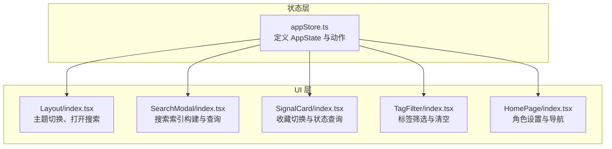
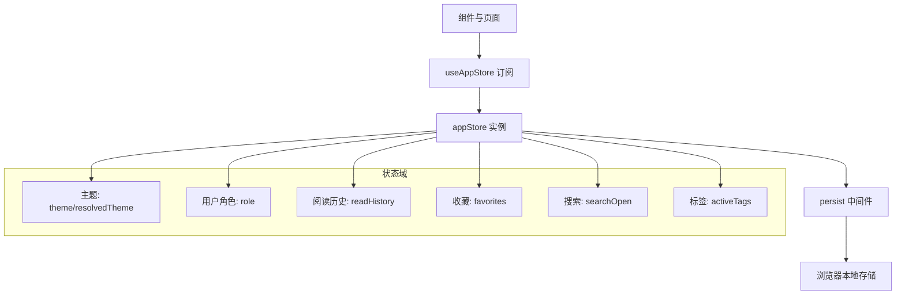
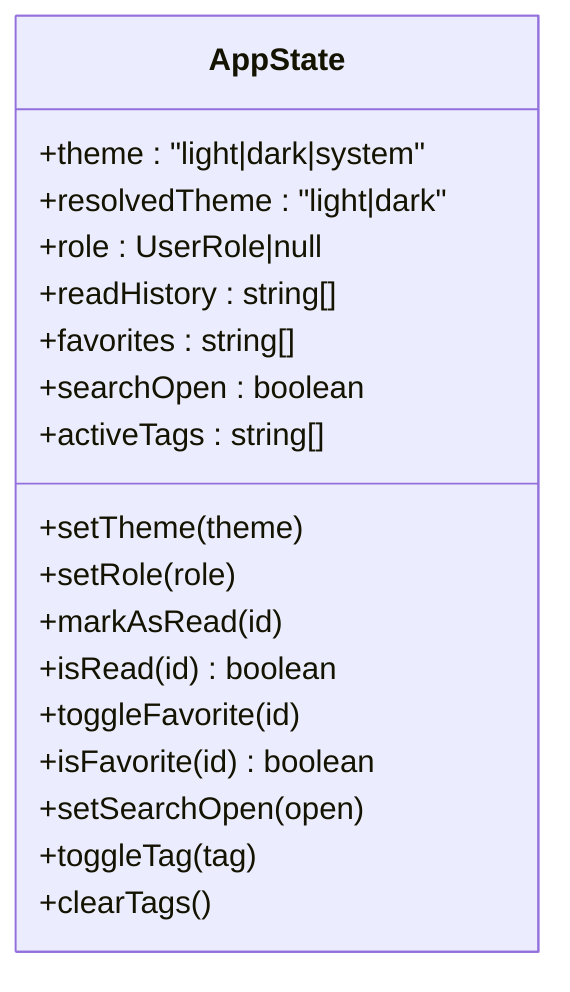
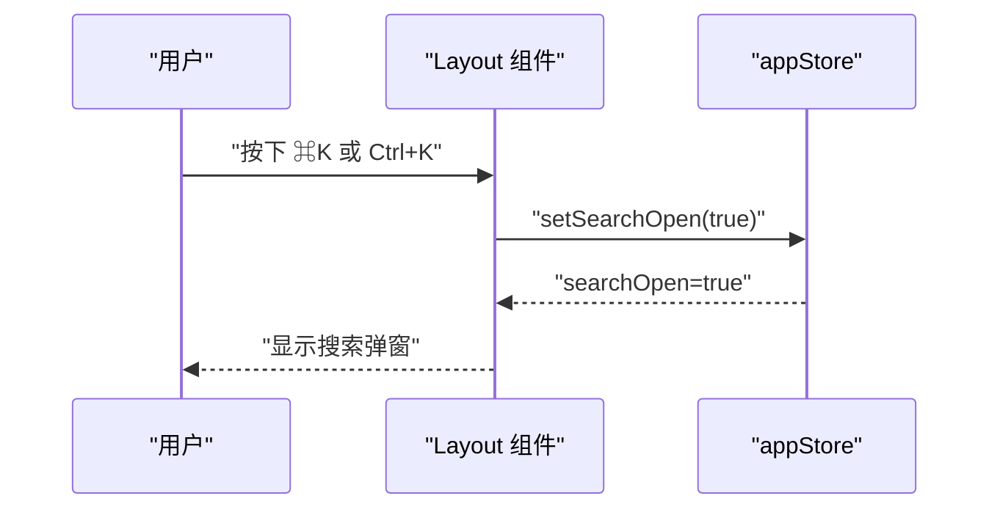
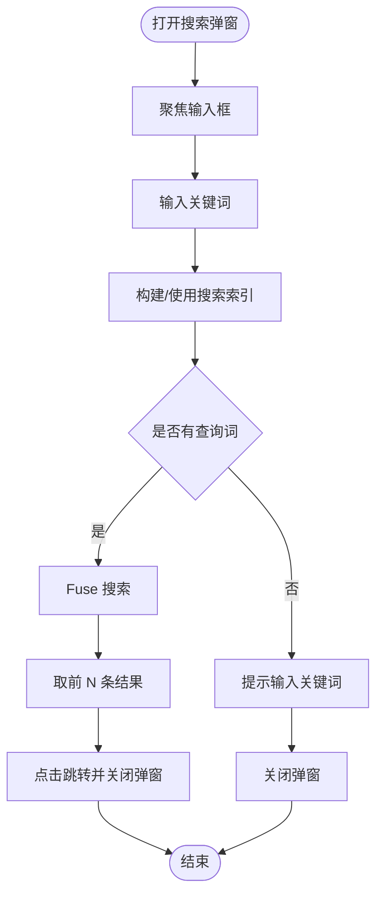
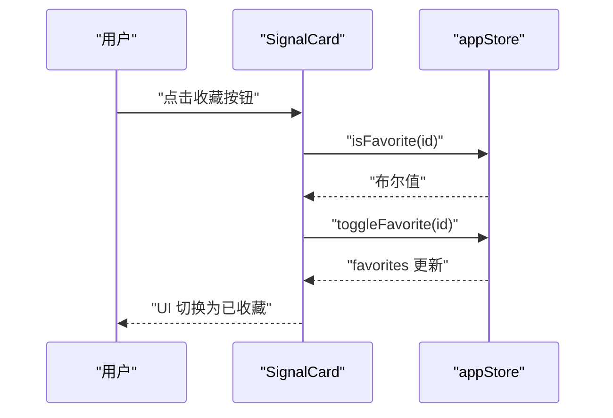
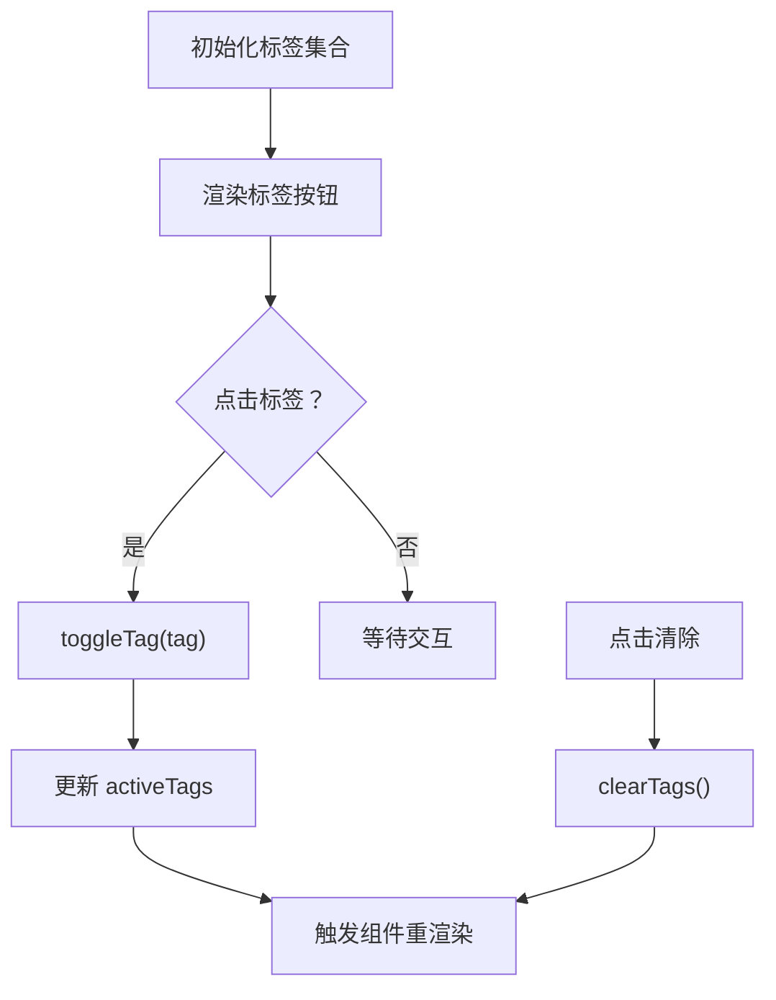
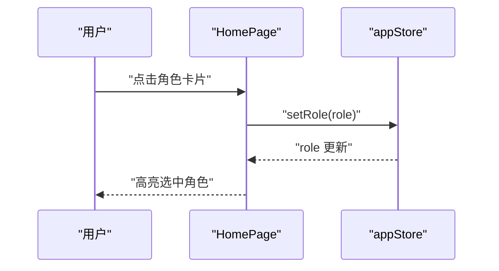
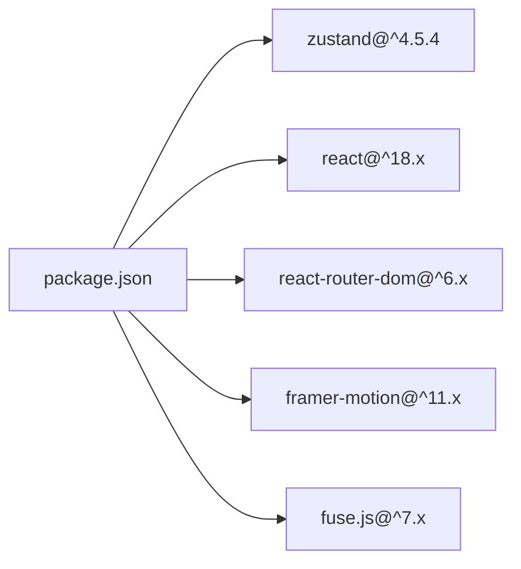

# 状态管理架构

<cite>
**本文引用的文件**
- [src/stores/appStore.ts](file://src/stores/appStore.ts)
- [src/components/Layout/index.tsx](file://src/components/Layout/index.tsx)
- [src/components/SearchModal/index.tsx](file://src/components/SearchModal/index.tsx)
- [src/components/SignalCard/index.tsx](file://src/components/SignalCard/index.tsx)
- [src/components/TagFilter/index.tsx](file://src/components/TagFilter/index.tsx)
- [src/pages/HomePage/index.tsx](file://src/pages/HomePage/index.tsx)
- [src/types/index.ts](file://src/types/index.ts)
- [package.json](file://package.json)
</cite>

## 目录
1. [引言](#引言)
2. [项目结构](#项目结构)
3. [核心组件](#核心组件)
4. [架构总览](#架构总览)
5. [详细组件分析](#详细组件分析)
6. [依赖分析](#依赖分析)
7. [性能考虑](#性能考虑)
8. [故障排查指南](#故障排查指南)
9. [结论](#结论)
10. [附录](#附录)

## 引言
本项目采用 Zustand 作为前端状态管理方案，围绕全局共享状态（主题、用户角色、阅读历史、收藏、搜索开关、标签筛选）进行统一建模，并通过持久化中间件实现跨会话的状态保留。Zustand 的轻量级与易用性使其非常适合本项目的快速迭代与清晰可维护性需求。

选择理由与优势：
- 轻量：仅提供最小必要 API，无样板代码与复杂上下文绑定。
- 易理解：函数式 Store 定义，直观的状态更新与订阅方式。
- 高效：细粒度订阅，避免不必要重渲染。
- 可组合：支持模块化拆分与按需订阅，便于扩展。

## 项目结构
状态相关的核心位置集中在 stores 目录与各业务组件中：
- stores/appStore.ts：定义全局状态模型与动作，包含持久化配置。
- components/*：布局、搜索弹窗、信号卡片、标签过滤器等消费状态。
- pages/*：首页等页面使用状态以驱动视图与交互。
- types/index.ts：定义用户角色等类型，确保状态结构与动作签名一致。

图表来源
- [src/stores/appStore.ts:35-92](file://src/stores/appStore.ts#L35-L92)
- [src/components/Layout/index.tsx:22-50](file://src/components/Layout/index.tsx#L22-L50)
- [src/components/SearchModal/index.tsx:47-72](file://src/components/SearchModal/index.tsx#L47-L72)
- [src/components/SignalCard/index.tsx:26-29](file://src/components/SignalCard/index.tsx#L26-L29)
- [src/components/TagFilter/index.tsx:9-10](file://src/components/TagFilter/index.tsx#L9-L10)
- [src/pages/HomePage/index.tsx:25-27](file://src/pages/HomePage/index.tsx#L25-L27)

章节来源
- [src/stores/appStore.ts:1-93](file://src/stores/appStore.ts#L1-L93)
- [src/components/Layout/index.tsx:1-174](file://src/components/Layout/index.tsx#L1-L174)
- [src/components/SearchModal/index.tsx:1-156](file://src/components/SearchModal/index.tsx#L1-L156)
- [src/components/SignalCard/index.tsx:1-111](file://src/components/SignalCard/index.tsx#L1-L111)
- [src/components/TagFilter/index.tsx:1-49](file://src/components/TagFilter/index.tsx#L1-L49)
- [src/pages/HomePage/index.tsx:1-213](file://src/pages/HomePage/index.tsx#L1-L213)
- [src/types/index.ts:193-201](file://src/types/index.ts#L193-L201)
- [package.json:21-21](file://package.json#L21-L21)

## 核心组件
- appStore：集中定义状态字段与动作，使用 persist 中间件仅持久化必要字段，减少存储体积与潜在冲突。
- 类型系统：通过 UserRole 等类型约束状态结构，保证类型安全与可维护性。
- 组件消费：布局、搜索、卡片、标签过滤等组件通过 useAppStore 订阅所需字段与动作，实现解耦与复用。

章节来源
- [src/stores/appStore.ts:5-33](file://src/stores/appStore.ts#L5-L33)
- [src/stores/appStore.ts:35-92](file://src/stores/appStore.ts#L35-L92)
- [src/types/index.ts:193-201](file://src/types/index.ts#L193-L201)

## 架构总览
Zustand 在本项目中的定位是“轻量全局状态中心”，负责：
- 全局主题与系统主题解析
- 用户角色与个性化路径
- 内容阅读历史与收藏
- 应用内搜索开关与标签筛选
- 状态持久化与跨会话恢复

图表来源
- [src/stores/appStore.ts:35-92](file://src/stores/appStore.ts#L35-L92)
- [src/stores/appStore.ts:82-91](file://src/stores/appStore.ts#L82-L91)

## 详细组件分析

### appStore 设计理念与实现要点
- 状态结构设计
  - 主题：包含用户选择的 theme 与实际 resolvedTheme，用于 DOM 切换暗色类名。
  - 用户角色：role 字段与 setRole 动作，配合类型 UserRole 提升安全性。
  - 阅读历史：readHistory 数组与 markAsRead/isRead，去重插入与存在性判断。
  - 收藏：favorites 数组与 toggleFavorite/isFavorite，包含添加与移除逻辑。
  - 搜索：searchOpen 布尔值与 setSearchOpen 动作，控制搜索弹窗显示。
  - 标签：activeTags 数组与 toggleTag/clearTags，支持增删与一键清空。
- 动作定义
  - 使用 set 与 get 进行原子更新与读取，避免竞态。
  - 主题切换时同步更新 DOM class，确保 UI 即时生效。
  - 标签与收藏操作采用基于当前状态的派生更新，保持不可变更新风格。
- 选择器优化
  - 当前实现直接订阅整块状态；如需进一步优化，可在组件侧使用浅比较或自定义 selector，仅订阅必要字段，降低重渲染频率。
- 持久化策略
  - 仅持久化 theme、role、readHistory、favorites 四项，兼顾用户体验与存储效率。
  - 通过 partialize 控制序列化范围，避免持久无关字段。

图表来源
- [src/stores/appStore.ts:5-33](file://src/stores/appStore.ts#L5-L33)

章节来源
- [src/stores/appStore.ts:35-92](file://src/stores/appStore.ts#L35-L92)
- [src/types/index.ts:193-201](file://src/types/index.ts#L193-L201)

### 布局组件与状态订阅
- 订阅字段：theme、setTheme、setSearchOpen
- 行为：监听 Cmd/Ctrl+K 快捷键打开搜索；根据 theme 初始化 resolvedTheme 并切换 DOM 类名；循环切换主题。
- 最佳实践：将副作用（DOM 操作、事件监听）放在组件内部，store 仅负责状态与动作。

图表来源
- [src/components/Layout/index.tsx:27-37](file://src/components/Layout/index.tsx#L27-L37)
- [src/components/Layout/index.tsx:39-45](file://src/components/Layout/index.tsx#L39-L45)
- [src/stores/appStore.ts:69-71](file://src/stores/appStore.ts#L69-L71)

章节来源
- [src/components/Layout/index.tsx:22-50](file://src/components/Layout/index.tsx#L22-L50)

### 搜索弹窗与状态联动
- 订阅字段：searchOpen、setSearchOpen
- 行为：打开时聚焦输入框；关闭时清空查询；使用 Fuse.js 构建搜索索引并返回匹配结果。
- 状态持久化：搜索开关由 persist 管理，但搜索结果不持久化，避免存储膨胀。

图表来源
- [src/components/SearchModal/index.tsx:47-72](file://src/components/SearchModal/index.tsx#L47-L72)
- [src/components/SearchModal/index.tsx:22-45](file://src/components/SearchModal/index.tsx#L22-L45)
- [src/components/SearchModal/index.tsx:53-57](file://src/components/SearchModal/index.tsx#L53-L57)

章节来源
- [src/components/SearchModal/index.tsx:1-156](file://src/components/SearchModal/index.tsx#L1-L156)

### 信号卡片与收藏状态
- 订阅字段：toggleFavorite、isFavorite
- 行为：根据 isFavorite 切换收藏图标；点击按钮调用 toggleFavorite 切换收藏状态。
- 性能建议：在大量卡片场景下，可将 isFavorite 与 toggleFavorite 以 selector 形式传入子组件，避免父级状态变化导致的重渲染。

图表来源
- [src/components/SignalCard/index.tsx:26-29](file://src/components/SignalCard/index.tsx#L26-L29)
- [src/components/SignalCard/index.tsx:54-59](file://src/components/SignalCard/index.tsx#L54-L59)
- [src/stores/appStore.ts:60-67](file://src/stores/appStore.ts#L60-L67)

章节来源
- [src/components/SignalCard/index.tsx:1-111](file://src/components/SignalCard/index.tsx#L1-L111)

### 标签过滤器与筛选状态
- 订阅字段：activeTags、toggleTag、clearTags
- 行为：渲染所有可用标签；点击切换激活状态；清空按钮一键清除筛选。
- 与搜索联动：可将 activeTags 与搜索逻辑结合，实现标签过滤后的搜索结果聚合。

图表来源
- [src/components/TagFilter/index.tsx:9-10](file://src/components/TagFilter/index.tsx#L9-L10)
- [src/components/TagFilter/index.tsx:28-44](file://src/components/TagFilter/index.tsx#L28-L44)
- [src/stores/appStore.ts:73-80](file://src/stores/appStore.ts#L73-L80)

章节来源
- [src/components/TagFilter/index.tsx:1-49](file://src/components/TagFilter/index.tsx#L1-L49)

### 首页角色设置与导航
- 订阅字段：role、setRole
- 行为：根据用户角色展示推荐路径；点击后设置 role 并影响后续导航与内容呈现。
- 与类型系统：UserRole 限定角色枚举，避免非法值进入状态。

图表来源
- [src/pages/HomePage/index.tsx:25-27](file://src/pages/HomePage/index.tsx#L25-L27)
- [src/pages/HomePage/index.tsx:154-178](file://src/pages/HomePage/index.tsx#L154-L178)
- [src/types/index.ts:193-201](file://src/types/index.ts#L193-L201)

章节来源
- [src/pages/HomePage/index.tsx:1-213](file://src/pages/HomePage/index.tsx#L1-L213)

## 依赖分析
- Zustand 版本：^4.5.4，提供 create 与 persist 中间件能力。
- React 生态：与 react、react-router-dom 协同工作，组件通过 hooks 订阅状态。
- UI 与工具：Framer Motion、Lucide React、Fuse.js 等提升交互与搜索体验。

图表来源
- [package.json:12-21](file://package.json#L12-L21)

章节来源
- [package.json:1-36](file://package.json#L1-L36)

## 性能考虑
- 订阅粒度
  - 当前组件多为整体订阅，建议在高频更新区域（如收藏、标签）采用 selector 仅订阅必要字段，减少不必要的重渲染。
- 持久化范围
  - 已通过 partialize 限制持久化字段，避免存储膨胀与跨版本兼容问题。
- 搜索性能
  - Fuse.js 搜索在首次构建索引时可能有开销，建议在数据稳定后缓存索引或延迟构建，避免首屏阻塞。
- DOM 操作
  - 主题切换直接操作 DOM class，建议在 SSR 场景下配合 hydration 策略，确保服务端与客户端一致。

## 故障排查指南
- 主题未生效
  - 检查 resolvedTheme 是否正确计算与 DOM class 是否被设置。
  - 确认系统主题偏好变更时是否重新计算 resolvedTheme。
- 搜索弹窗无法打开
  - 检查快捷键事件监听是否注册成功，确认 setSearchOpen 动作是否被调用。
- 收藏状态不同步
  - 确认 isFavorite/toggleFavorite 的调用链路，检查 favorites 数组更新是否正确。
- 标签筛选无效
  - 检查 activeTags 的 toggleTag/clearTags 动作是否执行，确认组件是否重新渲染。
- 持久化异常
  - 检查 localStorage 中对应键是否存在，确认 partialize 配置是否符合预期。

章节来源
- [src/stores/appStore.ts:39-47](file://src/stores/appStore.ts#L39-L47)
- [src/stores/appStore.ts:69-71](file://src/stores/appStore.ts#L69-L71)
- [src/stores/appStore.ts:60-67](file://src/stores/appStore.ts#L60-L67)
- [src/stores/appStore.ts:73-80](file://src/stores/appStore.ts#L73-L80)
- [src/stores/appStore.ts:82-91](file://src/stores/appStore.ts#L82-L91)

## 结论
本项目以 Zustand 为核心，建立了清晰、可维护且高性能的全局状态管理方案。通过合理的状态域划分、动作设计与持久化策略，实现了主题、角色、阅读历史、收藏、搜索与标签筛选等核心功能的统一管理。建议在后续迭代中引入更细粒度的订阅与选择器优化，持续提升性能与开发体验。

## 附录
- 自定义 Hook 设计模式
  - 在组件内部封装状态订阅与本地状态组合，例如在卡片组件中同时持有本地展开状态与全局收藏状态，避免将所有状态上提至全局。
- 最佳实践清单
  - 使用类型约束状态结构，确保类型安全。
  - 仅持久化必要字段，控制存储体积。
  - 对高频更新区域采用 selector 优化订阅。
  - 将副作用（DOM 操作、事件监听）置于组件层，保持 store 的纯净性。
  - 为关键动作提供简单测试用例，验证状态流转正确性。