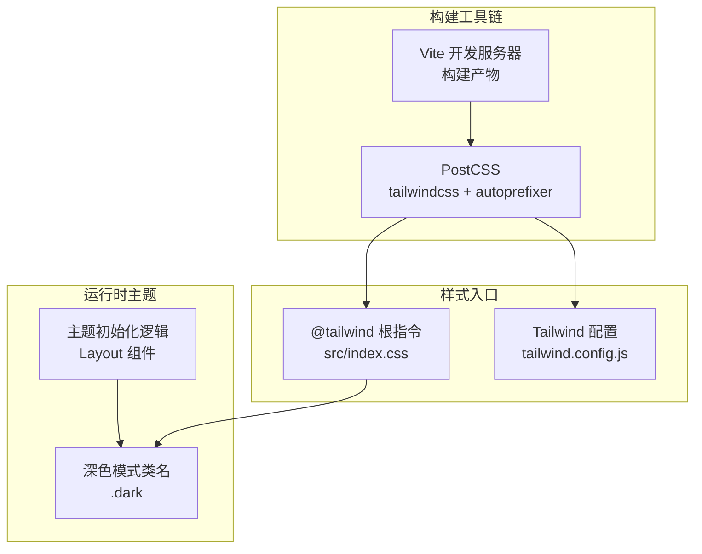
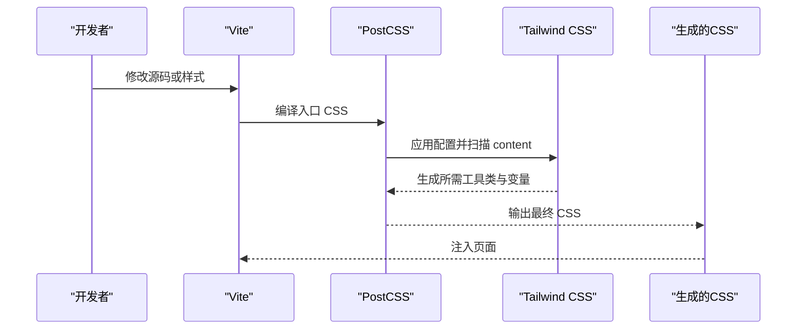
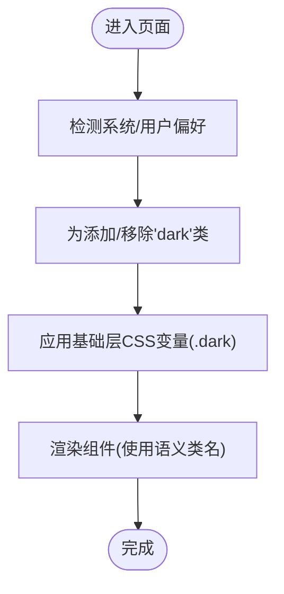
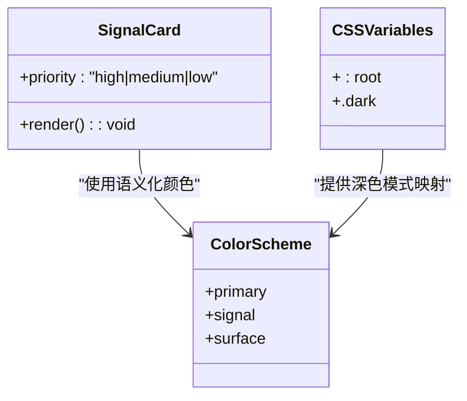
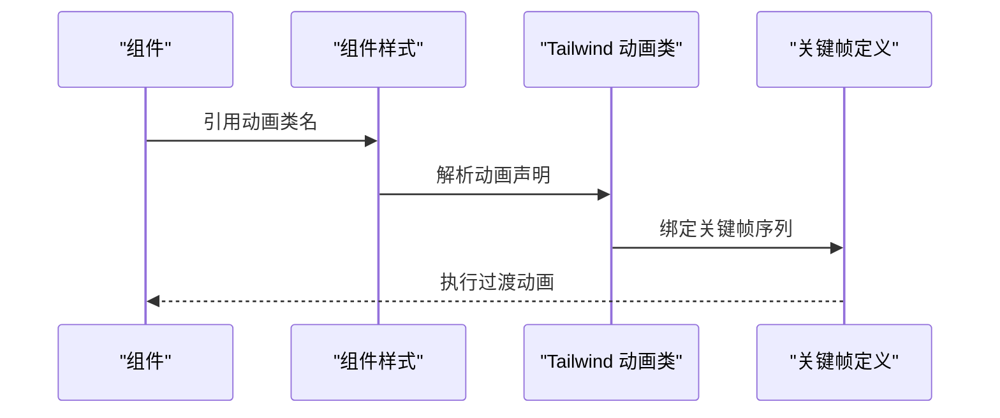
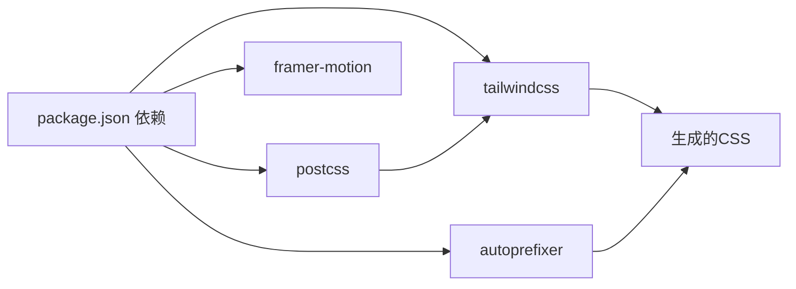

# Tailwind CSS配置

<cite>
**本文档引用的文件**
- [tailwind.config.js](file://tailwind.config.js)
- [postcss.config.js](file://postcss.config.js)
- [src/index.css](file://src/index.css)
- [package.json](file://package.json)
- [src/components/SignalCard/index.tsx](file://src/components/SignalCard/index.tsx)
- [src/components/Layout/index.tsx](file://src/components/Layout/index.tsx)
</cite>

## 目录
1. [简介](#简介)
2. [项目结构](#项目结构)
3. [核心组件](#核心组件)
4. [架构总览](#架构总览)
5. [详细组件分析](#详细组件分析)
6. [依赖关系分析](#依赖关系分析)
7. [性能考虑](#性能考虑)
8. [故障排除指南](#故障排除指南)
9. [结论](#结论)

## 简介
本文件系统性梳理并文档化本项目的 Tailwind CSS 配置与使用实践，重点覆盖以下方面：
- 配置文件的关键设置与定制项：content 路径、darkMode 模式、字体家族、颜色体系（含 primary、signal、surface）。
- 动画与关键帧的定义与应用，以及与 CSS 变量的协同工作方式。
- 插件系统的集成现状与扩展建议。
- 实际组件中的使用示例与最佳实践，帮助开发者在保持设计一致性的同时提升开发效率。

## 项目结构
本项目采用 Vite + React + PostCSS + Tailwind CSS 的现代前端栈。Tailwind 的构建流程通过 PostCSS 完成，CSS 层级采用 Tailwind 的 base/components/utilities 分层，并结合自定义 CSS 变量实现深色模式切换。

**图表来源**
- [postcss.config.js:1-6](file://postcss.config.js#L1-L6)
- [src/index.css:1-31](file://src/index.css#L1-L31)
- [tailwind.config.js:1-59](file://tailwind.config.js#L1-L59)
- [src/components/Layout/index.tsx:40-46](file://src/components/Layout/index.tsx#L40-L46)

**章节来源**
- [postcss.config.js:1-6](file://postcss.config.js#L1-L6)
- [src/index.css:1-31](file://src/index.css#L1-L31)
- [tailwind.config.js:1-59](file://tailwind.config.js#L1-L59)
- [src/components/Layout/index.tsx:40-46](file://src/components/Layout/index.tsx#L40-L46)

## 核心组件
本节聚焦 Tailwind 配置文件中的关键字段及其作用范围。

- content 路径配置
  - 作用：控制 Tailwind 扫描哪些文件以生成所需样式，避免无用 CSS。
  - 当前配置：根 HTML 与 src 下所有 JavaScript/TypeScript/JSX/TSX 文件。
  - 影响：新增页面或组件后，确保路径匹配，否则新类名可能不生效。

- darkMode 模式设置
  - 作用：启用深色模式支持。
  - 当前配置：class 模式，通过为根元素添加 dark 类名切换主题。
  - 影响：配合 CSS 中的 .dark 选择器与组件中的动态类名切换，实现主题切换。

- 字体家族定制
  - 作用：统一中文字体体验，提升可读性与品牌一致性。
  - 当前配置：sans 字体族包含 Noto Sans SC、PingFang SC、Microsoft YaHei 等备选，最后回退到 sans-serif。
  - 影响：全局文本渲染风格一致，适用于标题、正文、标签等场景。

- 颜色系统扩展
  - primary：主色调系列，用于强调、链接、进度条等重要交互元素。
  - signal：信号强度分级颜色，分别对应 high/medium/low，用于优先级、状态提示等。
  - surface：表面色板，提供从浅到深的背景层次，适配深色模式下的容器与分隔线。
  - 影响：通过语义化命名的颜色变量，降低主题切换时的维护成本。

- 动画与关键帧
  - 动画：fade-in、slide-up、count-up，分别用于淡入、上滑、计数等场景。
  - 关键帧：fadeIn、slideUp、countUp，定义透明度与位移变化曲线。
  - 影响：为组件提供流畅的入场与过渡效果，提升用户体验。

- 插件系统
  - 当前配置：未启用任何插件。
  - 建议：如需网格、占位符、容器查询等功能，可在后续按需引入官方或社区插件。

**章节来源**
- [tailwind.config.js:3-59](file://tailwind.config.js#L3-L59)

## 架构总览
Tailwind 在本项目中的工作流如下：PostCSS 作为编译器，加载 tailwindcss 和 autoprefixer 插件；Tailwind 根据配置扫描 content，生成所需样式；最终由 Vite 注入到浏览器中。CSS 变量在基础层定义，深色模式通过 .dark 类名驱动；组件层通过语义化类名组合 Tailwind 工具类与自定义样式。

**图表来源**
- [postcss.config.js:1-6](file://postcss.config.js#L1-L6)
- [tailwind.config.js:3-59](file://tailwind.config.js#L3-L59)
- [src/index.css:1-3](file://src/index.css#L1-L3)

## 详细组件分析

### 内容扫描与构建路径
- 目标：确保 Tailwind 能正确识别新增组件与页面的类名。
- 当前策略：扫描根 HTML 与 src 下所有 TS/JS 文件。
- 建议：若新增非 TS/JS 文件（如纯 HTML 或 Markdown），需补充相应路径，避免样式缺失。

**章节来源**
- [tailwind.config.js:3](file://tailwind.config.js#L3)

### 深色模式与主题切换
- 模式：class 模式，通过为 html 根元素添加 dark 类名实现。
- 运行时：Layout 组件在初始化时根据用户偏好或显式主题设置切换 dark 类名。
- CSS 对应：基础层定义 .dark 选择器，重写 CSS 变量以切换深色主题。

**图表来源**
- [src/components/Layout/index.tsx:40-46](file://src/components/Layout/index.tsx#L40-L46)
- [src/index.css:14-20](file://src/index.css#L14-L20)

**章节来源**
- [src/components/Layout/index.tsx:40-46](file://src/components/Layout/index.tsx#L40-L46)
- [src/index.css:14-20](file://src/index.css#L14-L20)

### 字体家族与排版
- 字体族：sans 使用中文字体优先列表，保证跨平台一致性。
- 排版细节：数字使用等宽特性，提升数据可读性。
- 影响：全局文本风格统一，适合信息密集型界面。

**章节来源**
- [tailwind.config.js:7-9](file://tailwind.config.js#L7-L9)
- [src/index.css:27-30](file://src/index.css#L27-L30)

### 颜色系统：primary、signal、surface
- primary：用于强调、链接、进度条等重要元素，体现品牌主色。
- signal：高/中/低三级信号色，用于优先级、状态指示，便于快速识别。
- surface：提供背景与分隔线的层次感，适配深色模式下的视觉对比。
- 组件应用示例：SignalCard 使用 signal 的高/中/低边框区分优先级；阅读进度条使用 primary-500。

**图表来源**
- [tailwind.config.js:10-36](file://tailwind.config.js#L10-L36)
- [src/components/SignalCard/index.tsx:12-22](file://src/components/SignalCard/index.tsx#L12-L22)
- [src/index.css:34-85](file://src/index.css#L34-L85)

**章节来源**
- [tailwind.config.js:10-36](file://tailwind.config.js#L10-L36)
- [src/components/SignalCard/index.tsx:12-22](file://src/components/SignalCard/index.tsx#L12-L22)
- [src/index.css:34-85](file://src/index.css#L34-L85)

### 动画与关键帧：fadeIn、slideUp、countUp
- 动画定义：在配置中声明动画名称与关键帧映射。
- 关键帧：定义透明度与位移，形成自然的入场与过渡效果。
- 组件应用：骨架屏使用内置的 pulse 动画；自定义组件可直接使用配置中的动画类名。

**图表来源**
- [tailwind.config.js:37-55](file://tailwind.config.js#L37-L55)
- [src/index.css:77-80](file://src/index.css#L77-L80)

**章节来源**
- [tailwind.config.js:37-55](file://tailwind.config.js#L37-L55)
- [src/index.css:77-80](file://src/index.css#L77-L80)

### CSS 变量与深色模式
- 变量定义：在基础层为 :root 与 .dark 定义颜色变量，覆盖背景、文本、边框等。
- 切换机制：通过为根元素添加/移除 dark 类名，自动切换变量值。
- 组件使用：组件层通过 Tailwind 工具类引用变量名，实现主题一致的视觉表现。

**章节来源**
- [src/index.css:5-20](file://src/index.css#L5-L20)

### 插件系统集成
- 当前状态：未启用任何插件。
- 建议：如需栅格系统增强、占位符动画、容器查询等，可在 plugins 数组中按需引入官方或社区插件，并在配置中进行相应扩展。

**章节来源**
- [tailwind.config.js:58](file://tailwind.config.js#L58)

## 依赖关系分析
Tailwind 的构建依赖于 PostCSS 与 autoprefixer；项目中还引入了 framer-motion 用于更复杂的动画场景，但与 Tailwind 的动画配置互不冲突，可并行使用。

**图表来源**
- [package.json:23-34](file://package.json#L23-L34)

**章节来源**
- [package.json:23-34](file://package.json#L23-L34)

## 性能考虑
- 控制内容扫描范围：仅扫描必要文件，避免不必要的样式生成。
- 合理使用动画：减少复杂关键帧与长时动画，避免影响滚动性能。
- 深色模式变量：集中管理 CSS 变量，减少重复计算与重绘。
- 插件按需引入：避免引入未使用的插件，降低构建体积。

## 故障排除指南
- 新增类名无效
  - 检查 tailwind.config.js 的 content 路径是否包含新增文件。
  - 确认组件中类名拼写正确且符合 Tailwind 语法。
- 深色模式不生效
  - 确保根元素存在 dark 类名（Layout 组件负责初始化）。
  - 检查基础层 CSS 是否正确覆盖变量。
- 动画不执行
  - 确认已正确引用配置中的动画类名。
  - 检查关键帧定义是否与动画声明匹配。

**章节来源**
- [tailwind.config.js:3](file://tailwind.config.js#L3)
- [src/components/Layout/index.tsx:40-46](file://src/components/Layout/index.tsx#L40-L46)
- [src/index.css:14-20](file://src/index.css#L14-L20)
- [tailwind.config.js:37-55](file://tailwind.config.js#L37-L55)

## 结论
本项目的 Tailwind 配置以简洁实用为核心：通过合理的 content 路径、class 模式的深色模式、中文字体族与语义化颜色体系，以及轻量的动画与关键帧，实现了良好的可维护性与一致性。建议在后续迭代中按需引入插件、持续优化动画与变量管理，以进一步提升性能与开发体验。