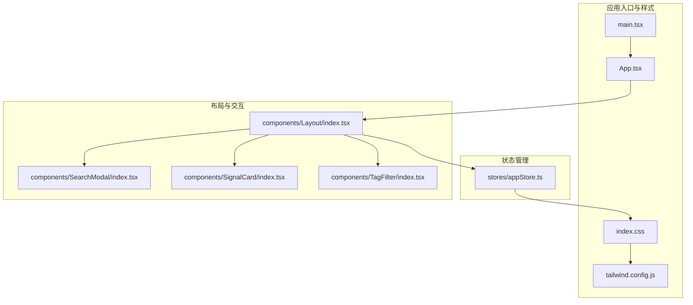
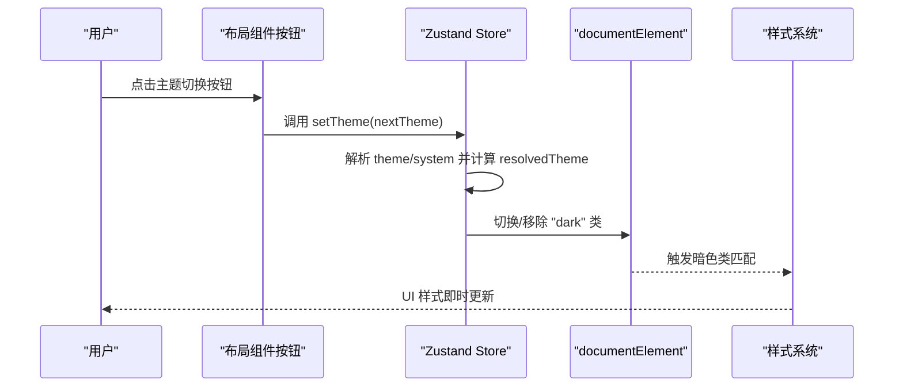
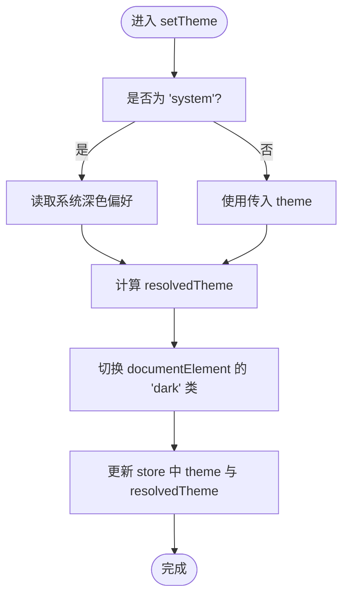
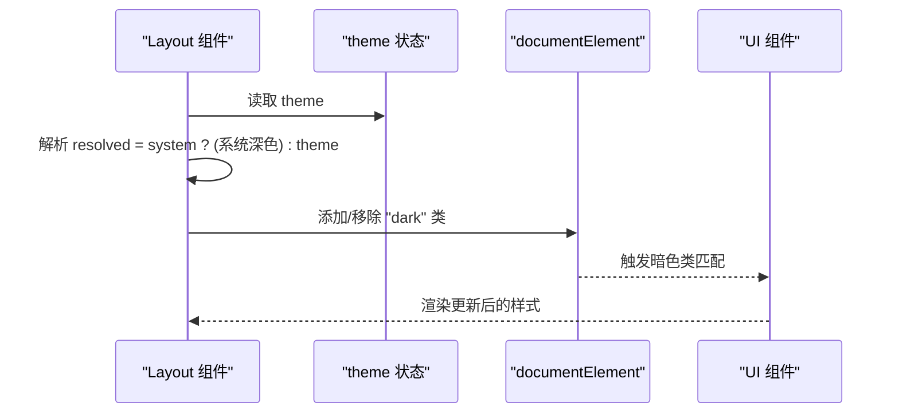
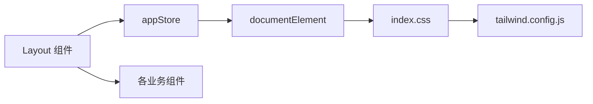

# 主题切换机制

<cite>
**本文引用的文件**
- [src/stores/appStore.ts](file://src/stores/appStore.ts)
- [src/components/Layout/index.tsx](file://src/components/Layout/index.tsx)
- [src/index.css](file://src/index.css)
- [tailwind.config.js](file://tailwind.config.js)
- [src/components/SearchModal/index.tsx](file://src/components/SearchModal/index.tsx)
- [src/components/SignalCard/index.tsx](file://src/components/SignalCard/index.tsx)
- [src/components/TagFilter/index.tsx](file://src/components/TagFilter/index.tsx)
- [src/App.tsx](file://src/App.tsx)
- [src/main.tsx](file://src/main.tsx)
</cite>

## 目录
1. [简介](#简介)
2. [项目结构](#项目结构)
3. [核心组件](#核心组件)
4. [架构总览](#架构总览)
5. [详细组件分析](#详细组件分析)
6. [依赖关系分析](#依赖关系分析)
7. [性能考量](#性能考量)
8. [故障排查指南](#故障排查指南)
9. [结论](#结论)
10. [附录：主题扩展与自定义指南](#附录主题扩展与自定义指南)

## 简介
本文件系统性阐述本项目的主题切换机制，覆盖明暗主题的实现原理、状态管理、用户偏好持久化、切换触发方式、状态同步与样式应用逻辑，并给出主题扩展与自定义指南以及无障碍访问建议。系统采用“class 模式”的 Tailwind darkMode 配置，通过在根元素上切换类名实现主题切换；同时结合 Zustand store 将主题状态持久化到本地存储，确保刷新后仍保持用户选择。

## 项目结构
主题系统涉及以下关键文件与职责：
- 应用入口与全局样式
  - 入口脚本：负责挂载应用与初始化
  - 全局样式：定义 CSS 变量、基础层与组件层样式，以及暗色类的覆盖
- 主题状态管理
  - Zustand store：集中管理 theme、resolvedTheme、setTheme 以及持久化策略
- 布局与交互
  - 布局组件：监听主题变化、渲染主题切换按钮、根据主题切换根元素类名
- 样式与主题变量
  - Tailwind 配置：启用 class 模式的 darkMode，扩展品牌色与信号色
  - 组件样式：大量使用暗色类与 CSS 变量，保证在不同主题下正确渲染

图表来源
- [src/main.tsx](file://src/main.tsx)
- [src/App.tsx](file://src/App.tsx)
- [src/index.css](file://src/index.css)
- [tailwind.config.js](file://tailwind.config.js)
- [src/stores/appStore.ts](file://src/stores/appStore.ts)
- [src/components/Layout/index.tsx](file://src/components/Layout/index.tsx)
- [src/components/SearchModal/index.tsx](file://src/components/SearchModal/index.tsx)
- [src/components/SignalCard/index.tsx](file://src/components/SignalCard/index.tsx)
- [src/components/TagFilter/index.tsx](file://src/components/TagFilter/index.tsx)

章节来源
- [src/main.tsx](file://src/main.tsx)
- [src/App.tsx](file://src/App.tsx)
- [src/index.css](file://src/index.css)
- [tailwind.config.js](file://tailwind.config.js)

## 核心组件
- 主题状态与持久化（Zustand）
  - 字段与行为
    - theme: 当前用户选择，可为 light、dark 或 system
    - resolvedTheme: 实际生效的主题，由 theme 与系统偏好共同决定
    - setTheme(theme): 设置主题并同步到根元素类名，同时更新 resolvedTheme
  - 持久化策略
    - 使用 persist 中间件，仅持久化 theme、role、readHistory、favorites 等必要字段
- 布局中的主题初始化与切换
  - 初始化：当 theme 为 system 时，依据系统深色偏好解析为 light/dark；随后在 documentElement 上添加/移除 dark 类
  - 切换：循环切换 theme(light → dark → system → light)，并调用 setTheme 更新状态与 DOM 类名
- 样式体系
  - CSS 变量：在 :root 与 .dark 中分别定义背景、文本、边框等变量，用于统一主题色值
  - Tailwind 扩展：定义 primary、signal、surface 等品牌色，配合暗色类实现自动适配
  - 组件层：大量使用 dark: 前缀类与 CSS 变量，保证在不同主题下呈现一致的视觉效果

章节来源
- [src/stores/appStore.ts](file://src/stores/appStore.ts)
- [src/components/Layout/index.tsx](file://src/components/Layout/index.tsx)
- [src/index.css](file://src/index.css)
- [tailwind.config.js](file://tailwind.config.js)

## 架构总览
主题切换的端到端流程如下：

图表来源
- [src/components/Layout/index.tsx](file://src/components/Layout/index.tsx)
- [src/stores/appStore.ts](file://src/stores/appStore.ts)
- [src/index.css](file://src/index.css)
- [tailwind.config.js](file://tailwind.config.js)

## 详细组件分析

### Zustand 主题状态管理（appStore）
- 设计要点
  - 使用 create 与 persist 中间件，将主题状态持久化到本地存储
  - setTheme 内部处理 system 模式：若为 system，则读取系统 prefers-color-scheme，否则直接使用传入值
  - 同步更新 resolvedTheme，并在根元素上切换 dark 类以驱动样式系统
- 数据结构与复杂度
  - setTheme 为 O(1) 操作，主要开销来自 DOM 类名切换与样式重绘
- 错误处理与边界
  - 若系统偏好不可用或不支持，system 模式回退为 light
  - 切换顺序为 light → dark → system → light，避免无限循环

图表来源
- [src/stores/appStore.ts](file://src/stores/appStore.ts)

章节来源
- [src/stores/appStore.ts](file://src/stores/appStore.ts)

### 布局组件（Layout）主题初始化与切换
- 初始化逻辑
  - 在 effect 中根据 theme 计算 resolved，并设置 documentElement 的 dark 类
  - 支持响应式：当外部 theme 发生变化时重新计算
- 切换逻辑
  - cycleTheme 循环切换 theme 值
  - 调用 setTheme 完成状态更新与 DOM 同步
- 样式适配
  - 大量使用 dark: 前缀类与 CSS 变量，确保在不同主题下背景、边框、文本等元素正确渲染

图表来源
- [src/components/Layout/index.tsx](file://src/components/Layout/index.tsx)

章节来源
- [src/components/Layout/index.tsx](file://src/components/Layout/index.tsx)

### 样式系统（CSS 变量与暗色类）
- CSS 变量
  - :root 定义默认主题的颜色变量
  - .dark 定义暗色主题的颜色变量，覆盖默认值
- 组件层样式
  - 大量使用 dark: 前缀类与 CSS 变量，确保在不同主题下背景、边框、文本等元素正确渲染
- Tailwind 扩展
  - darkMode: 'class'，使暗色类在 Tailwind 中生效
  - 扩展品牌色：primary、signal、surface 等，便于组件复用

章节来源
- [src/index.css](file://src/index.css)
- [tailwind.config.js](file://tailwind.config.js)

### 关键组件的主题适配示例
- 搜索模态框
  - 使用 dark: 背景色与边框类，确保在暗色主题下有合适的对比度
- 信号卡片
  - 使用信号色与暗色类，突出高/中/低风险等级
- 标签过滤器
  - 使用暗色类与 hover 效果，提升交互体验

章节来源
- [src/components/SearchModal/index.tsx](file://src/components/SearchModal/index.tsx)
- [src/components/SignalCard/index.tsx](file://src/components/SignalCard/index.tsx)
- [src/components/TagFilter/index.tsx](file://src/components/TagFilter/index.tsx)

## 依赖关系分析
- 组件耦合
  - Layout 依赖 appStore 提供的 setTheme 与 theme 状态
  - 样式系统依赖 Tailwind 的 darkMode 配置与 CSS 变量
- 外部依赖
  - Tailwind CSS：提供暗色类与品牌色扩展
  - Zustand：提供轻量的状态管理与持久化能力
- 潜在循环依赖
  - 未发现直接循环依赖；store 与组件之间为单向数据流

图表来源
- [src/components/Layout/index.tsx](file://src/components/Layout/index.tsx)
- [src/stores/appStore.ts](file://src/stores/appStore.ts)
- [src/index.css](file://src/index.css)
- [tailwind.config.js](file://tailwind.config.js)

章节来源
- [src/components/Layout/index.tsx](file://src/components/Layout/index.tsx)
- [src/stores/appStore.ts](file://src/stores/appStore.ts)
- [src/index.css](file://src/index.css)
- [tailwind.config.js](file://tailwind.config.js)

## 性能考量
- DOM 操作最小化
  - setTheme 仅切换 documentElement 的 dark 类，避免大规模重排
- 样式计算
  - CSS 变量与 Tailwind 暗色类在编译期生成，运行时开销极小
- 动画与过渡
  - 部分组件使用 transition-* 类，切换主题时具备平滑过渡体验
- 建议
  - 避免在主题切换时进行昂贵的副作用操作
  - 如需扩展更多主题，建议继续沿用 class 模式与 CSS 变量，保持性能与一致性

## 故障排查指南
- 现象：切换主题后 UI 无变化
  - 排查点：确认 documentElement 是否存在 dark 类；检查 Tailwind darkMode 配置是否为 class
  - 参考路径：[src/stores/appStore.ts](file://src/stores/appStore.ts)、[tailwind.config.js](file://tailwind.config.js)
- 现象：刷新页面后主题未保持
  - 排查点：确认 persist 中间件是否正确配置，且 theme 字段被持久化
  - 参考路径：[src/stores/appStore.ts](file://src/stores/appStore.ts)
- 现象：系统偏好未生效
  - 排查点：确认 matchMedia 对 prefers-color-scheme 的支持；检查 system 模式分支逻辑
  - 参考路径：[src/stores/appStore.ts](file://src/stores/appStore.ts)
- 现象：某些组件未按预期变色
  - 排查点：确认组件是否使用了 dark: 前缀类或 CSS 变量；检查 Tailwind 扩展颜色是否正确
  - 参考路径：[src/index.css](file://src/index.css)、[tailwind.config.js](file://tailwind.config.js)

章节来源
- [src/stores/appStore.ts](file://src/stores/appStore.ts)
- [src/index.css](file://src/index.css)
- [tailwind.config.js](file://tailwind.config.js)

## 结论
本项目采用“class 模式”的暗色主题方案，结合 CSS 变量与 Tailwind 暗色类，实现了简洁高效的明暗主题切换。Zustand store 将主题状态与用户偏好持久化，确保跨会话的一致性。整体架构清晰、性能友好，易于扩展与维护。

## 附录：主题扩展与自定义指南

### 主题状态管理与持久化
- 状态字段
  - theme: 用户选择（light/dark/system）
  - resolvedTheme: 实际生效主题（light/dark）
  - setTheme: 设置主题并同步到 DOM
- 持久化
  - 使用 persist 中间件，仅持久化必要字段，减少存储体积

章节来源
- [src/stores/appStore.ts](file://src/stores/appStore.ts)

### 切换机制与触发方式
- 触发方式
  - 布局组件按钮点击，循环切换 theme
  - setTheme 内部解析 system 模式并更新 DOM 类
- 状态同步
  - setTheme 同步更新 resolvedTheme，并在根元素上切换 dark 类

章节来源
- [src/components/Layout/index.tsx](file://src/components/Layout/index.tsx)
- [src/stores/appStore.ts](file://src/stores/appStore.ts)

### 样式应用逻辑与类名规则
- CSS 变量
  - :root 定义默认颜色变量；.dark 覆盖暗色变量
- 暗色类
  - Tailwind darkMode: 'class'，通过 dark: 前缀类自动适配
- 组件样式
  - 大量使用 dark: 前缀类与 CSS 变量，确保在不同主题下正确渲染

章节来源
- [src/index.css](file://src/index.css)
- [tailwind.config.js](file://tailwind.config.js)

### 颜色变量映射与品牌色彩集成
- 品牌色扩展
  - Tailwind 配置中定义 primary、signal、surface 等品牌色
- 使用建议
  - 组件中优先使用扩展色与暗色类组合，保证一致性

章节来源
- [tailwind.config.js](file://tailwind.config.js)

### 主题扩展与自定义步骤
- 新增主题模式
  - 在 setTheme 中扩展解析逻辑，支持新的主题枚举值
  - 在 documentElement 上切换对应类名，或新增 CSS 变量覆盖
- 自定义品牌色
  - 在 Tailwind 配置中扩展 colors，确保与现有组件类名兼容
- 组件适配
  - 为新主题补充必要的 dark: 前缀类或 CSS 变量覆盖
- 用户偏好持久化
  - 在 persist 配置中加入新字段，确保跨会话保持

章节来源
- [src/stores/appStore.ts](file://src/stores/appStore.ts)
- [tailwind.config.js](file://tailwind.config.js)
- [src/index.css](file://src/index.css)

### 无障碍访问支持建议
- 对比度
  - 确保在暗色主题下文本与背景的对比度满足 WCAG 建议
- 键盘导航
  - 主题切换按钮应可通过键盘激活，提供明确的焦点指示
- 屏幕阅读器
  - 为按钮提供语义化标题或 aria-label，提示当前主题状态
- 系统偏好
  - system 模式应尊重系统深色偏好，避免强制覆盖