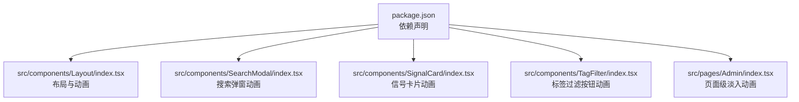
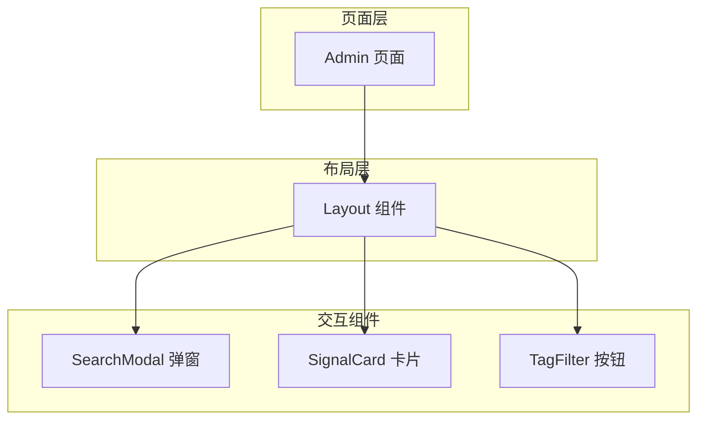
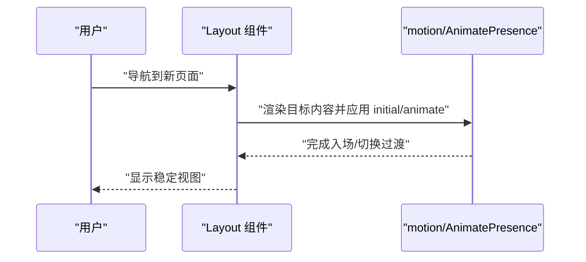
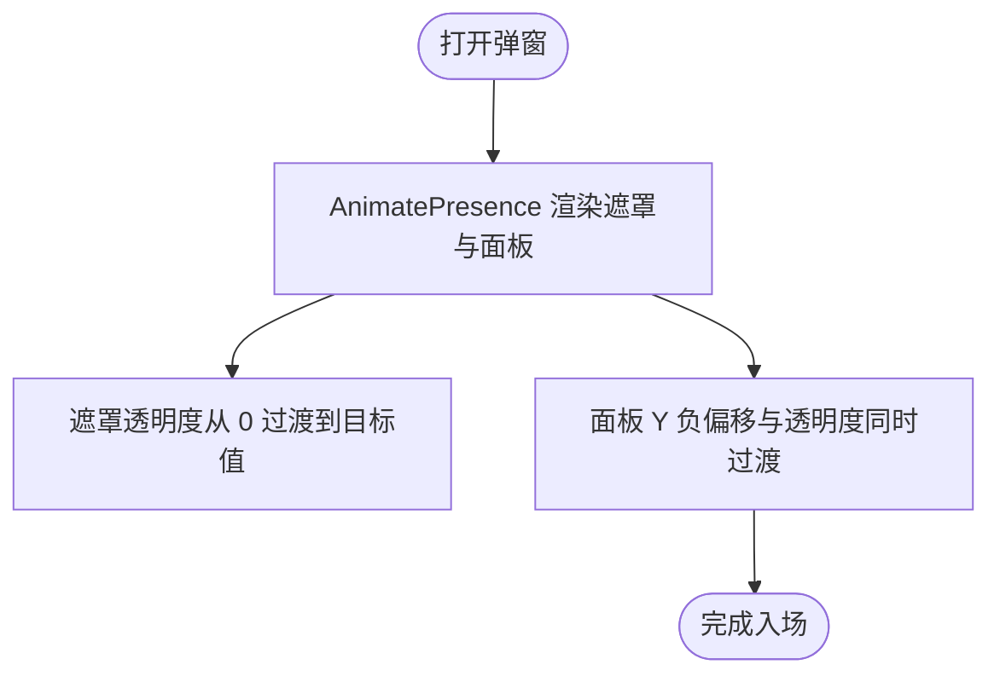
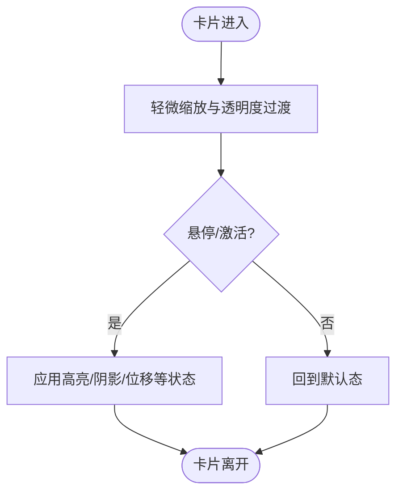
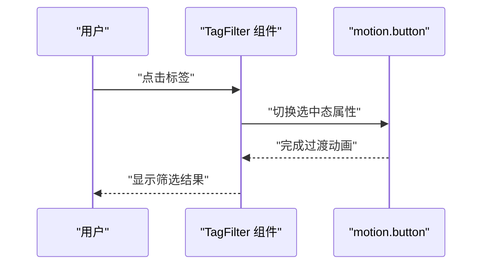
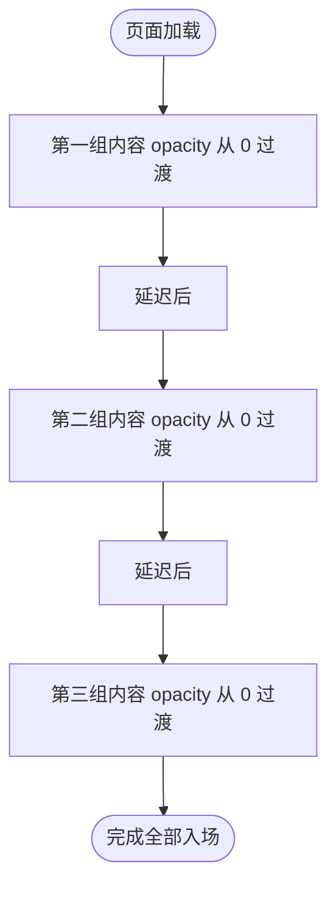
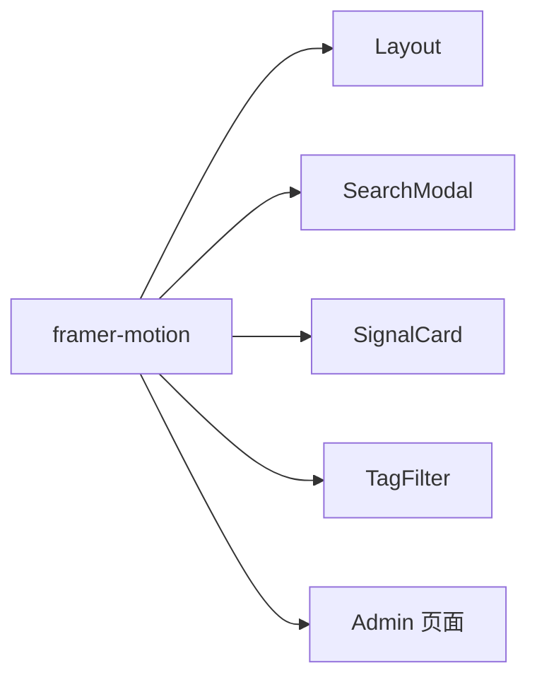

# 动画与交互

<cite>
**本文引用的文件**
- [package.json](file://package.json)
- [src/components/Layout/index.tsx](file://src/components/Layout/index.tsx)
- [src/components/SearchModal/index.tsx](file://src/components/SearchModal/index.tsx)
- [src/components/SignalCard/index.tsx](file://src/components/SignalCard/index.tsx)
- [src/components/TagFilter/index.tsx](file://src/components/TagFilter/index.tsx)
- [src/pages/Admin/index.tsx](file://src/pages/Admin/index.tsx)
</cite>

## 目录
1. [简介](#简介)
2. [项目结构](#项目结构)
3. [核心组件](#核心组件)
4. [架构总览](#架构总览)
5. [详细组件分析](#详细组件分析)
6. [依赖关系分析](#依赖关系分析)
7. [性能考量](#性能考量)
8. [故障排查指南](#故障排查指南)
9. [结论](#结论)
10. [附录](#附录)

## 简介
本文件系统性梳理本项目中基于 Framer Motion 的动画与交互实现，覆盖自定义动画配置、关键帧定义、缓动函数选择、常见动画效果（如 fadeIn、slideUp、countUp）的实现思路与适用场景，并总结组件进入/退出动画、状态变化过渡、用户交互反馈的实践方式。同时提供性能优化建议、硬件加速利用与跨设备降级策略，帮助在多端环境中保持流畅体验。

## 项目结构
项目采用 React + TypeScript 构建，动画能力通过 Framer Motion 提供。核心动画使用集中在以下模块：
- 布局与页面容器：Layout、Admin 页面
- 交互组件：SearchModal、SignalCard、TagFilter
- 动画依赖：package.json 中声明 framer-motion 版本

**图示来源**
- [package.json](file://package.json)
- [src/components/Layout/index.tsx](file://src/components/Layout/index.tsx)
- [src/components/SearchModal/index.tsx](file://src/components/SearchModal/index.tsx)
- [src/components/SignalCard/index.tsx](file://src/components/SignalCard/index.tsx)
- [src/components/TagFilter/index.tsx](file://src/components/TagFilter/index.tsx)
- [src/pages/Admin/index.tsx](file://src/pages/Admin/index.tsx)

**章节来源**
- [package.json](file://package.json)

## 核心组件
- Framer Motion 集成点
  - 在多个组件中引入 motion 与 AnimatePresence，用于包裹可动画元素与控制挂载/卸载过渡。
  - 使用初始态 initial 与目标态 animate 定义关键帧，结合 variants 或直接属性进行过渡。
  - 利用 layout 布局动画特性实现尺寸与位置变更的平滑过渡。
- 关键帧与缓动
  - 通过配置 transition 对象统一管理持续时间、缓动曲线与延迟，确保全局一致性。
  - 缓动函数可选用内置 ease-in/out/circ 等或自定义贝塞尔曲线，以匹配产品节奏。
- 常见动画模式
  - fadeIn：通过 opacity 从 0 过渡到目标值，常用于页面或内容块的出现。
  - slideUp：通过 y 或 translate 的负偏移配合 opacity 实现上滑入场。
  - countUp：数值型数据的渐变展示，适合 KPI、统计类指标。

**章节来源**
- [src/components/Layout/index.tsx](file://src/components/Layout/index.tsx)
- [src/components/SearchModal/index.tsx](file://src/components/SearchModal/index.tsx)
- [src/components/SignalCard/index.tsx](file://src/components/SignalCard/index.tsx)
- [src/components/TagFilter/index.tsx](file://src/components/TagFilter/index.tsx)
- [src/pages/Admin/index.tsx](file://src/pages/Admin/index.tsx)

## 架构总览
下图展示了动画在各层级中的分布与调用关系：页面层负责整体入场；组件层负责局部交互与过渡；布局层负责全局导航与切换动画；弹窗与卡片组件负责细节反馈与状态变化。

**图示来源**
- [src/pages/Admin/index.tsx](file://src/pages/Admin/index.tsx)
- [src/components/Layout/index.tsx](file://src/components/Layout/index.tsx)
- [src/components/SearchModal/index.tsx](file://src/components/SearchModal/index.tsx)
- [src/components/SignalCard/index.tsx](file://src/components/SignalCard/index.tsx)
- [src/components/TagFilter/index.tsx](file://src/components/TagFilter/index.tsx)

## 详细组件分析

### 布局与页面级动画（Layout）
- 入场与切换
  - 使用 AnimatePresence 包裹可切换区域，控制子树挂载/卸载时的过渡。
  - 通过 initial 与 animate 配置透明度与位移，形成自然的页面切换与内容出现。
- 布局过渡
  - 结合 layout 属性，使尺寸与位置变化具备物理感的插值，减少跳闪。
- 可扩展点
  - 将 transition 统一抽离为主题配置，便于全局风格一致。

**图示来源**
- [src/components/Layout/index.tsx](file://src/components/Layout/index.tsx)

**章节来源**
- [src/components/Layout/index.tsx](file://src/components/Layout/index.tsx)

### 搜索弹窗（SearchModal）
- 出入控制
  - 使用 AnimatePresence 管理遮罩与面板的显隐，避免 DOM 瞬间切换。
  - 遮罩与内容分别设置 transition，保证视觉层次清晰。
- 交互反馈
  - 输入聚焦、列表滚动、键盘交互时可结合 hover/press 状态动画增强反馈。
- 可扩展点
  - 将动画参数抽取为常量，便于在主题中统一管理。

**图示来源**
- [src/components/SearchModal/index.tsx](file://src/components/SearchModal/index.tsx)

**章节来源**
- [src/components/SearchModal/index.tsx](file://src/components/SearchModal/index.tsx)

### 信号卡片（SignalCard）
- 状态变化
  - 通过 variants 或直接属性在 hover/active 状态间切换，提升点击与悬停反馈。
  - 列表项的进入/离开可结合 AnimatePresence 与 transition 实现有序过渡。
- 数据更新
  - 数值型字段可采用数值插值（countUp）实现平滑更新，避免突变。
- 可扩展点
  - 将常用缓动与时长封装为工具函数，复用到同类卡片。

**图示来源**
- [src/components/SignalCard/index.tsx](file://src/components/SignalCard/index.tsx)

**章节来源**
- [src/components/SignalCard/index.tsx](file://src/components/SignalCard/index.tsx)

### 标签过滤（TagFilter）
- 交互反馈
  - 按钮在选中/未选中状态间切换时，通过 scale/opacity/border-color 等属性的过渡增强反馈。
- 列表更新
  - 当筛选条件变化导致列表重排时，结合 layout 与 transition 实现平滑过渡。
- 可扩展点
  - 将选中态样式与过渡参数标准化，便于主题化与无障碍适配。

**图示来源**
- [src/components/TagFilter/index.tsx](file://src/components/TagFilter/index.tsx)

**章节来源**
- [src/components/TagFilter/index.tsx](file://src/components/TagFilter/index.tsx)

### 页面级淡入（Admin）
- 内容分组入场
  - 将页面内容分组，每组使用独立的 motion.div 并设置 initial/animate，形成有序的逐块出现。
- 参数统一
  - 通过 transition 对象集中管理时长、缓动与延迟，确保节奏一致。
- 可扩展点
  - 将 transition 抽象为常量，便于主题化与跨页面复用。

**图示来源**
- [src/pages/Admin/index.tsx](file://src/pages/Admin/index.tsx)

**章节来源**
- [src/pages/Admin/index.tsx](file://src/pages/Admin/index.tsx)

## 依赖关系分析
- 动画库依赖
  - 项目通过 npm/yarn 安装 Framer Motion，版本信息可在 package.json 中查看。
- 组件耦合
  - 各组件对 Framer Motion 的使用相对独立，耦合度低，便于按需扩展与替换。
- 外部依赖
  - 无与动画强相关的第三方 UI 库，主要依赖浏览器原生动画能力与 Framer Motion 的渲染管线。

**图示来源**
- [package.json](file://package.json)
- [src/components/Layout/index.tsx](file://src/components/Layout/index.tsx)
- [src/components/SearchModal/index.tsx](file://src/components/SearchModal/index.tsx)
- [src/components/SignalCard/index.tsx](file://src/components/SignalCard/index.tsx)
- [src/components/TagFilter/index.tsx](file://src/components/TagFilter/index.tsx)
- [src/pages/Admin/index.tsx](file://src/pages/Admin/index.tsx)

**章节来源**
- [package.json](file://package.json)

## 性能考量
- 硬件加速
  - 优先使用 transform 与 opacity 动画，避免触发布局与绘制阶段，减少重排与重绘。
  - 合理拆分动画层，将复杂动画限定在必要元素上，降低合成压力。
- 帧率与时长
  - 控制动画时长与缓动，避免过长的过渡造成感知迟滞；对高频交互采用更短时长。
  - 使用节流/防抖处理频繁状态变化，减少不必要的重渲染。
- 布局动画
  - 在需要尺寸/位置变化的场景启用 layout，但注意限制参与动画的节点数量，避免大规模布局抖动。
- 主题化与复用
  - 将 transition 参数抽象为常量或主题配置，统一全局节奏，减少重复计算与不一致开销。
- 设备差异
  - 移动端优先使用轻量动画，必要时降级为静态或缩短时长；桌面端可适当增加细节与时长。
  - 在低端设备上禁用阴影、模糊等昂贵效果，或在检测到性能不足时动态调整动画策略。

## 故障排查指南
- 动画不生效
  - 检查是否正确引入 motion 与 AnimatePresence，确认 initial/animate 配置存在且值有效。
  - 确认 transition 对象未被意外覆盖或遗漏。
- 过渡卡顿
  - 检查是否有过多元素同时参与动画，尝试拆分动画层或减少参与节点。
  - 避免在动画过程中触发布局计算，尽量使用 transform/opacity。
- 布局抖动
  - 若使用 layout，请确保相邻元素的尺寸/间距在动画前后保持一致，或通过占位符避免跳闪。
- 交互延迟
  - 对高频事件（如滚动、输入）使用节流/防抖，减少状态变更频率。
- 跨设备表现差异
  - 在移动端测试时，适当缩短动画时长或简化缓动；对低端设备考虑禁用部分动画。

## 结论
本项目已将 Framer Motion 有效地嵌入到布局、弹窗、卡片与标签等组件中，形成统一的动画语言与交互节奏。通过合理的关键帧设计、缓动选择与性能优化策略，能够在多端环境中提供流畅、一致的用户体验。建议后续进一步抽象动画参数、完善主题化配置，并在关键路径上做性能监控与降级预案。

## 附录
- 常用动画模式参考
  - fadeIn：适用于内容块、页面级出现。
  - slideUp：适用于弹窗、抽屉、提示条等自底部入场。
  - countUp：适用于数值型指标、统计值更新。
- 推荐实践
  - 将 transition 参数集中管理，便于主题化与一致性。
  - 在高频交互中优先使用 transform/opacity，避免昂贵效果。
  - 在移动端适度降级，保障基础体验。