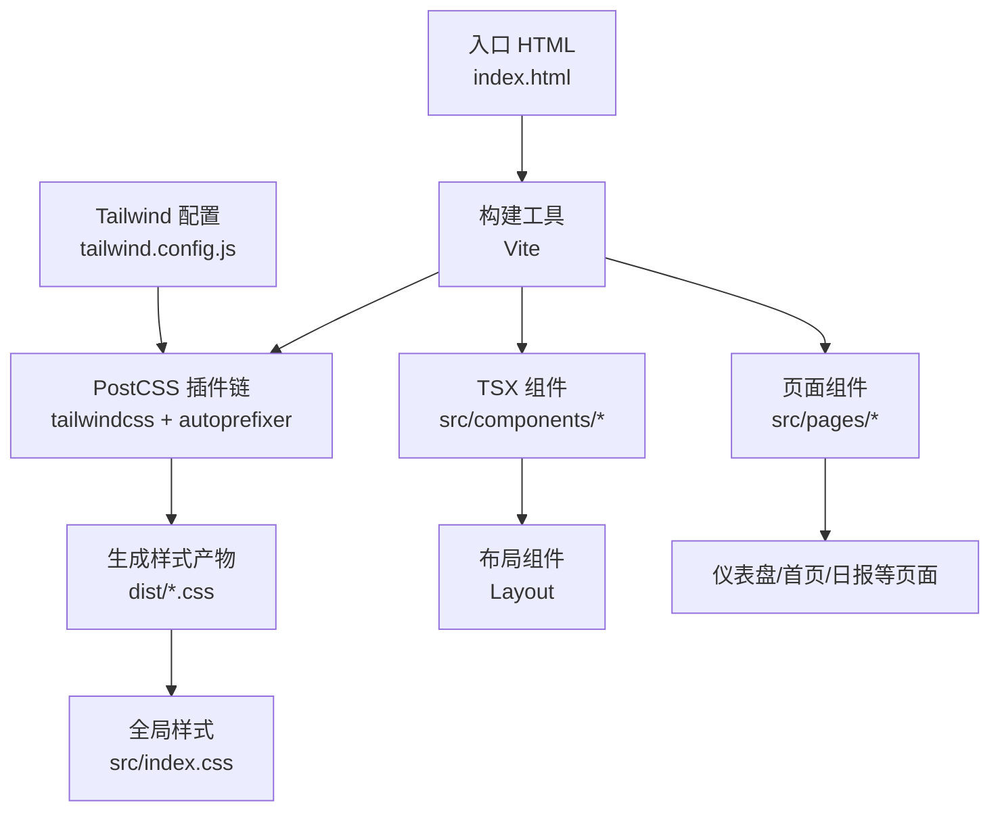
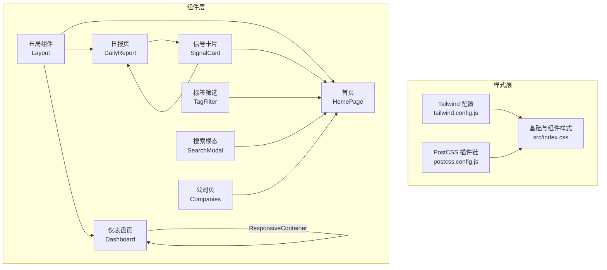
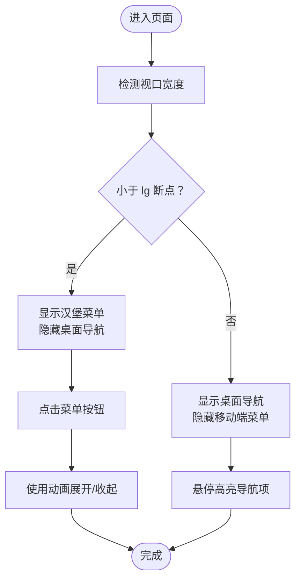
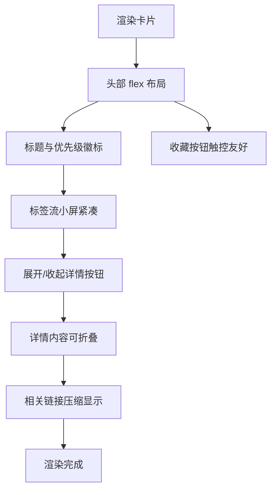
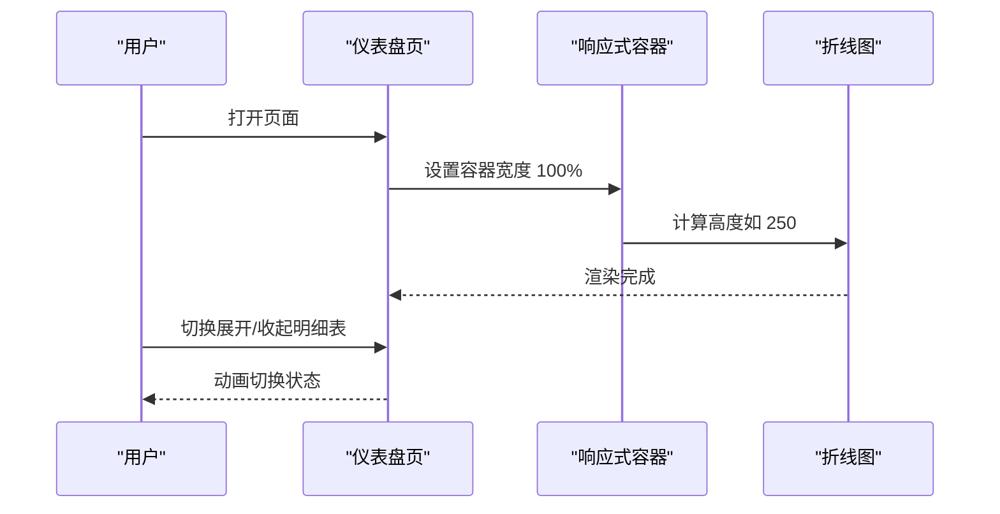
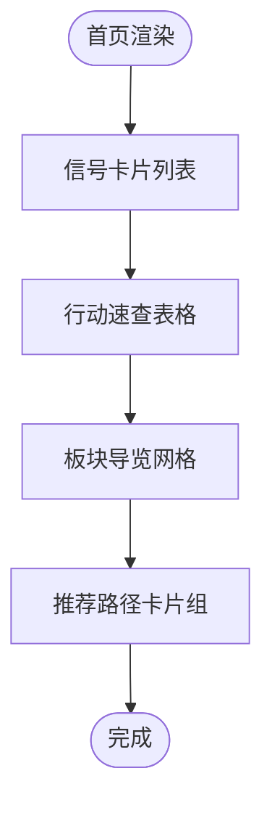
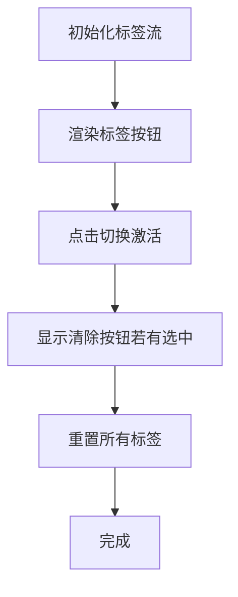
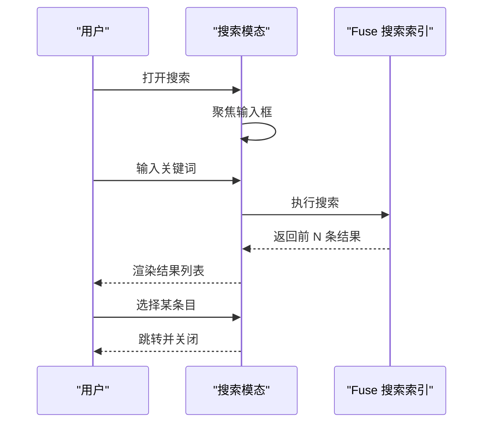
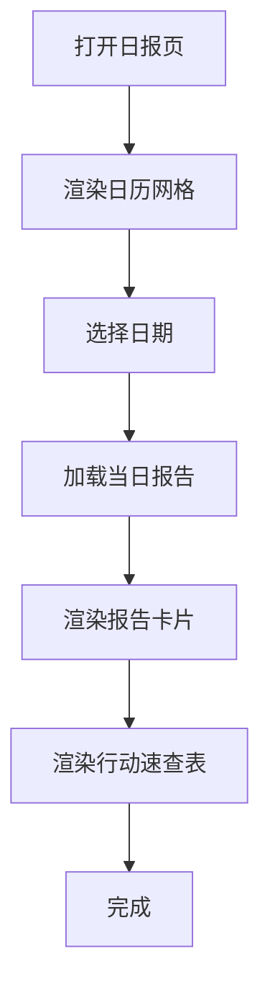
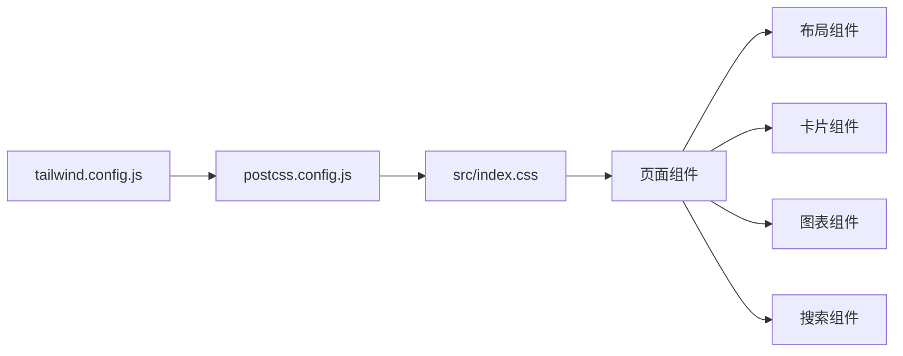

# 响应式设计

<cite>
**本文引用的文件**
- [tailwind.config.js](file://tailwind.config.js)
- [src/index.css](file://src/index.css)
- [postcss.config.js](file://postcss.config.js)
- [src/components/Layout/index.tsx](file://src/components/Layout/index.tsx)
- [src/components/SignalCard/index.tsx](file://src/components/SignalCard/index.tsx)
- [src/pages/Dashboard/index.tsx](file://src/pages/Dashboard/index.tsx)
- [src/pages/HomePage/index.tsx](file://src/pages/HomePage/index.tsx)
- [src/components/TagFilter/index.tsx](file://src/components/TagFilter/index.tsx)
- [src/components/SearchModal/index.tsx](file://src/components/SearchModal/index.tsx)
- [src/pages/DailyReport/index.tsx](file://src/pages/DailyReport/index.tsx)
- [src/pages/Companies/index.tsx](file://src/pages/Companies/index.tsx)
- [package.json](file://package.json)
</cite>

## 目录
1. [简介](#简介)
2. [项目结构](#项目结构)
3. [核心组件](#核心组件)
4. [架构总览](#架构总览)
5. [详细组件分析](#详细组件分析)
6. [依赖关系分析](#依赖关系分析)
7. [性能考量](#性能考量)
8. [故障排查指南](#故障排查指南)
9. [结论](#结论)
10. [附录](#附录)

## 简介
本文件系统化梳理本项目的响应式设计策略与实现，重点覆盖：
- 断点与前缀：基于 Tailwind 默认断点（以 `sm`、`lg` 等为分界）的移动端优先策略
- 移动端优先：从最小屏幕出发，逐步增强到大屏
- 触摸友好：交互元素尺寸、间距与可点击区域优化
- 屏幕适配：移动端、平板、桌面端的布局与信息密度差异
- 组件化响应：卡片、网格、表格、图表等常见组件的响应式模式
- 性能与兼容：动画、图表、搜索与暗色模式在多设备上的表现与优化建议

## 项目结构
项目采用 React + Vite + TailwindCSS 构建，样式通过 PostCSS 编译注入，组件按功能模块拆分，页面按业务域划分。

图示来源
- [postcss.config.js:1-6](file://postcss.config.js#L1-L6)
- [tailwind.config.js:1-60](file://tailwind.config.js#L1-L60)
- [src/index.css:1-101](file://src/index.css#L1-L101)

章节来源
- [postcss.config.js:1-6](file://postcss.config.js#L1-L6)
- [tailwind.config.js:1-60](file://tailwind.config.js#L1-L60)
- [src/index.css:1-101](file://src/index.css#L1-L101)

## 核心组件
- 布局组件：主导航、移动端菜单、主题切换、搜索入口
- 信号卡片：优先级边框、折叠详情、相关链接
- 仪表盘页：KPI 卡片网格、趋势图表容器、明细表折叠
- 首页：网格卡片、行动速查、板块导览、推荐路径
- 标签筛选：响应式标签流
- 搜索模态：全屏输入与结果列表
- 日报页：日历选择器、报告卡片、行动速查表
- 公司页：信息卡片网格

章节来源
- [src/components/Layout/index.tsx:1-174](file://src/components/Layout/index.tsx#L1-L174)
- [src/components/SignalCard/index.tsx:1-174](file://src/components/SignalCard/index.tsx#L1-L174)
- [src/pages/Dashboard/index.tsx:1-208](file://src/pages/Dashboard/index.tsx#L1-L208)
- [src/pages/HomePage/index.tsx:1-213](file://src/pages/HomePage/index.tsx#L1-L213)
- [src/components/TagFilter/index.tsx:1-49](file://src/components/TagFilter/index.tsx#L1-L49)
- [src/components/SearchModal/index.tsx:1-156](file://src/components/SearchModal/index.tsx#L1-L156)
- [src/pages/DailyReport/index.tsx:1-263](file://src/pages/DailyReport/index.tsx#L1-L263)
- [src/pages/Companies/index.tsx:1-69](file://src/pages/Companies/index.tsx#L1-L69)

## 架构总览
下图展示响应式相关的样式与组件协作关系：Tailwind 提供断点与原子类；页面组件通过网格、间距、排版类实现自适应；布局组件负责移动端菜单与导航切换；图表组件使用响应式容器保证在不同宽度下保持比例。

图示来源
- [tailwind.config.js:1-60](file://tailwind.config.js#L1-L60)
- [src/index.css:1-101](file://src/index.css#L1-L101)
- [postcss.config.js:1-6](file://postcss.config.js#L1-L6)
- [src/components/Layout/index.tsx:1-174](file://src/components/Layout/index.tsx#L1-L174)
- [src/pages/Dashboard/index.tsx:1-208](file://src/pages/Dashboard/index.tsx#L1-L208)
- [src/pages/HomePage/index.tsx:1-213](file://src/pages/HomePage/index.tsx#L1-L213)
- [src/components/TagFilter/index.tsx:1-49](file://src/components/TagFilter/index.tsx#L1-L49)
- [src/components/SearchModal/index.tsx:1-156](file://src/components/SearchModal/index.tsx#L1-L156)
- [src/pages/DailyReport/index.tsx:1-263](file://src/pages/DailyReport/index.tsx#L1-L263)
- [src/pages/Companies/index.tsx:1-69](file://src/pages/Companies/index.tsx#L1-L69)

## 详细组件分析

### 布局组件（移动端优先与断点）
- 断点使用
  - 桌面端导航：仅在 `lg` 及以上断点显示
  - 移动端菜单：在 `lg` 以下显示汉堡菜单，展开为纵向列表
  - 标题与图标：在小屏隐藏部分文本，保留关键标识
- 移动优先
  - 内边距与行高在小屏更紧凑，避免纵向滚动过多
  - 导航项在移动端采用更大触控目标与更高对比度
- 动画与交互
  - 使用动画库实现菜单展开/收起与页面切换过渡
  - 主题切换与键盘快捷键（Cmd/Ctrl+K）提升移动端可用性

图示来源
- [src/components/Layout/index.tsx:64-85](file://src/components/Layout/index.tsx#L64-L85)
- [src/components/Layout/index.tsx:116-149](file://src/components/Layout/index.tsx#L116-L149)

章节来源
- [src/components/Layout/index.tsx:1-174](file://src/components/Layout/index.tsx#L1-L174)

### 信号卡片（优先级与折叠详情）
- 响应式布局
  - 卡片内标题、标签、优先级徽标在小屏紧凑排列
  - 折叠详情按钮在小屏仍保持较大触控目标
- 优先级视觉
  - 通过左侧边框颜色区分高/中/低优先级，便于快速识别
- 相关内容
  - 在小屏压缩“关联公司/研究/案例”列表，避免换行过多

图示来源
- [src/components/SignalCard/index.tsx:40-108](file://src/components/SignalCard/index.tsx#L40-L108)

章节来源
- [src/components/SignalCard/index.tsx:1-174](file://src/components/SignalCard/index.tsx#L1-L174)

### 仪表盘页（网格与图表）
- KPI 卡片网格
  - 小屏：2 列；中屏：3 列；大屏及以上：6 列
- 趋势图表
  - 使用响应式容器保持宽高比，图表内部刻度与文字在小屏缩小
- 明细表
  - 支持折叠/展开，小屏下优先显示关键列，横向滚动容器保证可读性

图示来源
- [src/pages/Dashboard/index.tsx:29-50](file://src/pages/Dashboard/index.tsx#L29-L50)
- [src/pages/Dashboard/index.tsx:52-89](file://src/pages/Dashboard/index.tsx#L52-L89)
- [src/pages/Dashboard/index.tsx:91-105](file://src/pages/Dashboard/index.tsx#L91-L105)

章节来源
- [src/pages/Dashboard/index.tsx:1-208](file://src/pages/Dashboard/index.tsx#L1-L208)

### 首页（网格与卡片）
- 今日信号：卡片列表，小屏紧凑，大屏可扩展
- 行动速查：表格在小屏隐藏次要列，使用 `sm:table-cell` 控制显示
- 板块导览：网格列数随断点递增（sm:2, lg:4），保证每列宽度与可读性
- 推荐路径：卡片组在小屏堆叠，大屏并排

图示来源
- [src/pages/HomePage/index.tsx:67-91](file://src/pages/HomePage/index.tsx#L67-L91)
- [src/pages/HomePage/index.tsx:93-124](file://src/pages/HomePage/index.tsx#L93-L124)
- [src/pages/HomePage/index.tsx:126-147](file://src/pages/HomePage/index.tsx#L126-L147)
- [src/pages/HomePage/index.tsx:149-180](file://src/pages/HomePage/index.tsx#L149-L180)

章节来源
- [src/pages/HomePage/index.tsx:1-213](file://src/pages/HomePage/index.tsx#L1-L213)

### 标签筛选（响应式标签流）
- 小屏：标签紧凑排列，避免换行
- 大屏：标签间距增大，提升触控体验
- 交互：点击切换激活状态，清除按钮在有选中时显示

图示来源
- [src/components/TagFilter/index.tsx:9-48](file://src/components/TagFilter/index.tsx#L9-L48)

章节来源
- [src/components/TagFilter/index.tsx:1-49](file://src/components/TagFilter/index.tsx#L1-L49)

### 搜索模态（全屏与结果）
- 小屏：全屏弹窗，输入区突出，结果列表滚动
- 大屏：最大宽度限制，居中显示
- 交互：Esc 或点击背景关闭，键盘聚焦优化

图示来源
- [src/components/SearchModal/index.tsx:47-73](file://src/components/SearchModal/index.tsx#L47-L73)
- [src/components/SearchModal/index.tsx:113-149](file://src/components/SearchModal/index.tsx#L113-L149)

章节来源
- [src/components/SearchModal/index.tsx:1-156](file://src/components/SearchModal/index.tsx#L1-L156)

### 日报页（日历与报告）
- 日历选择器：7 列网格，小屏紧凑，日期点位在窄屏下仍清晰
- 报告卡片：在小屏减少内边距与字体大小，保证可读性
- 行动速查表：隐藏次要列，小屏横向滚动

图示来源
- [src/pages/DailyReport/index.tsx:114-176](file://src/pages/DailyReport/index.tsx#L114-L176)
- [src/pages/DailyReport/index.tsx:186-253](file://src/pages/DailyReport/index.tsx#L186-L253)

章节来源
- [src/pages/DailyReport/index.tsx:1-263](file://src/pages/DailyReport/index.tsx#L1-L263)

### 公司页（信息卡片网格）
- 小屏：卡片紧凑，标签流不换行
- 大屏：增加内边距与列间距，提升可读性

章节来源
- [src/pages/Companies/index.tsx:1-69](file://src/pages/Companies/index.tsx#L1-L69)

## 依赖关系分析
- 样式管线
  - Tailwind 配置决定断点、颜色与动画变量
  - PostCSS 注入 tailwindcss 与 autoprefixer，生成最终 CSS
  - 全局样式集中管理基础与组件样式
- 组件依赖
  - 页面组件依赖布局组件与通用卡片组件
  - 图表组件依赖 recharts 的响应式容器
  - 搜索组件依赖 Fuse.js 进行本地检索

图示来源
- [tailwind.config.js:1-60](file://tailwind.config.js#L1-L60)
- [postcss.config.js:1-6](file://postcss.config.js#L1-L6)
- [src/index.css:1-101](file://src/index.css#L1-L101)

章节来源
- [tailwind.config.js:1-60](file://tailwind.config.js#L1-L60)
- [postcss.config.js:1-6](file://postcss.config.js#L1-L6)
- [src/index.css:1-101](file://src/index.css#L1-L101)
- [package.json:1-36](file://package.json#L1-L36)

## 性能考量
- 动画与过渡
  - 使用轻量动画库进行页面切换与菜单展开，避免复杂滤镜
- 图表渲染
  - 图表容器使用固定高度，减少重排；图表内部刻度与文字尺寸在小屏缩小
- 搜索与索引
  - 搜索结果限制数量，避免一次性渲染大量节点
- 暗色模式
  - 使用 CSS 变量与类切换，避免频繁重绘
- 字体与排版
  - 使用等宽数字类保证数据可读性，同时避免在小屏过度缩放字号

## 故障排查指南
- 断点不生效
  - 检查 Tailwind 配置中的 content 路径是否包含当前页面
  - 确认 PostCSS 插件顺序正确
- 移动端菜单无法展开
  - 检查移动端断点类是否正确应用
  - 确认动画库版本与用法一致
- 图表溢出或比例异常
  - 确保图表容器设置为 100% 宽度与固定高度
  - 检查图表内部刻度与字体大小是否过小
- 搜索结果为空
  - 检查 Fuse 索引构建逻辑与阈值设置
  - 确认输入框聚焦与键盘事件绑定

章节来源
- [tailwind.config.js:1-60](file://tailwind.config.js#L1-L60)
- [postcss.config.js:1-6](file://postcss.config.js#L1-L6)
- [src/pages/Dashboard/index.tsx:63-86](file://src/pages/Dashboard/index.tsx#L63-L86)
- [src/components/SearchModal/index.tsx:22-45](file://src/components/SearchModal/index.tsx#L22-L45)

## 结论
本项目采用移动端优先与 Tailwind 默认断点相结合的策略，通过网格、间距、排版与动画的协同，在手机、平板与桌面端提供一致且高效的用户体验。组件层面强调可访问性与触控友好，页面层面注重信息密度与可读性平衡。建议在后续迭代中进一步完善高分辨率屏幕的细节优化与横竖屏适配测试流程。

## 附录
- 断点与前缀
  - 小屏（默认）：sm（640px 起）、md（768px 起）、lg（1024px 起）
  - 常见用法：隐藏/显示、列数、字体大小、间距、表格列显隐
- 移动端优先实践
  - 从最小屏幕出发，逐步增强到大屏
  - 触控目标不小于 44px×44px，确保点击区域充足
  - 小屏优先显示关键信息，次要信息在大屏展示
- 触摸友好交互
  - 按钮与链接具备足够间距与对比度
  - 滚动容器在小屏提供横向滚动能力
- 高分辨率与横竖屏
  - 图表容器固定高度，配合等比缩放
  - 横屏时适度增加列数与信息密度，竖屏时保持紧凑布局
- 跨设备兼容性测试
  - 使用浏览器开发者工具模拟多种设备与横竖屏
  - 实机测试主流机型与系统版本，关注字体渲染与触控反馈