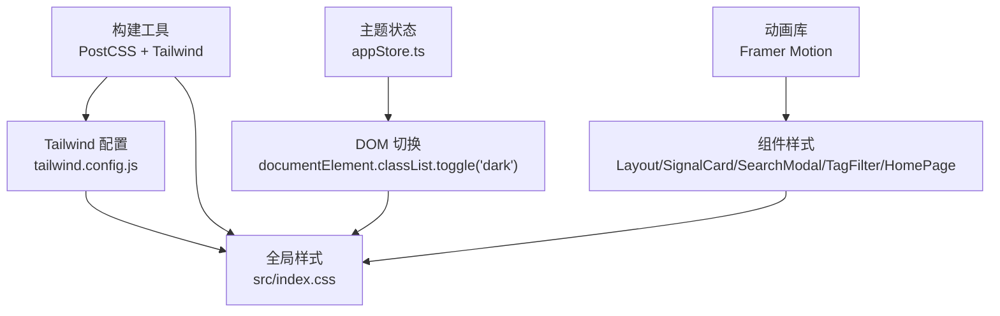
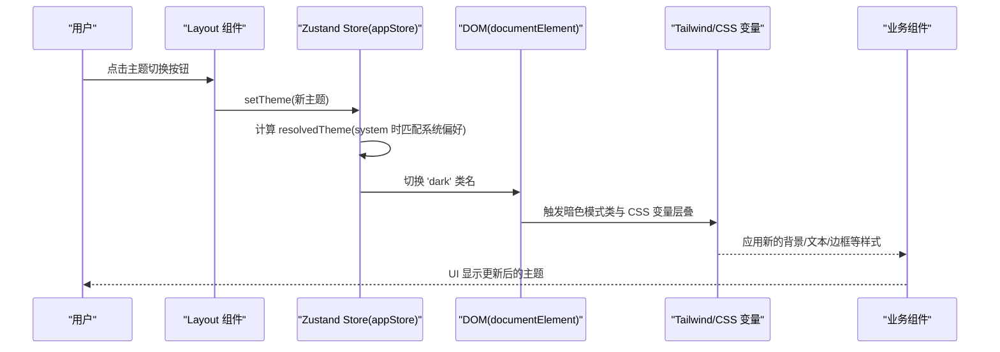
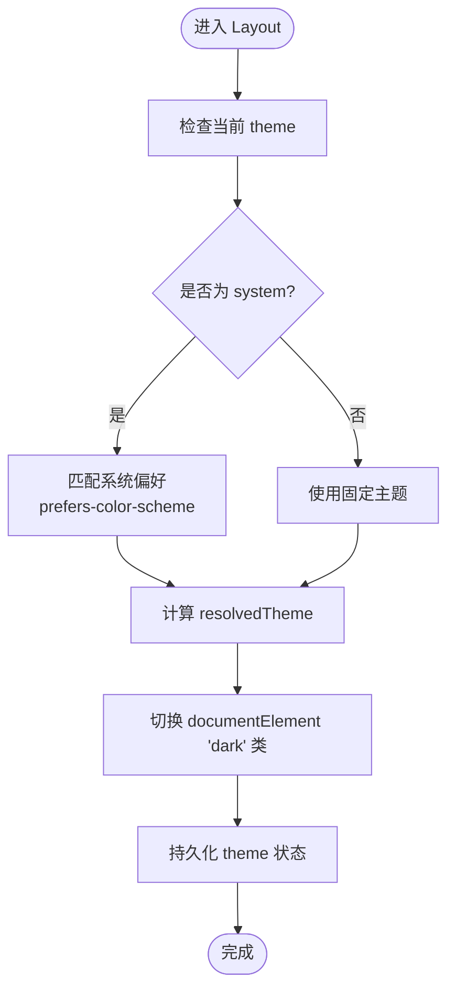
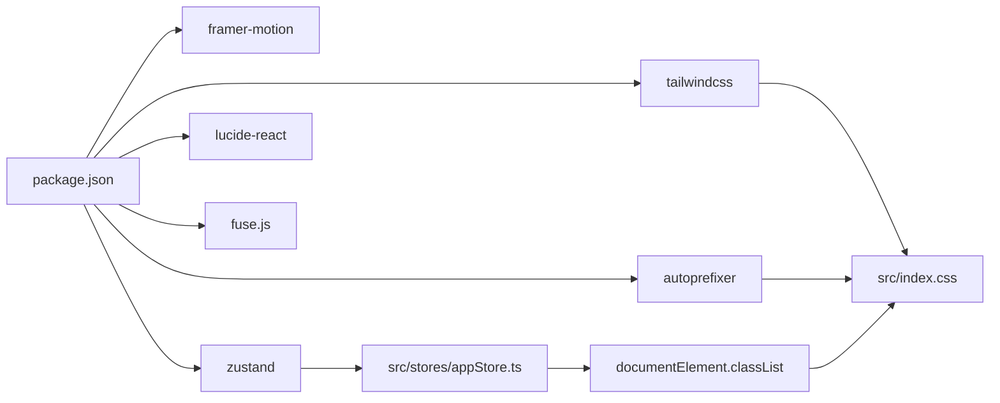

# 样式与主题

<cite>
**本文引用的文件**
- [tailwind.config.js](file://tailwind.config.js)
- [postcss.config.js](file://postcss.config.js)
- [src/index.css](file://src/index.css)
- [src/stores/appStore.ts](file://src/stores/appStore.ts)
- [src/App.tsx](file://src/App.tsx)
- [src/components/Layout/index.tsx](file://src/components/Layout/index.tsx)
- [src/components/SignalCard/index.tsx](file://src/components/SignalCard/index.tsx)
- [src/components/SearchModal/index.tsx](file://src/components/SearchModal/index.tsx)
- [src/components/TagFilter/index.tsx](file://src/components/TagFilter/index.tsx)
- [src/pages/HomePage/index.tsx](file://src/pages/HomePage/index.tsx)
- [src/types/index.ts](file://src/types/index.ts)
- [package.json](file://package.json)
</cite>

## 目录
1. [简介](#简介)
2. [项目结构](#项目结构)
3. [核心组件](#核心组件)
4. [架构总览](#架构总览)
5. [详细组件分析](#详细组件分析)
6. [依赖关系分析](#依赖关系分析)
7. [性能考量](#性能考量)
8. [故障排查指南](#故障排查指南)
9. [结论](#结论)
10. [附录](#附录)

## 简介
本文件系统性梳理本项目的样式与主题系统，围绕 Tailwind CSS 的配置与扩展、明暗主题切换机制、组件化样式策略、CSS 变量与动画、响应式与无障碍实践、以及可扩展的主题与品牌化定制方法进行深入说明。目标是帮助开发者在不深入源码的前提下理解整体样式架构，并为后续扩展与维护提供清晰指引。

## 项目结构
样式与主题相关的基础设施主要由以下几部分组成：
- 构建链路：PostCSS + Tailwind CSS
- 主题与颜色：Tailwind 配置扩展 + CSS 变量层叠
- 组件样式：原子类组合 + 自定义组件样式层
- 主题状态：Zustand 状态管理 + DOM 类名切换
- 动画与过渡：Tailwind 动画 + Framer Motion

图表来源
- [postcss.config.js:1-7](file://postcss.config.js#L1-L7)
- [tailwind.config.js:1-60](file://tailwind.config.js#L1-L60)
- [src/index.css:1-101](file://src/index.css#L1-L101)
- [src/stores/appStore.ts:1-93](file://src/stores/appStore.ts#L1-L93)
- [src/components/Layout/index.tsx:1-175](file://src/components/Layout/index.tsx#L1-L175)
- [src/components/SignalCard/index.tsx:1-111](file://src/components/SignalCard/index.tsx#L1-L111)
- [src/components/SearchModal/index.tsx:1-156](file://src/components/SearchModal/index.tsx#L1-L156)
- [src/components/TagFilter/index.tsx:1-49](file://src/components/TagFilter/index.tsx#L1-L49)
- [src/pages/HomePage/index.tsx:1-213](file://src/pages/HomePage/index.tsx#L1-L213)

章节来源
- [postcss.config.js:1-7](file://postcss.config.js#L1-L7)
- [tailwind.config.js:1-60](file://tailwind.config.js#L1-L60)
- [src/index.css:1-101](file://src/index.css#L1-L101)

## 核心组件
- Tailwind 配置与扩展：定义字体族、品牌色阶、信号色、表面色、动画与关键帧，启用 class 形式的暗色模式。
- CSS 变量层叠：通过 :root 与 .dark 定义基础变量，配合暗色模式类实现主题切换。
- Zustand 主题状态：统一管理 theme/system/light、resolvedTheme，并持久化到本地存储。
- 组件样式策略：以原子类为主，结合 @layer components 定义语义化组件类；部分组件使用 Framer Motion 实现过渡动画。
- 搜索与筛选：SearchModal 使用 Fuse.js 进行全文检索，TagFilter 提供标签筛选交互。

章节来源
- [tailwind.config.js:1-60](file://tailwind.config.js#L1-L60)
- [src/index.css:1-101](file://src/index.css#L1-L101)
- [src/stores/appStore.ts:1-93](file://src/stores/appStore.ts#L1-L93)
- [src/components/SearchModal/index.tsx:1-156](file://src/components/SearchModal/index.tsx#L1-L156)
- [src/components/TagFilter/index.tsx:1-49](file://src/components/TagFilter/index.tsx#L1-L49)

## 架构总览
下图展示从用户操作到样式生效的关键流程：用户点击切换按钮 -> Zustand 更新主题 -> DOM 添加/移除 dark 类 -> Tailwind 与 CSS 变量层叠生效 -> 组件样式随之更新。

图表来源
- [src/components/Layout/index.tsx:48-51](file://src/components/Layout/index.tsx#L48-L51)
- [src/stores/appStore.ts:35-47](file://src/stores/appStore.ts#L35-L47)
- [src/index.css:14-20](file://src/index.css#L14-L20)
- [tailwind.config.js:4](file://tailwind.config.js#L4)

## 详细组件分析

### Tailwind 配置与主题系统
- 内容扫描范围：index.html 与 src 下所有 TS/TSX 文件，确保按需生成样式。
- 暗色模式：采用 class 模式，通过在根元素添加/移除 'dark' 类触发展示。
- 字体：中文无衬线字体栈，提升中文排版可读性。
- 颜色系统：
  - primary：品牌主色阶，用于导航激活态、按钮、进度条等。
  - signal：信号优先级色（高/中/低），用于卡片边框与标签。
  - surface：表面色阶，用于暗色模式下的背景与次要文本。
- 动画与关键帧：提供 fade-in、slide-up、count-up 等常用动画，便于组件过渡与加载反馈。
- 插件：当前未启用额外插件，保持构建简洁。

章节来源
- [tailwind.config.js:1-60](file://tailwind.config.js#L1-L60)

### CSS 变量与暗色模式层叠
- :root 定义默认主题变量（背景、次级背景、文本、次级文本、边框）。
- .dark 在暗色模式下重定义上述变量，实现全站主题切换。
- body 层叠应用基础背景与文本色，并开启等宽数字排版。
- 组件层（@layer components）定义语义化样式类，如 signal-card、kpi-card、action-card、section-card、priority-badge、skeleton、reading-progress 等，均兼容暗色模式变量。

章节来源
- [src/index.css:1-101](file://src/index.css#L1-L101)

### 主题切换机制与状态持久化
- 状态模型：theme（light/dark/system）、resolvedTheme（实际生效主题）、setTheme 方法。
- 切换逻辑：
  - system：根据系统偏好自动选择 light/dark。
  - light/dark：直接固定主题。
  - setTheme 执行后，通过 documentElement.classList.toggle('dark') 切换暗色模式类。
- 持久化：仅持久化 theme、role、readHistory、favorites，避免不必要的存储开销。

图表来源
- [src/stores/appStore.ts:35-47](file://src/stores/appStore.ts#L35-L47)
- [src/components/Layout/index.tsx:40-46](file://src/components/Layout/index.tsx#L40-L46)

章节来源
- [src/stores/appStore.ts:1-93](file://src/stores/appStore.ts#L1-L93)
- [src/components/Layout/index.tsx:1-175](file://src/components/Layout/index.tsx#L1-L175)

### 组件化样式策略
- 原子类为主：导航、卡片、表格、按钮等广泛使用 Tailwind 原子类，保证一致性与可维护性。
- @layer components：集中定义语义化组件类，降低重复样式，提升复用度。
- 动画与过渡：
  - Framer Motion：用于页面切换、侧边栏、模态框等场景的平滑过渡。
  - Tailwind 动画：如 skeleton 的脉冲动画、reading-progress 的过渡。
- 无障碍与可访问性：
  - 文本对比度：通过 surface 与 slate 色阶保证明/暗两套对比度。
  - 键盘快捷键：Cmd/Ctrl+K 打开搜索，提升可达性。
  - 滚动条：自定义滚动条样式，兼顾视觉与可用性。

章节来源
- [src/index.css:33-86](file://src/index.css#L33-L86)
- [src/components/Layout/index.tsx:1-175](file://src/components/Layout/index.tsx#L1-L175)
- [src/components/SignalCard/index.tsx:1-111](file://src/components/SignalCard/index.tsx#L1-L111)
- [src/components/SearchModal/index.tsx:1-156](file://src/components/SearchModal/index.tsx#L1-L156)
- [src/components/TagFilter/index.tsx:1-49](file://src/components/TagFilter/index.tsx#L1-L49)

### 动画与过渡实现
- Tailwind 动画：通过 keyframes 定义 fadeIn、slideUp、countUp，配合动画类实现轻量过渡。
- Framer Motion：在 Layout 中用于路由切换与移动端菜单的进出动画；在 SignalCard 中用于详情展开/收起。
- 进度条：reading-progress 固定定位，随滚动变化宽度，体现阅读进度。

章节来源
- [tailwind.config.js:37-55](file://tailwind.config.js#L37-L55)
- [src/index.css:82-85](file://src/index.css#L82-L85)
- [src/components/Layout/index.tsx:118-149](file://src/components/Layout/index.tsx#L118-L149)
- [src/components/SignalCard/index.tsx:90-98](file://src/components/SignalCard/index.tsx#L90-L98)

### 响应式设计与移动端适配
- 断点与布局：
  - 导航在 lg 以上显示桌面端布局，在 lg 以下折叠为移动端菜单。
  - section 导航卡片在 sm:grid-cols-3、lg:grid-cols-4 下自适应网格。
  - 表格在 sm/table-cell、md/table-cell 控制列显示。
- 移动端体验：
  - 移动端菜单使用 AnimatePresence + Framer Motion 平滑展开/收起。
  - 搜索模态框在移动端居中显示，输入框自动聚焦。
- 字体与排版：
  - body 开启等宽数字，提升数值可读性。
  - 中文字体栈提升中文排版质量。

章节来源
- [src/components/Layout/index.tsx:66-86](file://src/components/Layout/index.tsx#L66-L86)
- [src/components/Layout/index.tsx:118-149](file://src/components/Layout/index.tsx#L118-L149)
- [src/pages/HomePage/index.tsx:131-146](file://src/pages/HomePage/index.tsx#L131-L146)
- [src/index.css:22-30](file://src/index.css#L22-L30)

### 无障碍访问支持
- 对比度：surface 与 slate 色阶在明/暗模式下均满足对比度要求。
- 键盘可达：搜索快捷键 Cmd/Ctrl+K，移动端菜单按钮可键盘聚焦。
- 视觉反馈：hover、active 状态明确，焦点可见。
- 滚动条：自定义滚动条，避免系统默认样式影响阅读体验。

章节来源
- [src/index.css:14-20](file://src/index.css#L14-L20)
- [src/components/Layout/index.tsx:28-38](file://src/components/Layout/index.tsx#L28-L38)

### 搜索与筛选组件样式
- SearchModal：
  - 使用 Fuse.js 构建搜索索引，支持标题与内容模糊匹配。
  - 模态框采用 AnimatePresence + Framer Motion，提供自然的打开/关闭过渡。
  - 结果列表支持键盘导航与点击跳转。
- TagFilter：
  - 支持一键切换标签筛选，清除全部功能。
  - 使用 Framer Motion 的 tap 缩放反馈，增强交互感。

章节来源
- [src/components/SearchModal/index.tsx:22-59](file://src/components/SearchModal/index.tsx#L22-L59)
- [src/components/SearchModal/index.tsx:74-154](file://src/components/SearchModal/index.tsx#L74-L154)
- [src/components/TagFilter/index.tsx:9-48](file://src/components/TagFilter/index.tsx#L9-L48)

### 页面级样式与品牌化
- HomePage：
  - 使用 gradient-to-br 的渐变背景强化品牌主色 primary。
  - 信号卡片、行动计划表、板块导航卡片均使用统一的组件样式类。
  - 用户角色推荐路径通过条件样式突出选中态。

章节来源
- [src/pages/HomePage/index.tsx:25-212](file://src/pages/HomePage/index.tsx#L25-L212)

## 依赖关系分析
- 构建依赖：PostCSS 与 Tailwind CSS 作为样式管线；Autoprefixer 保障浏览器兼容。
- 运行时依赖：Framer Motion 提供流畅动画；Lucide React 提供图标；Zustand 管理状态；Fuse.js 提供搜索能力。
- 样式依赖：Tailwind 配置与 CSS 变量共同决定主题表现；组件样式依赖原子类与 @layer components。

图表来源
- [package.json:12-34](file://package.json#L12-L34)
- [postcss.config.js:1-7](file://postcss.config.js#L1-L7)
- [tailwind.config.js:1-60](file://tailwind.config.js#L1-L60)
- [src/index.css:1-101](file://src/index.css#L1-L101)
- [src/stores/appStore.ts:1-93](file://src/stores/appStore.ts#L1-L93)

章节来源
- [package.json:1-36](file://package.json#L1-L36)

## 性能考量
- 按需生成：Tailwind content 配置仅扫描必要文件，减少无关样式生成。
- 动画优化：使用 transform 与 opacity 动画，避免强制重排；Framer Motion 使用 transform-origin 与缓动函数优化性能。
- 滚动条：自定义滚动条减少默认滚动条渲染差异，提升跨平台一致性。
- 状态持久化：仅持久化必要字段，避免存储膨胀。

## 故障排查指南
- 主题切换无效
  - 检查 setTheme 是否被调用且 resolvedTheme 正确计算。
  - 确认 documentElement 是否存在 'dark' 类。
  - 核对 CSS 变量层叠是否正确。
- 搜索无结果
  - 确认 Fuse.js 索引构建是否成功，keys 配置是否包含标题与内容。
  - 检查阈值 threshold 设置是否合理。
- 动画卡顿
  - 检查是否过度使用复杂阴影或大尺寸 transform。
  - 使用 transform 与 opacity 动画替代 layout 变更。
- 移动端菜单不显示
  - 确认 AnimatePresence 与 Framer Motion 版本兼容。
  - 检查移动端断点与类名拼接是否正确。

章节来源
- [src/stores/appStore.ts:35-47](file://src/stores/appStore.ts#L35-L47)
- [src/components/Layout/index.tsx:40-46](file://src/components/Layout/index.tsx#L40-L46)
- [src/components/SearchModal/index.tsx:53-57](file://src/components/SearchModal/index.tsx#L53-L57)

## 结论
本项目采用“配置驱动 + 变量层叠 + 组件化样式”的方式，实现了稳定、可扩展的样式与主题系统。Tailwind 配置提供一致的品牌色与动画能力，CSS 变量确保明/暗主题无缝切换，Zustand 管理主题状态并持久化，组件层通过原子类与 @layer components 提升复用度与可维护性。整体架构在性能、可访问性与可扩展性之间取得良好平衡。

## 附录

### Tailwind 配置要点清单
- content：确保扫描到所有组件文件
- darkMode：class
- theme.extend.fontFamily：中文字体栈
- theme.extend.colors：primary、signal、surface
- theme.extend.animation/keyframes：常用动画
- plugins：空数组（可扩展）

章节来源
- [tailwind.config.js:1-60](file://tailwind.config.js#L1-L60)

### CSS 变量与暗色模式映射
- :root 默认变量
- .dark 覆盖变量
- body 应用基础背景/文本色与等宽数字
- 组件层类兼容暗色模式

章节来源
- [src/index.css:5-31](file://src/index.css#L5-L31)

### 主题状态与持久化
- 字段：theme、resolvedTheme、setTheme
- 持久化：theme、role、readHistory、favorites
- 切换逻辑：system 匹配系统偏好，否则使用固定主题

章节来源
- [src/stores/appStore.ts:5-47](file://src/stores/appStore.ts#L5-L47)

### 组件样式类参考
- signal-card、signal-card--high/medium/low
- kpi-card
- action-card
- section-card
- priority-badge、priority-badge--high/medium/low
- skeleton
- reading-progress

章节来源
- [src/index.css:33-86](file://src/index.css#L33-L86)

### 动画与过渡参考
- Tailwind 动画：fade-in、slide-up、count-up
- Framer Motion：路由切换、菜单展开、详情展开
- 关键帧：fadeIn、slideUp、countUp

章节来源
- [tailwind.config.js:37-55](file://tailwind.config.js#L37-L55)
- [src/components/Layout/index.tsx:118-149](file://src/components/Layout/index.tsx#L118-L149)
- [src/components/SignalCard/index.tsx:90-98](file://src/components/SignalCard/index.tsx#L90-L98)

### 响应式断点与布局
- 导航：lg 以上桌面布局，以下移动端菜单
- 卡片网格：sm:3、lg:4 列
- 表格列：sm/table-cell、md/table-cell 控制显示
- 滚动条：自定义样式

章节来源
- [src/components/Layout/index.tsx:66-86](file://src/components/Layout/index.tsx#L66-L86)
- [src/pages/HomePage/index.tsx:131-146](file://src/pages/HomePage/index.tsx#L131-L146)
- [src/index.css:88-100](file://src/index.css#L88-L100)

### 品牌化与扩展建议
- 颜色扩展：在 theme.extend.colors 新增品牌色阶，保持命名规范（如 brand.primary、brand.secondary）。
- 动画扩展：在 keyframes 中新增关键帧，配合 animation 类使用。
- 组件类扩展：在 @layer components 中新增语义化类，统一命名风格（如 entity-card）。
- 持久化字段：如需保存更多用户偏好，可在 persist 配置中加入相应字段。
- 搜索扩展：可增加更多数据源索引，调整 Fuse.js 配置以提升召回率。

章节来源
- [tailwind.config.js:10-55](file://tailwind.config.js#L10-L55)
- [src/index.css:33-86](file://src/index.css#L33-L86)
- [src/stores/appStore.ts:82-91](file://src/stores/appStore.ts#L82-L91)