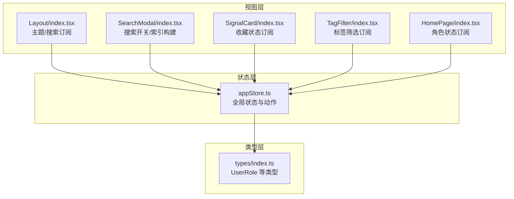
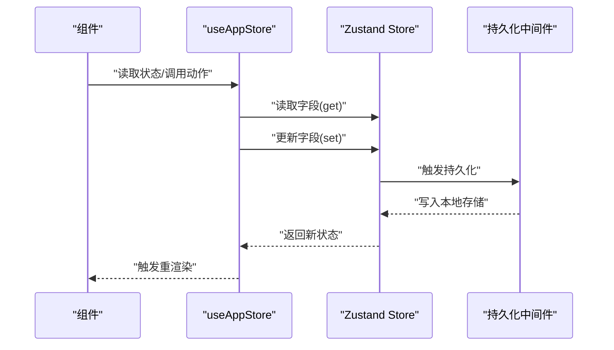
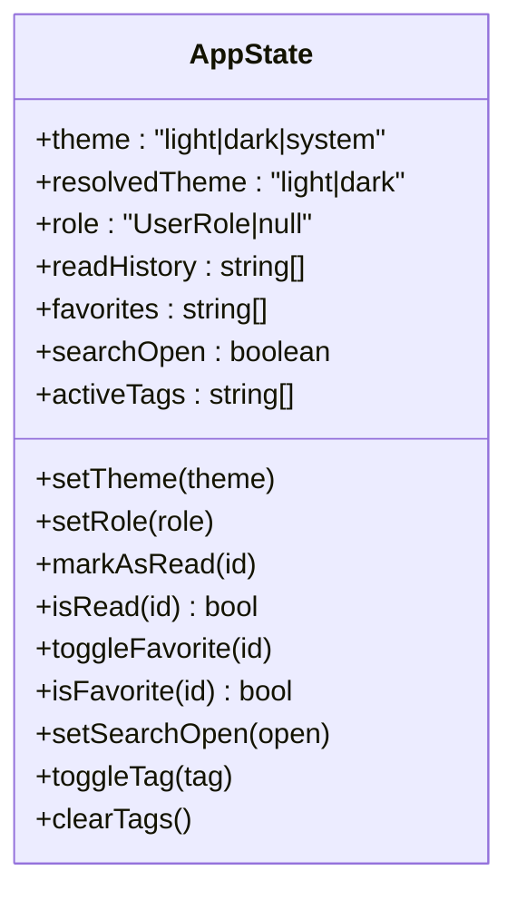
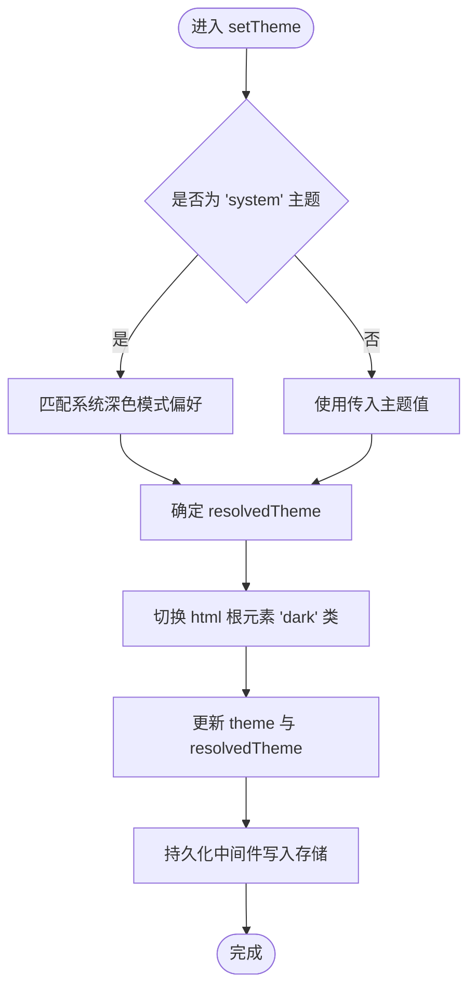
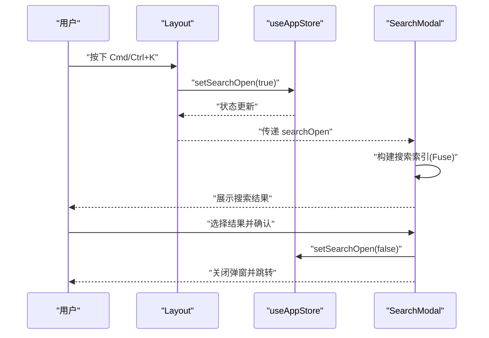
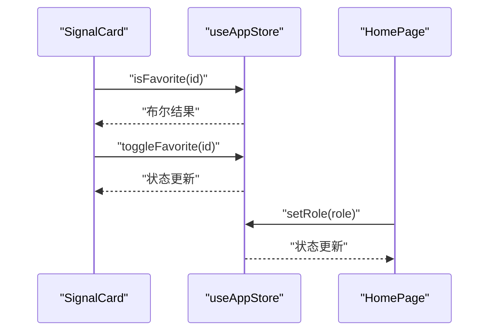
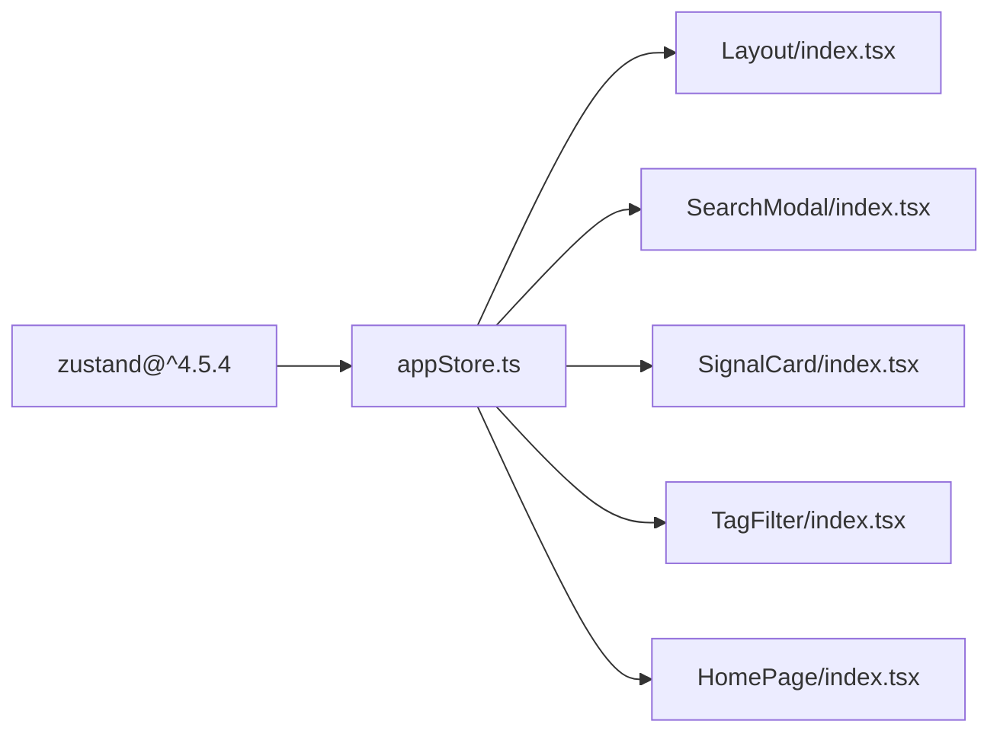

# 状态管理

<cite>
**本文引用的文件**
- [src/stores/appStore.ts](file://src/stores/appStore.ts)
- [src/types/index.ts](file://src/types/index.ts)
- [src/components/Layout/index.tsx](file://src/components/Layout/index.tsx)
- [src/components/SearchModal/index.tsx](file://src/components/SearchModal/index.tsx)
- [src/components/SignalCard/index.tsx](file://src/components/SignalCard/index.tsx)
- [src/components/TagFilter/index.tsx](file://src/components/TagFilter/index.tsx)
- [src/pages/HomePage/index.tsx](file://src/pages/HomePage/index.tsx)
- [package.json](file://package.json)
</cite>

## 目录
1. [简介](#简介)
2. [项目结构](#项目结构)
3. [核心组件](#核心组件)
4. [架构总览](#架构总览)
5. [详细组件分析](#详细组件分析)
6. [依赖关系分析](#依赖关系分析)
7. [性能考量](#性能考量)
8. [故障排查指南](#故障排查指南)
9. [结论](#结论)
10. [附录](#附录)

## 简介
本项目采用 Zustand 实现轻量级全局状态管理，围绕用户偏好（主题、角色）、阅读历史、收藏夹、搜索状态以及标签筛选等维度构建统一的状态模型。通过持久化中间件将关键状态写入本地存储，结合 React 组件订阅机制，实现跨页面的一致性体验与快速响应。

## 项目结构
状态管理相关的核心位置如下：
- 状态定义与导出：src/stores/appStore.ts
- 类型定义：src/types/index.ts
- 组件集成示例：
  - 布局组件订阅主题与搜索状态：src/components/Layout/index.tsx
  - 搜索弹窗订阅搜索开关与查询结果：src/components/SearchModal/index.tsx
  - 内容卡片订阅收藏状态：src/components/SignalCard/index.tsx
  - 标签过滤器订阅标签筛选状态：src/components/TagFilter/index.tsx
  - 首页订阅用户角色状态：src/pages/HomePage/index.tsx
- 依赖声明：package.json

图表来源
- [src/stores/appStore.ts:1-92](file://src/stores/appStore.ts#L1-L92)
- [src/types/index.ts:194-201](file://src/types/index.ts#L194-L201)
- [src/components/Layout/index.tsx:23-51](file://src/components/Layout/index.tsx#L23-L51)
- [src/components/SearchModal/index.tsx:47-72](file://src/components/SearchModal/index.tsx#L47-L72)
- [src/components/SignalCard/index.tsx:26-29](file://src/components/SignalCard/index.tsx#L26-L29)
- [src/components/TagFilter/index.tsx:9-10](file://src/components/TagFilter/index.tsx#L9-L10)
- [src/pages/HomePage/index.tsx:25-27](file://src/pages/HomePage/index.tsx#L25-L27)

章节来源
- [src/stores/appStore.ts:1-92](file://src/stores/appStore.ts#L1-L92)
- [src/types/index.ts:194-201](file://src/types/index.ts#L194-L201)
- [src/components/Layout/index.tsx:23-51](file://src/components/Layout/index.tsx#L23-L51)
- [src/components/SearchModal/index.tsx:47-72](file://src/components/SearchModal/index.tsx#L47-L72)
- [src/components/SignalCard/index.tsx:26-29](file://src/components/SignalCard/index.tsx#L26-L29)
- [src/components/TagFilter/index.tsx:9-10](file://src/components/TagFilter/index.tsx#L9-L10)
- [src/pages/HomePage/index.tsx:25-27](file://src/pages/HomePage/index.tsx#L25-L27)

## 核心组件
- 全局状态接口与动作
  - 主题：包含当前主题值与解析后的明暗主题，支持切换与初始化解析
  - 用户角色：记录当前用户角色，用于个性化推荐路径
  - 阅读历史：维护已读条目 ID 列表，提供标记与查询
  - 收藏夹：维护收藏条目 ID 列表，提供切换与查询
  - 搜索：控制搜索弹窗开关
  - 标签筛选：维护活动标签列表，提供切换与清空
- 状态持久化
  - 使用持久化中间件仅持久化主题、角色、阅读历史与收藏夹字段，避免存储无关或大体量数据

章节来源
- [src/stores/appStore.ts:5-33](file://src/stores/appStore.ts#L5-L33)
- [src/stores/appStore.ts:35-92](file://src/stores/appStore.ts#L35-L92)

## 架构总览
Zustand 的状态容器通过 create 创建，内部以 set/get 访问器驱动状态变更与读取；persist 中间件负责序列化与恢复。组件通过钩子订阅所需字段，自动重渲染。

图表来源
- [src/stores/appStore.ts:35-92](file://src/stores/appStore.ts#L35-L92)

## 详细组件分析

### 状态结构与动作设计
- 结构定义
  - 字段：theme/resolvedTheme、role、readHistory、favorites、searchOpen、activeTags
  - 动作：setTheme、setRole、markAsRead/isRead、toggleFavorite/isFavorite、setSearchOpen、toggleTag/clearTags
- 设计要点
  - 将“系统主题”与“解析后主题”分离，便于 UI 切换与系统偏好同步
  - 将“是否已读/收藏”的判断逻辑放在 store 内部，减少重复计算
  - 标签筛选采用集合式更新，避免频繁对象重建

图表来源
- [src/stores/appStore.ts:5-33](file://src/stores/appStore.ts#L5-L33)

章节来源
- [src/stores/appStore.ts:5-33](file://src/stores/appStore.ts#L5-L33)
- [src/stores/appStore.ts:35-92](file://src/stores/appStore.ts#L35-L92)

### 主题切换与系统偏好联动
- 行为流程
  - 用户点击切换主题
  - 若选择“系统”，根据系统深色模式偏好解析为 light/dark
  - 更新 DOM 根元素的明暗类名
  - 同步持久化主题与解析后主题
- 性能与体验
  - 解析仅在主题变化时触发
  - 通过类名切换实现即时视觉反馈

图表来源
- [src/stores/appStore.ts:41-47](file://src/stores/appStore.ts#L41-L47)

章节来源
- [src/stores/appStore.ts:41-47](file://src/stores/appStore.ts#L41-L47)

### 搜索状态与快捷键集成
- 行为流程
  - 布局组件监听 Cmd/Ctrl+K 快捷键，调用 setSearchOpen(true) 打开搜索弹窗
  - 搜索弹窗根据开关渲染，构建 Fuse 搜索索引并展示结果
  - 选择结果后关闭弹窗并跳转路由
- 交互细节
  - 打开时自动聚焦输入框
  - 关闭时清空查询与结果缓存

图表来源
- [src/components/Layout/index.tsx:28-38](file://src/components/Layout/index.tsx#L28-L38)
- [src/components/SearchModal/index.tsx:47-72](file://src/components/SearchModal/index.tsx#L47-L72)
- [src/stores/appStore.ts:69-72](file://src/stores/appStore.ts#L69-L72)

章节来源
- [src/components/Layout/index.tsx:28-38](file://src/components/Layout/index.tsx#L28-L38)
- [src/components/SearchModal/index.tsx:47-72](file://src/components/SearchModal/index.tsx#L47-L72)
- [src/stores/appStore.ts:69-72](file://src/stores/appStore.ts#L69-L72)

### 收藏与已读状态
- 行为流程
  - 卡片组件读取 isFavorite 判断图标状态
  - 点击按钮调用 toggleFavorite 切换收藏
  - 首页根据 role 设置个性化阅读路径
- 性能建议
  - 对于大量卡片场景，可考虑将 isFavorite 缓存到组件局部状态，减少 store 读取频率

图表来源
- [src/components/SignalCard/index.tsx:26-29](file://src/components/SignalCard/index.tsx#L26-L29)
- [src/pages/HomePage/index.tsx:25-27](file://src/pages/HomePage/index.tsx#L25-L27)
- [src/stores/appStore.ts:20-23](file://src/stores/appStore.ts#L20-L23)
- [src/stores/appStore.ts:49-51](file://src/stores/appStore.ts#L49-L51)

章节来源
- [src/components/SignalCard/index.tsx:26-29](file://src/components/SignalCard/index.tsx#L26-L29)
- [src/pages/HomePage/index.tsx:25-27](file://src/pages/HomePage/index.tsx#L25-L27)
- [src/stores/appStore.ts:20-23](file://src/stores/appStore.ts#L20-L23)
- [src/stores/appStore.ts:49-51](file://src/stores/appStore.ts#L49-L51)

### 标签筛选状态
- 行为流程
  - 标签过滤器读取 activeTags 并渲染可选标签
  - 点击切换标签加入/移除
  - 提供一键清空功能
- 最佳实践
  - 将标签列表与 activeTags 的更新解耦，避免每次渲染都重建标签集合

章节来源
- [src/components/TagFilter/index.tsx:9-10](file://src/components/TagFilter/index.tsx#L9-L10)
- [src/stores/appStore.ts:29-33](file://src/stores/appStore.ts#L29-L33)

### 类型与状态一致性
- 用户角色类型来自统一类型定义，确保 store 与组件之间的类型安全
- 建议后续扩展：将更多业务实体（如用户偏好）收敛到统一的用户偏好类型中，便于持久化与迁移

章节来源
- [src/types/index.ts:194-201](file://src/types/index.ts#L194-L201)
- [src/stores/appStore.ts:12-13](file://src/stores/appStore.ts#L12-L13)

## 依赖关系分析
- Zustand 版本与依赖
  - 项目依赖 zustand，版本满足运行要求
- 组件与状态的耦合
  - 组件通过 useAppStore 订阅所需字段，保持低耦合
  - 动作集中于 store，避免分散更新逻辑

图表来源
- [package.json:21](file://package.json#L21)
- [src/stores/appStore.ts:1-3](file://src/stores/appStore.ts#L1-L3)

章节来源
- [package.json:21](file://package.json#L21)
- [src/stores/appStore.ts:1-3](file://src/stores/appStore.ts#L1-L3)

## 性能考量
- 状态粒度与订阅范围
  - 仅订阅必要字段，避免不必要的重渲染
  - 对高频更新的字段（如搜索开关）采用最小化更新
- 持久化策略
  - 仅持久化轻量字段，降低存储体积与序列化成本
- 计算与缓存
  - 将 isRead/isFavorite 等判断逻辑内聚到 store，减少重复计算
- 大列表渲染
  - 对大量卡片场景，建议在组件侧做局部缓存或分页加载，减轻 store 压力

## 故障排查指南
- 主题切换无效
  - 检查 setTheme 是否被正确调用，确认系统深色模式偏好与 resolvedTheme 的解析逻辑
- 搜索弹窗无法打开
  - 确认快捷键事件绑定是否生效，检查 setSearchOpen 的调用链
- 收藏状态不同步
  - 确认 toggleFavorite 的调用与 isFavorite 的读取是否在同一 store 实例下
- 持久化未生效
  - 检查持久化配置中的字段白名单与存储键名，确认浏览器本地存储可用

章节来源
- [src/stores/appStore.ts:41-47](file://src/stores/appStore.ts#L41-L47)
- [src/components/Layout/index.tsx:28-38](file://src/components/Layout/index.tsx#L28-L38)
- [src/components/SignalCard/index.tsx:26-29](file://src/components/SignalCard/index.tsx#L26-L29)
- [src/stores/appStore.ts:82-91](file://src/stores/appStore.ts#L82-L91)

## 结论
本项目以 Zustand 构建了简洁高效的状态管理方案，通过清晰的接口设计、合理的持久化策略与组件订阅模式，实现了主题、角色、阅读历史、收藏与标签筛选等核心能力的统一管理。遵循本文的最佳实践与性能建议，可在保证开发效率的同时提升用户体验与系统稳定性。

## 附录
- 状态管理最佳实践
  - 明确状态边界：仅存放跨组件共享且必要的状态
  - 动作聚合：将复杂更新封装为动作，避免分散更新
  - 订阅最小化：按需订阅字段，减少重渲染
  - 持久化瘦身：仅持久化必要字段，避免存储大对象
- 异步状态处理建议
  - 对于外部请求或长耗时任务，建议引入动作内的异步流程并在成功/失败分支更新状态
  - 使用 loading/error 字段配合动作，避免直接在组件中管理副作用
- 调试工具
  - 可在开发环境引入 Zustand DevTools 进行状态追踪与动作回放
- 错误处理策略
  - 对持久化读写异常进行兜底（如降级为内存状态）
  - 对外部依赖（如本地存储不可用）提供降级方案