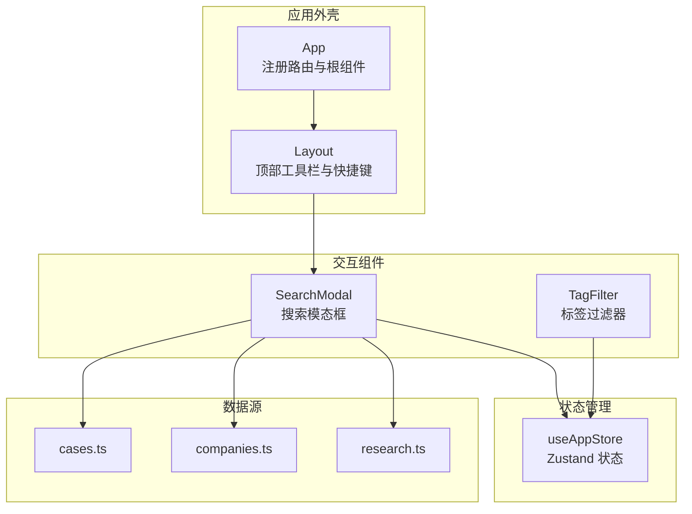
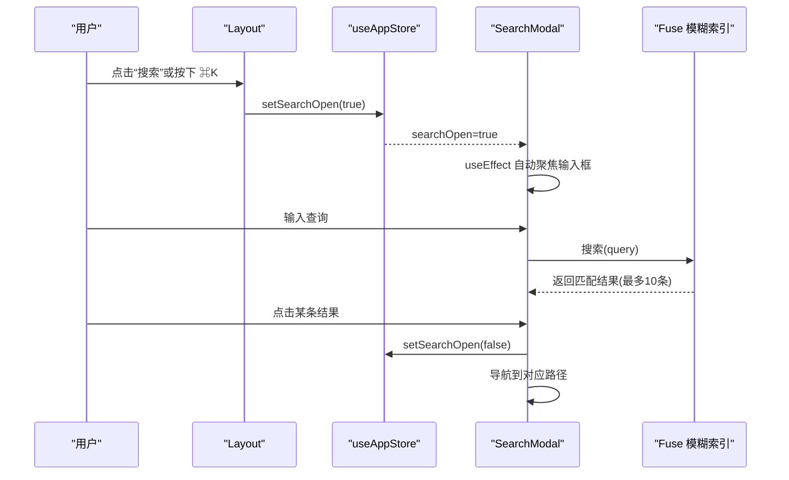
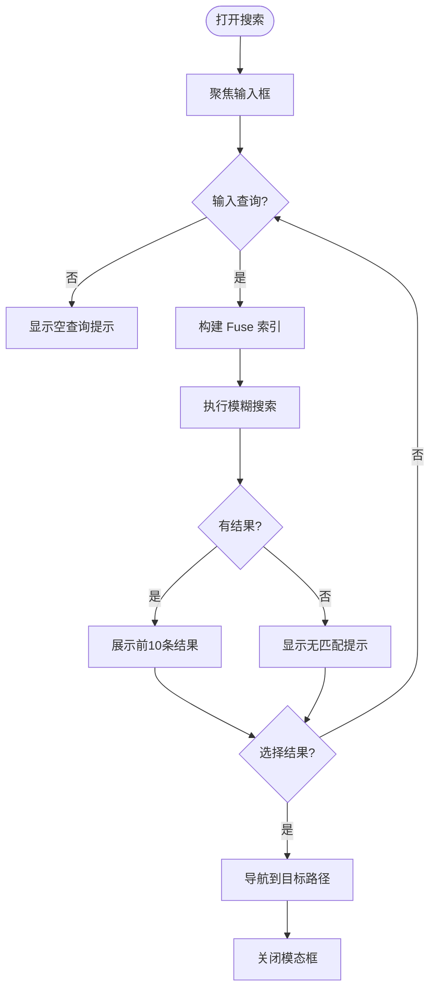
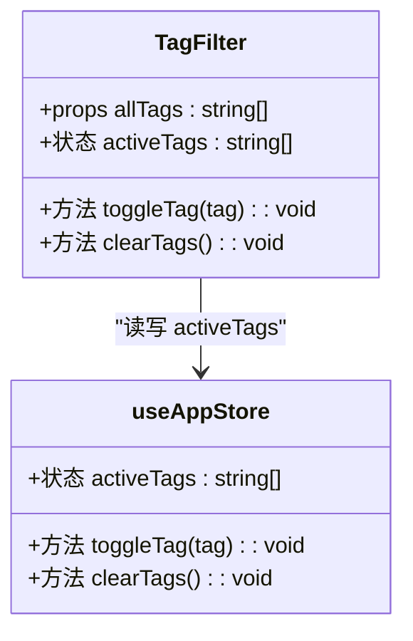
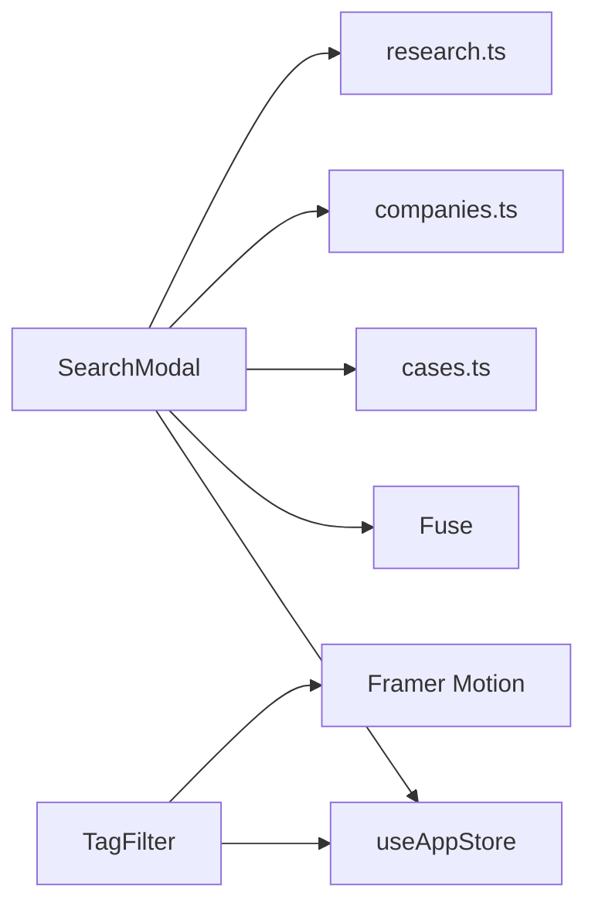

# 交互组件

<cite>
**本文引用的文件**
- [src/components/SearchModal/index.tsx](file://src/components/SearchModal/index.tsx)
- [src/components/TagFilter/index.tsx](file://src/components/TagFilter/index.tsx)
- [src/stores/appStore.ts](file://src/stores/appStore.ts)
- [src/components/Layout/index.tsx](file://src/components/Layout/index.tsx)
- [src/App.tsx](file://src/App.tsx)
- [src/types/index.ts](file://src/types/index.ts)
- [src/data/cases.ts](file://src/data/cases.ts)
- [src/data/companies.ts](file://src/data/companies.ts)
- [src/data/research.ts](file://src/data/research.ts)
</cite>

## 目录
1. [引言](#引言)
2. [项目结构](#项目结构)
3. [核心组件](#核心组件)
4. [架构总览](#架构总览)
5. [详细组件分析](#详细组件分析)
6. [依赖关系分析](#依赖关系分析)
7. [性能考量](#性能考量)
8. [故障排查指南](#故障排查指南)
9. [结论](#结论)
10. [附录](#附录)

## 引言
本文件聚焦于两个交互组件：SearchModal 搜索模态框与 TagFilter 标签过滤器。前者提供全局搜索入口、模糊检索与结果导航；后者提供标签多选筛选、状态同步与视觉反馈。文档将系统阐述两者的交互设计、实现机制、事件与状态管理、动画与无障碍特性，并给出使用示例、配置选项与扩展建议。

## 项目结构
- 组件位于 src/components 下，分别封装为独立模块，便于复用与测试。
- 状态管理通过 Zustand 的 useAppStore 提供，包括主题、用户角色、阅读历史、收藏、搜索开关与标签筛选等。
- 搜索索引构建来源于多个数据模块（每日日报、公司更新、研究论文、转型案例、延伸阅读、HR 词典），并在组件内动态构建 Fuse 模糊索引。
- 键盘快捷键在布局组件中统一监听，触发搜索模态框打开。

图表来源
- [src/App.tsx](file://src/App.tsx)
- [src/components/Layout/index.tsx](file://src/components/Layout/index.tsx)
- [src/components/SearchModal/index.tsx](file://src/components/SearchModal/index.tsx)
- [src/components/TagFilter/index.tsx](file://src/components/TagFilter/index.tsx)
- [src/stores/appStore.ts](file://src/stores/appStore.ts)
- [src/data/cases.ts](file://src/data/cases.ts)
- [src/data/companies.ts](file://src/data/companies.ts)
- [src/data/research.ts](file://src/data/research.ts)

章节来源
- [src/App.tsx](file://src/App.tsx)
- [src/components/Layout/index.tsx](file://src/components/Layout/index.tsx)

## 核心组件
- SearchModal：全局搜索入口，支持键盘快捷键打开、输入即搜、结果列表与点击导航。
- TagFilter：标签多选过滤器，支持清空全部、点击切换、视觉状态反馈与动画。

章节来源
- [src/components/SearchModal/index.tsx](file://src/components/SearchModal/index.tsx)
- [src/components/TagFilter/index.tsx](file://src/components/TagFilter/index.tsx)

## 架构总览
- 触发路径：顶部工具栏按钮或 ⌘K 快捷键 → 设置搜索开关 → 显示模态框 → 自动聚焦输入框。
- 搜索路径：输入查询 → 构建索引 → Fuse 模糊匹配 → 展示前 N 条结果 → 点击导航。
- 过滤路径：页面渲染 TagFilter → 读取 activeTags → 点击切换 → 写入 activeTags → 影响下游筛选逻辑。

图表来源
- [src/components/Layout/index.tsx](file://src/components/Layout/index.tsx)
- [src/stores/appStore.ts](file://src/stores/appStore.ts)
- [src/components/SearchModal/index.tsx](file://src/components/SearchModal/index.tsx)

## 详细组件分析

### SearchModal 搜索模态框
- 触发方式
  - 顶部工具栏按钮点击。
  - 全局快捷键 ⌘K（macOS）或 Ctrl+K（Windows/Linux）。
- 搜索算法
  - 动态构建搜索索引，字段包含标题与内容。
  - 使用 Fuse.js 进行模糊匹配，阈值与返回匹配位置信息。
  - 结果截断为前 10 条，展示所属板块、标题与片段。
- 结果展示
  - 无结果时提示“没有匹配结果”，空查询时提示“输入关键词开始搜索”。
  - 支持点击结果进行页面导航（路由跳转）。
- 键盘快捷键支持
  - 监听组合键，阻止默认行为并打开搜索。
- 动画与无障碍
  - 使用 Framer Motion 实现入场/出场动画与背景遮罩。
  - 打开时自动聚焦输入框，关闭时清空查询。
- 状态管理
  - 通过 useAppStore 控制 searchOpen，配合路由跳转与状态清理。

图表来源
- [src/components/SearchModal/index.tsx](file://src/components/SearchModal/index.tsx)
- [src/stores/appStore.ts](file://src/stores/appStore.ts)

章节来源
- [src/components/SearchModal/index.tsx](file://src/components/SearchModal/index.tsx)
- [src/components/Layout/index.tsx](file://src/components/Layout/index.tsx)
- [src/stores/appStore.ts](file://src/stores/appStore.ts)

### TagFilter 标签过滤器
- 筛选逻辑
  - 接收 allTags 列表，渲染为可点击标签按钮。
  - 通过 activeTags 判断当前是否激活，切换状态。
- 多选机制
  - 点击标签切换其在 activeTags 中的存在与否。
  - 支持一键清除全部标签。
- 实时过滤与状态同步
  - 标签状态来自 useAppStore，组件只负责渲染与交互。
  - 页面其他组件可基于 activeTags 实现实时过滤。
- 动画与无障碍
  - 使用 Framer Motion 的 tap 缩放反馈，提升触控体验。
  - 暗色模式适配，按钮颜色随状态切换。

图表来源
- [src/components/TagFilter/index.tsx](file://src/components/TagFilter/index.tsx)
- [src/stores/appStore.ts](file://src/stores/appStore.ts)

章节来源
- [src/components/TagFilter/index.tsx](file://src/components/TagFilter/index.tsx)
- [src/stores/appStore.ts](file://src/stores/appStore.ts)

## 依赖关系分析
- 组件依赖
  - SearchModal 依赖：useAppStore（搜索开关）、Fuse.js（模糊搜索）、数据模块（索引构建）、react-router（导航）。
  - TagFilter 依赖：useAppStore（标签状态）、Framer Motion（动画）。
- 状态依赖
  - 两者均通过 useAppStore 管理状态，保证跨组件一致性与持久化（Zustand persist）。
- 数据依赖
  - SearchModal 的索引构建依赖多处数据模块；TagFilter 的 allTags 通常由页面聚合传入。

图表来源
- [src/components/SearchModal/index.tsx](file://src/components/SearchModal/index.tsx)
- [src/components/TagFilter/index.tsx](file://src/components/TagFilter/index.tsx)
- [src/stores/appStore.ts](file://src/stores/appStore.ts)
- [src/data/cases.ts](file://src/data/cases.ts)
- [src/data/companies.ts](file://src/data/companies.ts)
- [src/data/research.ts](file://src/data/research.ts)

章节来源
- [src/components/SearchModal/index.tsx](file://src/components/SearchModal/index.tsx)
- [src/components/TagFilter/index.tsx](file://src/components/TagFilter/index.tsx)
- [src/stores/appStore.ts](file://src/stores/appStore.ts)

## 性能考量
- 搜索性能
  - 索引构建在组件初始化时完成，避免每次查询重复构建。
  - 结果限制为前 10 条，减少 DOM 渲染压力。
  - 使用 Fuse.js 的阈值与匹配返回，平衡召回与相关度。
- 渲染性能
  - 模态框使用 AnimatePresence 与 motion 容器，仅在打开时挂载与动画。
  - TagFilter 使用一次性渲染 allTags，点击切换通过状态更新，避免频繁重排。
- 状态持久化
  - useAppStore 使用 persist，确保标签筛选状态在刷新后仍可用。

[本节为通用性能建议，不直接分析具体文件]

## 故障排查指南
- 搜索无结果
  - 检查数据模块是否正确导出并参与索引构建。
  - 确认查询字符串非空且已触发搜索逻辑。
- 模态框无法关闭
  - 检查 useAppStore 的 searchOpen 状态是否被外部修改。
  - 确认点击遮罩或关闭按钮是否触发 setSearchOpen(false)。
- 标签状态不同步
  - 确认页面传入的 allTags 是否与 activeTags 对齐。
  - 检查 toggleTag 与 clearTags 的调用是否正确。
- 快捷键无效
  - 确认 Layout 中的键盘事件监听是否生效。
  - 检查浏览器组合键冲突或焦点不在窗口时的事件捕获。

章节来源
- [src/components/SearchModal/index.tsx](file://src/components/SearchModal/index.tsx)
- [src/components/TagFilter/index.tsx](file://src/components/TagFilter/index.tsx)
- [src/components/Layout/index.tsx](file://src/components/Layout/index.tsx)
- [src/stores/appStore.ts](file://src/stores/appStore.ts)

## 结论
SearchModal 与 TagFilter 通过简洁的交互与明确的状态边界，提供了高效的全局搜索与标签筛选能力。二者均以 useAppStore 为核心状态源，结合 Fuse.js 与 Framer Motion，在性能与体验之间取得良好平衡。建议在实际页面中以 allTags 作为输入，结合 activeTags 实现内容级联过滤，并在需要时扩展搜索索引字段与排序规则。

[本节为总结性内容，不直接分析具体文件]

## 附录

### 使用示例与配置选项
- SearchModal
  - 在应用根部注册组件，即可通过顶部按钮或快捷键打开。
  - 查询字段：标题、内容；阈值与匹配返回已内置。
  - 导航：点击结果后自动关闭并跳转。
- TagFilter
  - 传入 allTags 数组，组件自动渲染并维护 activeTags。
  - 清除：当存在激活标签时显示“清除全部”按钮。
  - 动画：点击缩放反馈，暗色模式自适应。

章节来源
- [src/components/SearchModal/index.tsx](file://src/components/SearchModal/index.tsx)
- [src/components/TagFilter/index.tsx](file://src/components/TagFilter/index.tsx)
- [src/stores/appStore.ts](file://src/stores/appStore.ts)

### 扩展指南
- 搜索扩展
  - 新增索引字段：在索引构建函数中加入新的字段映射。
  - 结果排序：根据业务需求对 Fuse 结果进行二次排序。
  - 高亮显示：利用匹配位置信息对标题/片段进行高亮标记。
- 过滤扩展
  - 多维度过滤：在页面层将 activeTags 与其他过滤条件合并，形成复合筛选。
  - 分页与缓存：对大量标签或复杂筛选增加分页与缓存策略。
- 无障碍增强
  - 为搜索输入添加 aria-label 与 role。
  - 为标签按钮添加 aria-pressed 以指示激活状态。
  - 为模态框添加 aria-modal 与键盘 ESC 关闭。

[本节为通用扩展建议，不直接分析具体文件]