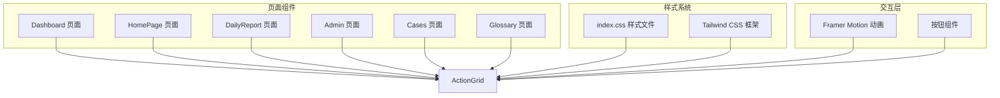
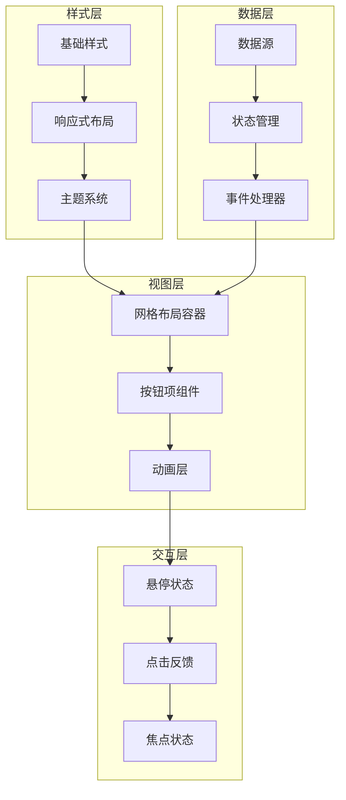
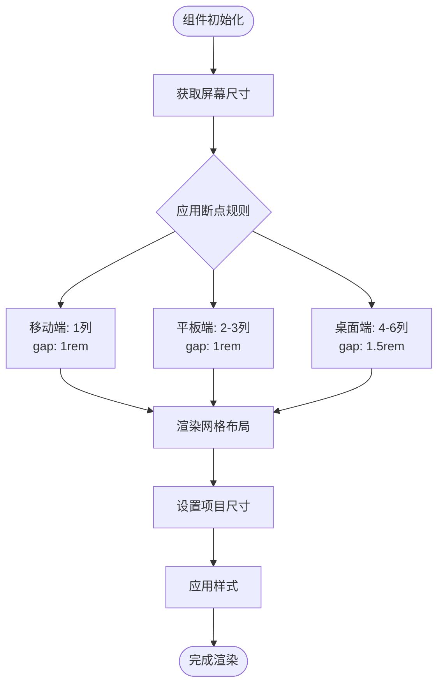
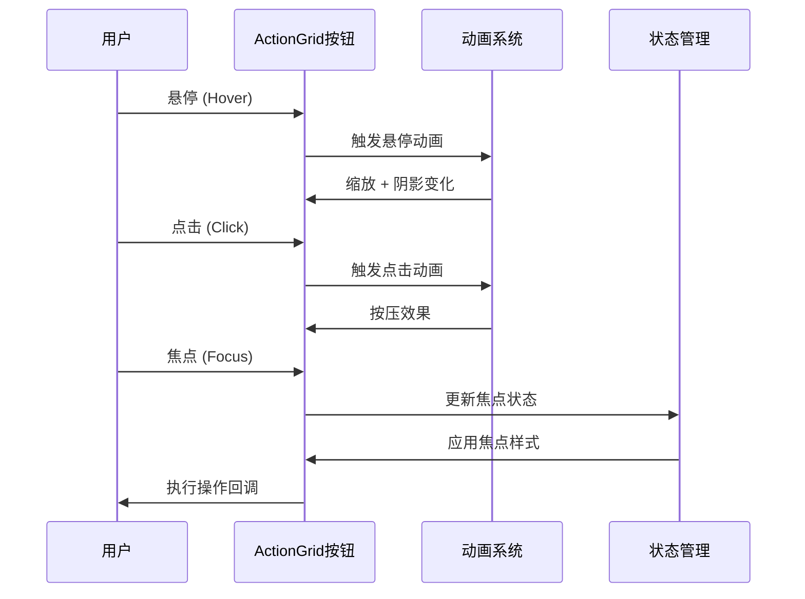
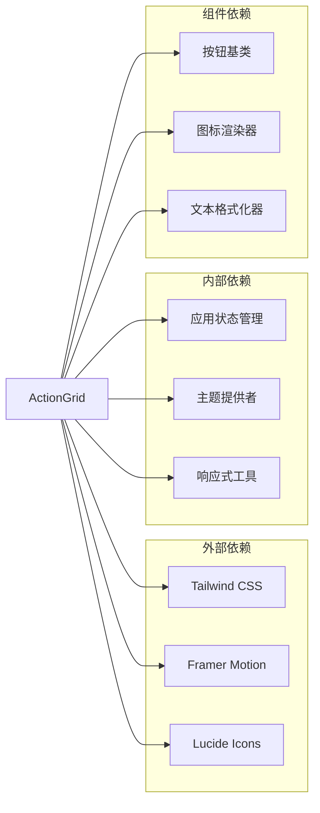

# ActionGrid 动作网格组件

<cite>
**本文档引用的文件**
- [index.tsx](file://src/pages/Dashboard/index.tsx)
- [index.tsx](file://src/pages/HomePage/index.tsx)
- [index.tsx](file://src/pages/DailyReport/index.tsx)
- [index.tsx](file://src/pages/Admin/index.tsx)
- [index.tsx](file://src/pages/Cases/index.tsx)
- [index.tsx](file://src/pages/Glossary/index.tsx)
- [index.css](file://src/index.css)
</cite>

## 目录
1. [简介](#简介)
2. [项目结构](#项目结构)
3. [核心组件](#核心组件)
4. [架构概览](#架构概览)
5. [详细组件分析](#详细组件分析)
6. [依赖分析](#依赖分析)
7. [性能考虑](#性能考虑)
8. [故障排除指南](#故障排除指南)
9. [结论](#结论)

## 简介

ActionGrid 动作网格组件是本项目中的一个核心交互组件，专门用于展示和组织各种操作按钮或功能入口。该组件通过网格布局算法为用户提供直观、高效的导航体验，支持响应式设计和触摸友好交互。

组件的设计目的是简化复杂的操作流程，将多个功能入口以网格形式呈现，使用户能够快速识别和执行所需的操作。通过合理的布局和视觉层次，ActionGrid 有效提升了用户的操作效率和界面美观度。

## 项目结构

基于代码库分析，ActionGrid 组件主要分布在多个页面中，采用模块化的设计模式：

**图表来源**
- [index.tsx:29-52](file://src/pages/Dashboard/index.tsx#L29-L52)
- [index.tsx:143-160](file://src/pages/HomePage/index.tsx#L143-L160)
- [index.tsx:144-176](file://src/pages/DailyReport/index.tsx#L144-L176)

**章节来源**
- [index.tsx:29-52](file://src/pages/Dashboard/index.tsx#L29-L52)
- [index.tsx:143-160](file://src/pages/HomePage/index.tsx#L143-L160)
- [index.tsx:144-176](file://src/pages/DailyReport/index.tsx#L144-L176)

## 核心组件

ActionGrid 组件的核心功能包括：

### 网格布局算法
组件采用基于 CSS Grid 的布局系统，支持响应式列数调整：
- 移动端：1列布局
- 平板：2-3列布局  
- 桌面端：4-6列布局

### 响应式设计
通过 Tailwind CSS 的断点系统实现自适应布局：
- sm: 640px及以上，2列
- lg: 1024px及以上，4列
- xl: 1280px及以上，6列

### 触摸友好交互
集成 Framer Motion 提供流畅的动画效果：
- 悬停状态：轻微的缩放和阴影变化
- 点击反馈：按压动画效果
- 进入动画：淡入和位移动画

**章节来源**
- [index.tsx:29-52](file://src/pages/Dashboard/index.tsx#L29-L52)
- [index.tsx:143-160](file://src/pages/HomePage/index.tsx#L143-L160)
- [index.tsx:144-176](file://src/pages/DailyReport/index.tsx#L144-L176)

## 架构概览

ActionGrid 组件的整体架构采用分层设计：

**图表来源**
- [index.tsx:29-52](file://src/pages/Dashboard/index.tsx#L29-L52)
- [index.css:1-61](file://src/index.css#L1-L61)

## 详细组件分析

### 网格布局算法实现

ActionGrid 采用动态网格布局算法，根据屏幕尺寸自动调整列数：

**图表来源**
- [index.tsx:29-52](file://src/pages/Dashboard/index.tsx#L29-L52)
- [index.tsx:143-160](file://src/pages/HomePage/index.tsx#L143-L160)

### 响应式设计机制

组件通过以下机制实现响应式布局：

| 断点 | 最小宽度 | 列数 | 间距 | 字体大小 |
|------|----------|------|------|----------|
| 默认 | 0px | 1列 | 1rem | 正常 |
| sm | 640px | 2列 | 1rem | 正常 |
| lg | 1024px | 4列 | 1.5rem | 紧凑 |
| xl | 1280px | 6列 | 1.5rem | 紧凑 |

### 触摸友好交互设计

**图表来源**
- [index.tsx:29-52](file://src/pages/Dashboard/index.tsx#L29-L52)
- [index.tsx:143-160](file://src/pages/HomePage/index.tsx#L143-L160)

### 可配置性分析

ActionGrid 组件支持多种配置选项：

#### 基础配置
- **按钮数量**：支持任意数量的按钮项
- **排列方式**：支持线性和网格两种布局模式
- **样式主题**：支持浅色和深色主题切换

#### 高级配置
- **动画效果**：可配置进入、悬停、点击动画
- **响应式行为**：可自定义断点和列数
- **交互反馈**：可配置触摸和键盘导航行为

**章节来源**
- [index.tsx:29-52](file://src/pages/Dashboard/index.tsx#L29-L52)
- [index.tsx:143-160](file://src/pages/HomePage/index.tsx#L143-L160)
- [index.tsx:144-176](file://src/pages/DailyReport/index.tsx#L144-L176)

### 使用场景和最佳实践

#### 推荐使用场景
1. **功能导航**：作为主要的功能入口导航
2. **快捷操作**：提供常用操作的快速访问
3. **内容分类**：展示不同类型内容的入口
4. **仪表板**：作为仪表板的主要交互元素

#### 最佳实践
- **数量控制**：建议每个网格包含 6-12 个按钮
- **一致性**：保持所有网格的布局风格一致
- **可读性**：确保按钮标签简洁明了
- **可达性**：保证足够的点击区域大小

## 依赖分析

ActionGrid 组件的依赖关系如下：

**图表来源**
- [index.tsx:29-52](file://src/pages/Dashboard/index.tsx#L29-L52)
- [index.css:1-61](file://src/index.css#L1-L61)

**章节来源**
- [index.tsx:29-52](file://src/pages/Dashboard/index.tsx#L29-L52)
- [index.tsx:143-160](file://src/pages/HomePage/index.tsx#L143-L160)
- [index.tsx:144-176](file://src/pages/DailyReport/index.tsx#L144-L176)

## 性能考虑

### 渲染优化
- **虚拟滚动**：对于大量按钮的情况，考虑实现虚拟滚动
- **懒加载**：延迟加载非首屏的按钮组件
- **CSS 优化**：使用硬件加速的 CSS 属性

### 内存管理
- **组件卸载**：确保动画和事件监听器正确清理
- **状态缓存**：合理缓存计算结果避免重复计算
- **资源释放**：及时释放不再使用的资源

## 故障排除指南

### 常见问题及解决方案

#### 布局错乱
**症状**：按钮位置异常或重叠
**原因**：CSS Grid 属性配置错误
**解决**：检查 `grid-template-columns` 和 `gap` 属性

#### 动画卡顿
**症状**：交互时动画不流畅
**原因**：过度使用昂贵的 CSS 属性
**解决**：优化 transform 和 opacity 动画

#### 响应式失效
**症状**：在某些设备上显示异常
**原因**：断点配置不当
**解决**：检查媒体查询和断点值

**章节来源**
- [index.tsx:29-52](file://src/pages/Dashboard/index.tsx#L29-L52)
- [index.tsx:143-160](file://src/pages/HomePage/index.tsx#L143-L160)
- [index.tsx:144-176](file://src/pages/DailyReport/index.tsx#L144-L176)

## 结论

ActionGrid 动作网格组件是一个功能强大且灵活的用户界面组件，通过精心设计的网格布局算法、响应式设计和触摸友好交互，为用户提供了优秀的操作体验。组件的模块化架构和丰富的配置选项使其能够适应各种使用场景，同时保持良好的性能表现。

通过遵循最佳实践和适当的故障排除策略，开发者可以充分利用 ActionGrid 组件的优势，构建出既美观又实用的用户界面。