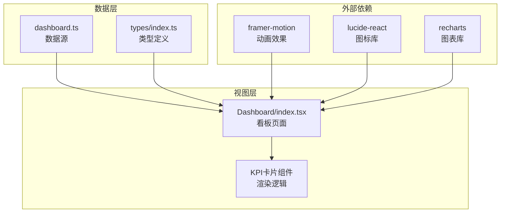
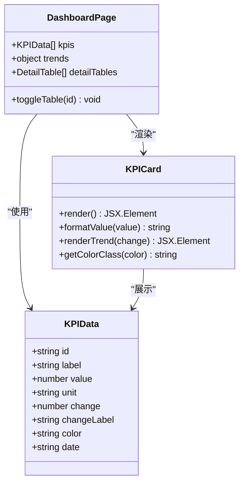
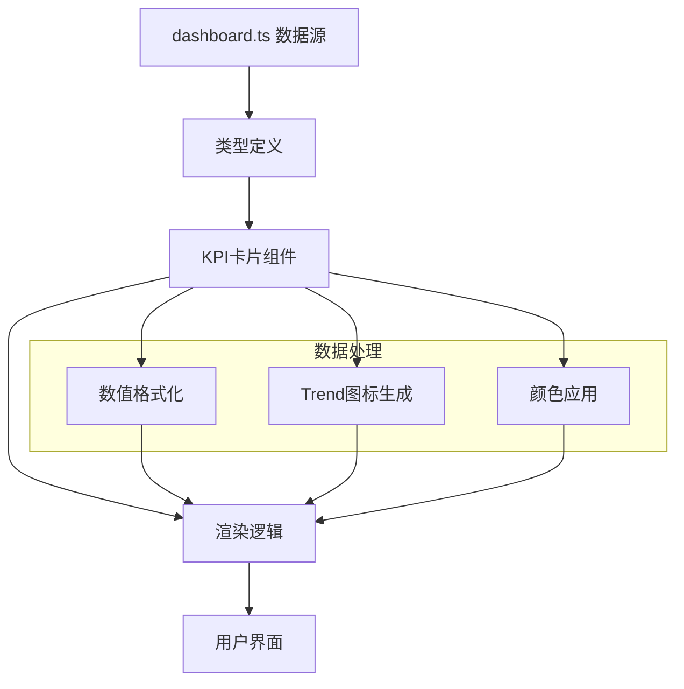
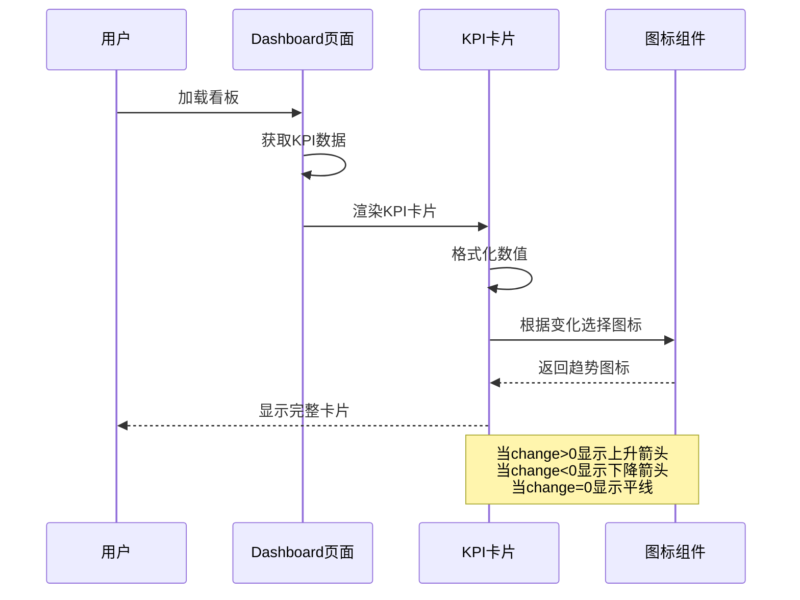
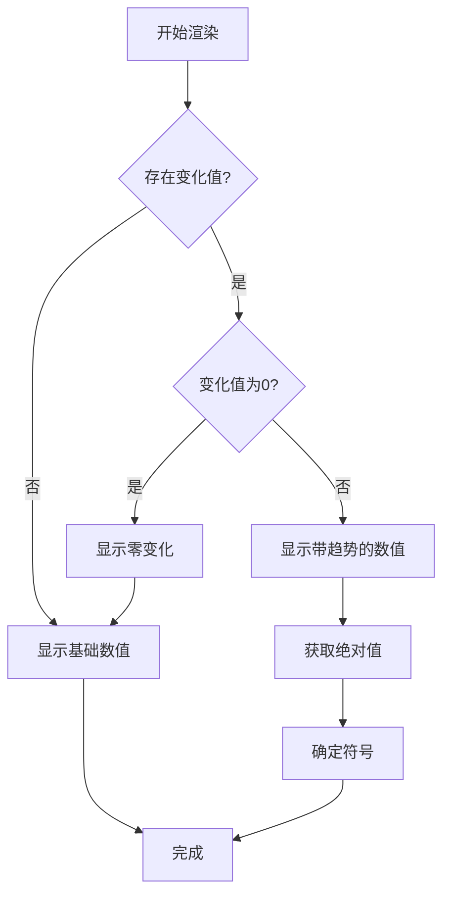
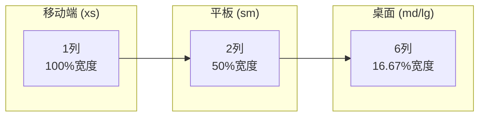
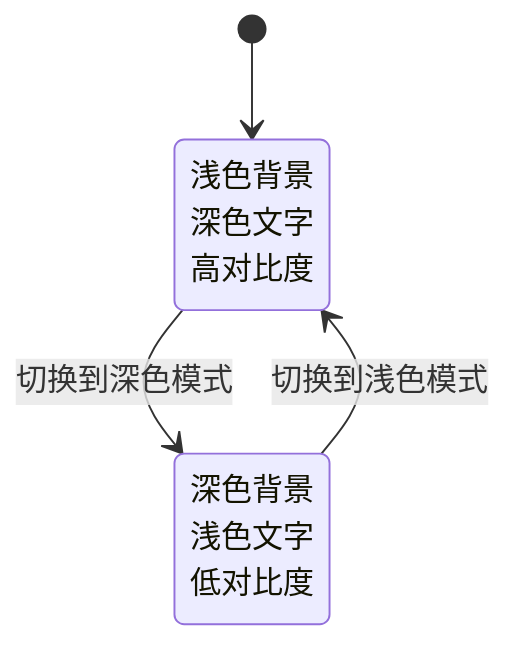
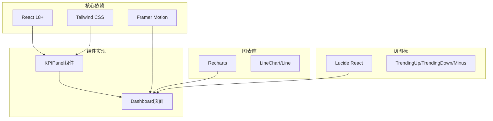
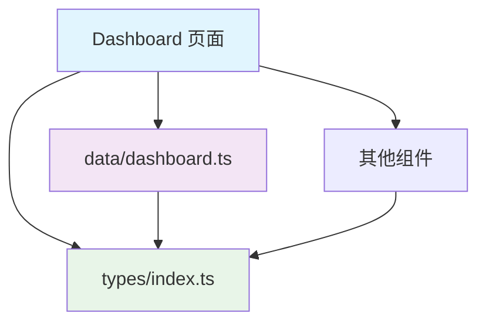

# KPIPanel 关键指标面板组件

<cite>
**本文档引用的文件**
- [src/pages/Dashboard/index.tsx](file://src/pages/Dashboard/index.tsx)
- [src/data/dashboard.ts](file://src/data/dashboard.ts)
- [src/types/index.ts](file://src/types/index.ts)
</cite>

## 目录
1. [简介](#简介)
2. [项目结构](#项目结构)
3. [核心组件](#核心组件)
4. [架构概览](#架构概览)
5. [详细组件分析](#详细组件分析)
6. [依赖分析](#依赖分析)
7. [性能考虑](#性能考虑)
8. [故障排除指南](#故障排除指南)
9. [结论](#结论)

## 简介

KPIPanel（关键指标面板）是数据看板系统中的核心组件，用于展示关键业务指标的核心数据。该组件在数据可视化中扮演着"信息中枢"的角色，为用户提供快速浏览和理解关键指标的能力。

组件的主要职责包括：
- 接收和展示关键指标数据
- 提供数值格式化显示
- 展示趋势指示器和变化率
- 支持响应式布局适配
- 实现主题化样式定制

## 项目结构

基于当前代码库分析，KPIPanel功能主要通过Dashboard页面中的KPI卡片实现：

**图表来源**
- [src/pages/Dashboard/index.tsx:1-108](file://src/pages/Dashboard/index.tsx#L1-L108)
- [src/data/dashboard.ts:1-23](file://src/data/dashboard.ts#L1-L23)
- [src/types/index.ts:140-150](file://src/types/index.ts#L140-L150)

**章节来源**
- [src/pages/Dashboard/index.tsx:1-108](file://src/pages/Dashboard/index.tsx#L1-L108)
- [src/data/dashboard.ts:1-23](file://src/data/dashboard.ts#L1-L23)
- [src/types/index.ts:140-150](file://src/types/index.ts#L140-L150)

## 核心组件

### 组件架构设计

KPIPanel采用"容器-展示"分离的设计模式，在Dashboard页面中直接实现了KPI卡片组件的功能：

**图表来源**
- [src/types/index.ts:140-150](file://src/types/index.ts#L140-L150)
- [src/pages/Dashboard/index.tsx:8-18](file://src/pages/Dashboard/index.tsx#L8-L18)

### 数据结构定义

组件使用标准化的数据结构来描述关键指标：

| 字段名 | 类型 | 必需 | 描述 |
|--------|------|------|------|
| id | string | 是 | 指标唯一标识符 |
| label | string | 是 | 指标显示标签 |
| value | number | 是 | 指标数值 |
| unit | string | 是 | 指标单位 |
| change | number | 否 | 变化值（百分比） |
| changeLabel | string | 否 | 变化说明标签 |
| color | string | 是 | 颜色类名 |
| date | string | 是 | 数据日期 |

**章节来源**
- [src/types/index.ts:140-150](file://src/types/index.ts#L140-L150)
- [src/data/dashboard.ts:5-12](file://src/data/dashboard.ts#L5-L12)

## 架构概览

### 整体数据流

**图表来源**
- [src/data/dashboard.ts:3-12](file://src/data/dashboard.ts#L3-L12)
- [src/pages/Dashboard/index.tsx:29-49](file://src/pages/Dashboard/index.tsx#L29-L49)

### 组件交互流程

**图表来源**
- [src/pages/Dashboard/index.tsx:42-47](file://src/pages/Dashboard/index.tsx#L42-L47)

## 详细组件分析

### 数值格式化机制

组件实现了智能的数值显示格式化：

**图表来源**
- [src/pages/Dashboard/index.tsx:42-47](file://src/pages/Dashboard/index.tsx#L42-L47)

### 趋势指示器系统

组件支持三种趋势状态的可视化：

| 状态 | 符号 | 颜色 | 用途 |
|------|------|------|------|
| 上升 | ↑ | 绿色 | 正向增长趋势 |
| 下降 | ↓ | 红色 | 负向下降趋势 |
| 平稳 | — | 灰色 | 无变化或零变化 |

**章节来源**
- [src/pages/Dashboard/index.tsx:42-47](file://src/pages/Dashboard/index.tsx#L42-L47)

### 响应式布局设计

组件采用CSS Grid实现自适应布局：

**图表来源**
- [src/pages/Dashboard/index.tsx:30](file://src/pages/Dashboard/index.tsx#L30)

### 主题适配机制

组件支持深色/浅色主题自动切换：

**图表来源**
- [src/pages/Dashboard/index.tsx:126](file://src/pages/Dashboard/index.tsx#L126)

**章节来源**
- [src/pages/Dashboard/index.tsx:23-27](file://src/pages/Dashboard/index.tsx#L23-L27)
- [src/pages/Dashboard/index.tsx:126](file://src/pages/Dashboard/index.tsx#L126)

## 依赖分析

### 外部依赖关系

**图表来源**
- [src/pages/Dashboard/index.tsx:1-5](file://src/pages/Dashboard/index.tsx#L1-L5)

### 内部模块依赖

组件间依赖关系清晰，遵循单一职责原则：

**图表来源**
- [src/pages/Dashboard/index.tsx:5](file://src/pages/Dashboard/index.tsx#L5)
- [src/data/dashboard.ts:1](file://src/data/dashboard.ts#L1)

**章节来源**
- [src/pages/Dashboard/index.tsx:1-5](file://src/pages/Dashboard/index.tsx#L1-L5)
- [src/data/dashboard.ts:1-23](file://src/data/dashboard.ts#L1-L23)

## 性能考虑

### 渲染优化策略

1. **批量渲染**: 使用Framer Motion的批量动画效果
2. **条件渲染**: 仅在有变化时显示趋势指示器
3. **懒加载**: 图表组件按需加载
4. **内存管理**: 合理的状态管理和清理

### 性能监控点

- 卡片渲染时间
- 动画流畅度
- 内存使用情况
- 响应速度

## 故障排除指南

### 常见问题及解决方案

| 问题类型 | 症状 | 解决方案 |
|----------|------|----------|
| 数据不显示 | 卡片空白 | 检查数据源连接 |
| 图标不显示 | 趋势图标缺失 | 验证Lucide图标导入 |
| 颜色异常 | 卡片颜色错误 | 检查Tailwind颜色类 |
| 响应式失效 | 布局错乱 | 验证断点设置 |

### 调试工具建议

1. 使用浏览器开发者工具检查DOM结构
2. 在控制台输出关键变量值
3. 使用React DevTools检查组件状态
4. 监控网络请求和数据加载

**章节来源**
- [src/pages/Dashboard/index.tsx:30-49](file://src/pages/Dashboard/index.tsx#L30-L49)

## 结论

KPIPanel关键指标面板组件通过简洁而强大的设计，成功实现了数据看板的核心功能需求。组件具有以下优势：

1. **设计理念先进**: 采用容器-展示分离模式，职责明确
2. **用户体验优秀**: 响应式布局和流畅动画提升使用体验
3. **扩展性强**: 标准化的数据结构便于功能扩展
4. **维护性好**: 清晰的代码结构和完善的类型定义

未来可以考虑的改进方向：
- 将内联组件重构为独立的KPIPanel组件
- 添加更多的交互功能和自定义选项
- 实现更丰富的图表展示能力
- 增强无障碍访问支持