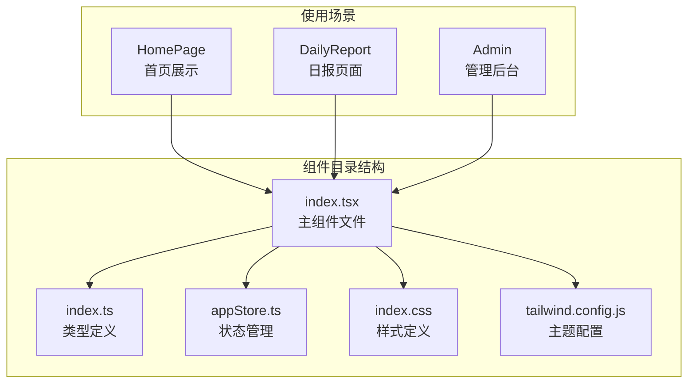
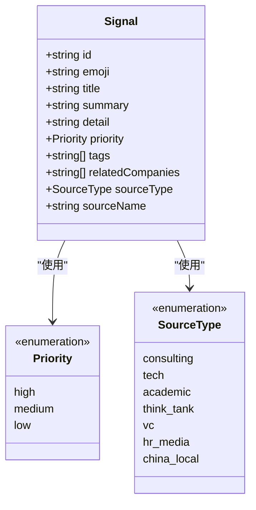
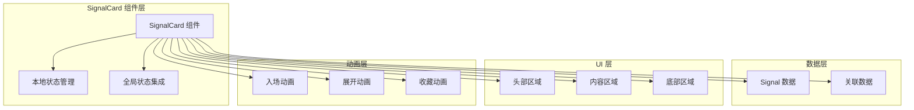
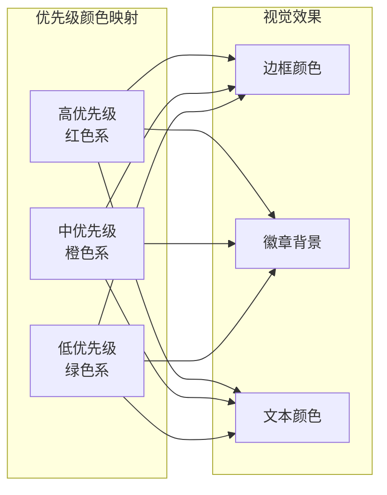
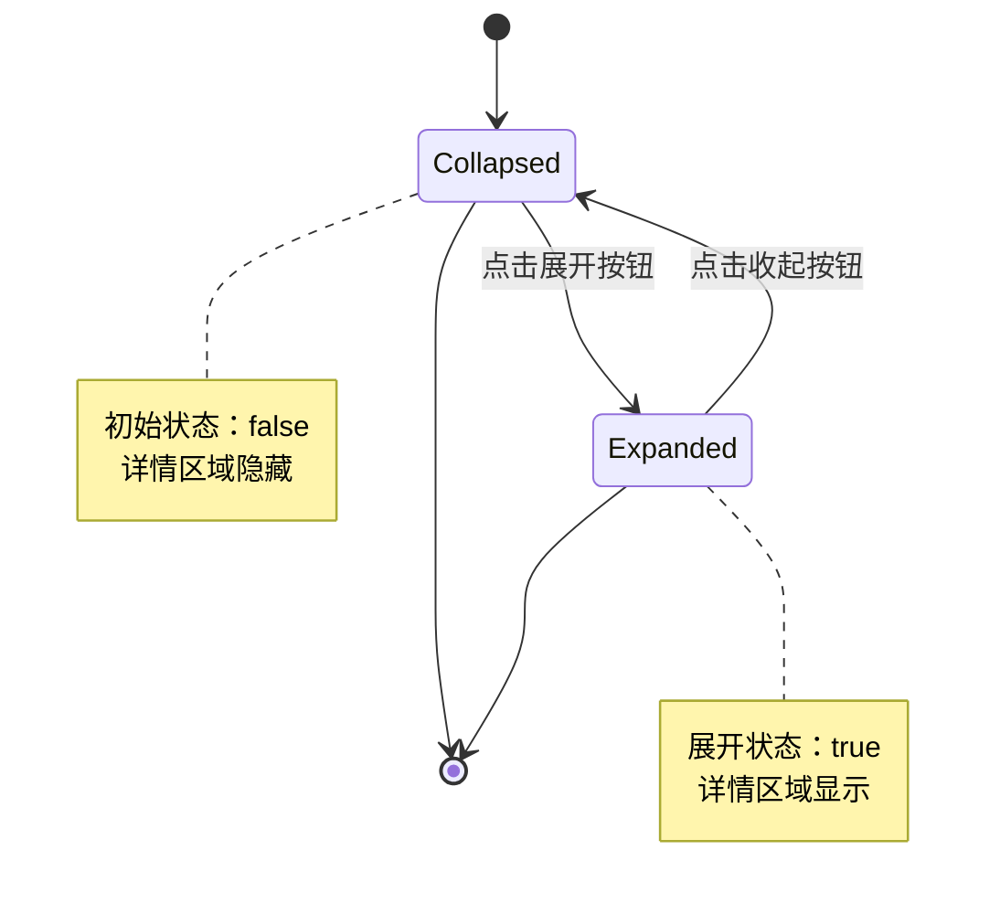
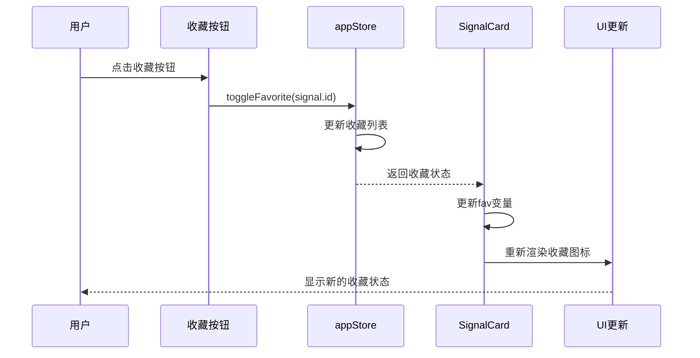
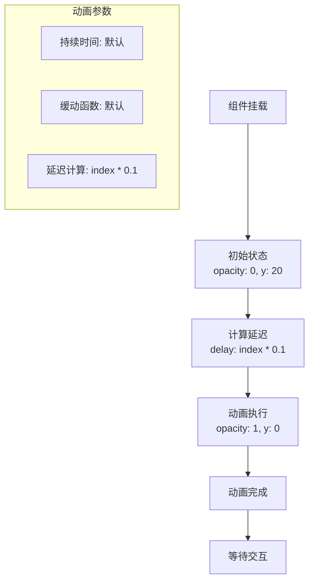
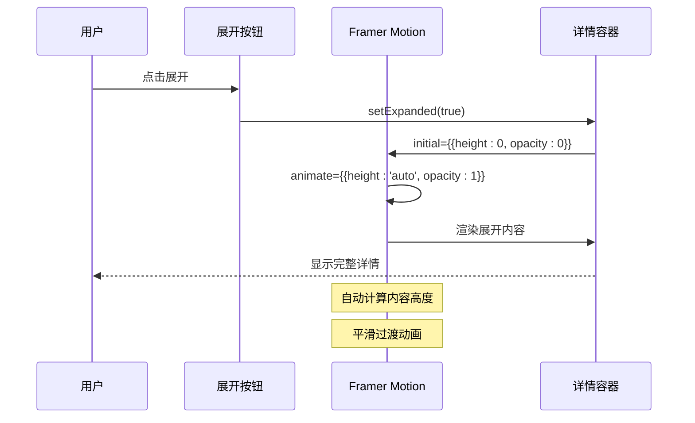
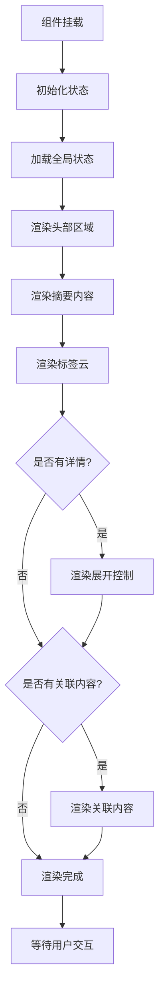
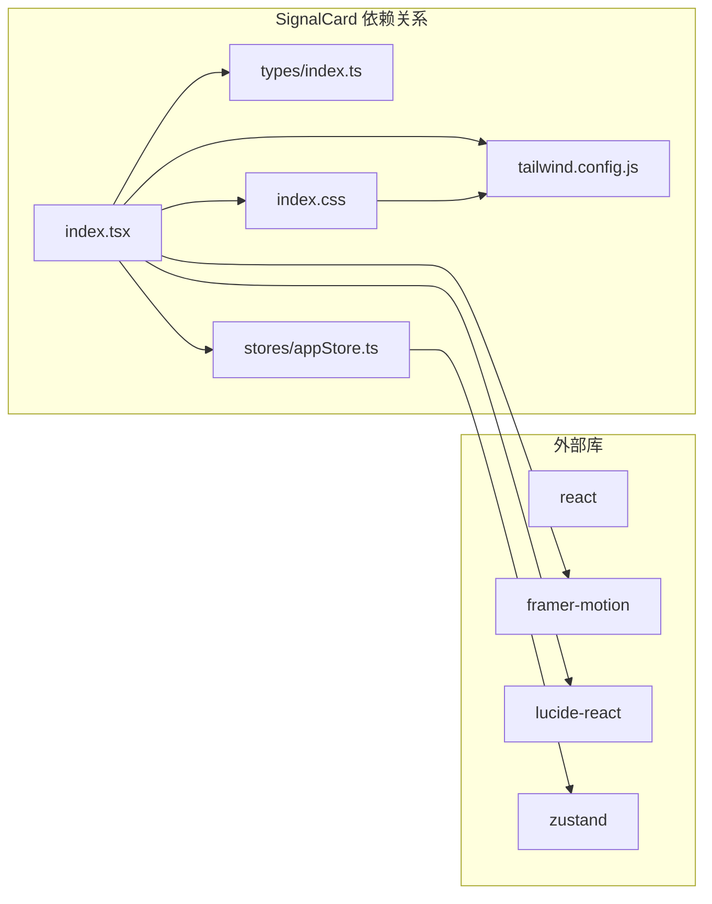

# SignalCard 信号卡片组件

<cite>
**本文档引用的文件**
- [src/components/SignalCard/index.tsx](file://src/components/SignalCard/index.tsx)
- [src/types/index.ts](file://src/types/index.ts)
- [src/stores/appStore.ts](file://src/stores/appStore.ts)
- [src/index.css](file://src/index.css)
- [tailwind.config.js](file://tailwind.config.js)
- [src/pages/DailyReport/index.tsx](file://src/pages/DailyReport/index.tsx)
- [src/pages/HomePage/index.tsx](file://src/pages/HomePage/index.tsx)
- [src/data/daily-reports.ts](file://src/data/daily-reports.ts)
</cite>

## 目录
1. [简介](#简介)
2. [项目结构](#项目结构)
3. [核心组件](#核心组件)
4. [架构概览](#架构概览)
5. [详细组件分析](#详细组件分析)
6. [依赖关系分析](#依赖关系分析)
7. [性能考虑](#性能考虑)
8. [故障排除指南](#故障排除指南)
9. [结论](#结论)
10. [附录](#附录)

## 简介

SignalCard 是一个功能丰富的信号展示组件，专门用于呈现和管理各类信号数据。该组件提供了完整的信号展示、优先级标识、收藏管理、详情展开等功能，是未来洞察平台的核心展示组件之一。

组件支持三种优先级级别（高、中、低），通过不同的视觉样式来区分信号的重要程度。同时集成了收藏功能，允许用户标记重要的信号内容。详情区域支持折叠/展开操作，为用户提供渐进式的信息披露。

## 项目结构

SignalCard 组件位于 `src/components/SignalCard/` 目录下，采用标准的 React 函数组件模式实现。组件与全局状态管理、类型定义、样式系统紧密集成。



**图表来源**
- [src/components/SignalCard/index.tsx:1-174](file://src/components/SignalCard/index.tsx#L1-L174)
- [src/types/index.ts:1-218](file://src/types/index.ts#L1-L218)
- [src/stores/appStore.ts:1-93](file://src/stores/appStore.ts#L1-L93)

**章节来源**
- [src/components/SignalCard/index.tsx:1-174](file://src/components/SignalCard/index.tsx#L1-L174)
- [src/types/index.ts:1-218](file://src/types/index.ts#L1-L218)

## 核心组件

### Props 接口定义

SignalCard 组件接受以下属性：

| 属性名 | 类型 | 必填 | 默认值 | 描述 |
|--------|------|------|--------|------|
| signal | Signal | 是 | - | 信号数据对象，包含标题、摘要、详情等完整信息 |
| index | number | 否 | 0 | 动画延迟索引，用于控制入场动画的时间序列 |
| related | RelatedContent | 否 | undefined | 相关内容关联，包含研究论文和案例数据 |

### Signal 类型数据结构

Signal 接口定义了信号的核心数据结构：



**图表来源**
- [src/types/index.ts:18-31](file://src/types/index.ts#L18-L31)

### RelatedContent 关联内容结构

| 字段名 | 类型 | 描述 |
|--------|------|------|
| papers | {id: string, title: string}[] | 相关研究论文列表 |
| cases | {id: string, title: string}[] | 相关案例列表 |

**章节来源**
- [src/components/SignalCard/index.tsx:8-17](file://src/components/SignalCard/index.tsx#L8-L17)
- [src/types/index.ts:18-31](file://src/types/index.ts#L18-L31)

## 架构概览

SignalCard 采用模块化设计，与多个系统组件协同工作：



**图表来源**
- [src/components/SignalCard/index.tsx:33-173](file://src/components/SignalCard/index.tsx#L33-L173)
- [src/stores/appStore.ts:20-23](file://src/stores/appStore.ts#L20-L23)

## 详细组件分析

### 视觉设计元素

#### 优先级颜色系统

组件实现了完整的优先级视觉体系：

| 优先级 | 颜色代码 | Tailwind 类 | 说明 |
|--------|----------|-------------|------|
| high | #ef4444 | `border-signal-high` | 红色边框，表示高优先级 |
| medium | #f59e0b | `border-signal-medium` | 橙色边框，表示中优先级 |
| low | #10b981 | `border-signal-low` | 绿色边框，表示低优先级 |



**图表来源**
- [src/components/SignalCard/index.tsx:19-31](file://src/components/SignalCard/index.tsx#L19-L31)
- [src/index.css:34-46](file://src/index.css#L34-L46)
- [tailwind.config.js:23-27](file://tailwind.config.js#L23-L27)

#### 标签显示系统

标签采用圆角矩形设计，支持动态渲染：

- 圆角半径：full
- 内边距：px-2 py-0.5  
- 字体大小：text-xs
- 文本颜色：slate-600/dark:slate-400
- 背景颜色：slate-100/dark:surface-700

#### 图标使用策略

组件集成了多种专业图标，用于增强视觉表达：

| 功能区域 | 图标 | 用途 | 尺寸 |
|----------|------|------|------|
| 收藏按钮 | Bookmark/BookmarkCheck | 收藏状态切换 | 18px |
| 展开控制 | ChevronDown/ChevronUp | 详情展开控制 | 14px |
| 关联公司 | Building2 | 公司关联标识 | 12px |
| 相关研究 | FileText | 研究论文标识 | 12px |
| 相关案例 | BarChart3 | 案例关联标识 | 12px |

### 状态管理机制

#### 展开状态控制

组件使用 React 的 useState Hook 管理本地展开状态：



**图表来源**
- [src/components/SignalCard/index.tsx:34-36](file://src/components/SignalCard/index.tsx#L34-L36)

#### 收藏状态切换

收藏功能通过全局 Zustand 状态管理实现：



**图表来源**
- [src/components/SignalCard/index.tsx:34-36](file://src/components/SignalCard/index.tsx#L34-L36)
- [src/stores/appStore.ts:61-67](file://src/stores/appStore.ts#L61-L67)

### Framer Motion 动画实现

#### 入场动画

组件实现了流畅的入场动画效果：



**图表来源**
- [src/components/SignalCard/index.tsx:41-45](file://src/components/SignalCard/index.tsx#L41-L45)

#### 展开动画

详情区域采用高度自适应的展开动画：



**图表来源**
- [src/components/SignalCard/index.tsx:98-107](file://src/components/SignalCard/index.tsx#L98-L107)

### 组件渲染流程



**图表来源**
- [src/components/SignalCard/index.tsx:40-173](file://src/components/SignalCard/index.tsx#L40-L173)

**章节来源**
- [src/components/SignalCard/index.tsx:1-174](file://src/components/SignalCard/index.tsx#L1-L174)

## 依赖关系分析

### 外部依赖

| 依赖包 | 版本 | 用途 |
|--------|------|------|
| react | ^18.2.0 | 核心框架 |
| framer-motion | ^10.16.4 | 动画系统 |
| lucide-react | ^0.294.0 | 图标库 |
| zustand | ^4.4.1 | 状态管理 |

### 内部依赖



**图表来源**
- [src/components/SignalCard/index.tsx:1-6](file://src/components/SignalCard/index.tsx#L1-L6)
- [src/stores/appStore.ts:1-3](file://src/stores/appStore.ts#L1-L3)

**章节来源**
- [src/components/SignalCard/index.tsx:1-6](file://src/components/SignalCard/index.tsx#L1-L6)
- [src/stores/appStore.ts:1-3](file://src/stores/appStore.ts#L1-L3)

## 性能考虑

### 渲染优化

1. **条件渲染优化**
   - 详情内容仅在存在时渲染
   - 关联内容根据实际数据动态显示
   - 收藏状态通过全局状态管理避免重复计算

2. **动画性能**
   - 使用 transform 和 opacity 进行硬件加速
   - 合理的动画延迟避免过度重绘
   - 展开动画使用自动高度计算

3. **内存管理**
   - 使用 React.memo 避免不必要的重渲染
   - 全局状态持久化存储减少重复加载

### 最佳实践建议

1. **Props 传递**
   ```typescript
   // 推荐：传递必要的数据
   <SignalCard 
     signal={signal} 
     index={index} 
     related={relatedContent} 
   />
   
   // 避免：传递冗余数据
   // <SignalCard signal={fullDataset} />
   ```

2. **状态管理**
   - 使用全局状态管理收藏功能
   - 避免在组件内维护重复的状态
   - 合理使用状态持久化

3. **样式优化**
   - 利用 Tailwind CSS 的原子化特性
   - 避免内联样式的过度使用
   - 统一的颜色和间距系统

## 故障排除指南

### 常见问题及解决方案

#### 1. 收藏功能不生效

**问题表现**：点击收藏按钮无反应

**可能原因**：
- 全局状态未正确初始化
- SignalCard 未正确导入 appStore
- Signal.id 缺失或为空

**解决方案**：
```typescript
// 确保 Signal 对象包含有效的 id
const signal = {
  id: 'valid-id', // 必须确保有唯一 id
  title: '信号标题',
  // ... 其他字段
}

// 检查 appStore 是否正确导入
import { useAppStore } from '@/stores/appStore';
```

#### 2. 动画效果异常

**问题表现**：入场动画或展开动画不流畅

**可能原因**：
- Framer Motion 版本不兼容
- 样式冲突导致动画被阻止
- 浏览器性能不足

**解决方案**：
```typescript
// 检查动画配置
<motion.div
  initial={{ opacity: 0, y: 20 }}
  animate={{ opacity: 1, y: 0 }}
  transition={{ 
    delay: index * 0.1,
    duration: 0.3,
    ease: "easeOut"
  }}
>
```

#### 3. 样式显示异常

**问题表现**：优先级颜色或标签样式不正确

**可能原因**：
- Tailwind CSS 配置问题
- 自定义颜色变量未定义
- 暗色主题切换异常

**解决方案**：
```css
/* 确保 Tailwind 配置包含信号颜色 */
signal: {
  high: '#ef4444',
  medium: '#f59e0b', 
  low: '#10b981'
}
```

**章节来源**
- [src/components/SignalCard/index.tsx:34-36](file://src/components/SignalCard/index.tsx#L34-L36)
- [src/stores/appStore.ts:61-67](file://src/stores/appStore.ts#L61-L67)

## 结论

SignalCard 信号卡片组件是一个设计精良、功能完整的 React 组件，具备以下特点：

1. **完整的功能集**：支持信号展示、优先级标识、收藏管理、详情展开等核心功能
2. **优秀的用户体验**：流畅的动画效果和直观的交互设计
3. **良好的可扩展性**：清晰的架构设计便于功能扩展和定制
4. **完善的类型安全**：基于 TypeScript 的强类型定义确保开发安全性
5. **高效的性能表现**：合理的状态管理和渲染优化保证运行效率

该组件为未来洞察平台提供了强大的信号展示能力，是构建复杂信息系统的理想选择。

## 附录

### 使用示例

#### 基础使用
```typescript
<SignalCard 
  signal={signalData} 
  index={currentIndex}
/>
```

#### 高级使用
```typescript
<SignalCard 
  signal={signalData}
  index={currentIndex}
  related={{
    papers: researchPapers,
    cases: transformCases
  }}
/>
```

### 组件集成方式

#### 与全局状态管理集成
```typescript
// 在页面中使用
const { toggleFavorite, isFavorite } = useAppStore();

// 通过 props 传递给组件
<SignalCard 
  signal={signal}
  related={relatedContent}
/>
```

#### 与路由系统集成
```typescript
// 关联链接到相应页面
<Link to="/companies">公司详情</Link>
<Link to="/research">研究论文</Link> 
<Link to="/cases">转型案例</Link>
```

**章节来源**
- [src/pages/HomePage/index.tsx:100-102](file://src/pages/HomePage/index.tsx#L100-L102)
- [src/pages/DailyReport/index.tsx:20-29](file://src/pages/DailyReport/index.tsx#L20-L29)