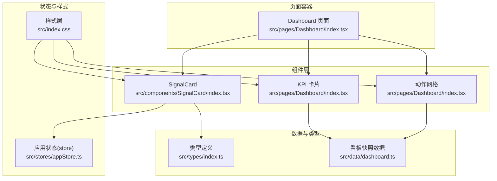
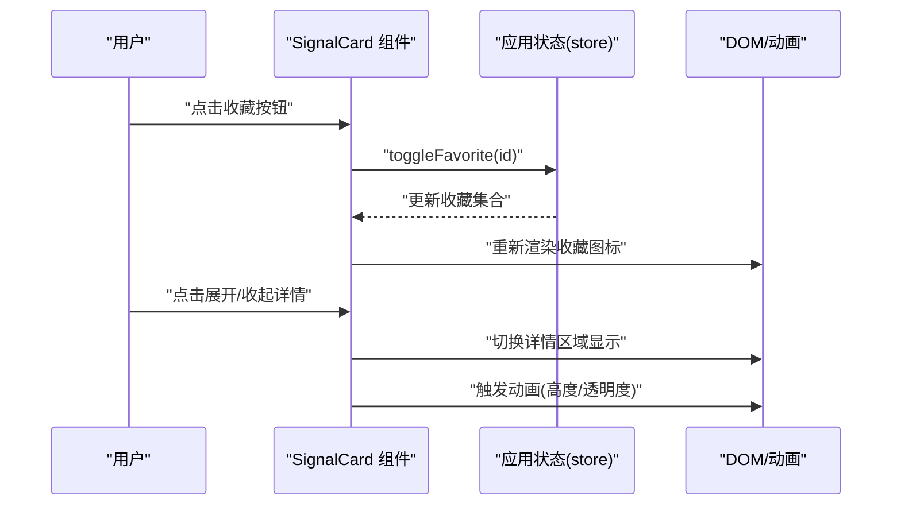
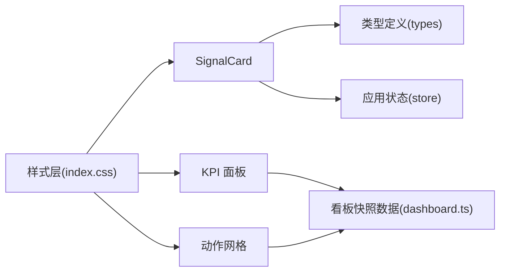

# 内容展示组件

<cite>
**本文引用的文件**
- [src/components/SignalCard/index.tsx](file://src/components/SignalCard/index.tsx)
- [src/types/index.ts](file://src/types/index.ts)
- [src/stores/appStore.ts](file://src/stores/appStore.ts)
- [src/pages/Dashboard/index.tsx](file://src/pages/Dashboard/index.tsx)
- [src/data/dashboard.ts](file://src/data/dashboard.ts)
- [src/index.css](file://src/index.css)
</cite>

## 目录
1. [简介](#简介)
2. [项目结构](#项目结构)
3. [核心组件](#核心组件)
4. [架构总览](#架构总览)
5. [详细组件分析](#详细组件分析)
6. [依赖关系分析](#依赖关系分析)
7. [性能考量](#性能考量)
8. [故障排查指南](#故障排查指南)
9. [结论](#结论)
10. [附录](#附录)

## 简介
本文件面向内容开发者，系统梳理并讲解三大核心展示组件：SignalCard（信号卡片）、KPI 面板（KPI 卡片）与动作网格（Action Grid）。文档围绕设计理念、数据绑定模式、视觉呈现、交互行为与动画效果展开，并给出 props 接口、事件处理机制、样式定制与响应式适配方案，以及使用示例、组合模式与最佳实践。同时，结合数据流处理、性能优化策略与可访问性设计，帮助读者高效构建一致、易用且高性能的内容展示界面。

## 项目结构
本项目采用按功能域分层的组织方式，展示组件位于 components 目录，页面级容器位于 pages 目录，类型定义集中在 types，全局状态通过 Zustand store 管理，样式通过 Tailwind CSS 与自定义组件层进行统一约束。

图表来源
- [src/components/SignalCard/index.tsx](file://src/components/SignalCard/index.tsx)
- [src/pages/Dashboard/index.tsx](file://src/pages/Dashboard/index.tsx)
- [src/types/index.ts](file://src/types/index.ts)
- [src/data/dashboard.ts](file://src/data/dashboard.ts)
- [src/stores/appStore.ts](file://src/stores/appStore.ts)
- [src/index.css](file://src/index.css)

章节来源
- [src/components/SignalCard/index.tsx](file://src/components/SignalCard/index.tsx)
- [src/pages/Dashboard/index.tsx](file://src/pages/Dashboard/index.tsx)
- [src/types/index.ts](file://src/types/index.ts)
- [src/data/dashboard.ts](file://src/data/dashboard.ts)
- [src/stores/appStore.ts](file://src/stores/appStore.ts)
- [src/index.css](file://src/index.css)

## 核心组件
本节概览三大组件的功能定位与职责边界：
- SignalCard：用于展示单条“信号”信息，包含标题、摘要、标签、优先级、来源、收藏、展开详情与关联公司等字段；支持收藏切换与折叠展开。
- KPI 面板：以卡片形式集中展示关键指标，包含数值、单位、变化趋势与时间维度标注；常用于仪表盘快速浏览。
- 动作网格：以表格或列表形式展示行动项，体现优先级、行动描述、时间窗口与依据等信息；支持排序与筛选。

章节来源
- [src/components/SignalCard/index.tsx](file://src/components/SignalCard/index.tsx)
- [src/pages/Dashboard/index.tsx](file://src/pages/Dashboard/index.tsx)
- [src/types/index.ts](file://src/types/index.ts)

## 架构总览
以下序列图展示了 SignalCard 的典型交互流程：用户点击收藏按钮触发状态更新，组件根据当前收藏状态渲染不同图标；卡片整体具备进入动画与展开详情的过渡效果。

图表来源
- [src/components/SignalCard/index.tsx](file://src/components/SignalCard/index.tsx)
- [src/stores/appStore.ts](file://src/stores/appStore.ts)

## 详细组件分析

### SignalCard 信号卡片
SignalCard 是内容展示的核心入口组件之一，负责以卡片形式承载一条“信号”的完整信息，并提供交互能力。

- 设计理念
  - 信息层级清晰：优先级边框、标题、摘要、标签、来源、收藏、展开详情、关联公司。
  - 视觉反馈及时：收藏状态即时切换、展开收起带过渡动画、悬停态阴影增强。
  - 可扩展性强：支持详情字段存在时才渲染展开区域，避免空渲染。

- 数据绑定模式
  - 输入属性：接收 Signal 类型对象与可选索引参数，用于控制入场动画延迟。
  - 状态管理：通过应用状态 store 切换收藏状态，组件内部仅维护本地展开状态。
  - 类型约束：Signal 类型由统一类型定义提供，确保字段完整性与可维护性。

- 视觉呈现
  - 优先级边框：基于优先级映射到不同边框颜色类名，便于快速识别重要程度。
  - 收藏图标：根据收藏状态动态切换未收藏/已收藏图标，强调用户个性化。
  - 展开详情：使用动画容器包裹详情内容，保证展开过程自然流畅。

- 交互行为与动画
  - 入场动画：使用帧动画库实现逐个卡片淡入与上移，delay 与索引相关。
  - 展开收起：详情区域使用高度与透明度动画，配合上下箭头指示器。
  - 悬停态：卡片具备阴影与轻微位移的悬停反馈，提升可点选性。

- props 接口定义
  - signal: Signal（必填）
  - index: number（可选，默认 0）

- 事件处理机制
  - 收藏切换：点击收藏按钮调用 store 的 toggleFavorite 方法。
  - 展开收起：点击“展开/收起”按钮切换本地展开状态。

- 样式定制选项
  - 通过 Tailwind 类名与主题变量控制边框、背景、文字与阴影。
  - 组件层样式定义了信号卡片的基础外观，可在业务层叠加额外类名。

- 响应式适配
  - 使用 Flex/Grid 布局在小屏与大屏间自动调整间距与换行。
  - 文字大小与内边距在暗色主题下具备对应变体。

- 使用示例与组合模式
  - 在列表页中循环渲染多个 SignalCard，并传入不同的 index 实现错峰入场。
  - 与标签过滤、收藏筛选等全局状态配合，形成“信号聚合页”。

- 最佳实践
  - 将优先级与颜色映射集中管理，避免分散硬编码。
  - 对长文本摘要进行截断或阈值判断，避免布局抖动。
  - 为收藏按钮提供可访问性标签，提升无障碍体验。

章节来源
- [src/components/SignalCard/index.tsx](file://src/components/SignalCard/index.tsx)
- [src/types/index.ts](file://src/types/index.ts)
- [src/stores/appStore.ts](file://src/stores/appStore.ts)
- [src/index.css](file://src/index.css)

### KPI 面板
KPI 面板用于在仪表盘中集中展示关键指标，强调“一目了然”的信息密度与趋势表达。

- 设计理念
  - 卡片化展示：每个 KPI 以独立卡片呈现，突出数值与变化。
  - 趋势可视化：结合正负变化图标与百分比标注，直观反映趋势方向。
  - 主题一致性：通过颜色类名统一风格，适配浅色/深色主题。

- 数据绑定模式
  - 输入数据：来自看板快照数据模块，包含 KPI 列表与趋势数据。
  - 渲染逻辑：遍历 KPI 列表，按索引计算入场动画延迟，形成渐进式加载。

- 视觉呈现
  - 数值与单位：使用等宽字体数字增强可读性。
  - 变化趋势：根据变化值正负选择上升/下降/持平图标与颜色。
  - 卡片背景：通过颜色类名设置卡片背景色，形成视觉分区。

- 交互行为与动画
  - 入场动画：逐个卡片淡入与上移，delay 与索引相关。
  - 响应式图表：趋势图使用响应式容器，适配不同屏幕尺寸。

- props 接口定义
  - 该组件为页面级容器，不直接对外暴露可复用的 props；其输入来源于看板快照数据模块。

- 事件处理机制
  - 无交互式按钮，主要通过数据驱动渲染。

- 样式定制选项
  - 通过颜色类名与主题变量控制卡片背景与文字颜色。
  - 组件层样式定义了 KPI 卡片的基础外观。

- 响应式适配
  - 使用栅格布局在小屏与大屏间自动调整列数与间距。
  - 图表容器宽度与高度自适应父元素。

- 使用示例与组合模式
  - 在仪表盘页面中直接引入 KPI 面板与趋势图，形成“指标 + 走势”的双栏布局。
  - 可与“明细数据”卡片组合，实现“总览 → 详情”的导航式浏览。

- 最佳实践
  - 控制 KPI 数量上限，避免信息过载。
  - 对变化值进行阈值判断，仅在显著变化时展示趋势图标。
  - 为图表提供可访问性提示，提升无障碍体验。

章节来源
- [src/pages/Dashboard/index.tsx](file://src/pages/Dashboard/index.tsx)
- [src/data/dashboard.ts](file://src/data/dashboard.ts)
- [src/index.css](file://src/index.css)

### 动作网格
动作网格用于展示“行动项”，强调可执行性与优先级，便于用户快速定位下一步工作。

- 设计理念
  - 结构化表格：优先级、行动描述、时间窗口、依据四列信息清晰呈现。
  - 优先级标识：通过颜色与标签直观区分高/中/低优先级。
  - 响应式布局：在小屏设备上隐藏次要列，保证主信息可读性。

- 数据绑定模式
  - 输入数据：来自看板快照数据模块的动作项列表。
  - 渲染逻辑：遍历动作项数组，按优先级映射颜色与标签。

- 视觉呈现
  - 优先级颜色：根据优先级映射到不同背景与文字颜色。
  - 列宽与对齐：数值与单位使用等宽字体，提升对比度。
  - 隐藏列：在小屏设备上隐藏时间窗口与依据列，保留核心信息。

- 交互行为与动画
  - 无交互式按钮，主要通过数据驱动渲染。

- props 接口定义
  - 该组件为页面级容器，不直接对外暴露可复用的 props；其输入来源于看板快照数据模块。

- 事件处理机制
  - 无交互式按钮，主要通过数据驱动渲染。

- 样式定制选项
  - 通过颜色类名与主题变量控制表格行与单元格的背景与文字颜色。
  - 组件层样式定义了动作卡片的基础外观。

- 响应式适配
  - 使用表格与断点控制，在小屏设备上隐藏次要列，保证主信息可读性。

- 使用示例与组合模式
  - 在仪表盘页面中与 KPI 面板、明细数据卡片组合，形成“指标 → 行动 → 详情”的闭环。
  - 可与标签过滤、收藏筛选等全局状态配合，形成“行动聚合页”。

- 最佳实践
  - 控制每页行动项数量，避免信息过载。
  - 对优先级进行明确的业务语义定义，确保团队共识。
  - 提供“一键复制/跳转”等快捷操作，提升执行效率。

章节来源
- [src/pages/Dashboard/index.tsx](file://src/pages/Dashboard/index.tsx)
- [src/data/dashboard.ts](file://src/data/dashboard.ts)
- [src/index.css](file://src/index.css)

## 依赖关系分析
以下依赖图展示了组件与其依赖之间的关系：SignalCard 依赖类型定义与应用状态 store；KPI 面板与动作网格依赖看板快照数据；样式层为所有组件提供统一外观。

图表来源
- [src/components/SignalCard/index.tsx](file://src/components/SignalCard/index.tsx)
- [src/types/index.ts](file://src/types/index.ts)
- [src/stores/appStore.ts](file://src/stores/appStore.ts)
- [src/pages/Dashboard/index.tsx](file://src/pages/Dashboard/index.tsx)
- [src/data/dashboard.ts](file://src/data/dashboard.ts)
- [src/index.css](file://src/index.css)

章节来源
- [src/components/SignalCard/index.tsx](file://src/components/SignalCard/index.tsx)
- [src/types/index.ts](file://src/types/index.ts)
- [src/stores/appStore.ts](file://src/stores/appStore.ts)
- [src/pages/Dashboard/index.tsx](file://src/pages/Dashboard/index.tsx)
- [src/data/dashboard.ts](file://src/data/dashboard.ts)
- [src/index.css](file://src/index.css)

## 性能考量
- 动画与渲染
  - 使用入场动画时，建议限制动画数量与复杂度，避免大量卡片同时渲染造成卡顿。
  - 对长列表采用虚拟滚动或分页策略，减少一次性渲染压力。
- 状态管理
  - 将收藏、阅读历史等状态持久化至本地存储，减少重复请求与重算成本。
  - 仅在必要时更新全局状态，避免不必要的重渲染。
- 样式与主题
  - 通过主题变量与 Tailwind 类名统一管理颜色与间距，减少重复样式定义。
  - 在深色主题下，注意对比度与可读性的平衡，避免过度饱和色彩影响阅读。
- 图表与大数据
  - 对趋势图等可视化组件，建议在小屏设备上禁用复杂交互，仅保留基础展示。
  - 对超大数据集，采用采样或分段渲染策略，避免内存溢出。

## 故障排查指南
- 收藏状态不生效
  - 检查是否正确调用 store 的 toggleFavorite 方法，确认传入的 id 与 Signal.id 一致。
  - 确认 store 的持久化配置是否正常写入本地存储。
- 展开详情不显示
  - 检查 Signal.detail 字段是否存在，仅当存在时才渲染展开区域。
  - 确认动画容器的高度与透明度过渡是否被外部样式覆盖。
- 主题切换异常
  - 检查主题设置函数是否正确更新根元素的类名，确保深色主题样式生效。
  - 确认样式层中主题变量与组件类名的映射关系是否一致。
- 响应式布局错乱
  - 检查断点与栅格类名是否正确，确保在不同屏幕尺寸下的布局表现一致。
  - 对于表格组件，确认隐藏列的断点设置是否合理。

章节来源
- [src/stores/appStore.ts](file://src/stores/appStore.ts)
- [src/components/SignalCard/index.tsx](file://src/components/SignalCard/index.tsx)
- [src/pages/Dashboard/index.tsx](file://src/pages/Dashboard/index.tsx)
- [src/index.css](file://src/index.css)

## 结论
SignalCard、KPI 面板与动作网格共同构成了内容展示体系的核心骨架。通过清晰的数据绑定、一致的视觉语言与合理的交互与动画设计，这些组件能够有效支撑仪表盘与内容聚合页面的信息传达与用户操作。遵循本文提供的接口定义、事件处理机制、样式定制与响应式适配方案，结合性能优化与可访问性设计，将有助于构建高质量、可维护的内容展示系统。

## 附录
- 类型定义概览
  - Signal：信号实体，包含 id、emoji、title、summary、detail、priority、tags、relatedCompanies、sourceType、sourceName 等字段。
  - KPIData：KPI 实体，包含 id、label、value、unit、change、changeLabel、color、date 等字段。
  - DetailTable/DetailTableRow：明细数据实体，包含 id、title、emoji、columns、rows、hrInsight 等字段。
  - ActionItem：行动项实体，包含 id、priority、action、timeWindow、basis 等字段。
- 看板快照数据概览
  - dashboardSnapshot：包含日期、KPI 列表、趋势数据与明细表格集合，作为页面渲染的数据源。

章节来源
- [src/types/index.ts](file://src/types/index.ts)
- [src/data/dashboard.ts](file://src/data/dashboard.ts)