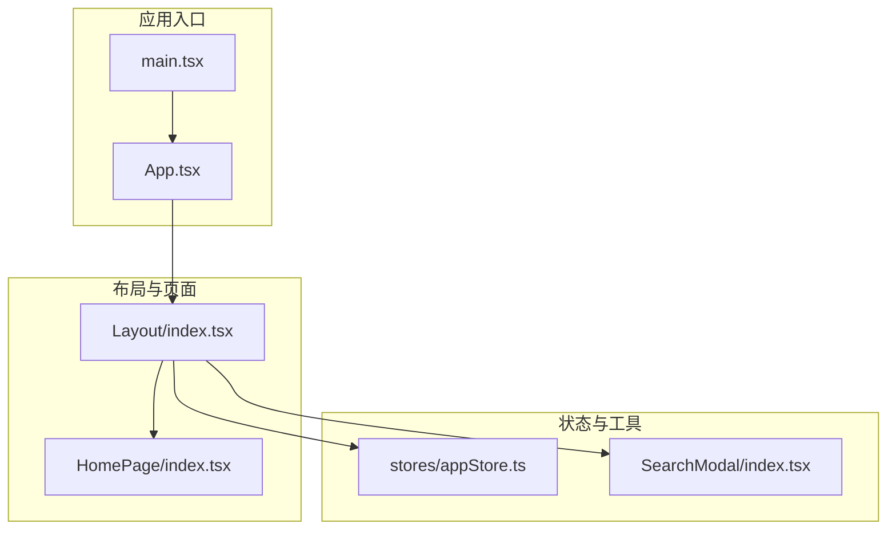
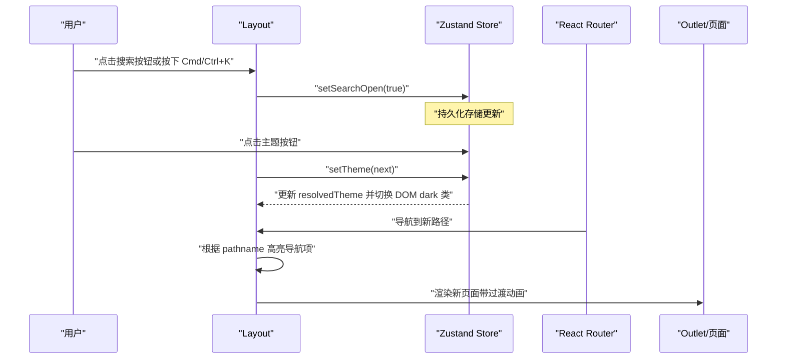
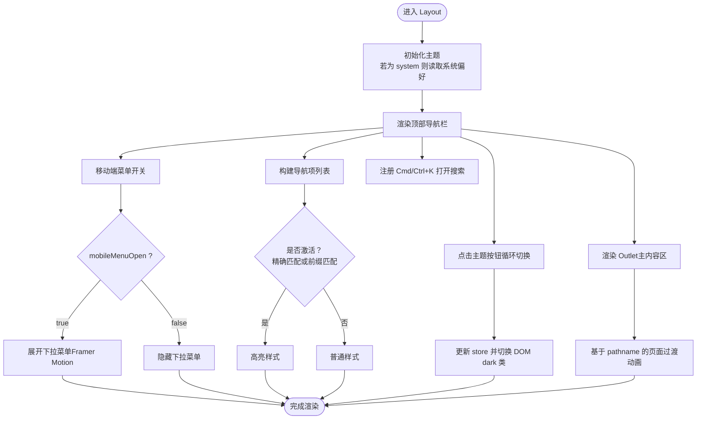
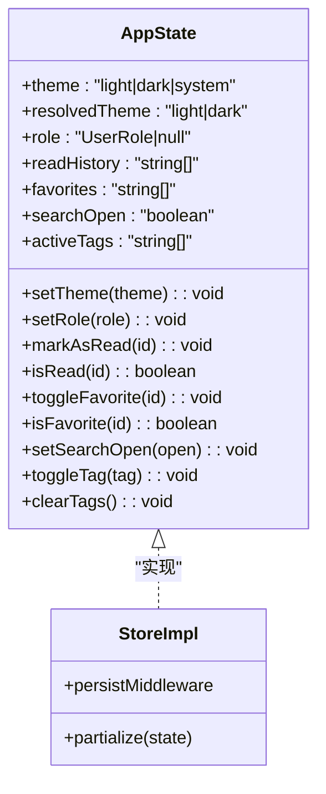
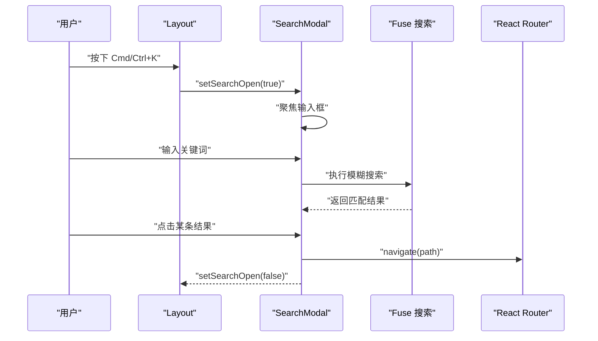
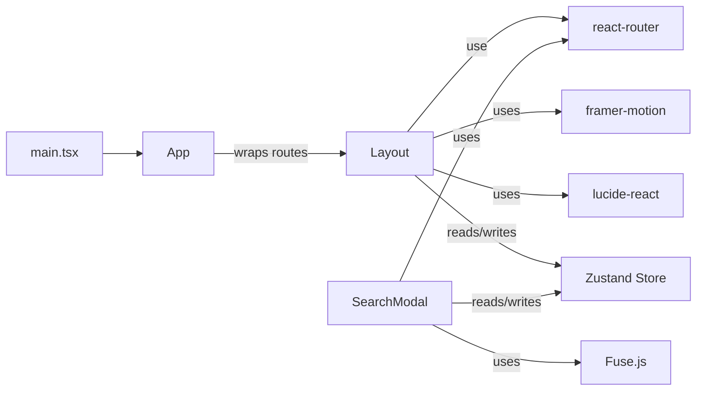

# 布局组件

<cite>
**本文引用的文件**
- [src/components/Layout/index.tsx](file://src/components/Layout/index.tsx)
- [src/stores/appStore.ts](file://src/stores/appStore.ts)
- [src/App.tsx](file://src/App.tsx)
- [src/components/SearchModal/index.tsx](file://src/components/SearchModal/index.tsx)
- [src/pages/HomePage/index.tsx](file://src/pages/HomePage/index.tsx)
- [src/main.tsx](file://src/main.tsx)
</cite>

## 目录
1. [简介](#简介)
2. [项目结构](#项目结构)
3. [核心组件](#核心组件)
4. [架构总览](#架构总览)
5. [详细组件分析](#详细组件分析)
6. [依赖关系分析](#依赖关系分析)
7. [性能考虑](#性能考虑)
8. [故障排查指南](#故障排查指南)
9. [结论](#结论)
10. [附录](#附录)

## 简介
本文件系统性解析布局组件（Layout）的整体架构与导航实现机制，涵盖以下方面：
- 布局组件的 props 接口与状态管理
- 主题切换功能与系统偏好联动
- 导航菜单构建方式与激活态逻辑
- 面包屑导航的实现思路与可扩展点
- 移动端适配策略与交互细节
- 使用示例、自定义配置与扩展指南
- 与应用其他组件的集成模式、数据流向与性能优化建议

## 项目结构
布局组件位于组件层，作为路由嵌套的根容器，承载全局顶部导航、主内容区与页脚；其状态通过 Zustand 应用存储集中管理，并与搜索模态框协同工作。

图表来源
- [src/main.tsx:1-11](file://src/main.tsx#L1-L11)
- [src/App.tsx:15-35](file://src/App.tsx#L15-L35)
- [src/components/Layout/index.tsx:23-174](file://src/components/Layout/index.tsx#L23-L174)
- [src/stores/appStore.ts:35-92](file://src/stores/appStore.ts#L35-L92)
- [src/components/SearchModal/index.tsx:47-155](file://src/components/SearchModal/index.tsx#L47-L155)
- [src/pages/HomePage/index.tsx:25-212](file://src/pages/HomePage/index.tsx#L25-L212)

章节来源
- [src/main.tsx:1-11](file://src/main.tsx#L1-L11)
- [src/App.tsx:15-35](file://src/App.tsx#L15-L35)

## 核心组件
- 布局组件（Layout）
  - 职责：提供全局顶部导航栏、移动端下拉菜单、主内容区域与页脚；处理键盘快捷键打开搜索、主题循环切换、路由变化时的页面过渡动画。
  - 关键状态：移动端菜单开关、当前路由位置。
  - 关键行为：监听 Cmd/Ctrl+K 打开搜索；根据主题设置在 HTML 上添加/移除 dark 类；根据路径高亮导航项。
- 应用状态（Zustand Store）
  - 职责：统一管理主题、用户角色、阅读历史、收藏、搜索弹窗开关、标签过滤等。
  - 特性：持久化存储（仅部分字段），主题解析与 DOM 切换。
- 搜索模态框（SearchModal）
  - 职责：全局搜索入口，聚合多数据源，提供 Fuse 模糊检索与结果展示，支持回车跳转。
- 页面（以 HomePage 为例）
  - 职责：作为 Outlet 内容展示具体页面，体现布局的主内容区渲染。

章节来源
- [src/components/Layout/index.tsx:23-174](file://src/components/Layout/index.tsx#L23-L174)
- [src/stores/appStore.ts:35-92](file://src/stores/appStore.ts#L35-L92)
- [src/components/SearchModal/index.tsx:47-155](file://src/components/SearchModal/index.tsx#L47-L155)
- [src/pages/HomePage/index.tsx:25-212](file://src/pages/HomePage/index.tsx#L25-L212)

## 架构总览
布局组件采用“容器 + 状态”模式：
- 容器负责 UI 结构与交互（导航、主题、搜索、移动端菜单、页面过渡）。
- 状态通过 Zustand 提供，包括主题、搜索弹窗、用户角色等，确保跨组件共享与持久化。
- 路由通过 React Router 嵌套在 Layout 下，Outlet 渲染当前页面。

图表来源
- [src/components/Layout/index.tsx:29-51](file://src/components/Layout/index.tsx#L29-L51)
- [src/stores/appStore.ts:39-47](file://src/stores/appStore.ts#L39-L47)
- [src/App.tsx:19-31](file://src/App.tsx#L19-L31)

## 详细组件分析

### 布局组件（Layout）分析
- Props 接口
  - 无外部 props，通过 react-router 的 useLocation 获取当前路径；通过 Zustand store 注入主题、搜索开关与设置函数。
- 状态管理
  - 内部状态：mobileMenuOpen（移动端菜单开关）。
  - 外部状态：theme/resolvedTheme、searchOpen、setTheme/setSearchOpen。
- 主题切换机制
  - 支持 light/dark/system 三态循环；当为 system 时读取系统偏好；最终在 documentElement 上切换 dark 类名。
- 导航菜单构建
  - 静态 navItems 列表定义导航项（路径、标签、图标）；桌面端为水平导航，移动端为下拉列表。
  - 激活态判断：精确匹配或前缀匹配（除根路径外）。
- 移动端适配
  - lg 断点以上显示桌面导航，lg 以下显示汉堡菜单；使用 Framer Motion 实现展开/收起动画。
- 页面过渡与 Outlet
  - 使用 AnimatePresence + motion 包裹主内容区，基于 location.pathname 生成 key，实现页面进入/退出过渡。
- 键盘快捷键
  - 监听窗口级键盘事件，Cmd/Ctrl+K 打开搜索弹窗。

图表来源
- [src/components/Layout/index.tsx:23-174](file://src/components/Layout/index.tsx#L23-L174)
- [src/stores/appStore.ts:39-47](file://src/stores/appStore.ts#L39-L47)

章节来源
- [src/components/Layout/index.tsx:11-21](file://src/components/Layout/index.tsx#L11-L21)
- [src/components/Layout/index.tsx:23-51](file://src/components/Layout/index.tsx#L23-L51)
- [src/components/Layout/index.tsx:66-86](file://src/components/Layout/index.tsx#L66-L86)
- [src/components/Layout/index.tsx:117-149](file://src/components/Layout/index.tsx#L117-L149)
- [src/components/Layout/index.tsx:153-165](file://src/components/Layout/index.tsx#L153-L165)

### 应用状态（Zustand Store）分析
- 数据模型与方法
  - 主题：theme（light/dark/system）、resolvedTheme（解析后的 light/dark）、setTheme。
  - 用户：role、setRole。
  - 阅读历史：readHistory、markAsRead、isRead。
  - 收藏：favorites、toggleFavorite、isFavorite。
  - 搜索：searchOpen、setSearchOpen。
  - 标签过滤：activeTags、toggleTag、clearTags。
- 持久化策略
  - 使用 persist 中间件，仅持久化 theme、role、readHistory、favorites 字段，避免存储过多状态。
- 主题解析与 DOM 切换
  - setTheme 内部根据 theme 值解析 resolvedTheme，并在 documentElement 上添加/移除 dark 类，驱动全局样式切换。

图表来源
- [src/stores/appStore.ts:5-33](file://src/stores/appStore.ts#L5-L33)
- [src/stores/appStore.ts:35-92](file://src/stores/appStore.ts#L35-L92)

章节来源
- [src/stores/appStore.ts:35-92](file://src/stores/appStore.ts#L35-L92)

### 搜索模态框（SearchModal）分析
- 功能概述
  - 在全局打开状态下渲染搜索输入与结果列表，支持 Fuse 模糊搜索与高亮片段展示。
- 数据索引
  - 从多个数据模块构建统一搜索索引（日报信号、公司动态、研究报告、转型案例、延伸阅读、词典术语）。
- 交互流程
  - 打开：store.searchOpen=true，自动聚焦输入框。
  - 搜索：输入触发 Fuse 查询，返回前 10 条结果。
  - 选择：点击结果触发路由跳转并关闭弹窗。
- 与布局协作
  - 布局通过 Cmd/Ctrl+K 触发 setSearchOpen(true)，从而唤起 SearchModal。

图表来源
- [src/components/Layout/index.tsx:29-38](file://src/components/Layout/index.tsx#L29-L38)
- [src/components/SearchModal/index.tsx:47-155](file://src/components/SearchModal/index.tsx#L47-L155)

章节来源
- [src/components/SearchModal/index.tsx:22-45](file://src/components/SearchModal/index.tsx#L22-L45)
- [src/components/SearchModal/index.tsx:53-59](file://src/components/SearchModal/index.tsx#L53-L59)
- [src/components/SearchModal/index.tsx:69-72](file://src/components/SearchModal/index.tsx#L69-L72)

### 面包屑导航实现思路
- 当前实现
  - 布局组件未内置面包屑导航组件；导航项通过静态列表与路径高亮实现层级感知。
- 可扩展方案
  - 在页面层按路由路径动态生成面包屑数组，结合 react-router 的 useLocation 与 matchRoutes 计算当前路径层级。
  - 将面包屑作为独立组件引入页面头部，与现有导航并列或嵌入。
  - 对于多语言场景，可维护路径到标题的映射表，按当前语言动态渲染。
- 与现有导航的衔接
  - 面包屑应与导航项的 path/label 保持一致，避免语义割裂。

[本节为概念性说明，不直接分析具体文件，故不附“章节来源”]

## 依赖关系分析
- 组件耦合
  - Layout 依赖：react-router（useLocation、Link、Outlet）、framer-motion（动画）、lucide-react（图标）、Zustand store。
  - SearchModal 依赖：Zustand store、Fuse、react-router（useNavigate）。
- 数据流向
  - 用户操作（点击主题、搜索、导航） → Layout 更新 store 或触发路由 → Store 更新状态并影响 DOM/路由 → 组件重新渲染。
- 外部依赖
  - Tailwind CSS 提供样式与断点；Framer Motion 提供过渡动画；Lucide 提供图标；Fuse 提供搜索能力。

图表来源
- [src/components/Layout/index.tsx:1-9](file://src/components/Layout/index.tsx#L1-L9)
- [src/components/SearchModal/index.tsx:1-12](file://src/components/SearchModal/index.tsx#L1-L12)
- [src/App.tsx:15-35](file://src/App.tsx#L15-L35)
- [src/main.tsx:1-11](file://src/main.tsx#L1-L11)

章节来源
- [src/components/Layout/index.tsx:1-9](file://src/components/Layout/index.tsx#L1-L9)
- [src/components/SearchModal/index.tsx:1-12](file://src/components/SearchModal/index.tsx#L1-L12)
- [src/App.tsx:15-35](file://src/App.tsx#L15-L35)

## 性能考虑
- 动画与渲染
  - 使用 AnimatePresence 控制页面过渡，减少不必要的重排；为每个页面设置唯一 key（基于 pathname）可提升过渡稳定性。
- 状态粒度
  - Store 仅持久化必要字段，避免存储过大数据；主题解析在 setTheme 内部完成，避免重复计算。
- 搜索性能
  - 搜索结果限制为前 10 条；Fuse 初始化在组件内进行，可在首次打开时延迟加载以降低首屏压力。
- 图标与样式
  - lucide-react 为按需导入，避免打包冗余；Tailwind 原子类便于裁剪，但需注意类名膨胀，建议在生产环境启用 Purge。

[本节提供通用指导，不直接分析具体文件，故不附“章节来源”]

## 故障排查指南
- 主题切换无效
  - 检查 Store 的 setTheme 是否被调用；确认 resolvedTheme 解析逻辑与 documentElement 的 dark 类是否同步。
  - 参考：[src/stores/appStore.ts:39-47](file://src/stores/appStore.ts#L39-L47)
- Cmd/Ctrl+K 无法打开搜索
  - 确认窗口级键盘事件监听是否生效；检查 store.searchOpen 是否被正确置位。
  - 参考：[src/components/Layout/index.tsx:29-38](file://src/components/Layout/index.tsx#L29-L38)
- 移动端菜单不显示
  - 检查 mobileMenuOpen 状态与 lg 断点；确认 AnimatePresence 与 motion 的高度/透明度动画条件。
  - 参考：[src/components/Layout/index.tsx:117-149](file://src/components/Layout/index.tsx#L117-L149)
- 导航高亮异常
  - 确认 navItems 的 path 与实际路由一致；精确匹配与前缀匹配规则是否符合预期。
  - 参考：[src/components/Layout/index.tsx:66-86](file://src/components/Layout/index.tsx#L66-L86)
- 搜索结果为空
  - 检查 Fuse 初始化索引是否完整；查询阈值与高亮片段长度是否合理。
  - 参考：[src/components/SearchModal/index.tsx:22-45](file://src/components/SearchModal/index.tsx#L22-L45), [src/components/SearchModal/index.tsx:53-59](file://src/components/SearchModal/index.tsx#L53-L59)

章节来源
- [src/stores/appStore.ts:39-47](file://src/stores/appStore.ts#L39-L47)
- [src/components/Layout/index.tsx:29-38](file://src/components/Layout/index.tsx#L29-L38)
- [src/components/Layout/index.tsx:117-149](file://src/components/Layout/index.tsx#L117-L149)
- [src/components/Layout/index.tsx:66-86](file://src/components/Layout/index.tsx#L66-L86)
- [src/components/SearchModal/index.tsx:22-45](file://src/components/SearchModal/index.tsx#L22-L45)
- [src/components/SearchModal/index.tsx:53-59](file://src/components/SearchModal/index.tsx#L53-L59)

## 结论
布局组件通过简洁的结构与明确的状态分离，实现了稳定的导航、主题与搜索体验，并提供了良好的移动端适配。配合 Zustand 的轻量持久化与 Fuse 的高效搜索，整体具备可扩展性与可维护性。后续可在页面层引入面包屑导航与更丰富的路由元信息，进一步完善导航体验。

## 附录

### 使用示例与最佳实践
- 基础用法
  - 在路由顶层包裹 Layout，所有页面在 Layout 内渲染。
  - 参考：[src/App.tsx:19-31](file://src/App.tsx#L19-L31)
- 自定义导航项
  - 修改静态导航列表，新增/删除路径与图标，确保与路由一致。
  - 参考：[src/components/Layout/index.tsx:11-21](file://src/components/Layout/index.tsx#L11-L21)
- 主题与系统偏好
  - 使用 setTheme 切换 light/dark/system；系统偏好会在 system 模式下生效。
  - 参考：[src/stores/appStore.ts:39-47](file://src/stores/appStore.ts#L39-L47)
- 快捷键与搜索
  - 通过 Cmd/Ctrl+K 打开搜索；搜索结果点击后自动跳转并关闭弹窗。
  - 参考：[src/components/Layout/index.tsx:29-38](file://src/components/Layout/index.tsx#L29-L38), [src/components/SearchModal/index.tsx:69-72](file://src/components/SearchModal/index.tsx#L69-L72)

### 扩展指南
- 面包屑导航
  - 在页面层计算当前路径层级，渲染面包屑组件；与导航项保持一致的路径与标签。
- 多语言支持
  - 为导航项与页面标题维护本地化映射，按当前语言动态渲染。
- 搜索增强
  - 扩展搜索索引来源，增加权重与分类标签，优化结果排序与高亮片段。

[本节为概念性说明，不直接分析具体文件，故不附“章节来源”]