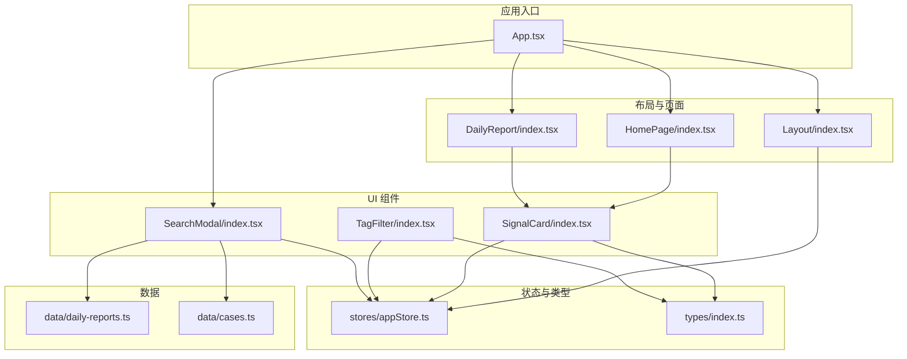
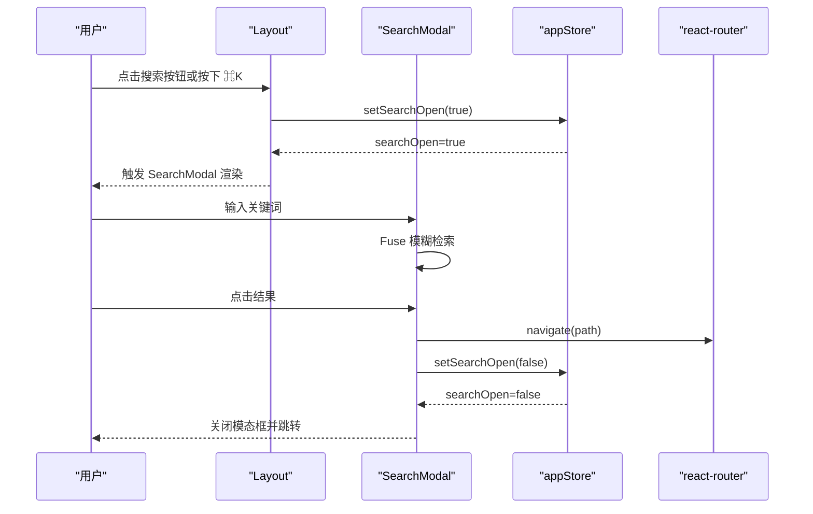
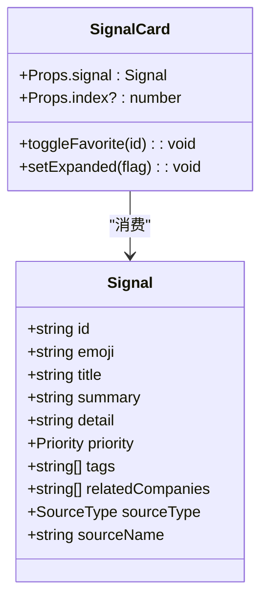
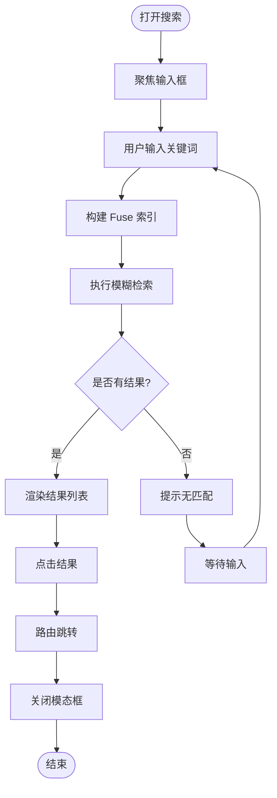
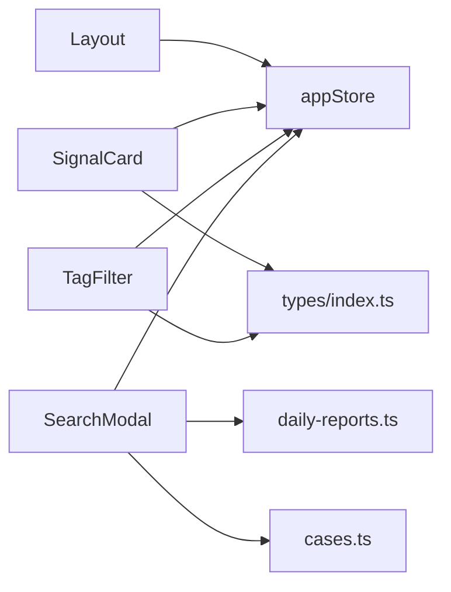

# 组件系统

<cite>
**本文引用的文件**
- [src/components/Layout/index.tsx](file://src/components/Layout/index.tsx)
- [src/components/SignalCard/index.tsx](file://src/components/SignalCard/index.tsx)
- [src/components/SearchModal/index.tsx](file://src/components/SearchModal/index.tsx)
- [src/components/TagFilter/index.tsx](file://src/components/TagFilter/index.tsx)
- [src/App.tsx](file://src/App.tsx)
- [src/stores/appStore.ts](file://src/stores/appStore.ts)
- [src/types/index.ts](file://src/types/index.ts)
- [src/pages/DailyReport/index.tsx](file://src/pages/DailyReport/index.tsx)
- [src/pages/HomePage/index.tsx](file://src/pages/HomePage/index.tsx)
- [src/data/daily-reports.ts](file://src/data/daily-reports.ts)
- [src/data/cases.ts](file://src/data/cases.ts)
</cite>

## 目录
1. [简介](#简介)
2. [项目结构](#项目结构)
3. [核心组件](#核心组件)
4. [架构总览](#架构总览)
5. [组件详解](#组件详解)
6. [依赖关系分析](#依赖关系分析)
7. [性能考量](#性能考量)
8. [故障排查指南](#故障排查指南)
9. [结论](#结论)
10. [附录](#附录)

## 简介
本文件面向 UI 开发者，系统性梳理“未来组织·HR洞察日报”的组件系统，重点覆盖：
- 布局组件（Layout）：导航设计、主题切换、移动端菜单、全局快捷键与路由动画
- 信号卡片组件（SignalCard）：信息层级、优先级样式、收藏与展开细节
- 搜索模态框（SearchModal）：跨数据源索引构建、模糊检索、结果呈现与导航
- 标签过滤器（TagFilter）：标签激活状态、清空与交互反馈

文档提供各组件的 props 接口、事件处理、样式定制点、使用示例、组合模式与最佳实践，并解释组件间通信机制、状态共享策略及性能优化方案。

## 项目结构
组件位于 src/components 下，页面位于 src/pages，状态通过 Zustand store 管理，类型定义位于 src/types，数据样例位于 src/data。

图表来源
- [src/App.tsx:15-35](file://src/App.tsx#L15-L35)
- [src/components/Layout/index.tsx:23-174](file://src/components/Layout/index.tsx#L23-L174)
- [src/components/SignalCard/index.tsx:26-110](file://src/components/SignalCard/index.tsx#L26-L110)
- [src/components/SearchModal/index.tsx:47-155](file://src/components/SearchModal/index.tsx#L47-L155)
- [src/components/TagFilter/index.tsx:9-48](file://src/components/TagFilter/index.tsx#L9-L48)
- [src/stores/appStore.ts:35-92](file://src/stores/appStore.ts#L35-L92)
- [src/types/index.ts:20-31](file://src/types/index.ts#L20-L31)
- [src/data/daily-reports.ts:1-200](file://src/data/daily-reports.ts#L1-L200)
- [src/data/cases.ts:1-63](file://src/data/cases.ts#L1-L63)

章节来源
- [src/App.tsx:15-35](file://src/App.tsx#L15-L35)
- [src/components/Layout/index.tsx:23-174](file://src/components/Layout/index.tsx#L23-L174)

## 核心组件
- Layout：提供顶部导航、移动端菜单、主题切换、全局搜索触发、路由动画与页脚
- SignalCard：展示信号标题、摘要、标签、优先级、收藏、可展开详情与关联公司
- SearchModal：全局搜索模态框，支持跨数据源检索与快速跳转
- TagFilter：标签筛选器，支持激活/取消、清空与视觉反馈

章节来源
- [src/components/Layout/index.tsx:23-174](file://src/components/Layout/index.tsx#L23-L174)
- [src/components/SignalCard/index.tsx:26-110](file://src/components/SignalCard/index.tsx#L26-L110)
- [src/components/SearchModal/index.tsx:47-155](file://src/components/SearchModal/index.tsx#L47-L155)
- [src/components/TagFilter/index.tsx:9-48](file://src/components/TagFilter/index.tsx#L9-L48)

## 架构总览
组件系统采用“布局容器 + 页面 + 业务组件”的分层结构，状态集中于 Zustand store，类型统一于 types/index.ts。页面通过 props 注入数据，组件通过 store 进行状态共享与交互。

图表来源
- [src/components/Layout/index.tsx:29-38](file://src/components/Layout/index.tsx#L29-L38)
- [src/components/SearchModal/index.tsx:47-155](file://src/components/SearchModal/index.tsx#L47-L155)
- [src/stores/appStore.ts:69-71](file://src/stores/appStore.ts#L69-L71)

## 组件详解

### 布局组件 Layout
- 设计理念
  - 顶部导航栏：Logo、桌面导航、右侧操作（搜索、主题、移动端菜单）
  - 移动端：抽屉式菜单，使用动画过渡
  - 主题：支持 light/dark/system，初始化时根据系统偏好设置
  - 全局快捷键：Cmd/Ctrl+K 打开搜索
  - 路由动画：Outlet 内容使用动画过渡
- 关键行为
  - 主题循环：light → dark → system
  - 搜索打开：通过 store 控制
  - 导航高亮：基于 pathname 判断
  - 移动端菜单开关
- Props 接口
  - 无显式 props（依赖路由与 store）
- 事件处理
  - 键盘事件监听 Cmd/Ctrl+K
  - 主题切换按钮点击
  - 搜索按钮点击
  - 移动端菜单开关
- 样式定制
  - 支持通过 Tailwind 类名覆盖颜色、边框、背景与暗色模式类
  - 动画使用 Framer Motion 的 motion/AnimatePresence
- 使用示例
  - 在 App 中作为路由元素包裹页面
- 组合模式
  - 与 SearchModal、SignalCard、TagFilter 等组件配合使用
- 最佳实践
  - 将导航项集中维护，便于扩展与一致性
  - 主题切换逻辑与系统偏好联动
  - 移动端菜单使用动画提升体验

章节来源
- [src/components/Layout/index.tsx:11-21](file://src/components/Layout/index.tsx#L11-L21)
- [src/components/Layout/index.tsx:29-38](file://src/components/Layout/index.tsx#L29-L38)
- [src/components/Layout/index.tsx:40-51](file://src/components/Layout/index.tsx#L40-L51)
- [src/components/Layout/index.tsx:67-85](file://src/components/Layout/index.tsx#L67-L85)
- [src/components/Layout/index.tsx:118-149](file://src/components/Layout/index.tsx#L118-L149)
- [src/components/Layout/index.tsx:154-164](file://src/components/Layout/index.tsx#L154-L164)

### 信号卡片组件 SignalCard
- 信息展示模式
  - 标题、摘要、优先级徽章、来源名称
  - 标签列表
  - 可选详情区域（展开/收起）
  - 关联公司（外部链接图标）
  - 收藏按钮（切换收藏状态）
- Props 接口
  - signal: Signal（来自 types/index.ts）
  - index?: number（用于入场动画延迟）
- 事件处理
  - 收藏按钮：调用 store.toggleFavorite
  - 展开/收起：本地状态控制
- 样式定制
  - 优先级边框与徽章颜色映射
  - 暗色模式适配
  - 动画入场延时
- 使用示例
  - 在页面中遍历数据渲染多个 SignalCard
- 组合模式
  - 与 HomePage、DailyReport 页面组合使用
- 最佳实践
  - 为每个卡片提供稳定的 key（signal.id）
  - 优先级样式与徽章文案保持一致
  - 展开详情区域仅在存在 detail 时渲染

图表来源
- [src/components/SignalCard/index.tsx:7-10](file://src/components/SignalCard/index.tsx#L7-L10)
- [src/types/index.ts:20-31](file://src/types/index.ts#L20-L31)

章节来源
- [src/components/SignalCard/index.tsx:26-110](file://src/components/SignalCard/index.tsx#L26-L110)
- [src/types/index.ts:20-31](file://src/types/index.ts#L20-L31)

### 搜索模态框 SearchModal
- 交互设计
  - 打开方式：Layout 触发或 Cmd/Ctrl+K 快捷键
  - 输入框聚焦与关闭
  - 结果列表：按 section 分组、截取匹配片段
  - 点击结果跳转到对应页面
- 数据索引
  - 构建跨数据源索引：日报信号、公司更新、研究报告、转型案例、延伸阅读、词典术语
  - 使用 Fuse.js 进行模糊检索，配置阈值与匹配高亮
- Props 接口
  - 无显式 props（依赖 store 与路由）
- 事件处理
  - 输入变更：setQuery
  - 选择结果：navigate + setSearchOpen(false)
  - 打开/关闭：useEffect 管理焦点与清理
- 样式定制
  - 背景蒙层、模态框尺寸、滚动区域高度
  - 暗色模式适配
- 使用示例
  - 在 App 中直接渲染，作为全局搜索入口
- 组合模式
  - 与 Layout、pages 路由组合
- 最佳实践
  - 限制结果数量，避免过多渲染
  - 优化 Fuse 配置，平衡准确度与性能
  - 输入框自动聚焦，提升键盘可达性

图表来源
- [src/components/SearchModal/index.tsx:47-155](file://src/components/SearchModal/index.tsx#L47-L155)
- [src/data/daily-reports.ts:1-200](file://src/data/daily-reports.ts#L1-L200)
- [src/data/cases.ts:1-63](file://src/data/cases.ts#L1-L63)

章节来源
- [src/components/SearchModal/index.tsx:47-155](file://src/components/SearchModal/index.tsx#L47-L155)

### 标签过滤器 TagFilter
- 筛选机制
  - 接收 allTags，渲染标签按钮
  - 通过 store.activeTags 判断激活状态
  - 支持单击切换、一键清空
- Props 接口
  - allTags: string[]
- 事件处理
  - 切换标签：store.toggleTag
  - 清空标签：store.clearTags
- 样式定制
  - 激活/非激活状态的背景与文字颜色
  - 按钮圆角、内边距与字体大小
- 使用示例
  - 在页面中收集所有可用标签，传给 TagFilter
- 组合模式
  - 与 SignalCard 列表结合，过滤显示
- 最佳实践
  - 仅在存在标签时渲染
  - 清空按钮仅在有激活标签时显示

章节来源
- [src/components/TagFilter/index.tsx:9-48](file://src/components/TagFilter/index.tsx#L9-L48)
- [src/stores/appStore.ts:74-80](file://src/stores/appStore.ts#L74-L80)

## 依赖关系分析
- 组件间依赖
  - Layout 依赖 store（主题、搜索）、路由（导航）
  - SignalCard 依赖 store（收藏）、types（Signal）
  - SearchModal 依赖 store（搜索开关）、路由（导航）、数据（daily-reports、cases 等）
  - TagFilter 依赖 store（标签状态）、types（标签类型）
- 状态共享策略
  - Zustand appStore 提供主题、收藏、搜索、标签等全局状态
  - 页面通过 props 获取数据，组件通过 store 获取状态
- 外部依赖
  - Framer Motion：动画
  - Fuse.js：模糊搜索
  - react-router：导航与路由

图表来源
- [src/components/Layout/index.tsx:25-26](file://src/components/Layout/index.tsx#L25-L26)
- [src/components/SignalCard/index.tsx:28-29](file://src/components/SignalCard/index.tsx#L28-L29)
- [src/components/TagFilter/index.tsx:10](file://src/components/TagFilter/index.tsx#L10)
- [src/components/SearchModal/index.tsx:48-51](file://src/components/SearchModal/index.tsx#L48-L51)
- [src/stores/appStore.ts:35-92](file://src/stores/appStore.ts#L35-L92)
- [src/types/index.ts:20-31](file://src/types/index.ts#L20-L31)
- [src/data/daily-reports.ts:1-200](file://src/data/daily-reports.ts#L1-L200)
- [src/data/cases.ts:1-63](file://src/data/cases.ts#L1-L63)

章节来源
- [src/stores/appStore.ts:35-92](file://src/stores/appStore.ts#L35-L92)

## 性能考量
- 动画与渲染
  - 使用 Framer Motion 的 AnimatePresence 与 motion，注意只在必要时渲染与销毁节点
  - SignalCard 的入场动画按 index 延迟，避免大量卡片同时入场造成抖动
- 搜索性能
  - Fuse.js 检索阈值与匹配高亮，建议限制返回条数（已限制前 10）
  - 搜索索引构建在组件初始化时进行，避免重复构建
- 状态持久化
  - appStore 使用 persist 中间件，减少刷新后状态丢失
- 路由与懒加载
  - 页面路由按需加载，减少首屏负担
- 样式与主题
  - 主题切换通过根节点类名切换，避免重复计算样式

章节来源
- [src/components/SignalCard/index.tsx:32-36](file://src/components/SignalCard/index.tsx#L32-L36)
- [src/components/SearchModal/index.tsx:53-57](file://src/components/SearchModal/index.tsx#L53-L57)
- [src/stores/appStore.ts:82-91](file://src/stores/appStore.ts#L82-L91)

## 故障排查指南
- 搜索无法打开
  - 检查 Cmd/Ctrl+K 快捷键是否被浏览器拦截
  - 确认 store.searchOpen 是否被正确设置
- 搜索结果为空
  - 确认 Fuse 配置与索引构建是否正常
  - 检查数据源是否正确注入
- 主题切换无效
  - 检查系统偏好与主题状态是否一致
  - 确认 documentElement 上的 dark 类是否正确切换
- 标签筛选不生效
  - 检查 activeTags 是否正确更新
  - 确认页面是否根据 activeTags 过滤数据
- 移动端菜单不显示
  - 检查 mobileMenuOpen 状态与 AnimatePresence 的条件渲染

章节来源
- [src/components/Layout/index.tsx:29-38](file://src/components/Layout/index.tsx#L29-L38)
- [src/components/SearchModal/index.tsx:61-67](file://src/components/SearchModal/index.tsx#L61-L67)
- [src/stores/appStore.ts:41-47](file://src/stores/appStore.ts#L41-L47)
- [src/components/TagFilter/index.tsx:28-44](file://src/components/TagFilter/index.tsx#L28-L44)

## 结论
该组件系统以 Layout 为核心容器，围绕 SignalCard、SearchModal、TagFilter 构建信息浏览与检索体验。通过 Zustand 统一状态管理，结合 Fuse.js 模糊搜索与 Framer Motion 动画，形成一致、流畅且可扩展的 UI 体系。建议在后续迭代中进一步优化搜索索引构建时机与结果缓存，增强移动端交互细节，并完善无障碍访问支持。

## 附录

### 组件使用示例与组合模式
- 在 HomePage 中渲染 SignalCard 列表，并提供推荐阅读路径
- 在 DailyReport 页面中按日期与会话分类展示 SignalCard
- 在 App 中注册 Layout 与 SearchModal，作为全局入口

章节来源
- [src/pages/HomePage/index.tsx:87-89](file://src/pages/HomePage/index.tsx#L87-L89)
- [src/pages/DailyReport/index.tsx:82-84](file://src/pages/DailyReport/index.tsx#L82-L84)
- [src/App.tsx:18-31](file://src/App.tsx#L18-L31)