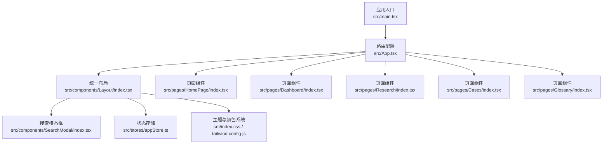
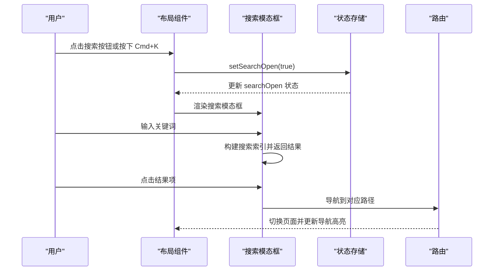
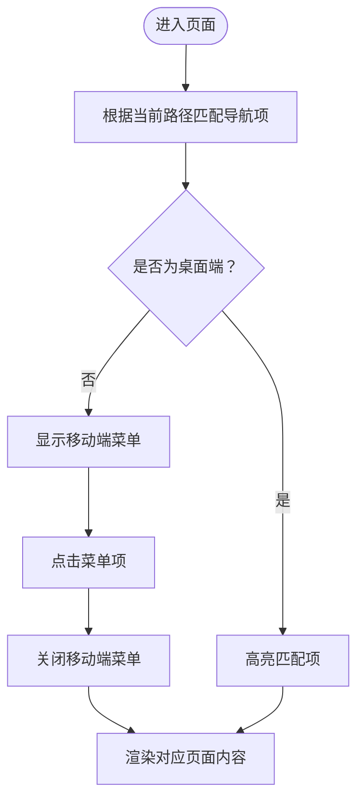
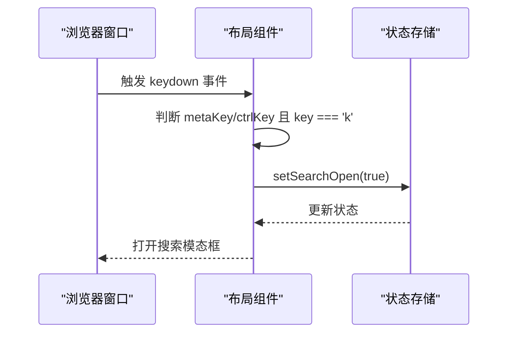
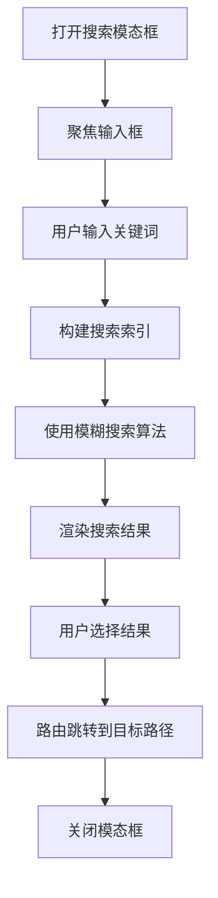
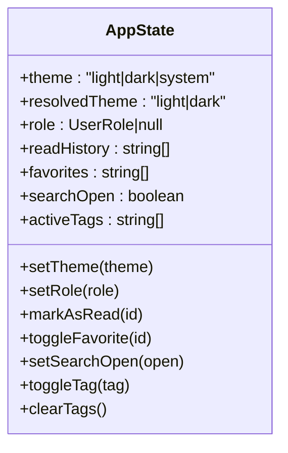
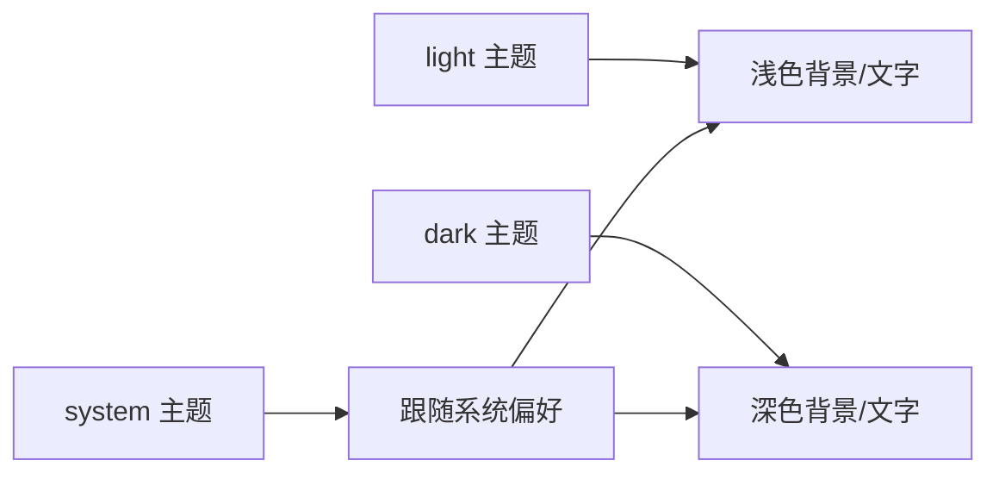
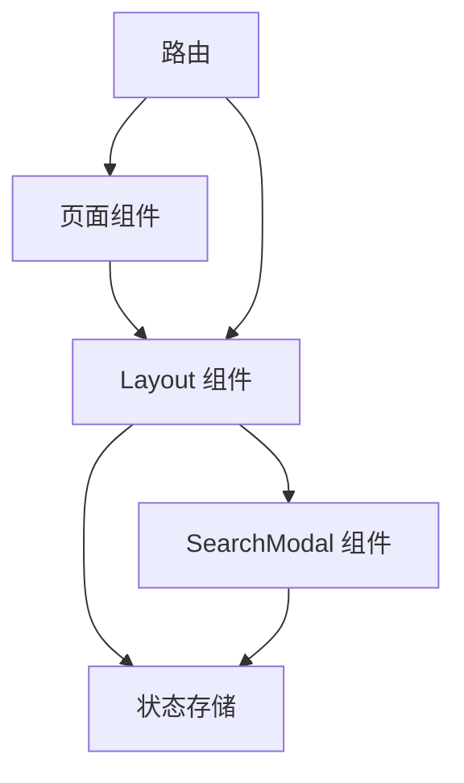

# 导航设计

<cite>
**本文档引用的文件**
- [src/App.tsx](file://src/App.tsx)
- [src/components/Layout/index.tsx](file://src/components/Layout/index.tsx)
- [src/components/SearchModal/index.tsx](file://src/components/SearchModal/index.tsx)
- [src/stores/appStore.ts](file://src/stores/appStore.ts)
- [src/main.tsx](file://src/main.tsx)
- [src/pages/HomePage/index.tsx](file://src/pages/HomePage/index.tsx)
- [src/pages/Dashboard/index.tsx](file://src/pages/Dashboard/index.tsx)
- [src/pages/Research/index.tsx](file://src/pages/Research/index.tsx)
- [src/pages/Cases/index.tsx](file://src/pages/Cases/index.tsx)
- [src/pages/Glossary/index.tsx](file://src/pages/Glossary/index.tsx)
- [src/index.css](file://src/index.css)
- [tailwind.config.js](file://tailwind.config.js)
- [package.json](file://package.json)
- [src/data/sections.ts](file://src/data/sections.ts)
- [src/types/index.ts](file://src/types/index.ts)
</cite>

## 目录
1. [引言](#引言)
2. [项目结构](#项目结构)
3. [核心组件](#核心组件)
4. [架构总览](#架构总览)
5. [详细组件分析](#详细组件分析)
6. [依赖关系分析](#依赖关系分析)
7. [性能考虑](#性能考虑)
8. [故障排除指南](#故障排除指南)
9. [结论](#结论)
10. [附录](#附录)

## 引言
本导航设计文档聚焦于网站的整体导航架构与用户体验设计，涵盖主导航菜单布局、响应式导航适配、搜索功能集成、快捷键支持（Cmd+K）、导航状态管理、组件可复用性、主题适配与无障碍访问支持，并提供导航扩展与自定义元素的开发指南。目标是帮助开发者与产品人员在不深入代码细节的情况下，也能清晰理解导航系统的实现思路与最佳实践。

## 项目结构
该应用采用基于路由的单页应用架构，顶层路由通过路由配置包裹统一布局组件，布局组件内包含顶部导航栏、移动端菜单、内容区域与页脚。搜索模态框作为全局组件挂载在应用根部，便于跨页面触发与关闭。

图表来源
- [src/main.tsx:1-11](file://src/main.tsx#L1-L11)
- [src/App.tsx:14-34](file://src/App.tsx#L14-L34)
- [src/components/Layout/index.tsx:22-173](file://src/components/Layout/index.tsx#L22-L173)
- [src/components/SearchModal/index.tsx:47-155](file://src/components/SearchModal/index.tsx#L47-L155)
- [src/stores/appStore.ts:35-92](file://src/stores/appStore.ts#L35-L92)
- [src/index.css:1-101](file://src/index.css#L1-L101)
- [tailwind.config.js:1-60](file://tailwind.config.js#L1-L60)

章节来源
- [src/main.tsx:1-11](file://src/main.tsx#L1-L11)
- [src/App.tsx:14-34](file://src/App.tsx#L14-L34)

## 核心组件
- 统一布局组件：负责主导航菜单、移动端菜单、主题切换、搜索触发、内容区域与页脚渲染。
- 搜索模态框：提供全局搜索体验，支持关键词高亮与快速跳转。
- 应用状态存储：集中管理主题、用户角色、阅读历史、收藏、搜索状态与标签筛选等。
- 页面组件：各业务页面（首页、数据看板、研究与阅读、转型案例、词典等），通过链接与导航保持一致性。

章节来源
- [src/components/Layout/index.tsx:22-173](file://src/components/Layout/index.tsx#L22-L173)
- [src/components/SearchModal/index.tsx:47-155](file://src/components/SearchModal/index.tsx#L47-L155)
- [src/stores/appStore.ts:35-92](file://src/stores/appStore.ts#L35-L92)

## 架构总览
导航系统围绕“统一布局 + 全局搜索 + 状态存储”的模式构建，确保跨页面一致的导航体验与高效的用户操作路径。

图表来源
- [src/components/Layout/index.tsx:27-37](file://src/components/Layout/index.tsx#L27-L37)
- [src/components/SearchModal/index.tsx:47-155](file://src/components/SearchModal/index.tsx#L47-L155)
- [src/stores/appStore.ts:69-71](file://src/stores/appStore.ts#L69-L71)

## 详细组件分析

### 主导航菜单与响应式适配
- 主导航菜单由统一布局组件维护，包含固定图标与标签，支持桌面端水平排列与移动端下拉菜单。
- 桌面端导航通过路径匹配判断当前激活项，移动端通过抽屉式动画展示，点击后自动收起。
- 响应式断点：桌面端为 lg（1024px），移动端为 lg 以下；移动端菜单使用动画库实现平滑展开/收起。

图表来源
- [src/components/Layout/index.tsx:65-85](file://src/components/Layout/index.tsx#L65-L85)
- [src/components/Layout/index.tsx:117-148](file://src/components/Layout/index.tsx#L117-L148)

章节来源
- [src/components/Layout/index.tsx:65-85](file://src/components/Layout/index.tsx#L65-L85)
- [src/components/Layout/index.tsx:117-148](file://src/components/Layout/index.tsx#L117-L148)

### 快捷键支持（Cmd+K）
- 在窗口级别监听键盘事件，当检测到 Cmd 或 Ctrl 键与 K 键同时按下时，阻止默认行为并打开搜索模态框。
- 该快捷键在所有页面均有效，提升高频用户的操作效率。

图表来源
- [src/components/Layout/index.tsx:27-37](file://src/components/Layout/index.tsx#L27-L37)
- [src/stores/appStore.ts:69-71](file://src/stores/appStore.ts#L69-L71)

章节来源
- [src/components/Layout/index.tsx:27-37](file://src/components/Layout/index.tsx#L27-L37)

### 搜索功能集成与实现
- 搜索模态框在应用根部渲染，通过状态存储控制开关。
- 搜索索引由多个数据模块合并构建，支持标题与内容的模糊匹配与排序。
- 结果列表包含来源板块、标题与片段预览，点击后直接导航至对应路径并关闭模态框。

图表来源
- [src/components/SearchModal/index.tsx:47-155](file://src/components/SearchModal/index.tsx#L47-L155)
- [src/stores/appStore.ts:69-71](file://src/stores/appStore.ts#L69-L71)

章节来源
- [src/components/SearchModal/index.tsx:47-155](file://src/components/SearchModal/index.tsx#L47-L155)

### 导航状态管理
- 使用状态存储集中管理主题、用户角色、阅读历史、收藏、搜索状态与标签筛选。
- 主题状态支持 light、dark、system 三种模式，系统模式会根据系统深色模式偏好动态切换。
- 搜索状态通过布尔值控制模态框显示/隐藏，避免重复渲染与内存占用。

图表来源
- [src/stores/appStore.ts:5-33](file://src/stores/appStore.ts#L5-L33)

章节来源
- [src/stores/appStore.ts:35-92](file://src/stores/appStore.ts#L35-L92)

### 主题适配与无障碍访问
- 主题适配：通过状态存储设置主题并在根节点添加/移除 dark 类名，Tailwind 的 dark 模式生效；颜色变量在基础层与组件层分别定义，确保一致的视觉反馈。
- 无障碍访问：导航使用语义化链接与按钮，移动端菜单通过动画控制可见性；搜索输入框具备焦点管理与键盘交互能力。

图表来源
- [src/stores/appStore.ts:39-47](file://src/stores/appStore.ts#L39-L47)
- [src/index.css:14-31](file://src/index.css#L14-L31)
- [tailwind.config.js:10-36](file://tailwind.config.js#L10-L36)

章节来源
- [src/stores/appStore.ts:39-47](file://src/stores/appStore.ts#L39-L47)
- [src/index.css:14-31](file://src/index.css#L14-L31)
- [tailwind.config.js:10-36](file://tailwind.config.js#L10-L36)

### 页面级导航与内容组织
- 首页提供“板块导览”卡片，通过链接直达各主要板块，形成二次导航补充。
- 数据看板、研究与阅读、转型案例、词典等页面各自承担内容领域的导航职责，配合面包屑（见后续章节）提升定位感。

章节来源
- [src/pages/HomePage/index.tsx:139-160](file://src/pages/HomePage/index.tsx#L139-L160)
- [src/pages/Dashboard/index.tsx:8-107](file://src/pages/Dashboard/index.tsx#L8-L107)
- [src/pages/Research/index.tsx:25-243](file://src/pages/Research/index.tsx#L25-L243)
- [src/pages/Cases/index.tsx:11-95](file://src/pages/Cases/index.tsx#L11-L95)
- [src/pages/Glossary/index.tsx:6-72](file://src/pages/Glossary/index.tsx#L6-L72)

## 依赖关系分析
- 组件依赖：布局组件依赖状态存储以管理主题与搜索状态；搜索模态框依赖状态存储控制显示；页面组件通过链接与导航保持一致性。
- 外部依赖：路由、动画、图标、搜索算法与状态管理库构成导航系统的技术支撑。

图表来源
- [src/components/Layout/index.tsx:22-173](file://src/components/Layout/index.tsx#L22-L173)
- [src/components/SearchModal/index.tsx:47-155](file://src/components/SearchModal/index.tsx#L47-L155)
- [src/stores/appStore.ts:35-92](file://src/stores/appStore.ts#L35-L92)
- [src/App.tsx:14-34](file://src/App.tsx#L14-L34)

章节来源
- [src/App.tsx:14-34](file://src/App.tsx#L14-L34)
- [package.json:12-21](file://package.json#L12-L21)

## 性能考虑
- 搜索性能：使用模糊搜索算法构建索引，限制结果数量，减少 DOM 渲染压力；输入防抖与空查询短路可进一步优化。
- 动画性能：移动端菜单使用轻量动画库，仅在必要时触发动画；内容区域切换采用过渡动画，避免重排重绘。
- 主题切换：通过根节点类名切换实现，避免频繁样式计算；系统主题监听仅在初始化时执行一次。

## 故障排除指南
- 快捷键无效：检查窗口级事件绑定是否正确，确认状态存储 setter 是否被调用。
- 搜索无结果：验证搜索索引构建逻辑与数据模块是否完整加载；检查阈值与匹配字段配置。
- 主题不生效：确认状态存储中的主题状态与根节点类名同步；检查 Tailwind 配置与 CSS 变量定义。
- 移动端菜单无法关闭：检查点击回调与状态更新逻辑，确保事件冒泡未被阻止。

章节来源
- [src/components/Layout/index.tsx:27-37](file://src/components/Layout/index.tsx#L27-L37)
- [src/components/SearchModal/index.tsx:47-155](file://src/components/SearchModal/index.tsx#L47-L155)
- [src/stores/appStore.ts:39-47](file://src/stores/appStore.ts#L39-L47)

## 结论
该导航系统通过统一布局、全局搜索与状态存储实现了跨页面一致的用户体验。主导航菜单简洁直观，响应式适配完善，快捷键与主题切换提升了效率与个性化。建议在后续迭代中引入面包屑导航、更精细的搜索过滤与标签筛选，以及更完善的无障碍访问支持，以进一步增强可用性与可访问性。

## 附录

### 面包屑导航实现建议
- 在布局组件中根据当前路径生成面包屑层级，结合页面标题与图标提升可读性。
- 对于深层嵌套页面，可考虑使用“省略号 + 下拉菜单”的形式展示长路径。

### 导航扩展指南
- 新增导航项：在布局组件的导航数组中添加新项，确保路径与页面路由一致。
- 自定义导航元素：通过插槽或条件渲染在导航栏中插入自定义组件（如徽章、通知等）。
- 导航分组：对于大量导航项，可按功能分组并通过下拉菜单或侧边栏呈现。

### 自定义导航元素开发方法
- 使用状态存储管理自定义状态（如折叠状态、选中项等）。
- 通过 Tailwind 定义统一的样式规范，确保与现有导航风格一致。
- 为自定义元素提供无障碍属性（如 aria-label、role 等），提升可访问性。

章节来源
- [src/components/Layout/index.tsx:11-20](file://src/components/Layout/index.tsx#L11-L20)
- [src/types/index.ts:183-191](file://src/types/index.ts#L183-L191)
- [src/data/sections.ts:3-11](file://src/data/sections.ts#L3-L11)