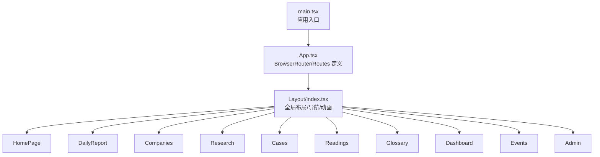
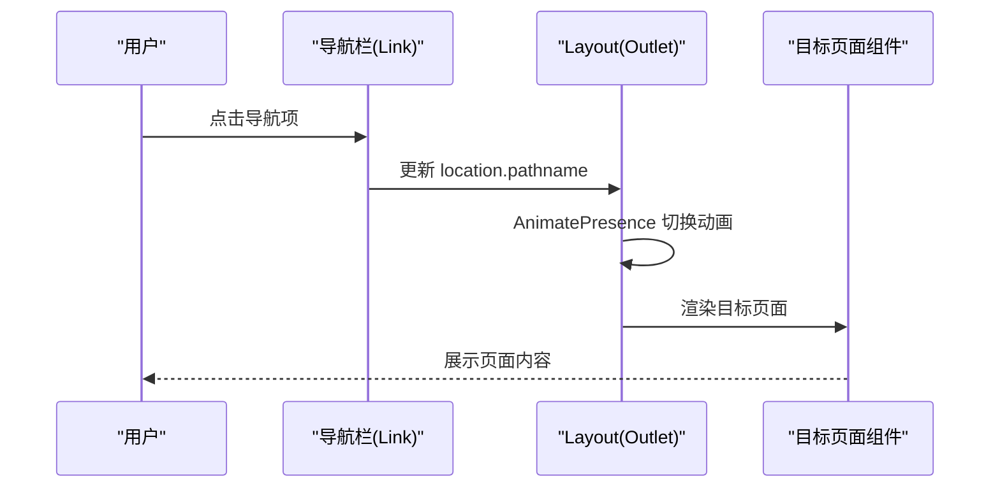

# 路由与导航

<cite>
**本文引用的文件**
- [src/App.tsx](file://src/App.tsx)
- [src/main.tsx](file://src/main.tsx)
- [src/components/Layout/index.tsx](file://src/components/Layout/index.tsx)
- [src/pages/HomePage/index.tsx](file://src/pages/HomePage/index.tsx)
- [src/pages/DailyReport/index.tsx](file://src/pages/DailyReport/index.tsx)
- [src/pages/Companies/index.tsx](file://src/pages/Companies/index.tsx)
- [src/pages/Research/index.tsx](file://src/pages/Research/index.tsx)
- [src/pages/Cases/index.tsx](file://src/pages/Cases/index.tsx)
- [src/pages/Readings/index.tsx](file://src/pages/Readings/index.tsx)
- [src/pages/Glossary/index.tsx](file://src/pages/Glossary/index.tsx)
- [src/pages/Events/index.tsx](file://src/pages/Events/index.tsx)
- [src/pages/Dashboard/index.tsx](file://src/pages/Dashboard/index.tsx)
- [src/pages/Admin/index.tsx](file://src/pages/Admin/index.tsx)
- [src/stores/appStore.ts](file://src/stores/appStore.ts)
- [package.json](file://package.json)
</cite>

## 目录
1. [简介](#简介)
2. [项目结构](#项目结构)
3. [核心组件](#核心组件)
4. [架构总览](#架构总览)
5. [详细组件分析](#详细组件分析)
6. [依赖分析](#依赖分析)
7. [性能考虑](#性能考虑)
8. [故障排查指南](#故障排查指南)
9. [结论](#结论)
10. [附录](#附录)

## 简介
本文件系统性梳理基于 React Router DOM 的客户端路由与导航实现，涵盖路由配置结构、页面组件映射关系、导航设计原则、路由参数与查询字符串处理方式、嵌套路设计、导航状态管理、面包屑生成思路、页面切换动画，以及路由扩展与新增页面的开发流程。目标是帮助开发者快速理解现有路由体系并安全地进行扩展。

## 项目结构
应用采用单页应用（SPA）架构，使用 React Router DOM 进行客户端路由，所有页面在根级路由下通过一个共享布局组件包裹，形成统一的导航与主题切换体验。

图表来源
- [src/main.tsx:1-11](file://src/main.tsx#L1-L11)
- [src/App.tsx:15-35](file://src/App.tsx#L15-L35)
- [src/components/Layout/index.tsx:23-175](file://src/components/Layout/index.tsx#L23-L175)

章节来源
- [src/main.tsx:1-11](file://src/main.tsx#L1-L11)
- [src/App.tsx:15-35](file://src/App.tsx#L15-L35)
- [src/components/Layout/index.tsx:23-175](file://src/components/Layout/index.tsx#L23-L175)

## 核心组件
- 应用入口与路由根
  - 应用通过入口文件挂载根组件，根组件内以 BrowserRouter 包裹，Routes 下声明所有页面路由。
- 布局与导航
  - 布局组件负责顶部导航栏、移动端菜单、主题切换、搜索快捷键、页面切换动画与主内容区域渲染。
- 页面组件
  - 各功能页面作为独立模块，按需引入并在路由中注册；部分页面支持日期选择、标签筛选、搜索过滤等交互。

章节来源
- [src/main.tsx:6-10](file://src/main.tsx#L6-L10)
- [src/App.tsx:15-35](file://src/App.tsx#L15-L35)
- [src/components/Layout/index.tsx:23-175](file://src/components/Layout/index.tsx#L23-L175)

## 架构总览
整体采用“根路由 + 嵌套路由”的模式：根路由仅负责顶层布局与页面切换动画，具体页面在布局内部通过 Outlet 渲染。导航栏根据当前路径高亮活动项，支持桌面端与移动端两种交互形态。

图表来源
- [src/components/Layout/index.tsx:66-86](file://src/components/Layout/index.tsx#L66-L86)
- [src/components/Layout/index.tsx:154-165](file://src/components/Layout/index.tsx#L154-L165)

## 详细组件分析

### 路由配置与页面映射
- 根路由与嵌套路由
  - 根组件使用 BrowserRouter 包裹，Routes 内部以 Layout 为父级容器，所有页面路由均在 Layout 下声明。
  - 路由路径与页面组件一一对应，便于维护与扩展。
- 路由表（基于现有实现）
  - 首页: /
  - 每日日报: /daily
  - 公司追踪: /companies
  - 研究报告: /research
  - 转型案例: /cases
  - 延伸阅读: /readings
  - HR 词典: /glossary
  - 数据看板: /dashboard
  - 行业议程: /events
  - 管理员界面: /admin

章节来源
- [src/App.tsx:19-31](file://src/App.tsx#L19-L31)

### 导航设计原则
- 统一布局
  - 所有页面共享同一布局，确保一致的导航、主题与交互体验。
- 活动态高亮
  - 导航项根据当前路径或前缀匹配进行高亮，移动端与桌面端逻辑一致。
- 主题与搜索
  - 支持明/暗/跟随系统三种主题模式；全局搜索可通过快捷键打开。
- 动画与过渡
  - 使用页面级切换动画提升视觉连贯性。

章节来源
- [src/components/Layout/index.tsx:11-21](file://src/components/Layout/index.tsx#L11-L21)
- [src/components/Layout/index.tsx:66-86](file://src/components/Layout/index.tsx#L66-L86)
- [src/components/Layout/index.tsx:118-149](file://src/components/Layout/index.tsx#L118-L149)
- [src/components/Layout/index.tsx:154-165](file://src/components/Layout/index.tsx#L154-L165)

### 页面组件与路由行为

#### 首页（/）
- 功能要点
  - 展示每日信号摘要、行动速查、板块导览与角色推荐路径。
  - 使用 Link 组件跳转至各板块，支持 framer-motion 动画。
- 路由行为
  - 作为根路由，无需额外参数；可结合用户角色状态进行个性化展示。

章节来源
- [src/pages/HomePage/index.tsx:78-84](file://src/pages/HomePage/index.tsx#L78-L84)
- [src/pages/HomePage/index.tsx:132-146](file://src/pages/HomePage/index.tsx#L132-L146)
- [src/pages/HomePage/index.tsx:155-178](file://src/pages/HomePage/index.tsx#L155-L178)

#### 每日日报（/daily）
- 功能要点
  - 支持按日期筛选日报列表；每条日报包含信号卡片与行动速查表格。
- 路由行为
  - 无动态路由参数；日期筛选通过本地状态实现。

章节来源
- [src/pages/DailyReport/index.tsx:21-25](file://src/pages/DailyReport/index.tsx#L21-L25)
- [src/pages/DailyReport/index.tsx:36-50](file://src/pages/DailyReport/index.tsx#L36-L50)

#### 公司追踪（/companies）
- 功能要点
  - 展示公司与关键人物的动态更新，支持标签分类。
- 路由行为
  - 无动态路由参数。

章节来源
- [src/pages/Companies/index.tsx:13-69](file://src/pages/Companies/index.tsx#L13-L69)

#### 研究报告（/research）
- 功能要点
  - 展示研究论文摘要与核心发现，支持展开/折叠详情。
- 路由行为
  - 无动态路由参数。

章节来源
- [src/pages/Research/index.tsx:12-92](file://src/pages/Research/index.tsx#L12-L92)

#### 转型案例（/cases）
- 功能要点
  - 展示 AI 转型案例的成功/失败/混合结果，分组呈现“做对了/做错了”与 HR 启示。
- 路由行为
  - 无动态路由参数。

章节来源
- [src/pages/Cases/index.tsx:11-96](file://src/pages/Cases/index.tsx#L11-L96)

#### 延伸阅读（/readings）
- 功能要点
  - 展示延伸阅读条目与关键摘录，支持标签分类。
- 路由行为
  - 无动态路由参数。

章节来源
- [src/pages/Readings/index.tsx:5-56](file://src/pages/Readings/index.tsx#L5-L56)

#### HR 词典（/glossary）
- 功能要点
  - 提供术语搜索与展示，支持中英文检索。
- 路由行为
  - 无动态路由参数；搜索通过本地状态实现。

章节来源
- [src/pages/Glossary/index.tsx:6-73](file://src/pages/Glossary/index.tsx#L6-L73)

#### 数据看板（/dashboard）
- 功能要点
  - 展示关键指标与趋势图，使用 Recharts 进行可视化。
- 路由行为
  - 无动态路由参数。

章节来源
- [src/pages/Dashboard/index.tsx:6-82](file://src/pages/Dashboard/index.tsx#L6-L82)

#### 行业议程（/events）
- 功能要点
  - 展示会议日历与倒计时，区分过去/即将/未来事件。
- 路由行为
  - 无动态路由参数。

章节来源
- [src/pages/Events/index.tsx:18-94](file://src/pages/Events/index.tsx#L18-L94)

#### 管理员界面（/admin）
- 功能要点
  - 提供概览、内容预览与质量审计三个标签页，展示管道状态与质量检查。
- 路由行为
  - 无动态路由参数；标签页切换通过本地状态实现。

章节来源
- [src/pages/Admin/index.tsx:6-143](file://src/pages/Admin/index.tsx#L6-L143)

### 路由参数传递、查询字符串处理与嵌套路由
- 路由参数传递
  - 当前路由未使用动态段（如 :id），如需扩展可参考标准 React Router 动态路由语法添加。
- 查询字符串处理
  - 当前页面未显式解析查询参数；如需支持，可在页面组件中使用浏览器原生 URLSearchParams 或第三方库（如 react-router-dom 的 useSearchParams）进行读取与同步。
- 嵌套路由设计
  - 当前采用“根布局 + 平铺路由”的结构；如需更复杂的层级（例如详情页子路由），可在目标页面内再次使用 Routes/Route 实现子路由。

章节来源
- [src/App.tsx:19-31](file://src/App.tsx#L19-L31)

### 导航状态管理、面包屑生成与页面切换动画
- 导航状态管理
  - 主题、搜索、标签筛选、阅读历史、收藏等状态通过 Zustand 管理，持久化存储在本地。
  - 导航高亮依赖 useLocation 与路径匹配逻辑。
- 面包屑生成
  - 当前未实现自动面包屑；可基于路径与页面标题构建通用面包屑组件，按需注入到各页面。
- 页面切换动画
  - 使用 AnimatePresence 与 motion 对页面进行淡入/滑动过渡，提升用户体验。

章节来源
- [src/stores/appStore.ts:35-92](file://src/stores/appStore.ts#L35-L92)
- [src/components/Layout/index.tsx:24-46](file://src/components/Layout/index.tsx#L24-L46)
- [src/components/Layout/index.tsx:154-165](file://src/components/Layout/index.tsx#L154-L165)

### 新增页面的开发流程与扩展指南
- 步骤
  - 在 pages 目录下创建新页面组件。
  - 在 App 路由中注册新路由，将其置于 Layout 容器内。
  - 在 Layout 的导航列表中添加对应导航项。
  - 如需参数或查询处理，在页面内使用 React Router 的参数/查询工具。
  - 如需子路由，可在页面内再次声明 Routes/Route。
  - 如需跨页面状态，通过 Zustand store 管理并持久化。
- 最佳实践
  - 保持路由命名清晰、语义化。
  - 统一页面切换动画风格。
  - 为复杂页面提供骨架屏或加载态，优化首屏体验。
  - 为关键交互（如搜索、筛选）提供键盘快捷键支持。

章节来源
- [src/App.tsx:19-31](file://src/App.tsx#L19-L31)
- [src/components/Layout/index.tsx:11-21](file://src/components/Layout/index.tsx#L11-L21)
- [src/stores/appStore.ts:35-92](file://src/stores/appStore.ts#L35-L92)

## 依赖分析
- 路由与动画
  - react-router-dom：提供 BrowserRouter、Routes、Route、Outlet、Link 等能力。
  - framer-motion：提供页面切换动画与组件动效。
- 图表与可视化
  - recharts：用于数据看板的折线图展示。
- 状态管理
  - zustand：轻量级状态管理，支持持久化中间件。
- UI 与图标
  - lucide-react：提供统一的图标库。
- 搜索
  - fuse.js：可用于前端模糊搜索（当前词典页面使用本地过滤）。

章节来源
- [package.json:12-22](file://package.json#L12-L22)

## 性能考虑
- 路由切换性能
  - 使用 AnimatePresence 与轻量动画，避免过度复杂动画导致卡顿。
- 资源加载
  - 将大型图表组件按需加载，减少首屏体积。
- 状态持久化
  - 合理裁剪持久化字段，避免存储过多数据影响启动速度。
- 搜索与筛选
  - 对大列表的本地搜索建议使用索引或分页策略，避免阻塞主线程。

## 故障排查指南
- 路由不生效或空白页
  - 检查是否正确包裹在 BrowserRouter 与 Routes 内。
  - 确认页面组件导入路径与导出名称一致。
- 导航高亮异常
  - 检查导航路径与当前路径匹配逻辑，注意前缀匹配场景。
- 动画不触发
  - 确认 key 值随 pathname 变化而变化，且 AnimatePresence 与 motion 使用正确。
- 主题切换无效
  - 检查主题设置函数是否正确写入 DOM 类名，确认持久化存储正常。
- 搜索无法打开
  - 检查快捷键监听是否绑定到 window，确认 store 状态更新。

章节来源
- [src/App.tsx:17-35](file://src/App.tsx#L17-L35)
- [src/components/Layout/index.tsx:29-38](file://src/components/Layout/index.tsx#L29-L38)
- [src/components/Layout/index.tsx:48-51](file://src/components/Layout/index.tsx#L48-L51)
- [src/stores/appStore.ts:39-47](file://src/stores/appStore.ts#L39-L47)

## 结论
该路由与导航体系以简洁清晰为核心：根级布局统一承载导航与动画，页面路由平铺管理，状态通过轻量状态库集中管理。当前未启用动态路由参数与查询解析，但具备良好的扩展空间。建议后续在新增页面时遵循统一的命名规范与交互风格，并逐步引入面包屑、参数化与查询解析等能力，以进一步完善用户体验与可维护性。

## 附录
- 术语与概念
  - 路由参数：用于标识资源的动态段（如 /users/:id）。
  - 查询字符串：URL 中 ? 后的键值对（如 ?q=xxx&tab=home）。
  - 嵌套路由：在页面内部再次声明 Routes/Route，实现子页面导航。
- 参考实现位置
  - 路由注册与布局包裹：[src/App.tsx:19-31](file://src/App.tsx#L19-L31)
  - 导航与动画：[src/components/Layout/index.tsx:66-86](file://src/components/Layout/index.tsx#L66-L86), [src/components/Layout/index.tsx:154-165](file://src/components/Layout/index.tsx#L154-L165)
  - 状态管理：[src/stores/appStore.ts:35-92](file://src/stores/appStore.ts#L35-L92)