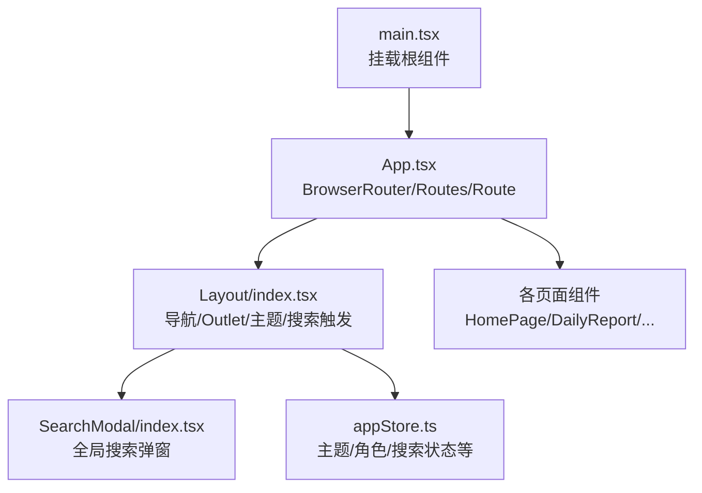
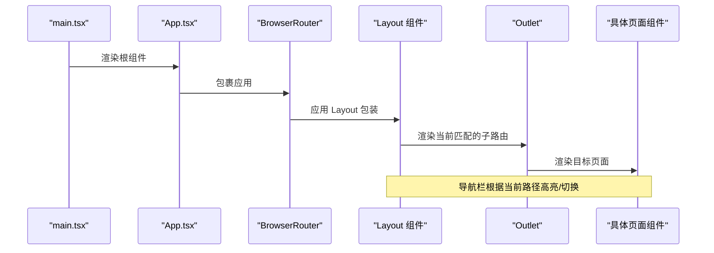
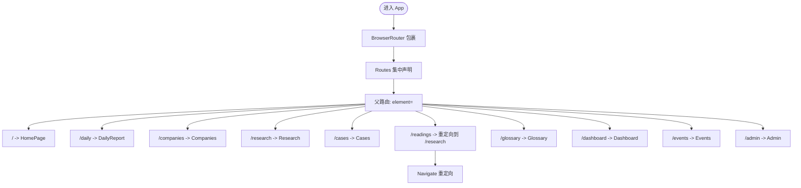
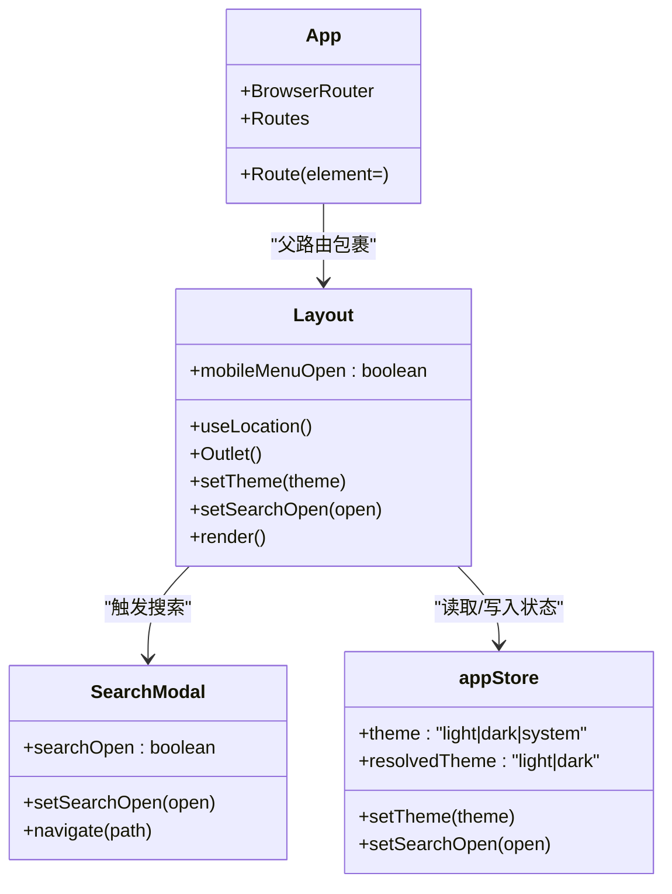
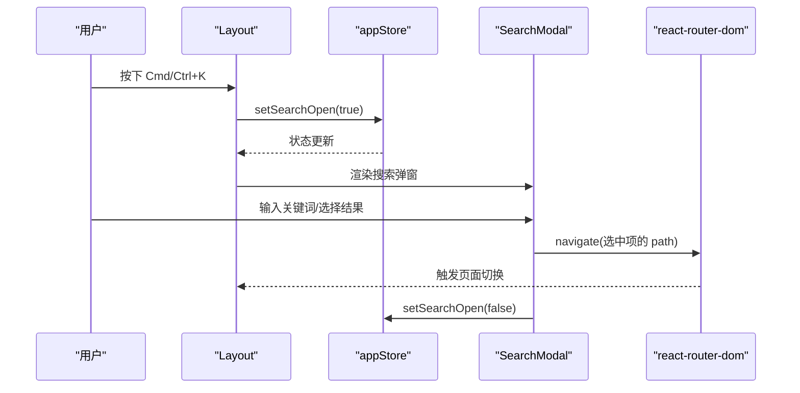
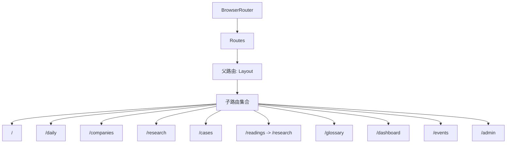
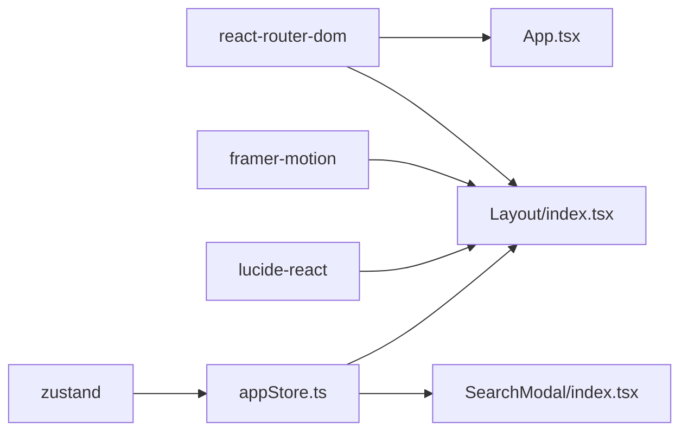

# 路由配置

<cite>
**本文引用的文件**
- [src/App.tsx](file://src/App.tsx)
- [src/main.tsx](file://src/main.tsx)
- [src/components/Layout/index.tsx](file://src/components/Layout/index.tsx)
- [src/components/SearchModal/index.tsx](file://src/components/SearchModal/index.tsx)
- [src/stores/appStore.ts](file://src/stores/appStore.ts)
- [src/data/sections.ts](file://src/data/sections.ts)
- [package.json](file://package.json)
</cite>

## 目录
1. [简介](#简介)
2. [项目结构](#项目结构)
3. [核心组件](#核心组件)
4. [架构总览](#架构总览)
5. [详细组件分析](#详细组件分析)
6. [依赖分析](#依赖分析)
7. [性能考虑](#性能考虑)
8. [故障排查指南](#故障排查指南)
9. [结论](#结论)
10. [附录：最佳实践与扩展指南](#附录最佳实践与扩展指南)

## 简介
本文件围绕基于 React Router DOM 的前端路由系统进行深入解析，重点说明以下方面：
- BrowserRouter 的配置与作用域
- Routes 与 Route 的使用方式与路径映射
- 嵌套路由（Layout 包裹）的设计模式与实现
- Layout 组件作为路由包装器的作用与职责
- 主路由下统一管理页面组件的策略
- 路由路径定义规则、组件映射关系与路由层级结构
- 路由配置的最佳实践与扩展建议

## 项目结构
该应用采用“单页应用（SPA）”架构，根组件通过 BrowserRouter 提供路由上下文，所有页面组件在 Routes 中以 Route 列表的形式声明，并由 Layout 组件作为公共外壳包裹，形成统一的导航与布局。

图表来源
- [src/main.tsx:1-11](file://src/main.tsx#L1-L11)
- [src/App.tsx:15-35](file://src/App.tsx#L15-L35)
- [src/components/Layout/index.tsx:23-173](file://src/components/Layout/index.tsx#L23-L173)
- [src/components/SearchModal/index.tsx:1-85](file://src/components/SearchModal/index.tsx#L1-L85)
- [src/stores/appStore.ts:1-93](file://src/stores/appStore.ts#L1-L93)

章节来源
- [src/main.tsx:1-11](file://src/main.tsx#L1-L11)
- [src/App.tsx:15-35](file://src/App.tsx#L15-L35)

## 核心组件
- BrowserRouter：为整个应用提供路由上下文，确保 Link、useNavigate、useLocation 等 API 正常工作。
- Routes：集中声明所有路由规则，按顺序匹配首个命中者。
- Route：将路径与组件进行映射；支持嵌套路由（通过父 Route 的 element 包裹子 Route）。
- Layout：作为路由包装器，提供统一的头部导航、移动端菜单、内容区域动画切换与页脚；内部使用 Outlet 渲染当前匹配的子路由组件。
- 页面组件：每个功能页面对应一个独立组件，如 HomePage、DailyReport、Companies、Research、Cases、Glossary、Dashboard、Events、Admin。

章节来源
- [src/App.tsx:15-35](file://src/App.tsx#L15-L35)
- [src/components/Layout/index.tsx:23-173](file://src/components/Layout/index.tsx#L23-L173)

## 架构总览
下图展示了从入口到页面渲染的关键流程，包括 BrowserRouter 提供上下文、Layout 包裹、Outlet 渲染、以及搜索快捷键与状态联动。

图表来源
- [src/main.tsx:6-10](file://src/main.tsx#L6-L10)
- [src/App.tsx:17-32](file://src/App.tsx#L17-L32)
- [src/components/Layout/index.tsx:152-164](file://src/components/Layout/index.tsx#L152-L164)

## 详细组件分析

### 路由配置与路径映射
- 根组件 App 使用 BrowserRouter 包裹整个应用。
- 在 Routes 下声明一组 Route，其中一条 Route 以 Layout 作为 element，形成“父路由”，其下的所有子 Route 均在 Layout 内部渲染。
- 路径与组件映射如下（部分）：
  - "/" -> HomePage
  - "/daily" -> DailyReportPage
  - "/companies" -> CompaniesPage
  - "/research" -> ResearchPage
  - "/cases" -> CasesPage
  - "/readings" -> 重定向至 "/research"
  - "/glossary" -> GlossaryPage
  - "/dashboard" -> DashboardPage
  - "/events" -> EventsPage
  - "/admin" -> AdminPage

图表来源
- [src/App.tsx:19-31](file://src/App.tsx#L19-L31)

章节来源
- [src/App.tsx:15-35](file://src/App.tsx#L15-L35)

### Layout 作为路由包装器
- 职责与能力
  - 统一导航栏：桌面端与移动端导航，根据当前路径高亮对应菜单项。
  - 内容区动画：通过 key={location.pathname} 与 AnimatePresence/motion 实现页面切换动画。
  - 主题控制：监听主题状态并设置 html 根元素的 dark 类名。
  - 快捷键：Cmd/Ctrl+K 打开全局搜索弹窗。
  - Outlet：渲染当前匹配的子路由组件。
- 设计要点
  - 使用 useLocation 获取当前路径，结合导航项列表动态计算激活态。
  - 使用 Outlet 作为子路由占位符，实现嵌套路由渲染。
  - 通过 useAppStore 管理主题、搜索弹窗等跨组件状态。

图表来源
- [src/components/Layout/index.tsx:23-173](file://src/components/Layout/index.tsx#L23-L173)
- [src/App.tsx:17-32](file://src/App.tsx#L17-L32)
- [src/components/SearchModal/index.tsx:69-72](file://src/components/SearchModal/index.tsx#L69-L72)
- [src/stores/appStore.ts:35-92](file://src/stores/appStore.ts#L35-L92)

章节来源
- [src/components/Layout/index.tsx:23-173](file://src/components/Layout/index.tsx#L23-L173)
- [src/stores/appStore.ts:1-93](file://src/stores/appStore.ts#L1-L93)

### 搜索与导航联动
- 快捷键 Cmd/Ctrl+K 触发打开搜索弹窗。
- 搜索弹窗内部使用 Fuse 进行全文检索，返回结果后点击可调用 navigate 跳转到目标路径。
- Layout 通过 useAppStore 控制搜索弹窗的开关状态。

图表来源
- [src/components/Layout/index.tsx:28-38](file://src/components/Layout/index.tsx#L28-L38)
- [src/components/SearchModal/index.tsx:61-72](file://src/components/SearchModal/index.tsx#L61-L72)
- [src/stores/appStore.ts:69-71](file://src/stores/appStore.ts#L69-L71)

章节来源
- [src/components/Layout/index.tsx:28-38](file://src/components/Layout/index.tsx#L28-L38)
- [src/components/SearchModal/index.tsx:61-72](file://src/components/SearchModal/index.tsx#L61-L72)
- [src/stores/appStore.ts:69-71](file://src/stores/appStore.ts#L69-L71)

### 路由层级结构与导航设计
- 层级结构
  - 根层：BrowserRouter
  - 一级：Routes
  - 二级：父路由（element=<Layout/>）
  - 三级：多个子路由（各页面组件）
- 导航设计
  - 导航项来源于静态列表，包含路径、图标与标签。
  - 激活态逻辑：精确匹配或前缀匹配（除首页外）。
  - 移动端下拉菜单与桌面端导航保持一致行为。

图表来源
- [src/App.tsx:19-31](file://src/App.tsx#L19-L31)
- [src/components/Layout/index.tsx:11-21](file://src/components/Layout/index.tsx#L11-L21)
- [src/components/Layout/index.tsx:68-69](file://src/components/Layout/index.tsx#L68-L69)

章节来源
- [src/App.tsx:19-31](file://src/App.tsx#L19-L31)
- [src/components/Layout/index.tsx:11-21](file://src/components/Layout/index.tsx#L11-L21)
- [src/components/Layout/index.tsx:68-69](file://src/components/Layout/index.tsx#L68-L69)

## 依赖分析
- react-router-dom：提供 BrowserRouter、Routes、Route、Outlet、Link、useNavigate、useLocation 等核心 API。
- framer-motion：用于页面切换动画与菜单展开/收起动画。
- lucide-react：图标库，配合导航与界面元素。
- zustand：全局状态管理，存储主题、角色、搜索状态等。

图表来源
- [package.json:12-22](file://package.json#L12-L22)
- [src/App.tsx:1-1](file://src/App.tsx#L1-L1)
- [src/components/Layout/index.tsx:1-1](file://src/components/Layout/index.tsx#L1-L1)
- [src/stores/appStore.ts:1-1](file://src/stores/appStore.ts#L1-L1)

章节来源
- [package.json:12-22](file://package.json#L12-L22)

## 性能考虑
- 路由切换动画：通过 AnimatePresence 与 key={location.pathname} 控制页面过渡，避免不必要的重渲染。
- 主题切换：仅在主题变化时更新根元素类名，减少样式抖动。
- 搜索弹窗：按需渲染，输入聚焦与关闭时清理状态，降低内存占用。
- 嵌套路由：统一由 Layout 渲染子路由，减少重复逻辑与条件分支。

## 故障排查指南
- 路由不生效
  - 确认根组件已包裹 BrowserRouter。
  - 检查 Routes 是否正确声明，且父路由 element 指向 Layout。
- 导航高亮异常
  - 检查导航项路径是否与当前路径完全一致或前缀匹配。
  - 确保 Layout 使用 useLocation 获取最新路径。
- 页面切换无动画
  - 确认 Outlet 外层存在 AnimatePresence 与 key={location.pathname}。
- 搜索快捷键无效
  - 确认 Cmd/Ctrl+K 事件绑定未被阻止。
  - 检查 appStore 中 setSearchOpen 的状态更新是否生效。

章节来源
- [src/App.tsx:17-32](file://src/App.tsx#L17-L32)
- [src/components/Layout/index.tsx:28-38](file://src/components/Layout/index.tsx#L28-L38)
- [src/components/Layout/index.tsx:152-164](file://src/components/Layout/index.tsx#L152-L164)
- [src/stores/appStore.ts:69-71](file://src/stores/appStore.ts#L69-L71)

## 结论
该路由系统以 BrowserRouter 为核心，通过 Routes 与 Route 实现清晰的路径映射，并以 Layout 作为统一的路由包装器，承担导航、主题、搜索与内容区动画等职责。嵌套路由设计使所有页面共享一致的布局与交互体验，同时为后续扩展（如权限控制、懒加载、嵌套子路由）提供了良好的基础。

## 附录：最佳实践与扩展指南
- 路径定义规则
  - 使用语义化路径，尽量与业务模块一一对应。
  - 首页路径为 “/”，其余路径以斜杠开头。
  - 对于别名或迁移场景，使用 Navigate 进行重定向。
- 组件映射关系
  - 父路由统一包裹 Layout，子路由负责具体页面渲染。
  - 页面组件应尽量无状态或轻状态，复杂状态交由全局 store 管理。
- 路由层级结构
  - 根层：BrowserRouter
  - 一级：Routes
  - 二级：父路由（element=<Layout/>）
  - 三级：子路由（页面组件）
- 扩展建议
  - 权限控制：在父路由层增加鉴权逻辑，未授权用户重定向至登录或提示页。
  - 懒加载：为大型页面组件引入 React.lazy 与 Suspense，优化首屏加载。
  - 嵌套子路由：在 Layout 下进一步拆分子路由组，提升代码组织性。
  - 参数化路由：为详情页、分页、筛选等场景引入动态参数与查询字符串处理。
  - 错误边界：结合 react-error-boundary 在路由层捕获渲染错误。
  - 国际化：在导航与文案处预留国际化键值，便于多语言扩展。