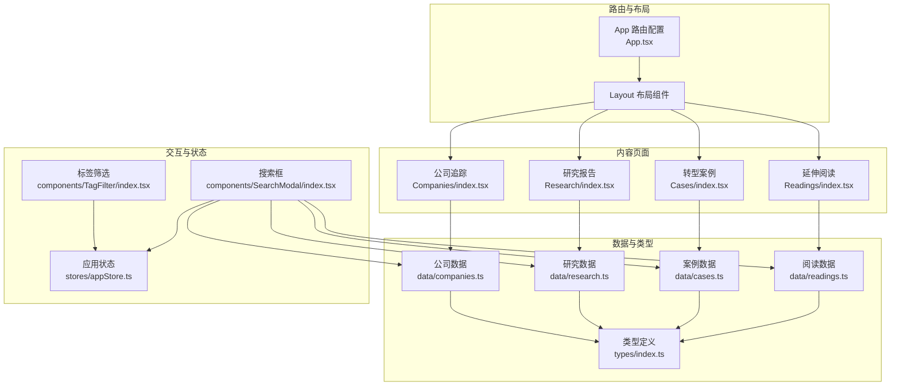
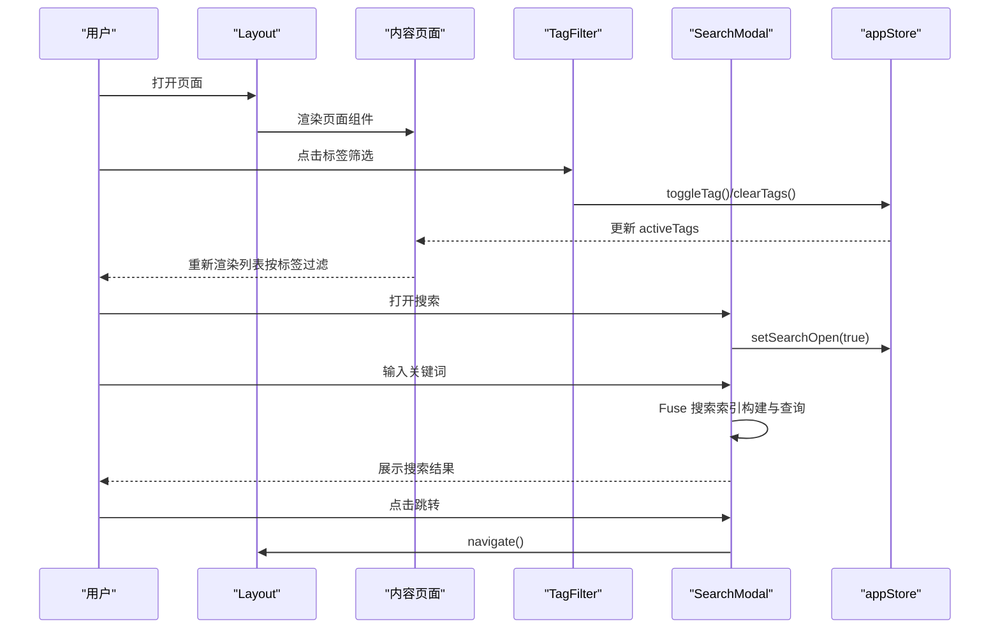
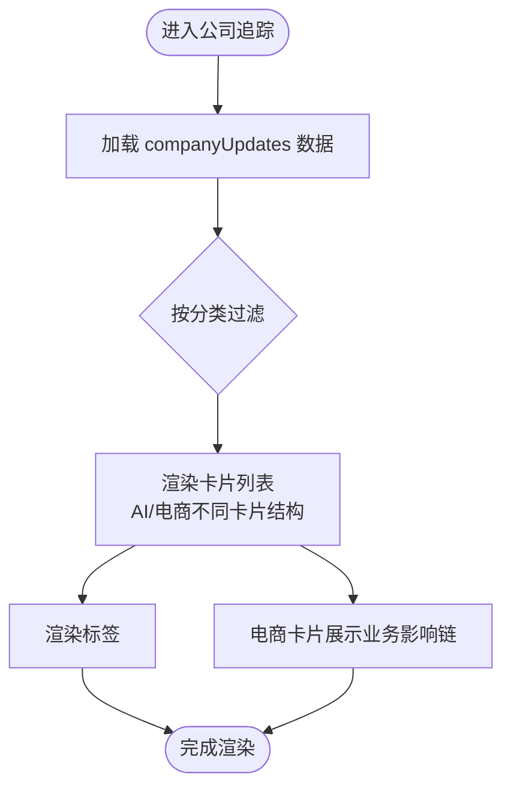
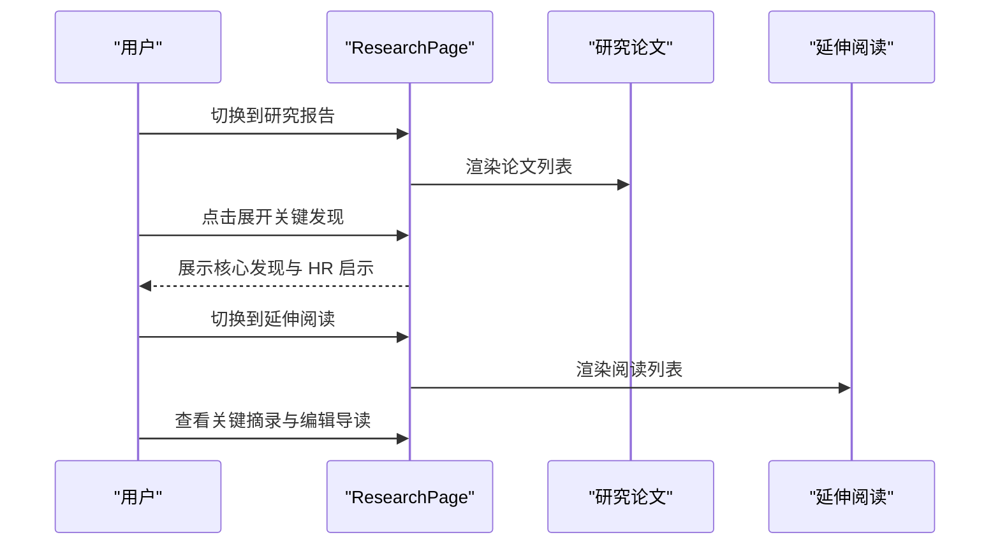
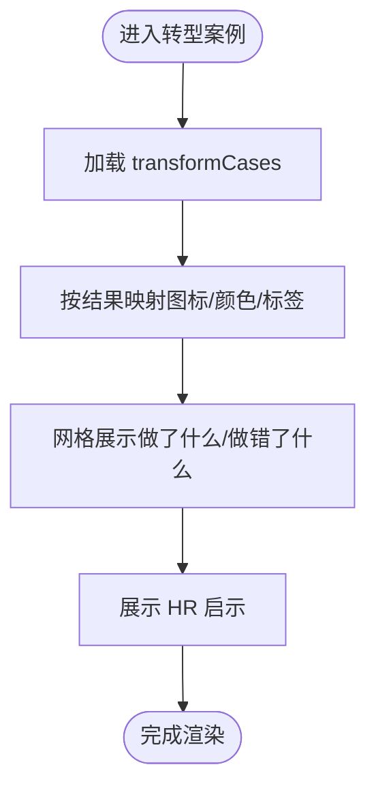
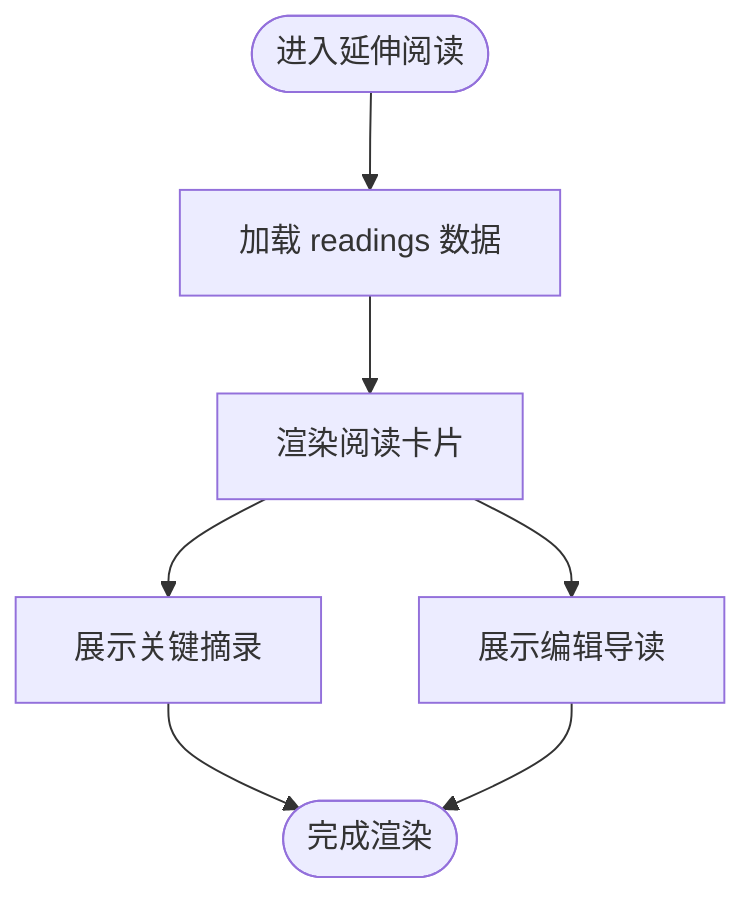
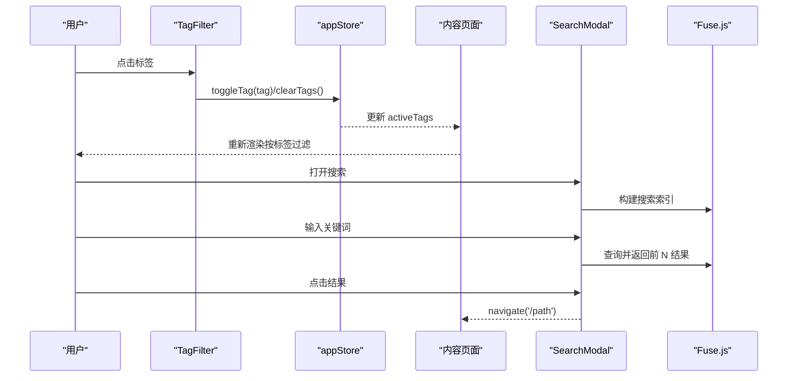
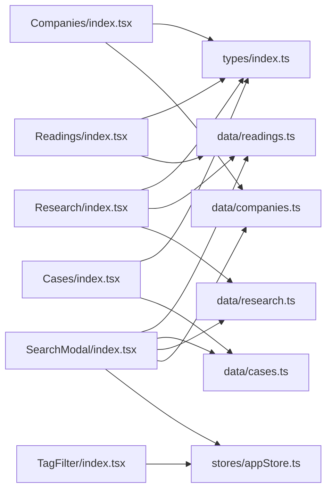

# 内容页面

<cite>
**本文档引用的文件**
- [src/pages/Companies/index.tsx](file://src/pages/Companies/index.tsx)
- [src/pages/Research/index.tsx](file://src/pages/Research/index.tsx)
- [src/pages/Cases/index.tsx](file://src/pages/Cases/index.tsx)
- [src/pages/Readings/index.tsx](file://src/pages/Readings/index.tsx)
- [src/data/companies.ts](file://src/data/companies.ts)
- [src/data/research.ts](file://src/data/research.ts)
- [src/data/cases.ts](file://src/data/cases.ts)
- [src/data/readings.ts](file://src/data/readings.ts)
- [src/types/index.ts](file://src/types/index.ts)
- [src/components/TagFilter/index.tsx](file://src/components/TagFilter/index.tsx)
- [src/components/SearchModal/index.tsx](file://src/components/SearchModal/index.tsx)
- [src/stores/appStore.ts](file://src/stores/appStore.ts)
- [src/App.tsx](file://src/App.tsx)
</cite>

## 目录
1. [简介](#简介)
2. [项目结构](#项目结构)
3. [核心组件](#核心组件)
4. [架构总览](#架构总览)
5. [详细组件分析](#详细组件分析)
6. [依赖分析](#依赖分析)
7. [性能考量](#性能考量)
8. [故障排查指南](#故障排查指南)
9. [结论](#结论)
10. [附录](#附录)

## 简介
本文件面向内容页面组件的综合文档，聚焦以下四类内容展示页面：
- 公司追踪：展示 AI 原生公司与电商竞争对手的动态，支持按类别切换与标签过滤。
- 研究报告：展示学术/咨询/HR媒体等来源的研究论文与延伸阅读，支持展开/折叠查看关键发现与摘录。
- 转型案例：展示 AI 转型的成功/失败/混合案例，提供“做了什么”“做错了什么”的对比与 HR 启示。
- 延伸阅读：展示精选英文原文、中文翻译与编辑导读，便于快速浏览与检索。

文档将从数据结构、筛选机制、标签分类系统、搜索集成、列表渲染与分页策略、详情展示、收藏功能、开发模板、数据模型映射、SEO 优化策略以及页面间关联与导航关系等方面进行深入解析，并提供可视化图表辅助理解。

## 项目结构
内容页面位于 pages 目录，数据来源于 data 目录，类型定义在 types 目录，全局状态通过 Zustand store 管理，搜索与标签筛选通过独立组件实现。

**图表来源**
- [src/App.tsx:14-34](file://src/App.tsx#L14-L34)
- [src/pages/Companies/index.tsx:25-97](file://src/pages/Companies/index.tsx#L25-L97)
- [src/pages/Research/index.tsx:25-243](file://src/pages/Research/index.tsx#L25-L243)
- [src/pages/Cases/index.tsx:11-95](file://src/pages/Cases/index.tsx#L11-L95)
- [src/pages/Readings/index.tsx:5-55](file://src/pages/Readings/index.tsx#L5-L55)
- [src/data/companies.ts:1-161](file://src/data/companies.ts#L1-L161)
- [src/data/research.ts:1-56](file://src/data/research.ts#L1-L56)
- [src/data/cases.ts:1-63](file://src/data/cases.ts#L1-L63)
- [src/data/readings.ts:1-133](file://src/data/readings.ts#L1-L133)
- [src/types/index.ts:1-218](file://src/types/index.ts#L1-L218)
- [src/components/TagFilter/index.tsx:1-49](file://src/components/TagFilter/index.tsx#L1-L49)
- [src/components/SearchModal/index.tsx:1-156](file://src/components/SearchModal/index.tsx#L1-L156)
- [src/stores/appStore.ts:1-93](file://src/stores/appStore.ts#L1-L93)

**章节来源**
- [src/App.tsx:14-34](file://src/App.tsx#L14-L34)

## 核心组件
- 公司追踪页面：支持 AI 原生公司与电商竞争对手两类 tab 切换，卡片式列表渲染，按标签展示业务影响链。
- 研究报告页面：支持研究报告与延伸阅读两部分 tab 切换，支持展开/折叠查看关键发现与摘录，支持来源类型标签。
- 转型案例页面：按成功/失败/混合三种结果展示案例，提供“做了什么/做错了什么”与 HR 启示。
- 延伸阅读页面：简洁列表展示阅读条目，包含关键摘录与编辑导读。

**章节来源**
- [src/pages/Companies/index.tsx:25-97](file://src/pages/Companies/index.tsx#L25-L97)
- [src/pages/Research/index.tsx:25-243](file://src/pages/Research/index.tsx#L25-L243)
- [src/pages/Cases/index.tsx:11-95](file://src/pages/Cases/index.tsx#L11-L95)
- [src/pages/Readings/index.tsx:5-55](file://src/pages/Readings/index.tsx#L5-L55)

## 架构总览
内容页面采用“页面组件 + 数据源 + 类型定义 + 状态与交互组件”的分层架构：
- 页面组件负责 UI 结构与交互控制（tab、展开/折叠、动画渲染）。
- 数据源提供静态数据数组，类型定义统一字段结构。
- 状态与交互组件（标签筛选、搜索）通过全局 store 管理用户行为与筛选条件。
- 路由层统一挂载布局与页面，SearchModal 作为全局搜索入口。

**图表来源**
- [src/components/TagFilter/index.tsx:1-49](file://src/components/TagFilter/index.tsx#L1-L49)
- [src/components/SearchModal/index.tsx:1-156](file://src/components/SearchModal/index.tsx#L1-L156)
- [src/stores/appStore.ts:1-93](file://src/stores/appStore.ts#L1-L93)
- [src/App.tsx:14-34](file://src/App.tsx#L14-L34)

## 详细组件分析

### 公司追踪页面（Companies）
- 数据结构：CompanyUpdate，包含公司名称、人物、标题、摘要、标签、分类（ai/ecommerce），以及电商竞对特有的业务影响、组织影响、AI 转型尝试字段。
- 筛选与渲染：通过 activeTab 控制显示 AI 或电商类别；列表按序号添加入场动画；电商卡片额外展示业务影响链。
- 标签系统：按 update.tags 渲染标签；颜色映射按公司名配置。
- 导航关系：与“每日日报”“研究&阅读”“转型案例”形成信息闭环，便于交叉引用。

**图表来源**
- [src/pages/Companies/index.tsx:25-97](file://src/pages/Companies/index.tsx#L25-L97)
- [src/data/companies.ts:1-161](file://src/data/companies.ts#L1-L161)

**章节来源**
- [src/pages/Companies/index.tsx:25-97](file://src/pages/Companies/index.tsx#L25-L97)
- [src/data/companies.ts:1-161](file://src/data/companies.ts#L1-L161)
- [src/types/index.ts:65-81](file://src/types/index.ts#L65-L81)

### 研究报告页面（Research）
- 数据结构：ResearchPaper 包含作者、机构、来源类型、摘要、关键发现、HR 启示、标签与链接；Readings 包含原文标题、来源、日期、摘要、关键摘录、编辑导读与标签。
- 筛选与渲染：通过 activePart 控制“研究报告”与“延伸阅读”两部分；研究报告支持展开/折叠查看关键发现与 HR 启示；延伸阅读展示关键摘录与编辑导读。
- 标签系统：来源类型标签与颜色映射；标签渲染与来源类型一致。
- 导航关系：与“每日日报”“转型案例”形成互补的知识来源，便于交叉检索。

**图表来源**
- [src/pages/Research/index.tsx:25-243](file://src/pages/Research/index.tsx#L25-L243)
- [src/data/research.ts:1-56](file://src/data/research.ts#L1-L56)
- [src/data/readings.ts:1-133](file://src/data/readings.ts#L1-L133)

**章节来源**
- [src/pages/Research/index.tsx:25-243](file://src/pages/Research/index.tsx#L25-L243)
- [src/data/research.ts:1-56](file://src/data/research.ts#L1-L56)
- [src/data/readings.ts:1-133](file://src/data/readings.ts#L1-L133)
- [src/types/index.ts:83-96](file://src/types/index.ts#L83-L96)
- [src/types/index.ts:114-127](file://src/types/index.ts#L114-L127)

### 转型案例页面（Cases）
- 数据结构：TransformCase 包含公司、标题、日期、结果（success/failure/mixed）、摘要、做了什么/做错了什么、HR 启示与标签。
- 筛选与渲染：按结果类型配置图标、颜色与标签；网格展示“做了什么/做错了什么”，下方展示 HR 启示。
- 导航关系：与“公司追踪”“研究&阅读”共同构成“案例库”，便于复用经验。

**图表来源**
- [src/pages/Cases/index.tsx:11-95](file://src/pages/Cases/index.tsx#L11-L95)
- [src/data/cases.ts:1-63](file://src/data/cases.ts#L1-L63)

**章节来源**
- [src/pages/Cases/index.tsx:11-95](file://src/pages/Cases/index.tsx#L11-L95)
- [src/data/cases.ts:1-63](file://src/data/cases.ts#L1-L63)
- [src/types/index.ts:98-112](file://src/types/index.ts#L98-L112)

### 延伸阅读页面（Readings）
- 数据结构：Reading 包含标题、原文标题、来源、日期、摘要、关键摘录、编辑导读与标签。
- 筛选与渲染：简洁卡片式列表，展示关键摘录与编辑导读，便于快速浏览。
- 导航关系：与“研究&阅读”页面共享数据源，Readings 页面作为 Research 的子集展示。

**图表来源**
- [src/pages/Readings/index.tsx:5-55](file://src/pages/Readings/index.tsx#L5-L55)
- [src/data/readings.ts:1-133](file://src/data/readings.ts#L1-L133)

**章节来源**
- [src/pages/Readings/index.tsx:5-55](file://src/pages/Readings/index.tsx#L5-L55)
- [src/data/readings.ts:1-133](file://src/data/readings.ts#L1-L133)

### 标签筛选与搜索集成
- 标签筛选：TagFilter 从全局 store 获取 activeTags，支持点击切换与一键清空；页面组件根据 activeTags 过滤列表。
- 搜索：SearchModal 使用 Fuse.js 构建跨数据源索引（每日日报、公司、研究、案例、阅读、词典），支持输入即搜，展示匹配结果与截取片段，点击跳转对应页面。

**图表来源**
- [src/components/TagFilter/index.tsx:1-49](file://src/components/TagFilter/index.tsx#L1-L49)
- [src/stores/appStore.ts:1-93](file://src/stores/appStore.ts#L1-L93)
- [src/components/SearchModal/index.tsx:1-156](file://src/components/SearchModal/index.tsx#L1-L156)

**章节来源**
- [src/components/TagFilter/index.tsx:1-49](file://src/components/TagFilter/index.tsx#L1-L49)
- [src/components/SearchModal/index.tsx:1-156](file://src/components/SearchModal/index.tsx#L1-L156)
- [src/stores/appStore.ts:1-93](file://src/stores/appStore.ts#L1-L93)

## 依赖分析
- 页面组件依赖数据源与类型定义，保证字段一致性与渲染稳定性。
- TagFilter 与 SearchModal 通过 appStore 管理状态，减少组件间耦合。
- 路由层统一挂载布局与页面，SearchModal 作为全局入口，提升用户体验。

**图表来源**
- [src/pages/Companies/index.tsx:1-191](file://src/pages/Companies/index.tsx#L1-L191)
- [src/pages/Research/index.tsx:1-244](file://src/pages/Research/index.tsx#L1-L244)
- [src/pages/Cases/index.tsx:1-96](file://src/pages/Cases/index.tsx#L1-L96)
- [src/pages/Readings/index.tsx:1-56](file://src/pages/Readings/index.tsx#L1-L56)
- [src/data/companies.ts:1-161](file://src/data/companies.ts#L1-L161)
- [src/data/research.ts:1-56](file://src/data/research.ts#L1-L56)
- [src/data/cases.ts:1-63](file://src/data/cases.ts#L1-L63)
- [src/data/readings.ts:1-133](file://src/data/readings.ts#L1-L133)
- [src/types/index.ts:1-218](file://src/types/index.ts#L1-L218)
- [src/components/TagFilter/index.tsx:1-49](file://src/components/TagFilter/index.tsx#L1-L49)
- [src/components/SearchModal/index.tsx:1-156](file://src/components/SearchModal/index.tsx#L1-L156)
- [src/stores/appStore.ts:1-93](file://src/stores/appStore.ts#L1-L93)

**章节来源**
- [src/App.tsx:14-34](file://src/App.tsx#L14-L34)

## 性能考量
- 列表渲染：使用入场动画逐项渲染，提升视觉体验；建议在大数据量时引入虚拟滚动或分页加载策略。
- 搜索性能：Fuse.js 查询阈值与匹配长度可控，建议限制返回数量并延迟触发，避免高频输入造成抖动。
- 状态持久化：appStore 使用持久化中间件，减少刷新后状态丢失；注意只持久化必要字段，避免存储膨胀。
- 标签过滤：在页面组件中进行前端过滤，建议在数据量增大时考虑服务端筛选或预计算索引。

[本节为通用性能指导，不直接分析具体文件]

## 故障排查指南
- 标签筛选无效：确认 TagFilter 是否正确调用 appStore 的 toggleTag/clearTags；检查 activeTags 是否在页面组件中生效。
- 搜索无结果：确认 SearchModal 的搜索索引构建是否包含目标数据源；检查 Fuse.js 配置与查询参数。
- 页面跳转异常：确认路由配置与导航路径是否正确；检查 SearchModal 的 navigate 调用。
- 样式异常：确认主题切换逻辑与 dark 类名注入；检查全局样式与组件内样式冲突。

**章节来源**
- [src/components/TagFilter/index.tsx:1-49](file://src/components/TagFilter/index.tsx#L1-L49)
- [src/components/SearchModal/index.tsx:1-156](file://src/components/SearchModal/index.tsx#L1-L156)
- [src/stores/appStore.ts:1-93](file://src/stores/appStore.ts#L1-L93)
- [src/App.tsx:14-34](file://src/App.tsx#L14-L34)

## 结论
内容页面组件围绕“数据驱动 + 交互增强”的理念构建，通过统一的类型定义与状态管理，实现了标签筛选、全文搜索、动画渲染与跨页面导航的协同。建议在后续迭代中引入分页/虚拟滚动、服务端筛选与 SEO 优化，进一步提升性能与可发现性。

[本节为总结性内容，不直接分析具体文件]

## 附录

### 数据模型映射
- 公司追踪：CompanyUpdate → 页面卡片渲染 → 标签与影响链
- 研究报告：ResearchPaper → 关键发现与 HR 启示
- 延伸阅读：Reading → 关键摘录与编辑导读
- 转型案例：TransformCase → 成功/失败/混合结果与 HR 启示

**章节来源**
- [src/types/index.ts:65-81](file://src/types/index.ts#L65-L81)
- [src/types/index.ts:83-96](file://src/types/index.ts#L83-L96)
- [src/types/index.ts:114-127](file://src/types/index.ts#L114-L127)
- [src/types/index.ts:98-112](file://src/types/index.ts#L98-L112)

### 开发模板与最佳实践
- 页面组件模板：以 Companies/Research/Cases/Readings 为蓝本，统一使用 useState 控制 tab/展开状态，使用 motion 进行入场动画。
- 数据源模板：在 data 目录新增数据文件，导出数组并遵循 types 中的接口定义。
- 标签筛选模板：在页面顶部引入 TagFilter，使用 appStore 的 activeTags/toggleTag/clearTags。
- 搜索集成模板：在页面中引入 SearchModal，确保路由与导航路径正确。

**章节来源**
- [src/pages/Companies/index.tsx:25-97](file://src/pages/Companies/index.tsx#L25-L97)
- [src/pages/Research/index.tsx:25-243](file://src/pages/Research/index.tsx#L25-L243)
- [src/pages/Cases/index.tsx:11-95](file://src/pages/Cases/index.tsx#L11-L95)
- [src/pages/Readings/index.tsx:5-55](file://src/pages/Readings/index.tsx#L5-L55)
- [src/components/TagFilter/index.tsx:1-49](file://src/components/TagFilter/index.tsx#L1-L49)
- [src/components/SearchModal/index.tsx:1-156](file://src/components/SearchModal/index.tsx#L1-L156)

### SEO 优化策略
- 页面标题与描述：在页面组件中设置 h1 标题与 meta 描述，提升搜索引擎可读性。
- 结构化数据：为研究论文与阅读条目提供 JSON-LD 结构化数据，包含作者、发布日期、摘要等。
- 内容可读性：使用语义化标签（h2/h3/p/li）组织内容，确保屏幕阅读器友好。
- 导航与面包屑：在布局中提供面包屑导航，帮助用户理解内容层级。
- 图片与多媒体：为图片提供 alt 文本，视频提供字幕与描述。

[本节为通用 SEO 指导，不直接分析具体文件]

### 页面间关联与导航关系
- 路由配置：App 路由统一挂载 Layout，包含公司追踪、研究报告、转型案例、延伸阅读、词典、仪表盘、事件、管理员等页面。
- 搜索导航：SearchModal 支持跨数据源搜索，点击结果直接跳转到对应页面。
- 内容关联：公司追踪与研究&阅读相互补充，转型案例提供实证参考，延伸阅读提供深度解读。

**章节来源**
- [src/App.tsx:14-34](file://src/App.tsx#L14-L34)
- [src/components/SearchModal/index.tsx:22-45](file://src/components/SearchModal/index.tsx#L22-L45)