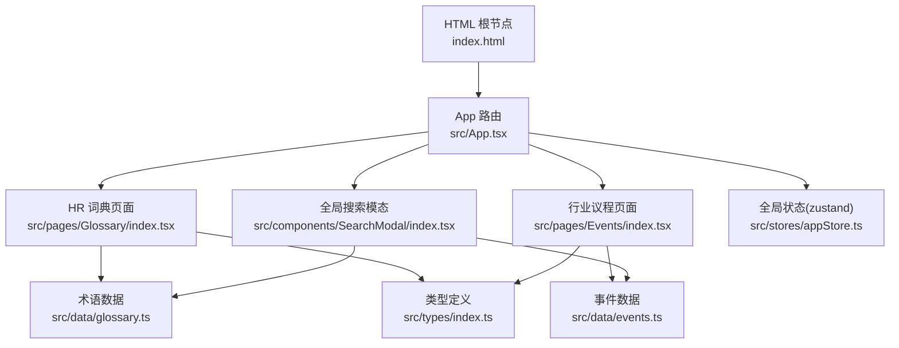
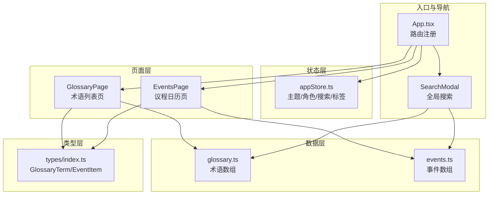
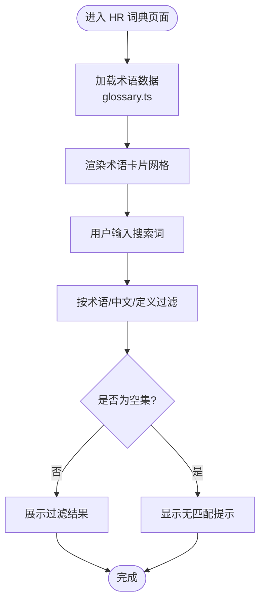
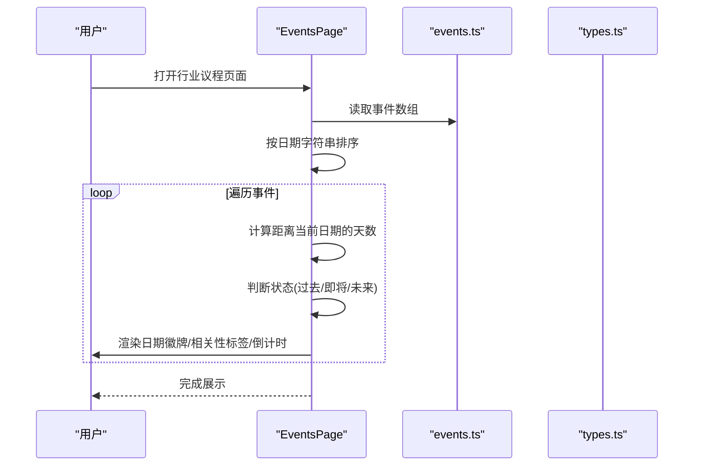
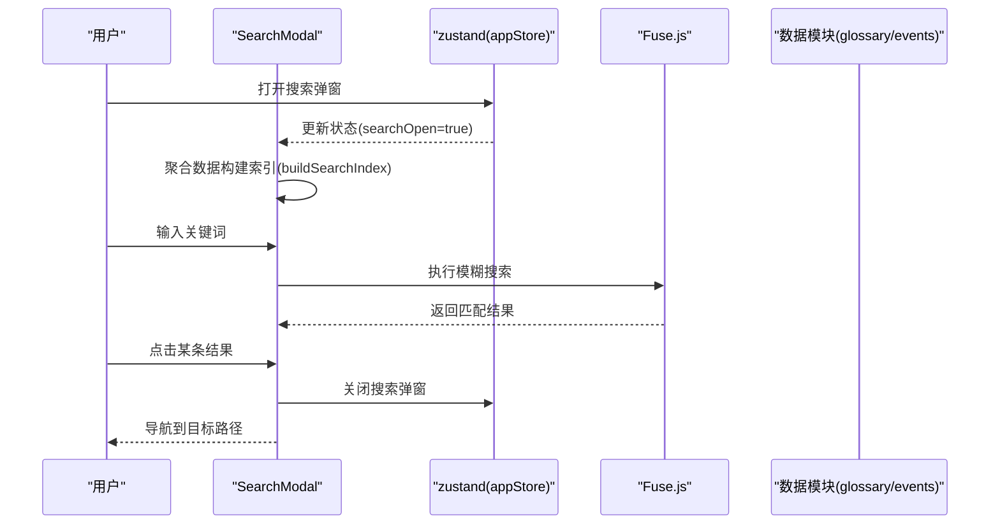
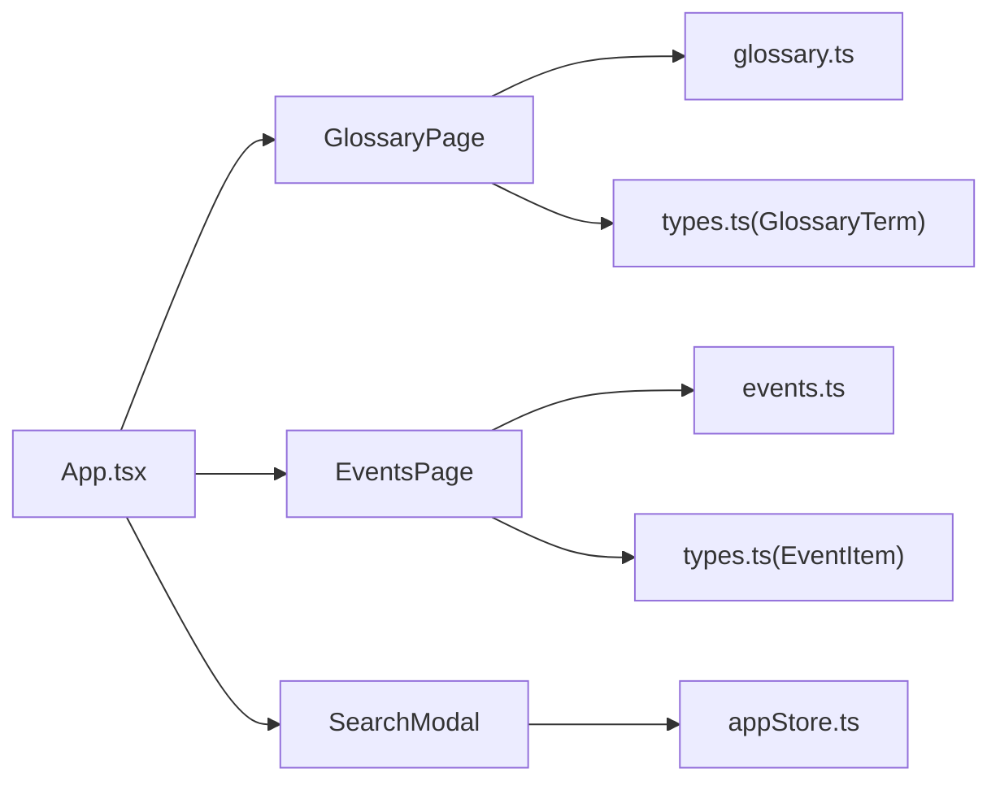
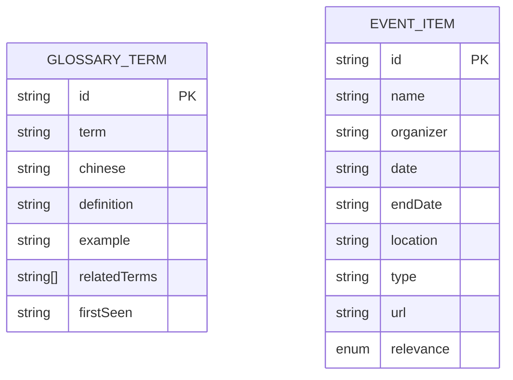

# 参考页面

<cite>
**本文引用的文件**
- [src/pages/Glossary/index.tsx](file://src/pages/Glossary/index.tsx)
- [src/data/glossary.ts](file://src/data/glossary.ts)
- [src/pages/Events/index.tsx](file://src/pages/Events/index.tsx)
- [src/data/events.ts](file://src/data/events.ts)
- [src/components/SearchModal/index.tsx](file://src/components/SearchModal/index.tsx)
- [src/types/index.ts](file://src/types/index.ts)
- [src/stores/appStore.ts](file://src/stores/appStore.ts)
- [src/App.tsx](file://src/App.tsx)
- [index.html](file://index.html)
</cite>

## 目录
1. [简介](#简介)
2. [项目结构](#项目结构)
3. [核心组件](#核心组件)
4. [架构总览](#架构总览)
5. [组件详解](#组件详解)
6. [依赖关系分析](#依赖关系分析)
7. [性能考量](#性能考量)
8. [故障排查指南](#故障排查指南)
9. [结论](#结论)
10. [附录](#附录)

## 简介
本文件聚焦“参考页面”中的两个核心页面：HR 词典与行业议程。文档系统性阐述以下方面：
- HR 词典：术语定义、中英对照、示例、关联术语、首次出现日期、搜索过滤与展示逻辑。
- 行业议程：事件日历排序、时间线展示、地点标注、相关性标签、倒计时与状态提示。
- 数据模型：术语与事件的数据结构、字段语义与约束。
- 时间处理：相对天数计算、当前日期基准、排序规则。
- 国际化与本地化：语言设置、日期格式、主题适配。
- 维护策略与更新流程：数据来源、版本控制、内容校验。
- 用户体验优化：加载动画、视觉反馈、无障碍与可访问性。

## 项目结构
参考页面由页面组件、数据模块、类型定义与全局状态共同构成，路由在应用入口统一注册。

图表来源
- [src/App.tsx:14-34](file://src/App.tsx#L14-L34)
- [src/pages/Glossary/index.tsx:1-73](file://src/pages/Glossary/index.tsx#L1-L73)
- [src/pages/Events/index.tsx:1-94](file://src/pages/Events/index.tsx#L1-L94)
- [src/data/glossary.ts:1-17](file://src/data/glossary.ts#L1-L17)
- [src/data/events.ts:1-13](file://src/data/events.ts#L1-L13)
- [src/components/SearchModal/index.tsx:1-156](file://src/components/SearchModal/index.tsx#L1-L156)
- [src/stores/appStore.ts:1-93](file://src/stores/appStore.ts#L1-L93)
- [index.html:1-17](file://index.html#L1-L17)

章节来源
- [src/App.tsx:14-34](file://src/App.tsx#L14-L34)

## 核心组件
- HR 词典页面：负责渲染术语卡片网格，支持中英关键词搜索过滤，并提供逐项动画与“无匹配”提示。
- 行业议程页面：负责按日期排序展示活动，标注相关性等级、倒计时与状态，支持起止日期展示。
- 全局搜索模态：聚合多板块内容构建搜索索引，支持跨板块检索并跳转。
- 类型系统：统一术语与事件的数据契约，保证页面与数据层一致。
- 全局状态：管理主题、用户角色、收藏、阅读历史与搜索弹窗开关。

章节来源
- [src/pages/Glossary/index.tsx:6-72](file://src/pages/Glossary/index.tsx#L6-L72)
- [src/pages/Events/index.tsx:18-93](file://src/pages/Events/index.tsx#L18-L93)
- [src/components/SearchModal/index.tsx:47-155](file://src/components/SearchModal/index.tsx#L47-L155)
- [src/types/index.ts:129-187](file://src/types/index.ts#L129-L187)
- [src/stores/appStore.ts:35-92](file://src/stores/appStore.ts#L35-L92)

## 架构总览
参考页面围绕“数据-类型-页面-状态-路由”的分层组织，页面组件通过类型约束消费数据模块，全局状态提供跨页面共享能力，路由负责页面挂载与导航。

图表来源
- [src/pages/Glossary/index.tsx:1-73](file://src/pages/Glossary/index.tsx#L1-L73)
- [src/pages/Events/index.tsx:1-94](file://src/pages/Events/index.tsx#L1-L94)
- [src/data/glossary.ts:1-17](file://src/data/glossary.ts#L1-L17)
- [src/data/events.ts:1-13](file://src/data/events.ts#L1-L13)
- [src/types/index.ts:129-187](file://src/types/index.ts#L129-L187)
- [src/stores/appStore.ts:1-93](file://src/stores/appStore.ts#L1-L93)
- [src/App.tsx:14-34](file://src/App.tsx#L14-L34)
- [src/components/SearchModal/index.tsx:1-156](file://src/components/SearchModal/index.tsx#L1-L156)

## 组件详解

### HR 词典页面（术语定义与搜索）
- 功能要点
  - 展示术语卡片网格，包含术语、中文释义、示例与关联术语。
  - 支持中英文关键词搜索，过滤条件包括术语名、中文、定义。
  - 使用动画逐项入场，提升浏览体验。
  - 当无匹配时显示提示文案。
- 关键实现路径
  - 页面组件与过滤逻辑：[src/pages/Glossary/index.tsx:6-72](file://src/pages/Glossary/index.tsx#L6-L72)
  - 术语数据源：[src/data/glossary.ts:3-16](file://src/data/glossary.ts#L3-L16)
  - 术语数据模型：[src/types/index.ts:129-138](file://src/types/index.ts#L129-L138)

图表来源
- [src/pages/Glossary/index.tsx:6-72](file://src/pages/Glossary/index.tsx#L6-L72)
- [src/data/glossary.ts:3-16](file://src/data/glossary.ts#L3-L16)

章节来源
- [src/pages/Glossary/index.tsx:6-72](file://src/pages/Glossary/index.tsx#L6-L72)
- [src/data/glossary.ts:3-16](file://src/data/glossary.ts#L3-L16)
- [src/types/index.ts:129-138](file://src/types/index.ts#L129-L138)

### 行业议程页面（事件日历与时间线）
- 功能要点
  - 按日期升序排序展示活动，支持起止日期与单日日期。
  - 显示月份缩写与日期数字作为日期徽牌。
  - 标注组织者、地点与相关性等级（高/中/低）。
  - 计算距离当前日期的天数，区分过去、即将发生与未来。
  - 对“今天”进行特殊样式提示。
- 关键实现路径
  - 排序与倒计时逻辑：[src/pages/Events/index.tsx:18-16](file://src/pages/Events/index.tsx#L18-L16)
  - 日历条目渲染与状态判断：[src/pages/Events/index.tsx:30-93](file://src/pages/Events/index.tsx#L30-L93)
  - 事件数据源：[src/data/events.ts:3-12](file://src/data/events.ts#L3-L12)
  - 事件数据模型：[src/types/index.ts:176-187](file://src/types/index.ts#L176-L187)

图表来源
- [src/pages/Events/index.tsx:18-93](file://src/pages/Events/index.tsx#L18-L93)
- [src/data/events.ts:3-12](file://src/data/events.ts#L3-L12)
- [src/types/index.ts:176-187](file://src/types/index.ts#L176-L187)

章节来源
- [src/pages/Events/index.tsx:18-93](file://src/pages/Events/index.tsx#L18-L93)
- [src/data/events.ts:3-12](file://src/data/events.ts#L3-L12)
- [src/types/index.ts:176-187](file://src/types/index.ts#L176-L187)

### 全局搜索模态（跨板块检索）
- 功能要点
  - 聚合每日日报信号、竞对与 AI 公司、研究与阅读、转型案例、HR 词典等数据构建索引。
  - 使用模糊搜索算法返回前若干条结果，支持点击跳转。
  - 在搜索框打开时自动聚焦，关闭时清空查询。
- 关键实现路径
  - 搜索索引构建与查询：[src/components/SearchModal/index.tsx:22-59](file://src/components/SearchModal/index.tsx#L22-L59)
  - 结果渲染与跳转：[src/components/SearchModal/index.tsx:114-139](file://src/components/SearchModal/index.tsx#L114-L139)
  - 术语与事件参与索引：[src/components/SearchModal/index.tsx:41-43](file://src/components/SearchModal/index.tsx#L41-L43)

图表来源
- [src/components/SearchModal/index.tsx:47-155](file://src/components/SearchModal/index.tsx#L47-L155)
- [src/stores/appStore.ts:69-71](file://src/stores/appStore.ts#L69-L71)
- [src/components/SearchModal/index.tsx:22-59](file://src/components/SearchModal/index.tsx#L22-L59)
- [src/components/SearchModal/index.tsx:41-43](file://src/components/SearchModal/index.tsx#L41-L43)

章节来源
- [src/components/SearchModal/index.tsx:47-155](file://src/components/SearchModal/index.tsx#L47-L155)
- [src/stores/appStore.ts:69-71](file://src/stores/appStore.ts#L69-L71)

### 数据模型与类型约束
- 术语模型（GlossaryTerm）
  - 字段：id、term、chinese、definition、example、relatedTerms、firstSeen。
  - 用途：HR 词典页面渲染与搜索。
- 事件模型（EventItem）
  - 字段：id、name、organizer、date、endDate、location、type、url、relevance。
  - 用途：行业议程页面渲染与排序。
- 相关类型
  - SourceType、Signal、ResearchPaper、TransformCase、Reading 等用于其他页面，但与参考页面的类型边界清晰。

章节来源
- [src/types/index.ts:129-138](file://src/types/index.ts#L129-L138)
- [src/types/index.ts:176-187](file://src/types/index.ts#L176-L187)

### 时间处理逻辑
- 行业议程
  - 排序：基于日期字符串字典序比较。
  - 倒计时：以固定基准日期为起点，计算目标日期与当前日期的天数差。
  - 状态：过去、即将（0-30 天）、未来三档。
- HR 词典
  - 术语包含“首次出现日期”，可用于时间线或版本追踪，但页面未直接展示该字段。

章节来源
- [src/pages/Events/index.tsx:18-16](file://src/pages/Events/index.tsx#L18-L16)
- [src/pages/Events/index.tsx:30-93](file://src/pages/Events/index.tsx#L30-L93)
- [src/data/glossary.ts:3-16](file://src/data/glossary.ts#L3-L16)

### 国际化与本地化支持
- 语言环境
  - HTML 根节点指定 zh-CN，确保日期与数字本地化。
- 日期格式
  - 使用本地化 API 输出月份缩写与日期数字，符合中文习惯。
- 主题适配
  - 全局状态管理明暗主题切换，页面组件根据类名切换深色模式。
- 多语言扩展建议
  - 当前页面文本为中文，若需国际化，建议引入 i18n 库与翻译资源，按组件拆分词条并集中管理。

章节来源
- [index.html:2](file://index.html#L2)
- [src/pages/Events/index.tsx:49-53](file://src/pages/Events/index.tsx#L49-L53)
- [src/stores/appStore.ts:39-47](file://src/stores/appStore.ts#L39-L47)

## 依赖关系分析
- 页面到数据
  - GlossaryPage 依赖 glossary.ts 中的术语数组。
  - EventsPage 依赖 events.ts 中的事件数组。
- 页面到类型
  - 两者均依赖 types.ts 中的 GlossaryTerm 与 EventItem 接口。
- 页面到状态
  - SearchModal 依赖 appStore.ts 管理搜索弹窗状态。
- 页面到路由
  - App.tsx 注册路由，使页面可被访问。

图表来源
- [src/pages/Glossary/index.tsx:1-73](file://src/pages/Glossary/index.tsx#L1-L73)
- [src/pages/Events/index.tsx:1-94](file://src/pages/Events/index.tsx#L1-L94)
- [src/data/glossary.ts:1-17](file://src/data/glossary.ts#L1-L17)
- [src/data/events.ts:1-13](file://src/data/events.ts#L1-L13)
- [src/types/index.ts:129-187](file://src/types/index.ts#L129-L187)
- [src/stores/appStore.ts:1-93](file://src/stores/appStore.ts#L1-L93)
- [src/App.tsx:14-34](file://src/App.tsx#L14-L34)

章节来源
- [src/App.tsx:14-34](file://src/App.tsx#L14-L34)

## 性能考量
- 过滤复杂度
  - HR 词典：线性过滤 O(n)，n 为术语数量；建议在术语规模扩大时引入索引或服务端分页。
- 搜索复杂度
  - 全局搜索：构建索引一次，查询基于模糊匹配；建议限制索引大小与匹配阈值，避免过度计算。
- 渲染优化
  - 使用动画入场时注意延迟叠加，避免大量元素同时渲染造成卡顿；可考虑虚拟滚动或分页。
- 日期计算
  - 倒计时计算为常量时间操作，性能开销极小；保持基准日期稳定可减少重复计算。

## 故障排查指南
- 术语搜索无结果
  - 检查输入是否包含中英文关键词；确认术语数据是否正确加载。
  - 参考路径：[src/pages/Glossary/index.tsx:6-11](file://src/pages/Glossary/index.tsx#L6-L11)
- 议程日期显示异常
  - 确认日期字符串格式为 YYYY-MM-DD；检查排序逻辑与当前日期基准。
  - 参考路径：[src/pages/Events/index.tsx:18-16](file://src/pages/Events/index.tsx#L18-L16)
- 搜索弹窗无法关闭或聚焦
  - 检查全局状态开关与副作用钩子；确认 DOM 引用是否正确。
  - 参考路径：[src/stores/appStore.ts:69-71](file://src/stores/appStore.ts#L69-L71), [src/components/SearchModal/index.tsx:61-67](file://src/components/SearchModal/index.tsx#L61-L67)
- 主题切换无效
  - 检查主题设置函数是否更新根节点类名；确认系统主题监听逻辑。
  - 参考路径：[src/stores/appStore.ts:39-47](file://src/stores/appStore.ts#L39-L47)

章节来源
- [src/pages/Glossary/index.tsx:6-11](file://src/pages/Glossary/index.tsx#L6-L11)
- [src/pages/Events/index.tsx:18-16](file://src/pages/Events/index.tsx#L18-L16)
- [src/stores/appStore.ts:39-47](file://src/stores/appStore.ts#L39-L47)
- [src/components/SearchModal/index.tsx:61-67](file://src/components/SearchModal/index.tsx#L61-L67)

## 结论
HR 词典与行业议程作为参考页面，分别承担术语知识沉淀与行业动态聚合的职责。通过清晰的数据模型、稳定的排序与时间处理逻辑、以及可扩展的搜索与状态管理，实现了良好的可用性与可维护性。后续可在性能与国际化方面进一步增强，以支撑更大规模的数据与更广泛的用户群体。

## 附录

### 维护策略与内容更新流程
- 数据来源与版本控制
  - 将术语与事件数据置于独立模块，便于版本化管理与变更追踪。
  - 建议在 CI 中加入数据校验步骤（如字段完整性、日期格式、枚举值范围）。
- 内容更新流程
  - 新增术语/事件：在对应数据模块追加条目，补充必要字段。
  - 修改字段：同步更新类型定义与页面渲染逻辑，确保向后兼容。
  - 删除条目：先下线旧链接与索引，再清理数据。
- 用户体验优化
  - 增加分页或虚拟滚动，降低长列表渲染压力。
  - 为搜索结果添加高亮与上下文片段，提升定位效率。
  - 提供“最近更新”或“版本说明”入口，帮助用户了解变化。

### 数据模型图

图表来源
- [src/types/index.ts:129-138](file://src/types/index.ts#L129-L138)
- [src/types/index.ts:176-187](file://src/types/index.ts#L176-L187)